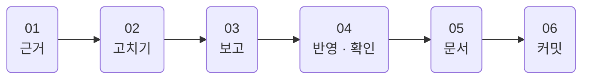
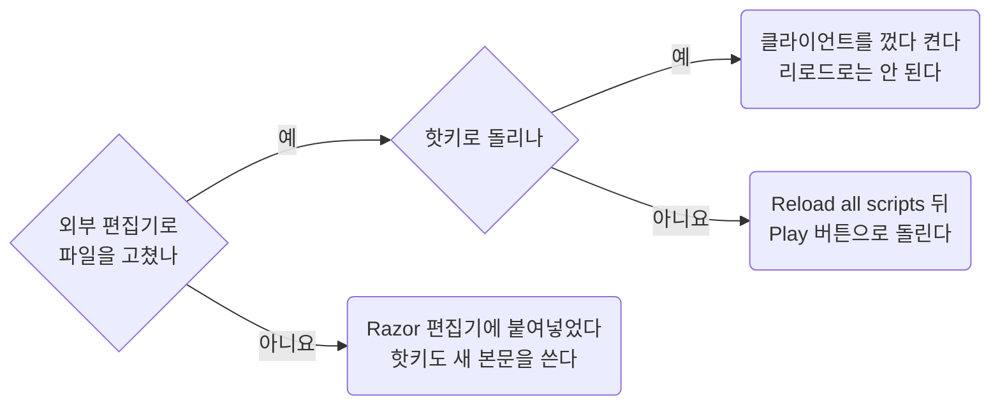

무엇을 근거로 삼고, 스크립트와 문서를 어떤 순서로 고치고, 게임에 어떻게 반영해 확인하고, 어떻게 커밋하는가.
파일 이름과 스크립트 모양은 [conventions.md](conventions.md), 문법과 함정은 [razor.md](razor.md)에 있다.

## 00 한눈에

| 절 | 무엇을 답하나 |
| --- | --- |
| [01](#01) | 무엇을 근거로 삼나. 어느 사이트를 믿고, 숫자는 어떻게 인용하나 |
| [02](#02) | 스크립트를 어떤 순서로 고치나 |
| [03](#03) | 변경을 보고할 때 무엇을 넣나 |
| [04](#04) | 고친 것을 게임에 어떻게 반영하나. 리로드냐 재시작이냐, 캐시와 종료가 무엇을 덮어쓰나 |
| [05](#05) | 문서 쓰는 법은 어디 있나, 글은 어느 언어로 쓰나 |
| [06](#06) | 언제, 어떤 메시지로 커밋하나 |

이 문서에 걸린 질문은 [open-items.md](open-items.md)에 모았다.

::part[근거]

## 01 근거

### 01.A 우선순위

사용자 요청 > [AGENTS.md](https://github.com/minu-ha/uoo/blob/master/AGENTS.md)와 `blueprint/`의 규칙 문서 > 같은 폴더의 기존 스크립트 > 공식 위키.

### 01.B 참고 사이트

| 용도 | 링크 |
| --- | --- |
| Outlands Razor 문법 (확장 명령 포함, 1순위) | [https://wiki.uooutlands.com/Razor_Scripting](https://wiki.uooutlands.com/Razor_Scripting) |
| 게임 메커니즘, 아이템, 몹 | [https://wiki.uooutlands.com/](https://wiki.uooutlands.com/) |
| Razor CE 기본 문법 (Outlands가 포크한 원본) | [https://www.razorce.com/guide/](https://www.razorce.com/guide/) |
| 스크립트 라이브러리 (Jaseowns 등 공개 스크립트) | [https://outlands.uorazorscripts.com/](https://outlands.uorazorscripts.com/) |
| Storage Shelf 로드아웃 스크립트 생성 | [https://www.outlandsbutler.com/](https://www.outlandsbutler.com/) |
| 공식 포럼 | [https://forums.uooutlands.com/](https://forums.uooutlands.com/) |

문법이 애매하면 추측하지 말고 위키를 읽는다. Outlands Razor는 Razor CE에 없는 명령이 많다 ([razor.md](razor.md)).

### 01.C 숫자는 인용한다

게임 숫자 (공식, 쿨다운, 확률)는 추측하지 않는다.

| 숫자 | 어디서 |
| --- | --- |
| 바드, 네크로, 소환수 | [bard-necro-handbook.md](bard-necro-handbook.md) |
| PvP 규칙 | [pvp.md](pvp.md) |
| 아이템 graphic id, hue | [item-list.md](item-list.md). 상점 가격은 `script/loot/stock-vendor.razor` 상단이 정본 |
| 주문 데미지 메모 | [hotkeys.md](hotkeys.md#06) 06절 |

없으면 위키를 읽고 해당 문서에 더한다. 더할 때:

- 인용문은 위키 또는 공식 패치노트 원문 그대로 `>` 인용으로 적고, 해석은 인용문 아래에 따로 적는다.
- 인게임에서 확인한 것은 "인게임 확인됨 2026-09-28"처럼 날짜를 붙여 적고, 확인하지 못한 것은 "확인되지 않았다"로 남긴다.

::part[스크립트]

## 02 스크립트 고치기

1. **대상 스크립트를 끝까지 읽는다.** 메인 루프 하나에 타이머, 타겟 캐시, 후속 캐스팅이 얽혀 있어 한 분기만 고치면 다른 분기가 깨진다.
2. [razor.md](razor.md#03) 03절의 확인된 함정 표를 본다. 새 패턴은 그 문서 04절의 선례에서 먼저 찾는다.
3. 요청 범위만 구현한다. 저장소에 근거 없는 패턴은 추가하지 않는다.
4. 고친 뒤 `util/check.sh <파일>`로 `if/endif`, `while/endwhile`, `for/endfor` 짝과 선언 없이 쓴 접두 변수를 확인한다.
5. 새 전투 루프를 만들면 [script/README.md](https://github.com/minu-ha/uoo/blob/master/script/README.md)의 전투 루프 표에 한 줄 더한다.

## 03 변경 보고

변경을 보고할 때 반드시 넣는다.

- 추가·변경된 변수와 타이머.
- 인게임 확인 절차: 어떤 상황에서 어떤 `overhead`가 떠야 하고, 어떤 상황이면 실패인지.
- 04절의 반영 방법 (리로드로 되는지, 재시작이 필요한지)과 종료 후 `git status` 확인.
- 답을 받지 못한 질문. 사용자가 나중에 볼 수 있게 [open-items.md](open-items.md)에도 더한다.

## 04 게임에 반영하고 확인하기

### 04.A 스크립트 캐시와 리로드

Razor는 스크립트 본문을 메모리에 캐시한다. 고친 본문을 반영하는 방법은 어디서 고쳤는지와 어떻게 돌리는지로 갈린다.

- **핫키로 돌리면 클라이언트를 껐다 켠다. 리로드로는 절대 안 된다.** 리로드는 기존 객체를 교체하지 않고 **새 객체를 목록에 덧붙인다.**
  프로필에는 바인딩이 객체가 아니라 이름 (`Play Script: hotkey\dress`)으로 저장돼 있어서, 키를 누르면 같은 이름 중 **맨 앞의 옛 객체**가 잡힌다.
- **Scripts 탭의 Play 버튼으로 돌리면 리로드로 충분하다.** Scripts 탭을 다시 열거나 우클릭 → Reload all scripts를 한다. 반복 테스트는 이쪽으로 한다.
- **조립한 루프** (`script/combat/*`, `script/gather/*`)는 모듈과 레시피를 고치고 `node util/build-scripts.mjs`로 다시 만든 뒤 위와 같이 반영한다.
  Razor 편집기에서 고치면 다음 조립이 덮어쓴다 ([modules.md](modules.md#07) 07절).
- **Razor 편집기에 직접 붙여넣으면** 기존 객체의 본문이 바뀌므로 핫키도 새 본문을 쓴다. 다만 그 순간부터 **Razor가 그 파일의 주인**이 되니,
  외부 편집기로 고치는 것과 섞지 않는다 (04.B절).

리로드할 때마다 Hotkeys 목록에 `Play Script: ... (not assigned)`가 한 줄씩 쌓인다 (메모리에만, 파일엔 안 남는다).

**파일을 고쳤는데도 스크립트 에러가 같은 줄 번호를 계속 가리키면 캐시를 의심한다.** 줄을 지웠다면 그 아래 줄 번호도 같이 당겨져야 한다.
Reload all scripts로 안 풀리면 클라이언트를 완전히 껐다 켠다.

### 04.B 캐시가 파일을 되돌린다

- 캐시가 옛 본문을 들고 있는 상태로 클라이언트를 끄면 Razor가 그 본문을 파일에 다시 쓴다. 외부 편집기로 고친 내용이 되돌아갈 수 있으니
  **종료 후 `git status`로 확인한다.**
- 리로드를 반복하면 **옛 본문을 든 객체가 계속 쌓이므로 이 위험이 같이 커진다.** 이것도 재시작이 답이다.
- 외부 편집기로 스크립트를 고치는 프로필은 Razor 설정 `AutoSaveScript`를 꺼 둔다.

### 04.C config는 종료할 때 덮어쓴다

**`config/` 아래 파일은 게임을 끈 상태에서만 고친다.** 종료 시 클라이언트가 통째로 덮어쓰기 때문이다.
Razor 프로필 xml뿐 아니라 ClassicUO의 `cooldowns.xml`, `macros.xml` 등 전부 해당된다.
켜둔 채로 고치면 종료할 때 조용히 사라진다. 실제로 한 번 날아갔다.

::part[문서 · 커밋]

## 05 문서 고치기

설계 문서를 쓰고 고치는 법 (새 문서, 빈 틀, 짜임, 번호와 가름, 본문, 흐름도, 끝낼 때 확인)은 [writing.md](writing.md)에 있다.
여기에는 저장소의 모든 글에 걸리는 규칙만 둔다.

### 05.A 언어와 번역본

- 문서와 답변은 한국어, 스크립트 안 주석은 영어.
- 사람이 처음 보는 README는 영어가 원본이다. 번역본은 `language/`에 `<무엇>.<언어>.md`로 둔다
  (`language/README.ko.md`는 루트 README, `language/config.ko.md`는 `config/README.md`).
- `blueprint/`는 예외다. 홈 `blueprint/README.md`도 다른 문서처럼 한국어로 쓰고 번역본을 두지 않는다.
- 원본 맨 위에 번역본 링크, 번역본 맨 위에 원본 링크를 둔다. 원본을 고치면 번역본도 같은 커밋에서 고친다.

## 06 커밋

커밋 규칙은 [AGENTS.md](https://github.com/minu-ha/uoo/blob/master/AGENTS.md) 1절이 정본이다. 여기에는 제목의 예만 둔다.

| 좋음 | 나쁨 | 왜 |
| --- | --- | --- |
| `Regroup scripts by activity` | `feat: regroup` | 접두를 쓰지 않는다 |
| `Add eval rotation to bard-necro` | `update` | 무엇을 바꿨는지가 없다 |
| `Fix stuck target loop in bard-mace` | `스크립트 수정` | 영어가 아니고, 대상과 동작이 없다 |
