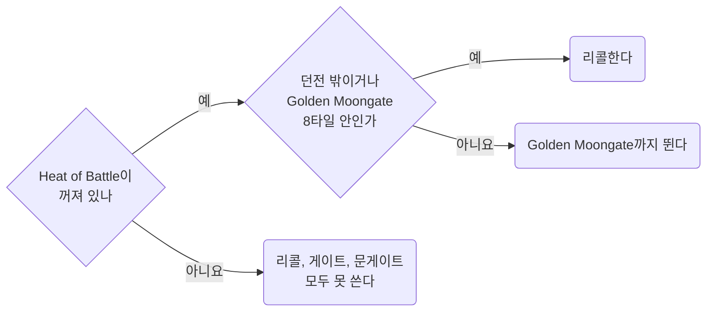

템플릿과 상관없는 PvP 서버 규칙과 숫자를 모은 문서다. 위키와 패치노트의 원문을 인용하고, 해석은 인용 아래에 적는다.
인게임에서 확인한 것은 그렇게 적었고, 확인하지 못한 것은 "확인되지 않았다"로 남겼다.

- Bard Necro가 이 규칙으로 내린 판단은 [Bard Necro](../templates/bard-necro.md#06) 06절에 있다. Defensive Barding, 도주할지 반격할지, Herding 대신 Resist를 고른 이유가 거기 있다.
- 벌목 겸 PvP 템플릿의 스킬, 스탯, 도끼 선택과 교전 분기는 [Lumberjack PvP](../templates/lumberjack-pvp.md)에 있다.
- PvP에서 막히는 스크립트 명령은 [Razor](../scripting/razor.md#07) 07절에 있다.

## <a id="00"></a>00 한눈에

| 절 | 무엇을 답하나 |
| --- | --- |
| [01](#01) | PK를 공격하면 무엇이 막히나 |
| [02](#02) | 공격이 맞을 확률은 어떻게 정해지나 |
| [03](#03) | Hamstring은 얼마나 묶고, 다시 걸려면 얼마나 기다리나 |
| [04](#04) | Telekinesis와 폭발 포션은 어떻게 막나 |
| [05](#05) | 주문으로 싸울 때 시전은 언제 끊기고, 숫자는 얼마인가 |
| [06](#06) | 소환수는 왜 PvP에서 약한가 |
| [07](#07) | 패링은 무엇을 막고 무엇을 못 막나 |
| [08](#08) | Resist는 PvP에서 얼마나 줄이나 |
| [09](#09) | 맨손이나 레슬링으로 되받아칠 수 있나 |
| [10](#10) | PK를 먼저 보려면 어떻게 하나 |
| [11](#11) | 자주 틀렸던 생각은 무엇인가 |
| [12](#12) | 출처는 어디인가 |

이 문서에 걸린 질문은 [Open items](../questions/open-items.md)에 모았다.

::part[서버 규칙]

## <a id="01"></a>01 공격적 행동과 Heat of Battle

**다른 플레이어에게 공격적 행동을 하면 Heat of Battle이 켜진다.** 켜져 있는 동안에는 리콜, 게이트, 문게이트를 쓸 수 없고, 여관 방에도 들어가지 못한다.
바드는 여기에 Defensive Barding까지 잃는다([Bard Necro](../templates/bard-necro.md#06.A) 06.A절). 그래서 바드의 방어 숫자(02.C절, 08절)는 Heat of Battle이 켜졌는지에 따라 갈린다.

### <a id="01.A"></a>01.A 무엇이 켜는가

**PK를 향한 공격 가운데 Heat of Battle을 켜지 않는다고 적힌 것은 자동 반격 스윙 하나뿐이다.** 누가 나를 칠 때 캐릭터가 저절로 되받아치는 스윙이다.
타겟을 바꿔 치거나, 훔치거나, 해로운 주문을 쓰면 상대가 먼저 쳤어도 켜진다.

> "Heat of Battle will be triggered by performing an aggressive action against another player regardless of notoriety, or when interacting with various faction content events or wayposts."
> "Aggressive actions include attacking or stealing from a player"
> "Aggressive actions do not include retaliatory empty-handed wrestling attacks or weapon swings your character makes when someone attacks you"
> "However, it is an aggressive action to re-target your attacker (for example, to avoid attacking monsters instead of the attacking player)"
> "Note also that using harmful spells (such as Weaken, Telekinesis, or Energy Bolt) will trigger Heat of Battle, even when used against an attacker"
> "Heat of battle will prevent the player from utilizing any moongates, recalling, or entering an inn room while it is active"

| 내 행동 | Heat of Battle |
| --- | --- |
| PK가 나를 칠 때 내 캐릭터가 자동으로 되받아치는 스윙 | **안 켜진다** |
| 몹을 치던 중 PK로 타겟을 바꾼다 | **켜진다.** 위키의 예시가 이 경우다 |
| 해로운 주문(Energy Bolt, Weaken, Telekinesis 등)을 쓴다 | **켜진다.** 상대가 먼저 쳤어도 그렇다 |
| 플레이어에게서 훔친다 | **켜진다** |
| 팩션 콘텐츠 이벤트나 waypost와 상호작용한다 | **켜진다** |
| Hamstring을 켜 둔 자동 반격 스윙 | 확인되지 않았다 |
| 나에게 거는 Telekinesis | 확인되지 않았다(04.A절) |
| 내 소환수가 PK를 친다 | 확인되지 않았다(06.A절) |

**"반격은 안 켜진다"는 자동 스윙에만 맞는 말이다.** 사냥 중에는 몹을 치고 있으므로, PK를 치려면 타겟을 바꿔야 하고 그 순간 켜진다.
거리를 두고 주문을 쓰는 메이지 PK에게는 자동 스윙이 나갈 일 자체가 없다.

### <a id="01.B"></a>01.B 지속시간

**빨강, 회색, 주황 플레이어를 치면 30초, 파랑을 쳐서 Criminal이 되면 2분이다.** 지속시간은 위키 문서에는 없고, 2020-09-28 패치 원문에 있다.

> "When any player commits a hostile action (including stealing) to another player, but the action is not considered a criminal action (such as attacking or stealing from a Red, Grey, or Orange
> player) they will have a 30 second Heat of Battle timer started"
> "When any player commits any Criminal action, they have will have a 2 minute Heat of Battle timer started that matches their Criminal Timer duration"
> "Heat of Battle now has a maximum duration of 5 minutes, regardless of circumstance"

| 내 행동 | Heat of Battle |
| --- | --- |
| 빨강, 회색, 주황 플레이어에게 공격적 행동을 한다 | 할 때마다 **30초** 타이머가 시작된다 |
| 파랑을 공격해 Criminal이 된다 | **2분.** Criminal 타이머와 같다 |
| 무엇을 했든 | 최대 **5분** |

### <a id="01.C"></a>01.C 던전에서는 Golden Moongate 곁에서만 리콜된다

**던전 안에서는 Golden Moongate 8타일 안에서만 리콜된다.** Heat of Battle이 켜져 있으면 그곳에서도 리콜, 게이트, 문게이트가 막힌다.

> "Within dungeons, players may only cast Recall within 8 tiles of a Golden Moongate" -- Magery (Recall)
> "Any character can cast this spell from a scroll in a rune book or rune tome, or from a scroll onto a loose marked rune, even with 0 Magery skill" -- Magery (Recall)
> "When a player is in the Heat of Battle they are unable to cast Recall, Gate, or use any Moongates" -- Magery



- 룬북으로 리콜하는 데는 Magery가 0이어도 된다.
- 던전에서 PK를 만나면 Golden Moongate까지 뛰어서 도망친다. 가는 길에 PK에게 공격적 행동을 하면 Heat of Battle이 켜져서 그 문게이트도 못 쓴다.
  먼저 공격하지 않은 바드는 그동안 Defensive Barding으로 버틴다(02.C절).
- 리콜도 시전이다. 시전하는 동안 근접 한 대나 해로운 주문에 맞으면 끊긴다(02.E절, 05절).

## <a id="02"></a>02 명중률

**명중률은 양쪽이 지금 손에 든 것의 스킬끼리 겨뤄서 정해진다.** 가진 다른 스킬은 판정에 들어가지 않는다.

> "The chance to hit with a mace class weapon is equal to (attacker's mace fighting skill + 50) / ((defender's weapon or wrestling skill + 50) \* 2)
> plus any relevant accuracy bonuses" -- Mace Fighting
> "The chance to hit and defend with fists (avoiding interrupts while casting) is equal to (attacker's wrestling skill + 50) / ((defender's weapon or wrestling skill + 50) \* 2) plus any relevant
> accuracy bonuses." -- Wrestling
> "Due to Wrestling's defense bonus being active when unarmed (or when holding a spellbook) it can be used to defend against melee attacks while casting spells." -- Wrestling

Swordsmanship도 같은 꼴이다.

```
명중률 = (공격자 스킬 + 50) / ((방어자 스킬 + 50) x 2)
```

|  | 쓰이는 스킬 |
| --- | --- |
| 공격자 | 든 무기의 스킬. 맨손이나 레슬링 무기면 Wrestling |
| 방어자 | 든 무기의 스킬. 맨손이나 스펠북이면 Wrestling |

### <a id="02.A"></a>02.A 스킬 대 스킬, 명중 보너스 0

| 공격 \\ 방어 | 0 | 50 | 80 | 100 |
| --- | --- | --- | --- | --- |
| **0** | 50% | 25% | 19.2% | 16.7% |
| **50** | 100% | 50% | 38.5% | 33.3% |
| **80** | 100% | 65% | 50% | 43.3% |
| **100** | 100% | 75% | 57.7% | 50% |

- **같은 숫자끼리는 언제나 50%다.**
- 방어가 0이면 공격 50은 꼭 100%이고, 80과 100은 공식값이 1을 넘는다(130%, 150%). 표에는 100%로 적었다.

### <a id="02.B"></a>02.B 내가 칠 때

**메이지 PK를 칠 때 내 쪽에서 판정에 들어가는 것은 손에 든 무기의 스킬뿐이다.** 내 레슬링은 내가 레슬링으로 칠 때만 들어간다.

| 나 (손에 든 것) | 상대 (손에 든 것) | 계산 | 명중 |
| --- | --- | --- | --- |
| 메이스 100 | 무기 100 | 150 / 300 | 50% |
| 맨손, 레슬링 100 | 맨손, 레슬링 100 | 150 / 300 | 50% |
| 맨손, 레슬링 0 | 맨손, 레슬링 100 | 50 / 300 | 16.7% |
| 맨손, 레슬링 100 | 맨손, 레슬링 0 | 150 / 100 | 100% |
| 맨손, 레슬링 0 | 무기 100 | 50 / 300 | 16.7% |
| 레슬링 무기, 레슬링 80 | 메이지 PK (스펠북, 레슬링 100, 무기 0) | 130 / 300 | **43.3%** |
| 메이스 100, 레슬링 0 | 메이지 PK (스펠북, 레슬링 100) | 150 / 300 | **50%** |
| 메이스 80 | 메이지 PK (스펠북, 레슬링 100) | 130 / 300 | **43.3%** |
| 메이스 100 | 무기 100 + 레슬링 100, **무기를 든 상태** | 150 / 300 | 50%. 상대 레슬링은 안 쓰인다 |
| 메이스 100 | 무기 100 + 레슬링 100, **스펠북을 든 상태** | 150 / 300 | 50% |
| 메이스 100 | 무기 100 + 레슬링 0, **스펠북을 든 상태** | 150 / 100 | 100% |

- 80으로 치면 메이스든 레슬링 무기든 똑같이 43.3%다.
- 무기와 레슬링을 둘 다 가진 상대는 **지금 든 쪽**의 스킬로 방어한다.

### <a id="02.C"></a>02.C PK가 나를 칠 때, PK 무기 100

**Defensive Barding의 Effective Wrestling은 내가 맨손일 때만 방어에 끼어든다.** 무기를 들면 방어는 그 무기의 스킬로 한다.
Heat of Battle이 켜지면 printed 값만 남는다.

| 내 손 | Defensive Barding 켜짐 | Heat of Battle 중 |
| --- | --- | --- |
| 맨손, printed 레슬링 0 | 50% (Effective 100) | **100%** |
| 맨손, printed 레슬링 80 | 50% (Effective 100) | 57.7% |
| 레슬링 무기, printed 레슬링 80 | 확인되지 않았다 ("while unarmed") | 57.7% |
| 메이스 80 | 57.7% | 57.7% |
| 메이스 100 | 50% | 50% |

### <a id="02.D"></a>02.D 명중 보너스

> "Accuracy bonuses to melee weapons from items (Colored Materials, Magical Properties, Aspects, Mastery Chains, etc)
> are now capped by a player's base melee skill for that weapon." -- Armor & Weapons
> "Players will receive bonuses against creatures based on what "setup" they have for weapons/shields occupying their hands" -- Wrestling

- 위 표는 보너스 0을 기준으로 했다. **공식은 보너스를 "plus"로만 적는다.** 보너스 10%가 명중률에 10%p를 더하는지, 1.1배를 하는지는 위키에 없다.
- Weapon Setup 보너스(한손 무방패 Accuracy 같은)는 크리처 상대 보너스라서 PvP에는 붙지 않는다.

### <a id="02.E"></a>02.E 메이지가 레슬링을 올리는 이유

> "Wrestling is very important to mage-types, as taking a melee hit will interrupt a spellcast in progress." -- Wrestling

**메이지 PK는 한 대 맞으면 시전이 끊긴다.** 그래서 메이지는 레슬링을 100까지 올리고, 이쪽은 무기 스킬을 올려야 한다.

Arcane Staff를 든 메이지는 방어 스킬이 다르다.

> "A players chance to hit/defend with an Arcane Staff is based on their Arcane skill, but is also capped by the lower printed value of Magery or Wrestling" -- Arcane Staff
> "PvP-based interrupts while casting with an Arcane Staff equipped will be resolved as normal using the player's Wrestling skill" -- Arcane Staff

근접 명중과 방어는 Arcane 스킬로 판정하되, printed Magery와 Wrestling 가운데 낮은 값을 넘지 못한다. 시전 중 PvP 인터럽트는 평소처럼 Wrestling으로 판정한다.

## <a id="03"></a>03 Hamstring

**걸린 쪽은 3초 동안 걷는다. 거는 쪽은 빗나가면 15초, 맞히면 30\~53초 동안 다시 걸 수 없다.** 한 교전에 한 번 건다고 보면 된다.

> "if Hamstring is toggled for a player, on a missed attack they will not be able to make another Hamstring attempt for 15 seconds"
> "On a successful hit when Hamstring is toggled, a player will have a cooldown of 30-53 seconds (100-25 dex) before they may make another Hamstring attempt to any target"
> "When a player is hit by a Hamstring effect, they will be reduced to 0 Stamina for 3 seconds (forcing them to walk), after which their stamina will return to its previous amount"
> "Once hamstrung, a player or creature cannot be affected by another hamstring effect for another 30 seconds"

| 무엇 | 얼마나 |
| --- | --- |
| Hamstring을 켠 공격이 빗나간다 | **15초** 동안 다시 못 건다 |
| Hamstring을 켠 공격이 맞는다 | **30\~53초**(Dex 100\~25) 동안 누구에게도 못 건다 |
| 걸린 쪽 | **3초** 동안 스태미나가 0이라 걷는다. 그 뒤 원래 스태미나로 돌아온다 |
| 한 번 걸린 쪽 | **30초** 동안 다시 걸리지 않는다 |

- Hamstring을 켠 첫 스윙의 명중률이 곧 성공률이다. 레슬링 100 메이지를 상대로 무기 80이면 43.3%, 100이면 50%다(02.B절).

#### 켜고 끄는 방법

> "Hamstring can be used via the client's "Stun" hotkey, or toggled by using \[Hamstring" --
> [Hamstring](https://wiki.uooutlands.com/Hamstring)

`[Hamstring`은 켜기만 하는 명령이 아니라 토글이다. 모드가 이미 켜져 있으면 다시 보내서 끈다.
`[HamstringUntoggleMode`는 모드가 저절로 풀리는 방식을 차례로 바꾼다. 성공한 뒤, 실패한 뒤, 모든 시도 뒤, Never Untoggle의 네 가지다.
Paperdoll → Help → Commands → Mechanics에서도 고를 수 있다. 토글을 요청했다고 해서 명중했거나 걸렸다고 보지 않는다.

#### PvP 요구조건

첫 줄을 채우고, 나머지 두 줄 가운데 하나를 채워야 한다.

> "80.0 or higher attacking weapon skill in Dual Wielding, Fencing, Mace Fighting, Swordsmanship, or Wrestling"
> "two of the following skills at 80.0 or higher; Anatomy, Arms Lore, Chivalry, Forensic Evaluation, Tracking, Wrestling"
> "two of the following weapon skills at 80.0 or higher (including attacking weapon skill); Archery, Dual Wielding, Fencing, Mace Fighting, Swordsmanship"

- Wrestling 80과 Anatomy 80이면 두 번째 줄(목록에서 두 개)을 채운다. 공격 스킬인 Wrestling을 목록에서 다시 세지 말라는 문구는 없다.
- 메이스로 걸려면 Mace 80에 목록에서 두 개를 더한다. Anatomy와 Tracking도 된다.
- 세 번째 줄(무기 두 개)의 PvP 목록에는 Wrestling이 없다. PvM 목록에는 있다.

## <a id="04"></a>04 Telekinesis와 폭발 포션

메이지 PK가 흔히 쓰는 첫 수다. **TK로 붙인 폭발 포션은 리콜해도 따라온다. 막는 길은 상대보다 먼저 나에게 TK를 거는 것이다.**

이 절에서는 TK를 셋으로 나눠 부른다. 자기 TK는 내가 나에게, 공격 TK는 내가 상대에게, 상대 TK는 상대가 나에게 거는 TK다.

### <a id="04.A"></a>04.A 규칙

규칙은 2020-09-28 패치 원문에 있다. 위키 Alchemy 문서에는
"Telekinesis is always required for sticking explosion potions to players regardless of skill level" 한 줄만 남아 있다.

> "If a player casts Telekinesis and successfully targets another player, it will apply a "Sticky" effect to the target player lasting 30 seconds"
> "If the same player that casted Telekinesis against a player throws an Explosive Potion at them within 30 seconds of the spellcast, the explosion potion will follow the movement of the target
> player, and when exploding will only damage the target player (and not other nearby players or creatures)"
> "If a "Stuck" potion on a player explodes, and both the thrower and the target player are within the radius of the blast, the damage from the potion will be split equally between the two players,
> instead of being dealt entirely to the target"
> "In some cases, players "stuck" with a explosive potion should consider "running the potion back" to the target to trigger the Splashback mechanic, both to reduce the damage on the explosion potion,
> but to also damage the thrower and potentially interrupt a spellcast if the thrower is currently casting"
> "Players can also cast Telekinesis on themselves as a defensive measure, since once Telekinesis is cast onto a player, no other player will be able to cast the spell on them for 30 seconds, and only
> the caster of the spell is allowed to stick potions onto a target that has Telekinesis active on them"
> "Telekinesis is a 3rd circle spell, requiring a minimum of 30 Magery to cast and 50 Magery to cast with 100% success"

삭제 표시가 붙은 위키 Explosion Potion 문서에는 이렇게 적혀 있다.

> "Explosion Potions stuck to another player with Telekinesis will now follow their target even if they change regions, such as crossing dungeon levels, exiting dungeons, recalling/gating/hiking, or
> using moongates"

- **붙은 포션은 리콜해도 따라온다.** 리콜로는 이 콤보를 피할 수 없다.
- **던진 사람 곁에서 터지면 데미지가 두 사람에게 반씩 나뉘고, 던진 사람의 시전이 끊길 수 있다.** 그래서 포션이 붙으면 던진 사람에게 달려가는 것(Splashback)도 방법이다.
- 자기 TK를 걸려면 Magery 30이 있어야 한다.

지금 위키의 Magery 주문표도 자기 TK로 막는 법을 적고 있다.

> "Players can cast the Telekinesis spell onto another player (PvP) to make the player "Sticky" for explosion potions for the next 30 seconds" -- Magery (Telekinesis)
> "or on themselves to block it from being cast on them." -- Magery (Telekinesis)

TK 쿨다운 제약은 2020-09-28 패치 원문에만 있고, 지금 위키에는 없다.

> "Each player has a global cooldown for casting Telekinesis in PvP, and can only successfuly apply it at most once every 30 seconds to any player (similar to Wall of Stone casting cooldowns)"
> "A player can only be hit by the Telekinesis spell (from all players) at most once every 30 seconds"
> "Whenever an Explosion Potion is "stuck" to a player, it immediately resets the 30 second Telekinesis casting cooldown against them (i.e other players cannot cast Telekinesis against that player for
> another 30 seconds after that point)"

- **자기 TK는 상대 TK보다 먼저 걸려야 한다.** 상대 TK가 먼저 맞으면 30초 동안 Sticky 상태이고, 그동안은 자기 TK도 걸리지 않는다.
- 자기 TK가 막는 것은 포션이 **붙는 것**이다. 던지는 것 자체는 막지 않는다. 붙지 않은 포션은 나를 따라오지 않는다.
- **자기 TK도 시전자의 글로벌 30초 쿨을 쓴다.** 나에게 성공한 뒤 그 쿨 동안은 상대에게 공격 TK를 걸 수 없다.
  인게임 확인됨 2026-09-30(사용자 보고). 반사된 TK를 어떻게 처리하는지는 별개이고, 04.C절에서 따로 다룬다.
- **상대가 자기 TK를 걸어 두었으면 내 공격 TK는 걸리지 않는다.** 걸려 있는 동안 그 사람에게 포션을 붙일 수 있는 것은 TK를 건 사람뿐이다.
- 포션이 붙으면 그 순간부터 30초 동안 다른 플레이어는 그 사람에게 TK를 걸 수 없다.
- 자기 TK는 "against another player"가 아니므로, 위키 정의대로라면 Heat of Battle을 켜지 않는다. 하지만 01.A절의 인용은 Telekinesis를 해로운 주문으로 꼽는다. 확인되지 않았다.

### <a id="04.B"></a>04.B TK 순서

자기 TK와 공격 TK는 같은 글로벌 쿨을 쓴다(04.A절). 그래서 나를 지키는 TK와 포션을 붙이는 TK 가운데 하나를 먼저 골라야 한다.

| 상황 | 행동 | 왜 |
| --- | --- | --- |
| 내가 먼저 움직일 수 있다 | **자기 TK** | 30초 동안 상대의 폭발 포션이 붙지 않는다. 붙지 않은 포션은 걸어서 피한다 |
| 이미 상대 TK에 맞았다 | 내 글로벌 쿨과 상대 상태를 확인한 뒤 **공격 TK를 검토한다** | 자기 TK로는 이미 걸린 Sticky를 지우지 못한다. 상대 TK에 맞았다고 해서 내 시전자 쿨이 준비됐다고 보지 않는다 |
| 30초가 지났다 | 위 판단을 다시 한다 | 싸움은 보통 30초를 넘긴다 |

무엇이 막히는지는 04.A절 끝의 목록에 있다.

### <a id="04.C"></a>04.C TK와 Reflect, Journal 실험

**인게임 확인됨 2026-09-30(사용자, 두 클라이언트 테스트).**
사용자는 공격 TK를 걸어도 상대의 Reflection이 사라지지 않았고, 이어서 쓴 Harm은 반사되어 시전자에게 피해가 돌아왔다고 보고했다.
**TK를 Reflect를 벗기는 용도로 쓰지 않는다.** TK가 반사되어 공짜 자기 TK가 된다는 가정도 이 실험에서 뒷받침되지 않았다.

| 사용자가 준 화면 | 관찰된 메시지 | 판단할 수 있는 범위 |
| --- | --- | --- |
| 화면 1, 02:22, 상대에게 TK | `Your next explosion potion thrown at that player within 30 seconds will stick to them.` | TK가 걸렸다는 안내다. 사용자는 상대의 Reflect가 남아 있는 것을 확인했다 |
| 화면 2, 02:23, 자기 TK | `xuezhonglian has applied telekinesis to you.`와 위의 포션 부착 안내가 함께 뜬다 | 포션 부착 안내는 자기 TK에도 뜬다. 이것만으로 상대에게 걸었는지 판정할 수 없다 |
| 화면 3, 02:24, Harm | `Spell siphon active.`와 `-7` 표시 | 피해가 돌아왔다는 사용자의 관찰이다. 이 화면에는 상대 Reflect가 다 닳았다고 확정하는 메시지가 없다 |

Razor의 `[ teleki, me ]`와 `[ teleki, target ]`는 서버가 보내는 대상 확인 메시지와 다르다.
지금 `config/indian/classicuo/nomeehej/cooldowns.xml`의 target 바는 위의 포션 안내로 켜지므로, 자기 TK에도 반응할 수 있다.
지금 PvP 루프는 TK와 포션 투척을 사람 손에 맡기고, 그 바를 자동 점화 조건으로 쓰지 않는다(05.E절).

**구현할 때 주의할 점:** 내가 직전에 건 TK의 대상, 성공 여부, 대상 변경은 추적해야 한다. 하지만 그것만으로는 충분하지 않다.
상대 TK도 같은 안내를 만들 수 있다는 뒤의 관찰과 자동화의 한계는 04.D절에 적었다.

스크린샷만으로는 상대의 Inscription, 양쪽 버프, 포션이 실제로 붙었는지까지 모두 알 수 없다.
더 확인할 것은 [Open items](../questions/open-items.md#08.A) 08.A절에 둔다.
**반사가 일어나는 것과 Reflect가 닳는 것은 별개다.** Reflect가 닳았는지는 05.A절대로 판단한다.

### <a id="04.D"></a>04.D 들어온 TK와 내가 건 TK를 구분하는 한계

**2026-10-01에 받은 사용자 실험 보고.** 상대가 나에게 TK를 걸어도 수신 안내와 포션 부착 안내, `[ teleki, me ]`와 `[ teleki, target ]`가 함께 켜질 수 있다.
그래서 내가 공격 TK를 시도한 뒤 새 안내를 받았고 대상이 여전히 A라도, 그 안내가 내 시도의 성공 응답이라고 확정할 수 없다.

| 신호 | 알 수 있는 것 | 알 수 없는 것 |
| --- | --- | --- |
| `{이름} has applied telekinesis to you.` | 표시된 이름의 시전자가 화면 주인에게 TK를 걸었다 | 내가 다른 대상에게 건 TK가 성공했는지. 이름만으로는 고유한 serial도 확인할 수 없다 |
| 30초 포션 부착 안내와 target 바 | 플레이어 TK에 관한 안내가 왔다 | 자기 TK나 받은 TK와 겹칠 때, 내 공격 대상에게 포션을 붙일 수 있는지 |
| `Your explosion potion sticks to your target.` | 실제로 던진 뒤의 부착 안내다 | 점화하기 전에 안전하다는 근거가 되는지. 받은 60초 안내 화면은 PvM 상황이었으므로 PvP의 같은 문구는 더 확인해야 한다 |

01:54의 사람 대상 화면은 30초 안내다. 01:36의 60초 안내와 포션 카운트다운 화면과는 다르다.
공식 [Magery](https://wiki.uooutlands.com/Magery)도 PvP TK는 30초, 크리처 TK는 60초로 나눈다.
[Greater Explosion 포션](https://wiki.uooutlands.com/Alchemy)의 재사용 15초와 TK가 적용되는 시간은 서로 다른 시간이다.
Explosion 주문에도 포션의 15초 쿨을 그대로 적용하지 않는다.

이름을 박아 넣은 `insysmsg "xuezhonglian has applied telekinesis to you."`는 문자열 변수가 없어도 검사할 수 있다.
다만 화면 주인이 xuezhonglian이면 자기 TK이고, 다른 캐릭터이면 그 이름의 상대에게 받은 TK다. 이 문맥을 알아야 뜻이 정해진다.
Razor 문법과 제한은 [Razor](../scripting/razor.md#02.A) 02.A절에 있다.

- 이미 따로 확인된 공격 TK와, 응답을 기다리는 동안 받은 TK가 겹친 상태를 구분한다.
- 이미 확인된 공격 TK를 `teleki, me`가 떴다는 것만으로 취소하지 않는다. 서로 상대에게 TK를 거는 경우도 있을 수 있다.
- 응답을 기다리는 동안 겹친 경우는 확인되지 않은 상태로 둔다. me 바가 없으니 성공이라고 거꾸로 추론하는 것도 검증하기 전에는 하지 않는다.
- 대상 serial, 요청 종류, 대기 만료, 대상 변경은 추적해야 한다. 하지만 그래도 메시지가 어느 시전 요청의 응답인지는 알 수 없다.
- 오래된 안내, 다른 핫키, 다른 스크립트가 섞이지 않게 한 줄로 세워도 받은 TK와 헷갈리는 문제는 남는다. 따로 확인하지 않고 자동 점화가 안전하다고 말하지 않는다.

카운트다운 5, 4, 3, 2가 보였다는 것과, 점화한 순간부터 실제 퓨즈 길이를 정확히 쟀다는 것은 다르다.
실패한 포션을 땅에 던지는 처리와 커서 소유권 검증은 [Open items](../questions/open-items.md#08.C) 08.C절에 남겼다.

::part[싸우는 법]

## <a id="05"></a>05 주문으로 싸울 때

메이지 계열 템플릿을 PvP 기준으로 볼 때 필요한 숫자다. **4서클 이상 해로운 주문은 상대 시전을 언제나 끊는다.
1서클은 첫 발만 끊고, 그 뒤 5초 동안은 끊지 못한다.**

#### 인터럽트

> "All hostile spells from 4th, 5th, 6th, 7th, and 8th circles will interrupt other players 100% of the time" -- Magery
> "Casting a hostile 1st circle spell against another player will at first have an interrupt chance of 100%" -- Magery
> "Afterwards, a 5 second window starts where all subsequent 1st circle hostile spells against the target have a 0% interrupt chance" -- Magery

| 해로운 주문 | 상대 시전을 끊는 확률 |
| --- | --- |
| 1서클 | 첫 발은 100%. 그 뒤 5초 동안 같은 대상에게 쏘는 1서클은 0% |
| 2서클, 3서클 | 1서클과 같은 규칙이다. 5초 창은 서클마다 따로 돈다 |
| 4\~8서클 | **언제나 100%** |

#### 데미지

> "PvP - Deals ((28 to 36) \* (Magery / 100) \* (.75 + (.375 \* (Eval Int / 100)))) damage to target player" -- Energy Bolt, Explosion 공통
> "Modifies base spell damage against players by (0.75 + (0.375 \* (Eval/100)))" -- Evaluating Intelligence
> "There is a 10% spell damage cap on supplemental skills (Tracking, Camping, Inscription, etc)" -- Evaluating Intelligence

| Eval | PvP 배율 | Energy Bolt와 Explosion, Magery 100 |
| --- | --- | --- |
| 0 | x0.75 | 21\~27 |
| 80 | x1.05 | 29.4\~37.8 |
| 100 | x1.125 | 31.5\~40.5 |

- Explosion은 "damage delay of 2.5 seconds"이고, Energy Bolt는 0.5초다.

#### 주문 데미지 보너스 합산

> "Instead, having the Necromancy skill during PvP will provide the player with a (10% \* (Necromancy Skill / 100)) Supplemental PvP Spell Damage bonus" -- Necromancy
> "However, you could have 100 Evaluating Intelligence and 100 Tracking and gain 22.5% spell damage increase" -- Evaluating Intelligence

- 위키 예시는 Eval 100의 +12.5%와 Tracking 100의 +10%를 합쳐 +22.5%로 설명한다.
  아래 표는 그 예시를 따라 보너스를 비교한 것이다. Magery와 Resist까지 넣은 모든 조합의 적용 순서를 입증한 완성된 피해식은 아니다.

| 구성 | Eval 배율 | 보조 스킬 (상한 10%) | PvP 주문 합계 |
| --- | --- | --- | --- |
| Bard Necro (Eval 80, Necro 100) | +5% | +10% (Necromancy) | **+15%** |
| Bard Mage (Eval 100, 보조 없음) | +12.5% | 0 | +12.5% |
| Bard Mage (Eval 100, Inscription 120, 스크롤 시전) | +12.5% | +10% (Inscription, 스크롤만) | +22.5% |

#### 레슬링

- 메이지는 근접 한 대에 시전이 끊긴다(02.E절).
- 바드는 도주할 때만 Defensive Barding이 레슬링을 채워 준다([Bard Necro](../templates/bard-necro.md#06.E) 06.E절).
- printed 레슬링이 0이면 무기 100 PK의 근접은 **100%** 맞고, 한 대마다 시전이 끊긴다.

> "Wrestling will provide a (15% \* (Wrestling Skill / 100)) Mana Refund chance when casting spells" -- Wrestling (PvM)

- 이 마나 환급은 PvM 몫이다. Defensive Barding이 채운 레슬링에는 붙지 않는다([Bard Necro](../templates/bard-necro.md#06.A) 06.A절).

#### Magic Reflection과 Inscription

> "PvP - Has a (35% \* (Inscription / 100)) chance to stay active and reflect a single additional spell before being nullified" -- Magery (Magic Reflection)
> "Will at most ever reflect 2 spells during PvP" -- Magery (Magic Reflection)
> "Players using a scroll to cast a spell will receive a (10% \* (Inscription Skill / 100)) damage bonus against other players (PvP Spell Supplemental Damage Cap 10%)" -- Inscription
> "Increases certain spell's buff durations. Normal duration is 2 minutes and are increased by (400% \* (Inscription Skill / 100)), including:" -- Inscription (Protection, Arch Protection, Bless,
> Invisibility)

- Inscription 120이면 Reflect가 한 번 더 남을 확률이 42%이고, 스크롤로 쓴 주문은 보조 피해 상한인 10%를 받는다.
- 버프 지속시간과 Reactive Armor까지 모두 PvM 전용으로 보지 않는다.
  [Magery](https://wiki.uooutlands.com/Magery)의 Reactive Armor는 물리 피해를 `20% + 5% × Inscription / 100` 줄이고, 따로 정해진 총 방어량을 다 쓰면 끝난다.
  근접 계산 예시에서는 이 효과를 넣었는지 따로 밝힌다.

#### Alchemy

> "Increases Explosion Potion damage by (50% \* (Alchemy Skill / 100))" -- Alchemy
> "Increases Healing Potion effectiveness by (25% \* (Alchemy Skill / 100))" -- Alchemy
> "Increases Cure Potion chances by (12.5% \* (Alchemy Skill / 100))" -- Alchemy
> "In PvP the base damage range is 15-25, scaled with a player's alchemy skill" -- Alchemy (Greater Explosion)

- Alchemy 80이면 폭발 포션 +40%, 힐 포션 +20%, 큐어 포션 +10%다. Greater Explosion의 쿨다운은 15초다(위키 포션표).
- 위의 +40%를 기본 15\~25에 그대로 곱하면, Greater Explosion의 PvP 데미지는 Alchemy 80에서 21\~35, 100에서 22.5\~37.5다.

#### 마나

> "The baseline Mana Regen rate is 1 mana restored every 2 seconds (i.e., 0.5 mana per second)." -- Meditation
> "The Mana Regen rate is increased by (100% \* (Meditation skill / 100))" -- Meditation

- Meditation 0이면 기본 재생은 초당 0.5다. 주문을 계속 쏘기에는 모자라지만, 근접과 붕대 위주로 오래 버틸 수 있는지는 따로 따진다. 방어구 조건은 05.D절에 있다.

#### PvM 인터럽트

> "Provides players with a (Effective Magic Resist Skill / 100%)) chance to avoid Spell Interruption from Creature/Environment Damage" -- Resisting Spells
> "Players will have an (Effective Inscription Skill / 100%)) chance to avoid Spell Interruption from Creature/Environment Damage" -- Inscription

- 크리처 공격에 시전이 끊기지 않을 확률이 Resist와 Inscription에 같은 꼴로 있다. 둘이 합산되는지는 확인되지 않았다. **Resist 100이면 이것만으로 100%다.**
- 바드의 Defensive Barding은 PvM 보너스를 주지 않는다. 그래서 이 효과는 printed Resist로만 받는다.
- 소환수의 공격이 이 "Creature/Environment Damage"에 드는지는 06.A절에 있다.

#### Wizard's Grimoire

> "Players must have at least 80 Magery skill and at least 80 Meditation or 80 Eval Int skill to benefit from the Wizard's Grimoire" -- Wizard's Grimoire

### <a id="05.A"></a>05.A Reflect 제거와 인터럽트를 헷갈리지 않는다

05절의 Reflection 규칙대로라면, Inscription이 있는 상대에게는 첫 주문 뒤에도 Reflect가 남을 수 있다.
**Magic Arrow를 한 번 쐈다는 이유만으로 마나가 많이 드는 Explosion을 바로 던지지 않는다.**

> "when staying up, will look and sound as if the player recast Magic Reflect on himself/herself" —
> [Inscription](https://wiki.uooutlands.com/Inscription)

- 첫 반사 뒤에도 Reflect가 남으면 다시 건 것 같은 모습과 소리가 난다고 공식 설명에 있다. 하지만 이것이 공격자에게 `sysmsg`가 온다는 보장은 아니다.
- [2026 PvP 패치](https://uooutlands.com/news/the-pvp-patch-has-arrived/)는 PvP 플래그 중 Reflect를 다시 거는 제한을 60초로 적었다.
  위키에 있던 30초 설명을 지금 PvP에 그대로 쓰지 않는다. 다만 패치 문구만으로는 타이머가 언제 시작하는지 확정할 수 없어서 실측할 대상으로 남긴다.
- 공격자에게 "상대 Reflect가 닳았다"고 확정해 주는 시스템 메시지는 확인되지 않았다. 상대 Journal의 문구와 내 Journal의 문구를 구분해야 한다.
- 04.C절 Harm 실험의 Spell Siphon과 피해 표시는 상대 Reflect가 닳았다는 전용 신호가 아니다. 한 발을 반사한 뒤에도 Inscription 덕에 남을 수 있다.
- `findbuff "Magic Reflection"`으로 버프를 읽는 기존 방식은 내 버프를 읽을 뿐, 상대 상태를 묻는 것이 아니다. 상대 HP가 줄어든 것도 다른 피해가 섞이면 확정 신호가 아니다.
- 같은 Reflect 한 번에 반사될 수 있는 주문 두 발이 실제로 처리됐다면 닳았다고 추론할 수 있다. 시전 실패, 취소, 시야 차단, 새로 건 Reflect는 따로 처리한다.
- Magic Arrow를 두 번 써서 Reflect를 확인하는 것과 상대 시전을 두 번 끊는 것은 다르다. 낮은 서클의 인터럽트 제한은 아래와 같다.

> "Players Flagged in PvP will now have a 60 second cooldown before they can recast Magic Reflect" —
> [The PvP Patch Has Arrived!](https://uooutlands.com/news/the-pvp-patch-has-arrived/)

[Magery의 Spell Interrupts](https://wiki.uooutlands.com/Magery)는 1, 2, 3서클의 창을 따로 설명한다.
같은 서클을 제한 창 안에 다시 쓰면 그 창도 다시 시작한다. 그래서 Magic Arrow를 연달아 쏘는 것은 안정적인 연속 인터럽트가 아니다.

Magic Arrow, Harm, Fireball을 이어 쓰면 서로 다른 서클을 쓰는 셈이고, Lightning은 4서클이다.
인터럽트 확률이 100%라도 **주문이 실제로 들어갈 때 상대가 시전 중이어야** 끊을 시전이 있다. 거리, 시야, 반사, 피해 지연도 함께 따진다.

### <a id="05.B"></a>05.B Magery, 마나와 프리캐스트

아래 수치는 [Magery](https://wiki.uooutlands.com/Magery)와
[주문표](https://wiki.uooutlands.com/Template:SpellCircles)를 기준으로 한다. 시전 성공률과 시전 중 인터럽트는 별개다.

> "Casting a spell from a scroll increases a player's Effective Magery skill by 20 (effective Magery only affects casting chance)" — Magery

- 6서클까지 100% 성공하려면 Magery 80, 7서클은 90, 8서클은 100이 필요하다. Magery 80으로 8서클 스크롤을 쓰면 성공 판정에서는 100으로 친다.
- 스크롤의 성공 보정이 실제 Magery 100의 피해량이나 회복량을 준다는 뜻은 아니다. Greater Heal은 Magery 80에서 32\~40, 100에서 40\~50이다.
- Eval은 05절의 기본 주문 배율이다. Eval 0은 0.75, 80은 1.05다. 보조 주문 보너스 상한이 찼다고 Eval이 쓸모없어지지는 않는다.

| 주문 | 기본 마나 | 용도 |
| --- | --- | --- |
| Magic Arrow | 4 | 상태 확인, 마나가 적게 드는 견제와 인터럽트 |
| Harm | 6 | 마나가 적게 드는 견제와 인터럽트 |
| Fireball | 9 | 견제와 인터럽트 |
| Lightning | 11 | 견제와 인터럽트 |
| Telekinesis | 9 | TK 선택(04.B절) |
| Teleport | 9 | 위치 조절 |
| Greater Heal | 11 | 회복 |
| Paralyze | 14 | 구속 |
| Explosion | 20 | 폭딜 |
| Energy Bolt | 20 | 폭딜 |
| Earth Elemental | 50 | 소환 직후의 전투 마나 예산을 따로 본다 |

포션 투척 자체는 주문 마나를 쓰지 않는다.

> "damage delay of 0.5 seconds" — [Energy Bolt](https://wiki.uooutlands.com/Template:SpellCircles)

Explosion의 피해 지연은 2.5초, Energy Bolt는 0.5초다. 두 주문의 기본 시전은 각각 1.75초이고, 주문 사이 회복은 0.2초다.
이 값만으로, 움직이는 상대에게 무기 명중까지 넣은 확정 콤보 시간을 만들지는 않는다.

| 짧은 주문 | 기본 시전 | 피해 지연 | 거리 조건 |
| --- | --- | --- | --- |
| Magic Arrow | 0.5초 | 0.5초 | 반사돼도 낮은 피해를 감수하고 쓰는 견제다. Reflect가 닳았다는 확정 신호는 아니다 |
| Harm | 0.75초 | 0.05초 | 기본 PvP 피해가 거리에 따라 준다. 0\~2타일 9\~13, 3\~4타일 4\~6, 5타일 이상 2\~3 |

위 값은 [Magery 주문표](https://wiki.uooutlands.com/Magery)를 기준으로 했다. Harm을 0.5초 시전으로 계산하지 않는다.
시전을 시작할 수 있는 거리와, 시전이 끝난 뒤 대상을 지정할 수 있는 거리는 다르다. 모든 주문의 최대 사거리가 12타일이라는 근거는 이번 검토에서 찾지 못했다.

> "A spell cast must complete before you attempt to arm your weapon or it will be interrupted" —
> [Combat Overview](https://wiki.uooutlands.com/Combat_Overview)

시전이 끝나 타겟 커서를 들고 있는 프리캐스트와, 아직 시전 중인 상태는 다르다. 시전이 끝나기 전에 무기를 장착하면 시전이 끊긴다.
같은 문서는 시전 도중에 포션을 마실 수 있다고 하면서도, **시전이 끝난 프리캐스트를 들고 포션을 마시면 주문이 취소된다**고 설명한다.
자동 포션 루프가 공격 타겟을 들고 있는 것과 부딪치는지 구현하기 전에 확인한다.

### <a id="05.C"></a>05.C Teleport와 Rope의 공유 쿨

> "will apply a 15 second cooldown to both the Teleport Spell and Adventurer Rope usage" —
> [Adventurer's Rope](https://wiki.uooutlands.com/Adventurer%27s_Rope)

| PvP 플래그 중 행동 | 다음 Teleport와 Rope에 모두 걸리는 쿨 |
| --- | --- |
| Teleport를 쓴다 | 15초 |
| Rope로 타겟을 지정한다 | 2분 |

Rope는 더블클릭하면 1초 동안 행동이 묶이고, 타겟 커서가 열린 동안에는 근접 스윙도 멈춘다.
Teleport 직후 Rope를 써서 공유 쿨을 피할 수는 없다. Rope를 아예 쓰지 말라는 것은 아니지만, 그 뒤의 이동 수단을 오래 잠그는 비용이 있다.

### <a id="05.D"></a>05.D 가죽과 자연 마나 재생

[Meditation](https://wiki.uooutlands.com/Meditation)의 기본 재생은 2초에 1마나다.
Leather는 방어구 때문에 재생이 깎이지 않는다는 뜻이지, 재생을 더해 준다는 뜻이 아니다.
Meditation 0, 가죽, 다른 보정 없음이면 이론상 30초에 15, 60초에 30마나가 재생된다.

이 계산은 수동 Meditation을 성공한 상태로 유지한다고 가정하지 않는다. 이동, 행동, 피격으로 끊기는 능동 명상을 추격 중에 계속 유지한다고 보지 않는다.
마나가 가득 찬 동안 지나간 재생은 쌓이지 않으며, 시전 비용, 시점, 장비 변경에 따라 실제로 남는 마나는 달라진다.

최대 마나와 현재 마나도 구분한다. INT 45에서 Earth Elemental의 50마나 비용은 스크롤 성공률 보정만으로 해결되지 않는다.
버프로 최대치가 늘어난 것을 바로 현재 마나가 회복된 것으로 보지 않는다. 이 예산을 템플릿에 적용한 것은 [Lumberjack PvP](../templates/lumberjack-pvp.md#04) 04절에 있다.

### <a id="05.E"></a>05.E 수동 공격과 공통 자기관리 루프

[combat/pvp.razor](https://github.com/minu-ha/uoo/blob/master/script/combat/pvp.razor)는 PvP가 시작될 때 켜는 공통 자기관리 루프다.
공격은 모두 사람이 한다. TK, Magic Arrow와 Harm, Explosion과 Energy Bolt, 폭발 포션, 소환수 공격, Hamstring, 상대 지정, 근접 공격 요청이 모두 수동이다.
루프는 상대의 serial, 색, 거리, 사망 여부를 조회하지 않는다. 기존 PvP 핫키는 `Play Script: combat\pvp`로 연결한다.
루프가 자동으로 하는 것은 파우치, 포션, 붕대, 회복 에이전트, Reactive Armor와 Reflect, 스탯 포션, 켜 둔 무기 장착이다. 스크립트는 수동 시전이나 커서를 끊지 않는다.
지금 본문은 아직 인게임에서 확인되지 않았다.

지금 판은 v9다. 판마다 바뀐 것은 아래와 같다.

- 2026-10-08 v6: bard-necro-enhanced, lumberjack-enhanced와 같은 모양으로 다시 썼다.
  v5는 위에서 고른 번호를 변수에 담아 두고 아래 실행부가 다시 읽었는데, 그 사이에 상태가 바뀔 수 있었다.
  v6의 블록은 저마다 지금 상태를 읽고 그 자리에서 행동하며, 다음 블록에 결정을 넘기지 않는다.
  v5에 있던 긴급 수동 주문 중단, 6초 시전 대기와 `[ cast, check ]` 정지, 준비 동작의 5초 주기, 주문의 이동 가드, 재시도 타이머 8개를 없앴다.
- 2026-10-09 v7: Strength와 Agility 포션을 버프 대신 STR과 DEX 값으로 판정하고, 포션마다 5초 재시도 간격을 두었다(09.D절).
- 2026-10-10 v8: 가벼운 Heal을 붕대 옵션과 따로 `use_light_heal`로 정한다. 붕대를 쓸 수 없으면 옵션과 상관없이 대신 나간다.
- 2026-10-10 v9: `recipe/pvp-recipe.razor`로 조립한다. 동작은 v8과 같다([Modules](../scripting/modules.md#08) 08절). 본문을 고칠 때는 모듈과 레시피를 고친다.

#### 입력 규칙

05.B절의 Combat Overview 원문을 따른다.

- 포션과 파우치는 바로 쓰는 아이템이라 시전 중에도 나간다. 그래서 `casting`을 보지 않는다.
- 시전이 끝난 프리캐스트 커서를 들고 마시면 그 주문이 취소된다. 그래서 포션은 커서를 든 동안 기다린다.
  붕대도 기다린다. 붕대의 대상 커서가 들고 있던 커서를 밀어내기 때문이다.
- 회복 에이전트, Reactive Armor, Reflect는 시전과 커서가 없을 때만 시작한다. 그리고 제 시전이 끝날 때까지 `for 60`으로 폴링하며 기다린다.
- 루프가 끊는 시전은 루프가 건 Reactive Armor와 Reflect뿐이다. 잃은 HP가 긴급 기준(`buff_max_loss`)에 닿으면 `> Interrupt`로 끊고 다음 패스에 회복한다.
- Razor 행동 큐가 차 있거나 은신 중이면 행동하지 않는다. 마비 파우치만 예외로 바로 쓴다.

#### 설정

아래 이름은 `config__` 접두를 뺐다. 템플릿마다 정해 둔 프리셋은 없다.
값을 바꾸려면 `recipe/pvp-recipe.razor`에서 그 설정을 가진 블록의 `# @ use` 줄 아래에 새 값을 쓰고 다시 조립한다([Modules](../scripting/modules.md#07.A) 07.A절).
한 옵션이 다른 옵션을 덮어쓰지 않으며, Magery와 붕대는 따로 끌 수 있다. 무기 교체는 레시피의 `fight/weapon-swap` 블록이 하므로, 끄려면 그 줄을 뺀다.
이 루프의 설정 전체와 기본값은 `node util/build-scripts.mjs --settings recipe/pvp-recipe.razor`로 본다. 아래 표는 그 가운데 자주 보는 것이다.

| 옵션 | 기본값 | 효과 |
| --- | --- | --- |
| `clear_at_start` | 0 | Play할 때 시작 4줄을 돌리지 않는다. 들고 있던 수동 커서와 시전이 그대로 남는다([Conventions](../scripting/conventions.md#02.D) 02.D절) |
| `use_magery` | 1 | 회복 에이전트, 버프, 시약 읽기를 켠다 |
| `use_bandages` | 1 | Healing이 있고 피해나 독이 있을 때 붕대를 쓴다 |
| `use_light_heal` | 0 | 붕대와 함께 `light_hits`부터 가벼운 Heal도 쓴다. 붕대를 쓸 수 없으면(`use_bandages` 0, Healing 없음, 붕대 없음) 이 값과 상관없이 대신 쓴다. `use_magery`가 1이어야 한다 |
| `use_potions` | 1 | 회복 포션, Refresh, 스탯 포션을 쓴다 |
| `use_resist_potion` | 1 | Magic Resist 포션을 쓴다 |
| `str_potion` | 120 | Greater Strength 포션을 마신 STR, 곧 기본 + 20이다. STR이 그보다 낮으면 Strength 포션을 마신다. 0이면 끈다 |
| `dex_potion` | 100 | Greater Agility 포션을 마신 DEX, 곧 기본 + 20이다. DEX가 그보다 낮으면 Agility 포션을 마신다. 0이면 끈다 |
| `walk_guard` | 0 | base의 공용 설정이다. pvp는 걷는 중에도 시전한다([Modules](../scripting/modules.md#06) 06절) |
| `warmode_is_manual` | 0 | base의 공용 설정이다. pvp는 워모드를 보지 않는다 |
| `buff_max_loss` | 35 | 잃은 HP가 이 값 이상이면 버프를 시작하지 않고, 버프를 시전하는 중이면 끊는다. `emergency_hits`를 바꾸면 이 값도 맞춘다 |
| `buff_when_poisoned` | 1 | 독에 걸려 있어도 버프를 건다 |
| `use_reactive_armor` | 1 | 빠지면 시전과 커서가 없을 때 바로 다시 건다. 이동 가드는 없다 |
| `use_magic_reflect` | 1 | Reflect도 같은 방식으로 다시 건다 |
| `heal_hits` | 35 | 잃은 HP가 이 값 이상이면 힐 포션을 마신다 |
| `emergency_hits` | 35 | 포션이 나갈 수 없을 때 Greater Heal을 쓰고 버프를 멈추는 기준이다. `heal_hits`보다 낮게 두지 않는다 |
| `light_hits` | 15 | 가벼운 Heal을 쓰는 기준이다(`use_light_heal`) |
| `refresh_stam` | 15 | 현재 STA가 이 값 이하이면 Refresh를 마신다 |
| `mana_cure` | 6 | Cure 에이전트를 시작할 최소 현재 마나 |
| `mana_greater_heal` | 11 | Greater Heal 에이전트를 시작할 최소 현재 마나 |
| `mana_heal` | 4 | Heal 에이전트를 시작할 최소 현재 마나 |
| `mana_reactive_armor` | 4 | Reactive Armor를 시작할 최소 현재 마나 |
| `mana_magic_reflect` | 14 | Reflect를 시작할 최소 현재 마나 |
| `weapon_1_graphic`\~`weapon_4_graphic` | 아래 표 | 각 스윙 바와 짝지은 graphic ID 하나. 0이면 그 슬롯을 끈다 |
| `chatty` | 1 | 선택 오버헤드를 띄운다 |
| `sysmsg` | 1 | 시작할 때 판 번호, 에이전트와 버프 시전, 장착 요청을 Journal에 적는다 |

- `str_potion`과 `dex_potion`은 공유 루프라서 실행하는 캐릭터의 기본 스탯에 맞춘다. 기본값은 STR 100, DEX 80을 기준으로 했다(09.D절).
- `heal_hits`, `emergency_hits`, `light_hits`는 모두 최대 HP에서 잃은 양이다. 최대 HP가 120이면 기본 기준은 현재 HP 85 이하다.
- 최소 마나는 공격이나 이동에 쓸 예비 마나를 자동으로 남겨 주지 않는다. 예비로 20을 남기려면 Greater Heal의 최소값 11을 31로 올리는 식으로 각 값을 맞춘다.
- `buff/spells` 모듈의 `use_spell_siphon`은 이 루프에서 기본값 0 그대로 둔다(아래 "싸움 전에 붕대를 미리 쓰기").

#### 루프 골격

1. 명령이 막혀 있으면 멈춘다.
2. REAGENTS: 10초마다, 또는 `More reagents are needed` 거절 직후에 시약 일곱 가지를 읽어 주문마다 플래그를 만든다.
   패스 맨 앞에 있어서 아래 시전 블록은 새 플래그를 읽는다.
3. 회복 블록은 `paralyzed or poisoned or diffhits > 0` 한 줄 아래에 모여 있다. 다치지 않은 패스는 그 한 줄만 본다.
4. CURE: 마비면 트랩 파우치를 쓴다. 마비가 아니고 독이면 Cure 포션을 마신다. 포션이 하나라도 있으면 에이전트를 쓰지 않고, 없거나 꺼져 있으면 Smart Heal/Cure 에이전트를 쓴다.
5. HEAL: 잃은 HP가 힐 포션 기준 이상이면 포션을 마신다. 이 패스에 포션이 나가지 않았고 긴급 기준 이상이면 Greater Heal/Cure 에이전트를 쓴다.
6. BANDAGE, LIGHT HEAL, REFRESH가 이 순서로 온다. 진행 중인 붕대는 다시 시작하지 않는다.
   가벼운 Heal은 붕대를 쓸 수 없을 때 대신 나가고, `use_light_heal`이 1이면 붕대와 함께 나간다.
7. STAT POTIONS: Strength와 Agility는 STR과 DEX가 기준선 아래면 5초에 한 번 마신다. Resist는 버프가 빠지면 바로 마신다. 한 포션이 떨어져도 나머지는 계속 마신다.
8. SELF BUFFS: Reactive Armor, 그다음 Reflect 순서로, 빠지면 긴급 기준 아래에서 바로 건다.
9. WEAPON: 시전과 커서가 없을 때, 원하는 슬롯의 무기가 손에 없으면 장착을 요청한다.

힐 포션은 `heal pot` 바가 돌고 있으면 라벨을 읽지 않고, 바가 0일 때 포션의 `next usable` 라벨로 확인한다.
포션을 마신 패스에는 Greater Heal을 쓰지 않는다. 다음 패스에도 잃은 HP가 긴급 기준 이상이면 그때 Greater Heal이 나간다.
붕대를 시작했다고 HP가 바로 차는 것은 아니다.

사람이 시전하는 동안에는 포션이 나가고, 에이전트, 버프, 붕대, 장착은 기다린다. 사람이 커서를 든 동안에는 마비 파우치만 나간다.
잃은 HP가 긴급 기준에 닿아도 수동 입력을 끊지 않는다. 플레이어가 시전을 마치거나 커서를 놓으면 다음 패스에 회복이 나간다.
중립 아이템 커서도 같은 커서로 보고 기다린다.

#### 비용과 타이머

[Razor](../scripting/razor.md#06) 06절대로 `findtype`이 가장 비싼 명령이다. 그래서 시약은 패스마다 찾지 않고 REAGENTS가 만든 플래그를 읽는다.
포션은 그 포션이 필요한 블록 안에서만 찾는다. Strength와 Agility 포션은 스탯이 기준선 아래일 때 5초에 한 번, Resist 포션은 버프가 빠졌을 때만 찾는다.
무기는 원하는 슬롯이 바뀔 때만 찾고, 평소에는 양손 레이어 두 개만 읽는다.
갖고 있지 않은 무기를 슬롯에 두면 패스마다 한 번씩 찾게 되므로, 쓰지 않는 슬롯은 0으로 둔다.

재시도 타이머는 Strength와 Agility 포션의 `timer__str_potion`, `timer__agi_potion`(5초) 둘뿐이다.
스탯은 저주를 받으면 포션 효과가 도는 동안에도 기준선 아래에 머물 수 있다. 그래서 다른 신호로는 거절될 마시기를 막을 수 없다(09.D절).
나머지 중복 요청은 행동 큐(`queued`), `bandaging`, `findbuff`, 포션 라벨과 `heal pot` 바가 막는다.
에이전트는 제 시전이 끝날 때까지 폴링하므로, 끝난 뒤에도 잃은 HP가 남아 있으면 바로 다시 나가야 한다.
그 밖의 타이머는 반복 경고를 막는 `timer__message`(3초)와 시약을 읽는 주기인 `timer__reagents`(10초)다. 모두 Play할 때마다 준비된 상태에서 시작한다.

#### 싸움 전에 붕대를 미리 쓰기

붕대가 끝나 HP가 가득 차면 지금 루프는 다음 붕대를 시작하지 않는다.
사용자가 나에게 Magic Arrow를 한 번 쏴서 피해를 만든 뒤 커서를 놓으면, 다음 붕대를 시작할 조건이 생긴다.
이렇게 하면 교전 전에 붕대가 끝나는 시점을 앞당길 수 있다. 첫 피해를 보고 나서 붕대를 시작하는 것과는 다른 수동 준비다.
서버가 HP가 가득 찬 상태에서 Bandage Self를 받아 주는지는 아직 확인되지 않았다.

HP가 가득 찼을 때 나에게 Magic Arrow를 자동으로 되풀이하는 분기는 넣지 않는다.
진행 중인 붕대를 다시 시작하거나, 마나를 낭비하거나, 수동 공격 입력과 부딪치는 것을 피하려는 판단이다.
Spell Siphon용 자기 Magic Arrow와 버섯 옵션도 v5에서 뺐다.
[Spell Siphon은 크리처 상대 보너스](https://wiki.uooutlands.com/Resisting_Spells)이고,
[버섯은 PvP 플래그 중에 먹을 수 없다](https://uooutlands.com/news/patch-march-5-wizards-grimoire-new-player-rental-credit-deeds-society-job-updates/).
Resist 포션은 던전 몹과 펫을 상대할 때를 위한 옵션으로 남겨 두며, 적 플레이어의 주문을 줄여 준다고 계산하지 않는다.

#### 스윙 바와 무기 선택

| 설정 | 읽는 바 | 기본 무기 | graphic ID |
| --- | --- | --- | --- |
| `weapon_4_graphic` | `swing 4` | Great Axe | 31190 |
| `weapon_3_graphic` | `swing 3` | 쓰지 않는다 | 0 |
| `weapon_2_graphic` | `swing 2` | 쓰지 않는다 | 0 |
| `weapon_1_graphic` | `swing 1` | Norse Axe | 31128 |

원하는 슬롯은 스윙이 준비된 슬롯 가운데 가장 높은 것이다. 4번부터 1번 순서로 본다.
준비된 슬롯이 없고 양손이 비었으면, 켜진 슬롯 가운데 가장 낮은 것이다. 바가 없으면 준비된 것으로 읽는다.
원하는 슬롯이 바뀌면 그 graphic을 내 몸(장착한 것과 백팩)에서 찾아 기억한다.
기억한 serial이 손에 있으면 그대로 두고, 백팩에 있으면 장착을 요청하며, 둘 다 아니면 다음 패스에 다시 찾는다.
손에 직접 든 무기는 그 serial을 그대로 기억하므로 바꾸지 않는다. 슬롯의 무기가 없고 양손이 비면 `[ weapon, out ]`이 뜬다.

다른 무기를 쓰려면 [Item list](item-list.md)에서 찾은 graphic ID 하나로 바꾼다.
슬롯은 서버가 나눠 주는 것이 아니라 사용자가 정하는 설정이다. 개인 serial이나 graphic 목록은 넣지 않는다.
장착은 [dress serial](https://www.razorce.com/guide/commands/#dress)로 요청한다.
활성 프로필의 Arm/Dress가 부딪치는 장비를 자동으로 벗겨 줘야 한다.
이 클라이언트에서 `dress`가 실패한 기록이 있으므로([Razor](../scripting/razor.md#03) 03절), 실제로 바뀌는지는 인게임에서 확인해야 한다.
기존 weapon 핫키는 공격이나 Unlock 같은 요청도 보내므로 이 루프에서 부르지 않는다.

활성 캐릭터의 바는 저마다 `WeaponSwing` 타입이고, 현재 STA에 맞는 시간을 쓴다.
시간과 공유 스윙 기준은 [09.B절](#09.B)에, 바 구조는 [Overheads](../scripting/overheads.md#06.A) 06.A절에 있다.
루프는 바를 시작하거나 초기화하지 않는다. 장착을 요청한 것이 실제 스윙이나 명중의 증거는 아니다. 무기를 바꿔도 새 공격 요청은 보내지 않는다.

#### 상태

| 상태 | 뜻 |
| --- | --- |
| `var__has_black_pearl`, `var__has_garlic`, `var__has_ginseng`, `var__has_mandrake`, `var__has_nightshade`, `var__has_ash`, `var__has_silk` | REAGENTS가 읽은 시약 일곱 가지가 있는지 |
| `var__regs_cure`, `var__regs_heal`, `var__regs_greater_heal`, `var__regs_reactive_armor`, `var__regs_magic_reflect` | 그 주문의 시약이 모두 있으면 1이다. 이 루프의 시전 블록이 읽고, 값은 REAGENTS만 쓴다 |
| `var__heal_potion_out` | HEAL 블록 안에서만 쓰는 값이다. 이 패스에 힐 포션이 나갔으면 1 |
| `var__weapon_want`, `var__weapon_held` | WEAPON 블록 안에서만 쓰는 값이다. 원하는 슬롯의 graphic과, 그 무기가 손에 있는지 |
| `var__weapon_armed_serial`, `var__weapon_armed_graphic` | 스크립트가 마지막으로 장착한 무기다. Play를 넘어 남는다 |

정적 검사는 Outlands 서버나 실제 커서 처리를 입증하지 않는다.
구조화 PvP나 팩션에서 명령이 막히면 `[ script, blocked ]`를 띄우고 멈춘다.
반영 방법과 인게임 확인은 [Open items](../questions/open-items.md#10) 10절에 있다.

## <a id="06"></a>06 소환수로 싸울 때

### <a id="06.A"></a>06.A PvM에서 받던 강화가 빠진다

**"소환수는 PvP에서 약하다"에는 근거가 있다.** PvM에서 받던 강화가 PvP에서는 빠진다.

> "If a player gets PvP flagged their summons' stats and skills will be automatically adjusted to their printed spirit speak skill" -- Spirit Speak
> "Additionally Summoner Tome upgrades will not apply against players" -- Spirit Speak
> "Necromancy Abilities will NOT work in PvP" -- Necromancy
> "Abilities that increase the Health and Damage of Summoned Followers will follow the same handling that bonuses earned from Spirit Speak follow in PvP" -- Necromancy
> "When a player attempts to Dispel another player's summoned follower (with the Dispel or Mass Dispel spell) there is a (50% \* (Controller's Printed Spirit Speak Skill / 100)) chance the Summoned
> Follower will ignore the dispel attempt (this applies to normal and Undead summons)" -- Spirit Speak
> "Summoning Spells take 5 seconds to cast" -- Spirit Speak
> "Players cannot receive Mana Refunds from casting any Summoning Spells" -- Spirit Speak
> "Magic Resist potions work against pets in PvP" -- Alchemy
> "Lesser, Regular, and Greater Magic Resist potions reduce spell damage taken from creatures by 10/20/30% for 2 minutes" -- Alchemy

| 항목 | PvM | PvP |
| --- | --- | --- |
| 소환수 스탯 | Effective Spirit Speak(장비 보너스 포함) | **printed Spirit Speak만** |
| Summoner's Tome 업그레이드 | 적용된다 | **플레이어 상대로는 안 된다** |
| Necromancy 어빌리티 | 적용된다 | **안 된다** |
| 소환수 주문 데미지 | 그대로 | PK가 Magic Resist 포션을 마시면 **-10, 20, 30%** |
| 상대의 Dispel | -- | Spirit Speak 120이면 **60%는 무시하고, 40%는 지워진다** |
| 다시 부르기 | -- | 5초 시전([Item list](item-list.md#19) 19절에는 6.00초), 마나 환급 없음, 상대의 4서클 이상 주문에 끊긴다 |

Herding은 PvP에서도 소환수에 붙는다. Necromancy의 주문 보너스는 05절에 있다.

> "Tamed and summoned creatures deal (11% \* (Effective Herding Skill / 100)) additional damage against players while their controller has an active shepherd's crook." -- Herding
> "Tamed and summoned receive (5.5% \* (Effective Herding Skill)) Damage Resistance against all players" -- Herding

- Herding 80이면 소환수 딜이 +8.8% 늘어난다. 조종하는 쪽이 active shepherd's crook을 갖고 있어야 한다.
  저항 공식은 원문에 `/ 100`이 빠져 있어서 값을 그대로 읽을 수 없다.

#### 확인되지 않은 것

- **소환수가 PK를 치면 내 Heat of Battle이 켜지는지.** 위키 정의는 "performing an aggressive action against another player"뿐이다.
  켜지지 않는다면, 소환수가 싸우고 나는 나에게 거는 주문(자기 TK, 힐, 큐어)만 쓰는 플랜으로 Defensive Barding과 리콜을 지킬 수 있다.
  자기 TK가 켜는지도 확인되지 않았다(04.A절).
  Heat of Battle은 버프바에 뜬다("The Heat of Battle flag is now a visible buff on players in the Buff Bar"). 그러니 실전에서 소환수가 공격을 시작한 직후 버프바를 보면 확인할 수 있다.
- **소환수의 데미지가 Resisting Spells의 "Creature/Environment Damage"에 드는지.** 든다면 Resist 100인 PK는 소환수에게 맞아도 시전이 끊기지 않는다(05절).
  그러면 PK의 콤보를 끊는 것은 **내 주문뿐**이다.

### <a id="06.B"></a>06.B 소환수별 비교

**PvP에서는 소환수 딜이 슬롯마다 상한에 묶여서 소환수끼리의 차이가 줄어든다. 남는 차이는 버티는 힘이다.**

> "Any summon that is cast while the Necromancy "Vengeful Spirit" ability is active will be summoned as an undead summon with the same stats, skills and abilities as their normal counterparts." --
> Spirit Speak
> "Like the Energy Vortex, the Jackal Spirit are now "non-hostile" to players and tamed creatures and will never attack them" -- Jackal Spirit
> "Like Blade Spirits, Skeletal Husks are now "non-hostile" to players and tamed creatures and will never attack them" -- Skeletal Husk
> "Mana Drain - Casting on a monster will reduce its magic resistance by 20 \* Magery/100 (halved in PvP)" -- Magery

팔로워 PvP 규칙은 Animal Taming 문서에 있다. "Tamed/Summoned"로 적힌 것만 옮겼다.

> "Tamed/Summoned follower PvP damage scalar has been increased to 30% (previously was 25%)"
> "Tamed/Summoned follower maximum melee hit chance in PvP is now 66%. (previously was 50%)"
> "Tamed/Summoned followers now have a 60% reduced chance in PvP to trigger abilities against players (previously was 90% reduction)"
> "Tamed/Summoned follower ability cooldowns in PvP are now only increased by 50% (previously were increased by 100%)"
> "Capped at inflicting at most 10 Damage Per Control Slot over a 3 second window to individual players in PvP" -- 근접
> "Capped at inflicting at most 7 Damage Per Control Slot over a 3 second window to individual players in PvP. Capped at 8 tiles distance." -- 원거리 / 주문
> "Player pets move at 80% speed while attacking a player target" -- 소환수에도 해당하는지는 적혀 있지 않다

아래는 위키의 소환수 데이터(`Module:SummonableCreatureData`)다. Spirit Speak 120으로 스케일하기 전의 기본 스탯이다.

| 언데드 (원본) | 슬롯 | 공격 | HP | 데미지 | Wrestling | AR | MR | 능력 | PvP |
| --- | --- | --- | --- | --- | --- | --- | --- | --- | --- |
| Lich (Fire Elemental) | 2 | 주문 | 400 | 28\~34 | 85 | 25 | 100 | Epic Barrage | 가장 약하다 |
| Vampire Thrall (Daemon) | 2 | 주문 | **600** | 26\~32 | 95 | 50 | 100 | Fury (3분에 +30%) |   |
| Rag Witch (Water Elemental) | 2 | 주문 | 550 | 24\~30 | 100 | 50 | **150** | Mirror, Flux (parry 25) | 주문에 가장 강하다 |
| Ancient Mummy (Earth Elemental) | 2 | 근접 | 550 | 30\~36 | 95 | 75 | 50 | Rooted | 따라가야 한다 |
| Skeletal Fiend (Air Elemental) | 2 | 근접 | 500 | 34\~40 | 100 | 50 | 100 | Cleave | 따라가야 한다 |
| Jackal Spirit (Energy Vortex) | 2 | 근접 | 500 | 38\~46 | 105 | 50 | 100 | Discharge | **플레이어를 안 친다** |
| Skeletal Husk (Blade Spirit) | 1 | 근접 | 250 | 20\~24 | 90 | 50 | 100 | Diversion | **플레이어를 안 친다** |

- 2슬롯 소환수 하나가 플레이어에게 넣을 수 있는 양은 3초에 주문 14, 근접 20이 상한이다.
- **Lich를 PvM에서 기본으로 쓰는 이유가 PvP에서는 사라진다.** Hex는 Fire Tome 업그레이드인데, Tome은 플레이어 상대로 적용되지 않는다. Mana Drain도 절반이다.
- 버티는 힘은 Vampire(HP 600)와 Rag Witch(MR 150)가 Lich(HP 400, AR 25)보다 낫다.
- 주문형 소환수는 PK의 Magic Resist 포션에 데미지가 깎인다(-10, 20, 30%). 근접형은 깎이지 않지만, 거리를 두는 메이지 PK에게 붙어야 딜이 들어간다.
- Dispel은 어느 소환수든 같은 확률로 막는다(Spirit Speak 120이면 60%).
- **PK 앞에서 다시 부를 수는 없다고 본다.** 06.A절 표의 "다시 부르기" 제약에 더해, 언데드는 Vengeful Spirit도 다시 켜야 한다.
  그래서 PK와 싸우는 소환수는 **사냥하던 소환수**다.

::part[스킬]

## <a id="07"></a>07 Parrying

**패링은 근접만 막는다.** PvP 주문은 못 막으므로, 메이지 PK를 상대로는 맞을 때 잃는 스태미나가 줄어드는 효과만 남는다.
근접 PK나 무기를 든 하이브리드를 상대로는 Parrying 80 방패가 근접 데미지를 기대값으로 30% 줄인다.

> "Players may parry melee attacks with shields, two-handed weapons, paired weapons (wrestling/dual wielding) and parry daggers."
> "Chance to parry a melee attack is (50% \* (Parrying Skill / 100))"
> "Successfully parrying an attack from another player or creature will reduce its damage by 75%"
> "Successfully parrying an attack from another player, while wielding a two-handed weapon, will reduce its damage by only 50% however"
> "You cannot parry spells in PVP"
> "Provides a (50% \* (Effective Parry Skill / 100)) reduction to Stamina losses that occur due to taking damage"

| Parrying | 근접을 막을 확률 | 막으면 | 맞을 때 잃는 스태미나 |
| --- | --- | --- | --- |
| 80 | 40% | -75%(양손 무기면 -50%) | -40% |
| 100 | 50% | 같다 | -50% |

- 레슬링 무기는 무기표에 **2H**로 적혀 있다. 그래서 PvP 패링 감소가 -50%로 줄어드는지는 확인되지 않았다.

PvP 근접 데미지의 기대 감소는 막을 확률에 감소율을 곱한 값이다.

| Parrying | 방패, paired 무기 | 양손 무기 |
| --- | --- | --- |
| 80 | `40% x 75% =` **30%** | `40% x 50% =` 20% |
| 100 | `50% x 75% =` **37.5%** | `50% x 50% =` 25% |

### <a id="07.A"></a>07.A 패리 메이지가 있는 이유

주문을 막으려는 것이 아니라, **근접을 막고 방패를 들기 위해서**다.

> "Players with both 80 Magery and 80 Parrying or greater may cast spells and meditate with a shield (meditation rate will still be affected by the shield's meditation penalty)" -- Parrying
> "Armor rating provided from shields is (50% \* Shield Base AR) + (50% \* Shield Base AR \* (Parrying Skill / 100))" -- Parrying
> "Hits from a Macing-skill weapon against another player have a (100% \* (Damage / 50)) chance to cause the player to lose 5 Stamina" -- Mace Fighting
> "Dexterity Penalties have been removed from armor and shields and replaced with a Stamina Fatigue Penalty that increases the amount of stamina the player loses when taking damage" -- Armor &
> Weapons

- 메이지는 **Magery 80과 Parrying 80이 모두 있어야 방패를 든 채 시전할 수 있다.** 방패 AR은 Parrying 0이면 Base AR의 절반이고, 100이면 전부다.
- PvP에서는 덱서의 근접을 막고, 맞을 때 잃는 스태미나를 줄인다.
  스태미나가 0이 되면 걸어야 한다(Hamstring 원문 "reduced to 0 Stamina ... forcing them to walk").
- PvM에서는 하는 일이 더 많다. 크리처 주문 패링(`25% x (Parrying / 100)`, -75%), Taunt, Parry Codex가 있다.
- Parry Codex에는 Mirror("reduces Spell Damage taken by 6% per rank") 같은 스탠스가 있다.
  하지만 Codex 문서는 PvM으로 분류되고, XP도 크리처를 잡아야 오른다. **PvP에 적용되는지는 적혀 있지 않다.**
- 위키의 메이지 템플릿 페이지에 패리 메이지는 없다. Parry Codex를 요구하는 메이지는 New Player 페이지의 Arcane Mage 하나다.

## <a id="08"></a>08 Resisting Spells

**Resist는 PvP에서도 주문 데미지를 줄인다(80이면 10\~30%).** Curse나 Poison 같은 비데미지 주문도 가끔 막는데, 서클이 높을수록 막을 확률이 낮다.

> "Spell damage taken is reduced by a minimum of (12.5% \* (Magic Resist Skill / 100)) (PvM/PvP)"
> "Spell damage taken is reduced by a maximum of (37.5% \* (Magic Resist Skill / 100)) (PvM/PvP)"
> "The chance to resist any hostile spell with a non-damaging effect such as Curse or Poison is ((40% - (Spell Circle \* 5%)) \* (Magic Resist Skill / 100))"

위키 표에서 뽑았다. 서클 칸은 비데미지 주문을 저항할 확률이다.

| Resist | 데미지 감소 | 1서클 | 2서클 | 3서클 | 4서클 | 5서클 | 6서클 | 7서클 | 8서클 |
| --- | --- | --- | --- | --- | --- | --- | --- | --- | --- |
| 80 | 10\~30% | 28% | 24% | N/A | 16% | 12% | 8% | 4% | N/A |
| 100 | 12.5\~37.5% | 35% | 30% | N/A | 20% | 15% | 10% | 5% | N/A |

- 서클(위키 Magery 주문표): Weaken 1, **Poison과 Telekinesis 3**, Curse 4, Paralyze 5, **Energy Bolt와 Explosion 6**, Mana Vampire 7.
- 위키 표는 3서클을 N/A로 적는데, 본문은 3서클인 Poison을 예로 든다. 서로 맞지 않는다. 확인되지 않았다.
- Discordance, Peacemaking, Provocation이 80, 80, 80인 바드는 **Defensive Barding이 켜져 있으면 100 행, Heat of Battle 중이면 printed 행을 본다**.
  2020 패치의 `/ 3` 공식이라면 켜져 있어도 80 행이다([Bard Necro](../templates/bard-necro.md#06.A) 06.A절).

## <a id="09"></a>09 근접 반격력

**맨손은 PvP에서 데미지가 1\~4라서 되받아칠 힘이 없다.** 레슬링으로 싸우려면 레슬링 무기가 있어야 한다.

> "Unarmed Wrestling base damage against players is 1-4" -- Wrestling
> "Damage from Wrestling Weapons in PvP will scale based on the player's Raw Dex stat as a % (without any adjustments for Dex bonuses or penalties from Potions, Bless, Weaken, other effects)" --
> Wrestling
> "Wrestling Weapons can be disarmed, which will result in the player dealing standard "Unarmed" 1-2 damage during that time" -- Wrestling
> "Wrestling Weapons receive a +20% Melee Damage bonus towards creatures that is applied to Two-Handed Weapons (since players cannot equip shields while using Wrestling Weapons)" -- Wrestling

위키 무기표의 Grinding (Light) 행이다.

| 계열 | 스윙 간격(초) | 데미지 | 평균 | DPS | 무기 |
| --- | --- | --- | --- | --- | --- |
| Wrestling | 1.67 | 13\~31 | 22 | **13.17** | Martial Manual, Cestus, Fistblade |
| Swordsmanship | 1.56 | 13\~23 | 18 | 11.54 | Longswords, Broadsword, Viking Sword, Norse Axe |
| Mace Fighting | 1.63 | 12\~24 | 18 | 11.04 | Mace, Maul, War Mace, Flanged Mace, Flail |
| Throwing | 1.88 | 14\~24 | 19 | 10.11 | Throwing Dagger, Throwing Star |
| Archery | 2.21 | 13\~25 | 19 | 8.6 | Bow, Hunting Bow, Recurve Bow |

- 레슬링 무기의 PvP 데미지는 **raw Dex에 비례한다.** raw Dex 100이면 100%, 50이면 50%다. 포션이나 Bless로 올린 Dex는 들어가지 않는다.
- 레슬링 무기를 들면 방패를 못 든다. 패링은 무기 자체로 한다(07절).
- 무장 해제된 동안의 데미지는 원문에 "Unarmed" 1-2로 적혀 있다. 플레이어 상대 맨손 1\~4와 어느 쪽이 맞는지는 확인되지 않았다.

### <a id="09.A"></a>09.A 보조 피해 상한과 도끼

> "Total of 20% Damage Bonus from all Supplemental skills" / "Total of 10% Damage Bonus from all Supplemental skills" —
> [PvP Damage Cap](https://wiki.uooutlands.com/PvP_Damage_Cap)

근접 보조 피해의 상한은 20%, 주문 보조 피해의 상한은 10%다. **Tactics와 Anatomy는 근접 상한에 들지 않고, Eval은 주문 상한에 들지 않는다.**
보조 스킬의 PvP 기본 비율은 스킬 100당 10%이고, 스킬마다 정한 무기나 주문 조건을 채워야 붙는다.

PvP Damage Cap 표는 Lumberjacking 보너스를 **도끼에만**, Mining 보너스를 메이스 계열에만 준다.
Swordsmanship에 속한다고 모두 도끼는 아니다. Katana와 Halberd는 Lumberjacking 보너스 대상으로 계산하지 않는다.
디스코드의 "arguably it should be all swords"는 모든 검에도 줘야 한다는 의견일 뿐, 지금 적용 범위를 설명한 말이 아니다.

> "(-50% + (Tactics Skill / 200))" — [Tactics](https://wiki.uooutlands.com/Tactics)

Tactics 0\~100의 기본 무기 피해 조정식이다. 80은 -10%, 100은 0%이므로, 80에서 100으로 올리면 기본 피해가 10%p 회복된다.
최종 피해가 언제나 정확히 10% 늘어난다는 뜻은 아니다.

> "Base Weapon Damage \* (20% \* (Anatomy Skill / 100))" — [Anatomy](https://wiki.uooutlands.com/Anatomy)

Anatomy 80이면 기본 무기 피해가 +16%, 100이면 +20%다. Anatomy만으로 붕대 회복을 대신할 수는 없다.

### <a id="09.B"></a>09.B 현재 스태미나와 무기 교체

> "15000 / (Current Stamina (max 100) + 100) \* Weapon Speed)" —
> [Swing Speed](https://wiki.uooutlands.com/Swing_Speed)

원문 식은 괄호가 맞지 않는다. 같은 페이지의 무기표와 맞게 고치면
`스윙 간격 = 15000 / ((min(현재 스태미나, 100) + 100) × 무기 Speed)`초다.
PvP에서는 현재 스태미나와 무기 Speed만 쓰고, PvM의 Aspect나 스킬 공속 보너스는 더하지 않는다.

[Quick Switch](https://wiki.uooutlands.com/Combat_Overview)의 기준은 마지막 장착이 아니라 마지막 스윙이다.
빠른 무기로 바꾸면 마지막 스윙부터 빠른 무기의 간격을, 느린 무기로 바꾸면 느린 무기의 간격을 기다린다.
무기마다 따로 타이머가 돌아서 중간에 다른 무기로 공짜 한 대를 끼워 넣는 구조가 아니다.

### <a id="09.C"></a>09.C 붕대의 회복량과 시간

> "Bandaging time is 15 - (5 \* (dex - 25) / 75) seconds" — [Healing](https://wiki.uooutlands.com/Healing)

자기 붕대 시간은 DEX 100까지만 줄어든다. 위 식의 DEX는 버프를 반영한 값이고, 스윙 계산에 쓰는 현재 스태미나와는 다르다.

> "Random Value of 40 to 60" — [Healing의 회복식](https://wiki.uooutlands.com/Healing)

같은 페이지의 회복식은 `(Healing / 100) × (40~60) × (1 + 0.2 × Anatomy / 100)`이다.
슬립 하나마다 회복량이 2% 줄어든다. 아래 범위는 슬립, 다른 보정, 정수 반올림을 빼고 계산했다.

| Healing | Anatomy | 회복량 | 평균 |
| --- | --- | --- | --- |
| 80 | 0 | 32\~48 | 40 |
| 80 | 80 | 37.12\~55.68 | 46.4 |
| 100 | 80 | 46.4\~69.6 | 58 |
| 80 | 100 | 38.4\~57.6 | 48 |

붕대로 해독하려면 Healing과 Anatomy가 각각 60 이상, 부활을 시도하려면 각각 80 이상이어야 한다.
PvP에서 독에 걸린 채 붕대를 쓰면, PvM처럼 해독과 HP 회복을 함께 한다고 계산하지 않는다
([Heal through Poison](https://wiki.uooutlands.com/Combat_Overview)).

### <a id="09.D"></a>09.D 스탯 포션과 Bless

> "Increases max strength/hp by 20" / "Increases max dexterity/stamina by 20" —
> [Alchemy의 Greater Strength와 Greater Agility](https://wiki.uooutlands.com/Alchemy)

Greater Strength는 STR과 최대 HP에, Greater Agility는 DEX와 최대 스태미나에 각각 +20을 한다고 계산한다.
[Bless](https://wiki.uooutlands.com/Template:SpellCircles)의 스탯 보정식은 `11 × Magery / 100`이라서, Magery 80이면 식의 결과는 8.8이다.
실제로 정수를 어떻게 처리하는지, 포션과 겹치는지는 확인되지 않았다. 검증하기 전에는 포션 값에 +11을 다시 더하지 않는다.

버프 바로는 포션을 가려낼 수 없다. 위키 [BuffIcons](https://wiki.uooutlands.com/Template:BuffIcons)는 같은 아이콘을
`Strength Spell / Potion`, `Agility Spell / Potion`으로 적는다.
사용자가 2026-10-09에 확인한 바로는, Magery 100 Bless는 `Your strength/dexterity/intelligence has changed by 11`을 남기고 버프 바에 `Strength`, `Agility`, `Cunning`으로 뜬다.
스탯 포션의 버프 이름에도 Potion이 붙지 않는다. 그래서 `findbuff 'Strength'`로 보면, 내 Bless든 아군 Bless든 걸려 있는 동안에는 포션을 마시지 않게 된다.

포션을 마시는 루프는 스탯 값으로 판정한다. Greater 포션을 마신 값, 곧 기본 + 20을 `config__str_potion`과 `config__dex_potion`에 두고, 스탯이 그보다 낮으면 마신다.
Bless와 Strength, Agility 주문은 식으로 Magery 100에서 11, 120에서도 13.2라서 그 선 아래에 남는다.
Razor 스크립트는 덧셈을 못 하므로, 기본값이 아니라 기준선을 적는다([Razor](../scripting/razor.md#05) 05절).

포션마다 재시도 간격을 둔다. 스탯은 마시고 나서 한 왕복 늦게 오르고, Curse, Weaken, Clumsy는 포션 효과가 도는 동안에도 스탯을 선 아래로 누를 수 있다.
간격이 없으면 그동안 거절될 마시기가 패스마다 회복 포션과 같은 아이템 큐로 나간다.
Magic Resist 포션은 `Magic Resist Potion`이라는 제 아이콘으로 본다(사용자 확인 2026-10-09).

INT 45에 Bless를 걸면 정수 처리 전 최대치 계산으로 53.8이지, 56이 아니다. Bless 자체도 9마나를 쓴다.
최대치가 늘 때 현재 마나가 얼마나 느는지는 따로 재야 한다. 그래서 시전 직후에 현재 마나 53.8을 쓸 수 있다고 약속하지 않는다.

### <a id="09.E"></a>09.E 방어구를 반영한 근접 계산 예시의 전제

> "Minimum Amount: (.333% \* (Total Armor Value))" / "Maximum Amount: (.666% \* (Total Armor Value))" —
> [Armor & Weapons](https://wiki.uooutlands.com/Armor_%26_Weapons)

위 공식대로라면 물리 피해 감소 범위는 `AR × 0.333%`부터 `AR × 0.666%`까지다. AR 50이면 16.65\~33.30%를 줄이고, 0.667\~0.8335가 남는다.

위키의 AR 50 설명은 16.5\~33%로 줄여 적었다. 여기서는 인용한 계수를 그대로 넣었고, 서버의 정수 처리는 뺐다.

기본 무기 피해에 Tactics, Anatomy, 해당 보조 피해를 적용한 뒤 이 비율로 비교한다.
Parry, Reactive Armor, 무기 품질, 마법 옵션, 추가 효과, 정수 처리는 따로 따지는 조건이다.
피해 중간값에 명중률까지 곱하더라도, 다가가지 못하는 경우와 이동 시간을 반영한 실전 DPS는 아니다.

## <a id="10"></a>10 Tracking

**Tracking은 PK를 먼저 보고 피하게 해 준다.** Tracking 80이면 판정에 성공했을 때 야외 84타일, 던전 42타일 안에 있는 숨지 않은 대상이 보인다.

> "A downside of Bard Templates is clear lack to fight back Pks / Griefers. Through Defensive Barding they are tough to kill but lack the offensive to fight back." -- TemplatesBard
> "Consider squeezing 80-100 Tracking into a template to passively track hostile players (PK's) so you can avoid them." -- TemplatesBard
> "On a successful tracking attempt, players can see a list of non-hidden targets within (20 + (80 \* (Tracking Skill / 100))) tiles"
> "Inside dungeons, this tracking distance is halved (20 + (80 \* (Tracking Skill / 100))) / 2 tiles"
> "Increases Effective Barding skill by (10 \* (Tracking Skill / 100))"
> "When attacking any creature add Base Weapon Damage \* (25% \* (Tracking Skill / 100)) supplemental bonus damage per weapon hit."
> "When attacking any player, add Base Weapon Damage \* (10% \* (Tracking Skill / 100)) supplemental bonus damage per weapon hit"

| Tracking | 탐지 거리, 야외 | 탐지 거리, 던전 | Effective Barding | 무기 딜, PvM | 무기 딜, PvP |
| --- | --- | --- | --- | --- | --- |
| 80 | 84 | 42타일 | +8 | +20% | +8% |
| 100 | 100 | 50타일 | +10 | +25% | +10% |

- 바드에게 주는 Effective Barding 보너스와, Hunting이 바드 스킬 쿨에 끼치는 영향은 [Bard Necro](../templates/bard-necro.md#06.F) 06.F절에 있다.
- Tracking은 주문 데미지 보조 스킬이기도 하다. 위키 예시는 Tracking 100을 +10%로 센다(05절).
- Hamstring 요구조건의 두 번째 줄 목록에도 들어 있다(03절).
- Hunting 모드를 켜는 코드는 `escape/tracking` 모듈에 있고, lumberjack-enhanced와 tamer-mage-enhanced 루프가 쓴다.
  `config__tracking_color`가 1(기본값)이면 murderer players를 쫓는다. 2는 회색 criminal, 3은 주황 enemy, 4는 셋 모두다.
  옛 `script/archive/mining.razor`와 `script/archive/lumberjack.razor`는 `track_only_red_players` 하나로 murderer players와 all hostile players 가운데 골랐다.

### <a id="10.A"></a>10.A Hunting 모드

**딜과 바딩 보너스는 Hunting을 켜지 않아도 붙는다.** Hunting은 PK를 일찍 발견하는 데만 필요하다.

> "Players can activate and deactivate a "Hunting" mode from the Tracking window to automatically make Tracking skill checks at various intervals (still requiring the normal 5 second skill cooldown)
> against a specific type of player/creature"
> "Players will always receive their bonuses to Damage and Barding Skill from the Tracking skill even if they are not currently Hunting"
> "Tracking success chance is (100% \* (Tracking Skill / 100))"

- 판정 한 번의 성공률은 Tracking 80이면 80%다.
- **Hunting의 자동 판정도 5초 스킬 쿨을 쓴다.** 서버의 스킬 게이트는 하나뿐이라([Bard Necro](../templates/bard-necro.md#02.J) 02.J절) 다른 스킬과 부딪칠 수 있다.
- 판정 빈도는 Hunt Frequency로 고른다. "New When No Arrow"와 "New When No Target"은 화살표가 없을 때만 판정한다.
  주변에 Murderer가 없으면 화살표도 없으므로 계속 판정한다.

::part[기록]

## <a id="11"></a>11 자주 틀렸던 것

| 틀린 생각 | 사실 |
| --- | --- |
| PK가 먼저 쳤으면 반격해도 Heat of Battle이 켜지지 않는다 | **자동 반격 스윙만 예외다.** 타겟을 바꾸거나 해로운 주문을 쓰면 켜진다(01.A절) |
| 던전에서도 룬북으로 도망칠 수 있다 | **Golden Moongate 8타일 안에서만 리콜된다**(01.C절) |
| 레슬링이 0이면 PvP에서 때리지 못한다 | **아니다.** 공격은 손에 든 무기의 스킬로 판정한다. 레슬링은 맨손이나 레슬링 무기로 칠 때만 쓰인다(02절) |
| 레슬링 100이면 명중률이 50%다 | **스킬이 같을 때 50%다.** 100 대 100이라서 50%인 것이다(02.A절) |
| 메이지 PK를 맞히려면 내 레슬링이 필요하다 | **내 무기 스킬과 상대 레슬링이 겨룬다.** 메이스 100이면 50%, 80이면 43.3%다(02.B절) |
| 붙은 폭발 포션은 리콜로 피한다 | **따라온다.** 던진 사람 곁으로 가면 데미지가 반으로 나뉜다(04.A절) |
| 자기 TK는 PK가 나타난 뒤 아무 때나 걸면 된다 | **상대 TK보다 먼저 걸어야 한다.** 한 사람은 30초에 한 번만 TK에 맞는다(04.A절) |
| Summoner's Tome에 투자하면 PvP에서도 소환수가 세진다 | **아니다.** "Summoner Tome upgrades will not apply against players". 스탯도 printed Spirit Speak로 돌아간다(06.A절) |
| 패링으로 PK의 주문을 막는다 | **못 막는다.** "You cannot parry spells in PVP". 패리 메이지를 하는 이유는 근접 방어와 방패를 든 시전이다(07절) |
| 레슬링 무기의 데미지는 4\~13이다 | **13\~31, 평균 22다.** 무기표의 DiceMax(4)와 MinDmg(13) 칸을 데미지로 잘못 읽은 값이었다(09절) |

## <a id="12"></a>12 참고 링크

- [Heat of Battle](https://wiki.uooutlands.com/Heat_of_Battle) -- 공격적 행동의 정의, 자동 반격 예외
- [PATCH: Murderer and PvP Overhaul (2020-09-28)](https://forums.uooutlands.com/index.php?threads/patch-murderer-and-pvp-overhaul-general-changes.3232/) -- Heat of Battle 지속시간,
  Telekinesis 포션
- [Wrestling](https://wiki.uooutlands.com/Wrestling), [Mace Fighting](https://wiki.uooutlands.com/Mace_Fighting) -- 명중 공식, 레슬링 무기
- [Armor & Weapons](https://wiki.uooutlands.com/Armor_%26_Weapons) -- 무기표, 명중 보너스 상한
- [Arcane Staff](https://wiki.uooutlands.com/Arcane_Staff)
- [Hamstring](https://wiki.uooutlands.com/Hamstring)
- [Alchemy](https://wiki.uooutlands.com/Alchemy) -- Sticky Potions, 포션 보너스
- [Magery](https://wiki.uooutlands.com/Magery) -- 인터럽트, Recall 제한, Telekinesis, Magic Reflection
- [Evaluating Intelligence](https://wiki.uooutlands.com/Evaluating_Intelligence) -- PvP 배율, 보조 스킬 상한
- [Inscription](https://wiki.uooutlands.com/Inscription)
- [Meditation](https://wiki.uooutlands.com/Meditation)
- [Wizard's Grimoire](https://wiki.uooutlands.com/Wizard%27s_Grimoire)
- [Spirit Speak](https://wiki.uooutlands.com/Spirit_Speak) -- PvP 소환수 스탯, Dispel
- [Necromancy](https://wiki.uooutlands.com/Necromancy) -- PvP에서 능력이 안 먹는 것
- [Herding](https://wiki.uooutlands.com/Herding)
- [Animal Taming](https://wiki.uooutlands.com/Animal_Taming) -- 팔로워 PvP 규칙
- [Parrying](https://wiki.uooutlands.com/Parrying)
- [Resisting Spells](https://wiki.uooutlands.com/Resisting_Spells)
- [Tracking](https://wiki.uooutlands.com/Tracking)
- [TemplatesBard](https://wiki.uooutlands.com/TemplatesBard)
