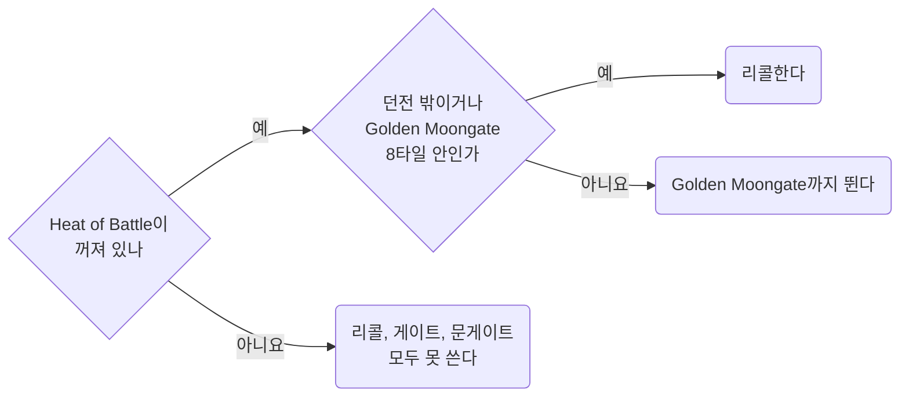

템플릿과 무관한 PvP 서버 규칙과 숫자. 위키와 패치노트 원문 인용, 해석은 인용 아래.
인게임 확인은 표시, 미확인은 "확인되지 않았다".

- Bard Necro의 판단(Defensive Barding, 도주와 반격, Herding 대신 Resist): [Bard Necro](../templates/bard-necro.md#06) 06절
- 벌목 겸 PvP 템플릿의 스킬, 스탯, 도끼 선택, 교전 분기: [Lumberjack PvP](../templates/lumberjack-pvp.md)
- PvP에서 막히는 스크립트 명령: [Razor](../scripting/razor.md#07) 07절

## <a id="00"></a>00 한눈에

| 절 | 내용 |
| --- | --- |
| [01](#01) | PK 공격 시 막히는 것 |
| [02](#02) | 명중률 결정 방식 |
| [03](#03) | Hamstring 구속 시간과 재사용 대기 |
| [04](#04) | Telekinesis와 폭발 포션 대응 |
| [05](#05) | 주문전의 시전 끊김 조건과 숫자 |
| [06](#06) | PvP에서 소환수가 약한 이유 |
| [07](#07) | 패링으로 막는 것과 못 막는 것 |
| [08](#08) | PvP에서 Resist의 감소량 |
| [09](#09) | 맨손과 레슬링의 반격력 |
| [10](#10) | PK 조기 발견 |
| [11](#11) | 자주 틀렸던 생각 |
| [12](#12) | 출처 |

이 문서에 걸린 질문은 [Open items](../questions/open-items.md).

::part[서버 규칙]

## <a id="01"></a>01 공격적 행동과 Heat of Battle

**다른 플레이어에게 공격적 행동 → Heat of Battle.** 켜진 동안 리콜, 게이트, 문게이트, 여관 방 불가.
바드는 Defensive Barding도 잃음([Bard Necro](../templates/bard-necro.md#06.A) 06.A절) → 바드의 방어 숫자(02.C절, 08절)는 Heat of Battle 여부로 갈림.

### <a id="01.A"></a>01.A 무엇이 켜는가

**PK 공격 중 Heat of Battle 예외는 자동 반격 스윙 하나.** 누가 나를 칠 때 캐릭터가 저절로 되받아치는 스윙.
타겟 변경, 훔치기, 해로운 주문은 상대가 먼저 쳤어도 켜짐.

> "Heat of Battle will be triggered by performing an aggressive action against another player regardless of notoriety, or when interacting with various faction content events or wayposts."
> "Aggressive actions include attacking or stealing from a player"
> "Aggressive actions do not include retaliatory empty-handed wrestling attacks or weapon swings your character makes when someone attacks you"
> "However, it is an aggressive action to re-target your attacker (for example, to avoid attacking monsters instead of the attacking player)"
> "Note also that using harmful spells (such as Weaken, Telekinesis, or Energy Bolt) will trigger Heat of Battle, even when used against an attacker"
> "Heat of battle will prevent the player from utilizing any moongates, recalling, or entering an inn room while it is active"

| 내 행동 | Heat of Battle |
| --- | --- |
| PK의 공격에 대한 자동 반격 스윙 | **안 켜짐** |
| 몹을 치다 PK로 타겟 변경 | **켜짐.** 위키 예시 |
| 해로운 주문(Energy Bolt, Weaken, Telekinesis 등) | **켜짐.** 상대가 먼저 쳤어도 |
| 플레이어에게서 훔치기 | **켜짐** |
| 팩션 콘텐츠 이벤트, waypost 상호작용 | **켜짐** |
| Hamstring을 켠 자동 반격 스윙 | 확인되지 않았다 |
| 나에게 거는 Telekinesis | 확인되지 않았다(04.A절) |
| 내 소환수의 PK 공격 | 확인되지 않았다(06.A절) |

**"반격은 안 켜짐"은 자동 스윙에만 해당.** 사냥 중엔 몹을 치는 중 → PK를 치려면 타겟 변경 → 그 순간 켜짐.
거리를 두는 메이지 PK에게는 자동 스윙이 나갈 일 자체가 없음.

### <a id="01.B"></a>01.B 지속시간

**빨강, 회색, 주황 공격 30초. 파랑 공격으로 Criminal이면 2분.** 지속시간은 위키에 없고 2020-09-28 패치 원문에만.

> "When any player commits a hostile action (including stealing) to another player, but the action is not considered a criminal action (such as attacking or stealing from a Red, Grey, or Orange
> player) they will have a 30 second Heat of Battle timer started"
> "When any player commits any Criminal action, they have will have a 2 minute Heat of Battle timer started that matches their Criminal Timer duration"
> "Heat of Battle now has a maximum duration of 5 minutes, regardless of circumstance"

| 내 행동 | Heat of Battle |
| --- | --- |
| 빨강, 회색, 주황 플레이어에게 공격적 행동 | 행동마다 **30초** 타이머 시작 |
| 파랑 공격으로 Criminal | **2분.** Criminal 타이머와 같음 |
| 모든 경우 | 최대 **5분** |

### <a id="01.C"></a>01.C 던전에서는 Golden Moongate 곁에서만 리콜된다

**던전 안 리콜은 Golden Moongate 8타일 안에서만.** Heat of Battle이 켜져 있으면 그곳에서도 리콜, 게이트, 문게이트 불가.

> "Within dungeons, players may only cast Recall within 8 tiles of a Golden Moongate" -- Magery (Recall)
> "Any character can cast this spell from a scroll in a rune book or rune tome, or from a scroll onto a loose marked rune, even with 0 Magery skill" -- Magery (Recall)
> "When a player is in the Heat of Battle they are unable to cast Recall, Gate, or use any Moongates" -- Magery



- 룬북 리콜은 Magery 0으로도 가능
- 던전에서 PK를 만나면 Golden Moongate까지 도주. 가는 길에 PK에게 공격적 행동 → Heat of Battle → 그 문게이트도 불가
- 먼저 공격하지 않은 바드는 그동안 Defensive Barding으로 버팀(02.C절)
- 리콜도 시전. 시전 중 근접 한 대나 해로운 주문에 끊김(02.E절, 05절)

## <a id="02"></a>02 명중률

**명중률 = 양쪽이 지금 손에 든 것의 스킬 대결.** 다른 스킬은 판정 밖.

> "The chance to hit with a mace class weapon is equal to (attacker's mace fighting skill + 50) / ((defender's weapon or wrestling skill + 50) \* 2)
> plus any relevant accuracy bonuses" -- Mace Fighting
> "The chance to hit and defend with fists (avoiding interrupts while casting) is equal to (attacker's wrestling skill + 50) / ((defender's weapon or wrestling skill + 50) \* 2) plus any relevant
> accuracy bonuses." -- Wrestling
> "Due to Wrestling's defense bonus being active when unarmed (or when holding a spellbook) it can be used to defend against melee attacks while casting spells." -- Wrestling

Swordsmanship도 같은 꼴.

```
명중률 = (공격자 스킬 + 50) / ((방어자 스킬 + 50) x 2)
```

|  | 쓰이는 스킬 |
| --- | --- |
| 공격자 | 든 무기의 스킬. 맨손이나 레슬링 무기면 Wrestling |
| 방어자 | 든 무기의 스킬. 맨손이나 스펠북이면 Wrestling |

### <a id="02.A"></a>02.A 스킬 대 스킬, 명중 보너스 0

| 공격 \\ 방어 | 0 | 50 | 80 | 100 |
| --- | --- | --- | --- | --- |
| **0** | 50% | 25% | 19.2% | 16.7% |
| **50** | 100% | 50% | 38.5% | 33.3% |
| **80** | 100% | 65% | 50% | 43.3% |
| **100** | 100% | 75% | 57.7% | 50% |

- **같은 숫자끼리는 언제나 50%**
- 방어 0이면 공격 50은 정확히 100%, 80과 100은 공식값이 1 초과(130%, 150%). 표에는 100%

### <a id="02.B"></a>02.B 내가 칠 때

**메이지 PK를 칠 때 내 쪽 판정은 손에 든 무기의 스킬만.** 내 레슬링은 레슬링으로 칠 때만.

| 나 (손에 든 것) | 상대 (손에 든 것) | 계산 | 명중 |
| --- | --- | --- | --- |
| 메이스 100 | 무기 100 | 150 / 300 | 50% |
| 맨손, 레슬링 100 | 맨손, 레슬링 100 | 150 / 300 | 50% |
| 맨손, 레슬링 0 | 맨손, 레슬링 100 | 50 / 300 | 16.7% |
| 맨손, 레슬링 100 | 맨손, 레슬링 0 | 150 / 100 | 100% |
| 맨손, 레슬링 0 | 무기 100 | 50 / 300 | 16.7% |
| 레슬링 무기, 레슬링 80 | 메이지 PK (스펠북, 레슬링 100, 무기 0) | 130 / 300 | **43.3%** |
| 메이스 100, 레슬링 0 | 메이지 PK (스펠북, 레슬링 100) | 150 / 300 | **50%** |
| 메이스 80 | 메이지 PK (스펠북, 레슬링 100) | 130 / 300 | **43.3%** |
| 메이스 100 | 무기 100 + 레슬링 100, **무기 든 상태** | 150 / 300 | 50%. 상대 레슬링 미사용 |
| 메이스 100 | 무기 100 + 레슬링 100, **스펠북 든 상태** | 150 / 300 | 50% |
| 메이스 100 | 무기 100 + 레슬링 0, **스펠북 든 상태** | 150 / 100 | 100% |

- 80이면 메이스든 레슬링 무기든 43.3%
- 무기와 레슬링을 둘 다 가진 상대는 **지금 든 쪽** 스킬로 방어

### <a id="02.C"></a>02.C PK가 나를 칠 때, PK 무기 100

**Defensive Barding의 Effective Wrestling은 맨손일 때만 방어에 반영.** 무기를 들면 그 무기 스킬로 방어.
Heat of Battle이 켜지면 printed 값만.

| 내 손 | Defensive Barding 켜짐 | Heat of Battle 중 |
| --- | --- | --- |
| 맨손, printed 레슬링 0 | 50% (Effective 100) | **100%** |
| 맨손, printed 레슬링 80 | 50% (Effective 100) | 57.7% |
| 레슬링 무기, printed 레슬링 80 | 확인되지 않았다 ("while unarmed") | 57.7% |
| 메이스 80 | 57.7% | 57.7% |
| 메이스 100 | 50% | 50% |

### <a id="02.D"></a>02.D 명중 보너스

> "Accuracy bonuses to melee weapons from items (Colored Materials, Magical Properties, Aspects, Mastery Chains, etc)
> are now capped by a player's base melee skill for that weapon." -- Armor & Weapons
> "Players will receive bonuses against creatures based on what "setup" they have for weapons/shields occupying their hands" -- Wrestling

- 위 표는 보너스 0 기준. **공식은 보너스를 "plus"로만 표기.** 보너스 10%가 10%p 가산인지 1.1배인지는 위키에 없음
- Weapon Setup 보너스(한손 무방패 Accuracy 등)는 크리처 상대 보너스 → PvP 미적용

### <a id="02.E"></a>02.E 메이지가 레슬링을 올리는 이유

> "Wrestling is very important to mage-types, as taking a melee hit will interrupt a spellcast in progress." -- Wrestling

**메이지 PK는 한 대 맞으면 시전 끊김.** → 메이지는 레슬링 100, 이쪽은 무기 스킬.

Arcane Staff를 든 메이지는 방어 스킬이 다름.

> "A players chance to hit/defend with an Arcane Staff is based on their Arcane skill, but is also capped by the lower printed value of Magery or Wrestling" -- Arcane Staff
> "PvP-based interrupts while casting with an Arcane Staff equipped will be resolved as normal using the player's Wrestling skill" -- Arcane Staff

- 근접 명중과 방어: Arcane 스킬, 단 printed Magery와 Wrestling 중 낮은 값이 상한
- 시전 중 PvP 인터럽트: 평소처럼 Wrestling

## <a id="03"></a>03 Hamstring

**걸린 쪽은 3초 걷기. 거는 쪽은 빗나가면 15초, 맞히면 30\~53초 재사용 불가.** 사실상 한 교전에 한 번.

> "if Hamstring is toggled for a player, on a missed attack they will not be able to make another Hamstring attempt for 15 seconds"
> "On a successful hit when Hamstring is toggled, a player will have a cooldown of 30-53 seconds (100-25 dex) before they may make another Hamstring attempt to any target"
> "When a player is hit by a Hamstring effect, they will be reduced to 0 Stamina for 3 seconds (forcing them to walk), after which their stamina will return to its previous amount"
> "Once hamstrung, a player or creature cannot be affected by another hamstring effect for another 30 seconds"

| 무엇 | 얼마나 |
| --- | --- |
| Hamstring 켠 공격이 빗나감 | **15초** 재시도 불가 |
| Hamstring 켠 공격이 맞음 | **30\~53초**(Dex 100\~25) 동안 누구에게도 불가 |
| 걸린 쪽 | **3초** 동안 스태미나 0, 걷기. 그 뒤 원래 스태미나 |
| 한 번 걸린 쪽 | **30초** 동안 재적용 불가 |

- Hamstring 켠 첫 스윙의 명중률 = 성공률. 레슬링 100 메이지 상대로 무기 80이면 43.3%, 100이면 50%(02.B절)

#### 켜고 끄는 방법

> "Hamstring can be used via the client's "Stun" hotkey, or toggled by using \[Hamstring" --
> [Hamstring](https://wiki.uooutlands.com/Hamstring)

- `[Hamstring`: 켜기 전용이 아닌 토글. 모드가 켜져 있으면 다시 보내 끔
- `[HamstringUntoggleMode`: 자동 해제 방식을 차례로 전환. 성공 뒤, 실패 뒤, 모든 시도 뒤, Never Untoggle의 4가지
- Paperdoll → Help → Commands → Mechanics에서도 선택
- 토글 요청 ≠ 명중이나 적용

#### PvP 요구조건

첫 줄 필수, 나머지 두 줄 중 하나.

> "80.0 or higher attacking weapon skill in Dual Wielding, Fencing, Mace Fighting, Swordsmanship, or Wrestling"
> "two of the following skills at 80.0 or higher; Anatomy, Arms Lore, Chivalry, Forensic Evaluation, Tracking, Wrestling"
> "two of the following weapon skills at 80.0 or higher (including attacking weapon skill); Archery, Dual Wielding, Fencing, Mace Fighting, Swordsmanship"

- Wrestling 80 + Anatomy 80 → 두 번째 줄(목록에서 두 개) 충족. 공격 스킬 Wrestling을 목록에서 다시 세지 말라는 문구 없음
- 메이스로 걸려면 Mace 80 + 목록에서 두 개. Anatomy와 Tracking도 가능
- 세 번째 줄(무기 두 개)의 PvP 목록에는 Wrestling 없음. PvM 목록에는 있음

## <a id="04"></a>04 Telekinesis와 폭발 포션

메이지 PK의 흔한 첫 수. **TK로 붙인 폭발 포션은 리콜해도 따라옴. 대책은 상대보다 먼저 자기 TK.**

이 절의 TK 구분: 자기 TK(내가 나에게), 공격 TK(내가 상대에게), 상대 TK(상대가 나에게).

### <a id="04.A"></a>04.A 규칙

규칙은 2020-09-28 패치 원문. 위키 Alchemy 문서에는
"Telekinesis is always required for sticking explosion potions to players regardless of skill level" 한 줄만.

> "If a player casts Telekinesis and successfully targets another player, it will apply a "Sticky" effect to the target player lasting 30 seconds"
> "If the same player that casted Telekinesis against a player throws an Explosive Potion at them within 30 seconds of the spellcast, the explosion potion will follow the movement of the target
> player, and when exploding will only damage the target player (and not other nearby players or creatures)"
> "If a "Stuck" potion on a player explodes, and both the thrower and the target player are within the radius of the blast, the damage from the potion will be split equally between the two players,
> instead of being dealt entirely to the target"
> "In some cases, players "stuck" with a explosive potion should consider "running the potion back" to the target to trigger the Splashback mechanic, both to reduce the damage on the explosion potion,
> but to also damage the thrower and potentially interrupt a spellcast if the thrower is currently casting"
> "Players can also cast Telekinesis on themselves as a defensive measure, since once Telekinesis is cast onto a player, no other player will be able to cast the spell on them for 30 seconds, and only
> the caster of the spell is allowed to stick potions onto a target that has Telekinesis active on them"
> "Telekinesis is a 3rd circle spell, requiring a minimum of 30 Magery to cast and 50 Magery to cast with 100% success"

삭제 표시가 붙은 위키 Explosion Potion 문서:

> "Explosion Potions stuck to another player with Telekinesis will now follow their target even if they change regions, such as crossing dungeon levels, exiting dungeons, recalling/gating/hiking, or
> using moongates"

- **붙은 포션은 리콜해도 따라옴.** 리콜로 이 콤보 회피 불가
- **던진 사람 곁에서 터지면 데미지 반분, 던진 사람의 시전도 끊길 수 있음** → 포션이 붙으면 던진 사람에게 달려가기(Splashback)도 방법
- 자기 TK에 필요한 Magery 30

현재 위키 Magery 주문표의 자기 TK 방어 설명:

> "Players can cast the Telekinesis spell onto another player (PvP) to make the player "Sticky" for explosion potions for the next 30 seconds" -- Magery (Telekinesis)
> "or on themselves to block it from being cast on them." -- Magery (Telekinesis)

TK 쿨다운 제약은 2020-09-28 패치 원문에만, 현재 위키에는 없음.

> "Each player has a global cooldown for casting Telekinesis in PvP, and can only successfuly apply it at most once every 30 seconds to any player (similar to Wall of Stone casting cooldowns)"
> "A player can only be hit by the Telekinesis spell (from all players) at most once every 30 seconds"
> "Whenever an Explosion Potion is "stuck" to a player, it immediately resets the 30 second Telekinesis casting cooldown against them (i.e other players cannot cast Telekinesis against that player for
> another 30 seconds after that point)"

- **자기 TK는 상대 TK보다 먼저.** 상대 TK가 먼저 맞으면 30초 Sticky, 그동안 자기 TK도 불가
- 자기 TK가 막는 것은 포션이 **붙는 것.** 던지기 자체는 못 막음. 붙지 않은 포션은 나를 따라오지 않음
- **자기 TK도 시전자의 글로벌 30초 쿨 사용.** 나에게 성공한 뒤 그 쿨 동안 공격 TK 불가.
  인게임 확인됨 2026-09-30(사용자 보고). 반사된 TK 처리는 별개, 04.C절
- **상대가 자기 TK를 걸어 두면 내 공격 TK 불가.** 그동안 그 사람에게 포션을 붙일 수 있는 것은 TK를 건 사람뿐
- 포션이 붙은 순간부터 30초 동안 다른 플레이어의 TK 불가
- 자기 TK는 "against another player"가 아님 → 위키 정의상 Heat of Battle 대상 아님. 단 01.A절 인용은 Telekinesis를 해로운 주문으로 꼽음. 확인되지 않았다

### <a id="04.B"></a>04.B TK 순서

자기 TK와 공격 TK는 같은 글로벌 쿨(04.A절) → 둘 중 하나를 먼저 선택.

| 상황 | 행동 | 이유 |
| --- | --- | --- |
| 내가 먼저 움직일 수 있음 | **자기 TK** | 30초 동안 상대 폭발 포션 부착 불가. 붙지 않은 포션은 걸어서 회피 |
| 이미 상대 TK에 맞음 | 내 글로벌 쿨과 상대 상태 확인 후 **공격 TK 검토** | 자기 TK로는 이미 걸린 Sticky 제거 불가. 상대 TK에 맞았다고 내 시전자 쿨이 준비된 것은 아님 |
| 30초 경과 | 위 판단 반복 | 싸움은 보통 30초 이상 |

막히는 것은 04.A절 끝 목록.

### <a id="04.C"></a>04.C TK와 Reflect, Journal 실험

**인게임 확인됨 2026-09-30(사용자, 두 클라이언트 테스트).**
사용자 보고: 공격 TK 뒤에도 상대 Reflection 유지, 이어 쓴 Harm은 반사되어 시전자에게 피해.
**TK를 Reflect 제거 용도로 쓰지 않음.** TK가 반사되어 공짜 자기 TK가 된다는 가정도 이 실험으로는 미입증.

| 사용자가 준 화면 | 관찰된 메시지 | 판단 범위 |
| --- | --- | --- |
| 화면 1, 02:22, 상대에게 TK | `Your next explosion potion thrown at that player within 30 seconds will stick to them.` | TK 적용 안내. 상대 Reflect 유지는 사용자 확인 |
| 화면 2, 02:23, 자기 TK | `xuezhonglian has applied telekinesis to you.`와 위 포션 부착 안내 | 포션 부착 안내는 자기 TK에도 뜸. 이것만으로 상대 적용 판정 불가 |
| 화면 3, 02:24, Harm | `Spell siphon active.`와 `-7` 표시 | 피해 반사는 사용자 관찰. 상대 Reflect 소진을 확정하는 메시지 없음 |

- Razor의 `[ teleki, me ]`, `[ teleki, target ]` ≠ 서버의 대상 확인 메시지
- `config/indian/classicuo/nomeehej/cooldowns.xml`의 target 바는 위 포션 안내로 켜짐 → 자기 TK에도 반응 가능
- 현재 PvP 루프는 TK와 포션 투척을 수동으로 두고, 그 바를 자동 점화 조건으로 쓰지 않음(05.E절)

**구현 주의:** 직전에 건 TK의 대상, 성공 여부, 대상 변경 추적 필요. 그래도 불충분.
상대 TK도 같은 안내를 만든다는 관찰과 자동화의 한계는 04.D절.

- 스크린샷만으로 상대 Inscription, 양쪽 버프, 실제 포션 부착 여부까지는 알 수 없음. 추가 확인은 [Open items](../questions/open-items.md#08.A) 08.A절
- **반사 발생 ≠ Reflect 소진.** 소진 판단은 05.A절

### <a id="04.D"></a>04.D 들어온 TK와 내가 건 TK를 구분하는 한계

**2026-10-01 사용자 실험 보고.** 상대 TK를 받아도 수신 안내, 포션 부착 안내, `[ teleki, me ]`, `[ teleki, target ]`가 함께 켜질 수 있음.
→ 공격 TK 시도 뒤 새 안내가 오고 대상이 여전히 A라도, 내 시도의 성공 응답으로 확정 불가.

| 신호 | 알 수 있는 것 | 알 수 없는 것 |
| --- | --- | --- |
| `{이름} has applied telekinesis to you.` | 표시된 이름의 시전자가 화면 주인에게 TK 적용 | 내가 다른 대상에게 건 TK의 성공 여부. 이름만으로는 고유 serial 확인 불가 |
| 30초 포션 부착 안내와 target 바 | 플레이어 TK 관련 안내 수신 | 자기 TK나 받은 TK와 겹칠 때, 내 공격 대상에게 포션 부착 가능 여부 |
| `Your explosion potion sticks to your target.` | 실제 투척 뒤의 부착 안내 | 점화 전 안전의 근거 여부. 받은 60초 안내 화면은 PvM이었으므로 PvP의 같은 문구는 추가 확인 필요 |

- 01:54의 사람 대상 화면은 30초 안내. 01:36의 60초 안내와 포션 카운트다운 화면과는 별개
- 공식 [Magery](https://wiki.uooutlands.com/Magery)도 PvP TK 30초, 크리처 TK 60초로 구분
- [Greater Explosion 포션](https://wiki.uooutlands.com/Alchemy)의 재사용 15초 ≠ TK 적용 시간. Explosion 주문에도 포션의 15초 쿨 미적용
- 이름을 박은 `insysmsg "xuezhonglian has applied telekinesis to you."`는 문자열 변수 없이 검사 가능
- 단 화면 주인이 xuezhonglian이면 자기 TK, 다른 캐릭터면 그 이름의 상대에게 받은 TK → 문맥 필요. 문법과 제한은 [Razor](../scripting/razor.md#02.A) 02.A절

자동화 원칙:

- 이미 따로 확인된 공격 TK와, 응답 대기 중에 받은 TK가 겹친 상태를 구분
- 확인된 공격 TK를 `teleki, me`만 보고 취소하지 않음. 서로에게 TK를 거는 경우도 있음
- 응답 대기 중 겹친 경우는 미확인 상태로 유지. me 바가 없다고 성공으로 역추론하지 않음(검증 전)
- 대상 serial, 요청 종류, 대기 만료, 대상 변경 추적 필요. 그래도 메시지가 어느 요청의 응답인지는 모름
- 오래된 안내, 다른 핫키, 다른 스크립트를 한 줄로 세워도 받은 TK와의 혼동은 남음. 별도 확인 없이 자동 점화가 안전하다고 보지 않음

- 카운트다운 5, 4, 3, 2를 본 것 ≠ 점화 순간부터 실제 퓨즈 길이를 잰 것
- 실패한 포션을 땅에 던지는 처리와 커서 소유권 검증은 [Open items](../questions/open-items.md#08.C) 08.C절

::part[싸우는 법]

## <a id="05"></a>05 주문으로 싸울 때

메이지 계열 템플릿의 PvP 숫자. **4서클 이상 해로운 주문은 상대 시전을 언제나 끊음.
1서클은 첫 발만 끊고 그 뒤 5초 동안 불가.**

#### 인터럽트

> "All hostile spells from 4th, 5th, 6th, 7th, and 8th circles will interrupt other players 100% of the time" -- Magery
> "Casting a hostile 1st circle spell against another player will at first have an interrupt chance of 100%" -- Magery
> "Afterwards, a 5 second window starts where all subsequent 1st circle hostile spells against the target have a 0% interrupt chance" -- Magery

| 해로운 주문 | 상대 시전을 끊는 확률 |
| --- | --- |
| 1서클 | 첫 발 100%. 그 뒤 5초 동안 같은 대상에게 1서클은 0% |
| 2서클, 3서클 | 1서클과 같은 규칙. 5초 창은 서클마다 따로 |
| 4\~8서클 | **언제나 100%** |

#### 데미지

> "PvP - Deals ((28 to 36) \* (Magery / 100) \* (.75 + (.375 \* (Eval Int / 100)))) damage to target player" -- Energy Bolt, Explosion 공통
> "Modifies base spell damage against players by (0.75 + (0.375 \* (Eval/100)))" -- Evaluating Intelligence
> "There is a 10% spell damage cap on supplemental skills (Tracking, Camping, Inscription, etc)" -- Evaluating Intelligence

| Eval | PvP 배율 | Energy Bolt와 Explosion, Magery 100 |
| --- | --- | --- |
| 0 | x0.75 | 21\~27 |
| 80 | x1.05 | 29.4\~37.8 |
| 100 | x1.125 | 31.5\~40.5 |

- Explosion은 "damage delay of 2.5 seconds", Energy Bolt는 0.5초

#### 주문 데미지 보너스 합산

> "Instead, having the Necromancy skill during PvP will provide the player with a (10% \* (Necromancy Skill / 100)) Supplemental PvP Spell Damage bonus" -- Necromancy
> "However, you could have 100 Evaluating Intelligence and 100 Tracking and gain 22.5% spell damage increase" -- Evaluating Intelligence

- 위키 예시: Eval 100의 +12.5%와 Tracking 100의 +10%를 합쳐 +22.5%
- 아래 표는 그 예시를 따른 보너스 비교. Magery와 Resist까지 넣은 모든 조합의 적용 순서를 입증한 피해식은 아님

| 구성 | Eval 배율 | 보조 스킬 (상한 10%) | PvP 주문 합계 |
| --- | --- | --- | --- |
| Bard Necro (Eval 80, Necro 100) | +5% | +10% (Necromancy) | **+15%** |
| Bard Mage (Eval 100, 보조 없음) | +12.5% | 0 | +12.5% |
| Bard Mage (Eval 100, Inscription 120, 스크롤 시전) | +12.5% | +10% (Inscription, 스크롤만) | +22.5% |

#### 레슬링

- 메이지는 근접 한 대에 시전 끊김(02.E절)
- 바드는 도주할 때만 Defensive Barding이 레슬링을 채움([Bard Necro](../templates/bard-necro.md#06.E) 06.E절)
- printed 레슬링 0이면 무기 100 PK의 근접은 **100%** 명중, 한 대마다 시전 끊김

> "Wrestling will provide a (15% \* (Wrestling Skill / 100)) Mana Refund chance when casting spells" -- Wrestling (PvM)

- 이 마나 환급은 PvM 전용. Defensive Barding이 채운 레슬링에는 미적용([Bard Necro](../templates/bard-necro.md#06.A) 06.A절)

#### Magic Reflection과 Inscription

> "PvP - Has a (35% \* (Inscription / 100)) chance to stay active and reflect a single additional spell before being nullified" -- Magery (Magic Reflection)
> "Will at most ever reflect 2 spells during PvP" -- Magery (Magic Reflection)
> "Players using a scroll to cast a spell will receive a (10% \* (Inscription Skill / 100)) damage bonus against other players (PvP Spell Supplemental Damage Cap 10%)" -- Inscription
> "Increases certain spell's buff durations. Normal duration is 2 minutes and are increased by (400% \* (Inscription Skill / 100)), including:" -- Inscription (Protection, Arch Protection, Bless,
> Invisibility)

- Inscription 120 → Reflect가 한 번 더 남을 확률 42%, 스크롤 주문은 보조 피해 상한 10%
- 버프 지속시간과 Reactive Armor는 PvM 전용으로 보지 않음
- [Magery](https://wiki.uooutlands.com/Magery)의 Reactive Armor: 물리 피해 `20% + 5% × Inscription / 100` 감소, 정해진 총 방어량을 다 쓰면 종료
- 근접 계산 예시에서는 이 효과의 반영 여부를 따로 표기

#### Alchemy

> "Increases Explosion Potion damage by (50% \* (Alchemy Skill / 100))" -- Alchemy
> "Increases Healing Potion effectiveness by (25% \* (Alchemy Skill / 100))" -- Alchemy
> "Increases Cure Potion chances by (12.5% \* (Alchemy Skill / 100))" -- Alchemy
> "In PvP the base damage range is 15-25, scaled with a player's alchemy skill" -- Alchemy (Greater Explosion)

- Alchemy 80 → 폭발 포션 +40%, 힐 포션 +20%, 큐어 포션 +10%. Greater Explosion 쿨다운 15초(위키 포션표)
- +40%를 기본 15\~25에 곱하면 Greater Explosion PvP 데미지: Alchemy 80에서 21\~35, 100에서 22.5\~37.5

#### 마나

> "The baseline Mana Regen rate is 1 mana restored every 2 seconds (i.e., 0.5 mana per second)." -- Meditation
> "The Mana Regen rate is increased by (100% \* (Meditation skill / 100))" -- Meditation

- Meditation 0이면 기본 재생 초당 0.5. 주문 연사엔 부족. 근접과 붕대 위주의 지구력은 별도 계산. 방어구 조건은 05.D절

#### PvM 인터럽트

> "Provides players with a (Effective Magic Resist Skill / 100%)) chance to avoid Spell Interruption from Creature/Environment Damage" -- Resisting Spells
> "Players will have an (Effective Inscription Skill / 100%)) chance to avoid Spell Interruption from Creature/Environment Damage" -- Inscription

- 크리처 공격에 시전이 안 끊길 확률이 Resist와 Inscription에 같은 꼴로 존재. 합산 여부는 확인되지 않았다. **Resist 100이면 이것만으로 100%**
- 바드의 Defensive Barding은 PvM 보너스 없음 → printed Resist로만
- 소환수 공격이 "Creature/Environment Damage"에 드는지는 06.A절

#### Wizard's Grimoire

> "Players must have at least 80 Magery skill and at least 80 Meditation or 80 Eval Int skill to benefit from the Wizard's Grimoire" -- Wizard's Grimoire

### <a id="05.A"></a>05.A Reflect 제거와 인터럽트를 헷갈리지 않는다

05절 Reflection 규칙상 Inscription이 있는 상대는 첫 주문 뒤에도 Reflect 유지 가능.
**Magic Arrow 한 번만으로 마나가 많이 드는 Explosion을 바로 던지지 않음.**

> "when staying up, will look and sound as if the player recast Magic Reflect on himself/herself" —
> [Inscription](https://wiki.uooutlands.com/Inscription)

- 첫 반사 뒤에도 Reflect가 남으면 다시 건 것 같은 모습과 소리(공식 설명). 공격자에게 `sysmsg`가 온다는 보장은 아님
- [2026 PvP 패치](https://uooutlands.com/news/the-pvp-patch-has-arrived/): PvP 플래그 중 Reflect 재시전 제한 60초
- 위키의 옛 30초 설명은 현재 PvP에 쓰지 않음. 타이머 시작 시점은 패치 문구만으로 미확정 → 실측 대상
- 공격자에게 "상대 Reflect 소진"을 확정하는 시스템 메시지는 확인되지 않았다. 상대 Journal 문구와 내 Journal 문구를 구분
- 04.C절 Harm 실험의 Spell Siphon과 피해 표시는 상대 Reflect 소진의 전용 신호 아님. 한 발 반사 뒤에도 Inscription으로 남을 수 있음
- `findbuff "Magic Reflection"`은 내 버프만 읽음, 상대 상태와 무관. 상대 HP 감소도 다른 피해가 섞이면 확정 신호 아님
- 같은 Reflect 한 번이 반사할 수 있는 주문 두 발이 실제로 처리됐다면 소진 추론 가능. 시전 실패, 취소, 시야 차단, 재시전 Reflect는 따로 처리
- Magic Arrow 두 번으로 Reflect를 확인하는 것 ≠ 상대 시전을 두 번 끊는 것. 낮은 서클의 인터럽트 제한은 아래

> "Players Flagged in PvP will now have a 60 second cooldown before they can recast Magic Reflect" —
> [The PvP Patch Has Arrived!](https://uooutlands.com/news/the-pvp-patch-has-arrived/)

- [Magery의 Spell Interrupts](https://wiki.uooutlands.com/Magery): 1, 2, 3서클의 창을 따로 설명. 같은 서클을 제한 창 안에 다시 쓰면 창도 재시작 → Magic Arrow 연사는 안정적인 연속 인터럽트가 아님
- Magic Arrow, Harm, Fireball 연계는 서로 다른 서클. Lightning은 4서클
- 인터럽트 100%라도 **주문이 들어가는 순간 상대가 시전 중이어야** 효과. 거리, 시야, 반사, 피해 지연도 고려

### <a id="05.B"></a>05.B Magery, 마나와 프리캐스트

기준: [Magery](https://wiki.uooutlands.com/Magery), [주문표](https://wiki.uooutlands.com/Template:SpellCircles). 시전 성공률과 시전 중 인터럽트는 별개.

> "Casting a spell from a scroll increases a player's Effective Magery skill by 20 (effective Magery only affects casting chance)" — Magery

- 100% 성공: 6서클까지 Magery 80, 7서클 90, 8서클 100. Magery 80으로 8서클 스크롤을 쓰면 성공 판정은 100
- 스크롤의 성공 보정 ≠ 실제 Magery 100의 피해량이나 회복량. Greater Heal: Magery 80에서 32\~40, 100에서 40\~50
- Eval은 05절의 기본 주문 배율. Eval 0은 0.75, 80은 1.05. 보조 주문 보너스 상한을 채워도 Eval은 유효

| 주문 | 기본 마나 | 용도 |
| --- | --- | --- |
| Magic Arrow | 4 | 상태 확인, 저마나 견제와 인터럽트 |
| Harm | 6 | 저마나 견제와 인터럽트 |
| Fireball | 9 | 견제와 인터럽트 |
| Lightning | 11 | 견제와 인터럽트 |
| Telekinesis | 9 | TK 선택(04.B절) |
| Teleport | 9 | 위치 조절 |
| Greater Heal | 11 | 회복 |
| Paralyze | 14 | 구속 |
| Explosion | 20 | 폭딜 |
| Energy Bolt | 20 | 폭딜 |
| Earth Elemental | 50 | 소환 직후 전투 마나 예산은 별도 |

포션 투척은 주문 마나 없음.

> "damage delay of 0.5 seconds" — [Energy Bolt](https://wiki.uooutlands.com/Template:SpellCircles)

- 피해 지연: Explosion 2.5초, Energy Bolt 0.5초. 기본 시전 둘 다 1.75초, 주문 사이 회복 0.2초
- 이 값만으로 움직이는 상대에게 무기 명중까지 넣은 확정 콤보 시간을 만들지 않음

| 짧은 주문 | 기본 시전 | 피해 지연 | 거리 조건 |
| --- | --- | --- | --- |
| Magic Arrow | 0.5초 | 0.5초 | 반사돼도 낮은 피해를 감수하는 견제. Reflect 소진의 확정 신호 아님 |
| Harm | 0.75초 | 0.05초 | 기본 PvP 피해가 거리에 따라 감소. 0\~2타일 9\~13, 3\~4타일 4\~6, 5타일 이상 2\~3 |

- 위 값 기준: [Magery 주문표](https://wiki.uooutlands.com/Magery). Harm을 0.5초 시전으로 계산하지 않음
- 시전 시작 가능 거리 ≠ 시전 뒤 대상 지정 가능 거리. 모든 주문의 최대 사거리 12타일이라는 근거는 이번 검토에서 못 찾음

> "A spell cast must complete before you attempt to arm your weapon or it will be interrupted" —
> [Combat Overview](https://wiki.uooutlands.com/Combat_Overview)

- 프리캐스트(시전이 끝나 타겟 커서를 든 상태) ≠ 시전 중. 시전이 끝나기 전 무기 장착 → 시전 끊김
- 같은 문서: 시전 도중 포션 가능, 단 **시전이 끝난 프리캐스트를 든 채 포션을 마시면 주문 취소**
- 자동 포션 루프와 공격 타겟 유지의 충돌은 구현 전 확인

### <a id="05.C"></a>05.C Teleport와 Rope의 공유 쿨

> "will apply a 15 second cooldown to both the Teleport Spell and Adventurer Rope usage" —
> [Adventurer's Rope](https://wiki.uooutlands.com/Adventurer%27s_Rope)

| PvP 플래그 중 행동 | 다음 Teleport와 Rope에 모두 걸리는 쿨 |
| --- | --- |
| Teleport 사용 | 15초 |
| Rope로 타겟 지정 | 2분 |

- Rope 더블클릭 → 1초 행동 구속, 타겟 커서가 열린 동안 근접 스윙도 정지
- Teleport 직후 Rope로 공유 쿨 회피 불가. Rope 금지는 아니나 이후 이동 수단을 오래 잠그는 비용

### <a id="05.D"></a>05.D 가죽과 자연 마나 재생

- [Meditation](https://wiki.uooutlands.com/Meditation) 기본 재생: 2초에 1마나
- Leather = 방어구에 의한 재생 감소 없음. 재생 가산은 아님
- Meditation 0, 가죽, 다른 보정 없음 → 이론상 30초에 15, 60초에 30마나
- 수동 Meditation 성공 상태 유지는 가정하지 않음. 이동, 행동, 피격으로 끊기는 능동 명상을 추격 중 유지한다고 보지 않음
- 마나가 가득 찬 동안의 재생은 쌓이지 않음. 시전 비용, 시점, 장비 변경에 따라 실제 남는 마나는 다름
- 최대 마나 ≠ 현재 마나. INT 45에서 Earth Elemental의 50마나 비용은 스크롤 성공률 보정으로 해결 불가
- 버프로 늘어난 최대치 ≠ 현재 마나 회복. 템플릿 적용은 [Lumberjack PvP](../templates/lumberjack-pvp.md#04) 04절

### <a id="05.E"></a>05.E 수동 공격과 공통 자기관리 루프

[combat/pvp.razor](https://github.com/minu-ha/uoo/blob/master/script/combat/pvp.razor): PvP 시작 시 켜는 공통 자기관리 루프.

- 공격은 전부 수동. TK, Magic Arrow와 Harm, Explosion과 Energy Bolt, 폭발 포션, 소환수 공격, Hamstring, 상대 지정, 근접 공격 요청
- 상대의 serial, 색, 거리, 사망 여부 조회 없음. PvP 핫키는 `Play Script: combat\pvp`
- 자동: 파우치, 포션, 붕대, 회복 에이전트, Reactive Armor와 Reflect, 스탯 포션, 켜 둔 무기 장착. 수동 시전이나 커서는 끊지 않음
- 현재 본문은 인게임에서 확인되지 않았다

현재 v9. 판별 변경:

- 2026-10-08 v6: bard-necro-enhanced, lumberjack-enhanced와 같은 모양으로 재작성
  - v5는 위에서 고른 번호를 변수에 담고 아래 실행부가 다시 읽음 → 그 사이 상태 변화 가능
  - v6의 블록은 각자 현재 상태를 읽고 즉시 행동, 다음 블록에 결정을 넘기지 않음
  - 삭제: v5의 긴급 수동 주문 중단, 6초 시전 대기와 `[ cast, check ]` 정지, 준비 동작의 5초 주기, 주문의 이동 가드, 재시도 타이머 8개
- 2026-10-09 v7: Strength와 Agility 포션을 버프 대신 STR과 DEX 값으로 판정, 포션마다 5초 재시도 간격(09.D절)
- 2026-10-10 v8: 가벼운 Heal을 붕대 옵션과 별도로 `use_light_heal`로. 붕대를 못 쓰면 옵션과 무관하게 대신 사용
- 2026-10-10 v9: `recipe/pvp-recipe.razor`로 조립. 동작은 v8과 같음([Modules](../scripting/modules.md#08) 08절). 수정은 모듈과 레시피에서

#### 입력 규칙

05.B절 Combat Overview 원문 기준.

- 포션과 파우치: 즉시 쓰는 아이템 → 시전 중에도 사용, `casting` 미확인
- 프리캐스트 커서를 든 채 마시면 그 주문 취소 → 포션은 커서를 든 동안 대기
- 붕대도 대기. 붕대의 대상 커서가 들고 있던 커서를 밀어냄
- 회복 에이전트, Reactive Armor, Reflect: 시전과 커서가 없을 때만 시작, 제 시전이 끝날 때까지 `for 60`으로 폴링
- 루프가 끊는 시전은 루프가 건 Reactive Armor와 Reflect뿐. 잃은 HP가 긴급 기준(`buff_max_loss`)에 닿으면 `> Interrupt` → 다음 패스에 회복
- Razor 행동 큐가 찼거나 은신 중이면 행동 없음. 마비 파우치만 예외

#### 설정

- 아래 이름은 `config__` 접두 생략. 템플릿별 프리셋 없음
- 값 변경: `recipe/pvp-recipe.razor`에서 그 설정을 가진 블록의 `# @ use` 줄 아래에 새 값 → 재조립([Modules](../scripting/modules.md#07.A) 07.A절)
- 옵션끼리 덮어쓰지 않음. Magery와 붕대는 따로 끌 수 있음. 무기 교체는 레시피의 `fight/weapon-swap` 블록 → 끄려면 그 줄 삭제
- 전체 설정과 기본값: `node util/build-scripts.mjs --settings recipe/pvp-recipe.razor`. 아래 표는 자주 보는 것

| 옵션 | 기본값 | 효과 |
| --- | --- | --- |
| `clear_at_start` | 0 | Play 시 시작 4줄 생략. 들고 있던 수동 커서와 시전 유지([Conventions](../scripting/conventions.md#02.D) 02.D절) |
| `use_magery` | 1 | 회복 에이전트, 버프, 시약 읽기 |
| `use_bandages` | 1 | Healing이 있고 피해나 독이면 붕대 |
| `use_light_heal` | 0 | 붕대와 함께 `light_hits`부터 가벼운 Heal. 붕대 불가(`use_bandages` 0, Healing 없음, 붕대 없음)면 값과 무관하게 대신 사용. `use_magery` 1 필요 |
| `use_potions` | 1 | 회복 포션, Refresh, 스탯 포션 |
| `use_resist_potion` | 1 | Magic Resist 포션 |
| `str_potion` | 120 | Greater Strength 포션을 마신 STR(기본 + 20). STR이 그보다 낮으면 Strength 포션. 0이면 끔 |
| `dex_potion` | 100 | Greater Agility 포션을 마신 DEX(기본 + 20). DEX가 그보다 낮으면 Agility 포션. 0이면 끔 |
| `walk_guard` | 0 | base 공용 설정. pvp는 걷는 중에도 시전([Modules](../scripting/modules.md#06) 06절) |
| `warmode_is_manual` | 0 | base 공용 설정. pvp는 워모드 무시 |
| `buff_max_loss` | 35 | 잃은 HP가 이 값 이상이면 버프 시작 안 함, 시전 중이면 끊음. `emergency_hits`를 바꾸면 함께 조정 |
| `buff_when_poisoned` | 1 | 독 상태에서도 버프 |
| `use_reactive_armor` | 1 | 빠지면 시전과 커서가 없을 때 즉시 재시전. 이동 가드 없음 |
| `use_magic_reflect` | 1 | Reflect도 같은 방식 |
| `heal_hits` | 35 | 잃은 HP가 이 값 이상이면 힐 포션 |
| `emergency_hits` | 35 | 포션 불가 시 Greater Heal, 버프 정지 기준. `heal_hits`보다 낮게 두지 않음 |
| `light_hits` | 15 | 가벼운 Heal 기준(`use_light_heal`) |
| `refresh_stam` | 15 | 현재 STA가 이 값 이하면 Refresh |
| `mana_cure` | 6 | Cure 에이전트 시작 최소 현재 마나 |
| `mana_greater_heal` | 11 | Greater Heal 에이전트 시작 최소 현재 마나 |
| `mana_heal` | 4 | Heal 에이전트 시작 최소 현재 마나 |
| `mana_reactive_armor` | 4 | Reactive Armor 시작 최소 현재 마나 |
| `mana_magic_reflect` | 14 | Reflect 시작 최소 현재 마나 |
| `weapon_1_graphic`\~`weapon_4_graphic` | 아래 표 | 각 스윙 바와 짝지은 graphic ID 하나. 0이면 그 슬롯 끔 |
| `chatty` | 1 | 선택 오버헤드 |
| `sysmsg` | 1 | 시작 시 판 번호, 에이전트와 버프 시전, 장착 요청을 Journal에 기록 |

- `str_potion`, `dex_potion`: 공유 루프 → 실행 캐릭터의 기본 스탯에 맞춤. 기본값은 STR 100, DEX 80 기준(09.D절)
- `heal_hits`, `emergency_hits`, `light_hits`: 모두 최대 HP에서 잃은 양. 최대 HP 120이면 기본 기준은 현재 HP 85 이하
- 최소 마나는 공격이나 이동용 예비 마나를 자동으로 남기지 않음. 예비 20을 남기려면 Greater Heal 최소값 11 → 31처럼 각 값 조정
- `buff/spells` 모듈의 `use_spell_siphon`: 이 루프에서 기본값 0 유지(아래 "싸움 전 붕대 미리 쓰기")

#### 루프 골격

1. 명령이 막혀 있으면 정지
2. REAGENTS: 10초마다, 또는 `More reagents are needed` 거절 직후 시약 7가지 읽기 → 주문별 플래그. 패스 맨 앞이라 아래 시전 블록이 새 플래그를 읽음
3. 회복 블록은 `paralyzed or poisoned or diffhits > 0` 한 줄 아래. 다치지 않은 패스는 그 한 줄만
4. CURE: 마비면 트랩 파우치. 마비 아니고 독이면 Cure 포션. 포션이 하나라도 있으면 에이전트 생략, 없거나 꺼져 있으면 Smart Heal/Cure 에이전트
5. HEAL: 잃은 HP가 힐 포션 기준 이상이면 포션. 이 패스에 포션이 안 나갔고 긴급 기준 이상이면 Greater Heal/Cure 에이전트
6. BANDAGE, LIGHT HEAL, REFRESH 순서. 진행 중인 붕대는 재시작 안 함. 가벼운 Heal: 붕대 불가 시 대신, `use_light_heal` 1이면 붕대와 함께
7. STAT POTIONS: Strength와 Agility는 STR과 DEX가 기준선 아래면 5초에 한 번. Resist는 버프가 빠지면 즉시. 한 포션이 떨어져도 나머지는 계속
8. SELF BUFFS: Reactive Armor → Reflect 순서, 빠지면 긴급 기준 아래에서 즉시
9. WEAPON: 시전과 커서가 없을 때, 원하는 슬롯의 무기가 손에 없으면 장착 요청

- 힐 포션: `heal pot` 바가 돌면 라벨 생략, 바가 0일 때 포션의 `next usable` 라벨 확인
- 포션을 마신 패스는 Greater Heal 생략. 다음 패스에도 긴급 기준 이상이면 그때 Greater Heal
- 붕대 시작 ≠ 즉시 HP 회복
- 사람이 시전하는 동안: 포션은 나감, 에이전트, 버프, 붕대, 장착은 대기. 사람이 커서를 든 동안: 마비 파우치만
- 긴급 기준에 닿아도 수동 입력은 끊지 않음. 시전 종료나 커서 해제 뒤 다음 패스에 회복
- 중립 아이템 커서도 같은 커서로 보고 대기

#### 비용과 타이머

- `findtype`이 가장 비싼 명령([Razor](../scripting/razor.md#06) 06절) → 시약은 패스마다 찾지 않고 REAGENTS 플래그를 읽음
- 포션은 필요한 블록 안에서만 찾음. Strength와 Agility 포션은 스탯이 기준선 아래일 때 5초에 한 번, Resist 포션은 버프가 빠졌을 때만
- 무기는 원하는 슬롯이 바뀔 때만 찾음. 평소에는 양손 레이어 두 개만 읽음
- 없는 무기를 슬롯에 두면 패스마다 한 번씩 찾음 → 안 쓰는 슬롯은 0
- 재시도 타이머는 `timer__str_potion`, `timer__agi_potion`(5초) 둘뿐
- 저주를 받으면 포션 효과 중에도 스탯이 기준선 아래 → 다른 신호로는 거절될 마시기를 못 막음(09.D절)
- 나머지 중복 요청은 행동 큐(`queued`), `bandaging`, `findbuff`, 포션 라벨, `heal pot` 바가 막음
- 에이전트는 제 시전이 끝날 때까지 폴링 → 끝난 뒤에도 잃은 HP가 남으면 즉시 재시전
- 그 밖의 타이머: 반복 경고 방지 `timer__message`(3초), 시약 주기 `timer__reagents`(10초). 모두 Play마다 준비 상태로 시작

#### 싸움 전 붕대 미리 쓰기

- 붕대가 끝나 HP가 가득 차면 현재 루프는 다음 붕대를 시작하지 않음
- 사용자가 나에게 Magic Arrow를 한 번 쏴서 피해를 만든 뒤 커서를 놓으면 다음 붕대 조건 성립
- → 교전 전에 붕대 종료 시점을 앞당김. 첫 피해 뒤 붕대 시작과는 다른 수동 준비
- HP가 가득 찬 상태의 Bandage Self를 서버가 받는지는 아직 확인되지 않았다
- HP가 가득 찼을 때 자기 Magic Arrow를 자동 반복하는 분기는 없음. 진행 중인 붕대 재시작, 마나 낭비, 수동 공격 입력과의 충돌 회피
- Spell Siphon용 자기 Magic Arrow와 버섯 옵션은 v5에서 제거.
  [Spell Siphon은 크리처 상대 보너스](https://wiki.uooutlands.com/Resisting_Spells),
  [버섯은 PvP 플래그 중 섭취 불가](https://uooutlands.com/news/patch-march-5-wizards-grimoire-new-player-rental-credit-deeds-society-job-updates/)
- Resist 포션은 던전 몹과 펫 상대용 옵션. 적 플레이어 주문 감소로 계산하지 않음

#### 스윙 바와 무기 선택

| 설정 | 읽는 바 | 기본 무기 | graphic ID |
| --- | --- | --- | --- |
| `weapon_4_graphic` | `swing 4` | Great Axe | 31190 |
| `weapon_3_graphic` | `swing 3` | 미사용 | 0 |
| `weapon_2_graphic` | `swing 2` | 미사용 | 0 |
| `weapon_1_graphic` | `swing 1` | Norse Axe | 31128 |

- 원하는 슬롯 = 스윙이 준비된 슬롯 중 가장 높은 것. 4번 → 1번 순서
- 준비된 슬롯이 없고 양손이 비면 켜진 슬롯 중 가장 낮은 것. 바가 없으면 준비로 읽음
- 원하는 슬롯이 바뀌면 그 graphic을 내 몸(장착품과 백팩)에서 찾아 기억
- 기억한 serial이 손에 있으면 유지, 백팩에 있으면 장착 요청, 둘 다 아니면 다음 패스에 재검색
- 손에 직접 든 무기는 그 serial을 그대로 기억 → 교체 안 함. 슬롯 무기가 없고 양손이 비면 `[ weapon, out ]`
- 다른 무기: [Item list](item-list.md)의 graphic ID 하나로 교체
- 슬롯은 서버 배정이 아닌 사용자 설정. 개인 serial이나 graphic 목록은 넣지 않음
- 장착은 [dress serial](https://www.razorce.com/guide/commands/#dress)로 요청. 활성 프로필의 Arm/Dress가 부딪치는 장비를 자동으로 벗겨야 함
- 이 클라이언트에서 `dress` 실패 기록 있음([Razor](../scripting/razor.md#03) 03절) → 실제 교체는 인게임 확인 필요
- 기존 weapon 핫키는 공격이나 Unlock 요청도 보냄 → 이 루프에서 호출 안 함
- 활성 캐릭터의 바는 각각 `WeaponSwing` 타입, 현재 STA에 맞는 시간. 시간과 공유 스윙 기준은 [09.B절](#09.B), 바 구조는 [Overheads](../scripting/overheads.md#06.A) 06.A절
- 루프는 바를 시작하거나 초기화하지 않음. 장착 요청 ≠ 실제 스윙이나 명중. 무기를 바꿔도 새 공격 요청은 없음

#### 상태

| 상태 | 뜻 |
| --- | --- |
| `var__has_black_pearl`, `var__has_garlic`, `var__has_ginseng`, `var__has_mandrake`, `var__has_nightshade`, `var__has_ash`, `var__has_silk` | REAGENTS가 읽은 시약 7가지 보유 여부 |
| `var__regs_cure`, `var__regs_heal`, `var__regs_greater_heal`, `var__regs_reactive_armor`, `var__regs_magic_reflect` | 그 주문의 시약이 모두 있으면 1. 이 루프의 시전 블록이 읽고 REAGENTS만 씀 |
| `var__heal_potion_out` | HEAL 블록 내부용. 이 패스에 힐 포션이 나갔으면 1 |
| `var__weapon_want`, `var__weapon_held` | WEAPON 블록 내부용. 원하는 슬롯의 graphic, 그 무기의 손 보유 여부 |
| `var__weapon_armed_serial`, `var__weapon_armed_graphic` | 스크립트가 마지막으로 장착한 무기. Play를 넘어 유지 |

- 정적 검사는 Outlands 서버나 실제 커서 처리를 입증하지 않음
- 구조화 PvP나 팩션에서 명령이 막히면 `[ script, blocked ]` 후 정지
- 반영 방법과 인게임 확인: [Open items](../questions/open-items.md#10) 10절

## <a id="06"></a>06 소환수로 싸울 때

### <a id="06.A"></a>06.A PvM에서 받던 강화가 빠진다

**"소환수는 PvP에서 약하다"의 근거: PvM 강화가 PvP에서 빠짐.**

> "If a player gets PvP flagged their summons' stats and skills will be automatically adjusted to their printed spirit speak skill" -- Spirit Speak
> "Additionally Summoner Tome upgrades will not apply against players" -- Spirit Speak
> "Necromancy Abilities will NOT work in PvP" -- Necromancy
> "Abilities that increase the Health and Damage of Summoned Followers will follow the same handling that bonuses earned from Spirit Speak follow in PvP" -- Necromancy
> "When a player attempts to Dispel another player's summoned follower (with the Dispel or Mass Dispel spell) there is a (50% \* (Controller's Printed Spirit Speak Skill / 100)) chance the Summoned
> Follower will ignore the dispel attempt (this applies to normal and Undead summons)" -- Spirit Speak
> "Summoning Spells take 5 seconds to cast" -- Spirit Speak
> "Players cannot receive Mana Refunds from casting any Summoning Spells" -- Spirit Speak
> "Magic Resist potions work against pets in PvP" -- Alchemy
> "Lesser, Regular, and Greater Magic Resist potions reduce spell damage taken from creatures by 10/20/30% for 2 minutes" -- Alchemy

| 항목 | PvM | PvP |
| --- | --- | --- |
| 소환수 스탯 | Effective Spirit Speak(장비 보너스 포함) | **printed Spirit Speak만** |
| Summoner's Tome 업그레이드 | 적용 | **플레이어 상대 미적용** |
| Necromancy 어빌리티 | 적용 | **미적용** |
| 소환수 주문 데미지 | 그대로 | PK의 Magic Resist 포션에 **-10, 20, 30%** |
| 상대의 Dispel | -- | Spirit Speak 120이면 **60% 무시, 40% 제거** |
| 다시 부르기 | -- | 5초 시전([Item list](item-list.md#19) 19절에는 6.00초), 마나 환급 없음, 상대의 4서클 이상 주문에 끊김 |

Herding은 PvP에서도 소환수에 적용. Necromancy 주문 보너스는 05절.

> "Tamed and summoned creatures deal (11% \* (Effective Herding Skill / 100)) additional damage against players while their controller has an active shepherd's crook." -- Herding
> "Tamed and summoned receive (5.5% \* (Effective Herding Skill)) Damage Resistance against all players" -- Herding

- Herding 80 → 소환수 딜 +8.8%. 조종자에게 active shepherd's crook 필요
- 저항 공식은 원문에 `/ 100`이 빠져 값을 그대로 읽을 수 없음

#### 확인되지 않은 것

- **소환수의 PK 공격이 내 Heat of Battle을 켜는지.** 위키 정의는 "performing an aggressive action against another player"뿐
  - 안 켜진다면 소환수가 싸우고 나는 자기 대상 주문(자기 TK, 힐, 큐어)만 쓰는 플랜으로 Defensive Barding과 리콜 유지 가능
  - 자기 TK의 Heat of Battle 여부도 확인되지 않았다(04.A절)
  - Heat of Battle은 버프바에 표시("The Heat of Battle flag is now a visible buff on players in the Buff Bar") → 실전에서 소환수 공격 직후 버프바로 확인 가능
- **소환수 데미지가 Resisting Spells의 "Creature/Environment Damage"에 드는지.** 든다면 Resist 100 PK는 소환수에 맞아도 시전 유지(05절)
  → PK 콤보를 끊는 것은 **내 주문뿐**

### <a id="06.B"></a>06.B 소환수별 비교

**PvP 소환수 딜은 슬롯당 상한에 묶임 → 소환수 간 차이 축소. 남는 차이는 생존력.**

> "Any summon that is cast while the Necromancy "Vengeful Spirit" ability is active will be summoned as an undead summon with the same stats, skills and abilities as their normal counterparts." --
> Spirit Speak
> "Like the Energy Vortex, the Jackal Spirit are now "non-hostile" to players and tamed creatures and will never attack them" -- Jackal Spirit
> "Like Blade Spirits, Skeletal Husks are now "non-hostile" to players and tamed creatures and will never attack them" -- Skeletal Husk
> "Mana Drain - Casting on a monster will reduce its magic resistance by 20 \* Magery/100 (halved in PvP)" -- Magery

팔로워 PvP 규칙: Animal Taming 문서. "Tamed/Summoned" 항목만.

> "Tamed/Summoned follower PvP damage scalar has been increased to 30% (previously was 25%)"
> "Tamed/Summoned follower maximum melee hit chance in PvP is now 66%. (previously was 50%)"
> "Tamed/Summoned followers now have a 60% reduced chance in PvP to trigger abilities against players (previously was 90% reduction)"
> "Tamed/Summoned follower ability cooldowns in PvP are now only increased by 50% (previously were increased by 100%)"
> "Capped at inflicting at most 10 Damage Per Control Slot over a 3 second window to individual players in PvP" -- 근접
> "Capped at inflicting at most 7 Damage Per Control Slot over a 3 second window to individual players in PvP. Capped at 8 tiles distance." -- 원거리 / 주문
> "Player pets move at 80% speed while attacking a player target" -- 소환수에도 해당하는지는 적혀 있지 않다

아래 표: 위키 소환수 데이터(`Module:SummonableCreatureData`). Spirit Speak 120 스케일 전 기본 스탯.

| 언데드 (원본) | 슬롯 | 공격 | HP | 데미지 | Wrestling | AR | MR | 능력 | PvP |
| --- | --- | --- | --- | --- | --- | --- | --- | --- | --- |
| Lich (Fire Elemental) | 2 | 주문 | 400 | 28\~34 | 85 | 25 | 100 | Epic Barrage | 가장 약함 |
| Vampire Thrall (Daemon) | 2 | 주문 | **600** | 26\~32 | 95 | 50 | 100 | Fury (3분에 +30%) |   |
| Rag Witch (Water Elemental) | 2 | 주문 | 550 | 24\~30 | 100 | 50 | **150** | Mirror, Flux (parry 25) | 주문에 가장 강함 |
| Ancient Mummy (Earth Elemental) | 2 | 근접 | 550 | 30\~36 | 95 | 75 | 50 | Rooted | 추격 필요 |
| Skeletal Fiend (Air Elemental) | 2 | 근접 | 500 | 34\~40 | 100 | 50 | 100 | Cleave | 추격 필요 |
| Jackal Spirit (Energy Vortex) | 2 | 근접 | 500 | 38\~46 | 105 | 50 | 100 | Discharge | **플레이어 공격 안 함** |
| Skeletal Husk (Blade Spirit) | 1 | 근접 | 250 | 20\~24 | 90 | 50 | 100 | Diversion | **플레이어 공격 안 함** |

- 2슬롯 소환수 하나의 플레이어 대상 상한: 3초에 주문 14, 근접 20
- **Lich의 PvM 기본 채택 이유가 PvP에서는 사라짐.** Hex는 Fire Tome 업그레이드 → 플레이어 상대 미적용. Mana Drain도 절반
- 생존력: Vampire(HP 600), Rag Witch(MR 150) > Lich(HP 400, AR 25)
- 주문형 소환수: PK의 Magic Resist 포션에 데미지 감소(-10, 20, 30%). 근접형: 감소 없음, 단 거리를 두는 메이지 PK에게 붙어야 딜
- Dispel 저항은 모든 소환수 동일(Spirit Speak 120이면 60%)
- **PK 앞 재소환은 불가로 봄.** 06.A절 "다시 부르기" 제약에 더해 언데드는 Vengeful Spirit 재시전도 필요 → PK와 싸우는 소환수 = **사냥하던 소환수**

::part[스킬]

## <a id="07"></a>07 Parrying

**패링은 근접만 막음.** PvP 주문 방어 불가 → 메이지 PK 상대로는 피격 스태미나 감소 효과만.
근접 PK나 무기 든 하이브리드 상대로는 Parrying 80 방패가 근접 데미지를 기대값 30% 감소.

> "Players may parry melee attacks with shields, two-handed weapons, paired weapons (wrestling/dual wielding) and parry daggers."
> "Chance to parry a melee attack is (50% \* (Parrying Skill / 100))"
> "Successfully parrying an attack from another player or creature will reduce its damage by 75%"
> "Successfully parrying an attack from another player, while wielding a two-handed weapon, will reduce its damage by only 50% however"
> "You cannot parry spells in PVP"
> "Provides a (50% \* (Effective Parry Skill / 100)) reduction to Stamina losses that occur due to taking damage"

| Parrying | 근접을 막을 확률 | 막으면 | 맞을 때 잃는 스태미나 |
| --- | --- | --- | --- |
| 80 | 40% | -75%(양손 무기면 -50%) | -40% |
| 100 | 50% | 같음 | -50% |

- 레슬링 무기는 무기표에 **2H** 표기 → PvP 패링 감소가 -50%로 줄어드는지는 확인되지 않았다

PvP 근접 데미지 기대 감소 = 막을 확률 × 감소율.

| Parrying | 방패, paired 무기 | 양손 무기 |
| --- | --- | --- |
| 80 | `40% x 75% =` **30%** | `40% x 50% =` 20% |
| 100 | `50% x 75% =` **37.5%** | `50% x 50% =` 25% |

### <a id="07.A"></a>07.A 패리 메이지가 있는 이유

목적은 주문 방어가 아니라 **근접 방어와 방패 착용**.

> "Players with both 80 Magery and 80 Parrying or greater may cast spells and meditate with a shield (meditation rate will still be affected by the shield's meditation penalty)" -- Parrying
> "Armor rating provided from shields is (50% \* Shield Base AR) + (50% \* Shield Base AR \* (Parrying Skill / 100))" -- Parrying
> "Hits from a Macing-skill weapon against another player have a (100% \* (Damage / 50)) chance to cause the player to lose 5 Stamina" -- Mace Fighting
> "Dexterity Penalties have been removed from armor and shields and replaced with a Stamina Fatigue Penalty that increases the amount of stamina the player loses when taking damage" -- Armor &
> Weapons

- 메이지는 **Magery 80과 Parrying 80이 모두 있어야 방패를 든 채 시전.** 방패 AR: Parrying 0이면 Base AR의 절반, 100이면 전부
- PvP: 덱서의 근접 방어, 피격 스태미나 감소. 스태미나 0이면 걷기(Hamstring 원문 "reduced to 0 Stamina ... forcing them to walk")
- PvM: 역할이 더 많음. 크리처 주문 패링(`25% x (Parrying / 100)`, -75%), Taunt, Parry Codex
- Parry Codex에는 Mirror("reduces Spell Damage taken by 6% per rank") 같은 스탠스. 단 Codex 문서는 PvM 분류, XP도 크리처 처치로만 → **PvP 적용 여부 미기재**
- 위키 메이지 템플릿 페이지에 패리 메이지 없음. Parry Codex를 요구하는 메이지는 New Player 페이지의 Arcane Mage 하나

## <a id="08"></a>08 Resisting Spells

**Resist는 PvP에서도 주문 데미지 감소(80이면 10\~30%).** Curse, Poison 같은 비데미지 주문도 가끔 막음, 서클이 높을수록 확률 하락.

> "Spell damage taken is reduced by a minimum of (12.5% \* (Magic Resist Skill / 100)) (PvM/PvP)"
> "Spell damage taken is reduced by a maximum of (37.5% \* (Magic Resist Skill / 100)) (PvM/PvP)"
> "The chance to resist any hostile spell with a non-damaging effect such as Curse or Poison is ((40% - (Spell Circle \* 5%)) \* (Magic Resist Skill / 100))"

위키 표 발췌. 서클 칸 = 비데미지 주문 저항 확률.

| Resist | 데미지 감소 | 1서클 | 2서클 | 3서클 | 4서클 | 5서클 | 6서클 | 7서클 | 8서클 |
| --- | --- | --- | --- | --- | --- | --- | --- | --- | --- |
| 80 | 10\~30% | 28% | 24% | N/A | 16% | 12% | 8% | 4% | N/A |
| 100 | 12.5\~37.5% | 35% | 30% | N/A | 20% | 15% | 10% | 5% | N/A |

- 서클(위키 Magery 주문표): Weaken 1, **Poison과 Telekinesis 3**, Curse 4, Paralyze 5, **Energy Bolt와 Explosion 6**, Mana Vampire 7
- 위키 표는 3서클 N/A, 본문은 3서클 Poison을 예로 듦 → 불일치. 확인되지 않았다
- Discordance, Peacemaking, Provocation 80, 80, 80 바드: **Defensive Barding이 켜지면 100 행, Heat of Battle 중이면 printed 행**.
  2020 패치의 `/ 3` 공식이라면 켜져 있어도 80 행([Bard Necro](../templates/bard-necro.md#06.A) 06.A절)

## <a id="09"></a>09 근접 반격력

**맨손은 PvP 데미지 1\~4 → 반격력 없음.** 레슬링으로 싸우려면 레슬링 무기 필요.

> "Unarmed Wrestling base damage against players is 1-4" -- Wrestling
> "Damage from Wrestling Weapons in PvP will scale based on the player's Raw Dex stat as a % (without any adjustments for Dex bonuses or penalties from Potions, Bless, Weaken, other effects)" --
> Wrestling
> "Wrestling Weapons can be disarmed, which will result in the player dealing standard "Unarmed" 1-2 damage during that time" -- Wrestling
> "Wrestling Weapons receive a +20% Melee Damage bonus towards creatures that is applied to Two-Handed Weapons (since players cannot equip shields while using Wrestling Weapons)" -- Wrestling

위키 무기표의 Grinding (Light) 행.

| 계열 | 스윙 간격(초) | 데미지 | 평균 | DPS | 무기 |
| --- | --- | --- | --- | --- | --- |
| Wrestling | 1.67 | 13\~31 | 22 | **13.17** | Martial Manual, Cestus, Fistblade |
| Swordsmanship | 1.56 | 13\~23 | 18 | 11.54 | Longswords, Broadsword, Viking Sword, Norse Axe |
| Mace Fighting | 1.63 | 12\~24 | 18 | 11.04 | Mace, Maul, War Mace, Flanged Mace, Flail |
| Throwing | 1.88 | 14\~24 | 19 | 10.11 | Throwing Dagger, Throwing Star |
| Archery | 2.21 | 13\~25 | 19 | 8.6 | Bow, Hunting Bow, Recurve Bow |

- 레슬링 무기의 PvP 데미지는 **raw Dex 비례.** raw Dex 100이면 100%, 50이면 50%. 포션이나 Bless로 올린 Dex는 제외
- 레슬링 무기를 들면 방패 불가. 패링은 무기 자체로(07절)
- 무장 해제 중 데미지: 원문 "Unarmed" 1-2. 플레이어 상대 맨손 1\~4와 어느 쪽이 맞는지는 확인되지 않았다

### <a id="09.A"></a>09.A 보조 피해 상한과 도끼

> "Total of 20% Damage Bonus from all Supplemental skills" / "Total of 10% Damage Bonus from all Supplemental skills" —
> [PvP Damage Cap](https://wiki.uooutlands.com/PvP_Damage_Cap)

- 근접 보조 피해 상한 20%, 주문 보조 피해 상한 10%. **Tactics와 Anatomy는 근접 상한 밖, Eval은 주문 상한 밖**
- 보조 스킬의 PvP 기본 비율: 스킬 100당 10%. 스킬마다 정한 무기나 주문 조건 필요
- PvP Damage Cap 표: Lumberjacking 보너스는 **도끼만**, Mining 보너스는 메이스 계열만
- Swordsmanship이라고 모두 도끼는 아님. Katana와 Halberd는 Lumberjacking 보너스 대상 아님
- 디스코드의 "arguably it should be all swords"는 의견일 뿐, 현재 적용 범위 아님

> "(-50% + (Tactics Skill / 200))" — [Tactics](https://wiki.uooutlands.com/Tactics)

- Tactics 0\~100의 기본 무기 피해 조정식. 80은 -10%, 100은 0% → 80에서 100으로 올리면 기본 피해 10%p 회복
- 최종 피해가 정확히 10% 늘어난다는 뜻은 아님

> "Base Weapon Damage \* (20% \* (Anatomy Skill / 100))" — [Anatomy](https://wiki.uooutlands.com/Anatomy)

- Anatomy 80이면 기본 무기 피해 +16%, 100이면 +20%. Anatomy만으로 붕대 회복 대체 불가

### <a id="09.B"></a>09.B 현재 스태미나와 무기 교체

> "15000 / (Current Stamina (max 100) + 100) \* Weapon Speed)" —
> [Swing Speed](https://wiki.uooutlands.com/Swing_Speed)

- 원문 식의 괄호 불일치. 같은 페이지 무기표에 맞춘 식: `스윙 간격 = 15000 / ((min(현재 스태미나, 100) + 100) × 무기 Speed)`초
- PvP는 현재 스태미나와 무기 Speed만. PvM의 Aspect나 스킬 공속 보너스 없음
- [Quick Switch](https://wiki.uooutlands.com/Combat_Overview)의 기준은 마지막 장착이 아닌 마지막 스윙
- 빠른 무기로 바꾸면 마지막 스윙부터 빠른 무기 간격, 느린 무기로 바꾸면 느린 무기 간격
- 무기별 별도 타이머로 중간에 공짜 한 대를 끼우는 구조 아님

### <a id="09.C"></a>09.C 붕대의 회복량과 시간

> "Bandaging time is 15 - (5 \* (dex - 25) / 75) seconds" — [Healing](https://wiki.uooutlands.com/Healing)

- 자기 붕대 시간은 DEX 100까지만 감소. 식의 DEX는 버프 반영값, 스윙 계산의 현재 스태미나와는 다름

> "Random Value of 40 to 60" — [Healing의 회복식](https://wiki.uooutlands.com/Healing)

- 회복식: `(Healing / 100) × (40~60) × (1 + 0.2 × Anatomy / 100)`
- 슬립 하나마다 회복량 2% 감소. 아래 범위는 슬립, 다른 보정, 정수 반올림 제외

| Healing | Anatomy | 회복량 | 평균 |
| --- | --- | --- | --- |
| 80 | 0 | 32\~48 | 40 |
| 80 | 80 | 37.12\~55.68 | 46.4 |
| 100 | 80 | 46.4\~69.6 | 58 |
| 80 | 100 | 38.4\~57.6 | 48 |

- 붕대 해독: Healing과 Anatomy 각 60 이상. 부활 시도: 각 80 이상
- PvP에서 독 상태로 붕대를 쓰면 PvM처럼 해독과 HP 회복을 함께 한다고 계산하지 않음
  ([Heal through Poison](https://wiki.uooutlands.com/Combat_Overview))

### <a id="09.D"></a>09.D 스탯 포션과 Bless

> "Increases max strength/hp by 20" / "Increases max dexterity/stamina by 20" —
> [Alchemy의 Greater Strength와 Greater Agility](https://wiki.uooutlands.com/Alchemy)

- Greater Strength: STR과 최대 HP +20. Greater Agility: DEX와 최대 스태미나 +20
- [Bless](https://wiki.uooutlands.com/Template:SpellCircles)의 스탯 보정식 `11 × Magery / 100` → Magery 80이면 8.8
- 실제 정수 처리, 포션과의 중첩은 확인되지 않았다. 검증 전에는 포션 값에 +11을 더하지 않음
- 버프 바로는 포션 판별 불가. 위키 [BuffIcons](https://wiki.uooutlands.com/Template:BuffIcons)는 같은 아이콘을 `Strength Spell / Potion`, `Agility Spell / Potion`으로 표기
- 사용자 확인 2026-10-09: Magery 100 Bless는 `Your strength/dexterity/intelligence has changed by 11`, 버프 바에 `Strength`, `Agility`, `Cunning`
- 스탯 포션 버프 이름에도 Potion 없음 → `findbuff 'Strength'`로 보면 내 Bless든 아군 Bless든 걸린 동안 포션을 안 마심
- 포션 루프는 스탯 값으로 판정. Greater 포션을 마신 값(기본 + 20)을 `config__str_potion`, `config__dex_potion`에 두고, 그보다 낮으면 마심
- Bless와 Strength, Agility 주문은 식상 Magery 100에서 11, 120에서도 13.2 → 그 선 아래
- Razor 스크립트는 덧셈 불가 → 기본값이 아닌 기준선을 기록([Razor](../scripting/razor.md#05) 05절)
- 포션마다 재시도 간격. 스탯은 마신 뒤 한 왕복 늦게 오르고, Curse, Weaken, Clumsy는 포션 효과 중에도 스탯을 선 아래로 누름
- 간격이 없으면 거절될 마시기가 패스마다 회복 포션과 같은 아이템 큐로 나감
- Magic Resist 포션은 제 아이콘 `Magic Resist Potion`으로 판정(사용자 확인 2026-10-09)
- INT 45에 Bless: 정수 처리 전 최대치 53.8(56 아님). Bless 자체도 9마나
- 최대치 증가 시 현재 마나 증가량은 별도 측정 필요 → 시전 직후 현재 마나 53.8을 약속하지 않음

### <a id="09.E"></a>09.E 방어구를 반영한 근접 계산 예시의 전제

> "Minimum Amount: (.333% \* (Total Armor Value))" / "Maximum Amount: (.666% \* (Total Armor Value))" —
> [Armor & Weapons](https://wiki.uooutlands.com/Armor_%26_Weapons)

- 위 공식상 물리 피해 감소 범위: `AR × 0.333%`부터 `AR × 0.666%`. AR 50이면 16.65\~33.30% 감소, 0.667\~0.8335 남음
- 위키의 AR 50 설명은 16.5\~33%로 축약. 여기서는 인용 계수 그대로, 서버 정수 처리는 제외
- 기본 무기 피해에 Tactics, Anatomy, 해당 보조 피해를 적용한 뒤 이 비율로 비교
- Parry, Reactive Armor, 무기 품질, 마법 옵션, 추가 효과, 정수 처리는 별도 조건
- 피해 중간값에 명중률을 곱해도, 접근 실패와 이동 시간을 반영한 실전 DPS는 아님

## <a id="10"></a>10 Tracking

**Tracking: PK를 먼저 보고 회피.** Tracking 80이면 판정 성공 시 야외 84타일, 던전 42타일 안의 숨지 않은 대상 표시.

> "A downside of Bard Templates is clear lack to fight back Pks / Griefers. Through Defensive Barding they are tough to kill but lack the offensive to fight back." -- TemplatesBard
> "Consider squeezing 80-100 Tracking into a template to passively track hostile players (PK's) so you can avoid them." -- TemplatesBard
> "On a successful tracking attempt, players can see a list of non-hidden targets within (20 + (80 \* (Tracking Skill / 100))) tiles"
> "Inside dungeons, this tracking distance is halved (20 + (80 \* (Tracking Skill / 100))) / 2 tiles"
> "Increases Effective Barding skill by (10 \* (Tracking Skill / 100))"
> "When attacking any creature add Base Weapon Damage \* (25% \* (Tracking Skill / 100)) supplemental bonus damage per weapon hit."
> "When attacking any player, add Base Weapon Damage \* (10% \* (Tracking Skill / 100)) supplemental bonus damage per weapon hit"

| Tracking | 탐지 거리, 야외 | 탐지 거리, 던전 | Effective Barding | 무기 딜, PvM | 무기 딜, PvP |
| --- | --- | --- | --- | --- | --- |
| 80 | 84 | 42타일 | +8 | +20% | +8% |
| 100 | 100 | 50타일 | +10 | +25% | +10% |

- 바드의 Effective Barding 보너스, Hunting이 바드 스킬 쿨에 끼치는 영향: [Bard Necro](../templates/bard-necro.md#06.F) 06.F절
- Tracking은 주문 데미지 보조 스킬이기도 함. 위키 예시는 Tracking 100을 +10%로 계산(05절)
- Hamstring 요구조건 두 번째 줄 목록에도 포함(03절)
- Hunting 모드 코드: `escape/tracking` 모듈. lumberjack-enhanced와 tamer-mage-enhanced 루프가 사용
- `config__tracking_color`: 1(기본값) murderer players, 2 회색 criminal, 3 주황 enemy, 4 셋 모두
- 옛 `script/archive/mining.razor`와 `script/archive/lumberjack.razor`는 `track_only_red_players` 하나로 murderer players와 all hostile players 중 선택

### <a id="10.A"></a>10.A Hunting 모드

**딜과 바딩 보너스는 Hunting 없이도 적용.** Hunting은 PK 조기 발견에만 필요.

> "Players can activate and deactivate a "Hunting" mode from the Tracking window to automatically make Tracking skill checks at various intervals (still requiring the normal 5 second skill cooldown)
> against a specific type of player/creature"
> "Players will always receive their bonuses to Damage and Barding Skill from the Tracking skill even if they are not currently Hunting"
> "Tracking success chance is (100% \* (Tracking Skill / 100))"

- 판정 한 번의 성공률: Tracking 80이면 80%
- **Hunting 자동 판정도 5초 스킬 쿨 사용.** 서버 스킬 게이트는 하나뿐([Bard Necro](../templates/bard-necro.md#02.J) 02.J절) → 다른 스킬과 충돌 가능
- 판정 빈도: Hunt Frequency. "New When No Arrow", "New When No Target"은 화살표가 없을 때만 판정
- 주변에 Murderer가 없으면 화살표도 없음 → 계속 판정

::part[기록]

## <a id="11"></a>11 자주 틀렸던 것

| 틀린 생각 | 사실 |
| --- | --- |
| PK가 먼저 쳤으면 반격해도 Heat of Battle이 안 켜짐 | **자동 반격 스윙만 예외.** 타겟 변경, 해로운 주문은 켜짐(01.A절) |
| 던전에서도 룬북으로 도주 가능 | **Golden Moongate 8타일 안에서만 리콜**(01.C절) |
| 레슬링 0이면 PvP에서 못 때림 | **아님.** 공격은 손에 든 무기 스킬로 판정. 레슬링은 맨손이나 레슬링 무기로 칠 때만(02절) |
| 레슬링 100이면 명중률 50% | **스킬이 같을 때 50%.** 100 대 100이라 50%(02.A절) |
| 메이지 PK를 맞히려면 내 레슬링 필요 | **내 무기 스킬 대 상대 레슬링.** 메이스 100이면 50%, 80이면 43.3%(02.B절) |
| 붙은 폭발 포션은 리콜로 회피 | **따라옴.** 던진 사람 곁으로 가면 데미지 반분(04.A절) |
| 자기 TK는 PK 등장 뒤 아무 때나 | **상대 TK보다 먼저.** 한 사람은 30초에 한 번만 TK에 맞음(04.A절) |
| Summoner's Tome 투자로 PvP 소환수도 강화 | **아님.** "Summoner Tome upgrades will not apply against players". 스탯도 printed Spirit Speak 기준(06.A절) |
| 패링으로 PK 주문 방어 | **불가.** "You cannot parry spells in PVP". 패리 메이지의 목적은 근접 방어와 방패 시전(07절) |
| 레슬링 무기 데미지 4\~13 | **13\~31, 평균 22.** 무기표의 DiceMax(4)와 MinDmg(13) 칸을 데미지로 잘못 읽은 값(09절) |

## <a id="12"></a>12 참고 링크

- [Heat of Battle](https://wiki.uooutlands.com/Heat_of_Battle) -- 공격적 행동의 정의, 자동 반격 예외
- [PATCH: Murderer and PvP Overhaul (2020-09-28)](https://forums.uooutlands.com/index.php?threads/patch-murderer-and-pvp-overhaul-general-changes.3232/) -- Heat of Battle 지속시간,
  Telekinesis 포션
- [Wrestling](https://wiki.uooutlands.com/Wrestling), [Mace Fighting](https://wiki.uooutlands.com/Mace_Fighting) -- 명중 공식, 레슬링 무기
- [Armor & Weapons](https://wiki.uooutlands.com/Armor_%26_Weapons) -- 무기표, 명중 보너스 상한
- [Arcane Staff](https://wiki.uooutlands.com/Arcane_Staff)
- [Hamstring](https://wiki.uooutlands.com/Hamstring)
- [Alchemy](https://wiki.uooutlands.com/Alchemy) -- Sticky Potions, 포션 보너스
- [Magery](https://wiki.uooutlands.com/Magery) -- 인터럽트, Recall 제한, Telekinesis, Magic Reflection
- [Evaluating Intelligence](https://wiki.uooutlands.com/Evaluating_Intelligence) -- PvP 배율, 보조 스킬 상한
- [Inscription](https://wiki.uooutlands.com/Inscription)
- [Meditation](https://wiki.uooutlands.com/Meditation)
- [Wizard's Grimoire](https://wiki.uooutlands.com/Wizard%27s_Grimoire)
- [Spirit Speak](https://wiki.uooutlands.com/Spirit_Speak) -- PvP 소환수 스탯, Dispel
- [Necromancy](https://wiki.uooutlands.com/Necromancy) -- PvP에서 능력이 안 먹는 것
- [Herding](https://wiki.uooutlands.com/Herding)
- [Animal Taming](https://wiki.uooutlands.com/Animal_Taming) -- 팔로워 PvP 규칙
- [Parrying](https://wiki.uooutlands.com/Parrying)
- [Resisting Spells](https://wiki.uooutlands.com/Resisting_Spells)
- [Tracking](https://wiki.uooutlands.com/Tracking)
- [TemplatesBard](https://wiki.uooutlands.com/TemplatesBard)
