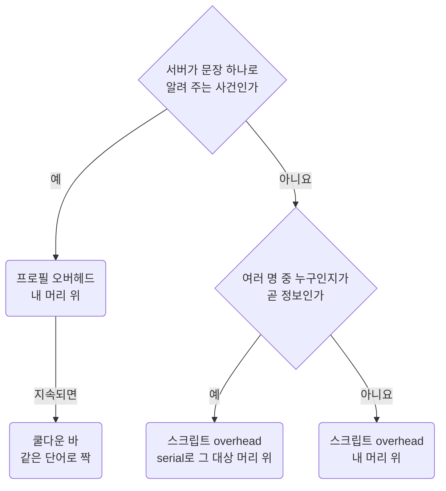
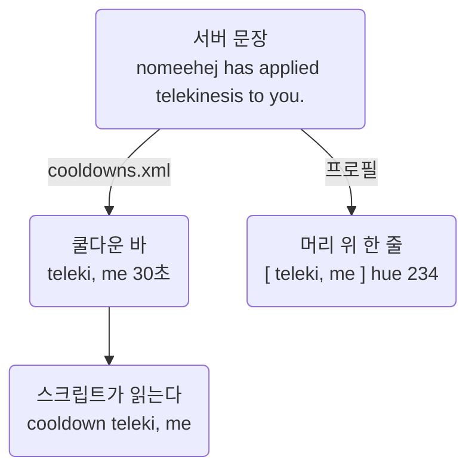

게임 화면 알림의 정본. 경로, 낱말, 색, 지금 걸린 것.
같은 사건 = 쿨다운 바 하나 + 머리 위 한 줄, **같은 낱말** → 바만 보고도 짝 알림을 앎.
스크립트 모양은 [Conventions](conventions.md), 명령 문법은 [Razor](razor.md).

- 설정 파일은 게임 종료 상태에서만 수정([Workflow](../working/workflow.md#04.C) 04.C절)
- 외부 스크립트는 이 형식 밖. 수정 없이 그대로:
  `loot/bank-pouch` `train/barding` `train/carto` `train/magery` `train/steal` `archive/mining` `archive/lumberjack` `shelf/*`

## 00 한눈에

| 절 | 내용 |
| --- | --- |
| [01](#01) | 알림 경로. 프로필, 쿨다운 바, 스크립트의 역할과 띄울 머리 위 |
| [02](#02) | 한 줄의 형식 |
| [03](#03) | 상태 자리 낱말 |
| [04](#04) | 대상 자리 낱말 |
| [05](#05) | 색 |
| [06](#06) | 쿨다운 바 정의, 스크립트에서 읽기, 지금 있는 바 |
| [07](#07) | 프로필이 띄우는 것 |
| [08](#08) | 스크립트가 띄우는 줄 찾기 |
| [09](#09) | 서버 문장을 못 잡아 알림이 없는 사건 |
| [10](#10) | 확인 안 된 것 |
| [11](#11) | 출처 |

이 문서에 걸린 질문은 [Open items](../questions/open-items.md).

::part[규칙]

## 01 세 경로

### 01.A 어디에 무엇이

| 경로 | 파일 | 역할 |
| --- | --- | --- |
| 쿨다운 바 | `config/<이름>/classicuo/<캐릭>/cooldowns.xml` | 메시지로 시작하는 타이머 바(06.A절). 스크립트는 `cooldown "이름"`으로 읽음 |
| 프로필 오버헤드 | `config/<이름>/razor/profiles/<프로필>.xml`의 `<overheadmessages>` | 시스템 메시지 → 머리 위 한 줄 |
| 스크립트 | `script/**/*.razor`의 `overhead "..."` | 스크립트가 직접 띄우는 줄 |

### 01.B 경로 고르기

기준: **그 사실을 누가 아느냐.** 첫 질문은 서버 문장 여부.
상대에 관한 사건이라도 서버 문장이 있으면 프로필(아래 둘째 항목).

| 사실을 아는 쪽 | 경로 | 예 |
| --- | --- | --- |
| **서버**가 문장 하나로 알리는 사건 | 프로필 오버헤드. 지속 시간이 있으면 쿨다운 바도 짝으로 | `[ hams, target ]` `[ para, on ]` |
| **스크립트**만 아는 상태. 고른 것, 재고, 시전 중인 것 | 스크립트 `overhead` | `[ inst, out ]` `[ blood oath ]` |
| 여러 명 중 **누구인지**가 곧 정보 | 스크립트 `overhead "…" 1288 <serial>`, 그 대상 머리 위(01.C절) | `[ target, set ]` `[ explo, on ]` |

- **한 사건 = 한 경로.** 프로필이 잡는 문장을 스크립트가 다시 띄우지 않음.
  그래서 스크립트의 `[ heal pot, on ]`, `[ drain ]`, `[ curse ]` 시전 알림 삭제. 프로필이 `You drink a healing potion`, `You mana drain your target.`을 잡음(07절)
- 서버 문장 사건(`[ hams, target ]` 등)을 스크립트로 옮겨 상대 머리 위에 띄우지 않는 이유 다섯:
  - 저장소에 `injournal` 선례 없음, 패스마다 저널 읽기 비용. 거짓 `if` 하나 10\~20ms([Razor](razor.md#06) 06절)
  - 스크립트가 꺼지면 안 뜸. 프로필 오버헤드는 항상 뜸
  - 햄스트링이 들어간 상대가 `lasttarget`이라는 보장 없음
  - 구조화 PvP의 플레이어 serial `0x0` → 상대 머리 위 표시 불가([Razor](razor.md#07) 07절). 이 알림은 대부분 PvP용
  - UO 화면의 중심은 내 캐릭터 → 내 머리 위가 고정 위치라 가장 읽기 쉬움

### 01.C 누구 머리 위에

- 스크립트 `overhead`: 셋째 인자에 serial → 그 대상 머리 위
- 상대에 관한 줄: 상대 머리 위, hue 1288. `[ target, set ]`, 커서에 쥔 Explosion의 `[ explo, on ]`
- 소환수에 붙인 이름 `[ name, leech ]`: 그 소환수 머리 위, hue 209
- 나머지: 내 머리 위. 프로필 오버헤드는 항상 내 머리 위

## 02 형식

한 줄 = `[ 대상, 상태 ]`. 프로필의 서버 문장 찾기(검색, 순서, 기다림)는 07절.

| 규칙 | 내용 |
| --- | --- |
| 형태 | `[ 대상, 상태 ]`. 모두 소문자, 대괄호 안쪽과 쉼표 뒤에 빈칸 한 칸. 느낌표, 마침표, 대문자 강조 없음. 심각도는 hue |
| 대상 | 04절 글로서리 낱말, 없으면 온전한 낱말. 줄임말은 **말로 할 때도 줄이는 것만**(`hams` `teleki` `inst` `explo` `eb` …). `magic arrow` `fireball` `lightning`은 줄이지 않음 |
| 상태 | 03절 어휘. 드문 상태는 한 낱말 |
| 시전 알림 | `[ blood oath ]`처럼 **대상만**. hue 219와 284가 "지금 나감"을 뜻하므로 상태 불필요 |
| 값 | 서버 문장의 n번째 낱말 = `{n}`. **1부터**, 빈칸 기준. "You must wait another 4 minutes"의 `{5}`는 4. 검색어가 아닌 서버 문장 전체 기준, 구두점 포함. 스크립트 변수는 `{{var}}`(`[ inst, {{label__picked_instrument}} ]`) |
| 폭 | 대괄호 포함 **목표 18자, 상한 22자.** 넘으면 대상을 줄임(`No Longer Paralyzed` → `[ para, off ]`) |
| 구분 | 서버 문장은 `[`로 시작하지 않음 → 대괄호 = 직접 만든 알림 |
| 쿨다운 바 이름 | 짝 알림과 같은 낱말, **대괄호 없이**(`music` `heal pot` `hams, me`). 쉼표 규칙은 06.A절 |

`{n}` 치환 방향은 Razor CE 원본
[OverheadManager.DisplayOverheadMessage](https://github.com/markdwags/Razor/blob/master/Razor/Core/OverheadManager.cs)에서도 확인.
원문 전체를 빈칸으로 나눠 첫 낱말이 `{1}`. Outlands의 새 문장도 실제 낱말 위치를 확인해 매핑.

## 03 상태 어휘

| 뜻 | 낱말 | 예 |
| --- | --- | --- |
| 상대가 나에게 건 것 | `me` | `[ hams, me ]` `[ teleki, me ]` `[ disarm, me ]` |
| 내가 상대에게 건 것 | `target` | `[ hams, target ]` `[ teleki, target ]` `[ bleed, target ]` |
| 내가 주변 여럿에게 건 것(광역) | `area` | `[ disco, area ]` `[ peace, area ]` |
| 내 시도 실패 | `miss` | `[ hams, miss ]` `[ disco, miss ]` `[ lock, miss ]` |
| 잘못 고름 | `wrong` | `[ inst, wrong ]` `[ steal, wrong ]` |
| 쿨 끝, 사용 가능 | `ready` | `[ str, ready ]` `[ hide, ready ]` `[ fireball, ready ]` |
| 켜짐, 진행 중 | `on` | `[ para, on ]` `[ guard, on ]` `[ bank safe, on ]` |
| 풀림, 아직 불가 | `off` | `[ para, off ]` `[ stealth, off ]` `[ guard, off ]` |
| 소진, 없음 | `out` | `[ pouch, out ]` `[ inst, out ]` `[ range, out ]` |
| 들어오는 중 | `coming` | `[ heal, coming ]` `[ world, coming ]` |
| 고르기 프롬프트 | `pick` | `[ inst, pick ]` `[ shelf, pick ]` |
| 저장함 | `set` | `[ target, set ]` `[ var, set ]` `[ chest, set ]` |
| 끝남 | `done` | `[ lock, done ]` `[ loadout, done ]` |
| 서버가 시전을 끊음 | `disturbed` | `[ cast, disturbed ]`(프로필) |
| 내가 시전을 끊음. 힐을 위해 끊은 경우 등 | `cut` | `[ curse, cut ]` |
| 수량, 초 | 숫자 | `[ stealth, 3 ]` `[ mush, {5} ]` `[ planted, 2s ]` `[ murder, +1 ]` |
| 이름, 라벨 | 이름 그대로 | `[ name, leech ]`(소환수에 붙인 이름, 그 소환수 머리 위) `[ stance, sunder ]` `[ head, {{label__head}} ]` |
| 드문 상태 | 한 낱말 | `full` `over` `free` `blocked` `near` `slow` `clear` `deadly` `lethal` `refund` `charged` `extended` `moved` `worn` `back` `take` `skip` `dropped` `saving` `upgrade` `max` `absorbed` `crim` `restock` `resupply` |

상태 자리의 `target`은 방향, 곧 내가 상대에게 건 것에만. "찍어라"는 `pick`.

## 04 글로서리

대상 자리 낱말. 표에 없으면 온전한 낱말.

| 뜻 | 낱말 |
| --- | --- |
| hamstring | `hams` |
| telekinesis | `teleki` |
| paralyze | `para` |
| instrument | `inst` |
| explosion | `explo` |
| energy bolt | `eb` |
| discordance | `disco` |
| provocation | `provo` |
| peacemaking | `peace` |
| barding song | `song` |
| greater heal | `gheal` |
| mana drain, vampire | `drain` |
| meditation | `medi` |
| magic mushroom | `mush` |
| criminal | `crim` |
| veterinary | `vet` |
| herbal poultice | `herb` |
| herding | `herd` |
| invisibility | `invis` |
| chain lightning | `chain` |
| meteor swarm | `meteor` |
| teleport | `tp` |
| strength 포션 | `str` |
| agility 포션 | `agi` |
| magic resist 포션 | `resist` |
| heal 포션 | `heal pot` |
| cure 포션 | `cure pot` |
| refresh 포션 | `refresh` |
| explosion 포션 | `explo pot` |
| 달라붙은 폭발 포션. 나에게든 상대에게든 | `bomb` |
| trapped pouch | `pouch` |
| smoke bomb | `smoke` |
| reagent satchel | `reg satchel` |
| alchemists satchel | `alch satchel` |
| identification wand | `id wand` |
| necromancy book | `necro book` |
| reactive armor | `reactive` |
| magic reflection | `reflect` |
| stamina | `stam` |
| script variable | `var` |

`heal`, `cure`는 주문 이름 → 포션은 `heal pot`, `cure pot`. 힘, 민첩, 저항 주문은 안 씀 → 그 포션은 `str`, `agi`, `resist` 그대로.

## 05 hue 팔레트

색은 **뜻** 열 기준. 상태 낱말 열은 그 뜻에 흔히 붙는 낱말일 뿐.
같은 `on`이라도 나에게 걸린 `[ poison, on ]`은 234, 정보인 `[ medi, on ]`은 290.
색 출처는 [Razor 색표](https://outlands.uorazorscripts.com/hues). 뜻이 다르면 색 계열도 다름. 따뜻한 색 = 전투, 차가운 색 = 정보, 초록 = 준비와 해제.

2026-10-07 사용자 요청으로 채도와 밝기를 한 단계 낮춤. 색 값은 클라이언트 `hues.mul`의 각 hue 색표 맨 위 색(index 31). 옛 표의 값과 일치 확인.
UO hue 표는 100 단위 띠마다 같은 색이 탁해짐 → 같은 계열을 +200 띠로 옮겨 채도 0.50\~0.67, 밝기 0.87\~0.90.

| 옛 hue | 새 hue | 옛 hue | 새 hue |
| --- | --- | --- | --- |
| 33 `#ee0031` | 234 `#de4a6a` | 9 `#6a31ee` | 209 `#734ade` |
| 43 `#ee6200` | 244 `#de834a` | 118 `#c510de` | 219 `#cd4ade` |
| 53 `#eeee00` | 254 `#dede4a` | 83 `#00eebd` | 284 `#4adebd` |
| 90 `#62e6f6` | 290 `#73d5e6` | 55 `#f6f662` | 255 `#e6e673` |
| 68 `#18ee00` | 269 `#5ade4a` | 123 `#de10b4` | 224 `#de4abd` |
| 65 `#9cf662` | 265 `#a4e673` | 705 `#9c9cbd` | 1288 `#ff0008` |

상대 머리 위 표시만 반대로 더 선명하게. 회보라 705가 잘 안 보인다는 사용자 보고 → 선명한 빨강 1288.
1288은 외부 벌목, 채광 스크립트가 이미 머리 위 알림에 쓰는 hue. 내 머리 위의 234와는 위치와 채도가 달라 혼동 없음.

쿨다운 바의 hue(`cooldowns.xml`)는 이 팔레트와 별개, 이때 변경 없음.

| hue | 색 | 뜻 | 상태 낱말 | 예 |
| --- | --- | --- | --- | --- |
| 234 | 진홍 `#de4a6a` | **나에게 걸린 것**, 지금 손쓸 것 | `me`, 나쁜 효과의 `on`, 바닥이 보이는 카운터 | `[ hams, me ]` `[ teleki, me ]` `[ poison, on ]` `[ throws, 0 ]` |
| 244 | 주황 `#de834a` | **내 공격이나 스킬이 먹힘** | `target` `area` | `[ disco, target ]` `[ fireball, target ]` `[ bleed, target ]` |
| 254 | 노랑 `#dede4a` | 경고. 실패, 막힘, 재고 없음, 버프 빠짐. 스크립트를 멈추는 `out`도 | `miss` `wrong` `out` `disturbed` `cut` `over` `blocked`, 버프의 `off` | `[ hams, miss ]` `[ heal pot, out ]` `[ reflect, off ]` `[ wait, 4m ]` |
| 290 | 하늘 `#73d5e6` | 정보, 카운터, 진행, 끝남. 스크립트에서는 `config__chatty`로 끔 | `on`, 숫자, `refund` `set` `done` | `[ unholy, 6/10 ]` `[ mana, refund ]` `[ lock, done ]` `[ var, set ]` |
| 269 | 초록 `#5ade4a` | 준비됨, 내 것 성공 | `ready` | `[ str, ready ]` `[ house, clear ]` `[ siphon, on ]` |
| 265 | 연두 `#a4e673` | 나쁜 것이 풀림 | 나쁜 효과의 `off` | `[ para, off ]` `[ poison, off ]` `[ hams, off ]` |
| 209 | 남보라 `#734ade` | 아군, 파티, 내 소환수 | `coming`, 붙인 이름 | `[ heal, coming ]` `[ party, on ]` `[ name, leech ]`(소환수 머리 위) |
| 219 | 보라 `#cd4ade` | 네크로 주문, 무기 능력 시전(대상만) | — | `[ blood oath ]` `[ pummel ]` |
| 284 | 청록 `#4adebd` | 매저리 시전(대상만). 지금 쓰는 줄 없음. Drain과 Curse는 프로필의 `[ drain, target ]` `[ curse, target ]` | — | `[ eb ]` |
| 255 | 연노랑 `#e6e673` | 프롬프트 | `pick` | `[ inst, pick ]` `[ shelf, pick ]` |
| 224 | 자홍 `#de4abd` | 월드 이벤트 | — | `[ world, saving ]` `[ boss, {7} ]` |
| 1288 | 빨강 `#ff0008` | **상대 머리 위 표시**. 스크립트의 `overhead "…" 1288 <serial>` | `set` `on` | `[ target, set ]` `[ explo, on ]` |

::part[쿨다운 바]

## 06 쿨다운 바

### 06.A 규칙

짝 하나의 예. 같은 서버 문장 → `cooldowns.xml`에서는 바, 프로필에서는 머리 위 한 줄.
둘은 같은 낱말, 스크립트는 바를 그 이름 그대로 읽음.

- 이름: 짝 알림의 대상 낱말, 소문자, 대괄호 없이. 쉼표 뒤에는 방향(`me` `target`)이나 상태(`immune` `on`)만
  (`hams, me` `teleki, target` `hams, immune` `frost, on`). 그 밖에는 쉼표 없이 대상만(`music` `heal pot`)
- 스크립트가 읽는 이름은 `cooldown "이름"`과 **정확히 일치** 필요. 바 이름을 바꿀 때는 먼저 `grep -rn 'cooldown "' script/ module/`로 읽는 곳 확인
- 트리거: 시스템 메시지(`SysMessage`)나 머리 위 메시지(`OverheadMessage`). 머리 위 메시지는 시전 주문어, 스탠스 문구 등.
  스크립트가 `cooldown "corpse skin" 1000`처럼 바를 직접 세우기도 함
- `cooldownbartype`이 `Regular`가 아닌 항목은 트리거 없음. `WeaponSwing`(`swing 1`\~`swing 4`, `weapon swing`),
  `Walk`(`walk`), `Bandage`(`bandage`), `PvP`(`pvp`), `Criminal`(`crim`).
  `Criminal`과 `PvP`는 **클라이언트가 서버 타이머로 직접 채우는 특수 바** → 트리거 없음. 근거는 Bapeths XML, 인게임 확인은 10절.
  Heat of Battle은 `pvp` 바
- 항목 순서 = **자주 뜨는 순서.** 바드 바 다섯 개가 맨 앞, 그 뒤 매저리 프록 바.
  순서와 트리거 문장의 근거는 [Bard Necro](../templates/bard-necro.md#02.I) 02.I절

### 06.B cooldown은 서버 값이 아님

`cooldown "이름"` = `cooldowns.xml`에 **직접 정의한 메시지 트리거 타이머.** 서버의 쿨이 아닌 **내가 설정한 값.**
숫자가 이상하면 서버 대신 이 파일을 의심.

그래도 스크립트는 자체 `timer__` 대신 이 바를 읽음. 게임이 예고 없이 쿨을 초기화해도(Lyric Aspect의 "Your barding skill cooldowns reset.")
리셋 문장에 트리거를 걸면 바도 함께 0.
예전 `music`에 송 트리거가 섞여 서로 덮어쓰던 사고와 수정: [Bard Necro](../templates/bard-necro.md#02.I) 02.I절.

### 06.C 바 목록

`config/indian/classicuo/nomeehej/cooldowns.xml`의 항목 105개, 파일 순서. 정본은 이 파일. `nomeehui`도 같은 이름, 같은 순서.
같은 `config/indian/`의 다른 캐릭터 넷(`indian angus bot`, `kit`, `nom`, `pay`)은 이 규칙 전의 옛 22개 항목(`mushroom` `CorpseSkin` `Heal Potion` …).

`skill` `music` `disco` `peace/provo` `song` `magic arrow` `harm` `fireball` `lightning`
`mush` `heal pot` `steal` `hide` `stealth` `void mana` `void health` `swing 1` `swing 2`
`swing 3` `swing 4`
`medi` `pain spike` `necrosis` `hams, target` `hams, me` `hams, immune` `disarm, target` `noble sacrifice`
`holy light` `aspect` `poison strike` `corpse skin` `curse` `chain` `meteor` `mass curse`
`boarding` `sea combat` `repair` `spyglass` `cannons` `drain` `herd` `rope` `control points`
`teleki, target` `teleki, me` `para` `detonate` `reflect` `fish` `sp keg` `defensive` `sunder`
`cleave`
`wild swing` `shield bash` `warding` `testudo` `mirror` `bulwark` `arcane` `fowling` `incendiary`
`longshot` `maiming` `walk` `explo pot` `bandage` `pvp` `crim` `divine fury` `shrine`
`bomb, target`
`bomb, me` `siphon` `contested` `eject` `corpse creek` `vip` `flashpoint` `caravan` `idoc`
`dock` `smoke` `backstab` `reveal` `taunt` `fortify rations` `negate time` `rune` `summon`
`frost`
`frost, on` `weapon swing` `consecrate weapon` `pedestal` `bank note` `panacea` `shoot` `spam`
`crew heal` `quest` `omni pot` `ability`

| 바 | 메모 |
| --- | --- |
| `magic arrow` … `lightning`, `chain` `meteor` | 매저리 프록 15초. 발동 문장에 시작, "cast a wizardry … spell again"에 리셋. 앞의 넷은 [Bard Necro](../templates/bard-necro.md#03.A) 03.A절 |
| `pain spike` `necrosis` `noble sacrifice` `holy light` `poison strike` `curse` `mass curse` `spyglass` `divine fury` `consecrate weapon` `spam` `crew heal` `quest` | 트리거 없음, 세우는 스크립트 없음 → 안 뜸([Open items](../questions/open-items.md#01) 01절) |
| `corpse skin` `ability` | 트리거 없음, 스크립트가 직접 세움. 세우는 스크립트는 모두 archive. backstab-mugging의 `cooldown "corpse skin" 1000`, bard-mace와 bard-throwing의 `cooldown "ability" cooldown__ability` |
| `drain` | 트리거는 머리 위 메시지 "MV ON" 하나. 지금 이 메시지를 띄우는 스크립트 없음 |
| `teleki, target` `teleki, me` | 자기 TK뿐 아니라 적의 TK를 받아도 둘 다 켜질 수 있다는 사용자 보고 → target 바만으로 내 공격 TK 성공 확정 불가([PvP](../game/pvp.md#04.D) 04.D절) |
| `reflect` | "Magic reflect removed." → 30초 바(몹), "Magic reflect removed (PvP)" → 60초 바(플레이어). 실제 서버 제한과 시작 시점의 확인 범위는 [PvP](../game/pvp.md#05.A) 05.A절. 내 주문으로 없애면 "You remove your magic reflect spell."이 한 줄 더 오지만 트리거로 안 씀 |
| `walk` | `Walk` 타입, 0.3초, 트리거 없음. 스크립트는 걷는 중 신호로 읽고 시전을 미룸([Bard Necro](../templates/bard-necro.md#05.A) 05.A절의 행동 창 가드) |
| `pvp` `crim` | 특수 바 타입, 트리거 없음(06.A절) |
| `bomb, me` | 5초. "An explosion potion has stuck to you"로 시작 |
| `siphon` | 3600초. "Spell siphon active."로 시작, 만료 문장에 리셋 |

::part[목록]

## 07 프로필 오버헤드 표

Razor 프로필 `summoner.xml`, `default.xml`의 `<overheadmessages>`. 정본은 프로필 xml, 항목을 바꾸면 이 표도 수정.
두 파일은 거의 같음. `default.xml`에는 던지기 8줄(`now planted`, `moving throws`, `wing your target`)과 벌목 3줄이 없고 붕대 1줄이 더 있음.
벌목 3줄(`Lumberjacking skillgain:`, `Your skill in Lumberjacking has increased`, `You do not see any harvestable resources nearby`)은 2026-10-07부터 `default.xml`에서 빠짐.

서버 문장 찾기 규칙. "순서" 규칙 때문에 항목 순서에도 뜻이 있음.

| 규칙 | 내용 |
| --- | --- |
| 검색 | 부분 문자열, **대소문자 무시**(인게임 확인됨 2026-09-27. `Trapped pouches`가 "trapped pouches"에 걸림). 정규식, 와일드카드 없음 |
| 순서 | 한 문장에 항목 여럿이 걸리면 **파일에서 앞선 하나만** 뜸(인게임 확인됨 2026-09-27. `[ wait, 4m 53s ]`가 `[ wait, 4s ]`를 누름) → 구체적인 검색어를 넓은 검색어보다 **앞에** |
| 기다림 | 기다리라는 문장은 `[ wait, … ]`. "wait another N" 꼴은 숫자 자리가 고정 → `4m 17s`, `2m`, `59s`. 포션 대기("wait N" 꼴)는 분초 섞인 꼴과 초만 있는 꼴을 구분 못 해 `1m 59s` 불가. 버프창이 남은 시간을 보여 주므로 **빈 메시지로 삼킴** |

아래가 항목 전부, `summoner.xml` 파일 순서. `default.xml`에만 있는 붕대 줄은 그 파일에서의 자리에.

| 서버 문장 (검색어) | 메시지 (hue) | 메모 |
| --- | --- | --- |
| : Attempting to heal you. | `[ heal, coming ] (209)` |   |
| You do not have a full suit of armor | `[ armor, out ] (254)` |   |
| Now tracking | `[ track, {3} {4} {5} ] (290)` |   |
| spaces to target | `[ track, {3} {4} {5} ] (290)` |   |
| You search the home and find no one hiding within. | `[ house, clear ] (269)` |   |
| script variable updated | `[ var, set ] (290)` |   |
| Your attack hamstrings your target | `[ hams, target ] (244)` |   |
| There's not enough wood here to harvest. | `[ wood, out ] (254)` |   |
| Harvest double yield/loot triggered | `[ harvest, double ] (269)` | 추가 수확 발동 |
| You chop some | `[ lumber, {4} ] (269)` | 네 번째 낱말. 일반 목재는 `logs`, 특수 목재는 `dullwood`, `shadowwood` 같은 재질 이름. 수확 성공 줄은 모두 269 |
| You hack at the tree for a while, but fail to produce any useable wood. | `[ lumber, miss ] (254)` | 채집했지만 목재 없음. 자원 고갈 안내와 다름 |
| Lumberjacking skillgain: | `[ lumber, {3} ] (290)` | `summoner.xml`에만. 세 번째 낱말은 스킬 상승 확률, 실제 상승 아님 |
| Your skill in Lumberjacking has increased | `[ lumber, gain ] (290)` | `summoner.xml`에만. 실제 스킬 상승 |
| You have recently traveled | `[ harvest, wait ] (254)` | 여행 뒤 채집 거절 안내. 기다리라는 표시일 뿐, 별도 타이머 없음 |
| You do not see any harvestable resources nearby | `[ harvest, out ] (254)` | `summoner.xml`에만. 주변 자원 없음 → 다음 장소로 이동 안내 |
| harvesting is not allowed | `[ harvest, blocked ] (254)` | 채집 불가 장소 안내 |
| you notice | `[ thief, me ] (234)` |   |
| you have already used the maximum | `[ field, out ] (254)` |   |
| You finish applying the bandages. | `[ bandage, done ] (290)` | `default.xml`에만 |
| You have been poisoned! | `[ poison, on ] (234)` |   |
| You have been cured of all poisons. | `[ poison, off ] (265)` |   |
| You have been cured of all poisons! | `[ poison, off ] (265)` |   |
| You are already at full health. | `[ hits, full ] (290)` |   |
| You increase your damage resistance to creature-casted spells | `[ resist, on ] (290)` |   |
| You cannot move! | `[ para, on ] (234)` |   |
| You can move! | `[ para, off ] (265)` |   |
| before you may use another strength potion | 빈 메시지 | 버프창이 지속 시간을 보여 주므로 안 띄움. 지우면 뒤의 넓은 검색어 `minutes `가 잡아 `[ wait, minutem secondss ]` → 앞에서 **삼키려고** 둠 |
| before you may use another agility potion | 빈 메시지 | 위 줄과 같음 |
| you are already at full stamina. | `[ stam, full ] (290)` |   |
| You are not poisoned. | `[ poison, off ] (265)` |   |
| You may now use a strength potion. | `[ str, ready ] (269)` |   |
| You may now use an agility potion. | `[ agi, ready ] (269)` |   |
| Looting this corpse will be a criminal act! | `[ loot, crim ] (254)` |   |
| Looting this monster corpse will be a criminal act! | `[ loot, crim ] (254)` |   |
| You carve materials from the corpse. | `[ carve, done ] (290)` | Forensic Evaluation 칼질 성공(skinning-enhanced) |
| worth carving or investigating | `[ corpse, out ] (254)` | Smart Harvest가 깎을 시체를 못 찾음 |
| Criminal actions are not permitted | `[ crim, blocked ] (254)` | Sanctuary Dungeon에서 주인 없는 시체 칼질 거절. skinning-enhanced는 그 뒤 5분 동안 회색 시체만 |
| That corpse has already been carved. | `[ corpse, carved ] (290)` | 이미 깎은 시체를 다시 찍음(skinning-enhanced) |
| You have committed a criminal act! | `[ crim, on ] (234)` | 플레이어 시체 칼질 같은 범죄 행위. 뒤에 붙는 행동 이름은 무시 |
| You are now a criminal. | `[ crim, on ] (234)` |   |
| You have been reported for a murder! | `[ murder, +1 ] (234)` |   |
| You summon an ancient | `[ ancient, on ] (269)` |   |
| Your spellbook generates mana for your spell. | `[ mana, refund ] (290)` |   |
| You fail to ignite the campfire. | `[ camp, miss ] (254)` |   |
| Your campfire is now secure. | `[ camp, on ] (269)` |   |
| You feel it would take a few moments to secure your camp. | `[ camp, coming ] (290)` |   |
| You enter a meditative trance. | `[ medi, on ] (290)` |   |
| Your concentration is disturbed, thus ruining thy spell. | `[ cast, disturbed ] (254)` |   |
| Being perfectly rested, you shove something invisible out of the way. | `[ hidden, near ] (254)` |   |
| You may now attempt to | `[ hams, ready ] (269)` |   |
| You refrain from making hamstring attempts. | `[ hams mode, off ] (290)` |   |
| You will now attempt to hamstring your opponents. | `[ hams mode, on ] (290)` |   |
| You fail to hamstring your opponent. | `[ hams, miss ] (254)` |   |
| Their attack hamstrings you! | `[ hams, me ] (234)` |   |
| You are no longer hamstrung | `[ hams, off ] (265)` |   |
| You will now attempt to disarm your opponents. | `[ disarm mode, on ] (290)` |   |
| You refrain from making disarm attempts. | `[ disarm mode, off ] (290)` |   |
| Your strike disarms your target! | `[ disarm, target ] (244)` |   |
| You fail to disarm your opponent. | `[ disarm, miss ] (254)` |   |
| Their attack disarms you! | `[ disarm, me ] (234)` |   |
| Where do you wish to traverse to? | `[ rope, pick ] (255)` |   |
| That location is blocked. | `[ spot, blocked ] (254)` |   |
| Target cannot be seen. | `[ range, out ] (254)` |   |
| You are now under the protection of the town guards. | `[ guard, on ] (290)` |   |
| You have left the protection of the town guards. | `[ guard, off ] (254)` |   |
| Someone tried to steal from you. | `[ thief, me ] (234)` |   |
| You have been revealed! | `[ reveal, me ] (234)` |   |
| You have been banned from this house. | `[ ban, me ] (254)` |   |
| You have been ejected from this house! | `[ eject, me ] (254)` |   |
| You have been added to the party. | `[ party, on ] (209)` |   |
| You have been removed from the party. | `[ party, off ] (209)` |   |
| You feel ready to continue stealthing | `[ stealth, ready ] (269)` |   |
| You feel comfortable enough to begin stealthing | `[ stealth, ready ] (269)` |   |
| You have 5 stealth steps remaining | `[ stealth, 5 ] (290)` |   |
| You have successfully cleared it of traps | `[ trap, done ] (290)` |   |
| You successfully pick the lock | `[ lock, done ] (290)` |   |
| You fail to make any progress on the lock | `[ lock, miss ] (254)` |   |
| You fail to make any progress towards removing traps | `[ trap, miss ] (254)` |   |
| You finish using veterinary supplies | `[ vet, done ] (290)` |   |
| You begin using veterinary supplies | `[ vet, on ] (290)` |   |
| What do you wish to focus your follower's aggression towards? | `[ herd, pick ] (255)` |   |
| you extend the life of your creature | `[ summon, extended ] (290)` |   |
| you are now under the effect of herbal poultice | `[ herb, on ] (290)` |   |
| Your herbal poultice has lost its effectiveness. | `[ herb, off ] (254)` |   |
| That spell is already currently in effect. | `[ buff, on ] (290)` |   |
| already at full repair | `[ repair, done ] (290)` |   |
| You may now use another magic mushroom | `[ mush, ready ] (269)` |   |
| before you may consume another magic mushroom | `[ mush, {5} ] (290)` |   |
| One of more of your ship crewmembers | `[ crew, ready ] (269)` |   |
| Criminal healing will now be allowed | `[ crim heal, on ] (290)` |   |
| Criminal healing will now be prevented | `[ crim heal, off ] (290)` |   |
| Criminal looting will now be allowed | `[ crim loot, on ] (290)` |   |
| Criminal looting will now be prevented | `[ crim loot, off ] (290)` |   |
| Your lightning spell hinders your target | `[ lightning, target ] (244)` | 라이트닝 프록 |
| Your attack cripples your target, lowering their defense | `[ cripple, target ] (244)` |   |
| You smash through | `[ smash, target ] (244)` |   |
| susceptible to special | `[ bleed, target ] (244)` |   |
| armslore skillgain | `[ swing ] (290)` |   |
| attack causes your target to bleed | `[ bleed, target ] (244)` |   |
| minutes before | `[ wait, {5}m ] (254)` | "…wait another 2 minutes before…"처럼 초가 없는 꼴. 초가 있는 꼴보다 앞에 |
| minute before | `[ wait, {5}m ] (254)` | 위 줄과 같음 |
| minutes (뒤에 빈칸) | `[ wait, {5}m {7}s ] (254)` | "You must wait another 4 minutes 17 seconds …" |
| minute (뒤에 빈칸) | `[ wait, {5}m {7}s ] (254)` | 위 줄과 같음 |
| must wait another | `[ wait, {5}s ] (254)` |   |
| 0 Trapped pouches remain | `[ pouch, out ] (254)` |   |
| No trapped pouches found | `[ pouch, out ] (254)` |   |
| restricted from performing aggressive | `[ restrict, {14} ] (234)` |   |
| world will save | `[ world, coming ] (224)` |   |
| world is saving | `[ world, saving ] (224)` |   |
| save complete | `[ world, done ] (224)` |   |
| aspect and other bonuses return | `[ aspect, on ] (269)` |   |
| free cure potion | `[ cure pot, free ] (290)` |   |
| too fatiqued | `[ weight, over ] (254)` |   |
| too fatigued | `[ weight, over ] (254)` |   |
| are overloaded | `[ weight, over ] (254)` |   |
| contested boss has spawned | `[ boss, {7} ] (224)` |   |
| control points earned for current beacon | `[ beacon, +{2} {12} ] (290)` |   |
| kill points earned | `[ kill, +{2} {9} ] (290)` |   |
| DF A Dungeon Flashpoint will begin in 15 minutes. | `[ flashpoint, coming ] (224)` |   |
| cured the target of all poisons | `[ cure, target ] (269)` |   |
| cast a wizardry magic arrow spell again | `[ magic arrow, ready ] (269)` | 검색어를 준비 문장으로 좁힘. 프록 발동 "activated" 줄은 아래 |
| cast a wizardry harm spell again | `[ harm, ready ] (269)` |   |
| cast a wizardry fireball spell again | `[ fireball, ready ] (269)` |   |
| cast a wizardry lightning spell again | `[ lightning, ready ] (269)` |   |
| cast a wizardry chain lightning spell again | `[ chain, ready ] (269)` |   |
| cast a wizardry meteor swarm spell again | `[ meteor, ready ] (269)` |   |
| magic arrow activated | `[ magic arrow, target ] (244)` | 프록 발동. 15초 바 시작(06.C절) |
| harm activated | `[ harm, target ] (244)` | 위 줄과 같음 |
| fireball activated | `[ fireball, target ] (244)` | 위 줄과 같음 |
| chain lightning activated | `[ chain, target ] (244)` | 위 줄과 같음 |
| meteor swarm activated | `[ meteor, target ] (244)` | 위 줄과 같음 |
| upgraded to Deadly | `[ poison, deadly ] (244)` |   |
| upgraded to Lethal | `[ poison, lethal ] (244)` |   |
| Triggered (Epic) | `[ aspect, on ] (269)` |   |
| enough experience to upgrade | `[ aspect, upgrade ] (290)` |   |
| Society Job Progress | `[ society, {4} ] (290)` |   |
| You have completed a society job | `[ society, done ] (290)` |   |
| aspect experience | `[ {4}, {7} ] (290)` |   |
| resist a bleed | `[ bleed, off ] (265)` |   |
| resist a disease effect | `[ disease, off ] (265)` |   |
| been struck by an ancient blight | `[ disease, on ] (234)` |   |
| may now review results | `[ boss, done ] (290)` |   |
| struck by an evil omen | `[ omen, target ] (244)` |   |
| enough unholy | `[ unholy, out ] (254)` |   |
| unholy symbols remaining | `[ unholy, {4} ] (290)` |   |
| max unholy | `[ unholy, max ] (269)` | 원문 "Max unholy symbols earned (10/10)". `{5}`는 괄호째 떠서 안 씀 |
| consume a magic mushroom | `[ mush, on ] (290)` | 원문 "You consume a magic mushroom and restore some mana.". 넓은 검색어 `You consume`보다 앞에. 뒤에 두면 `[ essence, +a ]` |
| mana from your mana well | `[ eldritch, +{3} ] (290)` | 원문 "You draw 11 mana from your mana well.". Eldritch 아스펙트 |
| You consume | `[ essence, +{3} ] (290)` |   |
| generates mana | `[ mana, refund ] (290)` |   |
| progress on the lock | `[ lock, {8} ] (290)` |   |
| clearing it of traps | `[ trap, {10} ] (290)` |   |
| thrown at that player within 30 | `[ teleki, target ] (244)` | 자기 TK, 받은 TK와 혼동 가능. 공격 대상에게 들어갔다는 증거 아님([PvP](../game/pvp.md#04.D) 04.D절) |
| has applied telekinesis to you | `[ teleki, me ] (234)` | 원문 "nomeehej has applied telekinesis to you.". 건 사람 이름은 저널에 |
| An explosion potion has stuck to you | `[ bomb, me ] (234)` | 5초 바 `bomb, me`와 짝. 실제 점화부터 재는 퓨즈와 다름([Open items](../questions/open-items.md#08.C) 08.C절) |
| Your explosion potion sticks to your target | `[ bomb, target ] (244)` |   |
| free hand to drink | `[ hands, full ] (254)` |   |
| You drink a healing potion | `[ heal pot, on ] (290)` | 스크립트의 같은 줄은 삭제 |
| You drink a cure potion | `[ cure pot, on ] (290)` | 스크립트의 같은 줄은 삭제. Refresh 포션은 서버 문장이 없어 줄 없음. 힘과 민첩 포션은 "Your strength has changed by 20"뿐, Weaken에도 같은 문장이라 안 잡음 |
| You will now automatically | `[ scroll mode, on ] (290)` |   |
| You may only cast that spell on a player once every 30 seconds. | `[ limit, 30s ] (254)` |   |
| Your boarding party fails to board the ship | `[ boarding, miss ] (254)` |   |
| That ship is too far away to board. | `[ range, out ] (254)` |   |
| Your shot hinders your target! | `[ hinder, target ] (244)` |   |
| You deactivate your stance. | `[ stance, off ] (254)` |   |
| You smash the unprotected | `[ smash, target ] (244)` |   |
| fallen to corruption | `[ shrine, on ] (224)` |   |
| You begin to move quietly | `[ stealth, on ] (290)` |   |
| You have 4 stealth | `[ stealth, 4 ] (254)` |   |
| You have 3 stealth | `[ stealth, 3 ] (254)` |   |
| You have 2 stealth | `[ stealth, 2 ] (254)` |   |
| You have 1 stealth | `[ stealth, 1 ] (234)` |   |
| You have 0 stealth | `[ stealth, 0 ] (234)` |   |
| You must hide first | `[ hide, off ] (254)` |   |
| Those cannons are out of ammunition | `[ cannon, out ] (254)` |   |
| You fail to steal | `[ steal, miss ] (254)` |   |
| You fail in your stealing attempt | `[ steal, miss ] (254)` |   |
| You steal | `[ steal, done ] (290)` |   |
| You successfully steal | `[ steal, done ] (290)` |   |
| You have already stolen from this creature | `[ steal, wrong ] (254)` |   |
| You may now taunt again. | `[ taunt, ready ] (269)` |   |
| Potion codex Panaccea upgrade is now ready. | `[ panacea, ready ] (269)` |   |
| Your ability to hide is no longer impeded | `[ hide, ready ] (269)` |   |
| Weapon ability ready | `[ ability, ready ] (269)` |   |
| your rapid | `[ move, slow ] (254)` |   |
| your movements attract | `[ move, slow ] (254)` |   |
| your quick movements draw the attention | `[ move, slow ] (254)` |   |
| iron flesh charges remaining | `[ iron flesh, {1} ] (290)` |   |
| You detonate a ground trap | `[ detonate, done ] (290)` |   |
| You may now detonate another trap | `[ detonate, ready ] (269)` |   |
| You increase your \[EventScore | `[ event, +{6} ] (290)` |   |
| You are now under the effect of a Song | `[ song, on ] (290)` |   |
| You fail to discord | `[ disco, miss ] (254)` |   |
| fail to pacify any nearby creatures | `[ peace, area miss ] (254)` |   |
| fail to pacify your opponent | `[ peace, miss ] (254)` |   |
| disrupting your opponent | `[ disco, target ] (244)` |   |
| briefly discording | `[ disco, area ] (244)` | 자기를 찍으면 8타일 광역, 하나에 5초 |
| pacifying your target | `[ peace, target ] (244)` |   |
| briefly pacifying | `[ peace, area ] (244)` | 자기를 찍으면 8타일 광역, 하나에 2초 |
| play successfully, provoking | `[ provo, target ] (244)` | 프로보는 광역 없음. 자기를 찍으면 송 |
| fail to incite anger | `[ provo, miss ] (254)` |   |
| Song of Discordance effect ends | `[ disco song, off ] (254)` | 15분 송 끝남. 넓은 검색어 `You play successfully`는 삭제 |
| Song of Peacemaking effect ends | `[ peace song, off ] (254)` | 위 줄과 같음 |
| Song of Provocation effect ends | `[ provo song, off ] (254)` | 위 줄과 같음 |
| additional energy | `[ spell, charged ] (244)` |   |
| What instrument shall you play | `[ inst, out ] (254)` |   |
| now planted | `[ planted, on ] (290)` | `summoner.xml`에만 |
| 5 moving throws | `[ throws, 5 ] (290)` | `summoner.xml`에만 |
| 4 moving throws | `[ throws, 4 ] (290)` | `summoner.xml`에만 |
| 3 moving throws | `[ throws, 3 ] (290)` | `summoner.xml`에만 |
| 2 moving throws | `[ throws, 2 ] (290)` | `summoner.xml`에만 |
| 1 moving throws | `[ throws, 1 ] (234)` | `summoner.xml`에만 |
| 0 moving throws | `[ throws, 0 ] (234)` | `summoner.xml`에만 |
| wing your target | `[ wing, target ] (244)` | `summoner.xml`에만 |
| Magic reflect removed | `[ reflect, off ] (254)` | 바 `reflect`와 짝(06.C절) |
| Spell siphon active. | `[ siphon, on ] (269)` | 5분마다 첫 주문 피격에 켜지는 60분 PvM 버프. 바 `siphon`과 짝 |
| Your spell siphon bonus has expired | `[ siphon, off ] (254)` |   |
| You absorb their spell. | `[ spell, absorbed ] (269)` | Resist의 `25% x Resist/100` 확률로 흡수, 피해 -75% |
| You mana drain your target. | `[ drain, target ] (244)` | 스크립트의 `[ drain ]` 시전 알림은 삭제 |
| You curse your target. | `[ curse, target ] (244)` | 스크립트의 `[ curse ]` 시전 알림은 삭제 |
| Your reactive armor spell has been nullified. | `[ reactive, off ] (254)` | 25 흡수 후 빠짐. 다음에 서 있을 때 다시 시전 |
| You generate mana for your spell. | `[ mana, refund ] (290)` | 예전 `generates mana`는 이 문장을 못 잡음 |
| recovered from energy bolt kill | `[ eb, refund ] (290)` | 돌려받는 양이 티어마다 달라 숫자는 안 띄움([Bard Necro](../templates/bard-necro.md#03.A) 03.A절) |
| That is too far away. | `[ range, out ] (254)` |   |

## 08 스크립트 오버헤드

규칙은 01\~05절 그대로. 색은 05절 표에서 뜻으로, 띄울 머리 위는 01.C절.

지금 스크립트가 띄우는 줄: `grep -rn 'overhead "\[' script/`. 모듈에서 오는 줄까지는 `module/`도 함께.
목록이나 요약표를 여기에 옮겨 적지 않음. 전에 옮긴 표는 hue 번호 변경을 못 따라가 틀렸음.

::part[기록]

## 09 구멍

서버 문장을 저널에서 잡아야 알림을 붙일 수 있는 사건. 문장을 잡으면 바와 머리 위 알림을 짝으로 넣고 이 줄 삭제.

| 상황 | 필요한 것 | 붙일 곳 |
| --- | --- | --- |
| 무기를 빼앗김(디스암) | 문장 "Their attack disarms you!"는 있음. **다시 들 수 있기까지 몇 초인지** 필요 | 바 `disarm, me` |
| Mana Drain이나 Vampire에 맞음 | 서버 문장 | `[ drain, me ]`(레지 -10과 -20, 2분) |
| Curse, Weaken, Clumsy에 맞음 | 서버 문장 | `[ curse, me ]` 같은 줄 |
| Cure 포션을 마심 | 문장 "You drink a cure potion"은 있고 바만 없음 | 바 `cure pot` |
| Refresh 포션을 마심 | 서버가 문장을 안 보냄. 지금은 방법 없음 | 바 `refresh` |
| `sp keg` | 줄임말의 뜻 모름. 트리거는 머리 위 메시지 "spkeg" | 이름 |

## 10 확인 안 된 것

- PvP에서 `paralyzed`가 "You are frozen and cannot move." 상태를 잡는지, 그때 파우치가 나가는지
- `message=""` 항목이 정말 아무것도 안 띄우는지, Razor가 종료할 때 그 항목을 지우지 않는지(힘과 민첩 포션 대기 줄). 빈 줄이 뜨거나 항목이 사라지면 다른 방법 필요
- `hams, me`에 실제로 오는 문장이 "You have been hamstrung"인지 "Their attack hamstrings you!"인지
- `heal pot` 트리거 "You drink a healing potion"이 실제 문장인지. 스크립트의 `cooldown "heal pot"`과 겹쳐도 같은 시각에 다시 시작할 뿐
- 범죄자가 될 때 `crim` 바가 트리거 없이 저절로 뜨는지(특수 바 타입)
- Heat of Battle이 켜질 때 `pvp` 바가 트리거 없이 저절로 뜨는지(같은 특수 바 타입)

## 11 참고 링크

- [Hamstring](https://wiki.uooutlands.com/Hamstring): 숫자의 정본은 [PvP](../game/pvp.md#03) 03절
- [Magery](https://wiki.uooutlands.com/Magery): Telekinesis 끈끈이는 [PvP](../game/pvp.md#04) 04절, Teleport 쿨은 [PvP](../game/pvp.md#05.C) 05.C절이 정본. Paralyze는 PvP에서 10초
- [Alchemy](https://wiki.uooutlands.com/Alchemy): Sticky Potions
- [Bapeths Total Cooldown XML](https://outlands.uorazorscripts.com/script/2138a7dc-785e-4d49-a465-e7c922d533ac): 커뮤니티 트리거 문장. Criminal과 PvP 바에 트리거가 없다는 근거
- [overheadmessages 스니펫](https://outlands.uorazorscripts.com/script/8b4e1a67-5eb7-4933-8a07-a1ad1c797cc2)
