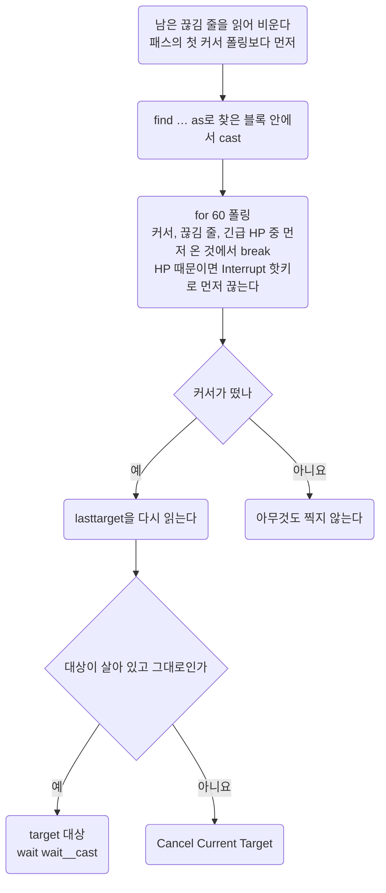

이 저장소 스크립트 언어의 정본. 되는 구문, 안 되는 구문, 명령문 비용, PvP에서 막히는 명령.
문법이 애매하면 추측 대신 [위키 Razor Scripting](https://wiki.uooutlands.com/Razor_Scripting). 알게 된 것은 여기에 추가.

- 스크립트 **쓰는 법**(헤더, 변수 접두, 타이머 관용구): [Conventions](conventions.md)
- 고친 스크립트의 **게임 반영과 확인**(캐시, 리로드): [Workflow](../working/workflow.md#04) 04절

## 00 한눈에

| 절 | 내용 |
| --- | --- |
| [01](#01) | 이 저장소의 Razor 포크 |
| [02](#02) | Outlands가 더한 문법 |
| [03](#03) | 고치기 전에 볼 함정 |
| [04](#04) | 되는 구문과 선례 |
| [05](#05) | 안 되는 구문의 근거 |
| [06](#06) | 명령문 비용과 줄이는 법 |
| [07](#07) | PvP에서 막히는 명령 |

이 문서에 걸린 질문은 [Open items](../questions/open-items.md).

::part[문법]

## 01 이 포크

- Outlands 클라이언트의 Razor = [Razor CE](https://www.razorce.com/guide/) 포크. CE에 없는 명령 다수
- 근거 우선순위: 위키 Razor Scripting 먼저, CE 가이드는 기본 문법 확인용
- 공개 스크립트: [outlands.uorazorscripts.com](https://outlands.uorazorscripts.com/)

## 02 확장 문법

Razor CE에 없거나 CE보다 넓어진 것. 존재 여부만 기록, 인자 형식은 위키에서 확인.

| 분류 | 내용 |
| --- | --- |
| 검색 | `findtype` `dclicktype` `findtypelist` `targettype` `lifttype`에 `source` `hue` `quantity` `range` 인자 |
| alias | `ground` |
| 표현식 | `find` `findlayer` `targetexists` `followers` `hue` `name` `paralyzed` `invul` `warmode` `noto` `dead` `maxweight` `diffweight` `diffhits` `diffmana` `diffstam` `counttype` `gumpexists` `ingump` `varexist` `bandaging` `cooldown` `pvp` |
| 명령 | `setvar` `unsetvar` `ignore` `unignore` `clearignore` `warmode` `getlabel` `rename` `skill` `setskill` `waitforgump` `gumpresponse` `gumpclose` `cooldown` |
| 연산자 | `as` `in` |
| 리스트 | `createlist` `clearlist` `removelist` `pushlist` `poplist` `listexists` `list` `inlist` `atlist` `foreach` |
| 타이머 | `createtimer` `removetimer` `settimer` `timer` `timerexists` |
| 기타 | 모든 루프에 `index` 내장. `overhead`, `sysmsg`에 `{{var}}` 보간 |

### 02.A 고정 문구 검사와 타겟 커서의 한계

- [Razor CE 표현식](https://www.razorce.com/guide/expressions/)의 `insysmsg`: 고정 문구 검사
  - 이름이 든 문구도 리터럴 그대로(`insysmsg "xuezhonglian has applied telekinesis to you."`). 문자열용 `setvar` 불필요
- [Outlands Razor Scripting](https://wiki.uooutlands.com/Razor_Scripting)의 `name` 표현식
  - Journal에서 시전자 이름 추출, 이름 변수를 메시지 검색 문자열에 붙이기의 증거는 아님
  - 이 조합은 인게임 미검증. 이름은 고유 serial도 아님
- 메시지 존재, 새 메시지 도착, 현재 타겟만으로 서버 응답을 특정 시전 요청에 묶는다고 가정 금지
  - TK를 받을 때와 걸 때 같은 안내가 나오는 사례: [PvP](../game/pvp.md#04.D) 04.D절
  - `clearsysmsg`가 다른 루프의 신호까지 지우는 경쟁도 있음. 초기화만으로 모호함 해소 불가
- [Razor CE 명령](https://www.razorce.com/guide/commands/)의 `targetrelloc`: 폭발 포션 지면의 안전, LOS와 높이, 폭발 반경은 보증 안 함
- `targetexists`만으로 포션 커서인지 회복 주문 커서인지 판단 금지. 커서를 연 행동과 소유권을 함께 추적

이 절은 문서로 확인한 문법과 설계상 제한. 새 실행 선례나 포션 복구 성공의 증명 아님.

::part[함정과 선례]

## 03 확인된 함정

`.razor` 수정 전 이 절의 표 확인. 대부분 인게임에서 깨졌거나 프로브로 잰 것.
선례 없음, 미확인은 증상 칸에 표시. 긴 근거는 05절, 비용 숫자는 06절.

#### 오류가 나는 구문

| 함정 | 증상 | 대신 |
| --- | --- | --- |
| 주석 안의 `;` | 그 뒤를 명령으로 읽어 그 줄에서 오류 | 마침표로 문장 끊기 |
| `for <변수>` | `Invalid for loop syntax` | 값마다 리터럴 `for N` 사슬(04절 `ingump` 사슬) |
| `not list 'x' >= var` | 파싱 오류(`syntax error in line N`). 실행 불가 | `not` 뒤에 `list` 비교식 금지. 값마다 갈래, 갈래 안에서 리터럴과 비교(04절 `ingump` 사슬) |
| `sysmessage` | `Unknown command` | `sysmsg` |
| `findtypelist`를 명령으로 | `Unknown command` | 사용 안 함. 표현식으로 추정, 확인되지 않았다 |

#### 중첩 반복의 조기 종료

| 함정 | 증상과 근거 범위 | 대신 |
| --- | --- | --- |
| 중첩 반복에서 `if` 안의 `break` | 바깥 반복이 첫 단계부터 다시 돌 수 있음. CE 소스로 재현, Outlands에서도 같은지는 인게임 미확인(05절) | 시간, 존재, 입력 조건으로 끝나는 `while`. 이런 중첩 블록에서 `break`, `continue`로 `if` 건너뛰기 금지. 재확인은 [Open items](../questions/open-items.md#09) 09절 |

#### 조건과 변수

| 함정 | 증상 | 대신 |
| --- | --- | --- |
| 변수가 왼쪽인 크기 비교(`if var__a >= var__b`, `var < 숫자`) | 문자열 비교가 되어 조용히 거짓 가능. 네크로 능력이 한 번도 안 나감. 인게임 확인됨 2026-10-04(05절) | 변수끼리는 `=`, `!=`만. 크기 비교는 내장 식을 왼쪽에(`mana >= config__x`). serial 범위 검사는 `0x40000000 > var` |
| 산술(`@setvar! var__n var__n + 1`) | 선례 없음, 안 받는다고 판단 | `counttype`으로 다시 읽기, 리스트 길이 |
| `as` alias를 묶은 `if`, `while` 블록 밖에서 읽기 | `4294967295`, `noto`가 `Mobile … not found` | 블록 안에서 `@setvar! var__x alias__x`로 복사 |
| 단어를 변수에 담기 | 따옴표와 무관하게 `4294967295`. `rename`에 주면 `That name is unacceptable.` | `pushlist` 항목은 글자 유지. `foreach x in list__y`로 꺼내 문자열 인자로. 그 밖의 문자열은 `getlabel` 결과뿐 |
| 몬스터 종류 단어, 한 글자만 바꾼 것을 펫 이름으로(`mummy`, `wytch`) | `That name is unacceptable.` (인게임 확인됨 2026-10-10) | 두 글자 이상 다르게(`mumi`는 받아짐). RunUO 계열은 `mage` 같은 단어도 막음(`necro/summon-names`) |
| 숫자(serial)를 펫 이름으로 | `That name is unacceptable.` | 글자 이름만 |
| 값을 넣지 않은 변수 | 빈 값 → 조건이 조용히 안 맞음 | `util/check.sh`가 `config__` `wait__` `interval__` `cooldown__` `var__` `alias__` `label__` 접두 검사. `timer__` `list__` `global__` 접두와 접두 없는 이름은 못 잡음 |
| `varexist`로 값 확인 | 선언 여부만 봄. 잘못 타겟한 값도 참 → 영영 안 고쳐짐 | 대상 앞이 확실한 곳에서만 `find`로 확인([Conventions](conventions.md#03.D) 03.D절) |

#### 검색

| 함정 | 증상 | 대신 |
| --- | --- | --- |
| 아이템 ignore 후 `find serial container`로 소속 판별 | ignore한 아이템이 검색에서 빠질 수 있음. 이 포크의 아이템 검색도 그런지는 확인되지 않았다(05절) | 소속 판별 먼저, 처리나 건너뛰기 뒤에 ignore. 확인은 [Open items](../questions/open-items.md#09) 09절 |
| 플레이어 serial의 `find`를 존재, 거리의 전제로 사용 | 유효한 플레이어 serial에도 `find` 거짓. 인게임 확인됨 2026-10-04(05절) | 수동 저장 serial과 검색 성공은 별개. `setvar! … lasttarget`으로 고른 serial 보관 후 `target`에 바로 전달. 검색 실패를 serial 무효나 거리 초과로 단정 금지 |
| `dead serial`로 다른 플레이어 사망 검사 | 조회마다 `dead - Cannot check death status of other players`. 진단의 `dead=0`은 생존 증거 아님. 인게임 확인됨 2026-10-04 | 상대 플레이어에게 `dead` 금지. 자기 사망의 `while not dead`와 구분. Q 대상 캐시는 사망으로 자동 비우기 불가 → 플레이어 사망 시 Stop 또는 새 대상 |
| `pvp=0`이면 다른 플레이어 정보 전부 조회 가능하다고 판단 | 대상의 `dead`, `findlayer`, `getlabel` 각각 플레이어 조회 차단 경고. 같은 serial의 저장, 복사, `noto`는 성공. 인게임 확인됨 2026-10-04. 검사별 반환값은 [03.A절](#03.A) 결과 표 | `pvp` 제한과 명령별 대상 제한을 구분. FALSE나 0이어도 경고가 있으면 실제 상태로 보지 않음 |
| `findtype` 한 번으로 여러 모빌 중 하나 고르기 | 부를 때마다 **같은 모빌** | `while findtype … as`로 돌며 검사, 아니면 `@ignore`. `endwhile` 뒤 `@clearignore` |
| 모빌을 이름으로 찾기 | 되긴 함. 이름 변경 후 Razor 캐시 갱신 여부는 확인되지 않았다 | 바디 번호로 찾기. 바디 번호는 인게임 `>info`. 내 소환수의 noto는 2(friend) |
| 패스마다 `findtype`으로 상태 세기 | `findtype`이 가장 비쌈(한 번 20 \~ 40ms, 06절). 32번이면 패스마다 1초 안팎 | 천천히 변하는 상태는 타이머로 몇 초에 한 번. `elseif` 사슬은 통째로 한 틱이라 길어도 쌈 |
| `findbuff 'Strength'`, `'Agility'`로 스탯 포션 판정 | Bless도 같은 이름 → 내 Bless든 아군 Bless든 걸려 있으면 포션 안 마심(05절) | 스탯을 기준선(기본 + 20)과 비교, 포션마다 재시도 간격([PvP](../game/pvp.md#09.D) 09.D절). Bless는 `Cunning`, Arch Protection은 `Protection`. `Magic Resist Potion`은 그 이름 그대로(사용자 확인 2026-10-09) |

#### 거리 확인과 Last Target

- 수동으로 고른 플레이어 대상은 `find`로 거리 확인 불가 → 완료한 주문 커서는 Razor `Last Target` 거리 검사로 유지 가능
- [Razor CE Options](https://www.razorce.com/help/options/#targeting-queues): `Range check Last Target`이 켜져 있으면 범위 밖 대상 요청 거부, 커서 유지. `target serial`의 거리 검사까지 보증하지는 않음
- 이전 bard-necro-pvp는 이 경로로 Explosion과 후속 EB 요청. 지금 루프는 공격 수동([PvP](../game/pvp.md#05.E) 05.E절)
- 커서가 닫혔다는 것만으로 명중, 거리, 취소 확정 금지
- 지금 Outlands 클라이언트에서 거리 밖에서 안으로 들어올 때의 전환은 확인되지 않았다. 확인 항목: [Open items](../questions/open-items.md#08.B) 08.B절
- 공통 PvP v5: 아이템, 자기 주문, 장비 중 하나를 처리하는 조건 사슬 후 다음 패스. 반복문 안 `break`, `continue` 없음. 새 본문 동작은 아직 확인되지 않았다

#### 커서와 타겟

장착과 손 도구도 지금 포크의 실제 결과 기준.

- CE [dress 문서](https://www.razorce.com/guide/commands/#dress): serial 장착 지원
  - 벌목 본문의 `dress alias__spare_hatchet`: 백팩에서 찾은 도끼에 `not found` 반복. 인게임 확인됨 2026-10-05
  - Outlands에서의 실패 원인은 확인되지 않았다 → 벌목은 기존 무기 핫키처럼 `lift` 후 `drop self lefthand`
- v9: 빈손인데 백팩 도끼 미장착 보고. 인게임 확인됨 2026-10-05
  - `findtype … self`의 실제 반환, 실패한 가드는 기록 없음 → 검색 범위를 원인으로 확정하지 않음
- v10: [bard-mace의 장착 선례](https://github.com/minu-ha/uoo/blob/master/script/archive/bard-mace.razor)처럼 `lhandempty` 먼저
  - 캐시 serial 장착 후 `findlayer self lefthand` 결과가 그 serial과 같아야 도구 사용
  - [CE 공식 문서](https://www.razorce.com/guide/expressions/#lhandempty)도 `lhandempty`를 빈손 표현식으로 설명. 이 경로의 실제 장착은 아직 확인되지 않았다
- [CE UseItemInHand](https://github.com/markdwags/Razor/blob/master/Razor/HotKeys/Misc.cs): 오른손 먼저 사용 → 왼손 Hatchet만 확인하고 일반 손 사용 핫키를 부르면 오른손의 다른 도구 사용 가능
- CE [Queued 표현식](https://github.com/markdwags/Razor/blob/master/Razor/Scripts/Expressions.cs): 행동 큐가 비었는지 검사
  - 도구 사용 후 커서가 떠도 큐가 남으면 `not queued` 때문에 자기 타깃을 건너뛸 수 있음
  - 벌목 v8: 손 도구 직후 같은 블록에서 3000ms까지 커서 대기, 중립 커서면 자기 타깃
  - 대기 명령이 실행 흐름을 붙잡음 → 별도 pending 상태, 다음 패스 커서 처리 블록 없음
  - 큐가 실제 원인이었는지는 아직 확인되지 않았다
- v8 기본 채집: 사용자 보고로 정상. 인게임 확인됨 2026-10-05
- v10: 오른손 제어 추가 없음, 실제 왼손과 캐시 serial 비교. 새 장착과 교체 경로의 확인 항목: [Open items](../questions/open-items.md#09) 09절

`insysmsg`의 소비 범위:

- CE 원본 [SystemMessages.Exists](https://github.com/markdwags/Razor/blob/master/Razor/Core/SystemMessages.cs): 맞은 최신 줄과 그보다 오래된 줄을 함께 지움
- 한 줄에서 거리 문구와 발견 문구를 따로 읽는 구조 회피, 중요한 경보 먼저
- Outlands 포크에서도 같은지는 인게임에서 확인되지 않았다

타겟 주문 한 번의 모양: 04절 끝.

| 함정 | 증상 | 대신 |
| --- | --- | --- |
| `for 25`, `wait 100`으로 커서 폴링 | 4서클 커서가 루프 종료 후 뜸(2026-09-29). 남은 커서가 `not targetexists` 블록 전부 차단 | `for 60`. 한 바퀴가 `wait` 값보다 훨씬 짧게 도는 것으로 보임. 원인은 확인되지 않았다 |
| 커서 없는 시전(힐 에이전트, Create Food, 자기 버프)을 `not casting`부터 보며 폴링 | 시전 끊김 순간 `casting` 해제 → 끊김 줄을 안 읽고 나감(2026-09-29). 다음 커서 폴링이 그 줄을 제 것으로 읽고 첫 바퀴에 나가 커서가 남음 | 커서 폴링 시작 전에 끊김 줄을 한 번 읽어 비움(`magery/rotation` 첫머리, `buff/spells`의 Spell Siphon 화살 앞) |
| 치유할 것이 없을 때 Smart Heal, Greater Heal 에이전트 | 풀피면 커서를 안 찍고 남김(2026-09-29). 모든 블록 정지 | 에이전트 폴링 후 `targetexists and diffhits = 0`이면 `Cancel Current Target` |
| 스크립트의 `target`과 `Target Self` | lasttarget이 백팩이나 나로 바뀜. 10칸 밖에서 고른 타겟을 노래가 덮어써서 교전 실패(2026-09-29) | 타겟은 화면 거리에서 받아 둠. 백팩이나 나를 찍기 전 lasttarget 재확인 |
| `setlasttarget alias__x`로 lasttarget 복원 | Razor CE 문서의 `setlasttarget ('serial')`과 달리 `Target a new 'Last Target'` 커서. 뒤의 sysmsg 줄 없음, 커서 취소마다 `Target queue cleared.`와 같은 커서가 번갈아 찍힘. 인게임 확인됨 2026-10-07(skinning-enhanced v3 Journal). 스크립트가 그 줄에서 커서 대기로 보임. 인자 무시 원인은 확인되지 않았다 | 사용 안 함. lasttarget 덮어쓰기는 기억한 대상이 없을 때만(`skinning-enhanced.razor` SKINNING) |

### 03.A 대상 조회 진단 핫키

- 용도: 몬스터에서는 되던 조회가 플레이어에서 실패할 때의 단발 진단
- [debug-target-find](https://github.com/minu-ha/uoo/blob/master/script/debug/debug-target-find.razor): 검색
- [debug-target-state](https://github.com/minu-ha/uoo/blob/master/script/debug/debug-target-state.razor): 상태, 변수 비교, 시전 전 조건
- 주문, 공격, 소환수 명령은 보내지 않음
- v1의 alt 검색, NPC 검색, 상태 조회는 인게임 확인됨 2026-10-04
- 실행별 반환값과 아직 안 한 검사: 아래 결과 표

#### 같은 조건으로 비교하기

1. 전투 스크립트 Stop. `pvp=0` 일반 필드에서 조회가 되던 몬스터와 alt 비교
   - 검사 중 서로 이동, 타겟 변경 금지. `pvp=1`이면 제한된 결과가 섞이지 않게 진단 중단
2. Scripts 탭 Reload all scripts → `debug-target-find` Play
   - `TARGET FIND PROBE v1 loaded`, `[ target, pick ]` → 가까운 몬스터 타겟
   - `F END`까지 나오면 같은 거리의 alt로 반복. 시작 문구가 없으면 비교 전에 캐시 확인
3. 가능하면 2칸 안, 3\~5칸, 6\~10칸, 11\~12칸, 13\~18칸에서 반복, 실제 거리 기록
   - 넓은 범위에서 찾은 대상을 좁은 범위에서 놓치는지 비교. 기본 검색부터 실패면 거리 판정 불가
4. `Last Target`과 변수 경로 비교: 먼저 Q로 같은 대상 지정
   - find 본문의 `config__probe_find_use_last_target`를 `1`로 → 새 커서 없이 그 serial로 실행
   - 기본값 `0`: 직접 찍은 serial과 Q serial이 다르면 F11 건너뜀
5. Q로 같은 대상 선택 → `debug-target-state` Play
   - `TARGET STATE PROBE v1 loaded`부터 `S END`까지의 제한 경고와 결과 함께 확인
   - 기본 Q 모드는 기존 주문 커서를 취소하지 않음. 시전 전 조건은 새 타겟 커서 요구 전에 읽음

핫키 실행의 캐시 반영, 종료 후 `git status`: [Workflow](../working/workflow.md#04.A) 04.A절, 04.B절.

#### 검색 번호

| 번호 | 검사 | 비교 목적 |
| --- | --- | --- |
| F00 | `find backpack` | 내 아이템 조회 대조군 |
| F01, F02 | `find serial`, 같은 식에 `as` | 기본 검색과 alias 바인딩. alias 성공 시 `same_selected=1` 확인 |
| F03, F04, F05 | `ground`, `ground -1 -1 18`, 같은 식에 `as` | 검색 소스, 거리 인자, alias의 결과 차이 |
| F06, F07, F08, F09 | 같은 serial을 2, 5, 10, 12칸으로 검색 | 기본 검색과 F04가 성공한 대상에서 거리 필터 비교 |
| F10, F11 | F10은 복사한 세션 변수, F11은 같은 대상의 `lasttarget` | 같은 serial을 읽는 경로 차이. Q 대상이 다르면 F11 SKIP |
| F12, F13 | F12는 `ignore` 후 검색, F13은 `unignore` 후 검색 | F04 TRUE, F12 FALSE, F13 TRUE → ignore 동작. 모두 FALSE면 ignore 탓으로 단정 금지 |
| F14, F15 | 바디 ID의 `findtype`으로 18칸, 10칸 검색 | 다른 모빌은 성공 아님, 고른 serial과 같은 항목만 TRUE. 최대 40개를 채우면 INCOMPLETE |

- F14, F15는 기본 SKIP. 대상 `>info`의 graphic ID나 body ID로 `config__probe_find_body`의 `0`을 바꾸면 실행. serial 칸 아님
- find 진단은 시작 시 남은 커서 취소, ignore 목록 비움. 바디 검색 중 임시 ignore도 끝나면 비움

#### 상태와 변수 번호

| 번호 | 검사 | 해석 |
| --- | --- | --- |
| G01, G02, G03 | 시전, 커서, 이동 쿨. 마나. TK 시약 | 현재 반환값만 출력. 마나 기준은 TK 9, dump 40. 혈이끼와 맨드레이크 따로 검색 |
| G04, G05 | 기존 `timer__tk` 30,500ms. me 바와 target 바 | 타이머 생성, 초기화 없음. 바가 켜져도 내가 건 TK의 소유권 증거 아님 |
| S01, S02 | 내 `dead`, 대상의 `dead serial` | 제한 경고가 있으면 대상 상태 UNKNOWN. RETURN=0을 생존으로 읽지 않음 |
| S03, S04 | notoriety 7종, 대상의 backpack layer | 분류와 레이어 반환을 따로 확인. 레이어를 못 찾았다고 대상 부재로 판단 금지 |
| S05, S06, S07 | 변수가 왼쪽인 크기 비교, 숫자가 왼쪽인 같은 비교, 복사본의 같음 비교 | 같은 serial에서 S05와 S06이 다르면 비교 방향의 형 변환 문제 재현. 같음 비교도 따로 |
| S08 | `getlabel` | 예전 label 삭제 후 맨 마지막 호출. LABEL이나 NO_LABEL을 원래 경고와 함께 기록 |

- state 진단의 `config__probe_state_use_last_target` 기본값 `1`. `0`이면 새 대상 타겟, 이미 시전 중이거나 커서가 있으면 중단
- 설정과 세션 변수: `config__probe_find_*`, `config__probe_state_*`, `var__probe_find_*`, `var__probe_state_*`
- alias, label도 probe 이름으로 따로. 추가 타이머 없음

#### 실패 로그 읽기

- `BEGIN` 다음의 TRUE, FALSE, RETURN, LABEL = 명령의 반환
- FALSE만 있고 제한 경고 없음 → 검색 실패 관찰만 기록. `Skipped`, `Cannot check` 같은 경고 → 조회 제한으로 기록
- Script Error, 결과와 END 없음 → 마지막 BEGIN 번호와 오류 줄 번호가 멈춘 지점
- 두 진단은 별도 파일 → 하나가 멈춰도 다른 파일로 나머지 비교 가능

#### 2026-10-04 v1 진단 결과

사용자가 올린 alt 로그와 NPC 로그 비교. 양쪽 모두 find 진단과 state 진단이 END까지 실행, Script Error 아님. 인게임 확인됨 2026-10-04.

| 검사 | NPC Ohanna | 플레이어 alt indian angus pay |
| --- | --- | --- |
| serial 저장과 복사 | `885491`로 일치 | `1477299`로 일치. Q serial도 같은 값 |
| F00 내 backpack | TRUE | TRUE |
| F01에서 F05, F10 | TRUE. F02와 F05의 alias도 `same_selected=1` | FALSE. 기본, ground, 18칸, alias, 복사 변수 경로 모두 실패 |
| F06 2칸, F07에서 F09까지 5, 10, 12칸 | 2칸 FALSE, 나머지 TRUE | 모두 FALSE |
| F11 Last Target | SKIP. Q가 alt로 남아 같은 대상 비교 아님 | 같은 alt serial로 FALSE |
| F12 ignore 후, F13 unignore 후 | 등록과 해제 안내 모두 나옴, 검색은 둘 다 TRUE | 둘 다 FALSE. 시작의 clearignore와 해제 후에도 실패 |
| F14, F15 바디 findtype | SKIP | SKIP. 플레이어 모빌의 findtype 결과는 확인되지 않았다 |
| S02 대상 dead | RETURN=0. 플레이어 조회 제한 경고 없음 | `Cannot check death status of other players`. RETURN=0, 실제 상태 UNKNOWN |
| S03 noto, S04 findlayer | noto=3(hostile). layer FALSE, 제한 경고 없음 | noto=1(innocent). findlayer는 `may not be used on other players`와 FALSE |
| S05 변수 왼쪽, S06 숫자 왼쪽, S07 같음 비교 | 0, 1, 1 | 0, 1, 1. 두 serial 모두 비교 방향 차이 재현. 플레이어 제한과 별개 |
| S08 getlabel | NO_LABEL. 플레이어 건너뛰기 경고 없음. label이 안 온 이유는 확인되지 않았다 | `Skipped getting label because serial is a player`, NO_LABEL |

- NPC 거리 필터: 2칸에서 놓침, 5칸 이상에서 찾음. 실제 거리와 이동 여부 미기록 → 정확한 칸 수 미확정
- alt: 거리 인자 없는 기본 검색부터 실패 → 거리 초과로 판단 불가
- 검색에서 플레이어가 빠지는 내부 이유(의도한 필터인지 결함인지)는 확인되지 않았다
- NPC: ignore 등록 후에도 serial 직접 검색 성공 → 이번 테스트의 `find serial`은 ignore 등록만으로 빠지지 않음
  - ignore 기능 전체 고장으로 일반화 금지. `findtype`에 ignore가 먹는지는 이 프로브에서 미검사
- alt 상태 진단: `pvp`, casting, cursor, walk cooldown 0. TK와 dump의 마나 조건, TK 시약 두 가지 1
  - 기존 TK 재시도 타이머 ready=1, me 바와 target 바 0
  - 진단 시점의 값. 전투 루프의 대상 캐시, 자기 회복, 버프 우선순위, Explosion과 EB 시약 전체 통과의 뜻 아님
- find의 직접 선택은 Q(Last Target)를 바꾸지 않음. state 기본 모드는 Q를 읽음
- NPC 상태: Q를 NPC로 바꾼 뒤 `selected=885491` 실행에서 확인
- 상태 조회 비교 시 캐릭터 이름 대신 context의 selected serial로 검사 대상 확인
- alt의 바디 findtype, 여러 거리 반복 결과는 확인되지 않았다

## 04 되는 구문과 선례

모두 저장소에 선례 있음. 새 패턴 전에 여기서 먼저 찾음.

| 구문 | 선례 |
| --- | --- |
| `not inlist '리스트' <serial 변수>` | `magery/rotation`(OPENER) |
| `list__magic_drained_targets`와 `list__magic_cursed_targets`로 2단 오프닝 | `magery/rotation`(OPENER) |
| `createlist`, `removelist`, `clearlist`, `pushlist` | 여러 파일 |
| `pushlist '리스트' '단어'`, `foreach x in 리스트`, `index = <변수>`, `@rename <serial 변수> x`로 단어를 문자열 인자로 전달 | `necro/summon-names`(`list__summon_kinds`). 2026-09-28 프로브에서 항목이 글자 그대로 읽히고 `rename`이 받음. `rename`은 위키에 있음, CE는 `CanRename`인 펫에만 보냄 |
| `ingump "10/"` … `"1/"`처럼 큰 수부터 내려오는 사슬로 숫자 읽기 | `necro/symbols`의 심볼 수. `ingump`는 부분 문자열 일치 → 큰 수부터. 갈래마다 리터럴 `for N`으로 리스트 채움 |
| `findbuff "song of discordance"` | `archive/bard-mace.razor` BARD SONG BUFF |
| `cooldown "magic arrow" = 0` | `magery/rotation`(PROC CORE). 항목은 `cooldowns.xml` |
| `while findtype … backpack as`와 `@ignore` | `bard/instrument` |
| `findtype 24\|158\|… ground -1 -1 <range> as`로 바디 번호로 모빌 찾기 | `necro/summon-names`, 옛 `bard-necro`의 PROVO FOLLOWER CACHE(git 이력) |
| `find <변수> ground -1 -1 <range> as`와 `dead`로 슬롯 비우기 | `necro/summon-names`, 옛 `bard-necro`의 PROVO FOLLOWER CACHE(git 이력) |
| `not dead X and noto X != "hostile" …` | `necro/summon-names` |
| `useskill`, `waitfortarget`, `target backpack` 순서 | `archive/bard-mace.razor` BARD SONG BUFF |
| `for 60`과 `break`로 커서 폴링 | `magery/rotation`. 참고했던 `auto-mage.razor:1160`은 저장소에 없음 |
| `hotkey 'Vampiric Embrace'`와 `hotkey 'Target Self'` | `necro/vampiric-embrace`. 위키 기준 자기 타겟 시 주변 시체 자동 탐색(인게임 확인됨 2026-09-25) |
| `hotkey 'Drink Heal'` 같은 포션 핫키 | `recovery/heal`. 이름은 Razor 핫키 목록의 Potions 항목 그대로 |
| `hotkey "> Interrupt"` | `magery/rotation`, `magery/flamestrike`의 커서 폴링. 제 시전을 끊고 긴급 힐로. 같은 핫키가 휠 아래에도 있음([Hotkeys](../game/hotkeys.md)) |
| `stop` | `bard/instrument` |
| `targetexists "beneficial"`, `"neutral"`, `"harmful"`로 커서 종류 구분 | `buff/spells`. Bless는 beneficial, Arch Protection은 **neutral**(사용자 확인 2026-10-10. 처음 tamer 스크립트는 beneficial로 잘못 읽어 커서가 남음). Flamestrike는 harmful(`magery/flamestrike`), 손 도구와 칼은 neutral(`gather/*`). 기대와 다른 커서는 취소 → 다른 블록 차단 방지 |

#### 타겟 주문의 모양

`magery/rotation`의 타겟 주문 모양.

1. 패스의 첫 커서 폴링 전에 남은 끊김 줄을 한 번 읽어 비움
2. 대상을 `find … as`로 찾은 블록 안에서 `cast`. alias는 블록 밖에서 못 읽음 → `target`까지 모두 안에
3. `for 60` 폴링. 커서, 끊김 줄, 긴급 HP 중 먼저 온 것에서 `break`. HP 때문이면 `hotkey "> Interrupt"`로 제 시전 먼저 끊음
4. 커서 없음 → 아무것도 안 찍음. 커서 있음 → lasttarget 재확인
   - 대상 사망, 플레이어의 대상 변경 → `Cancel Current Target`
   - 그대로 → `target`, `wait wait__cast`

## 05 안 되는 구문의 근거

03절 표의 긴 근거, 표와 같은 순서. 선례가 없어 쓰지 않는 것은 맨 끝.

- **`for <변수>`**: `Invalid for loop syntax`(2026-09-28 프로브). 횟수는 리터럴만. 변수 횟수가 필요하면 값마다 `for N` 사슬
- **`while not list 'x' >= var`**: `syntax error`, 파싱 불가(2026-09-28). `not` 뒤에 `list` 비교식 금지
- **`findtypelist`를 명령으로**: `Unknown command`. 쓴다면 `findtype`처럼 `if` 안의 표현식일 것, 확인되지 않았다
- **중첩 반복에서 `if` 안의 `break`**
  - [CE Script.ExecuteNext의 BREAK](https://github.com/markdwags/Razor/blob/master/Razor/Scripts/Engine/Interpreter.cs): 반복문 뒤로 이동, 현재 범위는 `PopScope` 한 번으로만 지움
  - if 범위만 지워지고 안쪽 반복 범위가 남으면 바깥 FOR가 새 진입으로 보고 index를 0으로 되돌릴 수 있음
  - 2026-10-05 CE 원본 제어 흐름 재현: for 2 안의 for 1에서 if를 거쳐 break → 바깥 반복이 0단계 반복
  - lumberjack v12 본문도 Logs 단계만 반복, END 미도달
  - CE 소스 재현일 뿐, Outlands 내부 구현도 같다는 인게임 확인 아님
  - 이전의 재귀형 모의 검사는 이 경우를 Python의 정상 반복 종료로 처리해 차이를 놓침
  - v13 목재 정리에서 이 경로 제거. 다른 기존 루프의 일괄 변경, 모든 break 실패로의 일반화는 하지 않음
- **변수가 왼쪽인 크기 비교**: `var__symbols >= config__symbols_blood_oath`처럼 변수끼리, 변수와 숫자의 크기 비교. 조건에서 변수는 `=`, `!=`만
  - Razor CE [EvaluateBinaryOperand와 CompareOperands](https://github.com/markdwags/Razor/blob/master/Razor/Scripts/Engine/Interpreter.cs): session 변수를 문자열로 읽고 오른쪽 값을 왼쪽 자료형으로 변환
  - → `var < 0x40000000`은 숫자 범위 검사가 아닌 문자열 비교가 될 수 있음
  - Bard Necro의 네크로 능력이 한 번도 안 나가던 원인. 조건이 조용히 거짓
  - 2026-10-04 전체 루프의 `var < 0x40000000` 경로도 대상 저장 전에 멈춤
    - 순서를 바꾸자 같은 Q serial에서 `mobile=1`, 대상 저장, TK, Explosion에 이은 EB 피해까지 나옴. 인게임 확인됨 2026-10-04
  - CE 소스의 변환 방향에 따라 serial 범위 검사는 `0x40000000 > var`. 이 값은 [Serial.IsMobile](https://github.com/markdwags/Razor/blob/master/Razor/Core/Serial.cs)의 모빌과 아이템 경계, 개인 serial 아님
    - 이 순서의 모빌 판정은 지금 클라이언트의 alt 테스트에서 확인. 내부 자료형 전체가 CE와 같다고 일반화하지는 않음
  - 수 세기: 옛 `bard-necro`처럼 <strong>리스트에 항목을 밀어 넣고 `list 'name' >= n`</strong>으로 비교
  - `mana >= config__x`처럼 **내장 식이 왼쪽**이면 가능. 내장 `index`도 왼쪽이면 변수와 비교 가능
  - `while` 조건에도 변수 크기 비교 금지(선례 없음)
- **`as` alias를 묶은 블록 밖에서 읽기**: `if findtype … as alias__x`와 `endif` 뒤에서 `alias__x`를 읽으면 `4294967295`, `noto`가 `Mobile … not found`
  - 블록 안에서 `@setvar! var__x alias__x`로 복사. 모듈의 alias가 모두 블록 안에서만 쓰이는 이유
- **단어를 변수에 담기**: `@setvar! var__x nomeeheh`는 따옴표 유무와 무관하게 `4294967295`(2026-09-28 프로브)
  - 숫자 `5000`은 `5000`, `0x622396`은 10진수 `6431638`. 변수에는 숫자와 serial만
  - → `rename <serial> <변수>`는 엉뚱한 이름을 보내 `That name is unacceptable.`. 단어는 리스트에 담아 `foreach`로. serial 쪽은 변수 가능
- **숫자를 펫 이름으로**: serial을 그대로 주면 `That name is unacceptable.`(2026-09-28 프로브). 이름에 숫자 불가
- **ignore 후 소속 판별**: [공식 문서](https://wiki.uooutlands.com/Razor_Scripting#ignore)상 ignore는 검색 명령에서 객체를 뺌
  - 2026-10-05 v13 목재 정리는 파우치 소속 검사 전에 ignore. 검색 제외 동작을 넣은 모의 재현에서 파우치에 이미 있던 Boards를 다시 들어 올림
  - 앞선 NPC 직접 serial 프로브에서는 ignore 후에도 TRUE → 지금 포크의 아이템 검색에 같은 동작이 적용되는지는 아직 확인되지 않았다
  - v14: 두 검색 동작 모두에서 파우치에 이미 있는 Boards 제외
  - clearignore는 단계의 시작과 끝 → 다음 정리 주기에 실패한 요청과 새 묶음 재탐색. 단계 중 매번 비우면 이미 본 묶음을 다시 고를 수 있음
- **플레이어 serial의 `find`**: 지금 클라이언트의 파란 alt 테스트에서 Q serial은 유효, `find serial`과 `find serial ground -1 -1 18` 모두 거짓. 인게임 확인됨 2026-10-04
  - 단발 `setvar → cast → target` 경로와 이전 bard-necro-pvp의 Q serial 직접 저장 경로는 모두 같은 플레이어에게 TK 성공, 공격 대상 이름과 30초 부착 안내 수신
  - 검색 실패 원인은 확인되지 않았다. 모든 클라이언트와 모든 플레이어의 일반 규칙으로 확장 금지
- **`dead serial`**: 전체 루프 실행, TK, Explosion, EB도 상대에게 들어감. 그래도 조회마다 경고(인게임 확인됨 2026-10-04)
- **`findtype`은 매번 같은 모빌 반환**: Razor CE처럼 무작위 아님. 한 번만 부르면 이미 처리한 모빌만 계속(2026-09-28, 둘째 소환수에 이름 미부여)
  - `while findtype … as`로 돌며 검사, 아니면 `@ignore`, `endwhile` 뒤 `@clearignore`로 한 번에 전부
- **`findbuff`로 스탯 포션 판정**: 위키 [BuffIcons](https://wiki.uooutlands.com/Template:BuffIcons)는 같은 아이콘을 `Strength Spell / Potion`으로 표기
  - Bless는 버프 바에 `Strength`, `Agility`, `Cunning`으로 뜸, 포션 버프 이름에 Potion 없음(사용자 확인 2026-10-09)
  - 위키 표의 `Strength Potion Usage Cooldown`도 인게임 이름으로 확인되지 않았다
- 선례가 없어 쓰지 않는 것
  - 산술 `@setvar! var__n var__n + 1`
  - `menu <serial> <변수>`. 인덱스는 반드시 리터럴
  - 조건 안의 괄호

::part[비용과 제약]

## 06 명령문 비용

**비용 = 검색 종류가 아닌 "이 패스에서 밟는 줄 수". 그중 `findtype`이 가장 비쌈.**
→ **자주 안 바뀌는 상태는 타이머로 막고, 흔한 경로가 밟는 줄을 줄임.**

- Razor CE 원본 스크립트 엔진: **타이머 1틱에 명령문 하나** 실행
  - `ScriptManager.ScriptTimer` → `Interpreter.ExecuteScript` → `ExecuteNext` 1회. 틱 기본 25ms
  - 거짓 `if`는 본문 건너뛰기까지 한 틱, `elseif` 사슬은 한 틱 안에서 평가
- 이 포크는 그보다 빠르지만 모양은 같음. 2026-09-28 프로브(`probe-tick`, 지금은 삭제)로 잰 값:

| 잰 것 | 걸린 시간 | 한 개당 |
| --- | --- | --- |
| 대입 100줄 | 0.5 \~ 1초 | 5 \~ 10ms |
| 거짓 `if` 100개(3줄 본문 건너뜀) | 1 \~ 2초 | 10 \~ 20ms |
| `findtype … self` 50번 | 1 \~ 2초 | **20 \~ 40ms** |
| 20갈래 `elseif` 사슬 10번 | 0.25 \~ 0.5초 | 사슬 하나 25 \~ 50ms |

Bard Necro 루프 적용 결과: [Bard Necro](../templates/bard-necro.md#05.H) 05.H절. 패스마다 `findtype` 최대 32번이던 시약 플래그 읽기를 10초에 7번으로 줄임(처음에는 30초).

## 07 PvP 제약

구조화 PvP, 팩션 상태의 스크립트 제약.

| 제약 | 영향 |
| --- | --- |
| `settimer` `removetimer` `getlabel` `rename` `cooldown` `wait` 같은 명령 차단 | 타이머, 라벨, 쿨다운에 기대는 로직 정지 |
| 플레이어 serial이 `0x0` | 상대를 변수에 담기 불가, 상대 머리 위 `overhead … <serial>` 불가 |
| `find` 계열이 자기 아이템만 잡음 | 상대나 바닥 물건을 찾는 로직 정지 |

PvP 겸용 스크립트 규칙: [Conventions](conventions.md#07) 07절. 게임 쪽 PvP 규칙과 숫자: [PvP](../game/pvp.md).
