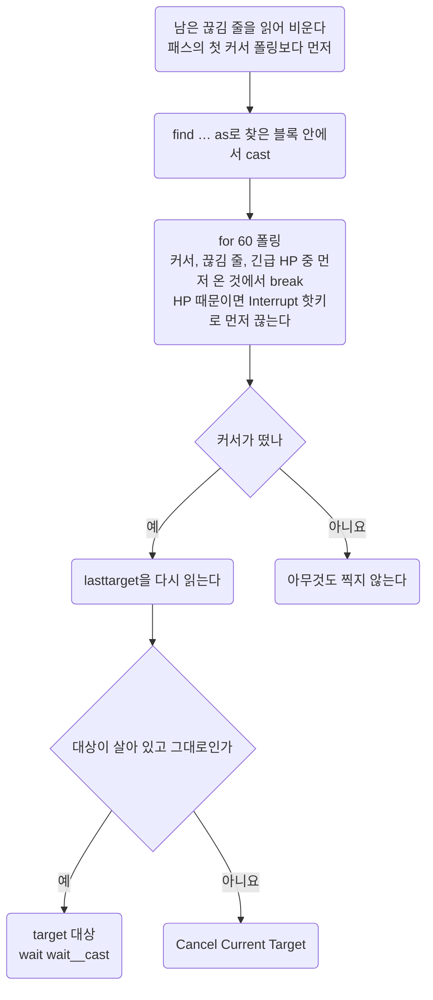

이 저장소 스크립트가 쓰는 언어의 정본. 되는 구문, 안 되는 구문, 명령문 비용, PvP에서 막히는 것.
문법이 애매하면 추측하지 말고 [위키 Razor Scripting](https://wiki.uooutlands.com/Razor_Scripting)을 읽고, 알게 된 것을 여기에 더한다.

- 스크립트를 **어떻게 쓰는가** (헤더, 변수 접두, 타이머 관용구)는 [conventions.md](conventions.md).
- 고친 스크립트를 **게임에 반영하고 확인하는 법** (캐시, 리로드)은 [workflow.md](../working/workflow.md#04) 04절.

## 00 한눈에

| 절 | 무엇을 답하나 |
| --- | --- |
| [01](#01) | 이 저장소가 쓰는 Razor는 어떤 포크인가 |
| [02](#02) | Outlands가 더한 문법은 무엇인가 |
| [03](#03) | 고치기 전에 꼭 볼 함정은 무엇인가 |
| [04](#04) | 이 구문이 되는가. 되는 구문과 그 선례 |
| [05](#05) | 안 되는 구문은 왜 안 되나 |
| [06](#06) | 명령문 하나가 얼마나 드나, 어떻게 줄이나 |
| [07](#07) | PvP에서 막히는 명령은 무엇인가 |

이 문서에 걸린 질문은 [open-items.md](../questions/open-items.md)에 모았다.

::part[문법]

## 01 이 포크

Outlands 클라이언트에 딸린 Razor는 [Razor CE](https://www.razorce.com/guide/)의 포크이고 CE에 없는 명령이 많다.
근거는 위키 Razor Scripting이 1순위, CE 가이드는 기본 문법 확인용이다. 공개 스크립트는 [outlands.uorazorscripts.com](https://outlands.uorazorscripts.com/)에 있다.

## 02 확장 문법

Razor CE에 없거나 확장된 것. 존재 여부만 적어 두니 인자 형식은 위키에서 확인한다.

| 분류 | 무엇 |
| --- | --- |
| 검색 | `findtype` `dclicktype` `findtypelist` `targettype` `lifttype`에 `source` `hue` `quantity` `range` 인자 |
| alias | `ground` |
| 표현식 | `find` `findlayer` `targetexists` `followers` `hue` `name` `paralyzed` `invul` `warmode` `noto` `dead` `maxweight` `diffweight` `diffhits` `diffmana` `diffstam` `counttype` `gumpexists` `ingump` `varexist` `bandaging` `cooldown` `pvp` |
| 명령 | `setvar` `unsetvar` `ignore` `unignore` `clearignore` `warmode` `getlabel` `rename` `skill` `setskill` `waitforgump` `gumpresponse` `gumpclose` `cooldown` |
| 연산자 | `as` `in` |
| 리스트 | `createlist` `clearlist` `removelist` `pushlist` `poplist` `listexists` `list` `inlist` `atlist` `foreach` |
| 타이머 | `createtimer` `removetimer` `settimer` `timer` `timerexists` |
| 기타 | 모든 루프에 `index` 내장. `overhead` / `sysmsg`에 `{{var}}` 보간 |

### 02.A 고정 문구 검사와 타겟 커서의 한계

[Razor CE 표현식](https://www.razorce.com/guide/expressions/)의 `insysmsg`는 고정 문구를 검사한다.
`insysmsg "xuezhonglian has applied telekinesis to you."`처럼 이름을 리터럴에 포함하는 데 문자열용 `setvar`는 필요 없다.

[Outlands Razor Scripting](https://wiki.uooutlands.com/Razor_Scripting)에는 `name` 표현식도 있다.
그러나 이것이 Journal에서 시전자 이름을 추출하거나, 이름 변수를 메시지 검색 문자열에 동적으로 붙일 수 있다는 증거는 아니다.
해당 조합의 인게임 검증은 아직 없고, 이름은 고유 serial도 아니다.

메시지의 존재·신선함·현재 타겟만으로 서버 응답을 특정 시전 요청에 결속할 수 있다고 가정하지 않는다.
TK 수신과 송신이 같은 안내를 만드는 사례는 [pvp.md](../game/pvp.md#04.D) 04.D절에 있다.
`clearsysmsg`로 다른 루프의 신호까지 지우는 경쟁도 고려해야 하며, 단순 초기화로 이 모호성이 해결되지는 않는다.

[Razor CE 명령](https://www.razorce.com/guide/commands/)에는 `targetrelloc`가 있지만,
폭발 포션의 안전한 지면·LOS·높이·폭발 반경을 자동으로 보증하지 않는다.
`targetexists`만으로 현재 커서가 포션인지 회복 주문인지 알았다고 처리하지 말고, 열었던 행동과 소유권을 함께 추적한다.

이 절은 문서에서 확인한 문법과 설계 제한이다. 새로운 실행 선례나 실제 포션 복구 성공을 인증하는 절이 아니다.

::part[함정 · 선례]

## 03 확인된 함정

`.razor`를 고치기 전에 이 절의 표를 읽는다. 대부분 인게임에서 깨졌거나 프로브로 잰 것이다. 선례가 없거나 확인되지 않은 것은 증상 칸에 그렇게 적었다.
근거는 05절, 비용 숫자는 06절.

#### 에러가 나는 구문

| 함정 | 증상 | 대신 |
| --- | --- | --- |
| 주석 안의 `;` | 그 뒤를 명령으로 파싱해서 그 줄에서 에러 | 마침표로 문장을 끊는다 |
| `for <변수>` | `Invalid for loop syntax` | 값별 리터럴 `for N` 사슬 (04절 `ingump` 사슬) |
| `not list 'x' >= var` | 파싱 에러 (`syntax error in line N`, 실행 자체가 안 됨) | `not` 뒤에 `list` 비교식을 두지 않는다. 값마다 갈래를 나누고 갈래 안에서 리터럴과 비교한다 (04절 `ingump` 사슬) |
| `sysmessage` | `Unknown command` | `sysmsg` |
| `findtypelist`를 명령으로 | `Unknown command` | 안 쓴다. 표현식일 것으로 보이나 확인되지 않았다 |

#### 중첩 반복의 조기 종료

| 함정 | 증상과 근거 범위 | 대신 |
| --- | --- | --- |
| 중첩 반복에서 `if` 안의 `break` | [CE Script.ExecuteNext의 BREAK](https://github.com/markdwags/Razor/blob/master/Razor/Scripts/Engine/Interpreter.cs)는 반복문 뒤로 이동하지만 현재 범위는 `PopScope` 한 번으로 제거한다. if 범위만 제거되고 안쪽 반복 범위가 남으면 바깥 FOR가 새 진입으로 판단해 index를 0으로 초기화할 수 있다. 2026-10-05 CE 원본의 제어 흐름 재현에서 for 2 안 for 1 → if → break가 바깥 0단계를 반복했다. lumberjack v12 본문도 Logs 단계만 반복하고 END에 도달하지 않았다. 이는 CE 소스 재현이며 Outlands 내부 구현과 동일하다는 인게임 확인은 아니다. 기존 재귀형 모의 검사는 정상 Python 반복 종료로 처리하여 이 차이를 놓쳤다 | 시간·존재·입력 조건으로 끝나는 `while`을 쓰고 이 중첩 블록에서는 break·continue로 if를 건너뛰지 않는다. v13 목재 정리는 이 경로를 제거했다. 다른 기존 루프까지 일괄 변경하거나 모든 break가 실패한다고 일반화하지 않는다. 실제 재확인은 [open-items.md](../questions/open-items.md#09) 09절 |

#### 조건과 변수

| 함정 | 증상 | 대신 |
| --- | --- | --- |
| 변수가 왼쪽인 대소 비교 (`if var__a >= var__b`, `var < 숫자`) | Razor CE의 [EvaluateBinaryOperand / CompareOperands](https://github.com/markdwags/Razor/blob/master/Razor/Scripts/Engine/Interpreter.cs)는 session 변수를 문자열로 읽고 오른쪽 값을 왼쪽 자료형으로 바꾼다. 따라서 `var < 0x40000000`은 숫자 범위 검사가 아닌 문자열 비교가 될 수 있다. 이전 네크로 비교는 조용히 거짓이 되어 능력이 한 번도 안 나갔다. 2026-10-04 전체 루프의 `var < 0x40000000` 경로도 대상 저장 전에 멈췄고, 순서를 바꾸자 같은 Q serial에서 `mobile=1`·대상 저장·TK·Explosion→EB 피해까지 나왔다. 인게임 확인됨 2026-10-04 | 변수끼리는 `=` `!=`만 쓴다. 선례는 `mana >= config__x`처럼 내장 식이 왼쪽인 비교다. CE 소스의 변환 방향을 따라 serial 범위 검사는 `0x40000000 > var`로 바꿨다. 이 값은 [Serial.IsMobile](https://github.com/markdwags/Razor/blob/master/Razor/Core/Serial.cs)의 모빌·아이템 구분 경계이며 개인 serial이 아니다. 이 순서의 모빌 판정은 현재 클라이언트의 alt 테스트에서 확인했다. 내부 자료형 전체가 CE와 동일하다고 일반화하지 않는다 |
| 산술 (`@setvar! var__n var__n + 1`) | 선례 없음, 안 받는다고 본다 | `counttype`으로 다시 읽거나 리스트 길이 |
| `as` alias를 묶은 `if` / `while` 블록 밖에서 읽기 | `4294967295`, `noto`가 `Mobile … not found` | 블록 안에서 `@setvar! var__x alias__x`로 복사해 나온다 |
| 단어를 변수에 담기 | `4294967295` (따옴표 무관). `rename`에 주면 `That name is unacceptable.` | `pushlist` 항목은 글자를 유지한다. `foreach x in list__y`로 꺼내 문자열 인자에 준다. 그 밖의 문자열은 `getlabel` 결과뿐 |
| 몬스터 종류 단어나 한 글자만 바꾼 것을 펫 이름으로 (`mummy`, `wytch`) | `That name is unacceptable.` (인게임 확인됨 2026-10-10) | 두 글자 이상 다르게 짓는다 (`mumi`는 받아짐). RunUO 계열은 `mage` 같은 단어도 이름에서 막는다 (`necro/summon-names`) |
| 숫자 (serial)를 펫 이름으로 | `That name is unacceptable.` | 글자 이름만 |
| 미선언 변수 | 빈 값으로 읽혀 조건이 조용히 안 맞는다 | `util/check.sh`는 `config__` `wait__` `interval__` `cooldown__` `var__` `alias__` `label__` 접두를 잡는다. `timer__` `list__` `global__` 접두와 접두 없는 이름은 못 잡는다 |
| `varexist`로 값의 유효성 확인 | 선언 여부만 본다. 잘못 타겟한 값도 참이라 영영 안 고쳐진다 | 대상 앞에 서 있는 게 확실한 곳에서만 `find`로 확인 ([conventions.md](conventions.md#03.D) 03.D절) |

#### 검색

| 함정 | 증상 | 대신 |
| --- | --- | --- |
| 아이템을 ignore한 뒤 `find serial container`로 소속 판별 | [공식 문서](https://wiki.uooutlands.com/Razor_Scripting#ignore)는 ignore가 검색 명령에서 객체를 제외한다고 설명한다. 2026-10-05 v13 목재 정리는 파우치 소속 검사보다 먼저 ignore했다. 검색 제외가 적용되는 모의 재현에서는 기존 파우치 Boards를 다시 들어 올렸다. 앞선 NPC 직접 serial 프로브는 ignore 후에도 TRUE였으므로 현재 포크의 아이템 검색에 같은 동작이 적용되는지는 아직 확인되지 않았다 | 소속을 먼저 판별하고 처리·생략 뒤 ignore한다. v14는 두 검색 동작에서 모두 기존 파우치 Boards를 제외하도록 했다. clearignore는 단계 시작·끝에 두어 다음 정리 주기에 실패한 요청과 새 묶음을 다시 찾는다. 단계 중 매번 비우면 방문한 묶음을 다시 고를 수 있다. 실제 확인은 [open-items.md](../questions/open-items.md#09) 09절 |
| 플레이어 serial의 `find`를 대상 존재·거리의 전제조건으로 쓰기 | 인게임 확인됨 2026-10-04. 현재 클라이언트의 파란 alt 테스트에서 Q serial은 유효했지만 `find serial`과 `find serial ground -1 -1 18`이 모두 거짓이었다. 단발 `setvar → cast → target`와 이전 bard-necro-pvp의 Q serial 직접 저장 경로 모두 같은 플레이어에게 TK가 적용됐고, 공격 대상 이름과 30초 부착 안내를 받았다 | 수동 serial 저장과 검색 성공은 별개다. `setvar! … lasttarget`으로 선택한 serial을 보관하고 `target`에 직접 넘긴다. 검색 실패를 serial 무효·거리 초과로 단정하지 않는다. 현재 Outlands 포크의 내부 검색 실패 원인은 확인되지 않았다. 이 관찰을 모든 클라이언트·플레이어의 일반 규칙으로 확대하지 않는다 |
| `dead serial`로 다른 플레이어의 사망 검사 | 인게임 확인됨 2026-10-04. 전체 루프는 실행되고 TK·Explosion→EB도 상대에게 적용됐지만, 조회할 때마다 `dead - Cannot check death status of other players`가 떴다. 진단의 `dead=0`은 살아 있다는 증거가 아니었다 | 상대 플레이어의 `dead`를 호출하지 않는다. `while not dead`의 자기 사망 확인과 구분한다. Q 대상 캐시를 죽었다고 자동으로 비울 수 없으므로, 플레이어 사망 시 Stop 또는 새 대상 선택이 필요하다 |
| `pvp=0`이면 다른 플레이어의 모든 정보 조회가 허용된다고 보기 | 대상 `dead`·`findlayer`·`getlabel`는 각각 명시적인 플레이어 조회 제한 경고를 냈다. 같은 serial의 저장·복사·`noto`는 성공했다. 인게임 확인됨 2026-10-04. 검사별 반환값은 [03.A절](#03.A)의 결과 표에 있다 | `pvp`가 가리키는 제한 활성 여부와 명령별 대상 제한을 구분한다. 반환값이 FALSE나 0이어도 경고가 있으면 실제 상태를 읽은 것으로 처리하지 않는다 |
| `findtype` 한 번으로 여러 모빌 중 하나 고르기 | 부를 때마다 **같은 모빌**이 온다 | `while findtype … as` → 검사 → 아니면 `@ignore` → `endwhile` → `@clearignore` |
| 모빌을 이름으로 찾기 | 되긴 하지만 이름을 바꾼 뒤 Razor 캐시가 갱신되는지는 확인되지 않았다 | 바디 번호. 인게임 `>info`로 읽는다. 내 소환수의 noto는 2 (friend) |
| 매 패스 `findtype`으로 상태 세기 | `findtype`이 가장 비싸다 (한 번에 20 \~ 40ms, 06절). 32번이면 패스당 1초 안팎 | 천천히 변하는 상태는 타이머로 몇 초에 한 번. `elseif` 사슬은 통째로 한 틱이라 길어도 싸다 |
| `findbuff 'Strength'`·`'Agility'`로 스탯 포션 판정 | 위키 [BuffIcons](https://wiki.uooutlands.com/Template:BuffIcons)는 같은 아이콘을 `Strength Spell / Potion`으로 적는다. Bless는 버프 바에 `Strength`·`Agility`·`Cunning`으로 뜨고, 포션 버프 이름에는 Potion이 없다 (사용자 확인 2026-10-09). 그래서 내 Bless든 아군 Bless든 걸려 있으면 포션을 마시지 않는다. 표의 `Strength Potion Usage Cooldown`도 인게임 이름으로 확인되지 않았다 | 스탯을 기준선 (기본 + 20)과 비교하고 포션마다 재시도 간격을 둔다 ([pvp.md](../game/pvp.md#09.D) 09.D절). Bless는 `Cunning`, Arch Protection은 `Protection`으로 본다. `Magic Resist Potion`은 이 이름 그대로 뜬다 (사용자 확인 2026-10-09) |

수동 플레이어 대상의 거리 확인을 `find`로 묶을 수 없을 때, 완료한 주문 커서는
Razor의 `Last Target` 거리 검사로 보유할 수 있다.
[Razor CE Options](https://www.razorce.com/help/options/#targeting-queues)는 `Range check Last Target`이 켜져 있으면
범위 밖 대상에 대한 요청을 거부하고 커서를 유지한다고 설명한다. 이는 `target serial`의 거리 검사 보증이 아니다.
이전 bard-necro-pvp는 이 경로로 Explosion과 후속 EB를 요청했다. 현재 루프는 공격을 수동으로 바꿨다
([pvp.md](../game/pvp.md#05.E) 05.E절). 커서 종료만으로 주문 명중·거리·취소 여부를 확정하지 않는다.
현재 Outlands 클라이언트에서의 거리 밖 → 안 전환은 확인되지 않았다.
확인 항목은 [open-items.md](../questions/open-items.md#08.B) 08.B절이다.

공통 PvP v5는 아이템·자기 주문·장비 중 하나를 처리하는 조건 사슬로 다음 패스에 돌아간다.
반복문 안의 break·continue를 쓰지 않는다. 현재 Outlands 클라이언트에서의 새 본문 실행은 아직 확인되지 않았다.

#### 커서와 타겟

장착과 손 도구도 현재 포크의 실행 결과를 기준으로 선택한다.
CE의 [dress 문서](https://www.razorce.com/guide/commands/#dress)는 serial 장착을 지원하지만,
현재 벌목 본문의 `dress alias__spare_hatchet`는 백팩에서 검색한 도끼에 `not found`를 반복했다.
인게임 확인됨 2026-10-05. Outlands 내부의 실패 원인은 확인되지 않았다.
벌목은 기존 무기 핫키의 `lift` → `drop self lefthand` 경로를 사용한다.
v9에서 빈손인데 백팩 도끼를 장착하지 않는다는 보고를 받았다. 인게임 확인됨 2026-10-05.
`findtype … self`의 실제 반환이나 실패한 가드가 기록된 것은 아니므로 검색 범위가 원인이라고 확정하지 않는다.
v10은 [bard-mace의 장착 선례](https://github.com/minu-ha/uoo/blob/master/script/archive/bard-mace.razor)처럼 `lhandempty`를 먼저 확인한다.
캐시한 serial을 장착한 뒤 `findlayer self lefthand` 결과와 일치해야 도구를 사용한다.
[CE 공식 문서](https://www.razorce.com/guide/expressions/#lhandempty)도 `lhandempty`를 손이 빈 상태의 표현식으로 설명한다.
수정한 새 경로의 실제 장착은 아직 확인되지 않았다.

[CE UseItemInHand](https://github.com/markdwags/Razor/blob/master/Razor/HotKeys/Misc.cs)는 오른손을 먼저 사용한다.
왼손 Hatchet만 확인하고 일반 손 사용 핫키를 호출하면 오른손의 다른 도구를 사용할 수 있다.
CE의 [Queued 표현식](https://github.com/markdwags/Razor/blob/master/Razor/Scripts/Expressions.cs)은 행동 큐의 비어 있음 여부다.
도구 요청 뒤 커서가 나타났어도 큐가 남아 있으면 `not queued`로 자기 타깃을 건너뛸 수 있다.
벌목 v8은 손 도구 사용 직후 같은 블록에서 3000ms 한도로 커서를 기다리고 중립 커서를 자기 타깃으로 처리한다.
기다리는 명령이 실행 흐름을 유지하므로 별도 pending 상태나 다음 패스의 커서 처리 블록을 두지 않는다.
현재 클라이언트에서 큐가 실제 원인이었는지는 아직 확인되지 않았다.
v8의 기본 채집은 사용자가 정상 작동을 보고했다. 인게임 확인됨 2026-10-05.
v10은 오른손 제어를 추가하지 않고 실제 왼손과 캐시 serial을 비교한다.
이 새 장착·교체 경로의 확인 항목은 [open-items.md](../questions/open-items.md#09) 09절에 남긴다.

`insysmsg`의 소비 범위도 주의한다. CE 원본의
[SystemMessages.Exists](https://github.com/markdwags/Razor/blob/master/Razor/Core/SystemMessages.cs)는
일치한 최신 줄과 그보다 오래된 줄을 함께 제거한다. 한 줄에서 거리와 발견 문구를 각각 읽는 구조는 피하고, 중요한 경보를 먼저 읽는다.
이 소비 범위가 Outlands 포크에서도 같은지는 인게임에서 확인되지 않았다.

타겟 주문 한 번의 모양은 04절 끝에 있다.

| 함정 | 증상 | 대신 |
| --- | --- | --- |
| `for 25` + `wait 100`으로 커서 폴링 | 4서클 커서가 루프가 끝난 뒤에 떴다 (2026-09-29). 남은 커서가 `not targetexists`를 단 블록을 전부 막는다 | `for 60`. 한 바퀴가 `wait` 값보다 한참 짧게 도는 것으로 보인다. 원인은 확인되지 않았다 |
| 커서 없는 시전 (힐 에이전트, Create Food, 자기 버프)을 `not casting` 먼저 보며 폴링 | 끊기는 순간 `casting`이 풀려 끊김 줄을 안 읽고 나간다 (2026-09-29). 다음 커서 폴링이 그 줄을 제 것으로 읽고 첫 바퀴에 나가 커서가 남는다 | 커서 폴링이 시작되기 전에 끊김 줄을 한 번 읽어 비운다 (`magery/rotation` 첫머리, `buff/spells`의 Spell Siphon 화살 앞) |
| Smart Heal · Greater Heal 에이전트가 치유할 게 없을 때 | 풀피면 커서를 찍지 않고 남긴다 (2026-09-29). 모든 블록이 선다 | 에이전트 폴링 뒤 `targetexists and diffhits = 0`이면 `Cancel Current Target` |
| 스크립트의 `target`과 `Target Self` | lasttarget이 백팩이나 나로 바뀐다. 10칸 밖에서 고른 타겟을 노래가 덮어써 교전을 못 했다 (2026-09-29) | 타겟은 화면 거리에서 받아 두고, 백팩이나 나를 찍기 전에 lasttarget을 한 번 더 본다 |
| `setlasttarget alias__x`로 lasttarget 되돌리기 | Razor CE 문서의 `setlasttarget ('serial')`과 달리 `Target a new 'Last Target'` 커서가 떴다. 그 뒤의 sysmsg 줄이 나오지 않았고, 커서를 취소할 때마다 `Target queue cleared.`와 같은 커서가 번갈아 찍혔다. 인게임 확인됨 2026-10-07 (skinning-enhanced v3 Journal). 스크립트가 그 줄에서 커서를 기다린 것으로 보이며, 인자를 무시한 원인은 확인되지 않았다 | 쓰지 않는다. lasttarget을 덮어쓰는 동작은 기억한 적이 없을 때만 한다 (`skinning-enhanced.razor` SKINNING) |

### 03.A 대상 조회 진단 핫키

몬스터에서는 되던 조회가 플레이어에서 실패할 때 쓰는 단발 진단이다.
[debug-target-find](https://github.com/minu-ha/uoo/blob/master/script/debug/debug-target-find.razor)는 검색,
[debug-target-state](https://github.com/minu-ha/uoo/blob/master/script/debug/debug-target-state.razor)는 상태·변수 비교·시전 전 조건을 읽는다.
주문·공격·소환수 명령을 보내지 않는다. v1의 alt·NPC 검색과 상태 조회는 인게임 확인됨 2026-10-04.
실행별 반환값과 아직 하지 않은 검사는 아래 결과 표에 구분한다.

#### 같은 조건으로 비교하기

1. 전투 스크립트를 Stop하고, `pvp=0`인 일반 필드에서 조회가 되던 몬스터와 alt를 비교한다.
   각 검사 동안 서로 이동하거나 타겟을 바꾸지 않는다. `pvp=1`이면 제한된 조회 결과를 섞지 않도록 진단을 중단한다.
2. Scripts 탭에서 Reload all scripts 후 `debug-target-find`를 Play한다.
   `TARGET FIND PROBE v1 loaded`와 `[ target, pick ]`이 뜨면 가까운 몬스터를 찍는다.
   `F END`까지 나온 뒤 같은 거리의 alt로 반복한다. 시작 문구가 없으면 결과를 비교하기 전에 캐시를 확인한다.
3. 가능하면 2칸 안, 3\~5칸, 6\~10칸, 11\~12칸, 13\~18칸에서 각각 반복하고 실제 거리를 함께 기록한다.
   넓은 범위에서 찾은 동일 대상을 좁은 범위에서 놓치는지 비교한다. 기본 검색부터 실패했다면 그 결과로 거리를 판정하지 않는다.
4. `Last Target`과 변수 경로를 비교하려면 먼저 Q로 같은 대상을 지정한다.
   find 본문의 `config__probe_find_use_last_target`를 `1`로 바꾸면 새 커서 없이 그 serial로 실행한다.
   기본값 `0`에서는 직접 찍은 serial과 Q serial이 다르면 F11을 건너뛴다.
5. Q로 같은 대상을 선택한 뒤 `debug-target-state`를 Play한다.
   `TARGET STATE PROBE v1 loaded`부터 `S END`까지의 제한 경고와 결과를 함께 읽는다.
   기본 Q 모드는 기존 주문 커서를 취소하지 않으며, 시전 전 조건은 새 타겟 커서를 요구하기 전에 읽는다.

키에 묶어 실행할 때의 캐시 반영과 종료 후 `git status` 확인은
[workflow.md](../working/workflow.md#04.A) 04.A\~04.B절을 따른다.

#### 검색 번호

| 번호 | 검사 | 비교 목적 |
| --- | --- | --- |
| F00 | `find backpack` | 내 아이템 조회가 되는지 확인하는 대조군 |
| F01 / F02 | `find serial`, 같은 식에 `as` | 기본 검색과 alias 바인딩. 성공한 alias는 `same_selected=1`인지 확인 |
| F03 / F04 / F05 | `ground`, `ground -1 -1 18`, 같은 식에 `as` | 검색 소스·거리 인자·alias 유무가 결과를 바꾸는지 확인 |
| F06 / F07 / F08 / F09 | 같은 serial의 2 / 5 / 10 / 12칸 검색 | 기본 검색과 F04가 성공한 대상에서 거리 필터를 비교 |
| F10 / F11 | 복사한 세션 변수 / 동일 대상의 `lasttarget` | 같은 serial을 읽는 경로 차이. Q 대상이 다르면 F11은 SKIP |
| F12 / F13 | `ignore` 후 검색 / `unignore` 후 검색 | F04 TRUE → F12 FALSE → F13 TRUE인 경우 ignore 효과를 확인. 모두 FALSE면 ignore 원인으로 단정하지 않음 |
| F14 / F15 | 바디 ID의 `findtype`으로 18 / 10칸 검색 | 다른 모빌을 성공으로 세지 않고 선택한 serial과 일치하는 항목만 TRUE. 최대 40개면 INCOMPLETE |

F14\~F15는 기본 SKIP이다. 대상의 `>info`에서 graphic/body ID를 읽어
`config__probe_find_body`의 `0`을 바꾸면 실행한다. serial을 넣는 칸이 아니다.
find 진단은 시작할 때 남은 커서를 취소하고 ignore 목록을 비우며, 바디 검색 중의 임시 ignore도 끝나면 비운다.

#### 상태·변수 번호

| 번호 | 검사 | 해석 |
| --- | --- | --- |
| G01\~G03 | 시전·커서·이동 쿨 / 마나 / TK 시약 | 각각 현재 반환값만 출력. 마나 기준은 TK 9, dump 40이며 혈이끼·맨드레이크를 따로 검색 |
| G04 / G05 | 기존 `timer__tk` 30,500ms / me·target 바 | 타이머를 만들거나 초기화하지 않음. 바가 켜져도 내가 상대에게 건 TK의 소유권 증거는 아님 |
| S01 / S02 | 내 `dead` / 대상 `dead serial` | 제한 경고가 있으면 대상 상태는 UNKNOWN. RETURN=0을 생존으로 해석하지 않음 |
| S03 / S04 | notoriety 7종 / 대상 backpack layer | 분류와 레이어 반환 여부를 분리. 레이어를 못 찾았다고 대상 부재로 판단하지 않음 |
| S05 / S06 / S07 | 변수가 왼쪽인 크기 비교 / 숫자가 왼쪽인 같은 비교 / 복사본 동등 비교 | 같은 serial인데 S05·S06이 다르면 비교 방향의 형 변환 문제를 재현한 것. 동등 비교도 따로 확인 |
| S08 | `getlabel` | 예전 label을 지운 뒤 맨 마지막에 호출. LABEL / NO_LABEL과 원래 경고를 함께 기록 |

state 진단의 `config__probe_state_use_last_target` 기본값은 `1`이다.
`0`으로 바꾸면 새 대상을 찍지만, 이미 시전 또는 커서가 있으면 중단한다.
설정과 세션 변수는 `config__probe_find_*`·`config__probe_state_*`와
`var__probe_find_*`·`var__probe_state_*`를 쓰고, alias와 label도 probe 이름으로 분리한다. 추가 타이머는 없다.

#### 실패 로그 읽기

`BEGIN` 다음에 TRUE·FALSE·RETURN·LABEL이 나오면 명령이 반환한 것이다.
FALSE만 있고 제한 경고가 없으면 검색 실패라는 관찰만 남긴다. `Skipped`·`Cannot check` 같은 경고가 있으면 조회 제한을 기록한다.
Script Error가 나고 결과·END가 없으면 마지막 BEGIN 번호와 에러 줄 번호가 중단 지점이다.
두 진단은 별도 파일이므로 하나가 중단돼도 다른 파일을 실행해 나머지를 비교할 수 있다.

#### 2026-10-04 v1 진단 결과

사용자가 올린 alt와 NPC 로그를 비교했다. 양쪽 find·state 모두 END까지 실행됐다.
Script Error로 중단된 결과가 아니다. 인게임 확인됨 2026-10-04.

| 검사 | NPC Ohanna | 플레이어 alt indian angus pay |
| --- | --- | --- |
| serial 저장·복사 | `885491`로 일치 | `1477299`로 일치. Q serial도 같은 값 |
| F00 내 backpack | TRUE | TRUE |
| F01\~F05, F10 | TRUE. F02·F05의 alias도 `same_selected=1` | FALSE. 기본·ground·18칸·alias·복사 변수 경로 모두 실패 |
| F06 2칸 / F07\~F09 5·10·12칸 | 2칸 FALSE, 나머지 TRUE | 모두 FALSE |
| F11 Last Target | SKIP. Q가 alt로 남아 있어 같은 대상 비교가 아님 | 동일 alt serial로 FALSE |
| F12 ignore 후 / F13 unignore 후 | 등록·해제 안내 모두 나왔지만 검색은 둘 다 TRUE | 둘 다 FALSE. 시작의 clearignore와 해제 뒤에도 실패 |
| F14\~F15 바디 findtype | SKIP | SKIP. 플레이어 모빌의 findtype 결과는 확인되지 않았다 |
| S02 대상 dead | RETURN=0. 플레이어 조회 제한 경고 없음 | `Cannot check death status of other players`. RETURN=0, 실제 상태는 UNKNOWN |
| S03 noto / S04 findlayer | noto=3 (hostile). layer FALSE지만 제한 경고 없음 | noto=1 (innocent). findlayer는 `may not be used on other players`와 FALSE |
| S05 변수 왼쪽 / S06 숫자 왼쪽 / S07 동등 비교 | 0 / 1 / 1 | 0 / 1 / 1. 양쪽 serial에서 비교 방향 차이가 재현됐으며 플레이어 제한과 별개 |
| S08 getlabel | NO_LABEL. 플레이어 건너뛰기 경고 없음. label이 오지 않은 이유는 확인되지 않았다 | `Skipped getting label because serial is a player`, NO_LABEL |

NPC의 거리 필터는 2칸에서는 놓치고 5칸 이상에서는 찾는 형태로 동작했다. 실제 거리와 이동 여부를 따로 기록하지 않았으므로 정확한 칸 수를 확정하지 않는다.
alt에서는 거리 인자가 없는 기본 검색부터 실패했으므로 이를 거리 초과로 판단할 수 없다.
검색에서 플레이어가 누락되는 내부 이유가 의도한 필터인지 결함인지는 확인되지 않았다.

NPC에서는 ignore 등록 뒤에도 직접 serial 검색이 성공했다. 이번 테스트의 `find serial`이 ignore 등록만으로 제외되는 것은 아니다.
이를 모든 ignore 기능의 고장으로 확대하지 않는다. `findtype`의 ignore 적용은 이 프로브에서 아직 검사하지 않았다.

alt 상태 진단의 `pvp`·casting·cursor·walk cooldown은 0, TK·dump 마나 조건과 두 TK 시약은 1,
기존 TK 재시도 타이머는 ready=1, me·target 바는 0이었다.
이는 그 진단 시점의 읽기 결과다. 전투 루프의 대상 캐시·자기 회복·버프 우선순위와 Explosion·EB 시약 전체까지 통과했다는 뜻은 아니다.

find의 직접 선택은 이번 실행에서 Q/Last Target을 바꾸지 않았고, state 기본 모드는 Q를 읽었다.
NPC 상태는 Q를 NPC로 바꾼 뒤 `selected=885491`인 실행에서 확인했다.
상태 조회 결과를 비교할 때는 캐릭터 이름 대신 context의 selected serial로 검사 대상을 확인한다.
alt 바디 findtype과 여러 거리에서의 반복 결과는 확인되지 않았다.

## 04 되는 구문과 선례

전부 저장소에 선례가 있다. 새 패턴을 쓰기 전에 여기서 먼저 찾는다.

| 구문 | 선례 |
| --- | --- |
| `not inlist '리스트' <serial 변수>` | `magery/rotation` (OPENER) |
| `list__magic_drained_targets` + `list__magic_cursed_targets` 2단 오프닝 | `magery/rotation` (OPENER) |
| `createlist` / `removelist` / `clearlist` / `pushlist` | 여러 파일 |
| `pushlist '리스트' '단어'` + `foreach x in 리스트` + `index = <변수>` + `@rename <serial 변수> x` -- 단어를 문자열 인자로 넘기기 | `necro/summon-names` (`list__summon_kinds`). 2026-09-28 프로브: 항목이 글자 그대로 읽히고 `rename`이 받는다. `rename`은 위키에 있고, CE는 `CanRename`인 펫에만 보낸다 |
| `ingump "10/"` … `"1/"` 큰 수부터 내려오는 사슬로 숫자 읽기 | `necro/symbols`의 심볼 수. `ingump`는 부분 문자열 매칭이라 큰 수부터 본다. 갈래마다 리터럴 `for N`으로 리스트를 채운다 |
| `findbuff "song of discordance"` | `archive/bard-mace.razor` BARD SONG BUFF |
| `cooldown "magic arrow" = 0` | `magery/rotation` (PROC CORE). 항목은 `cooldowns.xml`에 있다 |
| `while findtype … backpack as` + `@ignore` | `bard/instrument` |
| `findtype 24\|158\|… ground -1 -1 <range> as` -- 바디 번호로 모빌 찾기 | `necro/summon-names`, 구식 `bard-necro` PROVO FOLLOWER CACHE (git 이력) |
| `find <변수> ground -1 -1 <range> as` + `dead`로 슬롯 비우기 | `necro/summon-names`, 구식 `bard-necro` PROVO FOLLOWER CACHE (git 이력) |
| `not dead X and noto X != "hostile" …` | `necro/summon-names` |
| `useskill` → `waitfortarget` → `target backpack` | `archive/bard-mace.razor` BARD SONG BUFF |
| `for 60` + `break`로 커서 폴링 | `magery/rotation`. 레퍼런스 `auto-mage.razor:1160`은 저장소에 없다 |
| `hotkey 'Vampiric Embrace'` + `hotkey 'Target Self'` | `necro/vampiric-embrace`. 위키: 자신을 타겟하면 주변 시체를 자동 탐색 (인게임 확인됨 2026-09-25) |
| `hotkey 'Drink Heal'` 등 포션 핫키 | `recovery/heal`. 이름은 Razor 핫키 목록 Potions 항목 그대로 |
| `hotkey "> Interrupt"` | `magery/rotation`과 `magery/flamestrike`의 커서 폴링. 제 시전을 끊고 긴급 힐로 넘어간다. 같은 핫키가 휠 아래에도 물려 있다 ([hotkeys.md](../game/hotkeys.md)) |
| `stop` | `bard/instrument` |
| `targetexists "beneficial"` / `"neutral"` / `"harmful"`로 커서 종류 가리기 | `buff/spells`. Bless는 beneficial, Arch Protection은 **neutral** 커서다 (사용자 확인 2026-10-10. 처음 tamer 스크립트는 beneficial로 잘못 읽어 커서가 남았다). Flamestrike는 harmful (`magery/flamestrike`), 손 도구와 칼은 neutral (`gather/*`). 기대한 종류가 아닌 커서는 취소해서 다른 블록이 막히지 않게 한다 |

#### 타겟 주문의 모양

`magery/rotation`이 타겟 주문마다 쓰는 모양이다.

1. 패스의 첫 커서 폴링보다 먼저 남은 끊김 줄을 한 번 읽어 비운다.
2. 대상을 `find … as`로 찾은 블록 안에서 `cast`한다. alias는 그 블록 밖에서 읽지 못하므로 `target`까지 전부 안에 둔다.
3. `for 60`으로 폴링하다가 커서가 뜨거나 끊김 줄이 보이거나 HP가 긴급 수준으로 떨어지면 `break`로 나온다.
   HP 때문이면 `hotkey "> Interrupt"`로 제 시전을 먼저 끊는다.
4. 커서가 안 떴으면 아무것도 찍지 않는다. 떴으면 lasttarget을 다시 읽고, 대상이 죽었거나 플레이어가 대상을 바꿨으면 `Cancel Current Target`으로 커서를 닫는다.
   그대로면 `target`으로 찍고 `wait wait__cast`만큼 기다린다.

## 05 안 되는 구문의 근거

03절 표에서 근거가 긴 줄을 표와 같은 순서로 푼다. 선례가 없어서 쓰지 않는 것은 맨 끝에 모았다.

- **`for <변수>`.** `Invalid for loop syntax` (2026-09-28 프로브). 횟수는 리터럴만 된다. 변수 횟수가 필요하면 값별 `for N` 사슬을 쓴다.
- **`while not list 'x' >= var`.** `syntax error`로 파싱 자체가 안 된다 (2026-09-28). `not` 뒤에 `list` 비교식을 두지 않는다.
- **`findtypelist`를 명령으로 쓰기.** `Unknown command`. 쓴다면 `findtype`처럼 `if` 안의 표현식일 것이지만 확인되지 않았다.
- **변수끼리, 또는 변수와 숫자의 크기 비교** (`var__symbols >= config__symbols_blood_oath`). 조건에서 변수는 `=` `!=`만 된다.
  Bard Necro의 네크로가 한 번도 안 나가던 원인이다. 수를 세려면 구식 `bard-necro`처럼 <strong>리스트에 항목을 밀어 넣고 `list 'name' >= n`</strong>으로 비교한다.
  `mana >= config__x`처럼 **내장 식이 왼쪽**이면 된다. 내장 `index`도 왼쪽이면 변수와 비교된다.
  `while` 조건에도 변수 크기 비교는 쓰지 않는다 (선례 없음).
- **`as` alias를 묶은 블록 밖에서 읽기.** `if findtype … as alias__x` / `endif` 뒤에서 `alias__x`를 읽으면
  `4294967295`가 되어 `noto`가 `Mobile … not found`를 낸다. 안에서 `@setvar! var__x alias__x`로 복사해 나온다.
  모듈의 alias가 전부 블록 안에서만 쓰이는 이유다.
- **단어를 변수에 담기.** `@setvar! var__x nomeeheh`는 따옴표가 있든 없든 `4294967295`로 읽힌다 (2026-09-28 프로브.
  숫자 `5000`은 `5000`, `0x622396`은 10진수 `6431638`). 변수는 숫자와 serial 전용이다. 그래서 `rename <serial> <변수>`는
  서버에 쓰레기 이름이 가서 `That name is unacceptable.`이 된다. 단어는 리스트에 담아 `foreach`로 꺼낸다. serial 쪽은 변수여도 된다.
- **숫자를 펫 이름으로.** serial을 그대로 이름으로 주면 서버가 `That name is unacceptable.`로 거절한다 (2026-09-28 프로브). 이름에 숫자는 안 된다.
- **`findtype`은 매번 같은 모빌을 돌려준다.** Razor CE처럼 무작위로 고르지 않는다. 한 번만 부르면 이미 처리한 모빌만 계속 나온다
  (2026-09-28, 둘째 소환수에 이름이 안 붙었다). `while findtype … as` → 검사 → 아니면 `@ignore` → `endwhile` → `@clearignore`로 한 번에 다 본다.
- 선례가 없어서 쓰지 않는 것:
  - 산술 `@setvar! var__n var__n + 1`
  - `menu <serial> <변수>` -- 인덱스는 반드시 리터럴
  - 조건 안의 괄호

::part[비용 · 제약]

## 06 명령문 비용

**비용은 검색 종류가 아니라 "이 패스에서 밟는 줄 수"이고, 그중 `findtype`이 가장 비싸다.**
그래서 **자주 안 변하는 상태는 타이머로 게이트하고, 흔한 경로가 밟는 줄을 줄인다.**

Razor CE 원본은 스크립트 엔진이 **타이머 틱마다 명령문 하나**를 실행한다 (`ScriptManager.ScriptTimer` → `Interpreter.ExecuteScript` → `ExecuteNext` 1회, 기본 25ms).
거짓인 `if`는 본문을 건너뛰는 것까지 한 틱이고, `elseif` 사슬은 한 틱 안에서 평가된다.
이 포크는 그보다 빠르지만 같은 모양이다. 2026-09-28에 프로브 (`probe-tick`, 지움)로 잰 값:

| 잰 것 | 걸린 시간 | 한 개당 |
| --- | --- | --- |
| 대입 100줄 | 0.5 \~ 1초 | 5 \~ 10ms |
| 거짓 `if` 100개 (3줄 본문 건너뜀) | 1 \~ 2초 | 10 \~ 20ms |
| `findtype … self` 50번 | 1 \~ 2초 | **20 \~ 40ms** |
| 20갈래 `elseif` 사슬 10번 | 0.25 \~ 0.5초 | 사슬 하나 25 \~ 50ms |

Bard Necro 루프에 적용한 결과 (시약 플래그를 매 패스 `findtype` 최대 32번 → 30초에 7번)는 [bard-necro.md](../templates/bard-necro.md#05.H) 05.H절.

## 07 PvP 제약

구조화 PvP나 팩션 상태에서는 스크립트에 아래 제약이 걸린다.

| 제약 | 영향 |
| --- | --- |
| `settimer` `removetimer` `getlabel` `rename` `cooldown` `wait` 등이 막힌다 | 타이머, 라벨, 쿨다운에 기대는 로직이 안 돈다 |
| 플레이어 serial이 `0x0` | 상대를 변수에 담을 수 없고, 상대 머리 위 `overhead … <serial>`도 안 된다 |
| `find` 계열이 자기 아이템만 잡는다 | 상대나 바닥 물건을 찾는 로직이 안 돈다 |

PvP 겸용 스크립트를 쓰는 규칙은 [conventions.md](conventions.md#07) 07절. 게임 쪽 PvP 규칙과 숫자는 [pvp.md](../game/pvp.md).
