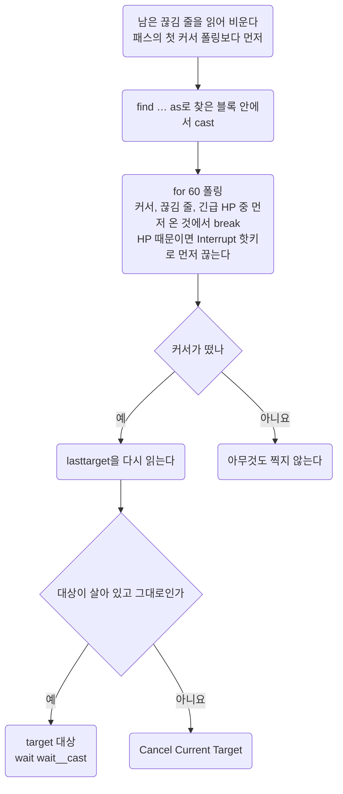

이 저장소 스크립트가 쓰는 언어의 정본이다. 되는 구문과 안 되는 구문, 명령문 비용, PvP에서 막히는 명령을 적는다.
문법이 애매하면 추측하지 말고 [위키 Razor Scripting](https://wiki.uooutlands.com/Razor_Scripting)을 읽는다. 알게 된 것은 여기에 더한다.

- 스크립트를 **어떻게 쓰는지**(헤더, 변수 접두, 타이머 관용구)는 [Conventions](conventions.md)에 있다.
- 고친 스크립트를 **게임에 반영하고 확인하는 법**(캐시, 리로드)은 [Workflow](../working/workflow.md#04) 04절에 있다.

## 00 한눈에

| 절 | 무엇을 답하나 |
| --- | --- |
| [01](#01) | 이 저장소가 쓰는 Razor는 어떤 포크인가 |
| [02](#02) | Outlands가 더한 문법은 무엇인가 |
| [03](#03) | 고치기 전에 꼭 볼 함정은 무엇인가 |
| [04](#04) | 이 구문이 되는가. 되는 구문과 그 선례 |
| [05](#05) | 안 되는 구문은 왜 안 되나 |
| [06](#06) | 명령문 하나가 얼마나 드나, 어떻게 줄이나 |
| [07](#07) | PvP에서 막히는 명령은 무엇인가 |

이 문서에 걸린 질문은 [Open items](../questions/open-items.md)에 모았다.

::part[문법]

## 01 이 포크

Outlands 클라이언트에 딸린 Razor는 [Razor CE](https://www.razorce.com/guide/)를 포크한 것이고, CE에 없는 명령이 많다.
근거는 위키 Razor Scripting을 가장 먼저 본다. CE 가이드는 기본 문법을 확인할 때만 본다.
공개 스크립트는 [outlands.uorazorscripts.com](https://outlands.uorazorscripts.com/)에 있다.

## 02 확장 문법

Razor CE에 없거나, CE보다 넓어진 것이다. 있다는 것만 적었으니 인자 형식은 위키에서 확인한다.

| 분류 | 무엇 |
| --- | --- |
| 검색 | `findtype` `dclicktype` `findtypelist` `targettype` `lifttype`에 `source` `hue` `quantity` `range` 인자 |
| alias | `ground` |
| 표현식 | `find` `findlayer` `targetexists` `followers` `hue` `name` `paralyzed` `invul` `warmode` `noto` `dead` `maxweight` `diffweight` `diffhits` `diffmana` `diffstam` `counttype` `gumpexists` `ingump` `varexist` `bandaging` `cooldown` `pvp` |
| 명령 | `setvar` `unsetvar` `ignore` `unignore` `clearignore` `warmode` `getlabel` `rename` `skill` `setskill` `waitforgump` `gumpresponse` `gumpclose` `cooldown` |
| 연산자 | `as` `in` |
| 리스트 | `createlist` `clearlist` `removelist` `pushlist` `poplist` `listexists` `list` `inlist` `atlist` `foreach` |
| 타이머 | `createtimer` `removetimer` `settimer` `timer` `timerexists` |
| 기타 | 모든 루프에 `index`가 내장돼 있다. `overhead`와 `sysmsg`에 `{{var}}` 보간을 쓸 수 있다 |

### 02.A 고정 문구 검사와 타겟 커서의 한계

- [Razor CE 표현식](https://www.razorce.com/guide/expressions/)의 `insysmsg`는 고정 문구를 검사한다.
  이름이 든 문구도 `insysmsg "xuezhonglian has applied telekinesis to you."`처럼 리터럴에 그대로 넣으면 된다. 문자열용 `setvar`는 필요 없다.
- [Outlands Razor Scripting](https://wiki.uooutlands.com/Razor_Scripting)에는 `name` 표현식도 있다.
  그렇다고 Journal에서 시전자 이름을 뽑거나, 이름 변수를 메시지 검색 문자열에 붙일 수 있다는 증거는 아니다.
  이 조합은 아직 인게임에서 검증하지 않았다. 이름은 고유 serial도 아니다.
- 메시지가 있다는 것, 새로 왔다는 것, 지금 타겟이 누구인지만으로 서버 응답을 특정 시전 요청에 묶을 수 있다고 가정하지 않는다.
  TK를 받을 때와 걸 때 같은 안내가 나오는 사례가 [PvP](../game/pvp.md#04.D) 04.D절에 있다.
  `clearsysmsg`가 다른 루프의 신호까지 지우는 경쟁도 있다. 그냥 초기화한다고 이 모호함이 풀리지는 않는다.
- [Razor CE 명령](https://www.razorce.com/guide/commands/)에는 `targetrelloc`가 있다.
  그러나 폭발 포션을 던질 지면이 안전한지, LOS와 높이가 맞는지, 폭발 반경이 괜찮은지는 자동으로 보증하지 않는다.
- `targetexists`만 보고 지금 커서가 포션 커서인지 회복 주문 커서인지 안다고 처리하지 않는다. 그 커서를 연 행동과 소유권을 함께 추적한다.

이 절은 문서로 확인한 문법과 설계상의 제한이다. 새 실행 선례도 아니고, 포션 복구가 실제로 성공했다는 증명도 아니다.

::part[함정과 선례]

## 03 확인된 함정

`.razor`를 고치기 전에 이 절의 표를 읽는다. 대부분 인게임에서 깨졌거나 프로브로 잰 것이다.
선례가 없거나 확인되지 않은 것은 증상 칸에 그렇게 적었다. 근거가 긴 줄은 05절에서 풀고, 비용 숫자는 06절에 있다.

#### 오류가 나는 구문

| 함정 | 증상 | 대신 |
| --- | --- | --- |
| 주석 안의 `;` | 그 뒤를 명령으로 읽어서 그 줄에서 오류가 난다 | 마침표로 문장을 끊는다 |
| `for <변수>` | `Invalid for loop syntax` | 값마다 리터럴 `for N`을 둔 사슬(04절 `ingump` 사슬) |
| `not list 'x' >= var` | 파싱 오류(`syntax error in line N`). 실행 자체가 안 된다 | `not` 뒤에 `list` 비교식을 두지 않는다. 값마다 갈래를 나누고, 갈래 안에서 리터럴과 비교한다(04절 `ingump` 사슬) |
| `sysmessage` | `Unknown command` | `sysmsg` |
| `findtypelist`를 명령으로 | `Unknown command` | 쓰지 않는다. 표현식일 것으로 보이지만 확인되지 않았다 |

#### 중첩 반복의 조기 종료

| 함정 | 증상과 근거 범위 | 대신 |
| --- | --- | --- |
| 중첩 반복에서 `if` 안의 `break` | 바깥 반복이 처음 단계부터 다시 돌 수 있다. CE 소스로 재현했고, Outlands 안에서도 같은지는 인게임으로 확인하지 않았다(05절) | 시간, 존재, 입력 조건으로 끝나는 `while`을 쓴다. 이런 중첩 블록에서는 `break`나 `continue`로 `if`를 건너뛰지 않는다. 실제 재확인은 [Open items](../questions/open-items.md#09) 09절 |

#### 조건과 변수

| 함정 | 증상 | 대신 |
| --- | --- | --- |
| 변수가 왼쪽인 크기 비교(`if var__a >= var__b`, `var < 숫자`) | 문자열 비교가 되어 조용히 거짓이 될 수 있다. 네크로 능력이 한 번도 나가지 않았다. 인게임 확인됨 2026-10-04(05절) | 변수끼리는 `=`와 `!=`만 쓴다. 크기 비교는 `mana >= config__x`처럼 내장 식을 왼쪽에 둔다. serial 범위 검사는 `0x40000000 > var`로 쓴다 |
| 산술(`@setvar! var__n var__n + 1`) | 선례가 없고, 받지 않는다고 본다 | `counttype`으로 다시 읽거나 리스트 길이를 쓴다 |
| `as` alias를 묶은 `if`나 `while` 블록 밖에서 읽기 | `4294967295`가 되고, `noto`가 `Mobile … not found`를 낸다 | 블록 안에서 `@setvar! var__x alias__x`로 복사해 나온다 |
| 단어를 변수에 담기 | 따옴표와 상관없이 `4294967295`로 읽힌다. `rename`에 주면 `That name is unacceptable.` | `pushlist` 항목은 글자를 유지한다. `foreach x in list__y`로 꺼내 문자열 인자에 준다. 그 밖에 문자열을 얻는 길은 `getlabel` 결과뿐이다 |
| 몬스터 종류 단어나, 한 글자만 바꾼 것을 펫 이름으로(`mummy`, `wytch`) | `That name is unacceptable.` (인게임 확인됨 2026-10-10) | 두 글자 이상 다르게 짓는다(`mumi`는 받아졌다). RunUO 계열은 `mage` 같은 단어도 이름에서 막는다(`necro/summon-names`) |
| 숫자(serial)를 펫 이름으로 | `That name is unacceptable.` | 글자로 된 이름만 쓴다 |
| 값을 넣지 않은 변수 | 빈 값으로 읽혀 조건이 조용히 맞지 않는다 | `util/check.sh`가 `config__` `wait__` `interval__` `cooldown__` `var__` `alias__` `label__` 접두를 잡는다. `timer__` `list__` `global__` 접두와 접두 없는 이름은 못 잡는다 |
| `varexist`로 값이 맞는지 확인 | 선언됐는지만 본다. 잘못 타겟한 값도 참이라 영영 고쳐지지 않는다 | 대상 앞에 서 있는 것이 확실한 곳에서만 `find`로 확인한다([Conventions](conventions.md#03.D) 03.D절) |

#### 검색

| 함정 | 증상 | 대신 |
| --- | --- | --- |
| 아이템을 ignore한 뒤 `find serial container`로 어느 컨테이너에 있는지 판별 | ignore한 아이템이 검색에서 빠질 수 있다. 이 포크의 아이템 검색도 그런지는 아직 확인되지 않았다(05절) | 소속을 먼저 판별하고, 처리하거나 건너뛴 뒤에 ignore한다. 실제 확인은 [Open items](../questions/open-items.md#09) 09절 |
| 플레이어 serial의 `find`를 대상이 있는지, 거리 안인지의 전제로 쓰기 | 유효한 플레이어 serial에도 `find`가 거짓을 낸다. 인게임 확인됨 2026-10-04(05절) | 수동으로 저장한 serial과 검색 성공은 별개다. `setvar! … lasttarget`으로 고른 serial을 보관하고 `target`에 바로 넘긴다. 검색 실패를 serial 무효나 거리 초과로 단정하지 않는다 |
| `dead serial`로 다른 플레이어가 죽었는지 검사 | 조회할 때마다 `dead - Cannot check death status of other players`가 뜬다. 진단의 `dead=0`은 살아 있다는 증거가 아니었다. 인게임 확인됨 2026-10-04 | 상대 플레이어에게 `dead`를 부르지 않는다. 자기 사망을 보는 `while not dead`와 구분한다. Q 대상 캐시는 죽었다고 자동으로 비울 수 없으니, 플레이어가 죽으면 Stop하거나 새 대상을 고른다 |
| `pvp=0`이면 다른 플레이어의 모든 정보를 조회할 수 있다고 보기 | 대상의 `dead`, `findlayer`, `getlabel`은 각각 플레이어 조회를 막는다는 경고를 냈다. 같은 serial의 저장, 복사, `noto`는 성공했다. 인게임 확인됨 2026-10-04. 검사별 반환값은 [03.A절](#03.A)의 결과 표에 있다 | `pvp`가 가리키는 제한과, 명령마다 따로 걸린 대상 제한을 구분한다. 반환값이 FALSE나 0이어도 경고가 있으면 실제 상태를 읽은 것으로 보지 않는다 |
| `findtype` 한 번으로 여러 모빌 중 하나 고르기 | 부를 때마다 **같은 모빌**이 온다 | `while findtype … as`로 돌며 검사하고, 아니면 `@ignore`한다. `endwhile` 뒤에 `@clearignore` |
| 모빌을 이름으로 찾기 | 되긴 하지만, 이름을 바꾼 뒤 Razor 캐시가 갱신되는지는 확인되지 않았다 | 바디 번호로 찾는다. 바디 번호는 인게임 `>info`로 읽는다. 내 소환수의 noto는 2(friend)다 |
| 패스마다 `findtype`으로 상태 세기 | `findtype`이 가장 비싸다(한 번에 20 \~ 40ms, 06절). 32번이면 패스마다 1초 안팎이다 | 천천히 변하는 상태는 타이머로 몇 초에 한 번 본다. `elseif` 사슬은 통째로 한 틱이라 길어도 싸다 |
| `findbuff 'Strength'`나 `'Agility'`로 스탯 포션 판정 | Bless도 같은 이름으로 떠서, 내 Bless든 아군 Bless든 걸려 있으면 포션을 마시지 않는다(05절) | 스탯을 기준선(기본 + 20)과 비교하고, 포션마다 재시도 간격을 둔다([PvP](../game/pvp.md#09.D) 09.D절). Bless는 `Cunning`으로, Arch Protection은 `Protection`으로 본다. `Magic Resist Potion`은 이 이름 그대로 뜬다(사용자 확인 2026-10-09) |

#### 거리 확인과 Last Target

수동으로 고른 플레이어 대상은 `find`로 거리를 확인할 수 없다. 그럴 때 완료한 주문 커서는 Razor의 `Last Target` 거리 검사로 붙잡아 둘 수 있다.
[Razor CE Options](https://www.razorce.com/help/options/#targeting-queues)는 `Range check Last Target`이 켜져 있으면, 범위 밖 대상에 대한 요청을 거부하고 커서를 유지한다고 설명한다.
이것이 `target serial`의 거리 검사까지 보증하지는 않는다.

이전 bard-necro-pvp는 이 경로로 Explosion과 이어지는 EB를 요청했다. 지금 루프는 공격을 수동으로 바꿨다([PvP](../game/pvp.md#05.E) 05.E절).
커서가 닫혔다는 것만으로 주문이 맞았는지, 거리가 됐는지, 취소됐는지를 확정하지 않는다.
지금 Outlands 클라이언트에서 거리 밖에서 안으로 들어올 때의 전환은 확인되지 않았다. 확인 항목은 [Open items](../questions/open-items.md#08.B) 08.B절이다.

공통 PvP v5는 아이템, 자기 주문, 장비 가운데 하나를 처리하는 조건 사슬을 지나 다음 패스로 돌아간다. 반복문 안의 `break`나 `continue`는 쓰지 않는다.
지금 Outlands 클라이언트에서 새 본문이 도는지는 아직 확인되지 않았다.

#### 커서와 타겟

장착과 손 도구도 지금 포크에서 실제로 돈 결과를 기준으로 고른다.

- CE의 [dress 문서](https://www.razorce.com/guide/commands/#dress)는 serial 장착을 지원한다.
  그러나 벌목 본문의 `dress alias__spare_hatchet`는 백팩에서 찾은 도끼에 `not found`를 되풀이했다. 인게임 확인됨 2026-10-05.
  Outlands 안에서 왜 실패하는지는 확인되지 않았다. 그래서 벌목은 기존 무기 핫키처럼 `lift`한 뒤 `drop self lefthand`로 장착한다.
- v9에서 빈손인데도 백팩 도끼를 장착하지 않는다는 보고를 받았다. 인게임 확인됨 2026-10-05.
  `findtype … self`가 실제로 무엇을 돌려줬는지, 어느 가드가 실패했는지는 기록되지 않았다. 그래서 검색 범위가 원인이라고 확정하지 않는다.
- v10은 [bard-mace의 장착 선례](https://github.com/minu-ha/uoo/blob/master/script/archive/bard-mace.razor)처럼 `lhandempty`를 먼저 본다.
  캐시한 serial을 장착한 뒤 `findlayer self lefthand` 결과가 그 serial과 같아야 도구를 쓴다.
  [CE 공식 문서](https://www.razorce.com/guide/expressions/#lhandempty)도 `lhandempty`를 손이 빈 상태를 보는 표현식으로 설명한다. 고친 이 경로로 실제로 장착되는지는 아직 확인되지 않았다.
- [CE UseItemInHand](https://github.com/markdwags/Razor/blob/master/Razor/HotKeys/Misc.cs)는 오른손을 먼저 쓴다.
  왼손의 Hatchet만 확인하고 일반 손 사용 핫키를 부르면, 오른손의 다른 도구를 쓸 수 있다.
- CE의 [Queued 표현식](https://github.com/markdwags/Razor/blob/master/Razor/Scripts/Expressions.cs)은 행동 큐가 비었는지를 본다.
  도구를 쓴 뒤 커서가 떴어도 큐가 남아 있으면, `not queued` 때문에 자기 타깃을 건너뛸 수 있다.
  벌목 v8은 손 도구를 쓴 직후 같은 블록에서 3000ms까지 커서를 기다리고, 중립 커서가 뜨면 자기를 찍는다.
  기다리는 명령이 실행 흐름을 붙잡고 있으므로, 따로 pending 상태나 다음 패스의 커서 처리 블록을 두지 않는다.
  지금 클라이언트에서 큐가 실제 원인이었는지는 아직 확인되지 않았다.
- v8의 기본 채집은 사용자가 잘 돈다고 보고했다. 인게임 확인됨 2026-10-05.
  v10은 오른손 제어를 더하지 않고, 실제 왼손과 캐시 serial을 비교한다. 이 새 장착과 교체 경로의 확인 항목은 [Open items](../questions/open-items.md#09) 09절에 남긴다.

`insysmsg`가 얼마나 지우는지도 주의한다. CE 원본의 [SystemMessages.Exists](https://github.com/markdwags/Razor/blob/master/Razor/Core/SystemMessages.cs)는 맞은 최신 줄과 그보다 오래된 줄을 함께 지운다.
그래서 한 줄에서 거리 문구와 발견 문구를 따로 읽는 구조는 피하고, 중요한 경보를 먼저 읽는다.
이 소비 범위가 Outlands 포크에서도 같은지는 인게임에서 확인되지 않았다.

타겟 주문 한 번의 모양은 04절 끝에 있다.

| 함정 | 증상 | 대신 |
| --- | --- | --- |
| `for 25`와 `wait 100`으로 커서 폴링 | 4서클 커서가 루프가 끝난 뒤에 떴다(2026-09-29). 남은 커서가 `not targetexists`를 단 블록을 모두 막는다 | `for 60`을 쓴다. 한 바퀴가 `wait` 값보다 훨씬 짧게 도는 것으로 보인다. 원인은 확인되지 않았다 |
| 커서 없는 시전(힐 에이전트, Create Food, 자기 버프)을 `not casting`부터 보며 폴링 | 시전이 끊기는 순간 `casting`이 풀려서, 끊김 줄을 읽지 않고 나간다(2026-09-29). 다음 커서 폴링이 그 줄을 제 것으로 읽고 첫 바퀴에 나가서 커서가 남는다 | 커서 폴링이 시작되기 전에 끊김 줄을 한 번 읽어 비운다(`magery/rotation` 첫머리, `buff/spells`의 Spell Siphon 화살 앞) |
| Smart Heal이나 Greater Heal 에이전트가 치유할 것이 없을 때 | 풀피면 커서를 찍지 않고 남긴다(2026-09-29). 모든 블록이 선다 | 에이전트 폴링 뒤 `targetexists and diffhits = 0`이면 `Cancel Current Target` |
| 스크립트의 `target`과 `Target Self` | lasttarget이 백팩이나 나로 바뀐다. 10칸 밖에서 고른 타겟을 노래가 덮어써서 교전을 못 했다(2026-09-29) | 타겟은 화면 거리에서 받아 두고, 백팩이나 나를 찍기 전에 lasttarget을 한 번 더 본다 |
| `setlasttarget alias__x`로 lasttarget 되돌리기 | Razor CE 문서의 `setlasttarget ('serial')`과 달리 `Target a new 'Last Target'` 커서가 떴다. 그 뒤의 sysmsg 줄은 나오지 않았고, 커서를 취소할 때마다 `Target queue cleared.`와 같은 커서가 번갈아 찍혔다. 인게임 확인됨 2026-10-07(skinning-enhanced v3 Journal). 스크립트가 그 줄에서 커서를 기다린 것으로 보인다. 인자를 무시한 원인은 확인되지 않았다 | 쓰지 않는다. lasttarget을 덮어쓰는 동작은 기억한 대상이 없을 때만 한다(`skinning-enhanced.razor` SKINNING) |

### 03.A 대상 조회 진단 핫키

몬스터에서는 되던 조회가 플레이어에서 실패할 때 쓰는 단발 진단이다.
[debug-target-find](https://github.com/minu-ha/uoo/blob/master/script/debug/debug-target-find.razor)는 검색을,
[debug-target-state](https://github.com/minu-ha/uoo/blob/master/script/debug/debug-target-state.razor)는 상태, 변수 비교, 시전 전 조건을 읽는다.
주문, 공격, 소환수 명령은 보내지 않는다. v1의 alt 검색, NPC 검색, 상태 조회는 인게임 확인됨 2026-10-04.
실행마다의 반환값과 아직 하지 않은 검사는 아래 결과 표에 나눠 적었다.

#### 같은 조건으로 비교하기

1. 전투 스크립트를 Stop하고, `pvp=0`인 일반 필드에서 조회가 되던 몬스터와 alt를 비교한다.
   검사하는 동안 서로 움직이거나 타겟을 바꾸지 않는다. `pvp=1`이면 제한된 조회 결과가 섞이지 않게 진단을 멈춘다.
2. Scripts 탭에서 Reload all scripts를 누른 뒤 `debug-target-find`를 Play한다.
   `TARGET FIND PROBE v1 loaded`와 `[ target, pick ]`이 뜨면 가까운 몬스터를 찍는다.
   `F END`까지 나오면 같은 거리의 alt로 되풀이한다. 시작 문구가 없으면 결과를 비교하기 전에 캐시부터 확인한다.
3. 가능하면 2칸 안, 3\~5칸, 6\~10칸, 11\~12칸, 13\~18칸에서 각각 되풀이하고, 실제 거리를 함께 기록한다.
   넓은 범위에서 찾은 같은 대상을 좁은 범위에서 놓치는지 비교한다. 기본 검색부터 실패했다면 그 결과로 거리를 판정하지 않는다.
4. `Last Target`과 변수 경로를 비교하려면 먼저 Q로 같은 대상을 지정한다.
   find 본문의 `config__probe_find_use_last_target`를 `1`로 바꾸면 새 커서 없이 그 serial로 실행한다.
   기본값 `0`에서는 직접 찍은 serial과 Q serial이 다르면 F11을 건너뛴다.
5. Q로 같은 대상을 고른 뒤 `debug-target-state`를 Play한다.
   `TARGET STATE PROBE v1 loaded`부터 `S END`까지 나온 제한 경고와 결과를 함께 읽는다.
   기본 Q 모드는 기존 주문 커서를 취소하지 않는다. 시전 전 조건은 새 타겟 커서를 요구하기 전에 읽는다.

키에 묶어 실행할 때의 캐시 반영과, 게임을 끈 뒤의 `git status` 확인은 [Workflow](../working/workflow.md#04.A) 04.A절과 04.B절을 따른다.

#### 검색 번호

| 번호 | 검사 | 비교 목적 |
| --- | --- | --- |
| F00 | `find backpack` | 내 아이템 조회가 되는지 보는 대조군 |
| F01, F02 | `find serial`, 같은 식에 `as` | 기본 검색과 alias 바인딩. alias가 성공하면 `same_selected=1`인지 본다 |
| F03, F04, F05 | `ground`, `ground -1 -1 18`, 같은 식에 `as` | 검색 소스, 거리 인자, alias가 결과를 바꾸는지 본다 |
| F06, F07, F08, F09 | 같은 serial을 2, 5, 10, 12칸으로 검색 | 기본 검색과 F04가 성공한 대상에서 거리 필터를 비교한다 |
| F10, F11 | F10은 복사한 세션 변수, F11은 같은 대상의 `lasttarget` | 같은 serial을 읽는 경로의 차이. Q 대상이 다르면 F11은 SKIP |
| F12, F13 | F12는 `ignore` 뒤 검색, F13은 `unignore` 뒤 검색 | F04 TRUE, F12 FALSE, F13 TRUE이면 ignore가 듣는 것이다. 모두 FALSE면 ignore 때문이라고 단정하지 않는다 |
| F14, F15 | 바디 ID의 `findtype`으로 18칸, 10칸 검색 | 다른 모빌은 성공으로 세지 않고, 고른 serial과 같은 항목만 TRUE로 센다. 최대 40개를 다 채우면 INCOMPLETE |

F14와 F15는 기본으로 SKIP한다. 대상의 `>info`에서 graphic ID나 body ID를 읽어 `config__probe_find_body`의 `0`을 바꾸면 실행한다. serial을 넣는 칸이 아니다.
find 진단은 시작할 때 남은 커서를 취소하고 ignore 목록을 비운다. 바디 검색 중에 임시로 ignore한 것도 끝나면 비운다.

#### 상태와 변수 번호

| 번호 | 검사 | 해석 |
| --- | --- | --- |
| G01, G02, G03 | 시전, 커서, 이동 쿨. 마나. TK 시약 | 각각 지금 반환값만 출력한다. 마나 기준은 TK 9, dump 40이다. 혈이끼와 맨드레이크를 따로 검색한다 |
| G04, G05 | 기존 `timer__tk` 30,500ms. me 바와 target 바 | 타이머를 만들거나 초기화하지 않는다. 바가 켜져도 내가 상대에게 건 TK의 소유권 증거는 아니다 |
| S01, S02 | 내 `dead`, 대상의 `dead serial` | 제한 경고가 있으면 대상 상태는 UNKNOWN이다. RETURN=0을 살아 있다는 뜻으로 읽지 않는다 |
| S03, S04 | notoriety 7종, 대상의 backpack layer | 분류와 레이어 반환을 따로 본다. 레이어를 못 찾았다고 대상이 없다고 판단하지 않는다 |
| S05, S06, S07 | 변수가 왼쪽인 크기 비교, 숫자가 왼쪽인 같은 비교, 복사본의 같음 비교 | 같은 serial인데 S05와 S06이 다르면 비교 방향의 형 변환 문제를 재현한 것이다. 같음 비교도 따로 본다 |
| S08 | `getlabel` | 예전 label을 지운 뒤 맨 마지막에 부른다. LABEL이나 NO_LABEL을 원래 경고와 함께 기록한다 |

state 진단의 `config__probe_state_use_last_target` 기본값은 `1`이다. `0`으로 바꾸면 새 대상을 찍지만, 이미 시전 중이거나 커서가 있으면 멈춘다.
설정과 세션 변수는 `config__probe_find_*`, `config__probe_state_*`, `var__probe_find_*`, `var__probe_state_*`를 쓴다.
alias와 label도 probe 이름으로 따로 둔다. 더하는 타이머는 없다.

#### 실패 로그 읽기

`BEGIN` 다음에 TRUE, FALSE, RETURN, LABEL이 나오면 명령이 반환한 것이다.
FALSE만 있고 제한 경고가 없으면, 검색이 실패했다는 관찰만 남긴다. `Skipped`나 `Cannot check` 같은 경고가 있으면 조회 제한으로 기록한다.
Script Error가 나고 결과와 END가 없으면, 마지막 BEGIN 번호와 오류 줄 번호가 멈춘 지점이다.
두 진단은 따로 된 파일이라, 하나가 멈춰도 다른 파일을 실행해 나머지를 비교할 수 있다.

#### 2026-10-04 v1 진단 결과

사용자가 올린 alt 로그와 NPC 로그를 비교했다. 양쪽 모두 find 진단과 state 진단이 END까지 돌았다.
Script Error로 멈춘 결과가 아니다. 인게임 확인됨 2026-10-04.

| 검사 | NPC Ohanna | 플레이어 alt indian angus pay |
| --- | --- | --- |
| serial 저장과 복사 | `885491`로 일치 | `1477299`로 일치. Q serial도 같은 값 |
| F00 내 backpack | TRUE | TRUE |
| F01에서 F05, F10 | TRUE. F02와 F05의 alias도 `same_selected=1` | FALSE. 기본, ground, 18칸, alias, 복사 변수 경로가 모두 실패 |
| F06 2칸, F07에서 F09까지 5, 10, 12칸 | 2칸 FALSE, 나머지 TRUE | 모두 FALSE |
| F11 Last Target | SKIP. Q가 alt로 남아 있어 같은 대상 비교가 아니다 | 같은 alt serial로 FALSE |
| F12 ignore 뒤, F13 unignore 뒤 | 등록과 해제 안내가 모두 나왔지만 검색은 둘 다 TRUE | 둘 다 FALSE. 시작의 clearignore와 해제 뒤에도 실패 |
| F14, F15 바디 findtype | SKIP | SKIP. 플레이어 모빌의 findtype 결과는 확인되지 않았다 |
| S02 대상 dead | RETURN=0. 플레이어 조회 제한 경고 없음 | `Cannot check death status of other players`. RETURN=0, 실제 상태는 UNKNOWN |
| S03 noto, S04 findlayer | noto=3(hostile). layer는 FALSE지만 제한 경고는 없다 | noto=1(innocent). findlayer는 `may not be used on other players`와 FALSE |
| S05 변수 왼쪽, S06 숫자 왼쪽, S07 같음 비교 | 0, 1, 1 | 0, 1, 1. 두 serial 모두에서 비교 방향 차이가 재현됐다. 플레이어 제한과는 별개다 |
| S08 getlabel | NO_LABEL. 플레이어 건너뛰기 경고 없음. label이 오지 않은 이유는 확인되지 않았다 | `Skipped getting label because serial is a player`, NO_LABEL |

NPC의 거리 필터는 2칸에서는 놓치고 5칸 이상에서는 찾았다. 실제 거리와 움직였는지를 따로 기록하지 않아서, 정확한 칸 수는 확정하지 않는다.
alt는 거리 인자가 없는 기본 검색부터 실패했으므로, 이것을 거리 초과로 판단할 수 없다.
검색에서 플레이어가 빠지는 내부 이유가 의도한 필터인지 결함인지는 확인되지 않았다.

NPC에서는 ignore에 등록한 뒤에도 serial을 직접 검색하면 성공했다. 이번 테스트의 `find serial`은 ignore 등록만으로 빠지지 않는다.
이것을 ignore 기능 전체의 고장으로 넓혀 보지 않는다. `findtype`에도 ignore가 먹는지는 이 프로브에서 아직 검사하지 않았다.

alt 상태 진단에서 `pvp`, casting, cursor, walk cooldown은 0이었다. TK와 dump의 마나 조건, TK 시약 두 가지는 1이었다.
기존 TK 재시도 타이머는 ready=1, me 바와 target 바는 0이었다.
이것은 그 진단 시점에 읽은 값이다. 전투 루프의 대상 캐시, 자기 회복, 버프 우선순위, Explosion과 EB 시약 전체까지 통과했다는 뜻은 아니다.

find의 직접 선택은 이번 실행에서 Q, 곧 Last Target을 바꾸지 않았다. state 기본 모드는 Q를 읽었다.
NPC 상태는 Q를 NPC로 바꾼 뒤 `selected=885491`인 실행에서 확인했다.
상태 조회 결과를 비교할 때는 캐릭터 이름 대신 context의 selected serial로 검사 대상을 확인한다.
alt의 바디 findtype과 여러 거리에서 되풀이한 결과는 확인되지 않았다.

## 04 되는 구문과 선례

모두 저장소에 선례가 있다. 새 패턴을 쓰기 전에 여기서 먼저 찾는다.

| 구문 | 선례 |
| --- | --- |
| `not inlist '리스트' <serial 변수>` | `magery/rotation`(OPENER) |
| `list__magic_drained_targets`와 `list__magic_cursed_targets`로 2단 오프닝 | `magery/rotation`(OPENER) |
| `createlist`, `removelist`, `clearlist`, `pushlist` | 여러 파일 |
| `pushlist '리스트' '단어'`, `foreach x in 리스트`, `index = <변수>`, `@rename <serial 변수> x`로 단어를 문자열 인자로 넘긴다 | `necro/summon-names`(`list__summon_kinds`). 2026-09-28 프로브에서 항목이 글자 그대로 읽히고 `rename`이 받았다. `rename`은 위키에 있고, CE는 `CanRename`인 펫에만 보낸다 |
| `ingump "10/"` … `"1/"`처럼 큰 수부터 내려오는 사슬로 숫자 읽기 | `necro/symbols`의 심볼 수. `ingump`는 부분 문자열로 맞추므로 큰 수부터 본다. 갈래마다 리터럴 `for N`으로 리스트를 채운다 |
| `findbuff "song of discordance"` | `archive/bard-mace.razor` BARD SONG BUFF |
| `cooldown "magic arrow" = 0` | `magery/rotation`(PROC CORE). 항목은 `cooldowns.xml`에 있다 |
| `while findtype … backpack as`와 `@ignore` | `bard/instrument` |
| `findtype 24\|158\|… ground -1 -1 <range> as`로 바디 번호로 모빌 찾기 | `necro/summon-names`, 옛 `bard-necro`의 PROVO FOLLOWER CACHE(git 이력) |
| `find <변수> ground -1 -1 <range> as`와 `dead`로 슬롯 비우기 | `necro/summon-names`, 옛 `bard-necro`의 PROVO FOLLOWER CACHE(git 이력) |
| `not dead X and noto X != "hostile" …` | `necro/summon-names` |
| `useskill`, `waitfortarget`, `target backpack` 순서 | `archive/bard-mace.razor` BARD SONG BUFF |
| `for 60`과 `break`로 커서 폴링 | `magery/rotation`. 참고했던 `auto-mage.razor:1160`은 저장소에 없다 |
| `hotkey 'Vampiric Embrace'`와 `hotkey 'Target Self'` | `necro/vampiric-embrace`. 위키에 따르면 자신을 타겟하면 주변 시체를 자동으로 찾는다(인게임 확인됨 2026-09-25) |
| `hotkey 'Drink Heal'` 같은 포션 핫키 | `recovery/heal`. 이름은 Razor 핫키 목록의 Potions 항목 그대로다 |
| `hotkey "> Interrupt"` | `magery/rotation`과 `magery/flamestrike`의 커서 폴링. 제 시전을 끊고 긴급 힐로 넘어간다. 같은 핫키가 휠 아래에도 물려 있다([Hotkeys](../game/hotkeys.md)) |
| `stop` | `bard/instrument` |
| `targetexists "beneficial"`, `"neutral"`, `"harmful"`로 커서 종류 가리기 | `buff/spells`. Bless는 beneficial, Arch Protection은 **neutral** 커서다(사용자 확인 2026-10-10. 처음 tamer 스크립트는 beneficial로 잘못 읽어서 커서가 남았다). Flamestrike는 harmful(`magery/flamestrike`), 손 도구와 칼은 neutral(`gather/*`)이다. 기대한 종류가 아닌 커서는 취소해서 다른 블록이 막히지 않게 한다 |

#### 타겟 주문의 모양

`magery/rotation`이 타겟 주문마다 쓰는 모양이다.

1. 패스의 첫 커서 폴링보다 먼저, 남은 끊김 줄을 한 번 읽어 비운다.
2. 대상을 `find … as`로 찾은 블록 안에서 `cast`한다. alias는 그 블록 밖에서 읽지 못하므로 `target`까지 모두 안에 둔다.
3. `for 60`으로 폴링한다. 커서가 뜨거나, 끊김 줄이 보이거나, HP가 긴급 수준으로 떨어지면 `break`로 나온다.
   HP 때문이면 `hotkey "> Interrupt"`로 제 시전을 먼저 끊는다.
4. 커서가 뜨지 않았으면 아무것도 찍지 않는다. 떴으면 lasttarget을 다시 읽는다.
   대상이 죽었거나 플레이어가 대상을 바꿨으면 `Cancel Current Target`으로 커서를 닫는다. 그대로면 `target`으로 찍고 `wait wait__cast`만큼 기다린다.

## 05 안 되는 구문의 근거

03절 표에서 근거가 긴 줄을 표와 같은 순서로 푼다. 선례가 없어서 쓰지 않는 것은 맨 끝에 모았다.

- **`for <변수>`.** `Invalid for loop syntax`가 난다(2026-09-28 프로브). 횟수에는 리터럴만 된다. 변수 횟수가 필요하면 값마다 `for N`을 둔 사슬을 쓴다.
- **`while not list 'x' >= var`.** `syntax error`로 파싱 자체가 안 된다(2026-09-28). `not` 뒤에 `list` 비교식을 두지 않는다.
- **`findtypelist`를 명령으로 쓰기.** `Unknown command`가 난다. 쓴다면 `findtype`처럼 `if` 안의 표현식일 것이지만 확인되지 않았다.
- **중첩 반복에서 `if` 안의 `break`.**
  [CE Script.ExecuteNext의 BREAK](https://github.com/markdwags/Razor/blob/master/Razor/Scripts/Engine/Interpreter.cs)는 반복문 뒤로 이동하지만, 현재 범위는 `PopScope` 한 번으로만 지운다.
  그래서 if 범위만 지워지고 안쪽 반복 범위가 남으면, 바깥 FOR가 새로 들어온 것으로 보고 index를 0으로 되돌릴 수 있다.
  2026-10-05 CE 원본의 제어 흐름을 재현했더니, for 2 안의 for 1에서 if를 거쳐 break하자 바깥 반복이 0단계를 되풀이했다.
  lumberjack v12 본문도 Logs 단계만 되풀이하고 END에 닿지 않았다.
  이것은 CE 소스 재현이다. Outlands 내부 구현도 같다는 인게임 확인은 아니다.
  전에 쓰던 재귀형 모의 검사는 이 경우를 Python의 정상 반복 종료로 처리해서 이 차이를 놓쳤다.
  v13 목재 정리는 이 경로를 없앴다. 다른 기존 루프까지 한꺼번에 바꾸거나, 모든 break가 실패한다고 일반화하지는 않는다.
- **변수가 왼쪽인 크기 비교.** `var__symbols >= config__symbols_blood_oath`처럼 변수끼리, 또는 변수와 숫자의 크기를 비교하는 것이다. 조건에서 변수에는 `=`와 `!=`만 된다.
  Razor CE의 [EvaluateBinaryOperand와 CompareOperands](https://github.com/markdwags/Razor/blob/master/Razor/Scripts/Engine/Interpreter.cs)는 session 변수를 문자열로 읽고, 오른쪽 값을 왼쪽 자료형으로 바꾼다.
  그래서 `var < 0x40000000`은 숫자 범위 검사가 아니라 문자열 비교가 될 수 있다.
  - Bard Necro의 네크로 능력이 한 번도 나가지 않던 원인이다. 조건이 조용히 거짓이 됐다.
  - 2026-10-04 전체 루프의 `var < 0x40000000` 경로도 대상을 저장하기 전에 멈췄다.
    순서를 바꾸자 같은 Q serial에서 `mobile=1`, 대상 저장, TK, Explosion에 이은 EB 피해까지 나왔다. 인게임 확인됨 2026-10-04.
  - CE 소스의 변환 방향을 따라 serial 범위 검사는 `0x40000000 > var`로 바꿨다. 이 값은 [Serial.IsMobile](https://github.com/markdwags/Razor/blob/master/Razor/Core/Serial.cs)이 모빌과 아이템을 가르는 경계이고, 개인 serial이 아니다.
    이 순서로 쓴 모빌 판정은 지금 클라이언트의 alt 테스트에서 확인했다. 그렇다고 내부 자료형 전체가 CE와 같다고 일반화하지는 않는다.
  - 수를 세려면 옛 `bard-necro`처럼 <strong>리스트에 항목을 밀어 넣고 `list 'name' >= n`</strong>으로 비교한다.
  - `mana >= config__x`처럼 **내장 식이 왼쪽**이면 된다. 내장 `index`도 왼쪽에 두면 변수와 비교할 수 있다.
  - `while` 조건에도 변수 크기 비교는 쓰지 않는다(선례 없음).
- **`as` alias를 묶은 블록 밖에서 읽기.** `if findtype … as alias__x`와 `endif` 뒤에서 `alias__x`를 읽으면 `4294967295`가 되고, `noto`가 `Mobile … not found`를 낸다.
  블록 안에서 `@setvar! var__x alias__x`로 복사해 나온다. 모듈의 alias가 모두 블록 안에서만 쓰이는 이유다.
- **단어를 변수에 담기.** `@setvar! var__x nomeeheh`는 따옴표가 있든 없든 `4294967295`로 읽힌다(2026-09-28 프로브).
  숫자 `5000`은 `5000`으로, `0x622396`은 10진수 `6431638`로 읽힌다. 변수에는 숫자와 serial만 담긴다.
  그래서 `rename <serial> <변수>`는 서버에 엉뚱한 이름을 보내 `That name is unacceptable.`을 받는다. 단어는 리스트에 담아 `foreach`로 꺼낸다. serial 쪽은 변수여도 된다.
- **숫자를 펫 이름으로.** serial을 그대로 이름으로 주면 서버가 `That name is unacceptable.`로 거절한다(2026-09-28 프로브). 이름에는 숫자를 쓸 수 없다.
- **ignore한 뒤 소속 판별.** [공식 문서](https://wiki.uooutlands.com/Razor_Scripting#ignore)는 ignore가 검색 명령에서 객체를 뺀다고 설명한다.
  2026-10-05 v13 목재 정리는 파우치 소속을 검사하기 전에 ignore했다. 검색에서 빼는 동작을 넣은 모의 재현에서는 파우치에 이미 있던 Boards를 다시 들어 올렸다.
  앞선 NPC 직접 serial 프로브에서는 ignore한 뒤에도 TRUE였다. 그래서 지금 포크의 아이템 검색에 같은 동작이 적용되는지는 아직 확인되지 않았다.
  v14는 두 검색 동작 모두에서 파우치에 이미 있는 Boards를 빼도록 했다.
  clearignore는 단계의 시작과 끝에 두어, 다음 정리 주기에 실패한 요청과 새 묶음을 다시 찾게 했다. 단계 중에 매번 비우면 이미 본 묶음을 다시 고를 수 있다.
- **플레이어 serial의 `find`.** 지금 클라이언트의 파란 alt 테스트에서 Q serial은 유효했다. 그런데 `find serial`과 `find serial ground -1 -1 18`이 모두 거짓이었다. 인게임 확인됨 2026-10-04.
  단발 `setvar → cast → target` 경로와, 이전 bard-necro-pvp의 Q serial 직접 저장 경로는 모두 같은 플레이어에게 TK를 걸었고, 공격 대상 이름과 30초 부착 안내를 받았다.
  지금 Outlands 포크에서 검색이 왜 실패하는지는 확인되지 않았다. 이 관찰을 모든 클라이언트와 모든 플레이어의 일반 규칙으로 넓히지 않는다.
- **`dead serial`.** 전체 루프는 돌았고 TK, Explosion, EB도 상대에게 들어갔다. 그런데도 조회할 때마다 경고가 떴다(인게임 확인됨 2026-10-04).
- **`findtype`은 매번 같은 모빌을 돌려준다.** Razor CE처럼 무작위로 고르지 않는다. 한 번만 부르면 이미 처리한 모빌만 계속 나온다(2026-09-28, 둘째 소환수에 이름이 붙지 않았다).
  `while findtype … as`로 돌며 검사하고, 아니면 `@ignore`, `endwhile` 뒤에 `@clearignore`로 한 번에 다 본다.
- **`findbuff`로 스탯 포션 판정.** 위키 [BuffIcons](https://wiki.uooutlands.com/Template:BuffIcons)는 같은 아이콘을 `Strength Spell / Potion`으로 적는다.
  Bless는 버프 바에 `Strength`, `Agility`, `Cunning`으로 뜨고, 포션 버프 이름에는 Potion이 붙지 않는다(사용자 확인 2026-10-09).
  위키 표의 `Strength Potion Usage Cooldown`도 인게임 이름으로 확인되지 않았다.
- 선례가 없어서 쓰지 않는 것:
  - 산술 `@setvar! var__n var__n + 1`
  - `menu <serial> <변수>`. 인덱스는 반드시 리터럴이어야 한다
  - 조건 안의 괄호

::part[비용과 제약]

## 06 명령문 비용

**비용은 검색의 종류가 아니라 "이 패스에서 밟는 줄 수"로 정해진다. 그중 `findtype`이 가장 비싸다.**
그래서 **자주 바뀌지 않는 상태는 타이머로 막아 두고, 흔한 경로가 밟는 줄을 줄인다.**

Razor CE 원본의 스크립트 엔진은 **타이머가 한 번 틱할 때마다 명령문 하나**를 실행한다.
`ScriptManager.ScriptTimer`가 `Interpreter.ExecuteScript`를 부르고, 그것이 `ExecuteNext`를 1회 부르는 구조이며, 틱은 기본 25ms다.
거짓인 `if`는 본문을 건너뛰는 것까지 한 틱이고, `elseif` 사슬은 한 틱 안에서 평가된다.
이 포크는 그보다 빠르지만 모양은 같다. 2026-09-28에 프로브(`probe-tick`, 지금은 지웠다)로 잰 값은 이렇다.

| 잰 것 | 걸린 시간 | 한 개당 |
| --- | --- | --- |
| 대입 100줄 | 0.5 \~ 1초 | 5 \~ 10ms |
| 거짓 `if` 100개(3줄 본문 건너뜀) | 1 \~ 2초 | 10 \~ 20ms |
| `findtype … self` 50번 | 1 \~ 2초 | **20 \~ 40ms** |
| 20갈래 `elseif` 사슬 10번 | 0.25 \~ 0.5초 | 사슬 하나 25 \~ 50ms |

Bard Necro 루프에 적용한 결과는 [Bard Necro](../templates/bard-necro.md#05.H) 05.H절에 있다. 패스마다 `findtype`을 최대 32번 쓰던 시약 플래그 읽기를 10초에 7번으로 줄였다(처음에는 30초였다).

## 07 PvP 제약

구조화 PvP나 팩션 상태에서는 스크립트에 아래 제약이 걸린다.

| 제약 | 영향 |
| --- | --- |
| `settimer` `removetimer` `getlabel` `rename` `cooldown` `wait` 같은 명령이 막힌다 | 타이머, 라벨, 쿨다운에 기대는 로직이 돌지 않는다 |
| 플레이어 serial이 `0x0`이다 | 상대를 변수에 담을 수 없고, 상대 머리 위 `overhead … <serial>`도 안 된다 |
| `find` 계열이 자기 아이템만 잡는다 | 상대나 바닥 물건을 찾는 로직이 돌지 않는다 |

PvP 겸용 스크립트를 쓰는 규칙은 [Conventions](conventions.md#07) 07절에 있다. 게임 쪽 PvP 규칙과 숫자는 [PvP](../game/pvp.md)에 있다.
