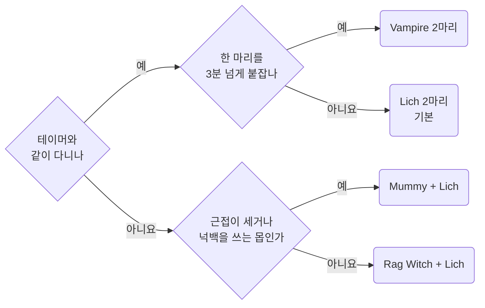
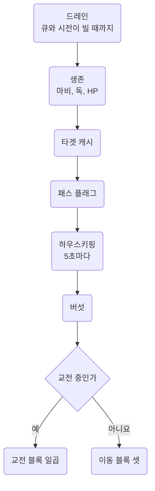
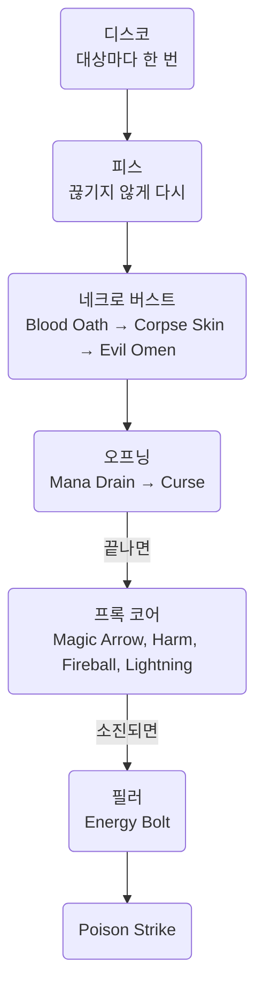
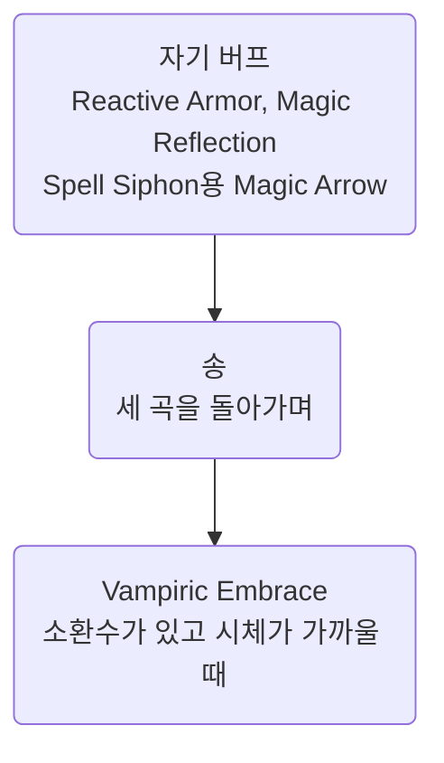
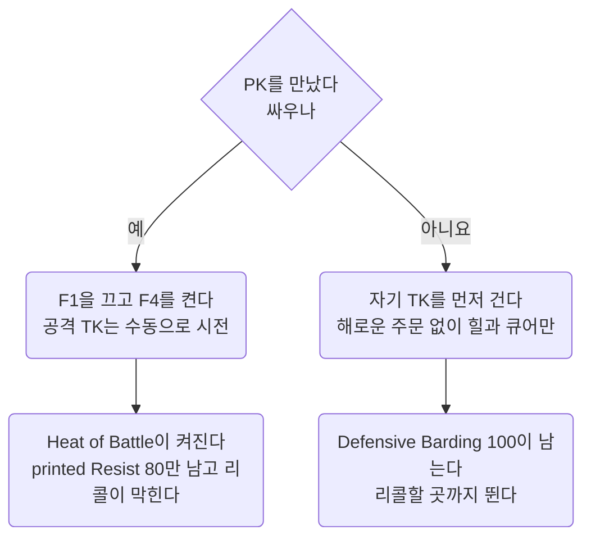

Bard Necro 템플릿의 메커니즘과 판단을 적은 문서다. 무엇을 소환하는지, 전투 루프가 왜 이 모양인지, PK를 만나면 어떻게 하는지 답한다.
**숫자는 추측하지 않는다.** 바드, 네크로, 소환수 숫자는 여기서 인용하고, 여기 없으면 위키를 읽어 여기에 더한다.
인용과 확인 표시는 [Workflow](../working/workflow.md#01.C) 01.C절대로 쓴다.

- 캐릭터는 `nomeehej`이고, Razor 프로필은 `summoner`다.
- 사냥은 `script/combat/bard-necro-enhanced.razor`(F1)로 한다. PK를 만나면 F4를 다시 연결한 `script/combat/pvp.razor`로 싸운다.
- 2026-09-28에 `bard-mechanics.md`, `bard-necro-combat-design.md`, `bard-necro-summon-guide.md` 세 문서를 이 문서 하나로 묶었다. 이력은 git에 있다.

여기 없는 것은 다른 문서에 있다.

- 템플릿과 상관없는 PvP 규칙과 숫자는 [PvP](../game/pvp.md)에 있다. 06절에는 그 규칙으로 이 캐릭터가 내린 판단만 둔다.
- Razor 구문, 함정, 명령문 비용은 [Razor](../scripting/razor.md)에 있다.
- 쿨다운 바와 오버헤드의 이름과 색 규칙은 [Overheads](../scripting/overheads.md)에 있다.

## <a id="00"></a>00 한눈에

| 절 | 무엇을 답하나 |
| --- | --- |
| [01](#01) | 이 캐릭터는 무엇이고, 무엇을 쟀나 |
| [02](#02) | 바드 스킬, 송, 쿨, 코덱스는 어떻게 도나. 루프 게이트의 근거 |
| [03](#03) | Magery 프록, 네크로 소환과 심볼, Grimoire와 Codex 포인트 |
| [04](#04) | 무엇을 소환하고 Tome에 무엇을 찍나. 소환수 이름 붙이기와 재소환 |
| [05](#05) | `bard-necro-enhanced`와 `pvp`는 왜 이 모양인가. 마나 예산과 명령문 비용 |
| [06](#06) | PK를 만나면 이 캐릭터는 어떻게 판단하나. Defensive Barding, 도주와 반격, Resist |
| [07](#07) | 인게임에서 확인한 것과 남은 것 |
| [08](#08) | 틀렸던 생각 |
| [09](#09) | 출처 |

자주 찾는 곳은 셋이다. 무엇을 소환할지는 [04.B절](#04.B)을, 루프를 고치려면 [05.A절](#05.A)을, PK를 만나면 [06절](#06)을 본다.

이 문서에 걸린 질문은 [Open items](../questions/open-items.md)에 모았다.

::part[캐릭터]

## <a id="01"></a>01 캐릭터

### <a id="01.A"></a>01.A 전제 스킬과 장비

| 스킬 | 값 |
| --- | --- |
| Discordance, Peacemaking, Provocation | 80, 80, 80 |
| Musicianship | **0**. Bard Codex `Self Taught` T2가 대신한다 |
| Spirit Speak | 120 |
| Resisting Spells | 80. 2026-09-27에 Herding을 빼고 찍었다 |
| Necromancy | 100 |
| Magery | 100 |
| Eval Int | 80 |

- **바딩 세 스킬을 모두 찍었다.** `Self Taught`는 "lowest printed skill amongst Discordance,
  Peacemaking, Provocation" 80점을 Musicianship 대신 쓰게 해 준다. Musicianship 칸이 통째로 비어서 Provocation을 넣을 수 있었다.
- **Effective Barding은 170이다.** 송 메시지의 `8.5%`로 쟀다(02.M절).
- **Meditation이 없다.** 마나는 환급 스택, 이동 중 자연 회복, 버섯으로 채운다.
- **Inscription이 없다.** 그래서 Inscription이 늘려 주는 `Bless`와 `Protection`의 지속, `Reactive Armor` 강화를 받지 못한다.
  Reactive Armor 자체는 Magery로 걸고, 루프가 이동 중에 유지한다(05.A절 자기 버프).
- 장비는 Avarhide 스펠북(double mana regen 60%), Eldritch Aspect 8단계(mana refund 26%, special chance 7.2%), Lyric Aspect 방어구다.
- 소환수가 딜의 **63.4%**를 낸다(01.B절에서 잰 값). 본체는 37%다.
- 테이머와 둘이 다니는 경우가 많다. **본체는 후열이다.**
- 주 사냥터의 몹 난이도는 **300\~500**이다.
- PK를 만나면 도망가지 않고 싸우는 것이 기본이다. 그래서 Herding 대신 Resisting Spells 80을 찍었다(06.C절).
- 소환수는 종류를 알아볼 수 있는 이름(`leech`, `mumi`, `vampa`, `wicca` 같은)으로 자동으로 바뀐다(04.H절).

### <a id="01.B"></a>01.B 측정 결과

인게임 데미지 트래커로 잰 값이다.

| 구성 | 소환수 딜 비중 |
| --- | --- |
| 바딩 120 x3, SS 80, Eval 80 | 47.6% |
| 바딩 80 x3, SS 120, Eval 80 | **63.4%** |

**소환수가 딜의 3분의 2를 낸다.** 바딩을 120으로 올리는 것보다, SS를 120으로 올려 소환수 계수를 키우는 쪽이 훨씬 크다.
바딩 세 스킬을 80으로 맞춘 근거가 이것이다.

- 바딩 최소 성공률은 `33% x (Effective Barding / 100)`이다. 그래서 80에서도 쓸 만한 성공률이 나온다(02.R절).
- 난이도 300\~500 구간에서는 바딩 지속시간이 최소값 `15초 x (Musicianship / 100)`으로 정해진다(02.N절).
  Musicianship을 120으로 올려도 이 구간에서는 차이가 작다.
- Herding은 2026-09-27에 빼고 Resisting Spells 80을 찍었다. Herding은 팔로워 데미지 `22% x (Effective Herding / 100)`과
  저항 `11% x (Effective Herding / 100)`을 더해 줬고, 80이면 17.6%와 8.8%다. 이 숫자는 옛 스크립트의 `config__use_herding` 주석에서 왔다.
  PK와 싸우는 것이 기본이라 Heat of Battle 중의 printed Resist가 더 급했다. 근거는 06.C절에 있다.

### <a id="01.C"></a>01.C 전투 사이클

한 마리와 싸우고, 10\~20초 걸어서 다음 한 마리로 간다.
**이동 구간이 전체의 약 4분의 1이다.** 이 시간에 마나가 차고 버섯 60초 쿨이 돈다.
반대로 2분짜리 버프는 이 구간에서 버려진다. 그래서 **2분 버프는 몹이 가까이 있을 때만 건다.**
루프가 스탯 포션을 교전 중에만 마시는 것도 이 때문이다(05.A절 하우스키핑).

### <a id="01.D"></a>01.D 확정 수치, Effective Barding 170

| 항목 | 값 | 출처 |
| --- | --- | --- |
| Barding Song 세 곡 각각 | **8.5%**. 나와 팔로워가 받는다 | 송 메시지로 쟀다(02.M절) |
| Discordance 디버프 | printed 80이면 `80/120 x 25 = ` **16.7%** | printed 기준(02.L절) |
| Discordance 지속 | **1분 21초 \~ 1분 57초** | 잰 값. 장비와 대상에 따라 다르다 |
| Peace와 Provo의 최소 지속 | `15 x 0.8 = ` **12초** | 난이도 300 이상에서는 이 값으로 정해진다(02.N절) |
| 바딩 최소 성공률 | **56.1%**. Perfect Pitch T3를 더하면 **72.9%** | 공식(02.R절) |
| Barding Break(난이도 400) | 초당 **4%**, 걸리면 **40초** | **Peace와 Provo만** 끊는다(02.O절) |

::part[메커니즘]

## <a id="02"></a>02 바드 메커니즘

루프가 쓰는 결론은 02.E절의 쿨 모델 하나다. 바딩 행동은 모두 `music`과 자기 슬롯이 0일 때만 나가고, 송은 `song`도 본다.
스킬은 `music` 5초와 자기 슬롯을 세우고, 송은 `song`만 세운다.
02.A \~ 02.D절은 그 근거이고, 02.F \~ 02.J절은 그것을 `cooldowns.xml`과 스크립트에 옮긴 방법이다. 02.K절부터는 송, 디버프, 코덱스의 효과다.

### <a id="02.A"></a>02.A 스킬 사용 쿨

|  | 쿨 | 출처 |
| --- | --- | --- |
| **Music (글로벌)** | 5초 | "A player may alternate between using Peacemaking or Provoking and Discordance every 5 seconds" |
| Discordance | 5초. 성공과 실패가 같다 | "Skill usage cooldown is 5 seconds on both success and failure" |
| Peacemaking | **성공 10초, 실패 5초** | "Skill usage cooldown is 10 seconds on success and 5 seconds on failure" |
| Provocation | **성공 10초, 실패 5초** | "Skill usage cooldown is 10 seconds on success and 5 seconds on failure" |
| Barding Song | 10초 | "Casting a Barding Song has a 10 second cooldown that is independent of normal bard skill usage" |

**Peace와 Provo는 슬롯을 함께 쓴다**(02.F절).

**글로벌 쿨과 개별 쿨이 둘 다 0이어야 한다.** Music 5초가 지나도 Peace의 자기 쿨 10초가 남아 있으면 쓸 수 없다.

```
if cooldown "music" = 0 and cooldown "peace/provo" = 0
```

두 쿨을 다 지키면 이렇게 돈다.

| 시각 | 스킬 | 쿨 |
| --- | --- | --- |
| t=0 | Discordance | Music 0 → 5, Disco 0 → 5 |
| t=5 | Peacemaking | Music 0 → 5, Peace와 Provo 슬롯 0 → 10 |
| t=10 | Discordance | Music 0 → 5, Disco 0 → 5 |
| t=15 | Provocation | Peace와 Provo 슬롯의 쿨이 그때 풀린다 |

### <a id="02.B"></a>02.B 송은 스킬을 백팩에 쓴 것이다

송은 따로 있는 명령이 아니다. **바드 스킬을 자기 자신, 곧 백팩에 찍으면 송이 된다.**

> "What do you wish to pacify? (you may target **yourself for an area effect** or the **ground for a group effect**)"

```
useskill 'Peacemaking'
waitfortarget wait__bard_target
target backpack
```

마지막 줄이 `target backpack`이면 송(AoE)이고, `target lasttarget`이면 스킬(한 대상에 거는 디버프)이다.

저장소의 기존 구현도 이 모양이다(`script/archive/bard-mace.razor`의 BARD SONG BUFF, `module/bard/song.razor`).

### <a id="02.C"></a>02.C 세 가지 쿨 계열

막힐 때 뜨는 문장이 어느 계열인지 알려 준다. **이 구분이 쿨 모델의 열쇠다.**

| 계열 | 막힐 때 뜨는 문장 | 범위 |
| --- | --- | --- |
| **Music 글로벌** | "You must wait a few moments to **use another skill**." | 모든 바드 스킬. 5초 |
| **Barding Song** | "You must wait a few moments before performing **another barding song**." | **세 곡이 함께 쓴다.** 바는 11초(02.I절) |
| **Peace와 Provo 슬롯** | "You must wait a few moments before you may **provoke or pacify another creature**." | **함께 쓴다.** 10초(02.F절) |

Discordance는 자기 슬롯 5초를 따로 쓴다. Discordance 전용 차단 문장은 확인되지 않았다.

`Peace Song -> Disco Skill -> Disco Song` 순서에서 마지막이 "another barding song"으로 막혔다.
**다른 곡이 다른 곡을 막는다. 곡끼리 쿨 하나를 함께 쓴다는 뜻이다.**

### <a id="02.D"></a>02.D cooldown은 서버 값이 아니다

`cooldown "..."`은 서버 값이 아니라 `cooldowns.xml`에 적은 내 트리거다. 이 일반 규칙은 [Overheads](../scripting/overheads.md#06.B) 06.B절에 있다.
바드에서는 이것이 이렇게 문제가 됐다.

예전에는 `music` 항목에 송 트리거(10초)까지 섞여 있었다. 그래서 뒤따르는 5초 스킬 트리거와 서로 덮어썼다.
"Music이 0인데 송이 안 나간다"와 "서버가 허용하는 스킬을 10초 참는다"는 문제가 둘 다 여기서 나왔다.
02.I절의 최종 형태로 고쳤고, 고친 내역과 이유도 거기 있다.

### <a id="02.E"></a>02.E 쿨 모델, 확정

**모든 바딩 행동은 같은 관문 하나를 지난다.**

```
Music = 0   AND   <그 스킬의 슬롯> = 0
```

**송만 여기에 `Song = 0`을 하나 더 본다.**
읽는 조건은 거의 같고, **다른 것은 무엇을 세우느냐뿐이다.**

|  | 요구 | 세우는 것 |
| --- | --- | --- |
| Song | `Music = 0 AND Song = 0 AND <그 곡의 슬롯> = 0` | Song 11초만 세운다. Music도 슬롯도 세우지 않는다 |
| Skill | `Music = 0 AND <그 스킬의 슬롯> = 0` | Music 5초와 그 스킬의 슬롯을 세운다 |

| 슬롯 | 길이 | 함께 쓰나 |
| --- | --- | --- |
| Discord | 5초 | 혼자 쓴다 |
| Peace와 Provo | 10초 | **함께 쓴다** |

**"송은 스킬의 조건을 읽기만 하고, 아무것도 소모하지 않는다."**

- 스킬은 Music을 세운다. 그래서 **스킬 뒤의 송은 막힌다.**
- 송은 Music을 세우지 않는다. 그래서 **송 뒤의 스킬은 통과한다.**
- 스킬은 슬롯을 세운다. 그래서 **Peace 스킬 뒤의 Peace 송은 막힌다.**
- 송은 슬롯을 세우지 않는다. 그래서 **Peace 송 뒤의 Peace 스킬은 통과한다.**

#### 근거, 모두 인게임에서 잰 것

| 순서 | 결과 | 설명 |
| --- | --- | --- |
| Song → Disco Skill (1.5초 후) | **성공** | 송은 Music도 슬롯도 세우지 않는다. 같은 슬롯도 다른 슬롯도 통과한다 |
| Song → Peace Skill | **성공** | 같다 |
| Song → Song (즉시) | "another barding song" | 송 쿨을 함께 쓴다 |
| Disco Skill → Song (즉시) | "use another skill" | **송이 Music을 본다** |
| Song (t=0) → Disco Skill (t=9) → Song (t=11) | 막힘 | 송 쿨은 풀렸지만, Disco가 세운 Music이 t=14까지 남는다 |
| **Peace Skill → Peace Song** (Music이 풀린 뒤) | **"provoke or pacify another creature"** | **송이 자기 슬롯을 읽는다** |
| **Peace Skill → Disco Song** | **성공** | 슬롯이 다르면 통과한다 |
| **Peace Song → Peace Skill** | **성공** | **송은 슬롯을 세우지 않는다** |
| Song → 막힌 Song → Peace Skill | 막힘 | **막힌 시도도 Music을 태운다** |

**마지막 줄이 함정이다.** 송 쿨에 막힌 시도도 Music을 태운다.
그래서 "막힌 송 바로 다음의 스킬 판정"을 보고 "송이 스킬을 잠근다"고 잘못 읽기 쉽다. 실제로 한 번 틀렸다.

#### 루프에 주는 규칙

**교전 중에는 송이 거의 나가지 않는다.** 디스코와 피스가 `music`을 5초씩 계속 세우기 때문이다.
게다가 악기를 연주하면 시전이 끊겨 주문이 날아간다.

그래서 `bard-necro-enhanced`는 **송을 이동 구간에서만 부른다.**
이동하는 10\~20초 동안은 `music`이 비어 있고, 어차피 할 일도 없다.

### <a id="02.F"></a>02.F Peace와 Provo는 슬롯을 함께 쓴다

전용 차단 문장이 있다.

> "You must wait a few moments before you may **provoke or pacify another creature**."

**`cooldowns.xml`에서는 `peace/provo` 한 항목으로 합쳤다.** 서버가 타이머 하나를 쓰는데 칸을 둘로 두면, 화면만 차지하고 값도 틀린다.

한때 이 문서는 "함께 쓰지 않는다"고 적었다. **로컬 Razor 항목만 보고 내린 결론**이었다.
`Provo` 항목이 Peace 문장에 반응하지 않아 `provo READY`로 보였을 뿐, **서버는 막는다.** 위키의 원래 서술이 맞았다.

합치기 전에는 기존 스크립트가 **틀린 값을 읽고 있었다.** 직전에 Peace를 썼는데도 `Provo`가 READY로 나와서, 헛시전하고 `music`만 태웠다.
그래서 `script/` 전체의 `cooldown "Peace"`와 `cooldown "Provo"` 30곳을 `cooldown "peace/provo"`로 바꿨다.

### <a id="02.G"></a>02.G 쿨 리셋 프록

**Lyric Aspect 방어구가 준다.** 모든 바드 쿨을 바로 0으로 돌린다.
문장은 "Your barding skill cooldowns reset."이다. `cooldowns.xml`의 바드 항목은 모두 이 문장에 0으로 돌아간다(02.I절).

**송 쿨도 함께 0이 된다**(인게임 확인됨). 그래서 `song song disco`도 된다.

**쿨을 잴 때는 Lyric 방어구를 벗는다.** 입고 있으면 리셋이 끼어들어 실제 길이가 보이지 않는다.
입었는지는 송 메시지로 안다. **`8.5%`면 입은 상태이고, `6.8%`면 벗은 상태다.**

**스크립트에는 이런 영향이 있다.** 쿨이 예고 없이 0이 될 수 있다.
그래서 **바드 쿨을 자체 `timer__`로 흉내 내지 않는다.** 게임이 주는 `cooldown "..."`을 직접 읽어야 리셋 프록의 이득을 가져간다.

### <a id="02.H"></a>02.H 송 버프 감지

```
findbuff "song of discordance"
findbuff "song of provocation"
findbuff "song of peacemaking"
```

15분 만료를 직접 세지 않는다. 저장소의 기존 구현(`script/archive/bard-mace.razor`의 BARD SONG BUFF)이 이 방식이다.
`bard-necro-enhanced`는 이 버프로 게이트하지 않는다(05.G절).

### <a id="02.I"></a>02.I 이 저장소의 cooldowns.xml 최종 형태

| 항목 | 길이 | 트리거 |
| --- | --- | --- |
| `skill` |   | 일반 스킬 전부, 바드 5초 트리거 4개, 리셋 |
| `music` | 5s | `play successfully`, `fail to incite anger`, `fail to discord`, `fail to pacify` |
|   | 0s | `Your barding skill cooldowns` |
| `disco` | 5s | `successfully, disrupting your opponent`, `fail to discord`, `briefly discording` |
|   | 0s | `Your barding skill cooldowns` |
| `peace/provo` | 11s | `pacifying your target`, `successfully, briefly pacifying`, `play successfully, provoking` |
|   | 5s | `fail to pacify any nearby creatures`, `fail to pacify your opponent`, `fail to incite anger` |
|   | 0s | `Your barding skill cooldowns` |
| `song` | 11s | `under the effect of a song` |
|   | 0s | `Your barding skill cooldowns` |

바 길이는 위키 값(02.A절)과 조금 다르다. 송과 Peace, Provo의 성공은 10초가 아니라 11초로 잡혀 있다.
송 쿨의 정확한 길이는 아직 재지 않았다(07절 남은 측정 2).

항목은 **바가 자주 뜨는 순서**로 놓았다.
`skill`, `music`, `disco`, `peace/provo`, `song` 다음에, 이 루프가 읽는 바를 `magic arrow`, `harm`,
`fireball`, `lightning`, `mush`, `heal pot` 순서로 둔다.

고친 내역과 이유는 이렇다.

| 바꾼 것 | 이유 |
| --- | --- |
| `music`에서 `"under the effect of a song"` 10초를 **뺐다** | 스킬 글로벌 항목에 송 쿨 값이 들어가, 뒤따르는 5초 스킬 트리거와 서로 덮어썼다. "Music이 0인데 송이 안 나간다"의 원인이었다 |
| `song`을 **새로 만들었다** | 세 곡이 함께 쓰는 11초와 Lyric 리셋을 담는다 |
| `disco`, Peace, Provo에서 각자의 `"effect of a song of ..."` 11초를 **뺐다** | 송은 자기 스킬을 잠그지 않는다. 두면 서버가 1.5초 뒤에 허용하는 것을 11초 참는다 |
| Peace에서 `"You play successfully, briefly pacifying ..."` 5초를 **뺐다** | 같은 문장에 `"successfully, briefly pacifying"` 11초가 이미 걸려 있어 둘이 충돌했다 |
| Peace와 Provo를 **`peace/provo` 한 항목으로 합쳤다** | 서버가 슬롯을 함께 쓴다(02.F절) |
| `skill`에 바드 5초 트리거를 **넣었다** | 서버의 스킬 게이트가 하나라서, 바드가 도는 동안 다른 스킬도 막힌다(02.J절) |
| 항목 이름을 **통일했다**. 처음에는 PascalCase로, 2026-09-26에 모두 소문자로 다시 바꿨다 | 스크립트 11개의 `heal pot`과 XML의 `Heal Pot`이 어긋나, 임시 쿨다운으로만 돌고 바는 뜨지 않았다. 규칙은 [Overheads](../scripting/overheads.md#06.A) 06.A절에 있다 |
| `fireball`에 발동 트리거 `"fireball activated"`를 **넣었다** | 실제 문장은 "Wizardry fireball activated."다. 이 트리거가 없어 바가 채워지지 않았고, 프록 게이트가 매 패스 통과했다 |
| 바가 자주 뜨는 순서로 **다시 놓았다** | 위 문단의 순서다 |

**이 파일은 게임을 끈 상태에서만 고친다**([Workflow](../working/workflow.md#04.C) 04.C절).

### <a id="02.J"></a>02.J skill과 music의 관계

**서버의 스킬 게이트는 하나다.** `music`은 그 가운데 바드 부분만 따로 보는 이름일 뿐이다.
실제로 **Music이 도는 동안에는 Animal Lore 같은 다른 스킬도 먹지 않는다.**

그래서 `skill` 항목에도 바드 5초 트리거 네 개와 리셋을 넣었다.

| 식 | 0보다 클 때 | 쓰는 곳 |
| --- | --- | --- |
| `cooldown "skill"` | 어떤 스킬이든 쿨일 때 |   |
| `cooldown "music"` | 바드 때문에 쿨일 때 | 전투 루프 |

전투 루프는 바드가 아닌 스킬을 쓰지 않으므로 `music`으로 충분하다.
**루프에 Animal Lore나 Herding 크룩 같은 바드가 아닌 스킬을 넣으면 `skill`로 바꿔야 한다.**

### <a id="02.K"></a>02.K Barding Song, AoE 버프

세 곡 모두 <strong>"Players and their Followers"</strong>에 걸린다. 소환수도 받는다.

| 곡 | 효과 | 출처 |
| --- | --- | --- |
| Discordance | `5% x (Effective Barding / 100)` **Damage Resistance** | "Provides a (5% \* (Effective Barding Skill / 100)) Damage Resistance bonus to Players and their Followers" |
| Peacemaking | `5% x (Effective Barding / 100)` **Healing Received** | "Provides a (5% \* (Effective Barding Skill / 100)) Healing Amounts Received Bonus to Players and their Followers" |
| Provocation | `5% x (Effective Barding / 100)` **Damage Bonus** | "Provides a (5% \* (Effective Barding Skill / 100)) Damage Bonus to Players and their Followers" |

- 지속은 **15분**이다. "All AoE Barding Song Buffs durations are 15 minutes"
- **다시 소환한 소환수에는 걸려 있지 않다.** 다시 불러야 한다(인게임 확인됨).
- 스킬 사용(디스코, 피스, 프로보)과는 다른 것이다. 둘을 섞지 않는다.

### <a id="02.L"></a>02.L Discordance 디버프

> "The Discorded debuff increases damage taken from all sources by 25%, and reduces damage done by 25%."
> 스케일: "(Bard's Printed Discordance Skill / 120) \* 25 as %"

**printed 스킬 기준이다.** Effective가 아니다. 디스코 80이면 `80/120 x 25 = 16.7%`다.

### <a id="02.M"></a>02.M Effective Barding Skill

> "A player's Effective Discordance Skill is their (Discordance Skill + Instrument Skill Bonuses + Applicable Instrument Slayer Bonuses + Supplemental Skill Bonuses + Lyric Aspect Armor Bonus)."
> "total bonuses from these sources cannot exceed the player's **Musicianship skill level**"

**보너스 합계의 상한이 Musicianship이다.** 그래서 Musicianship을 버릴 수 없다.

**`Self Taught`의 대체값은 이 상한에도 적용된다**(인게임 확인됨).

#### 잰 값: Effective Barding = 170

송을 부를 때 뜨는 메시지가 값을 그대로 알려 준다. 송 공식이 `5% x (Effective Barding / 100)`이므로,
표시된 퍼센트에 20을 곱하면 Effective Barding이다.

| 장비 | 송 표시 | Effective Barding |
| --- | --- | --- |
| Lyric Aspect 방어구를 입음 | `8.5%` | **170** |
| Lyric을 벗음 | `6.8%` | 136 |

차이 **34**가 Lyric Aspect Armor Bonus다. **실전에서는 170을 쓴다.**
`80 printed + 80 cap = 160`이라는 계산보다 높다. 상한이 정확히 어떻게 잡히는지는 확인되지 않았다.
**추론한 값 대신 잰 값을 쓴다.** 장비를 바꾸면 송 메시지를 다시 읽는다.

### <a id="02.N"></a>02.N 바딩 지속시간

| 스킬 | 공식 |
| --- | --- |
| Peacemaking | `(60초 - 몹 난이도) x (Effective Barding / 100)`, 최소 `15 x (Musicianship / 100)`초 |
| Provocation | `(60초 - 최고 몹 난이도) x (Effective Barding / 100)`, 최소 `15 x (Musicianship / 100)`초 |

**난이도 300\~500 구간에서는 앞 항이 음수라서 최소값으로 정해진다.**
Musicianship 80이면 `15 x 0.8 = 12초`다. Musicianship을 120으로 올려도 18초다. **이 구간에서 Musicianship을 올려 얻는 지속시간은 6초뿐이다.**

### <a id="02.O"></a>02.O Barding Break

> "for every 1 second that passes there is a ((CreatureDifficulty / 100) \* 1%) chance they will suffer a 'Barding Break'"
> "that will last for (CreatureDifficulty / 10) seconds"

난이도 400이면 **초당 4% 확률**로 걸리고, 걸리면 **40초** 간다.

무엇을 끊는지는 스킬마다 다르다.

- Peacemaking: "Pacified creatures may suffer a barding break, **ending the pacify effect prematurely**, and temporarily preventing them from being pacified again for a limited
  time."
- Provocation: "Provoked creatures may suffer a barding break, **ending the provocation effect prematurely**"
- Discordance: **끊기지 않는다. 한 번 걸면 계속 걸려 있다**(인게임 확인됨).
  위키 Discordance 문서에 barding break 이야기가 없는 것과도 맞는다.

**`Ensemble`은 그래도 브레이크에 걸린다.** 조건이 `Discord AND (Peace OR Provo)`라서,
디스코가 살아 있어도 **Peace나 Provo가 끊기면 Ensemble이 꺼진다.**
그래서 `Refrain`(브레이크 무시)은 Peace와 Provo를 지키면서 **Ensemble 가동률도 지킨다.**

**브레이크가 걸린 대상에는 Peace도 Provo도 걸 수 없다**(인게임 확인됨).
한쪽으로 다른 쪽을 대신할 수 없다. 난이도 400이면 **40초 동안 Ensemble이 완전히 꺼진다.**

### <a id="02.P"></a>02.P Peacemaking이 하는 일

> "Pacified creatures will not move, perform melee attacks, cast spells, or use most abilities"

**데미지를 받아도 풀리지 않는다.** 풀리는 것은 **Barding Break뿐**이다.
위키 어디에도 "damage breaks pacify"가 없다. 클래식 UO 규칙을 여기에 가져오지 않는다.

그래서 **피스를 걸어 두고 때려도 된다.** 소환수가 때려도 풀리지 않는다.
피스와 공격 로직을 서로 막을 이유가 없다.

### <a id="02.Q"></a>02.Q Bard Codex

> 요구조건: "Players must have 2 or more skills of at least 80 Musicianship, Peacemaking, Provocation, Discordance skill or above"

**총 20포인트다.** 티어마다 더 드는 점수는 `1/2/2`이고, 누적으로 **`T1=1 / T2=3 / T3=5`**다.

| 업그레이드 | 효과(T1, T2, T3) | 팔로워 적용 |
| --- | --- | --- |
| **Sing Your Own Praises** | "Your bard song effects are increased by (40% / 120% / 200%) of normal **for you and your followers** but are reduced by (20% / 60% / 100%) **for others**" | **O** |
| Ensemble | "Gain Damage Bonus of (8% / 24% / 40%) towards creatures that you have Discorded". **실제 조건은 Discord AND (Peace OR Provo)다. 두 개가 걸려 있어야 한다**(인게임 확인됨) | 언급 없음 |
| Reverb | "Gain Damage Bonus of (4% / 12% / 20%) towards the target or targets of your most recent successful barding skill usage" | 언급 없음 |
| Virtuoso | "Damage Bonus and Damage Resistance against Barded Creatures". 크기는 `5% / 15% / 25%` x (lowest skill / 100) | 언급 없음 |
| Perfect Pitch | "Increases barding success chances by (6% / 18% / 30%) of normal" | -- |
| Refrain | "Your barding effects have a (4% / 12% / 20%) chance to ignore any Barding Breaks" | -- |
| Revolution Song | "Your provoked creatures inflict (40% / 120% / 200%) more damage" | -- |
| Self Taught | "Player can use up to (40 / 80 / 120) points of their **lowest printed skill** amongst Discordance, Peacemaking, Provocation to replace Musicianship requirements" | -- |

**팔로워에게 적용된다고 적힌 코덱스는 `Sing Your Own Praises` 하나뿐이다.**
`Ensemble`, `Reverb`, `Virtuoso`는 "you"나 "the player"로만 쓰여 있다.
소환수가 딜의 60% 넘게 내는 빌드에서는 이 차이가 배분을 뒤집는다.

**`Sing Your Own Praises`의 `for others` 페널티**는 다른 플레이어와 **그 사람의 팔로워**가 내 송에서 받는 효과를 깎는다.
테이머와 다니면 테이머 펫이 여기 걸린다. T3는 `-100%`라서 테이머 쪽은 내 송을 전혀 받지 못한다.

**`Self Taught`의 상한**은 "lowest printed skill"이다.
Disco, Peace, Provo가 모두 80이면 T3(120점)를 찍어도 **80밖에 쓰지 못한다.** 그래서 T2(3점)가 상한이다.

### <a id="02.R"></a>02.R 바딩 성공률

> "Increases barding success chances by (6% / 18% / 30%) of normal" -- Perfect Pitch

최소 성공률은 `33% x (Effective Barding / 100)`이다. Effective 170이면 `56.1%`다.
`Perfect Pitch` T3를 더하면 `56.1% x 1.3 = 72.9%`다.

## <a id="03"></a>03 마법과 네크로

### <a id="03.A"></a>03.A Magery 프록은 게임이 메시지로 알려 준다

`cooldowns.xml`에 이미 잡혀 있다. **15초를 자체 `timer__`로 세지 않는다.**

| 항목 | 프록 발동 | 다시 준비됨 |
| --- | --- | --- |
| `magic arrow` | "magic arrow activated" | "cast a wizardry magic arrow spell again" |
| `harm` | "harm activated" | "cast a wizardry harm spell again" |
| `lightning` | "lightning spell hinders" | "cast a wizardry lightning spell again" |
| `fireball` | "fireball activated" | "cast a wizardry fireball spell again" |

바 길이는 15초다(인게임 관찰). 준비 문장이 오면 바가 0으로 돌아가므로, 길이가 조금 틀려도 문장이 바로잡는다.

Lightning 프록은 `Wizardry lightning activated.`와 `Your lightning spell hinders your target.`이 둘 다 뜬다(인게임 확인됨 2026-09-28).
지금 트리거인 힌더 줄로 충분하다. 발동 줄로 바꾸려면 `lightning activated`가 아니라 `Wizardry lightning activated`로 쓴다.
짧은 쪽은 `chain lightning activated`에도 걸리기 때문이다.

스크립트는 `cooldown "magic arrow" = 0`처럼 바로 읽으면 된다.

**`Energy Bolt`에는 쿨다운 항목이 필요 없다.** 15초 창 같은 것이 없어서 순수한 필러로 쓸 수 있다. 다만 마나 회수에는 조건이 붙는다.

> "Damage increased by (6% / 18% / 30%). Player recovers (3 / 9 / 15) mana **if target is killed within next 5 seconds**" -- Wizard's Grimoire, Energy Bolt
> "Inflicts an additional (7%, 21%, 35%) of final spell damage to target over 15 seconds" -- Wizard's Grimoire, Flamestrike

- 돌려받는 마나는 Grimoire 티어에 따라 T1, T2, T3에서 **3, 9, 15**다. 이 캐릭터는 Energy Bolt에 5점(T3)을 넣어 15를 받는다(03.E절).
- 15마나는 **볼트를 맞힌 뒤 5초 안에 대상이 죽을 때만** 돌아온다. 그래서 잡몹을 마무리할 때는 실제 비용이 5이고, 체력이 큰 몹에는 20 그대로다.
- 이전 판의 "조건 없는 상시 효과"는 틀렸다. 05.D절 마나 예산도 이 조건으로 고쳤다.

### <a id="03.B"></a>03.B Magery 시전 시간

| 서클 | 시전 | 서클 | 시전 |
| --- | --- | --- | --- |
| 1 | 0.50초 | 5 | 1.50초 |
| 2 | 0.75초 | 6 | 1.75초 |
| 3 | 1.00초 | 7 | 2.00초 |
| 4 | 1.25초 | 8 | 2.50초 |

> "Casting recovery time is **0.2 seconds**" -- 시전 사이 고정 딜레이

소환 주문은 이 표를 따르지 않는다. [Item list](../game/item-list.md#19) 19절에서 소환 주문은 서클과 상관없이 모두 6.00초다(03.C절).

**시약과 마나는 대상을 찍을 때 검사하고 쓴다**(인게임 확인됨 2026-09-28). 시약이 없어도 시전은 끝까지 되고 커서도 뜬다.
대상을 찍는 순간 캐릭터 이름으로 `More reagents are needed for this spell.`이 뜨며 실패한다. 마나는 그때까지 줄지 않는다.

### <a id="03.C"></a>03.C 네크로 소환, Vengeful Spirit

**언데드 소환수는 `Vengeful Spirit`을 켠 뒤에 소환 주문을 시전해야 나온다.** Spirit Speak만으로는 나오지 않는다.

> "For next 30 seconds all summon spells cast will instead create an Undead follower that loses 1% health &
> max health every 10 seconds but has damage increased by (20% \* (Necromancy / 100))"

| Magery 소환 | 언데드 |
| --- | --- |
| Fire Elemental | **Lich** |
| Earth Elemental | **Ancient Mummy** |
| Air Elemental | Skeletal Fiend |
| Water Elemental | Rag Witch |
| Summon Daemon | **Vampire Thrall** |
| Blade Spirits | Skeletal Husk |
| Energy Vortex | Jackal Spirit |
| Summon Creature | 무작위 언데드 |

- 8서클 소환은 모두 **마나 50, 시전 6.00초**이고, 시약에 **Bloodmoss**가 든다([Item list](../game/item-list.md#19) 19절).
- **타이머는 없지만, 최대 체력이 10초마다 1%씩 깎여 결국 쓸모가 없어진다.** 0이 되지는 않는다(04.A절).
  그래서 재소환은 "죽었을 때" 하는 일이 아니라 주기적인 정비다.
- **`followers`는 컨트롤 슬롯 수다.** 위 소환수는 각 **2**이고, Summon Creature는 1이다(인게임 확인됨).
  Skeletal Husk는 위키 데이터에서 1이다([PvP](../game/pvp.md#06.B) 06.B절).
- Vengeful Spirit은 심볼 1개로 30초 간다. 소환수 둘을 뽑으려면 30초 안에 VS, 소환, 소환을 한다.

### <a id="03.D"></a>03.D Unholy Symbol 경제

심볼은 5초에 1개씩 차고, 최대 `Effective Necro / 10` = **10개**다.
30초 사이클에 6개가 차는데, 전투용 셋(4 + 2 + 2 = 8)을 다 쓰면 **사이클마다 2개씩 모자란다.**
그래서 개수가 되자마자 쓰지 않고, **위에 있는 능력의 몫을 남기고** 쓴다.

| 능력 | 비용 | 발동 조건 | 남겨 두는 것 |
| --- | --- | --- | --- |
| **Blood Oath** | 4 | `>= 4` | 없음. 가장 먼저다 |
| **Corpse Skin** | 2 | `>= 4`. 서 있고 warmode가 아닐 때 | 없음. Blood Oath와 같은 4라서 체인 순서가 우선순위다 |
| Evil Omen | 2 | `>= 4`. 서 있고 warmode가 아닐 때 | 없음. 위 둘이 30초에 6개를 다 쓰므로, 사실상 이동 중에 쌓인 잉여로만 나간다 |
| Poison Strike | 1 | `>= 1`. Corpse Skin이 켜져 있고, 프록 코어와 필러가 나간 뒤 | 없음. 필러 자리라 위는 이미 썼다 |
| Vampiric Embrace | 3 | `>= 9`. 이동 중에만 | 6 |

**Necro 100에서 실제로 도는 것은 Blood Oath와 Corpse Skin이다.** 30초에 6개가 차고, 그 둘이 정확히 6개를 쓴다.
셋 모두 4개에서 나가므로 체인 순서(Blood Oath, Corpse Skin, Evil Omen)가 곧 우선순위다.
Blood Oath 뒤 20초면 Corpse Skin이 나가고, 그때부터 Poison Strike가 열린다. Evil Omen은 이동 중에 쌓인 잉여로만 돈다.

문턱은 모두 `config__symbols_*`라서 사냥터에 맞춰 조정한다. 전투가 짧고 이동이 길면 올리고, 은행이 늘 차 있으면 내린다.
2026-09-27에 Corpse Skin, Evil Omen, Poison Strike, Vampiric Embrace의 문턱을 6, 8, 9, 7에서 4, 4, 1, 9로 바꿨다.
그 전에는 은행이 늘 찬 채로 Evil Omen과 Poison Strike가 거의 나가지 않았고, Poison Strike는 Corpse Skin을 오래 기다렸다.

**우선순위의 근거**는 이렇다(Necro 100).

|  | 효과 | 전체 딜 기여 |
| --- | --- | --- |
| Blood Oath | 팔로워 딜 **+30%** | 63% x 30% = **+18.9%** |
| Corpse Skin | 공격 주문마다 25% 질병 DoT | 37% x 25% = +9.3%, **자해 없음** |
| Evil Omen | 주문 +20%, 주문마다 25% 확률로 마나/2만큼 자해 | 37% x 20% = +7.4%, 자해 있음 |

**Corpse Skin이 Evil Omen보다 위다.** 보너스가 크고 대가가 없다. **둘은 동시에 유지된다**(인게임 확인됨).

**Corpse Skin과 Evil Omen은 걷는 중(`cooldown "walk"`)과 warmode에는 쓰지 않는다.** warmode는 수동 모드이고, 게이트가 `not warmode`를 직접 읽는다.
둘 다 루프가 쏘는 주문이 있어야 값을 하는데, 그때는 루프가 공격 주문을 쏘지 않아 지속시간만 흘러간다.
걷다가 멈춰서 다시 칠 때 프록과 함께 열리게 하려는 것이다. Blood Oath는 소환수 몫이라 걷는 중에도 warmode에서도 나간다.

> "Target a creature that you have applied Poison or Disease onto to resolve up to 3 Poison ticks and up to 8 Disease ticks remaining at (100% \* (Necromancy / 100)) normal damage."
> -- 위키 Necromancy, Poison Strike

> "For next 30 seconds any damaging spell will apply a Disease effect dealing damage of (25% \* (Necromancy / 100)) over 30 seconds" -- 위키 Necromancy, Corpse Skin

> "30 second cooldown in between uses of the same Necromancy ability" -- 위키 Necromancy

**Poison Strike**는 Corpse Skin이 깔아 둔 질병 틱을 최대 8개, 독은 3개까지 한 번에 터뜨린다.
곧 죽을 몹에서는 함께 사라졌을 딜을 거둬들이는 셈이라 값을 한다. 마나가 들지 않아 **필러 자리**를 쓴다.
질병은 공격 주문마다 하나씩 붙는다. 그래서 **프록 코어 네 개와 필러 Energy Bolt 한 방이 나간 뒤에** 터뜨린다(4 + 1 = 5개).
Magic Arrow 하나 뒤에 쓰면 쌓이고 있던 스택을 버린다. 그 순서를 어떻게 지키는지는 05.A절에 있다.
질병 하나가 틱 몇 개로 도는지는 확인되지 않았다. 하나에 틱이 여러 개면 다섯 스택보다 적어도 8틱이 찬다.

**능력이 돌려주는 문장.** 루프는 결과를 이 문장으로 읽는다. 쓰지 못하고 거절당했을 때는 30초 창을 다시 세우지 않는다.

| 문장 | 뜻 | 루프가 하는 일 | 확인 |
| --- | --- | --- | --- |
| `unholy symbols remaining` | 썼다 | 그 능력의 타이머를 0으로 두고, 30초 뒤 다시 쓴다 | 성공 오버헤드가 여기서 뜬다 |
| `seconds before you may use that ability again.` | 아직 쿨이다 | 타이머를 0으로 둔다. 대개 성공 줄이 늦게 온 사용에 대한 답이라 30초가 맞다 | 확인되지 않았다 |
| `You do not have a poison or disease effect on that target.` | Poison Strike. 대상에 독도 질병도 없다 | `var__proc_target`을 비우고, 다음 프록이 그 몹에 갈 때까지 기다린다 | 인게임 확인됨 2026-09-28 |
| `You do not see any corpses near that location.` | Vampiric Embrace. 닿는 시체가 없다 | `interval__embrace_miss`(5초) 뒤 다시 쓴다 | 인게임 확인됨 2026-09-28 |

**넣지 않은 것**: Strangle(4)은 Blood Oath와 심볼을 다투고, 모든 딜을 5초 늦춘다.
Wither(5)는 비공격 주문용 마나만 준다. Pain Spike(5)는 **다음 몹 옆에** 시체가 있어야 한다.

**핫바의 Auto-Renew는 모두 끈다.** 게임이 같은 심볼을 쓰는데, 그 우선순위가 <strong>"least expensive first"</strong>라서
이 빌드와 정반대다. Blood Oath가 맨 마지막에 돈다.

루프가 핫바에서 심볼 수를 읽는 방법은 05.H절에 있다.

### <a id="03.E"></a>03.E Wizard's Grimoire 40점

| 주문 | 점수 | 효과 |
| --- | --- | --- |
| Magic Arrow | 5 | 15초마다 첫 시전 +250% |
| Harm | 5 | 15초마다 첫 시전 +250% |
| Fireball | 5 | 15초마다 첫 시전 +250% DoT |
| Lightning | 5 | 15초마다 첫 시전 +200%, 힌더 2.5초 |
| Curse | 5 | 대상에게 60초 동안 내 모든 주문 +30% |
| Mana Drain | 5 | 대상에게 60초 동안 적대 주문 환급 +30% |
| Create Food | 5 | 버섯 25마나 / 60초 |
| Energy Bolt | 5 | 데미지 +30%, 5초 안에 죽으면 15마나 회수 |
| 합 | 40 |   |

#### Bless를 빼고 Energy Bolt를 넣은 것이 맞다

|  | Bless 3 | Energy Bolt 5 |
| --- | --- | --- |
| 얻는 것 | 팔로워 근접 피해, 주문 피해, 공격 속도 각 **5%** | 6서클 주문 **+30%**, 마무리할 때 실제 비용 5마나 |
| 전체 딜 기여 | 주문 피해 5% x 소환수 63% = **약 +3.2%** | 15초 창마다 시전 횟수가 **약 2배** (4회 → 9회, 05.D절) |
| 비용 | 2분마다 9마나, 행동 슬롯 1 | 빈 시간을 메운다. 행동 슬롯을 더 쓰지 않는다 |

**프록 네 개는 15초 창에서 약 4.3초만 쓴다.** 남는 10.7초는 그냥 버려지고 있었다(05.D절).
`Energy Bolt`는 그 10.7초를 6서클 주문 +30%로 채운다. `Bless`의 `+3.2%`와는 비교가 되지 않는다.
실제 비용 5마나는 마무리할 때뿐이지만, 20을 다 내도 결론은 같다.

#### 필러는 Flamestrike가 아니라 Energy Bolt다

Magery 100, Eval 80(`0.75 + 0.75 x 0.8 = 1.35`)에 위키의 PvM 공식으로 계산했다.

|  | Energy Bolt (Grimoire 5) | Flamestrike (Grimoire 0) |
| --- | --- | --- |
| 마나 | 20, 마무리면 5 | 40 |
| 피해 | 32\~44 x 1.35 x 1.30 = **56\~77**, 평균 67 | 72\~96 x 1.35 = **97\~130**, 평균 113 |
| 시전 | 1.75 + 0.2 | 2.00 + 0.2, 피해 딜레이 0.5 |
| 마나당 피해 | **3.3**, 마무리면 13 | 2.8 |
| 초당 피해 | 34 | **51** |

이 루프는 마나가 먼저 바닥나는 루프다(`config__filler_floor`에서 잘린다). 그러면 **마나당 피해**가 기준이고, EB가 이긴다.
Flamestrike는 시간당 피해가 1.5배지만 마나를 1.8배 빨리 태운다. 게다가 Grimoire 5점을 EB에서 빼 와야 DoT 35%가 붙는다.
잡몹을 마무리할 때는 EB가 15를 돌려받아 마나당 13으로 차이가 더 벌어진다. **필러는 EB로 둔다.**
Flamestrike를 쓰고 싶다면 필러를 바꾸지 말고, "마나가 높을 때만(예: 80 이상) 체력 큰 몹에 한 방"이라는 별도 분기로 넣는다.

`Magic Reflect`, `Protection`, `Greater Heal`, `Cure`에 모두 0점을 둔 것도 맞다.
기본 주문은 포인트 없이도 시전되고, 큐어는 쿨이 없는 포션이 먼저다.

### <a id="03.F"></a>03.F Bard Codex 20점, 지금 배분이 맞다

| 업그레이드 | 점수 | 효과 |
| --- | --- | --- |
| Self Taught | 3 | Musicianship 80을 대신한다. printed가 80뿐이라 T3(120점)는 낭비다 |
| Perfect Pitch | 5 | 성공률 56.1% → 72.9% |
| Refrain | 5 | Barding Break를 20% 무시한다 |
| Ensemble | 3 | +24% |
| Reverb | 3 | +12% |
| Virtuoso | 1 | +4% |
| 합 | 20 |   |

**이전 판의 `Refrain 5 -> 1` 권고는 철회한다.** 근거가 틀렸다.
`Ensemble`은 Peace나 Provo까지 걸려야 켜지는데, 그쪽은 브레이크에 끊긴다(02.O절). 그래서 `Refrain`이 **`Ensemble` 가동률을 지킨다.**

#### Ensemble을 3에서 5로 올릴 가치는 거의 없다

난이도 400에서 Lyric 방어구 무시 42.5%와 `Refrain` T3 20%로 계산하면, Peace 가동률은 약 <strong>62%</strong>다.

| 2점 이동 | 효과 |
| --- | --- |
| `Ensemble 3 -> 5` | `+24% -> +40%`. 가동률이 62%라 실효 **+9.9** |
| `Reverb 3 -> 1` | `+12% -> +4%`. 가동률이 거의 100%라 실효 **-8.0** |
| 합 | 본체 데미지 **+1.9**, 전체로는 약 **+0.7%** |

**움직일 만한 값이 아니다.** 지금 배분을 유지한다.

#### 진짜 문제는 배분이 아니라 Peace 가동률이다

`Ensemble` 3점이 값을 하려면 **Peace가 계속 걸려 있어야 한다.**
난이도 300 이상에서 Peace 지속은 최소값 `15 x 0.8 = 12초`이고, 자기 쿨은 10초다. **그래서 12초마다 다시 걸면 끊김 없이 유지된다.**
그래서 루프의 피스 블록은 대상마다 한 번이 아니라 계속 다시 건다(05.A절).

Peace를 가끔 쓰는 제어 수단으로만 다루면 `Ensemble`과 `Virtuoso` 4점이 대부분 놀게 된다.

브레이크가 뜨면 그 대상에는 Peace도 Provo도 걸 수 없다(02.O절). 난이도 400이면 **40초 동안 `Ensemble`과 `Virtuoso`가 통째로 꺼진다.**
`Refrain`이 막아 주는 것이 바로 이 40초다.

## <a id="04"></a>04 소환수

### <a id="04.A"></a>04.A 소환 절차

**`Vengeful Spirit`(심볼 1)을 켜고 30초 안에 소환 주문을 시전한다.** 켜지 않으면 맨 엘리멘탈이 나온다.
소환은 8서클이라 **마나 50, 시전 6초**가 든다. 둘을 뽑으면 마나 100에 12초다. 키는 Alt 숫자줄에 있다([Hotkeys](../game/hotkeys.md#01.B) 01.B절).
나온 언데드는 **10초마다 남은 최대 체력의 1%씩 썩는다.** 복리라서 30분 뒤에도 약 16%가 남고, 0이 되지는 않는다(인게임 관찰).
그래도 결국 쓸모가 없어지므로, 재소환은 죽었을 때의 대응이 아니라 **주기적인 정비**로 본다.
Lich 하나가 슬롯 2를 쓰므로, Lich 2마리면 `followers`는 4다.

### <a id="04.B"></a>04.B 무엇을 소환하나

**Magic Resist가 높은 맵이면 누구와 다니든 `Mummy + Air`다.** 그 밖에는 이렇게 고른다.



PK를 만나도 바꾸지 않는다. 사냥하던 조합 그대로 싸운다(06.D절). 조합마다의 이유는 아래 표에 있다.

| 상황 | 조합 |
| --- | --- |
| **테이머와 둘(기본)** | **Lich 2마리.** 테이머 펫이 전선을 잡으니, 후열 딜에 모두 투자한다 |
| 테이머와 둘, 긴 교전 | `Vampire 2마리`. Fury가 3분이면 상한에 닿아 실전에서 쓸 만하다 |
| 솔플 | `Rag Witch + Lich`. 탱커 없이 후열만 세울 수는 없다. 탱커 자리는 Rag Witch다(04.E절) |
| 솔플, 근접이 세거나 넉백을 쓰는 몹 | `Mummy + Lich`. 방어력이 Rag Witch보다 25 높고, 넉백에 밀리지 않는다(Rooted, 04.E절) |
| 고 Magic Resist 맵 | `Mummy + Air`. **물리 딜이 필요한 유일한 경우다** |
| PK를 만났을 때 | 사냥하던 조합 그대로. 근거는 06.D절에, 소환수별 PvP 비교는 [PvP](../game/pvp.md#06.B) 06.B절에 있다 |

**Lich, Vampire, Rag Witch는 주문 딜러다.** 위키에 Vampire는 `Spell Damage: 26 - 32`, Rag Witch는 `Spell Damage: 24 - 30`으로 적혀 있다.
본체의 `Mana Drain`(`-20 Magic Resist`)과 Fire Tome의 `Hex`는 대상의 마법 저항을 깎으므로, **셋 모두 그 덕을 본다.**
물리 딜러는 `Mummy`와 `Air`뿐이다.

**소환수 스탯은 반드시 SS 120 기준 스케일 표로 본다.** 위키의 기본 스탯은 낮은 SS 기준이라 실제 수치와 다르다.

### <a id="04.C"></a>04.C 왜 Lich 2마리인가, 테이머와 둘일 때

- 테이머 펫이 어그로를 잡아 주므로 **탱커 소환수가 필요 없다.** 탱커 슬롯(Rag Witch, Mummy)을 딜로 바꿀 수 있다.
- Lich는 `Epic Barrage`로 거리를 두고 딜을 넣는다. 후열 자리와 맞는다.
- Fire Tome의 `Scorched Earth`가 거는 **Hex는 대상의 마법 저항을 깎는다.**
  Lich 딜도 내 주문 딜도 함께 오른다. 본체가 마법을 쉬지 않고 쓰는 빌드라 바로 이득이 된다.
- 내 `Mana Drain`이 거는 `-20 Magic Resist`도 같은 방향이다. Lich는 주문 딜러라 이 감소를 그대로 받는다.

`Epic Barrage`는 쿨타임이 30초이고 관련 감소폭이 2.5초라서, 그 항목 자체는 결정적이지 않다.
Lich를 고르는 이유는 어디까지나 **후열 딜과 Hex 시너지**다.

### <a id="04.D"></a>04.D Lich 2마리와 Vampire 2마리

둘 다 주문 딜러라 `Mana Drain`과 `Hex`를 똑같이 받는다. 갈리는 곳은 **자리와 Fury**다.

> **Fury (Innate)**: "Damage Dealt increased by 5% for every 30 seconds alive (max +30%)"

**분당 5%가 아니라 30초당 5%다. 3분이면 상한에 닿고 거기서 멈춘다.**
"1시간 사냥이니까 천천히 쌓여도 된다"는 계산은 틀렸다. 반대로 **3분만 살면 되므로 문턱이 낮다.**

|  | Lich 2마리 | Vampire 2마리 |
| --- | --- | --- |
| 자리 | 원거리. `Epic Barrage` | 붙어서 싸우는 주문 딜러. 맞는다 |
| 딜 성장 | 없다. 처음부터 최대다 | 3분에 **+30%**에 닿고, 그 뒤 고정이다 |
| 죽으면 | 뒤에 있어 잘 죽지 않는다 | **Fury가 0으로 돌아간다.** 다시 3분 |
| Tome 시너지 | `Scorched Earth`의 Hex가 **파티 전체 주문 딜**을 올린다 | `Bloodfuel`, `Battlecaster`, `Vengeance`는 자기 딜만 올린다 |
| `Mana Drain -20 MR` | 적용 | 적용 |

**기본은 여전히 `Lich 2마리`다.** 이유는 Fury가 아니라 **Hex다.**
Fire Tome의 `Scorched Earth`가 거는 마법 저항 감소는 Lich 자신과 내 주문을 올리고, 테이머가 주문 딜을 넣는다면 그쪽까지 올린다.
Vampire의 Tome 업그레이드는 모두 자기 딜에만 붙는다.

`Vampire 2마리`는 **한 마리를 3분 넘게 붙잡고 싸우는 긴 교전**에서 값을 한다.
지금 전투 사이클(한 마리 잡고 10\~20초 이동)에서는 뱀파이어가 살아서 몹 사이를 넘어가야 Fury가 유지된다. 테이머가 전선을 잡아 주면 할 수 있다.

몹을 바꿀 때 Fury가 유지되는지, 전투가 끝나고 이동하는 동안에도 "alive" 카운터가 계속 도는지는 확인되지 않았다.
이동 중에도 돈다면 `Vampire 2마리`의 평가가 올라간다.

### <a id="04.E"></a>04.E 솔플

솔플이면 <strong>`Rag Witch + Lich`</strong>다. 테이머 펫이 없으면 전선을 잡아 줄 것이 필요하고, 소환수 둘이 동시에 맞으면 둘 다 녹는다.
소환수가 죽으면 다시 뽑아도 송 세 곡은 다음 이동에서야 다시 걸린다(05.G절). **교전 중에는 되돌릴 수 없는 손실**이다.

탱커 자리는 **Rag Witch**(Water Elemental)가 Ancient Mummy(Earth Elemental)보다 낫다. 2026-09-28에 Mummy에서 바꿨다.
아래는 위키 스케일 표의 SS 120 열이다. 표의 열은 `Spirit Speak Skill Base / 80 / 100 / 120 / 150`이다.
두 소환수가 같은 비율로 커지므로 차이는 어느 SS에서나 같다. SS 120이면 HP x2.8, 딜과 Wrestling x1.6, Armor +30, Magic Resist +60이다.

| SS 120 | Ancient Mummy (Earth) | Rag Witch (Water) |
| --- | --- | --- |
| HP | 1540 | 1540 |
| 딜 | 근접 48 \~ 57.6 | 주문 38.4 \~ 48. 원거리 캐스터(Mage AI) |
| Armor | **105** | 80 |
| Magic Resist | 110 | **210** |
| 독 저항, 특수 저항 | 0%, 0% | **66%, 33%** |
| Wrestling | 152 | 160 |
| 능력 | Rooted | Mirror, Flux |

> "Mirror (Passive): Spells cast onto the creature have a 15% chance to be reflected back onto the caster" -- 위키 Rag Witch

> "Flux (Innate): Creature has an innate 25 parry skill and increased aggro" -- 위키 Rag Witch

> "Rooted (Innate): Creature is immune to Knockback effects and has increased Aggro" -- 위키 Ancient Mummy

- **버티는 힘**: HP는 같고 방어력은 25 낮다. 대신 마법 저항이 100 높고, 독 저항과 특수 저항, 패리 25, 주문 반사가 붙는다.
  난이도 300\~500 몹은 주문, 브레스, 독을 많이 써서 Rag Witch가 오래 버틴다.
- **딜**: 주문 딜이라 내 `Mana Drain`과 Lich의 `Hex`를 받는다(04.B절). 숫자는 Mummy보다 약 20% 낮지만 방어력에 깎이지 않는다.
- **Mummy가 나은 곳**: 마법 저항이 높은 맵(물리 딜이 필요하다, `Mummy + Air`), 근접이 센 몹(방어력 105 대 80), 넉백을 쓰는 몹(Rooted)이다.
- **남은 질문**: Rag Witch는 원거리 캐스터라 어그로를 끌어도 Mummy처럼 앞에 붙어 서지 않는다.
  솔플에서 몹을 본체에서 떼어 놓을 만큼 버티는지는 확인되지 않았다.

### <a id="04.F"></a>04.F Summoner's Tome 배분

**소환 주문 하나마다 20포인트다.** 그 주문으로 소환해서 경험치를 쌓아 푼다("Players can earn experience and unlock up to 20 Upgrade Points per Summon Spell").
주력 소환수를 바꾸면 새 Tome은 처음부터 올린다. 티어 비용은 누적으로 `T1=1 / T2=3 / T3=5`다.
그래서 20점은 **T3 네 개**에 정확히 맞는다.

#### Fire Tome과 Lich, 가장 먼저

주력 조합의 핵심이다.

| 업그레이드 | 티어 | 점수 | 이유 |
| --- | --- | --- | --- |
| Fanning The Flames | T3 | 5 | Epic Barrage를 직접 강화한다. 체감이 가장 크다 |
| Scorched Earth | T3 | 5 | Hex. 대상의 마법 저항을 깎아 Lich 딜과 내 주문 딜이 함께 오른다 |
| Spirit Pact | T3 | 5 | 전투 성능을 두루 올린다. 무난한 기본값이다 |
| Wildfire | T3 | 5 | 여러 대상을 칠 때 효율이 좋다 |
| 합 |   | 20 |   |

`Glass Cannon`은 뺐다. 딜은 좋지만 어그로를 끌어서, Lich를 후열에 두는 목적과 부딪친다.
테이머 펫이 어그로를 확실히 잡아 준다는 것이 확인되면 `Wildfire`와 바꿔 볼 수 있다.

#### Water Tome과 Rag Witch, 솔플용 두 번째

솔플 탱커용이다. 주문을 쓰는 몹 앞에 세우는 것을 기준으로 골랐다.

| 업그레이드 | 티어 | 점수 | 효과 |
| --- | --- | --- | --- |
| Reflecting Pool | T3 | 5 | Mirror 15% → 65%, 피해 저항 +10% |
| Spirit Pact | T3 | 5 | 딜 +15%, 피해 저항 +10% |
| Spell Siren | T3 | 5 | 때리는 몹 하나마다 딜과 피해 저항 +10%, 최대 3마리. 어그로를 끄는 탱커와 맞는다 |
| Stagnant | T3 | 5 | 주문 40% 확률로 Greater Poison을 걸고, 대상의 독 저항을 15초 동안 -40% 깎는다. 중첩된다 |
| 합 |   | 20 |   |

Rag Witch가 자주 죽으면 `Stagnant` 대신 `Deep Water`를 찍는다. 체력이 66% 이상일 때 7.5%를 회복하고, 쿨은 30초다.
`Polluted`(주문 20% 확률로 질병)는 그다음이다.
Rag Witch가 건 독이나 질병이 내 Poison Strike에 잡히는지는 확인되지 않았다. 위키 문구는 "you have applied"다.

#### Earth Tome과 Ancient Mummy, 고 MR 맵과 근접 몹용 세 번째

솔플 탱커 자리는 Rag Witch에 넘겼다. 물리 딜이 필요한 고 MR 맵(`Mummy + Air`)과 근접이 센 몹에서 쓴다.

| 업그레이드 | 티어 | 점수 | 이유 |
| --- | --- | --- | --- |
| Shatter | T3 | 5 | Pierce 25. 물리 조합의 핵심이다 |
| Spirit Pact | T3 | 5 |   |
| Bedrock | T3 | 5 | 탱커 성격과 맞는다 |
| Slam | T3 | 5 | 근접 몹을 상대할 때 체감이 좋다 |
| 합 |   | 20 |   |

`Earthpull`은 위 넷을 다 찍은 뒤에 생각한다.

#### Air Tome과 Skeletal Fiend, 고 MR 맵용 네 번째

`Hex`와 `Mana Drain`으로도 저항이 깎이지 않는 맵에서, 물리 딜로 돌아가는 카드다.

| 업그레이드 | 티어 | 점수 | 이유 |
| --- | --- | --- | --- |
| Tempest | T3 | 5 | 가장 중요하다 |
| Spirit Pact | T3 | 5 |   |
| Gale | T3 | 5 |   |
| Microburst | T3 | 5 |   |
| 합 |   | 20 |   |

`Whirlwind`, `Windshear`, `Cyclone`은 상황을 타서 뒤로 미룬다.

#### Daemon Tome과 Vampire Thrall, 마지막

`Vampire 2마리`를 실제 주력으로 쓰기로 정한 뒤에만 투자한다.

| 업그레이드 | 티어 | 점수 | 이유 |
| --- | --- | --- | --- |
| Bloodfuel | T3 | 5 |   |
| Battlecaster | T3 | 5 |   |
| Vengeance | T3 | 5 |   |
| Spirit Pact | T3 | 5 |   |
| 합 |   | 20 |   |

`Growing Fury`는 오래 살 때만 값을 한다. 난이도 300\~500에서 뱀파이어가 오래 사는지는
아직 확인되지 않았다. 위 넷을 먼저 채운다.

#### 투자 순서

| 상황 | Tome 순서 |
| --- | --- |
| 테이머와 둘이 주로 다닐 때(지금) | Fire → Water → Earth → Air → Daemon |
| 솔플 비중이 늘면 | Water → Fire → Earth → Air → Daemon |
| 고 MR 맵을 자주 돌면 | Fire → Air → Earth → Water → Daemon |

### <a id="04.G"></a>04.G 스크립트 메모

- Provocation은 찍었지만, 한 마리씩 잡는 사이클에서는 대상이 둘이 아니라 루프에 넣지 않았다.
  Provocation 송(팔로워 딜 +8.5%)만 이동 중 라운드로빈으로 받는다.
- `Revolution Song`(프로보한 몹이 `40/120/200%` 추가 피해)은 Provocation을 찍었으므로
  선택지에 들어온다. 다만 코덱스 20점 안에서 다른 것과 경쟁한다.
- Air Elemental(Skeletal Fiend)을 쓰려면 `SUMMON NAMES`에 그 바디 번호와 종류 이름을 더해야 이름이 붙는다.
  바디는 `findtype` 줄에, 이름은 종류 표에 넣는다(04.H절). 지금 종류 표에는 fiend가 없고, 바디 번호도 아직 모른다(아래 표).
- **`bard-necro-enhanced`는 송을 위해 소환수를 추적하지 않는다.** 송을 이동 중에 계속 갱신하므로
  재소환을 알아챌 필요가 없다(05.G절 설계 결정). 소환수를 찾는 블록은 이름을 붙이는 `SUMMON NAMES` 하나뿐이다.
- **적 Lich와 내 Lich는 그래픽이 같다.** 소환수를 타입으로 찾는 코드를 새로 쓸 일이 있으면
  `noto` 필터가 꼭 필요하다. `fight/target`과 `necro/summon-names` 모듈이 그 모양이다.
- **소환수 이름은 자동으로 바뀐다.** `SUMMON NAMES` 블록이 새 소환수를 종류를 알아볼 수 있는 이름(`leech`, `mumi` 같은)으로 바꾼다.
  설계와 실패 증상은 04.H절에 있다.
- **바디 번호(`>info`).** 내 소환수의 Notoriety는 2(friend)다.

| 소환수 | 바디 | hue | 출처 |
| --- | --- | --- | --- |
| Lich | 24 | 0 | `>info` |
| Ancient Mummy | 158 | 2340 | `>info` |
| Vampire Thrall | 722 |   | 구식 `bard-necro` 팔로워 캐시 |
| Rag Witch | 740 (의심) |   | 구식 `bard-necro` 팔로워 캐시. 2026-10-10에 이 번호로는 rag witch를 찾지 못해 이름이 바뀌지 않았다. 그래서 기본 이름 `a rag witch`로도 찾는다. `>info`로 바디를 읽어 고친다 |
| Summon Creature 풀의 표준 언데드 | 3 26 50 56 57 147 148 153 155 |   | 표준 클라이언트 아트(zombie, ghost, skeleton, skeletal knight, skeletal mage, ghoul, rotting corpse) |
| Skeletal Fiend, 그리고 Summon Creature 풀의 skeletal marksman과 rotting flesh | 모름 |   | Outlands 바디다. 나오면 `>info`로 읽는다(07절) |

### <a id="04.H"></a>04.H 소환수 이름, SUMMON NAMES 블록

새로 나온 소환수는 기본 이름(`a lich` 같은)을 달고 있다. 블록이 그것을 **종류 이름**으로 바꾼다.
그러면 펫 체력바와 네임태그만 보고도 지금 무엇이 나와 있는지 알 수 있고, 펫 명령에서 그 이름을 부를 수 있다.
2026-10-10에 사용자가 이렇게 정했다. 그 전에는 PK를 헷갈리게 하려고 내 이름의 닮은꼴 셋을 썼다.

| 라벨에 든 말 | 새 이름 |
| --- | --- |
| `skeletal knight` | `nite` |
| `skeletal mage` | `majik` |
| `lich` | `leech` |
| `mummy` | `mumi` (받아짐 2026-10-10) |
| `thrall` | `vampa` |
| `witch` | `wicca` |
| `zombie` | `zomz` |
| `ghost` | `spook` |
| `skeleton` | `skelz` |
| `ghoul` | `gool` |
| `rotting corpse` | `rotter` |

이름은 모듈 setup이 채우는 `list__summon_kinds` 리스트에 있다. 변수는 단어를 담지 못하지만, 리스트 항목은 글자를 그대로 지니고
`foreach` 변수가 그대로 `rename`에 넘어간다(2026-09-28 프로브).
끄려면 레시피에서 `necro/summon-names`를 뺀다. 같은 종류가 둘이면 둘 다 같은 이름이 된다.

**이름은 기본 이름의 어느 단어와도 두 글자 이상 다르게 짓는다.**
2026-10-10에 서버가 `mummy`도, `witch`에서 한 글자만 바꾼 `wytch`도 `That name is unacceptable.`로 거절했고, `mumi`는 받았다(인게임 확인).
서버가 몬스터 종류 단어와 한 글자 차이인 이름까지 막는 것으로 보고, 모든 이름을 두 글자 이상 떨어뜨렸다.
RunUO 계열 이름 검사가 막는 `mage` 같은 단어도 피한다. 새 이름이 거절되면 같은 문장이 뜬다.

#### 왜 이 모양인가

- **바디 번호로 찾는다.** 2026-09-28 프로브에서, `findtype`은 바디 번호로도 기본 이름으로도 소환수를 잡고 `as` alias에 serial이 들어가는 것을 확인했다.
  처음 두 판이 `noto - Mobile '4294967295' not found`로 죽은 것은 검색 탓이 아니었다. **alias를 `endif` 밖에서 읽었기** 때문이다.
  alias는 묶은 블록 안에서만 살아 있으므로, 안에서 `@setvar! var__fresh_summon alias__fresh_summon`으로 복사하고 밖에서는 변수만 읽는다.
  이름 대신 바디를 쓰는 이유는, 이름을 바꾼 뒤 Razor 캐시가 갱신되는지 모르기 때문이다.
  번호와 출처는 04.G절 표에 있다. Summon Creature 풀의 표준 언데드도 함께 넣었다.
  VS 없이 나오는 맨 엘리멘탈과 데몬(9 13 14 15 16)은 2026-09-29에 뺐다.
  이 캐릭터는 늘 VS로 뽑는데, 다른 메이지의 엘리멘탈이 내 소환수로 잡혀 셋째 이름을 가져갔기 때문이다.
  **Skeletal Fiend, skeletal marksman, rotting flesh는 Outlands 바디라 번호를 모른다.** 나오면 `>info`로 읽어 `findtype` 줄에 더한다.
- **"내 펫" 플래그는 상태 패킷(0x11)에서 온다.** ClassicUO는 새 모빌이 보일 때마다 상태를 요청한다
  (`PacketHandlers.UpdateMobile`: "a way to get all Hp from all new mobiles").
  그래서 Razor는 소환 직후 `CanRename`을 안다. `rename`은 이 플래그가 선 모빌에만 패킷을 보낸다. 체력바를 열 필요가 없다.
- **`noto` 필터는 구식 스크립트의 팔로워 필터에 `innocent`를 더한 것이다.** 내 소환수는 `>info`에서 Notoriety 2(friend, 초록)로 읽힌다.
  야생 리치는 필터를 통과하지 못하고, 통과해도 `rename`이 거부한다.
  다른 플레이어의 소환수는 길드원이나 동맹이 아니면 `innocent`(파랑)라서 거른다.
  길드원의 소환수는 friend라서 `noto`로는 가를 수 없다. 맨 엘리멘탈을 바디 목록에서 뺀 것이 그 몫을 한다.
- **이름을 바꿔도 바디는 그대로 매치된다.** 그래서 "이미 바꿨는가"는 **`list__named_summons`에 넣어 둔 serial**로 묻는다.
  종류를 알아낸 소환수만 serial을 넣고, 훑을 때 리스트에 있는 serial은 건너뛴다. 이 리스트는 Play할 때마다, 그리고 팔로워가 하나도 없을 때 비운다.
  2026-10-10 첫판은 라벨을 읽기 전에 serial을 넣었고, 리스트를 클라이언트가 꺼질 때까지 남겼다.
  그래서 한 번 실패한 소환수는 다시 시도하지 않았다. 이름이 안 바뀐 원인 후보였다.
- **종류는 라벨에서 읽는다.** 훑는 동안 alias가 살아 있는 블록 안에서 `getlabel alias__fresh_summon`으로 기본 이름을 읽고,
  종류 번호(`var__summon_kind`)를 정한다. 소문자와 첫 글자 대문자를 둘 다 본다.
  종류를 모르면 그 소환수는 건너뛰고 다음 틱에 다시 읽는다. 막 나와서 라벨이 아직 없거나, 표에 없는 이름일 때다.
  `config__sysmsg`가 1이면 Journal에 `Summon name: no known kind in its label: …`로 라벨을 남긴다.
  이름은 `foreach pet_name in list__summon_kinds` 안에서 `index = var__summon_kind`인 항목으로 `rename`한다.
  내장 `index`가 왼쪽에 있어서 변수와 비교해도 된다.
  반복 변수 이름은 다른 이름 안에 들어 있지 않은 말로 짓는다. 첫판의 `summon_kind`는 `var__summon_kind` 안에 들어 있었다.
  Razor가 항목을 글자로 바꿔 넣는다면 비교가 깨진다(확인되지 않음).
- **매치를 모두 훑는다.** 이 포크의 `findtype`은 부를 때마다 **같은 모빌**을 돌려준다. Razor CE처럼 무작위가 아니다.
  한 번만 부르면 이미 이름 붙은 리치만 계속 나와서, 둘째 소환수에 닿지 못했다(2026-09-28 인게임).
  그래서 구식 `bard-necro` 팔로워 캐시처럼 `while findtype … as`로 돌며 리스트와 `noto`를 검사하고, 아니면 `@ignore`한다.
  `endwhile` 뒤에는 `@clearignore`로 목록을 비운다. 한 틱 안에서 다 본다.
  이름은 하우스키핑 틱(5초)마다 한 마리씩 붙는다. 연달아 둘을 뽑아도 먼저 나온 쪽이 먼저 잡힌다.
  둘째를 시전하는 6초 동안 첫째가 혼자 있기 때문이다.
  `@clearignore`는 이 5초 틱에서만 돌고, 이 루프의 다른 곳은 ignore 목록에 기대지 않는다.
- 시전도 커서도 없어서 교전 여부와 상관없이 돈다. `followers > 0`일 때만 돈다.

#### 실패하면 이렇게 보인다

| 증상 | 뜻 |
| --- | --- |
| 소환 후 5초 안에 `[ name, leech ]`처럼 종류 이름이 소환수 머리 위에 뜨고(`config__chatty 1`일 때), 네임태그가 바뀐다 | 정상이다 |
| 오버헤드는 뜨는데 네임태그가 그대로다 | 서버가 이름을 거부했다(`That name is unacceptable.`). 이름이 변수를 거쳤거나, 숫자이거나, 종류 단어와 너무 비슷하면 이렇게 된다. serial은 이미 리스트에 들어가서, 그 소환수는 다시 시도하지 않는다 |
| 오버헤드가 아예 뜨지 않는다 | 그 소환수의 바디 번호가 `findtype` 줄에 없거나, 라벨의 기본 이름이 종류 표에 없다. Journal에 `Summon name: no known kind in its label`이 뜨면 뒤의 라벨에서 이름을 읽어 표에 더한다. 뜨지 않으면 `>info`로 바디 번호를 읽어 더한다 |
| 남의 소환수 머리 위에 `[ name, … ]`가 뜬다 | 길드원이 언데드를 뽑은 것이다. 이름은 바뀌지 않고(`rename`은 내 펫에만 간다), 그 serial은 리스트에 남아 다시 보지 않는다 |

### <a id="04.I"></a>04.I 재소환, 설계만 하고 구현 보류

소환수가 죽으면 딜의 63%가 빠진다. 그런데 사실을 다 모아 보니 **자동화의 값이 생각보다 작다.**

#### 확정 사실(03.C절, 04.A절)

- 언데드는 **Vengeful Spirit(심볼 1)을 켠 뒤** 소환해야 나온다. 어느 주문이 어느 언데드가 되는지는 03.C절 표에 있다.
- 8서클이라 **마나 50, 시전 6초**가 들고, Bloodmoss가 필요하다.
- 소환수는 **10초마다 최대 체력이 1%씩 썩는다.** 0이 되지는 않지만 결국 쓸모가 없어지므로, 재소환은 반응이 아니라 **주기적인 정비**다.
- `followers`는 슬롯 수다. Lich 2마리면 4다.

#### 판단: 지금은 수동

| 근거 | 내용 |
| --- | --- |
| **한 세트가 VS, 6초, 6초이고, 심볼 1과 마나 100이 든다** | 교전 중에는 로테이션이 12초 동안 서고, 긴급 힐이 끊으면 50씩 날아간다. 이동 중에는 서 있어야 하므로(`cooldown "walk"`) 다음 몹 앞에 멈춘 순간에만 나간다. 수동과 같은 타이밍이다 |
| **무엇을 뽑을지는 상황이 정한다** | 테이머와 둘이면 Lich 2, 솔플이면 Rag Witch + Lich, 고 MR이면 Mummy + Air다. 스크립트는 파티 구성을 모른다 |
| **썩는 속도가 결정을 사람에게 맡긴다** | 10초마다 남은 최대치의 1%가 줄어든다(복리이고, 관찰로는 30분 뒤에도 남는다). 반이 되는 데 약 11.5분이 걸리고, 30분이면 16%가 남으며, 0은 되지 않는다. 언제 갈아 끼울지는 남은 체력과 다음 몹을 보고 정할 일이라, 임계값 하나로 대신하기 어렵다 |
| **없을 때의 뒷정리는 이미 자동이다** | 송은 다음 이동에서 다시 걸리고, Blood Oath와 Vampiric Embrace는 `followers > 0`이 아니면 서 있다. 본체 로테이션은 그대로 돈다 |

구식 두 스크립트도 재소환을 하지 않았다.

#### 나중에 넣는다면 이 모양

이동 블록 안, `BARD SONG` 앞에 둔다. 아래 코드의 주석은 버섯이 이동 블록 안에 있던 때의 것이고, 버섯은 2026-10-10부터 분기 앞에서 돈다.
VS를 먼저 켜고, 30초 안에 소환한다.
소환 종류는 숫자 config로 고른다. 변수는 단어를 담지 못하므로([Razor](../scripting/razor.md#03) 03절) 주문 이름을 변수에 둘 수 없다. 그래서 갈래마다 리터럴 `cast`를 쓴다.

| 설정 | 값 | 뜻 |
| --- | --- | --- |
| `config__resummon` | 0 | 기본은 꺼짐 |
| `config__summon_kind` | 1 | 1 Fire Elemental (Lich), 2 Water Elemental (Rag Witch), 3 Earth Elemental (Mummy) |
| `config__followers_want` | 4 | 슬롯 수. Lich 2마리 |
| `config__mana_8th` | 50 | 8서클 소환 마나 |

```
# RESUMMON: walk branch, after MUSHROOM and before BARD SONG
if config__resummon = 1 and followers < config__followers_want and var__regs_summon = 1 and mana >= config__mana_8th and not warmode and not targetexists and not casting and cooldown "walk" = 0
    if timer "timer__vengeful_spirit" >= interval__vengeful_spirit
        yell '[VengefulSpirit'
    elseif config__summon_kind = 1
        cast 'Fire Elemental'
    elseif config__summon_kind = 2
        cast 'Water Elemental'
    elseif config__summon_kind = 3
        cast 'Earth Elemental'
    endif
endif
```

- VS는 켜졌다는 문장을 읽은 뒤 `timer__vengeful_spirit`을 0으로 돌린다(`interval__vengeful_spirit`은 30초).
- 소환에 커서가 뜬다면 다른 주문처럼 폴링해서 찍는다. 다만 6초 시전을 덮어야 한다.
  지금의 `for 60`은 6서클 1.75초를 넉넉히 덮는 값이라(스크립트 `wait__poll` 주석), 소환에는 훨씬 큰 횟수가 필요하다. 몇이면 되는지는 확인되지 않았다.
- 시약은 `magery/reagents` 리프레시에 Bloodmoss 읽기 하나와 `var__regs_summon` 하나를 더하면 된다.
  Fire Elemental의 시약은 bloodmoss, mandrake, silk, ash다. 지금은 Bloodmoss를 읽지 않는다.
- Vengeful Spirit은 채팅 명령 `[VengefulSpirit`이나 Razor 핫키(`L:1060522`)로 켠다. 둘 다 된다.
- 남은 질문은 **소환 커서가 지점을 찍는 것인지 자동 배치인지** 하나다. 확인되지 않았다.

::part[설계]

## <a id="05"></a>05 전투 루프 설계

대상 파일은 **`script/combat/bard-necro-enhanced.razor`**다. 2026-10-10부터 `recipe/bard-necro-enhanced-recipe.razor`와 모듈로 조립한다([Modules](../scripting/modules.md#08.D) 08.D절).
아래 블록 이름은 결과물의 배너 제목이고, 그 블록이 든 모듈은 배너 오른쪽에 적혀 있다. PvP 루프는 05.I절에 있다.

구식 `bard-necro.razor`와 `bard-necro-eval.razor`를 대체했다. 둘은 지웠고 git 이력에만 남아 있다.
기존 파일을 고친 것이 아니라 **새로 만들었다.** 처음에는 `bard-throwing.razor`와 `loadout.razor`의 모양을 따랐고,
지금은 모듈 형식([Modules](../scripting/modules.md))을 따른다. 변수 접두는 [Conventions](../scripting/conventions.md#03.A) 03.A절에 있다.

바드 숫자와 공식은 모두 02절에 있다. 여기서 다시 추론하지 않는다.

**핫키 `bard-buff`는 이 템플릿에 필요 없다.** 루프가 이동 중에 세 곡을 알아서 돌린다.
다른 템플릿은 계속 쓰므로 파일은 남긴다.

### <a id="05.A"></a>05.A 루프 한 장

교전인지는 레시피의 `# @ when var__fighting = 1` 그룹에서 한 번만 묻고, 그 아래를 교전 블록과 이동 블록으로 나눈다(05.H절).
아래 첫 그림의 "교전 중인가"가 그 자리다.
블록 하나는 한 패스에 **한 동작만** 한다(`elseif` 사슬). 하지만 동작한 블록이 **패스를 끝내지는 않는다.**
시전이 끝나면 `casting`이 풀려서, 아래 블록도 같은 패스에서 차례를 받는다. 그래서 아래 그림은 우선순위일 뿐이다.
블록 사이에 순서가 필요한 곳은 플래그로 막는다. 오프닝에서 프록으로 넘어갈 때는 `var__opener_done`을, 프록에서 Poison Strike와 필러로 넘어갈 때는 `var__procs_done`을 본다.

행동하는 블록은 모두 행동 창 가드를 단다. **가드를 빠뜨린 블록은 늘 이긴다.** 무엇을 달지는 블록이 하는 일이 정한다.

| 블록 | 가드 |
| --- | --- |
| 주문을 시전한다 | `not targetexists and not casting and cooldown "walk" = 0` |
| 아이템만 쓴다(포션, 무게, 악기 회수) | `not targetexists and not casting` |
| 읽기만 한다(타겟 캐시, 패스 플래그) | 없음 |

걸으면서 시전하면 걸음에 끊기지만, 포션은 걸으면서 마셔도 된다. 그래서 `cooldown "walk"`는 시전하는 블록에만 붙는다.
루프가 스스로 여는 시전과 커서는 `not warmode`도 본다. 공격 주문, 바드 스킬과 송, 자기 버프, Create Food, Corpse Skin, Evil Omen, Poison Strike, Vampiric Embrace가 여기에 든다.
warmode를 켜면 수동 모드라 이 블록들이 선다. 큐어, 힐, 포션, 버섯 먹기, Blood Oath는 계속 돈다.
게이트 접기(05.H절) 이후로 이 가드는 따로 한 줄을 쓰지 않고, 각 블록의 조건 줄 끝에 붙는다.

#### 한 패스



위의 여섯 블록은 모든 패스가 지나고, 교전인지는 그 뒤에 한 번만 묻는다. 교전 패스는 이동 블록을 보지 않고, 이동 패스는 교전 블록을 보지 않는다.

| 블록 | 게이트 | 비고 |
| --- | --- | --- |
| 드레인 | `while queued or casting` | 이미 나간 동작이 끝난 뒤에 상태를 읽는다. 참조 스크립트 둘도 루프를 이렇게 연다. 이 루프는 `config__settle_first`를 1로 둔다 |
| 생존 | `paralyzed or poisoned or diffhits > 0` | 세 상태를 한 줄로 묻고, 안에서 마비, 큐어, 힐 순서로 본다. 마비가 맨 앞인 것은 마비 중에는 아래가 아무것도 못 하기 때문이다. 큐어가 힐보다 앞인 것은, 큐어는 바로 끝나고 힐은 독 틱에 일부가 새기 때문이다 |
| 타겟 캐시 | `lasttarget`과 `noto`, 화면 거리 | 18칸(`config__acquire_range`) 안에서 받아 두고, 10칸(`config__target_range`) 안에서 교전한다. 송과 자기 대상 주문은 lasttarget을 덮어쓰기 전에 다시 본다 |
| 패스 플래그 | `timer "timer__reagents"` 10초, 또는 시약 부족 문장 | 시약과 주문 플래그를 만든다(`magery/reagents`, 아래 문단). 심볼 수를 읽는 `ingump` 사슬은 게이트 없이 매 패스 돈다(05.H절). 심볼을 읽지 못하면 `necro/symbols`가 30초에 한 번 핫바를 다시 연다 |
| 하우스키핑 | `# @ every interval__housekeeping` 5초 | 악기 회수, 리프레시 포션, 소환수 이름, 골드는 틱마다 본다. 악기 확인(30초), 음식(60초), 스탯 포션(5초, 교전 중에만)은 자기 시계로 본다. 디스코를 건 대상은 `bard/disco`가 교전 패스마다 30초 뒤에 잊는다(05.H절) |
| 교전 중인가 | `var__fighting = 1`(레시피 그룹) | 한 번만 묻는다. 그 아래 블록은 이 질문을 다시 하지 않는다 |

**`magery/reagents`의 시약 플래그는 10초에 한 번만 읽는다**(`timer__reagents`).
시약 일곱 종을 `findtype`으로 한 번씩 찾아 `var__has_*`에 두고, 주문 플래그 13개는 그 일곱을 비교해서 만든다.
매 패스 `findtype`을 19\~32번 부르던 것이 이렇게 줄었다(05.H절).

#### 교전 블록



화살표는 같은 패스 안의 다음 차례다. 라벨이 붙은 화살표는 플래그라서, 앞 블록이 끝나야 뒤 블록이 나선다
(`var__opener_done`, `var__procs_done`).

| 블록 | 게이트 | 비고 |
| --- | --- | --- |
| 디스코 | `cooldown "disco" = 0 and cooldown "music" = 0` | 대상마다 한 번 건다. 걸린 대상은 30초 동안 다시 보지 않는다(`interval__disco_seen`) |
| 피스 | `cooldown "peace/provo" = 0 and cooldown "music" = 0` | **계속 다시 건다.** 이 Musicianship에서는 12초 가고, 슬롯 쿨은 10초다. 진정과 브레이크 라벨은 2초에 한 번 본다(`interval__peace_seen`) |
| 네크로 버스트 | `list 'list__necro_symbols' >= config__symbols_*` | Blood Oath, Corpse Skin, Evil Omen 순서다. Blood Oath는 소환수가 있을 때만, Corpse Skin과 Evil Omen은 서 있고 warmode가 아닐 때만 나간다. 심볼 몫은 03.D절에 있다 |
| 오프닝 | 마나와 대상별 리스트 | Mana Drain 다음에 Curse를 건다. Curse 시약이 없으면 라이더 없이 넘어간다(05.E절) |
| 프록 코어 | `cooldown "magic arrow"` 같은 바와 `var__opener_done` | 네 개가 각자 쿨을 돈다. 시전할 때마다 대상을 `var__proc_target`에 적는다 |
| 필러 | `var__procs_done`과 `mana > config__filler_floor` | Energy Bolt. 프록이 모두 쿨인 동안만 나간다. **마나는 여기부터 잘린다** |
| Poison Strike | `var__procs_done`과 `var__proc_target` | 심볼 1개. 맨 끝이라 같은 패스의 Energy Bolt 질병까지 터뜨린다. 마지막 프록이 이 대상일 때만 나간다. 네크로 능력이 나간 패스는 거른다(`var__symbols_spent`). Corpse Skin 조건은 03.D절에 있다 |

#### 이동 블록



몹이 없는 동안만 돈다. 쿨과 버프를 걷는 사이에 채워 두어, 다음 교전에서 로테이션과 다투지 않게 한다.
버섯(`buff/mushroom`)은 2026-10-10부터 분기 앞에서 돈다. 먹기는 아이템 사용이라 교전 중에도 마나 55 이하면 나간다.
Create Food는 시전이라 이동 중에만 나가고, 60초 쿨이 걷는 동안 돈다.

| 블록 | 게이트 | 비고 |
| --- | --- | --- |
| 자기 버프 | `not findbuff`와 `cooldown "reflect"` | 둘 다 시간이 아니라 소모로 끝난다. RA는 25를 흡수한다. Reflect의 PvP 재시전 제한은 [PvP](../game/pvp.md#05.A) 05.A절을 따르고, 기존 30초 설명을 PvP 플래그 중에 그대로 쓰지 않는다. 마지막 갈래는 Spell Siphon을 켜는 자기 대상 Magic Arrow다(`use_spell_siphon` 1). 튕겨서 리플렉트를 태우지 않도록 Magic Reflection이 없을 때만 쏜다 |
| 송 | `cooldown "song" = 0 and cooldown "music" = 0`과 그 곡의 슬롯 | 라운드로빈(05.G절) |
| Vampiric Embrace | `followers > 0`, 심볼 9, 8칸 안의 시체 | 시체가 없다는 문장이 뜨면 5초 쉰다(`interval__embrace_miss`) |

#### 데미지 사이클이 도는 모양

프록 네 개는 각자 쿨을 돌고, **비는 시간은 모두 Energy Bolt가 채운다.**

| 초 | 무엇 | 서클 | 시전 + 회복 | 비고 |
| --- | --- | --- | --- | --- |
| 0.0 | Magic Arrow | 1서클 | 0.50 + 0.2 |   |
| 0.7 | Harm | 2서클 | 0.75 + 0.2 |   |
| 1.7 | Fireball | 3서클 | 1.00 + 0.2 |   |
| 2.9 | Lightning | 4서클 | 1.25 + 0.2 |   |
| 4.3 | **프록 네 개를 다 쓰고 쿨을 기다린다** |   |   |   |
| 4.3 | Energy Bolt | 6서클 | 1.75 + 0.2 | 20마나. 5초 안에 죽이면 실제 비용 5 |
| 6.3 | Poison Strike | 심볼 1 | 시전 없음 | 질병 5개(프록 4 + 볼트 1). Corpse Skin이 켜져 있고 자기 쿨 30초가 돌았을 때 |
| 6.3 | Energy Bolt | 6서클 | 1.75 + 0.2 |   |
| 8.2 | Energy Bolt | 6서클 | 1.75 + 0.2 |   |
| 10.2 | Energy Bolt | 6서클 | 1.75 + 0.2 |   |
| 12.1 | Energy Bolt | 6서클 | 1.75 + 0.2 |   |
| 14.1 | **프록이 돌아오면 다시 위로** |   |   |   |

**15초당 시전이 4회에서 9회로 는다.** 이 순서는 저절로 지켜지지 않는다.
시전이 패스를 끝내지 않으므로, Poison Strike와 필러는 `PROC CORE` 바로 뒤에서 계산하는 `var__procs_done`을 본다.
이 플래그는 네 프록이 저마다 바에 올라 있거나 시약이 없을 때만 1이다. 마나 부족은 여기 들지 않는다.
마나는 돌아오고 그동안 소환수가 싸우므로, Poison Strike도 프록을 기다린다. 필러는 바닥(52)이 어차피 모든 프록 비용보다 높다.
바 하나가 돌아오면 다음 시전은 프록 코어가 가져간다. 볼트 도중에 돌아온 바는 남은 시전 시간(최대 1.95초)만큼 기다린다.
이 플래그가 없을 때는 Curse와 첫 프록 바로 뒤에 Poison Strike와 Energy Bolt가 같은 패스에 따라 나갔다. 2026-09-28에 고쳤다.

Poison Strike는 패스 맨 끝, 필러 다음에 있다. 프록을 다 쓴 패스에 마나가 있으면 볼트가 먼저 나가서, 질병이 하나 더 붙은 뒤에 터뜨린다.
마나가 필러 바닥 아래면 볼트가 나가지 않으므로, 기다리지 않고 프록 네 개분을 터뜨린다. 자기 쿨이 30초라서 프록 사이클(15초) 두 번에 한 번 나간다.
볼트는 대상을 찍고 0.5초 뒤에 맞는다([PvP](../game/pvp.md#05) 05절). 그래서 Poison Strike를 누르기 전에 `wait__short`(0.2초)를 더 기다린다.
볼트 뒤의 `wait__cast` 0.3초와 합쳐 0.5초다.
빠른 연결에서 Poison Strike가 볼트 질병보다 먼저 들어가지 않게 하려는 것이다. 30초에 한 번이라 비용은 거의 없다.

Poison Strike는 `var__proc_target`도 본다. 프록이 시전될 때마다 그 대상을 적어 두고, 마지막 프록이 간 대상이 지금 대상일 때만 나간다.
이전 몹에서 돌던 프록 쿨이 남은 채로 새 몹의 오프닝이 끝나면, `var__procs_done`은 이미 1이지만 그 몹에는 프록 질병이 없기 때문이다.
그동안 Energy Bolt는 그대로 나간다. 필러는 대상을 가리지 않는다.

**마나가 모자라면 필러부터 잘린다.** 바닥 `config__filler_floor`를 52로 둔 근거는 05.D절에 있다.

### <a id="05.B"></a>05.B 셋업에서 한 번만 하는 것

| 무엇 | 어떻게 |
| --- | --- |
| 악기 | 캐시, 자동 탐색, 수동 선택 순서로 찾는다. 없으면 `stop` |
| 크룩 활성화 | 레시피에 `tamer/herding`이 없다. Herding이 템플릿에서 빠져서(Resisting Spells 80) 크룩은 아무것도 하지 않는다. 다시 찍으면 레시피에 넣는다 |
| 네크로 핫바 | 루프 안의 `UNHOLY SYMBOLS`(`necro/symbols`)가 심볼 수를 못 읽은 첫 패스에 연다. 타이머가 만료 상태로 시작하기 때문이다 |
| 시계 | 하우스키핑, 핫바, 음식, 스탯 포션, 악기 확인, 피스 확인, 시약 리프레시 시계를 만료 상태로 둔다. 그래서 첫 패스가 모두 본다 |
| 소환수 이름 | 시작할 때마다 `list__summon_kinds`를 다시 채우고, 이미 이름 붙인 serial을 담은 `list__named_summons`는 비운다(`necro/summon-names` setup) |

### <a id="05.C"></a>05.C 자원

| 자원 | 쓰는 곳 | 성격 |
| --- | --- | --- |
| `cooldown "music"` | 바드 **스킬** 사용 | 글로벌 5초. **송은 이것을 세우지 않는다** |
| `cooldown "disco"` | Disco | 혼자 쓰는 슬롯 5초 |
| `cooldown "peace/provo"` | Peace와 Provo | **함께 쓰는 슬롯 10초.** 합친 항목 하나다 |
| `cooldown "song"` | 세 곡 전체 | **따로 있는 계열이다. `cooldown "music"`이 아니다.** 세 곡이 함께 쓴다 |
| Unholy Symbol | Blood Oath (4), Corpse Skin (2), Evil Omen (2), Poison Strike (1), Vampiric Embrace (3) | 5초에 1개, 최대 Effective Necro / 10 = **10** |
| 마나 | 버프, 오프닝, 프록 코어, 필러 | 메디가 없어 가장 빡빡하다 |

**자원은 따로따로지만 행동 슬롯은 하나다.** 교전 블록 하나는 이런 모양이다(프록 코어의 Harm).

```
if cooldown "harm" = 0 and var__regs_harm = 1 and mana >= config__mana_2nd and var__opener_done = 1 and not warmode and not targetexists and not casting and cooldown "walk" = 0
    if find var__combat_target ground -1 -1 config__target_range as alias__proc_target
        cast 'Harm'
```

조건 줄 끝의 행동 창이 행동 슬롯을 지키고, 대상 `find`는 쏘는 갈래 안에서만 한다(05.H절 게이트 접기).

#### 루프 규칙 하나

**송은 교전 중에 부르지 않는다. 이동 블록에서만 부른다**(05.A절). 이유는 02.E절에 있다.
교전 중에는 디스코와 피스가 `music`을 계속 세우고, 악기 연주가 시전을 끊는다.

#### `cooldowns.xml`은 이미 정리했다

`config/indian/classicuo/nomeehej/cooldowns.xml`의 내역과 이유는 02.I절에, 쿨 모델은 02.E절에 있다.

스크립트는 게임 값을 그대로 읽는다. **바드 쿨을 흉내 내는 자체 타이머는 없다.** 그래서 Lyric 리셋 프록의 이득도 따라온다(02.G절).

| 행동 | 게이트 |
| --- | --- |
| Disco 송 | `cooldown "music" = 0 and cooldown "song" = 0 and cooldown "disco" = 0` |
| Peace 송, Provo 송 | `cooldown "music" = 0 and cooldown "song" = 0 and cooldown "peace/provo" = 0` |
| Disco 스킬 | `cooldown "music" = 0 and cooldown "disco" = 0` |
| Peace 스킬 | `cooldown "music" = 0 and cooldown "peace/provo" = 0` |
| 프록 주문 | `cooldown "magic arrow"`, `"harm"`, `"fireball"`, `"lightning"`이 `= 0` |
| 필러 | 프록 넷이 모두 쿨이고(`var__procs_done = 1`), `mana > config__filler_floor` |

바드가 아닌 스킬을 루프에 넣으면 `music` 대신 `skill`을 본다(02.J절).

### <a id="05.D"></a>05.D 마나 예산

| 주문 | 서클 | 마나 |
| --- | --- | --- |
| Magic Arrow | 1 | 4 |
| Harm | 2 | 6 |
| Fireball | 3 | 9 |
| Lightning | 4 | 11 |
| Curse | 4 | 11 |
| Mana Drain | 4 | 11 |
| **Energy Bolt** | 6 | 20. T3는 **볼트 뒤 5초 안에 대상이 죽을 때만** 15를 돌려준다 |
| Create Food | 1 | 4 |

**15초 창을 시전 시간으로 정확히 나눈다.** 시전 시간에 회복 0.2초를 더한다.

| 주문 | 서클 | 시전 + 회복 | 초 |
| --- | --- | --- | --- |
| Magic Arrow | 1서클 | 0.50 + 0.2 | 0.70 |
| Harm | 2서클 | 0.75 + 0.2 | 0.95 |
| Fireball | 3서클 | 1.00 + 0.2 | 1.20 |
| Lightning | 4서클 | 1.25 + 0.2 | 1.45 |
| **프록 코어 합** |   |   | **4.30초** |
| Energy Bolt | 6서클 | 1.75 + 0.2 | 1.95 |

`15 - 4.30 = 10.70`초가 비어 있었다. 여기에 Energy Bolt를 넣으면 `10.70 / 1.95 = 5.4`라서, 필러가 5방 들어간다.

**15초당 시전이 4회에서 9회로, 2.25배가 된다.** 이것이 `Bless`를 버리고 `Energy Bolt`를 넣은 근거다.

| 15초 창 | 식 | 마나 |
| --- | --- | --- |
| 오프닝(몹 1마리당) | Mana Drain 11 + Curse 11 | 22 |
| 프록 코어(15초) | 4 + 6 + 9 + 11 | 30 |
| 필러(15초) | Energy Bolt x5, 한 방에 20. 마무리면 5 | 100 (\~25) |
| **15초당** |   | **152 (\~77)** |

| 1분 교전 | 식 | 실질 마나 |
| --- | --- | --- |
| 코어와 오프닝 | 코어 120 + 오프닝 22 = 142에 환급 56%를 적용한다 | 62 |
| 필러 | 20방 x 20에 환급 56%를 적용한다. 마무리면 x 5 | 176 (\~100) |
| **합** |   | **실질 약 238/분 = 4.0 마나/초**. 모두 마무리면 2.7 |

괄호 안의 값은 모두 마무리인 경우다. `Energy Bolt`의 15마나는 **볼트 뒤 5초 안에 대상이 죽을 때만** 돌아온다(Grimoire 원문, 03.A절).
잡몹을 마무리할 때만 실제 비용이 5이고, 체력이 큰 몹에는 20 그대로다.
환급 56%는 Eldritch 26%(01.A절)와 Mana Drain 라이더 30%(05.E절)를 더한 값이다.

**이동하는 10\~20초에는 마나를 쓰지 않는다.** 여기에 Avarhide double mana regen 60%와 `Create Food` 버섯 분당 25가 더해진다.
그래도 **메디 없이 초당 2.7\~4.0은 버겁다.**

확인되지 않은 것이 둘 있다.

1. Eldritch 환급과 Grimoire 환급이 합산되는지, 따로 굴리는지. 따로 굴리면 실효 `48%`다.
2. `Energy Bolt`의 15마나 회수(5초 안에 죽을 때만)가 환급 확률과 중첩되는지. 위 표는 중첩되지 않는다고 보고, 마무리 볼트에는 환급을 적용하지 않았다.

**프록 쿨은 더 이상 마나 조절기가 아니다.** 빈 10.7초가 사라졌으니, 이제는 마나가 실제 상한이다.
**필러 5방은 이론값이고, 실제로는 마나가 허락하는 만큼만 나간다.**

| 주문 | 언제 나가나 |
| --- | --- |
| 프록 4종 | 마나가 남는 한 늘 나간다. 창마다 30마나 |
| Energy Bolt | `mana > config__filler_floor`일 때만. **여기서 먼저 잘린다** |

`config__filler_floor`는 오프닝 22와 프록 코어 30을 더한 **52 이상**으로 둔다(지금 52).
그래야 필러가 마나를 다 먹어서 다음 몹의 오프닝을 못 거는 일이 없다.

### <a id="05.E"></a>05.E 오프닝은 대상마다 다시 건다

> Curse T3: "Spells cast by caster **against target** have their damage increased by 30%"
> Mana Drain T3: "Increases mana refund chance by 30% for caster's hostile spells **cast against target**"

**둘 다 대상에 걸리는 디버프다.** 몹을 바꾸면 따라오지 않는다. Discordance와 Peace도 마찬가지다.

#### 지속시간이 어긋난다

|  | 지속 | 효과 |
| --- | --- | --- |
| 베이스 디버프 | 2분 | Curse -5%, Mana Drain -20 Magic Resist |
| Grimoire 라이더 | 60초 | 데미지 +30%, 환급 +30% |

**디버프 아이콘이 남아 있어도 +30% 두 개는 이미 꺼져 있다.** 그래서 `getlabel`로 판정할 수 없다.

#### 리스트 두 개로 상태를 나타낸다

| 상태 | 뜻 |
| --- | --- |
| `list 'list__magic_drained_targets'` | Mana Drain을 마친 serial |
| `list 'list__magic_cursed_targets'` | Curse를 마친 serial |
| `timer__magic_window` | 마지막 Curse가 들어간 뒤 지난 시간. `interval__magic_window`(60000)가 지나면 두 리스트를 비운다 |

```
if timer "timer__magic_window" >= interval__magic_window
    clearlist 'list__magic_drained_targets'
    clearlist 'list__magic_cursed_targets'
    settimer "timer__magic_window" 0
endif
```

| 대상이 | 다음 시전 |
| --- | --- |
| drained에 없다 | Mana Drain |
| drained에 있고 cursed에 없다 | Curse. 들어가면 `settimer` 0 |
| cursed에 있다 | 프록 코어 |

타이머는 **Curse가 들어갈 때마다 0으로** 돌아간다. 한 마리와 싸우는 보통의 경우에는 만료가 정확히 60초에 맞고,
두 마리면 먼저 건 쪽이 몇 초 일찍 지워진다. 주기적으로 지우는 것보다 낫다.

분기 자체가 상태라서 `var__magic_stage` 같은 단계 변수가 필요 없다.

**이 두 리스트는 구식 `bard-necro.razor`에서 가져왔다.** 그 파일은 지웠고(git 이력),
같은 두 리스트가 `bard-necro-enhanced.razor`에서는 `magery/rotation` 모듈의 `OPENER`에 그대로 산다.

**맞바꾼 것**: 비우기가 전역이라 방금 건 대상까지 지운다. 동시에 1\~2마리와 싸우면 가끔 22마나를 손해 본다.
**대상마다 타임스탬프를 두는 방법은 산술이 필요해서 못 쓴다.**

**막힘 방지**: 타이머가 아니라 **조건**으로 푼다. Curse 시약이 없으면 `var__opener_done`이 그냥 1이 되어, 프록과 필러가 라이더 없이 나간다.
시약은 다음 보급까지 돌아오지 않는다. 살아 있는 몹 앞에서 스크립트가 서 있는 것보다, 30% 덜 아프게 때리는 쪽이 낫다.

**마나 부족은 여기에 넣지 않는다.** 마나는 돌아오고 그동안 소환수가 싸운다.
라이더 없는 주문에 흘린 마나만큼 다음 오프닝이 늦어지므로, 22가 찰 때까지 기다렸다가 라이더를 달고 친다.

```
if inlist 'list__magic_cursed_targets' var__combat_target
    @setvar! var__opener_done 1
elseif var__regs_curse = 0
    @setvar! var__opener_done 1
else
    @setvar! var__opener_done 0
endif
```

#### 구식 스크립트의 버그, 되풀이하지 않는다

**두 구식 스크립트가 같은 버그를 갖고 있었다**(둘 다 지웠고 git 이력에 있다). `clearlist`가 **전투 대상이 사라지고 조용해졌을 때만** 돌았다.

한 마리와 60초 넘게 싸우면 Curse의 `+30%`가 꺼졌는데도 리스트가 "걸려 있다"고 답해서, **영영 다시 걸지 않았다.**
난이도 300\~500 몹은 대부분 여기 걸린다. **만료는 교전 종료가 아니라 시간으로 재야 한다.**

### <a id="05.F"></a>05.F 꼬이는 지점

| 조합 | 꼬이나 | 이유 |
| --- | --- | --- |
| 디스코 x Curse x Mana Drain | 안 꼬임 | 효과가 모두 다르고 중첩된다 |
| 디스코 x Barding Break | 안 꼬임 | **디스코는 브레이크로 끊기지 않는다** |
| **Peace x Barding Break** | **꼬임** | 끊기면 `Ensemble` 조건도 함께 꺼진다. `Refrain`이 이것을 막는다 |
| 피스 x 공격 | 안 꼬임 | **피스는 데미지로 풀리지 않는다.** 걸어 두고 때려도 된다 |
| **Song x Song** | **꼬임** | **세 곡이 쿨 하나를 함께 쓴다.** 세 곡을 이어 부르면 곡마다 11초씩 걸린다 |
| **Skill → Song** | **꼬임** | 스킬이 `music` 5초를 세워 송을 밀어낸다. 송이 급하면 스킬을 참는다 |
| Song → Skill | 안 꼬임 | 송은 `music`도 스킬 슬롯도 세우지 않는다. 1.5초 뒤 디스코가 나간다 |
| `clearsysmsg` x `insysmsg` | 위험 | 루프 안에서는 지우지 않는다. `clearsysmsg`는 셋업에만 있고(`config__clear_at_start`가 1일 때), 판정은 시전한 블록 안에서 끝낸다 |
| 송 x 시전 | **꼬임** | 악기 연주가 시전을 끊는다. `not casting`이 꼭 필요하다. 그래서 교전 중에는 부르지 않는다 |
| **Peace 스킬 x Peace 송, Provo 송** | **꼬임** | 슬롯을 함께 쓴다. 교전 직후 10초 동안 두 곡이 막힌다 |
| Peace x Provo | **꼬임** | 서버가 슬롯을 함께 쓴다. 둘 다 쓰려면 10초씩 번갈아야 한다 |

### <a id="05.G"></a>05.G 설계 결정

**재소환을 알아채지 않는다. 이동 중에 송을 계속 갱신한다.**

송 쿨은 약 11초뿐이고, 전투 사이클마다 10\~20초의 이동이 있다.
그래서 이동할 때마다 라운드로빈으로 한 곡씩 부르면 **세 곡이 늘 새것으로 유지된다.**
소환수를 언제 다시 뽑든, 다음 이동 구간에서 버프를 받는다.

이 결정 하나로 아래가 모두 사라졌다.

| 없앤 것 | 이유 |
| --- | --- |
| `list 'sung_followers'` serial 명부 | 추적할 필요가 없다 |
| `findtype` 소환수 훑기와 `noto` 필터(송용) | 적 Lich를 내 것으로 잘못 아는 문제가 사라진다. 같은 모양이 나중에 이름 붙이기용으로만 돌아왔다(04.H절) |
| `var__resing` 플래그와 우선순위 예외 | 송을 늘 갱신하므로 급한 재시전이 없다 |
| 교전 중 세 곡 몰아 부르기(약 22초) | 교전 중에는 아예 부르지 않는다 |

**대가**: 소환수가 교전 중에 죽고 다시 뽑히면, **그 교전이 끝날 때까지 송 버프가 없다.**
세 곡이 각 8.5%이므로, 한 판의 일부 구간에서 그만큼 손해다. 위의 복잡함을 모두 없애는 값으로는 싸다.

**라운드로빈은 산술 없이 리터럴 상태값으로 돈다.** `var__song_next`가 1, 2, 3을 돌고, 곡마다 자기 슬롯도 함께 본다.
교전이 막 끝났으면 Peace 슬롯이 10초 남아 있어서, Peace 송과 Provo 송이 둘 다 막힌다. 그때는 그 패스를 거르고 다음 패스에 다시 온다.

```
if cooldown "song" = 0 and cooldown "music" = 0 and not warmode and var__instrument_ok = 1 and var__my_instrument != 0 and not targetexists and not casting
    @setvar! var__song_after 0

    if var__song_next = 1 and skill "Discordance" > 0 and cooldown "disco" = 0
        useskill 'Discordance'
        @setvar! var__song_after 2
    elseif var__song_next = 2 and skill "Peacemaking" > 0 and cooldown "peace/provo" = 0
        useskill 'Peacemaking'
        @setvar! var__song_after 3
    elseif var__song_next = 3 and skill "Provocation" > 0 and cooldown "peace/provo" = 0
        useskill 'Provocation'
        @setvar! var__song_after 1
    endif

    if var__song_after != 0
        waitfortarget wait__bard_target
        # the instrument prompt and the lasttarget check sit here, see BARD SONG
        if targetexists
            target backpack
            @setvar! var__song_next var__song_after
        endif
    endif
endif
```

- `var__song_next`는 커서가 백팩에 간 뒤에만 넘어간다. 부르지 못한 곡은 건너뛰지 않고 다음 패스에 다시 부른다.
- 스킬이 없는 곡(`skill "..." = 0`)에서는 라운드로빈이 멈춘다. 그래서 바딩 세 스킬을 다 찍어야 한다.
- 백팩을 찍기 직전에 lasttarget을 한 번 더 본다. 방금 고른 적이 있으면 커서를 취소하고, 그 타겟을 다음 패스에 넘긴다.
- `findbuff "song of ..."`로 게이트하지 않는다. 15분 버프라 늘 참이어서 갱신이 영영 돌지 않는다. **`cooldown "song" = 0`을 보고 다음 곡을 부른다.**

이동 구간이 10\~20초라서 슬롯은 대개 그 안에 풀린다. 부르지 못한 곡은 다음 이동 때 잡힌다.

**재소환해도 Bless는 다시 걸지 않는다.** 애초에 Grimoire에서 뺐다.

### <a id="05.H"></a>05.H 명령문 비용 적용

측정값과 원칙은 [Razor](../scripting/razor.md#06) 06절에 있다. 원칙은 자주 바뀌지 않는 상태를 타이머로 게이트하고, 흔한 경로가 밟는 줄을 줄이는 것이다.
이 루프에는 이렇게 적용했다.

- **시약 플래그.** 예전 PASS FLAGS는 시약 플래그 13개를 **매 패스** `findtype` 19\~32번으로 다시 읽었다. 패스마다 0.4 \~ 1.3초가 들었다.
  지금은 `magery/reagents`가 `interval__reagents`(10초. 2026-10-10 전에는 30초)마다 시약 일곱 종을 한 번씩만 찾아 `var__has_*`에 둔다.
  주문 플래그 13개는 그 일곱을 `=`로 비교해서 만든다. 그래서 리프레시 한 번에 `findtype`이 7번이고, 그 사이 패스는 타이머 비교 한 줄만 밟는다.
  시작할 때 타이머를 만료시켜, 첫 패스는 반드시 읽는다.
  묵은 플래그의 대가는 시전 한 번의 거부다. 거부 문장 `More reagents are needed for this spell.`(인게임 확인됨 2026-09-28)이 보이면,
  창을 기다리지 않고 다음 패스에 다시 읽는다. 이 처리가 없던 때는 창이 끝날 때까지 같은 주문을 패스마다 다시 시도했다.
  시약은 대상을 찍을 때 검사하므로(03.B절), 시도할 때마다 시전 시간을 다 쓰고 실패했다.
  공통 PvP 자기관리도 시약 캐시를 쓴다. 지금 읽는 시약과 주기는 [PvP](../game/pvp.md#05.E) 05.E절에서 관리한다.
- **소환수 이름.** `necro/summon-names` 블록은 하우스키핑 틱(5초)마다 한 번 돈다.
  매치를 훑는 `findtype`이 매치 수보다 한 번 더 불리고, 아직 이름이 없는 내 소환수마다 `getlabel`이 하나 붙는다.
  새 소환수를 찾지 못하면 기본 이름 `a rag witch`로 한 번 더 훑는다(04.G절). 매 패스가 아니라서 이 정도는 둔다.
- **교전과 이동 분기**(2026-09-29, 2026-10-10부터 레시피 그룹). 모든 패스가 지나는 블록(생존, 타겟 캐시, 시약, 심볼, 하우스키핑) 뒤에서,
  `# @ when var__fighting = 1` 그룹이 교전인지를 한 번만 묻고 둘로 나눈다.
  교전 쪽은 디스코, 피스, 네크로 버스트, 오프닝, 프록 코어, 필러, Poison Strike다. 이동 쪽(`# @ otherwise`)은 자기 버프, Spell Siphon, 송, Vampiric Embrace다.
  버섯은 분기 앞에서 돈다. 스탯 포션은 하우스키핑 안에서 `var__fighting`을 직접 읽는다.
  전에는 블록마다 교전인지를 따로 물어서, 이동 패스도 디스코와 피스의 실패하는 `find`까지 밟았다.
- **하우스키핑 틱**(2026-09-29). 매 패스 볼 필요가 없는 확인은 5초짜리 `# @ every interval__housekeeping` 그룹 하나 안에 모았다.
  패스는 그 게이트 한 줄만 밟는다. 더 긴 주기가 있는 것은 안에서 자기 시계를 한 번 더 본다.
  시작할 때 시계를 모두 만료시켜, 첫 패스는 다 본다. 시계는 조건 맨 앞에 둔다. 대부분의 패스에서 그 뒤의 검색을 건너뛰려는 것이다.

| 무엇 | 주기 | 이유 |
| --- | --- | --- |
| 악기 회수, 무게, 리프레시 포션, 소환수 이름 | 틱마다(5초) | 줍기와 전투로만 바뀐다. 이름은 전에 3초 창이었다 |
| 악기(`find var__my_instrument`) | 30초 | 부서지거나 도둑맞을 때만 없어진다. 바드 블록이 없어진 것을 보면 그 자리에서 바로 내린다 |
| 핫바(`gumpexists`) | 30초 | 죽거나, 다시 접속하거나, 잘못 눌렀을 때만 닫힌다. 닫힌 동안 네크로 능력이 선다. 이 확인은 하우스키핑이 아니라 `necro/symbols`가 심볼을 못 읽었을 때 한다 |
| 음식 버프 | 60초 | 버프가 훨씬 오래 간다 |
| 스탯 포션 버프 | 5초(교전 중에만) | 버프가 몇 분 간다. 힘과 민첩은 Bless와 아이콘이 같아서 STR과 DEX를 기준선과 비교하고, 이 5초가 다시 시도하는 간격도 된다([PvP](../game/pvp.md#09.D) 09.D절) |
| 디스코 확인(`var__disco_seen`) | 30초 | Discordance는 1분 21초 \~ 1분 57초 간다(01.D절). 한 번 확인한 대상은 30초 동안 `find`와 `getlabel`을 건너뛴다 |
| 피스 확인(`timer__peace_seen`) | 2초, 게이트에서 | 진정 12초와 슬롯 10초의 차이다. 브레이크 40초 동안은 매 패스 대신 2초에 한 번 읽는다 |

- **생존 게이트**(2026-09-29). 마비, 독, HP 세 블록을 한 줄 게이트 뒤에 모았다. 멀쩡한 패스는 세 줄 대신 한 줄만 밟는다.
  그때 게이트는 `if paralyzed or poisoned or diffhits > config__light_hits`였다.
  2026-10-10부터는 모든 레시피가 회복 블록을 `# @ when paralyzed or poisoned or diffhits > 0`으로 묶는다([Modules](../scripting/modules.md#03) 03절).
- **게이트 접기**(2026-09-29). 늘 참인 바깥 `if`(수동 모드, 행동 창, 스킬과 악기 준비)를 안쪽 조건 한 줄에 합쳤다. 할 일이 없는 블록은 패스마다 한 줄만 밟는다.
  대상 `find`는 실제로 쏘는 갈래 안으로 옮겼다. 그래서 오프닝과 프록 코어는 주문이 나갈 때만 대상을 찾는다.
  매 패스 세우던 플래그 둘(`var__bard_ready`, `var__manual`)은 없애고, 게이트가 `warmode`와 악기 상태를 직접 읽는다.
  드레인 둘은 `while queued or casting` 하나로, 시약 부족 문장은 리프레시 게이트의 `or`로 합쳤다.
- **패스마다 대략 이만큼 든다.** 측정값은 [Razor](../scripting/razor.md#06) 06절에 있다. 줄 하나에 5 \~ 10ms, 거짓 `if`에 10 \~ 20ms, `find`에 20 \~ 40ms다.
  줄은 패스가 실제로 밟는 명령문이고, 참이었던 `if`의 `endif`도 한 줄로 센다.

| 경우 | 게이트 접기 전 | 게이트 접기 뒤 |
| --- | --- | --- |
| 교전 중, 이번 패스에 할 일 없음 | 약 75줄, `find` 4 → 0.6 \~ 1.2초 | 약 37줄, `find` 2 → 0.3 \~ 0.65초 |
| 걷는 중, 대상 없음 | 약 41줄, `find` 1 → 0.35 \~ 0.65초 | 약 19줄, `find` 1 → 0.2 \~ 0.35초 |

5초마다 하우스키핑 틱이 0.4 \~ 0.8초를 더한다. 소환수가 있을 때 그렇고, 대부분 이름 검사다.
10초마다 시약 리프레시가 0.5 \~ 1초를 더한다. 시전이 있는 패스는 여기에 시전 시간이 붙는다.
Peace 슬롯이 열렸는데 대상이 진정이나 브레이크 중이면, 전에는 `find`와 `getlabel`이 든 7줄이 매 패스 더 붙었다. 지금은 2초에 한 번이다.

- 남은 매 패스 검색은 타겟 캐시의 `find lasttarget`과 `find var__combat_target`(대상이 있을 때만) 둘뿐이다. 상태가 빨리 바뀌는 것들이라 둔다.
  버섯의 `findtype`은 마나가 낮을 때만, `counttype`은 이동 중 서 있을 때만 조건 끝에서 읽힌다.
- **심볼 수 읽기.** 네크로 핫바 gump는 심볼을 `"<have>/<max>"`로 보여 주고, 루프는 그 글자를 `ingump`로 읽는다.
  `ingump`는 부분 문자열 매칭이라, 큰 수부터 내려오는 사슬로 읽는다(`10/`부터 `1/`까지). Necromancy 100이면 최대 10이다.
  핫바가 11 이상을 보이면 위에 줄을 더한다. `"11/11"`이 `"1/"`로 읽히기 때문이다. 핫바가 닫혀 있으면 0으로 읽혀 능력이 모두 선다.
  게이트는 수를 `list 'list__necro_symbols' >= config__symbols_*`로 비교한다. 변수끼리는 크기를 비교할 수 없기 때문이다([Razor](../scripting/razor.md#03) 03절).
  그래서 각 갈래 안에서 **읽은 값이 `var__symbols_listed`와 다를 때만** 리스트를 다시 채운다. 패스마다 사슬과 안쪽 `if` 두 줄이 든다.
  채우기는 갈래별 리터럴 `for N`이다. `for` 횟수에는 변수를 쓸 수 없고(`Invalid for loop syntax`), `while not list … >= var`는 파싱되지 않는다.
  둘 다 2026-09-28에 확인했다. 읽기 사슬은 20갈래에서 10갈래로 줄였다.

### <a id="05.I"></a>05.I 공통 pvp의 mage 설정

[combat/pvp.razor](https://github.com/minu-ha/uoo/blob/master/script/combat/pvp.razor)는 `config__use_magery = 1`로
공통 [PvP 자기관리 루프](../game/pvp.md#05.E)의 자기 마법을 쓴다.
무기 교체가 필요 없으면 [recipe/pvp-recipe.razor](https://github.com/minu-ha/uoo/blob/master/recipe/pvp-recipe.razor)에서
`fight/weapon-swap` 줄을 빼고 다시 조립한다([Modules](../scripting/modules.md#07.B) 07.B절). 기능마다 따로 켜고 끄며, 템플릿 프리셋은 없다.
PK를 만나면 F1을 끄고 이것을 켠다. 템플릿마다 있던 예전 PvP 파일은 지웠으므로, F4를 Razor에서
`Play Script: combat\pvp`로 다시 연결한다([Hotkeys](../game/hotkeys.md#04) 04절).

이 템플릿에서는 붕대와 무기 옵션을 끈다. 공통 레시피는 무기 교체를 기본으로 켜 두므로 직접 끈다.
무엇이 자동이고 무엇이 수동인지, 세부 스위치와 타이머, 손으로 든 커서를 지키는 조건은 공통 문서 05.E절이 정본이다.

2026-10-05에 상대 탐색, Q 대상 캐시, 자동 TK, Explosion에서 EB로 잇기, 소환수 공격을 없앴다.
TK, 공격 주문, 폭발 포션, 소환수 명령은 사용자가 시전하고 타겟한다.
상대의 색, 거리, 사망은 이 루프의 실행 조건이 아니다. Q는 사용자가 손으로 Last Target을 고르는 데만 남는다.

직접 serial을 쓰던 이전 버전에서 alt TK와, Explosion 뒤에 EB를 잇는 동작은 확인했다(인게임 확인됨 2026-10-04).
그 결과는 [Razor](../scripting/razor.md#03) 03절의 진단 근거로 남긴다.
지금의 공통 자기관리 본문은 아직 인게임에서 확인되지 않았다. 반영과 확인은 [Open items](../questions/open-items.md#10) 10절에 있다.

## <a id="06"></a>06 PvP

서버 규칙과 숫자(Heat of Battle, 명중률, TK 폭탄, 소환수 PvP 규칙)는 [PvP](../game/pvp.md)에 있다. 여기에는 이 캐릭터가 그 규칙으로 내린 판단을 둔다.

**이 캐릭터는 PK를 만나면 싸운다.** 그래서 Herding 대신 Resisting Spells 80을 찍었고(06.C절), F1을 끄고 F4 PvP 루프를 켠다(05.I절).
소환수는 사냥하던 그대로 쓴다(06.D절).



이 캐릭터는 "예" 쪽이 기본이다. 어디서 리콜되는지는 [PvP](../game/pvp.md#01.C) 01.C절에 있다.

**바드의 PvP 방어와 도주는 한 조건에 묶여 있다. 다른 플레이어에게 공격적 행동을 하지 않는 것이다.**
먼저 손을 쓰면 Defensive Barding과 리콜을 함께 잃는다. 이 절의 숫자는 모두 이 조건에서 갈린다.

### <a id="06.A"></a>06.A Defensive Barding

> "Defensive Barding will ONLY apply while a player is Flagged in PvP"
> "Players will receive Defensive Barding if they do not have Heat of Battle in effect (i.e. they have not made an aggressive action against another player recently)"
> "When Defensive Barding activates the player will automatically receive an Effective Wrestling skill value and Effective Magic Resist skill value, but only for the purposes of defending against
> attacks/spells, based on their barding skill values"
> "Effective Wrestling skill value of ((Discordance Skill + Peacemaking Skill + Provocation Skill) / 2) up to a maximum of 100 Skill value"
> "Effective Magic Resist skill value of ((Discordance Skill + Peacemaking Skill + Provocation Skill) / 2) up to a maximum of 100 Skill value"
> "If a player already has a printed Wrestling or Magic Resist skill for their character at a higher amount than the Effective Barding skill received for that skill, the player's printed skill will
> always take priority."
> "The Wrestling/Magic Resist received from Defensive Barding will NOT count towards meeting any Skill Requirements needed for Codexes/Grimoires/etc and players will NOT receive any unique PvM bonuses
> from Wrestling / Magic Resist (such as Wrestling Mana Refund Chance or Magic Resist Siphon Spell Damage)"

- Disco, Peace, Provo가 80, 80, 80이면 `240 / 2 = 120`이고, 상한 **100**에 걸린다. Wrestling과 Magic Resist 둘 다 그렇다.
- **방어에만 쓰인다.** 내가 칠 때의 명중 판정에는 들어가지 않는다.
- printed가 **더 높을 때만** printed를 쓴다. 그래서 켜져 있는 동안 printed Resist 80은 하는 일이 없다. printed Wrestling은 0이다(01.A절).
- **Heat of Battle이 켜지면 통째로 꺼진다.** 그때는 printed 값만 남는다.

처음 들어온 패치(2020-09-28) 원문은 지금 위키와 세 군데가 다르다.

> "Effective Wrestling skill value of ((Discordance Skill + Peacemaking Skill + Provocation Skill) / 2) up to a maximum of 100 Skill value, when defending against creatures and other players while
> unarmed"
> "Effective Magic Resist skill value of ((Discordance Skill + Peacemaking Skill + Provocation Skill) / 3) up to a maximum of 100 Skill value"

|  | 2020 패치 | 지금 위키 |
| --- | --- | --- |
| Magic Resist | `/ 3`. 80, 80, 80이면 **80** | `/ 2`. **100** |
| Wrestling 적용 범위 | "**while unarmed**" | 언급 없음 |
| PvP 플래그 조건 | 없음 | "ONLY apply while a player is Flagged in PvP" |

확인되지 않은 것:

- 어느 Resist 공식이 지금 서버 값인지. `/ 3`이어도 printed 80과 같으므로, printed가 더 주는 것은 없다.
- **레슬링 무기를 들었을 때도 Effective Wrestling이 적용되는지.** 2020 원문은 "while unarmed"다.
- "Flagged in PvP"가 무엇인지. 위키에 정의가 없다.

### <a id="06.B"></a>06.B 도주인가 반격인가

|  | 도주(공격적 행동 없음) | 반격(Heat of Battle) |
| --- | --- | --- |
| 맨손 근접 방어 | Effective Wrestling **100** | printed Wrestling (0) |
| 마법 방어 | Effective Resist **100** (`/ 3`이면 80) | printed Resist |
| 리콜, 문게이트 | 된다 | **막힌다** |
| printed Resist 80 | 하는 일 없음 | **유일한 마법 방어** |

**printed Resisting Spells는 도주할 때는 0이고, 반격할 때는 유일한 마법 방어다.**
PK를 어떻게 상대할지가, 템플릿에 Resist를 넣을지를 정한다.

던전에서는 리콜이 Golden Moongate 8타일 안에서만 되므로([PvP](../game/pvp.md#01.C) 01.C절), 도주는 문게이트까지 맞으면서 뛰는 것이다.
그동안 공격적 행동을 하지 않으면 Defensive Barding이 방어를 채운다.

### <a id="06.C"></a>06.C Herding을 Resist로 바꿀 것인가

**결론: PK를 만나면 싸우는 것이 기본이라 Resisting Spells 80으로 바꿨다**(2026-09-27). 레시피에 `tamer/herding`을 넣지 않고,
01.A절의 캐릭터 전제도 Resisting Spells 80이다. 사냥이 본업이고 PK가 가끔인 캐릭터라면 Herding이 맞다.

아래는 Bard Necro 기준으로 Herding 80을 Resisting Spells 80으로 바꾸는 것을 따져 본 결과다.

- 잃는 것은 **늘** 잃는다. 팔로워 딜 +17.6%다(옛 스크립트의 `config__use_herding` 주석 값).
  소환수가 딜의 63.4%를 내므로, 전체 딜은 약 -9.5%다. 추정식은 `36.6 + 63.4 / 1.176`이다.
- 얻는 것은 **반격할 때만** 얻는다. 도주하는 동안에는 Defensive Barding이 이미 Resist를 준다.
- **사냥이 본업이고 PK가 가끔이면 Herding을 유지한다.** 그때 PK는 아래 순서로 대응한다.

| 순서 | 행동 | 근거 |
| --- | --- | --- |
| 1 | 빨강이 보이면 **자기 TK** | 상대 TK보다 먼저여야 한다 |
| 2 | 해로운 주문을 쏘지 않는다. 힐과 큐어만 한다 | Defensive Barding(Resist)과 리콜을 지킨다 |
| 3 | Golden Moongate 8타일 안이면 리콜 | 던전 리콜 제한 |
| 4 | 싸울 거면 그때 공격 | 이 순간부터 Heat of Battle이다. Herding을 둔 Bard Necro는 Resist 0이다 |

**싸우는 것이 기본이면 결론이 뒤집힌다.** Heat of Battle이 켜진 뒤의 방어는 printed Resist뿐이다.
갈리는 것은 "한 방 덜 맞느냐"가 아니라 **표준 덤프가 풀피에서 죽이느냐**다.

| PK 메이지 덤프(Eval 100) | Resist 0 | Resist 80 (주문 -10\~30%, 평균 -20%) |
| --- | --- | --- |
| Explosion 31\~40 + Energy Bolt 31\~40 | 62\~80 | 50\~64 |
| 여기에 붙는 폭발 포션 21\~35를 더한다. Alchemy 80이고 저항되지 않는다([PvP](../game/pvp.md#05) 05절) | **83\~115** | **71\~99** |

체력이 100 언저리면, Resist 0은 덤프 한 번에 죽고 80은 살아남아 힐 포션과 Greater Heal을 넣을 수 있다.
잃는 것은 PvE 전체 딜 약 9.5%다. **PK를 만나면 싸우는 것이 기본인 캐릭터에게는 Resist 80이 맞다.**

### <a id="06.D"></a>06.D PK 앞의 소환수

**PK 앞에서도 사냥하던 소환수를 그대로 쓴다.** 그 자리에서 다시 부를 수 없다고 보았고,
PvP에서 소환수끼리의 차이가 사냥 조합을 바꿀 만큼은 아니라고 판단했다.
PvP에서 소환수가 무엇을 잃고 어느 소환수가 더 버티는지는 [PvP](../game/pvp.md#06.A) 06.A절과 [PvP](../game/pvp.md#06.B) 06.B절에 있다.

### <a id="06.E"></a>06.E 레슬링과 반격 수단

- **바드 메이지의 레슬링은 도주할 때만 Defensive Barding이 채운다.** 첫 공격 주문을 쏘는 순간 Heat of Battle이 켜지고 printed 값이 된다.
  printed 0이 치르는 값은 [PvP](../game/pvp.md#05) 05절에 있다.
- 위키의 Discordance, Peacemaking, Provocation 문서는 크리처에 거는 효과만 적는다. 바드 스킬로 PK를 누르는 수단은 문서에 없다.

### <a id="06.F"></a>06.F Tracking과 바드

Tracking 자체의 규칙은 [PvP](../game/pvp.md#10) 10절에, Hunting 판정이 5초 스킬 쿨을 쓰는 것은 [PvP](../game/pvp.md#10.A) 10.A절에 있다.

- Tracking의 Effective Barding 보너스는 Musicianship(또는 Self Taught 대체값) 상한 안에서만 붙는다(02.M절).
- 서버의 스킬 게이트가 하나라서(02.J절), 사냥 중 Hunting 판정이 바드 스킬을 "use another skill"로 막을 수 있다. 확인되지 않았다.

::part[기록]

## <a id="07"></a>07 인게임 확인

**확인을 마친 것**

| 사실 | 근거 |
| --- | --- |
| Effective Barding = 170. 송 메시지 8.5%로 쟀다 | 02.M절 |
| Discordance는 barding break로 끊기지 않는다 | 02.O절 |
| 브레이크가 걸린 대상에는 Peace도 Provo도 걸 수 없다 | 02.O절 |
| Peacemaking은 데미지로 풀리지 않는다. 브레이크로만 풀린다 | 02.P절 |
| Peace와 Provo는 슬롯을 함께 쓴다. `peace/provo` 한 항목으로 합쳤다 | 02.F절 |
| 송은 스킬을 백팩에 찍은 것이다. Music도 슬롯도 세우지 않고 읽기만 한다 | 02.B, 02.E절 |
| 송 쿨은 세 곡이 함께 쓰는 별도 계열이다. `cooldown "music"`이 아니다 | 02.C절 |
| "Your barding skill cooldowns reset." 프록이 있고, Lyric Aspect 방어구가 준다. 쿨을 잴 때는 벗는다 | 02.G절 |
| Ensemble 조건은 `Discord AND (Peace OR Provo)`다 | 02.Q절 |
| `cooldowns.xml` 정리를 마쳤다. `music`에서 송 트리거를 빼고, `song`을 새로 만들고, `fireball`에 발동 트리거를 넣었다 | 02.I절 |
| 시전 시간은 서클마다 고정이다(1서클 0.50 \~ 8서클 2.50, 회복 0.2초) | 03.B절 |
| 소환수 이름 붙이기, 시약 30초 리프레시(지금은 10초), 심볼 리스트 재구성(2026-09-28) | 04.H, 05.H절 |
| Lightning 프록은 `Wizardry lightning activated.`와 힌더 줄이 둘 다 뜬다(2026-09-28) | 03.A절 |
| 시약과 마나는 대상을 찍을 때 검사하고 쓴다. 시약 부족 줄은 캐릭터 이름으로 뜬다(2026-09-28) | 03.B절 |
| Poison Strike의 질병 없음 문장과 Vampiric Embrace의 시체 없음 문장(2026-09-28) | 03.D절 |

**남은 측정**

| # | 무엇 | 어떻게 재나 | 무엇이 갈리나 |
| --- | --- | --- | --- |
| 1 | 송이 바드 스킬 슬롯까지 잠그는가 | 02.E절 근거 표의 순서를 **Lyric 방어구를 벗고** 한 번 돌린다. probe 스크립트는 git 이력에 있다. 실행 중에는 손으로 조작하지 않는다. 지난 로그가 그것 때문에 오염됐다 | 송 게이트의 모양 |
| 2 | 송 쿨의 정확한 길이 | 같은 probe의 4단계(약 11초 뒤 시도) | `song` 바 길이 |
| 3 | Energy Bolt의 15마나 회수(5초 안에 마무리할 때만)가 환급 확률과 중첩되는지 | 방법은 아직 없다. 후보는 한 시전에 `[ mana, refund ]`와 `[ eb, refund ]`가 둘 다 뜨는지 보는 것이다([Overheads](../scripting/overheads.md#07) 07절) | 마나 예산이 초당 2.7이냐 훨씬 낮으냐(05.D절) |
| 4 | Ensemble, Reverb, Virtuoso가 정말 본체에만 적용되는가 | 포인트를 바꾸기 전과 뒤에 데미지 트래커의 **소환수 딜 절대값**을 비교한다 | 코덱스 배분(03.F절) |
| 5 | Skeletal Fiend, skeletal marksman, rotting flesh의 바디 번호 | 나오면 `>info`로 읽는다 | `SUMMON NAMES`의 `findtype` 줄(04.H절) |
| 6 | Corpse Skin 질병 하나가 틱 몇 개로 도는가 | 방법은 아직 없다. 후보는 프록 한 방 뒤와, 프록 네 방과 볼트 뒤의 Poison Strike 피해를 데미지 트래커로 비교하는 것이다 | Poison Strike 시점(03.D절) |

**확인 대기**

| 항목 | 통과 | 실패 |
| --- | --- | --- |
| SELF BUFFS. 몹이 없고 서 있을 때(`var__fighting = 0`, `cooldown "walk" = 0`) Reactive Armor와 Magic Reflection을 건다 | 사냥 사이에 버프바에 둘이 붙고, 붙어 있는 동안 다시 걸지 않는다. 리플렉트가 소모되면 `[ reflect, off ]`와 30초짜리 `reflect` 바가 뜨고, 바가 꺼진 뒤 다음에 멈췄을 때 다시 건다 | 매 패스 다시 건다. `findbuff` 이름이 다르다는 뜻이다 |
| 시약 10초 리프레시. 부족 문장이 보이면 바로 다시 읽는다(2026-09-28, 그때는 30초) | 시약이 떨어지면 헛시전 한 번 뒤에 그 주문을 건너뛰고 나머지가 나간다. 새로 채우면 최대 10초 안에 다시 나간다 | 같은 주문이 계속 헛시전되면, 캐릭터 이름으로 뜬 이 줄을 `insysmsg`가 못 읽는 것이다 |
| SUMMON NAMES 종류 이름(2026-10-10) | 소환수마다 `[ name, leech ]`처럼 종류 이름이 뜨고 네임태그가 바뀐다. 2026-10-10에 `mumi`는 받아졌고 `wytch`는 거절돼 이름을 다시 지었다. 나머지 이름이 받아지는지는 아직 확인되지 않았다 | 04.H절 "실패하면 이렇게 보인다" 표 |
| loadout 배치 | 우하단 한 자리에 새첼, 루팅 파우치, 트랩 파우치 5개(x 120\~140) 순서로 쌓인다 | 새첼이나 루팅 파우치가 삐져나온다. `loadout.razor`의 좌표만 조정한다(`y 200`, `x 120~140`은 감으로 잡은 값이다) |
| Poison Strike와 Energy Bolt는 프록 코어 뒤(2026-09-28) | Curse 뒤로 네 프록이 이어서 나가고, 바 넷이 다 뜬 뒤 Energy Bolt 한 방, 그다음 `[ poison strike ]`가 뜬다. 몹을 바꾸면 그 몹에 프록이 간 뒤에만 나간다 | Curse나 첫 프록 바로 뒤에 `[ poison strike ]`나 Energy Bolt가 나온다. 한 프록만 되풀이되면 그 바의 트리거를 본다(03.A절) |
| 네크로 능력을 Razor 핫키로 되돌림(2026-09-28) | `[ blood oath ]` `[ corpse skin ]` `[ evil omen ]` `[ poison strike ]`가 전처럼 뜬다 | 능력이 안 나가면 Razor 핫키 목록의 이름을 본다 |
| Corpse Skin과 Evil Omen은 서 있고 warmode가 아닐 때만(2026-09-28) | 교전 중에 걷는 동안과 warmode에서는 둘이 나가지 않고 `[ blood oath ]`만 뜬다. 멈추면 프록 앞에 나간다 | 걷는 중이나 warmode에서 `[ corpse skin ]`이나 `[ evil omen ]`이 뜬다 |
| Poison Strike와 Vampiric Embrace 거절(2026-09-28) | 질병 없는 몹에 Poison Strike가 매 패스 되풀이되지 않고, 다음 프록 뒤에 다시 시도한다. 시체가 멀면 Vampiric Embrace는 5초에 한 번만 시도한다 | 같은 거절 줄이 매 패스 뜬다 |
| 타겟을 화면 거리에서 받아 둔다(2026-09-29) | 10칸 밖의 몹을 All Kill로 찍으면 `[ target, set ]`이 뜨고, 다가오면 교전한다. 그 사이 송이 나가도 타겟이 사라지지 않는다 | 찍었는데 `[ target, set ]`이 뜨지 않는다. 몹이 붙었는데 송과 버프만 돈다 |
| SUMMON NAMES가 남의 소환수를 거른다(2026-09-29) | 파티원의 엘리멘탈이 나와도 `[ name, … ]`가 뜨지 않는다 | 뜬다 |

## <a id="08"></a>08 자주 틀렸던 것

PvP 쪽(명중률, TK 폭탄, 패링, 던전 리콜)은 [PvP](../game/pvp.md#11) 11절에 있다.

| 틀린 생각 | 사실 |
| --- | --- |
| 피스는 데미지를 받으면 풀린다 | **아니다.** Barding Break로만 풀린다 |
| Provocation은 안 찍었다 | **찍었다.** Self Taught가 Musicianship을 대신해서, Disco, Peace, Provo가 80, 80, 80인 구성이다 |
| Vampire Thrall은 근접 딜러다 | **주문 딜러다.** "Spell Damage: 26 - 32" |
| Fury는 분당 5%다 | **30초당 5%이고, 최대 +30%다.** 3분이면 상한이다 |
| Music 쿨만 보면 된다 | **글로벌 5초와 개별 쿨이 둘 다 0이어야 한다** |
| Discordance는 Effective로 스케일한다 | **printed 스킬로 스케일한다**(`printed / 120 x 25%`) |
| 소환수도 Virtuoso와 Ensemble을 받는다 | **팔로워라고 적힌 것은 `Sing Your Own Praises`뿐이다** |
| Discordance도 barding break로 끊긴다 | **끊기지 않는다.** 브레이크는 Peace와 Provo만 끊는다 |
| Self Taught는 요구조건만 대신한다 | **Effective Barding 보너스 상한에도 적용된다.** 잰 값이 170이다 |
| 송은 따로 있는 명령이다 | **스킬을 백팩에 찍은 것이다.** 땅에 찍으면 group effect다 |
| 송과 스킬은 서로 막는다 | **한쪽만 막는다.** 송은 Music과 슬롯을 읽기만 하고 세우지 않는다 |
| Peace와 Provo는 슬롯이 따로다 | **함께 쓴다.** 로컬 항목이 서로를 반영하지 않아 한 번 착각했다 |
| 막힌 시도는 아무 쿨도 태우지 않는다 | **Music을 태운다.** 막힌 송 다음의 스킬 판정을 믿지 않는다 |
| Ensemble은 디스코만 있으면 된다 | **Discord AND (Peace OR Provo).** 두 개가 걸려야 한다 |
| 바드 쿨은 예측할 수 있다 | **"Your barding skill cooldowns reset." 프록이 있다**(Lyric 방어구). 잴 때는 벗는다 |
| 송 쿨은 `cooldown "music"`이다 | **아니다. 따로 있는 계열이다.** `music`이 둘을 섞어 덮어쓰던 버그는 고쳤다 |
| `cooldown "..."`은 서버 값이다 | **아니다. `cooldowns.xml`에 적은 내 문장 트리거다.** 숫자가 이상하면 이 파일을 본다 |
| 프록 15초는 타이머로 센다 | **게임이 메시지로 알려 준다.** `cooldown "magic arrow"` 같은 바를 읽는다 |
| 시약이 없으면 시전이 시작되지 않는다 | **시전은 끝까지 되고, 대상을 찍을 때 실패한다.** 마나도 그때 쓴다(03.B절) |
| Energy Bolt는 시전마다 15마나가 돌아온다 | **5초 안에 대상이 죽을 때만 돌아온다.** 잡몹에서만 실제 비용이 5다 |
| 브레이크 중에는 Provo로 Ensemble을 살린다 | **못 한다.** 브레이크 대상에는 Peace도 Provo도 걸리지 않는다 |
| Spirit Speak만 있으면 언데드 소환이 나온다 | **Vengeful Spirit을 먼저 켜야 한다.** 어느 주문이 어느 언데드가 되는지는 03.C절 표에 있다 |
| 네크로 능력 Razor 핫키는 이 빌드에서 먹지 않는다 | **먹는다.** 능력이 안 나가던 원인은 심볼 수를 읽는 `ingump` 비교가 잘못돼 있던 것이다. Vengeful Spirit 핫키가 안 나간 것은 macOS에서 게임에 들어오지 않는 `` Alt+` ``에 걸었기 때문이다([Hotkeys](../game/hotkeys.md#02.B) 02.B절) |
| `followers`는 소환수 마릿수다 | **컨트롤 슬롯 수다.** Lich 2마리 = 4 |
| 소환수는 맞지 않으면 그대로 간다 | **10초마다 최대 체력이 1%씩 썩는다.** 0이 되지는 않지만 쓸모가 없어지므로 재소환은 주기적이다(04.A절) |
| 바드에게 printed Resist는 PvP에서 쓸모없다 | **도주할 때만 맞다.** 반격하면 Heat of Battle이 Defensive Barding을 끈다 |
| 바드 메이지는 Defensive Barding이 있어 레슬링이 필요 없다 | **도주할 때만 맞다.** 첫 공격 주문에 Heat of Battle이 켜지고 printed 0이 된다 |

## <a id="09"></a>09 참고 링크

PvP 출처는 [PvP](../game/pvp.md#12) 12절에 있다.

- [Musicianship](https://wiki.uooutlands.com/Musicianship) -- Barding Song, barding break 공식, Defensive Barding
- [Discordance](https://wiki.uooutlands.com/Discordance) -- 디버프 공식, Effective Barding 정의
- [Peacemaking](https://wiki.uooutlands.com/Peacemaking) -- 지속시간, 쿨
- [Provocation](https://wiki.uooutlands.com/Provocation)
- [Bard Codex](https://wiki.uooutlands.com/Bard_Codex)
- [Heat of Battle](https://wiki.uooutlands.com/Heat_of_Battle) -- 공격적 행동의 정의, 자동 반격 예외
- [PATCH: Murderer and PvP Overhaul (2020-09-28)](https://forums.uooutlands.com/index.php?threads/patch-murderer-and-pvp-overhaul-general-changes.3232/)
  -- Heat of Battle 지속시간, Defensive Barding 원래 공식, Telekinesis 포션
- [Resisting Spells](https://wiki.uooutlands.com/Resisting_Spells)
- [Tracking](https://wiki.uooutlands.com/Tracking)
- [TemplatesBard](https://wiki.uooutlands.com/TemplatesBard)
- [Alchemy](https://wiki.uooutlands.com/Alchemy) -- Sticky Potions
- [Magery](https://wiki.uooutlands.com/Magery)
- [Wizard's Grimoire](https://wiki.uooutlands.com/Wizard%27s_Grimoire)
- [Spirit Speak](https://wiki.uooutlands.com/Spirit_Speak)
- [Summoner's Tome](https://wiki.uooutlands.com/Summoner%27s_Tome)
- [Status Effects](https://wiki.uooutlands.com/Status_Effects) -- Hex 같은 상태 효과
- [Ancient Mummy](https://wiki.uooutlands.com/Ancient_Mummy)
- [Rag Witch](https://wiki.uooutlands.com/Rag_Witch)
- [Skeletal Fiend](https://wiki.uooutlands.com/Skeletal_Fiend)
- [Lich](https://wiki.uooutlands.com/Lich)
- [Vampire Thrall](https://wiki.uooutlands.com/Vampire_Thrall)
- [Earth Elemental Tome Upgrades](https://wiki.uooutlands.com/Template%3ASummonersTomeEarthElemental)
- [Air Elemental Tome Upgrades](https://wiki.uooutlands.com/Template%3ASummonersTomeAirElemental)
- [Fire Elemental Tome Upgrades](https://wiki.uooutlands.com/Template%3ASummonersTomeFireElemental)
- [Daemon Tome Upgrades](https://wiki.uooutlands.com/Template%3ASummonersTomeDaemon)
