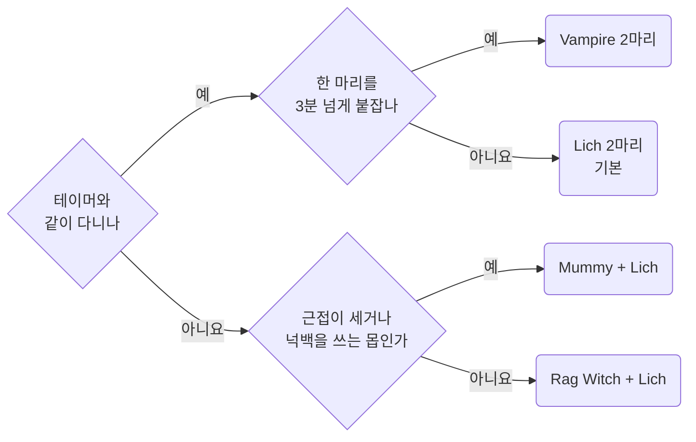
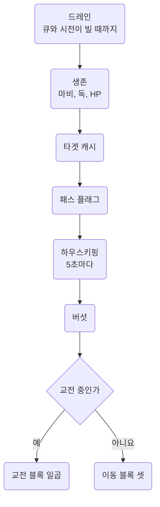
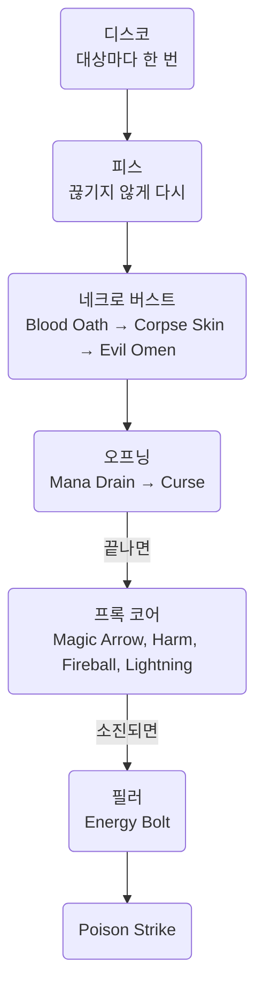
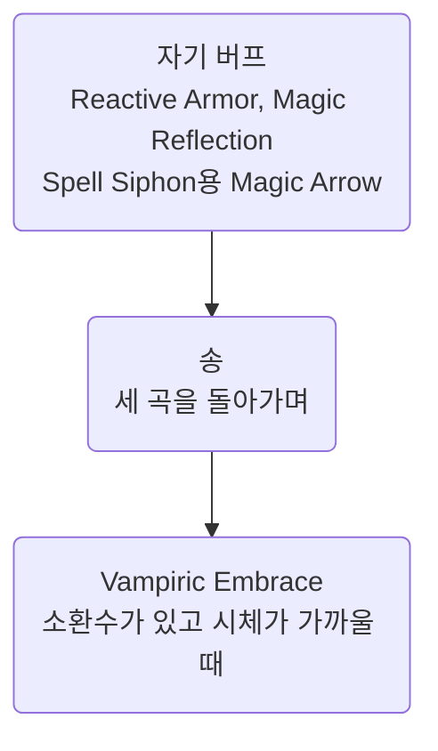
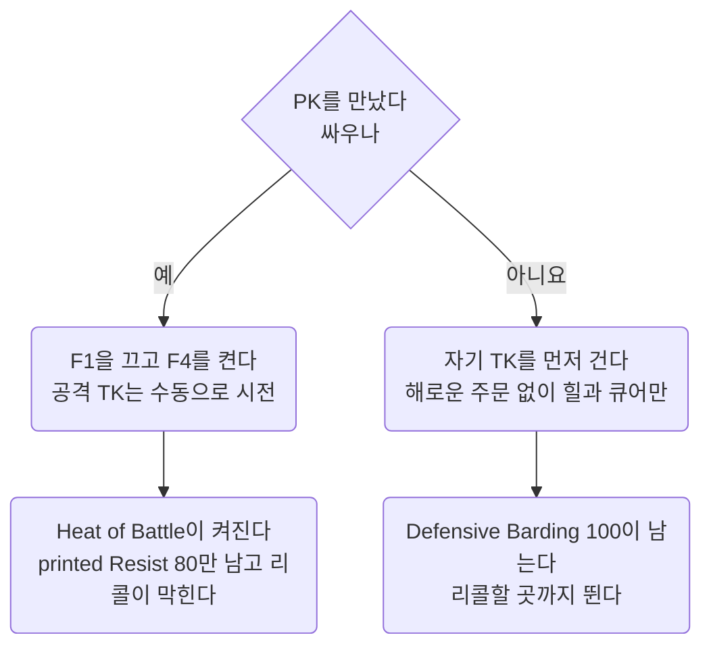

Bard Necro 템플릿의 메커니즘과 판단. 소환 조합, 전투 루프의 모양, PK 대응.
**숫자는 추측 금지.** 바드, 네크로, 소환수 숫자는 여기서 인용, 없으면 위키를 읽고 여기에 추가.
인용과 확인 표시: [Workflow](../working/workflow.md#01.C) 01.C절.

- 캐릭터 `nomeehej`, Razor 프로필 `summoner`
- 사냥: `script/combat/bard-necro-enhanced.razor`(F1). PK: F4를 다시 연결한 `script/combat/pvp.razor`
- 2026-09-28 `bard-mechanics.md`, `bard-necro-combat-design.md`, `bard-necro-summon-guide.md` 세 문서를 하나로 통합. 이력은 git

다른 문서에 있는 것:

- 템플릿과 무관한 PvP 규칙과 숫자: [PvP](../game/pvp.md). 06절은 이 캐릭터의 판단만
- Razor 구문, 함정, 명령문 비용: [Razor](../scripting/razor.md)
- 쿨다운 바와 오버헤드의 이름과 색 규칙: [Overheads](../scripting/overheads.md)

## <a id="00"></a>00 한눈에

| 절 | 내용 |
| --- | --- |
| [01](#01) | 캐릭터 구성과 측정값 |
| [02](#02) | 바드 스킬, 송, 쿨, 코덱스. 루프 게이트의 근거 |
| [03](#03) | Magery 프록, 네크로 소환과 심볼, Grimoire와 Codex 포인트 |
| [04](#04) | 소환 조합, Tome 배분, 소환수 이름, 재소환 |
| [05](#05) | `bard-necro-enhanced`와 `pvp`의 설계. 마나 예산, 명령문 비용 |
| [06](#06) | PK 대응 판단. Defensive Barding, 도주와 반격, Resist |
| [07](#07) | 인게임 확인 결과와 남은 측정 |
| [08](#08) | 틀렸던 생각 |
| [09](#09) | 출처 |

자주 찾는 곳: 소환 조합 [04.B절](#04.B), 루프 수정 [05.A절](#05.A), PK [06절](#06).

이 문서에 걸린 질문은 [Open items](../questions/open-items.md).

::part[캐릭터]

## <a id="01"></a>01 캐릭터

### <a id="01.A"></a>01.A 전제 스킬과 장비

| 스킬 | 값 |
| --- | --- |
| Discordance, Peacemaking, Provocation | 80, 80, 80 |
| Musicianship | **0**. Bard Codex `Self Taught` T2가 대체 |
| Spirit Speak | 120 |
| Resisting Spells | 80. 2026-09-27 Herding 대신 |
| Necromancy | 100 |
| Magery | 100 |
| Eval Int | 80 |

- **바딩 세 스킬 모두 80.** `Self Taught`가 "lowest printed skill amongst Discordance,
  Peacemaking, Provocation" 80점을 Musicianship 대신 사용 → Musicianship 칸이 비어 Provocation 추가 가능
- **Effective Barding 170.** 송 메시지의 `8.5%`로 측정(02.M절)
- **Meditation 없음.** 마나는 환급 스택, 이동 중 자연 회복, 버섯
- **Inscription 없음.** Inscription이 늘리는 `Bless`, `Protection` 지속과 `Reactive Armor` 강화 없음.
  Reactive Armor 자체는 Magery로 시전, 루프가 이동 중 유지(05.A절 자기 버프)
- 장비: Avarhide 스펠북(double mana regen 60%), Eldritch Aspect 8단계(mana refund 26%, special chance 7.2%), Lyric Aspect 방어구
- 소환수 딜 비중 **63.4%**(01.B절 측정), 본체 37%
- 테이머와 둘이 다니는 경우가 많음. **본체는 후열**
- 주 사냥터 몹 난이도 **300\~500**
- PK는 도주보다 반격이 기본 → Herding 대신 Resisting Spells 80(06.C절)
- 소환수는 종류를 알아볼 이름(`leech`, `mumi`, `vampa`, `wicca` 등)으로 자동 개명(04.H절)

### <a id="01.B"></a>01.B 측정 결과

인게임 데미지 트래커 측정값.

| 구성 | 소환수 딜 비중 |
| --- | --- |
| 바딩 120 x3, SS 80, Eval 80 | 47.6% |
| 바딩 80 x3, SS 120, Eval 80 | **63.4%** |

**소환수가 딜의 3분의 2.** 바딩 120보다 SS 120으로 소환수 계수를 키우는 쪽이 훨씬 큼 → 바딩 세 스킬 80의 근거.

- 바딩 최소 성공률 `33% x (Effective Barding / 100)` → 80에서도 쓸 만한 성공률(02.R절)
- 난이도 300\~500의 바딩 지속시간은 최소값 `15초 x (Musicianship / 100)`(02.N절). Musicianship 120으로 올려도 차이 작음
- 2026-09-27 Herding 제외, Resisting Spells 80. Herding은 팔로워 데미지 `22% x (Effective Herding / 100)`, 저항 `11% x (Effective Herding / 100)`.
  80이면 17.6%와 8.8%. 출처는 옛 스크립트의 `config__use_herding` 주석
- PK와 싸우는 것이 기본 → Heat of Battle 중의 printed Resist가 더 급함(06.C절)

### <a id="01.C"></a>01.C 전투 사이클

- 한 마리 전투 → 10\~20초 이동 → 다음 한 마리
- **이동 구간이 전체의 약 4분의 1.** 이 시간에 마나 회복, 버섯 60초 쿨 진행
- 2분짜리 버프는 이 구간에서 낭비 → **2분 버프는 몹이 가까울 때만**
- 스탯 포션을 교전 중에만 마시는 이유도 같음(05.A절 하우스키핑)

### <a id="01.D"></a>01.D 확정 수치, Effective Barding 170

| 항목 | 값 | 출처 |
| --- | --- | --- |
| Barding Song 세 곡 각각 | **8.5%**. 나와 팔로워 | 송 메시지로 측정(02.M절) |
| Discordance 디버프 | printed 80이면 `80/120 x 25 = ` **16.7%** | printed 기준(02.L절) |
| Discordance 지속 | **1분 21초 \~ 1분 57초** | 측정값. 장비와 대상에 따라 다름 |
| Peace와 Provo의 최소 지속 | `15 x 0.8 = ` **12초** | 난이도 300 이상은 이 값(02.N절) |
| 바딩 최소 성공률 | **56.1%**. Perfect Pitch T3를 더하면 **72.9%** | 공식(02.R절) |
| Barding Break(난이도 400) | 초당 **4%**, 걸리면 **40초** | **Peace와 Provo만** 끊음(02.O절) |

::part[메커니즘]

## <a id="02"></a>02 바드 메커니즘

루프가 쓰는 결론은 02.E절 쿨 모델 하나.

- 바딩 행동은 모두 `music`과 자기 슬롯이 0일 때만. 송은 `song`도 확인
- 스킬은 `music` 5초와 자기 슬롯을 세움. 송은 `song`만 세움
- 02.A \~ 02.D절: 근거. 02.F \~ 02.J절: `cooldowns.xml`과 스크립트 반영. 02.K절부터: 송, 디버프, 코덱스 효과

### <a id="02.A"></a>02.A 스킬 사용 쿨

|  | 쿨 | 출처 |
| --- | --- | --- |
| **Music (글로벌)** | 5초 | "A player may alternate between using Peacemaking or Provoking and Discordance every 5 seconds" |
| Discordance | 5초. 성공과 실패 같음 | "Skill usage cooldown is 5 seconds on both success and failure" |
| Peacemaking | **성공 10초, 실패 5초** | "Skill usage cooldown is 10 seconds on success and 5 seconds on failure" |
| Provocation | **성공 10초, 실패 5초** | "Skill usage cooldown is 10 seconds on success and 5 seconds on failure" |
| Barding Song | 10초 | "Casting a Barding Song has a 10 second cooldown that is independent of normal bard skill usage" |

- **Peace와 Provo는 슬롯 공유**(02.F절)
- **글로벌 쿨과 개별 쿨이 둘 다 0이어야 함.** Music 5초가 지나도 Peace 자기 쿨 10초가 남으면 사용 불가

```
if cooldown "music" = 0 and cooldown "peace/provo" = 0
```

두 쿨을 다 지킨 순서.

| 시각 | 스킬 | 쿨 |
| --- | --- | --- |
| t=0 | Discordance | Music 0 → 5, Disco 0 → 5 |
| t=5 | Peacemaking | Music 0 → 5, Peace와 Provo 슬롯 0 → 10 |
| t=10 | Discordance | Music 0 → 5, Disco 0 → 5 |
| t=15 | Provocation | Peace와 Provo 슬롯 쿨이 그때 풀림 |

### <a id="02.B"></a>02.B 송은 스킬을 백팩에 쓴 것

송은 별도 명령이 아님. **바드 스킬을 자기 자신, 곧 백팩에 찍으면 송.**

> "What do you wish to pacify? (you may target **yourself for an area effect** or the **ground for a group effect**)"

```
useskill 'Peacemaking'
waitfortarget wait__bard_target
target backpack
```

- 마지막 줄 `target backpack` → 송(AoE). `target lasttarget` → 스킬(한 대상 디버프)
- 기존 구현도 같은 모양(`script/archive/bard-mace.razor`의 BARD SONG BUFF, `module/bard/song.razor`)

### <a id="02.C"></a>02.C 세 가지 쿨 계열

막힐 때 뜨는 문장으로 계열 구분. **쿨 모델의 열쇠.**

| 계열 | 막힐 때 뜨는 문장 | 범위 |
| --- | --- | --- |
| **Music 글로벌** | "You must wait a few moments to **use another skill**." | 모든 바드 스킬. 5초 |
| **Barding Song** | "You must wait a few moments before performing **another barding song**." | **세 곡이 공유.** 바는 11초(02.I절) |
| **Peace와 Provo 슬롯** | "You must wait a few moments before you may **provoke or pacify another creature**." | **공유.** 10초(02.F절) |

- Discordance는 자기 슬롯 5초를 따로 사용. Discordance 전용 차단 문장은 확인되지 않았다
- `Peace Song -> Disco Skill -> Disco Song` 순서에서 마지막이 "another barding song"으로 막힘 → **곡끼리 쿨 하나를 공유**

### <a id="02.D"></a>02.D cooldown은 서버 값이 아님

`cooldown "..."`은 서버 값이 아닌 `cooldowns.xml`의 내 트리거. 일반 규칙은 [Overheads](../scripting/overheads.md#06.B) 06.B절.

- 예전 `music` 항목에 송 트리거(10초)가 섞임 → 뒤따르는 5초 스킬 트리거와 서로 덮어씀
- 증상: "Music이 0인데 송이 안 나간다", "서버가 허용하는 스킬을 10초 참는다"
- 02.I절 최종 형태로 수정. 내역과 이유도 거기

### <a id="02.E"></a>02.E 쿨 모델, 확정

**모든 바딩 행동은 같은 관문 하나.**

```
Music = 0   AND   <그 스킬의 슬롯> = 0
```

**송만 `Song = 0`을 하나 더 확인.** 읽는 조건은 거의 같고, **다른 것은 세우는 것뿐.**

|  | 요구 | 세우는 것 |
| --- | --- | --- |
| Song | `Music = 0 AND Song = 0 AND <그 곡의 슬롯> = 0` | Song 11초만. Music도 슬롯도 안 세움 |
| Skill | `Music = 0 AND <그 스킬의 슬롯> = 0` | Music 5초와 그 스킬의 슬롯 |

| 슬롯 | 길이 | 공유 |
| --- | --- | --- |
| Discord | 5초 | 혼자 사용 |
| Peace와 Provo | 10초 | **공유** |

**송은 스킬의 조건을 읽기만 함. 아무것도 소모하지 않음.**

- 스킬은 Music을 세움 → **스킬 뒤의 송은 막힘**
- 송은 Music을 안 세움 → **송 뒤의 스킬은 통과**
- 스킬은 슬롯을 세움 → **Peace 스킬 뒤의 Peace 송은 막힘**
- 송은 슬롯을 안 세움 → **Peace 송 뒤의 Peace 스킬은 통과**

#### 근거, 모두 인게임 측정

| 순서 | 결과 | 설명 |
| --- | --- | --- |
| Song → Disco Skill (1.5초 후) | **성공** | 송은 Music도 슬롯도 안 세움. 같은 슬롯도 다른 슬롯도 통과 |
| Song → Peace Skill | **성공** | 같음 |
| Song → Song (즉시) | "another barding song" | 송 쿨 공유 |
| Disco Skill → Song (즉시) | "use another skill" | **송이 Music을 봄** |
| Song (t=0) → Disco Skill (t=9) → Song (t=11) | 막힘 | 송 쿨은 풀렸지만 Disco가 세운 Music이 t=14까지 남음 |
| **Peace Skill → Peace Song** (Music이 풀린 뒤) | **"provoke or pacify another creature"** | **송이 자기 슬롯을 읽음** |
| **Peace Skill → Disco Song** | **성공** | 슬롯이 다르면 통과 |
| **Peace Song → Peace Skill** | **성공** | **송은 슬롯을 안 세움** |
| Song → 막힌 Song → Peace Skill | 막힘 | **막힌 시도도 Music을 태움** |

**마지막 줄이 함정.** 송 쿨에 막힌 시도도 Music을 태움.
"막힌 송 바로 다음의 스킬 판정"을 "송이 스킬을 잠근다"로 잘못 읽기 쉬움. 실제로 한 번 틀림.

#### 루프에 주는 규칙

- **교전 중에는 송이 거의 안 나감.** 디스코와 피스가 `music`을 5초씩 계속 세움
- 악기 연주는 시전을 끊어 주문이 날아감
- → `bard-necro-enhanced`는 **송을 이동 구간에서만.** 이동 10\~20초 동안 `music`이 비고 할 일도 없음

### <a id="02.F"></a>02.F Peace와 Provo는 슬롯 공유

전용 차단 문장 있음.

> "You must wait a few moments before you may **provoke or pacify another creature**."

**`cooldowns.xml`에서는 `peace/provo` 한 항목으로 통합.** 서버 타이머는 하나 → 칸 둘은 화면만 차지하고 값도 틀림.

- 한때 "공유하지 않는다"고 기록. **로컬 Razor 항목만 보고 낸 결론**
- `Provo` 항목이 Peace 문장에 반응하지 않아 `provo READY`로 보였을 뿐, **서버는 막음.** 위키의 원래 서술이 맞음
- 통합 전 기존 스크립트는 **틀린 값을 읽음.** 직전 Peace 뒤에도 `Provo`가 READY → 헛시전, `music`만 소모
- `script/` 전체의 `cooldown "Peace"`, `cooldown "Provo"` 30곳을 `cooldown "peace/provo"`로 교체

### <a id="02.G"></a>02.G 쿨 리셋 프록

- **Lyric Aspect 방어구가 줌.** 모든 바드 쿨을 즉시 0으로
- 문장은 "Your barding skill cooldowns reset.". `cooldowns.xml`의 바드 항목은 모두 이 문장에 0으로(02.I절)
- **송 쿨도 0**(인게임 확인됨) → `song song disco`도 가능
- **쿨 측정 시 Lyric 방어구를 벗음.** 입으면 리셋이 끼어 실제 길이가 안 보임
- 착용 여부는 송 메시지로 확인. **`8.5%`면 착용, `6.8%`면 미착용**
- 스크립트 영향: 쿨이 예고 없이 0이 될 수 있음 → **바드 쿨을 자체 `timer__`로 흉내 내지 않음.** 게임의 `cooldown "..."`을 직접 읽어야 리셋 프록의 이득

### <a id="02.H"></a>02.H 송 버프 감지

```
findbuff "song of discordance"
findbuff "song of provocation"
findbuff "song of peacemaking"
```

- 15분 만료를 직접 세지 않음. 기존 구현(`script/archive/bard-mace.razor`의 BARD SONG BUFF)도 이 방식
- `bard-necro-enhanced`는 이 버프로 게이트하지 않음(05.G절)

### <a id="02.I"></a>02.I 이 저장소의 cooldowns.xml 최종 형태

| 항목 | 길이 | 트리거 |
| --- | --- | --- |
| `skill` |   | 일반 스킬 전부, 바드 5초 트리거 4개, 리셋 |
| `music` | 5s | `play successfully`, `fail to incite anger`, `fail to discord`, `fail to pacify` |
|   | 0s | `Your barding skill cooldowns` |
| `disco` | 5s | `successfully, disrupting your opponent`, `fail to discord`, `briefly discording` |
|   | 0s | `Your barding skill cooldowns` |
| `peace/provo` | 11s | `pacifying your target`, `successfully, briefly pacifying`, `play successfully, provoking` |
|   | 5s | `fail to pacify any nearby creatures`, `fail to pacify your opponent`, `fail to incite anger` |
|   | 0s | `Your barding skill cooldowns` |
| `song` | 11s | `under the effect of a song` |
|   | 0s | `Your barding skill cooldowns` |

- 바 길이는 위키 값(02.A절)과 조금 다름. 송과 Peace, Provo 성공은 10초가 아닌 11초
- 송 쿨의 정확한 길이는 아직 미측정(07절 남은 측정 2)
- 항목 순서: **바가 자주 뜨는 순서.** `skill`, `music`, `disco`, `peace/provo`, `song` 다음, 이 루프가 읽는 바를 `magic arrow`, `harm`,
  `fireball`, `lightning`, `mush`, `heal pot` 순서

고친 내역과 이유.

| 바꾼 것 | 이유 |
| --- | --- |
| `music`에서 `"under the effect of a song"` 10초 **제거** | 스킬 글로벌 항목에 송 쿨 값이 들어가 뒤따르는 5초 스킬 트리거와 서로 덮어씀. "Music이 0인데 송이 안 나간다"의 원인 |
| `song` **신설** | 세 곡이 공유하는 11초와 Lyric 리셋 |
| `disco`, Peace, Provo에서 각자의 `"effect of a song of ..."` 11초 **제거** | 송은 자기 스킬을 잠그지 않음. 두면 서버가 1.5초 뒤 허용하는 것을 11초 참음 |
| Peace에서 `"You play successfully, briefly pacifying ..."` 5초 **제거** | 같은 문장에 `"successfully, briefly pacifying"` 11초가 이미 있어 충돌 |
| Peace와 Provo를 **`peace/provo` 한 항목으로 통합** | 서버가 슬롯 공유(02.F절) |
| `skill`에 바드 5초 트리거 **추가** | 서버의 스킬 게이트가 하나 → 바드가 도는 동안 다른 스킬도 막힘(02.J절) |
| 항목 이름 **통일**. 처음 PascalCase, 2026-09-26 모두 소문자 | 스크립트 11개의 `heal pot`과 XML의 `Heal Pot`이 어긋나 임시 쿨다운으로만 돌고 바는 안 뜸. 규칙은 [Overheads](../scripting/overheads.md#06.A) 06.A절 |
| `fireball`에 발동 트리거 `"fireball activated"` **추가** | 실제 문장은 "Wizardry fireball activated.". 트리거가 없어 바가 안 채워지고 프록 게이트가 매 패스 통과 |
| 바가 자주 뜨는 순서로 **재배치** | 위 목록의 순서 |

**이 파일은 게임 종료 상태에서만 수정**([Workflow](../working/workflow.md#04.C) 04.C절).

### <a id="02.J"></a>02.J skill과 music의 관계

- **서버의 스킬 게이트는 하나.** `music`은 그중 바드 부분만 보는 이름
- **Music이 도는 동안 Animal Lore 같은 다른 스킬도 막힘**
- → `skill` 항목에도 바드 5초 트리거 네 개와 리셋 추가

| 식 | 0보다 클 때 | 쓰는 곳 |
| --- | --- | --- |
| `cooldown "skill"` | 어떤 스킬이든 쿨 |   |
| `cooldown "music"` | 바드 때문에 쿨 | 전투 루프 |

- 전투 루프는 바드 외 스킬을 안 씀 → `music`으로 충분
- **루프에 Animal Lore, Herding 크룩 같은 바드 외 스킬을 넣으면 `skill`로 변경**

### <a id="02.K"></a>02.K Barding Song, AoE 버프

세 곡 모두 <strong>"Players and their Followers"</strong> 대상. 소환수도 받음.

| 곡 | 효과 | 출처 |
| --- | --- | --- |
| Discordance | `5% x (Effective Barding / 100)` **Damage Resistance** | "Provides a (5% \* (Effective Barding Skill / 100)) Damage Resistance bonus to Players and their Followers" |
| Peacemaking | `5% x (Effective Barding / 100)` **Healing Received** | "Provides a (5% \* (Effective Barding Skill / 100)) Healing Amounts Received Bonus to Players and their Followers" |
| Provocation | `5% x (Effective Barding / 100)` **Damage Bonus** | "Provides a (5% \* (Effective Barding Skill / 100)) Damage Bonus to Players and their Followers" |

- 지속 **15분**. "All AoE Barding Song Buffs durations are 15 minutes"
- **재소환한 소환수에는 없음.** 다시 불러야 함(인게임 확인됨)
- 스킬 사용(디스코, 피스, 프로보)과 별개. 섞지 않음

### <a id="02.L"></a>02.L Discordance 디버프

> "The Discorded debuff increases damage taken from all sources by 25%, and reduces damage done by 25%."
> 스케일: "(Bard's Printed Discordance Skill / 120) \* 25 as %"

**printed 스킬 기준.** Effective 아님. 디스코 80이면 `80/120 x 25 = 16.7%`.

### <a id="02.M"></a>02.M Effective Barding Skill

> "A player's Effective Discordance Skill is their (Discordance Skill + Instrument Skill Bonuses + Applicable Instrument Slayer Bonuses + Supplemental Skill Bonuses + Lyric Aspect Armor Bonus)."
> "total bonuses from these sources cannot exceed the player's **Musicianship skill level**"

- **보너스 합계 상한은 Musicianship** → Musicianship을 버릴 수 없음
- **`Self Taught` 대체값도 이 상한에 적용**(인게임 확인됨)

#### 측정값: Effective Barding = 170

송 메시지가 값을 그대로 보여 줌. 송 공식이 `5% x (Effective Barding / 100)` → 표시 퍼센트 x 20 = Effective Barding.

| 장비 | 송 표시 | Effective Barding |
| --- | --- | --- |
| Lyric Aspect 방어구 착용 | `8.5%` | **170** |
| Lyric 미착용 | `6.8%` | 136 |

- 차이 **34** = Lyric Aspect Armor Bonus. **실전 기준 170**
- `80 printed + 80 cap = 160` 계산보다 높음. 상한이 정확히 어떻게 잡히는지는 확인되지 않았다
- **추론값 대신 측정값 사용.** 장비 교체 시 송 메시지 재확인

### <a id="02.N"></a>02.N 바딩 지속시간

| 스킬 | 공식 |
| --- | --- |
| Peacemaking | `(60초 - 몹 난이도) x (Effective Barding / 100)`, 최소 `15 x (Musicianship / 100)`초 |
| Provocation | `(60초 - 최고 몹 난이도) x (Effective Barding / 100)`, 최소 `15 x (Musicianship / 100)`초 |

- **난이도 300\~500에서는 앞 항이 음수 → 최소값**
- Musicianship 80이면 `15 x 0.8 = 12초`, 120이면 18초. **이 구간에서 Musicianship 상향의 이득은 6초뿐**

### <a id="02.O"></a>02.O Barding Break

> "for every 1 second that passes there is a ((CreatureDifficulty / 100) \* 1%) chance they will suffer a 'Barding Break'"
> "that will last for (CreatureDifficulty / 10) seconds"

난이도 400 → **초당 4% 확률**, 걸리면 **40초**. 끊는 대상은 스킬마다 다름.

- Peacemaking: "Pacified creatures may suffer a barding break, **ending the pacify effect prematurely**, and temporarily preventing them from being pacified again for a limited
  time."
- Provocation: "Provoked creatures may suffer a barding break, **ending the provocation effect prematurely**"
- Discordance: **안 끊김. 한 번 걸면 유지**(인게임 확인됨). 위키 Discordance 문서에 barding break 언급이 없는 것과 일치

- **`Ensemble`은 그래도 브레이크 영향.** 조건이 `Discord AND (Peace OR Provo)` → 디스코가 살아 있어도 **Peace나 Provo가 끊기면 Ensemble 꺼짐**
- → `Refrain`(브레이크 무시)은 Peace와 Provo를 지키며 **Ensemble 가동률도 지킴**
- **브레이크 걸린 대상에는 Peace도 Provo도 불가**(인게임 확인됨). 한쪽으로 다른 쪽 대체 불가
- 난이도 400이면 **40초 동안 Ensemble 완전 꺼짐**

### <a id="02.P"></a>02.P Peacemaking의 효과

> "Pacified creatures will not move, perform melee attacks, cast spells, or use most abilities"

- **데미지로 안 풀림.** 풀리는 것은 **Barding Break뿐**
- 위키 어디에도 "damage breaks pacify" 없음. 클래식 UO 규칙 적용 안 함
- → **피스를 걸고 때려도 됨.** 소환수 공격에도 안 풀림. 피스와 공격 로직이 서로 막을 이유 없음

### <a id="02.Q"></a>02.Q Bard Codex

> 요구조건: "Players must have 2 or more skills of at least 80 Musicianship, Peacemaking, Provocation, Discordance skill or above"

**총 20포인트.** 티어별 추가 비용 `1/2/2`, 누적 **`T1=1 / T2=3 / T3=5`**.

| 업그레이드 | 효과(T1, T2, T3) | 팔로워 적용 |
| --- | --- | --- |
| **Sing Your Own Praises** | "Your bard song effects are increased by (40% / 120% / 200%) of normal **for you and your followers** but are reduced by (20% / 60% / 100%) **for others**" | **O** |
| Ensemble | "Gain Damage Bonus of (8% / 24% / 40%) towards creatures that you have Discorded". **실제 조건은 Discord AND (Peace OR Provo). 두 개가 걸려야 함**(인게임 확인됨) | 언급 없음 |
| Reverb | "Gain Damage Bonus of (4% / 12% / 20%) towards the target or targets of your most recent successful barding skill usage" | 언급 없음 |
| Virtuoso | "Damage Bonus and Damage Resistance against Barded Creatures". 크기는 `5% / 15% / 25%` x (lowest skill / 100) | 언급 없음 |
| Perfect Pitch | "Increases barding success chances by (6% / 18% / 30%) of normal" | -- |
| Refrain | "Your barding effects have a (4% / 12% / 20%) chance to ignore any Barding Breaks" | -- |
| Revolution Song | "Your provoked creatures inflict (40% / 120% / 200%) more damage" | -- |
| Self Taught | "Player can use up to (40 / 80 / 120) points of their **lowest printed skill** amongst Discordance, Peacemaking, Provocation to replace Musicianship requirements" | -- |

- **팔로워 적용이 명시된 코덱스는 `Sing Your Own Praises` 하나뿐**
- `Ensemble`, `Reverb`, `Virtuoso`는 "you"나 "the player"로만 서술. 소환수가 딜의 60% 넘게 내는 빌드에서는 이 차이가 배분을 뒤집음
- **`Sing Your Own Praises`의 `for others` 페널티**: 다른 플레이어와 **그 팔로워**가 내 송에서 받는 효과 감소.
  테이머 펫도 해당. T3는 `-100%` → 테이머 쪽은 내 송 효과 없음
- **`Self Taught` 상한**은 "lowest printed skill". Disco, Peace, Provo가 모두 80이면 T3(120점)를 찍어도 **80까지만** → T2(3점)가 상한

### <a id="02.R"></a>02.R 바딩 성공률

> "Increases barding success chances by (6% / 18% / 30%) of normal" -- Perfect Pitch

최소 성공률 `33% x (Effective Barding / 100)`. Effective 170이면 `56.1%`, `Perfect Pitch` T3를 더하면 `56.1% x 1.3 = 72.9%`.

## <a id="03"></a>03 마법과 네크로

### <a id="03.A"></a>03.A Magery 프록은 게임 메시지로 확인

`cooldowns.xml`에 이미 있음. **15초를 자체 `timer__`로 세지 않음.**

| 항목 | 프록 발동 | 다시 준비됨 |
| --- | --- | --- |
| `magic arrow` | "magic arrow activated" | "cast a wizardry magic arrow spell again" |
| `harm` | "harm activated" | "cast a wizardry harm spell again" |
| `lightning` | "lightning spell hinders" | "cast a wizardry lightning spell again" |
| `fireball` | "fireball activated" | "cast a wizardry fireball spell again" |

- 바 길이 15초(인게임 관찰). 준비 문장이 오면 바가 0 → 길이가 조금 틀려도 문장이 보정
- Lightning 프록은 `Wizardry lightning activated.`와 `Your lightning spell hinders your target.` 둘 다 뜸(인게임 확인됨 2026-09-28)
- 지금 트리거인 힌더 줄로 충분. 발동 줄로 바꾸려면 `lightning activated`가 아닌 `Wizardry lightning activated`. 짧은 쪽은 `chain lightning activated`에도 걸림
- 스크립트는 `cooldown "magic arrow" = 0`처럼 바로 읽음

**`Energy Bolt`는 쿨다운 항목 불필요.** 15초 창이 없는 순수 필러. 단, 마나 회수에 조건.

> "Damage increased by (6% / 18% / 30%). Player recovers (3 / 9 / 15) mana **if target is killed within next 5 seconds**" -- Wizard's Grimoire, Energy Bolt
> "Inflicts an additional (7%, 21%, 35%) of final spell damage to target over 15 seconds" -- Wizard's Grimoire, Flamestrike

- 회수 마나는 Grimoire T1, T2, T3에서 **3, 9, 15**. 이 캐릭터는 Energy Bolt에 5점(T3) → 15(03.E절)
- 15마나는 **볼트 적중 뒤 5초 안에 대상이 죽을 때만.** 잡몹 마무리 시 실제 비용 5, 체력 큰 몹은 20 그대로
- 이전 판의 "조건 없는 상시 효과"는 오류. 05.D절 마나 예산도 이 조건으로 수정

### <a id="03.B"></a>03.B Magery 시전 시간

| 서클 | 시전 | 서클 | 시전 |
| --- | --- | --- | --- |
| 1 | 0.50초 | 5 | 1.50초 |
| 2 | 0.75초 | 6 | 1.75초 |
| 3 | 1.00초 | 7 | 2.00초 |
| 4 | 1.25초 | 8 | 2.50초 |

> "Casting recovery time is **0.2 seconds**" -- 시전 사이 고정 딜레이

- 소환 주문은 이 표 밖. [Item list](../game/item-list.md#19) 19절 기준 서클과 무관하게 모두 6.00초(03.C절)
- **시약과 마나는 대상을 찍을 때 검사와 소모**(인게임 확인됨 2026-09-28). 시약이 없어도 시전은 끝까지, 커서도 뜸
- 대상을 찍는 순간 캐릭터 이름으로 `More reagents are needed for this spell.` → 실패. 마나는 그때까지 그대로

### <a id="03.C"></a>03.C 네크로 소환, Vengeful Spirit

**언데드 소환수는 `Vengeful Spirit`을 켠 뒤 소환 주문 시전.** Spirit Speak만으로는 안 나옴.

> "For next 30 seconds all summon spells cast will instead create an Undead follower that loses 1% health &
> max health every 10 seconds but has damage increased by (20% \* (Necromancy / 100))"

| Magery 소환 | 언데드 |
| --- | --- |
| Fire Elemental | **Lich** |
| Earth Elemental | **Ancient Mummy** |
| Air Elemental | Skeletal Fiend |
| Water Elemental | Rag Witch |
| Summon Daemon | **Vampire Thrall** |
| Blade Spirits | Skeletal Husk |
| Energy Vortex | Jackal Spirit |
| Summon Creature | 무작위 언데드 |

- 8서클 소환은 모두 **마나 50, 시전 6.00초**, 시약 **Bloodmoss** 포함([Item list](../game/item-list.md#19) 19절)
- **타이머 없음. 대신 최대 체력이 10초마다 1%씩 감소 → 결국 쓸모없음.** 0은 안 됨(04.A절). 재소환은 "죽었을 때"가 아닌 주기적인 정비
- **`followers`는 컨트롤 슬롯 수.** 위 소환수는 각 **2**, Summon Creature는 1(인게임 확인됨).
  Skeletal Husk는 위키 데이터상 1([PvP](../game/pvp.md#06.B) 06.B절)
- Vengeful Spirit: 심볼 1개, 30초. 둘을 뽑으려면 30초 안에 VS, 소환, 소환

### <a id="03.D"></a>03.D Unholy Symbol 경제

- 심볼: 5초에 1개, 최대 `Effective Necro / 10` = **10개**
- 30초 사이클에 6개 충전, 전투용 셋(4 + 2 + 2 = 8)을 다 쓰면 **사이클마다 2개 부족**
- → 개수가 되자마자 쓰지 않고 **위 능력의 몫을 남기고** 사용

| 능력 | 비용 | 발동 조건 | 남겨 두는 것 |
| --- | --- | --- | --- |
| **Blood Oath** | 4 | `>= 4` | 없음. 가장 먼저 |
| **Corpse Skin** | 2 | `>= 4`. 서 있고 warmode가 아닐 때 | 없음. Blood Oath와 같은 4 → 체인 순서가 우선순위 |
| Evil Omen | 2 | `>= 4`. 서 있고 warmode가 아닐 때 | 없음. 위 둘이 30초에 6개를 다 씀 → 사실상 이동 중 잉여로만 |
| Poison Strike | 1 | `>= 1`. Corpse Skin이 켜져 있고, 프록 코어와 필러 뒤 | 없음. 필러 자리, 위는 이미 사용 |
| Vampiric Embrace | 3 | `>= 9`. 이동 중에만 | 6 |

- **Necro 100에서 실제로 도는 것은 Blood Oath와 Corpse Skin.** 30초에 6개 충전, 둘이 정확히 6개 사용
- 셋 모두 4개에서 발동 → 체인 순서(Blood Oath, Corpse Skin, Evil Omen) = 우선순위
- Blood Oath 뒤 20초에 Corpse Skin, 그때부터 Poison Strike 열림. Evil Omen은 이동 중 잉여로만
- 문턱은 모두 `config__symbols_*` → 사냥터에 맞춰 조정. 전투가 짧고 이동이 길면 올리고, 은행이 늘 차 있으면 내림
- 2026-09-27 Corpse Skin, Evil Omen, Poison Strike, Vampiric Embrace 문턱을 6, 8, 9, 7에서 4, 4, 1, 9로 변경.
  이전에는 은행이 늘 찬 채로 Evil Omen과 Poison Strike가 거의 안 나가고, Poison Strike는 Corpse Skin을 오래 기다림

**우선순위 근거**(Necro 100).

|  | 효과 | 전체 딜 기여 |
| --- | --- | --- |
| Blood Oath | 팔로워 딜 **+30%** | 63% x 30% = **+18.9%** |
| Corpse Skin | 공격 주문마다 25% 질병 DoT | 37% x 25% = +9.3%, **자해 없음** |
| Evil Omen | 주문 +20%, 주문마다 25% 확률로 마나/2만큼 자해 | 37% x 20% = +7.4%, 자해 있음 |

- **Corpse Skin이 Evil Omen보다 위.** 보너스가 크고 대가 없음. **둘은 동시 유지**(인게임 확인됨)
- **Corpse Skin과 Evil Omen은 걷는 중(`cooldown "walk"`)과 warmode에는 안 씀.** warmode는 수동 모드, 게이트가 `not warmode`를 직접 읽음
- 둘 다 루프의 주문이 있어야 값을 함. 걷는 동안은 공격 주문이 안 나가 지속시간만 흐름 → 멈춰서 다시 칠 때 프록과 함께 열리게
- Blood Oath는 소환수 몫 → 걷는 중에도 warmode에서도 사용

> "Target a creature that you have applied Poison or Disease onto to resolve up to 3 Poison ticks and up to 8 Disease ticks remaining at (100% \* (Necromancy / 100)) normal damage."
> -- 위키 Necromancy, Poison Strike

> "For next 30 seconds any damaging spell will apply a Disease effect dealing damage of (25% \* (Necromancy / 100)) over 30 seconds" -- 위키 Necromancy, Corpse Skin

> "30 second cooldown in between uses of the same Necromancy ability" -- 위키 Necromancy

- **Poison Strike**: Corpse Skin의 질병 틱 최대 8개, 독 3개를 한 번에 터뜨림. 곧 죽을 몹에서 함께 사라질 딜을 회수. 마나가 안 들어 **필러 자리**
- 질병은 공격 주문마다 하나 → **프록 코어 네 개와 필러 Energy Bolt 한 방 뒤에** 터뜨림(4 + 1 = 5개)
- Magic Arrow 하나 뒤에 쓰면 쌓이던 스택 낭비. 순서 유지 방법은 05.A절
- 질병 하나의 틱 수는 확인되지 않았다. 하나에 틱이 여러 개면 다섯 스택보다 적어도 8틱이 참

**능력의 응답 문장.** 루프는 결과를 이 문장으로 판정. 거절당하면 30초 창을 다시 세우지 않음.

| 문장 | 뜻 | 루프의 처리 | 확인 |
| --- | --- | --- | --- |
| `unholy symbols remaining` | 사용함 | 그 능력의 타이머를 0, 30초 뒤 재사용 | 성공 오버헤드가 여기서 뜸 |
| `seconds before you may use that ability again.` | 아직 쿨 | 타이머를 0. 대개 성공 줄이 늦게 온 사용의 답이라 30초가 맞음 | 확인되지 않았다 |
| `You do not have a poison or disease effect on that target.` | Poison Strike. 대상에 독도 질병도 없음 | `var__proc_target`을 비우고, 다음 프록이 그 몹에 갈 때까지 대기 | 인게임 확인됨 2026-09-28 |
| `You do not see any corpses near that location.` | Vampiric Embrace. 닿는 시체 없음 | `interval__embrace_miss`(5초) 뒤 재사용 | 인게임 확인됨 2026-09-28 |

- **넣지 않은 것**: Strangle(4)은 Blood Oath와 심볼 경쟁, 모든 딜을 5초 늦춤. Wither(5)는 비공격 주문용 마나만. Pain Spike(5)는 **다음 몹 옆에** 시체 필요
- **핫바의 Auto-Renew는 모두 끔.** 게임이 같은 심볼을 쓰고 우선순위가 <strong>"least expensive first"</strong>
  → 이 빌드와 정반대, Blood Oath가 맨 마지막
- 핫바에서 심볼 수를 읽는 방법: 05.H절

### <a id="03.E"></a>03.E Wizard's Grimoire 40점

| 주문 | 점수 | 효과 |
| --- | --- | --- |
| Magic Arrow | 5 | 15초마다 첫 시전 +250% |
| Harm | 5 | 15초마다 첫 시전 +250% |
| Fireball | 5 | 15초마다 첫 시전 +250% DoT |
| Lightning | 5 | 15초마다 첫 시전 +200%, 힌더 2.5초 |
| Curse | 5 | 대상에게 60초 동안 내 모든 주문 +30% |
| Mana Drain | 5 | 대상에게 60초 동안 적대 주문 환급 +30% |
| Create Food | 5 | 버섯 25마나 / 60초 |
| Energy Bolt | 5 | 데미지 +30%, 5초 안에 죽으면 15마나 회수 |
| 합 | 40 |   |

#### Bless 대신 Energy Bolt

|  | Bless 3 | Energy Bolt 5 |
| --- | --- | --- |
| 얻는 것 | 팔로워 근접 피해, 주문 피해, 공격 속도 각 **5%** | 6서클 주문 **+30%**, 마무리 시 실제 비용 5마나 |
| 전체 딜 기여 | 주문 피해 5% x 소환수 63% = **약 +3.2%** | 15초 창마다 시전 횟수 **약 2배** (4회 → 9회, 05.D절) |
| 비용 | 2분마다 9마나, 행동 슬롯 1 | 빈 시간 채움. 행동 슬롯 추가 없음 |

- **프록 네 개는 15초 창에서 약 4.3초만 사용.** 남는 10.7초는 버려지던 시간(05.D절)
- `Energy Bolt`가 그 10.7초를 6서클 주문 +30%로 채움. `Bless`의 `+3.2%`와 비교 불가
- 실제 비용 5마나는 마무리 때뿐. 20을 다 내도 결론은 같음

#### 필러는 Flamestrike가 아닌 Energy Bolt

Magery 100, Eval 80(`0.75 + 0.75 x 0.8 = 1.35`), 위키 PvM 공식으로 계산.

|  | Energy Bolt (Grimoire 5) | Flamestrike (Grimoire 0) |
| --- | --- | --- |
| 마나 | 20, 마무리면 5 | 40 |
| 피해 | 32\~44 x 1.35 x 1.30 = **56\~77**, 평균 67 | 72\~96 x 1.35 = **97\~130**, 평균 113 |
| 시전 | 1.75 + 0.2 | 2.00 + 0.2, 피해 딜레이 0.5 |
| 마나당 피해 | **3.3**, 마무리면 13 | 2.8 |
| 초당 피해 | 34 | **51** |

- 이 루프는 마나가 먼저 바닥남(`config__filler_floor`에서 잘림) → 기준은 **마나당 피해**, EB 우세
- Flamestrike: 시간당 피해 1.5배, 마나 소모 1.8배. Grimoire 5점을 EB에서 빼 와야 DoT 35%
- 잡몹 마무리 시 EB가 15를 회수 → 마나당 13으로 격차 확대. **필러는 EB**
- Flamestrike를 쓰려면 필러 교체 대신 "마나가 높을 때만(예: 80 이상) 체력 큰 몹에 한 방" 별도 분기
- `Magic Reflect`, `Protection`, `Greater Heal`, `Cure` 모두 0점도 맞음. 기본 주문은 포인트 없이 시전, 큐어는 쿨 없는 포션 우선

### <a id="03.F"></a>03.F Bard Codex 20점, 지금 배분 유지

| 업그레이드 | 점수 | 효과 |
| --- | --- | --- |
| Self Taught | 3 | Musicianship 80 대체. printed가 80뿐이라 T3(120점)는 낭비 |
| Perfect Pitch | 5 | 성공률 56.1% → 72.9% |
| Refrain | 5 | Barding Break 20% 무시 |
| Ensemble | 3 | +24% |
| Reverb | 3 | +12% |
| Virtuoso | 1 | +4% |
| 합 | 20 |   |

- **이전 판의 `Refrain 5 -> 1` 권고 철회.** 근거 오류
- `Ensemble`은 Peace나 Provo까지 걸려야 켜지고, 그쪽은 브레이크에 끊김(02.O절) → `Refrain`이 **`Ensemble` 가동률을 지킴**

#### Ensemble 3에서 5로: 가치 거의 없음

난이도 400, Lyric 방어구 무시 42.5%와 `Refrain` T3 20% 기준 Peace 가동률 약 <strong>62%</strong>.

| 2점 이동 | 효과 |
| --- | --- |
| `Ensemble 3 -> 5` | `+24% -> +40%`. 가동률 62% → 실효 **+9.9** |
| `Reverb 3 -> 1` | `+12% -> +4%`. 가동률 거의 100% → 실효 **-8.0** |
| 합 | 본체 데미지 **+1.9**, 전체 약 **+0.7%** |

**움직일 만한 값 아님.** 지금 배분 유지.

#### 진짜 문제는 배분이 아닌 Peace 가동률

- `Ensemble` 3점이 값을 하려면 **Peace가 계속 걸려 있어야 함**
- 난이도 300 이상 Peace 지속은 최소값 `15 x 0.8 = 12초`, 자기 쿨 10초 → **12초마다 다시 걸면 끊김 없음**
- → 루프의 피스 블록은 대상마다 한 번이 아닌 계속 재시전(05.A절)
- Peace를 가끔 쓰는 제어 수단으로만 다루면 `Ensemble`, `Virtuoso` 4점이 대부분 놀게 됨
- 브레이크가 뜨면 그 대상에는 Peace도 Provo도 불가(02.O절). 난이도 400이면 **40초 동안 `Ensemble`과 `Virtuoso`가 통째로 꺼짐**
- `Refrain`이 막는 것이 이 40초

## <a id="04"></a>04 소환수

### <a id="04.A"></a>04.A 소환 절차

- **`Vengeful Spirit`(심볼 1)을 켜고 30초 안에 소환 주문 시전.** 안 켜면 맨 엘리멘탈
- 8서클 → **마나 50, 시전 6초.** 둘이면 마나 100, 12초. 키는 Alt 숫자줄([Hotkeys](../game/hotkeys.md#01.B) 01.B절)
- 언데드는 **10초마다 남은 최대 체력의 1%씩 감소.** 복리라 30분 뒤에도 약 16% 남음, 0은 안 됨(인게임 관찰)
- 결국 쓸모없어짐 → 재소환은 죽었을 때의 대응이 아닌 **주기적인 정비**
- Lich 하나 = 슬롯 2. Lich 2마리면 `followers` 4

### <a id="04.B"></a>04.B 무엇을 소환하나

**Magic Resist가 높은 맵이면 누구와 다니든 `Mummy + Air`.** 그 밖의 선택:



PK를 만나도 조합 유지, 사냥하던 그대로 싸움(06.D절). 조합별 이유:

| 상황 | 조합 |
| --- | --- |
| **테이머와 둘(기본)** | **Lich 2마리.** 테이머 펫이 전선을 잡음 → 후열 딜에 모두 투자 |
| 테이머와 둘, 긴 교전 | `Vampire 2마리`. Fury가 3분이면 상한 → 실전에서 쓸 만함 |
| 솔플 | `Rag Witch + Lich`. 탱커 없이 후열만 세울 수 없음. 탱커 자리는 Rag Witch(04.E절) |
| 솔플, 근접이 세거나 넉백을 쓰는 몹 | `Mummy + Lich`. 방어력이 Rag Witch보다 25 높고 넉백 면역(Rooted, 04.E절) |
| 고 Magic Resist 맵 | `Mummy + Air`. **물리 딜이 필요한 유일한 경우** |
| PK를 만났을 때 | 사냥하던 조합 그대로. 근거는 06.D절, 소환수별 PvP 비교는 [PvP](../game/pvp.md#06.B) 06.B절 |

- **Lich, Vampire, Rag Witch는 주문 딜러.** 위키에 Vampire `Spell Damage: 26 - 32`, Rag Witch `Spell Damage: 24 - 30`
- 본체의 `Mana Drain`(`-20 Magic Resist`)과 Fire Tome의 `Hex`가 대상 마법 저항을 깎음 → **셋 모두 이득**
- 물리 딜러는 `Mummy`와 `Air`뿐
- **소환수 스탯은 반드시 SS 120 기준 스케일 표.** 위키 기본 스탯은 낮은 SS 기준이라 실제와 다름

### <a id="04.C"></a>04.C 왜 Lich 2마리인가, 테이머와 둘일 때

- 테이머 펫이 어그로를 잡음 → **탱커 소환수 불필요.** 탱커 슬롯(Rag Witch, Mummy)을 딜로 전환
- Lich는 `Epic Barrage`로 원거리 딜. 후열 자리에 맞음
- Fire Tome `Scorched Earth`의 **Hex가 대상 마법 저항을 깎음.** Lich 딜과 내 주문 딜 동반 상승. 본체가 마법을 쉬지 않는 빌드라 즉시 이득
- 내 `Mana Drain`의 `-20 Magic Resist`도 같은 방향. Lich는 주문 딜러라 그대로 받음
- `Epic Barrage` 쿨타임 30초, 관련 감소폭 2.5초 → 그 항목 자체는 결정적이지 않음. Lich를 고르는 이유는 **후열 딜과 Hex 시너지**

### <a id="04.D"></a>04.D Lich 2마리와 Vampire 2마리

둘 다 주문 딜러 → `Mana Drain`과 `Hex`를 똑같이 받음. 차이는 **자리와 Fury**.

> **Fury (Innate)**: "Damage Dealt increased by 5% for every 30 seconds alive (max +30%)"

- **분당 5%가 아닌 30초당 5%. 3분이면 상한, 거기서 멈춤**
- "1시간 사냥이니 천천히 쌓여도 된다"는 계산은 오류. 반대로 **3분만 살면 되므로 문턱이 낮음**

|  | Lich 2마리 | Vampire 2마리 |
| --- | --- | --- |
| 자리 | 원거리. `Epic Barrage` | 붙어서 싸우는 주문 딜러. 맞음 |
| 딜 성장 | 없음. 처음부터 최대 | 3분에 **+30%**, 그 뒤 고정 |
| 죽으면 | 뒤에 있어 잘 안 죽음 | **Fury가 0으로.** 다시 3분 |
| Tome 시너지 | `Scorched Earth`의 Hex가 **파티 전체 주문 딜** 상승 | `Bloodfuel`, `Battlecaster`, `Vengeance`는 자기 딜만 |
| `Mana Drain -20 MR` | 적용 | 적용 |

- **기본은 여전히 `Lich 2마리`.** 이유는 Fury가 아닌 **Hex**
- Fire Tome `Scorched Earth`의 마법 저항 감소 → Lich 자신, 내 주문, 테이머의 주문 딜까지 상승. Vampire Tome 업그레이드는 모두 자기 딜만
- `Vampire 2마리`는 **한 마리를 3분 넘게 붙잡는 긴 교전**용
- 지금 사이클(한 마리 잡고 10\~20초 이동)에서는 뱀파이어가 살아서 몹 사이를 넘어가야 Fury 유지. 테이머가 전선을 잡으면 가능
- 몹 교체 시 Fury 유지 여부, 이동 중 "alive" 카운터 진행 여부는 확인되지 않았다. 이동 중에도 돌면 `Vampire 2마리` 평가 상승

### <a id="04.E"></a>04.E 솔플

솔플이면 <strong>`Rag Witch + Lich`</strong>.

- 테이머 펫이 없으면 전선을 잡을 것이 필요. 소환수 둘이 동시에 맞으면 둘 다 녹음
- 소환수가 죽으면 다시 뽑아도 송 세 곡은 다음 이동에서야 재적용(05.G절). **교전 중에는 되돌릴 수 없는 손실**
- 탱커 자리는 **Rag Witch**(Water Elemental)가 Ancient Mummy(Earth Elemental)보다 나음. 2026-09-28 Mummy에서 교체

아래는 위키 스케일 표의 SS 120 열. 표의 열은 `Spirit Speak Skill Base / 80 / 100 / 120 / 150`.
두 소환수가 같은 비율로 커짐 → 차이는 어느 SS에서나 같음. SS 120: HP x2.8, 딜과 Wrestling x1.6, Armor +30, Magic Resist +60.

| SS 120 | Ancient Mummy (Earth) | Rag Witch (Water) |
| --- | --- | --- |
| HP | 1540 | 1540 |
| 딜 | 근접 48 \~ 57.6 | 주문 38.4 \~ 48. 원거리 캐스터(Mage AI) |
| Armor | **105** | 80 |
| Magic Resist | 110 | **210** |
| 독 저항, 특수 저항 | 0%, 0% | **66%, 33%** |
| Wrestling | 152 | 160 |
| 능력 | Rooted | Mirror, Flux |

> "Mirror (Passive): Spells cast onto the creature have a 15% chance to be reflected back onto the caster" -- 위키 Rag Witch

> "Flux (Innate): Creature has an innate 25 parry skill and increased aggro" -- 위키 Rag Witch

> "Rooted (Innate): Creature is immune to Knockback effects and has increased Aggro" -- 위키 Ancient Mummy

- **버티는 힘**: HP 같음, 방어력 25 낮음. 대신 마법 저항 100 높고 독 저항, 특수 저항, 패리 25, 주문 반사.
  난이도 300\~500 몹은 주문, 브레스, 독이 많아 Rag Witch가 오래 버팀
- **딜**: 주문 딜 → 내 `Mana Drain`과 Lich의 `Hex`를 받음(04.B절). 숫자는 Mummy보다 약 20% 낮지만 방어력에 안 깎임
- **Mummy가 나은 곳**: 마법 저항 높은 맵(물리 딜 필요, `Mummy + Air`), 근접이 센 몹(방어력 105 대 80), 넉백 쓰는 몹(Rooted)
- **남은 질문**: Rag Witch는 원거리 캐스터 → 어그로를 끌어도 Mummy처럼 앞에 붙어 서지 않음.
  솔플에서 몹을 본체에서 떼어 놓을 만큼 버티는지는 확인되지 않았다

### <a id="04.F"></a>04.F Summoner's Tome 배분

- **소환 주문 하나당 20포인트.** 그 주문으로 소환해 경험치를 쌓아 해금("Players can earn experience and unlock up to 20 Upgrade Points per Summon Spell")
- 주력 소환수를 바꾸면 새 Tome은 처음부터. 티어 비용 누적 `T1=1 / T2=3 / T3=5` → 20점은 **T3 네 개**에 정확히 맞음

#### Fire Tome과 Lich, 가장 먼저

주력 조합의 핵심.

| 업그레이드 | 티어 | 점수 | 이유 |
| --- | --- | --- | --- |
| Fanning The Flames | T3 | 5 | Epic Barrage 직접 강화. 체감이 가장 큼 |
| Scorched Earth | T3 | 5 | Hex. 대상 마법 저항을 깎아 Lich 딜과 내 주문 딜 동반 상승 |
| Spirit Pact | T3 | 5 | 전투 성능을 두루 상승. 무난한 기본값 |
| Wildfire | T3 | 5 | 여러 대상을 칠 때 효율 좋음 |
| 합 |   | 20 |   |

- `Glass Cannon` 제외. 딜은 좋지만 어그로를 끌어 Lich 후열 목적과 충돌
- 테이머 펫이 어그로를 확실히 잡는 것이 확인되면 `Wildfire`와 교체 검토

#### Water Tome과 Rag Witch, 솔플용 두 번째

솔플 탱커용. 주문 쓰는 몹 앞에 세우는 기준.

| 업그레이드 | 티어 | 점수 | 효과 |
| --- | --- | --- | --- |
| Reflecting Pool | T3 | 5 | Mirror 15% → 65%, 피해 저항 +10% |
| Spirit Pact | T3 | 5 | 딜 +15%, 피해 저항 +10% |
| Spell Siren | T3 | 5 | 때리는 몹 하나마다 딜과 피해 저항 +10%, 최대 3마리. 어그로를 끄는 탱커와 맞음 |
| Stagnant | T3 | 5 | 주문 40% 확률로 Greater Poison, 대상 독 저항 15초 동안 -40%. 중첩 |
| 합 |   | 20 |   |

- Rag Witch가 자주 죽으면 `Stagnant` 대신 `Deep Water`. 체력 66% 이상일 때 7.5% 회복, 쿨 30초
- `Polluted`(주문 20% 확률로 질병)는 그다음
- Rag Witch의 독이나 질병이 내 Poison Strike에 잡히는지는 확인되지 않았다. 위키 문구는 "you have applied"

#### Earth Tome과 Ancient Mummy, 고 MR 맵과 근접 몹용 세 번째

솔플 탱커 자리는 Rag Witch에 넘김. 물리 딜이 필요한 고 MR 맵(`Mummy + Air`)과 근접이 센 몹용.

| 업그레이드 | 티어 | 점수 | 이유 |
| --- | --- | --- | --- |
| Shatter | T3 | 5 | Pierce 25. 물리 조합의 핵심 |
| Spirit Pact | T3 | 5 |   |
| Bedrock | T3 | 5 | 탱커 성격과 맞음 |
| Slam | T3 | 5 | 근접 몹 상대 시 체감 좋음 |
| 합 |   | 20 |   |

`Earthpull`은 위 넷 다음.

#### Air Tome과 Skeletal Fiend, 고 MR 맵용 네 번째

`Hex`와 `Mana Drain`으로도 저항이 안 깎이는 맵에서 물리 딜로 돌아가는 카드.

| 업그레이드 | 티어 | 점수 | 이유 |
| --- | --- | --- | --- |
| Tempest | T3 | 5 | 가장 중요 |
| Spirit Pact | T3 | 5 |   |
| Gale | T3 | 5 |   |
| Microburst | T3 | 5 |   |
| 합 |   | 20 |   |

`Whirlwind`, `Windshear`, `Cyclone`은 상황을 타서 뒤로.

#### Daemon Tome과 Vampire Thrall, 마지막

`Vampire 2마리`를 실제 주력으로 정한 뒤에만 투자.

| 업그레이드 | 티어 | 점수 | 이유 |
| --- | --- | --- | --- |
| Bloodfuel | T3 | 5 |   |
| Battlecaster | T3 | 5 |   |
| Vengeance | T3 | 5 |   |
| Spirit Pact | T3 | 5 |   |
| 합 |   | 20 |   |

`Growing Fury`는 오래 살 때만 가치. 난이도 300\~500에서 뱀파이어가 오래 사는지는
아직 확인되지 않았다. 위 넷 먼저.

#### 투자 순서

| 상황 | Tome 순서 |
| --- | --- |
| 테이머와 둘이 주로 다닐 때(지금) | Fire → Water → Earth → Air → Daemon |
| 솔플 비중이 늘면 | Water → Fire → Earth → Air → Daemon |
| 고 MR 맵을 자주 돌면 | Fire → Air → Earth → Water → Daemon |

### <a id="04.G"></a>04.G 스크립트 메모

- Provocation은 찍었지만 한 마리씩 잡는 사이클에서는 대상이 둘이 아님 → 루프에 미포함.
  Provocation 송(팔로워 딜 +8.5%)만 이동 중 라운드로빈
- `Revolution Song`(프로보한 몹이 `40/120/200%` 추가 피해)은 Provocation을 찍어 선택지에 포함. 단, 코덱스 20점 안에서 경쟁
- Air Elemental(Skeletal Fiend)을 쓰려면 `SUMMON NAMES`에 바디 번호와 종류 이름 추가 필요.
  바디는 `findtype` 줄, 이름은 종류 표(04.H절). 지금 종류 표에 fiend 없음, 바디 번호도 모름(아래 표)
- **`bard-necro-enhanced`는 송을 위해 소환수를 추적하지 않음.** 송을 이동 중 계속 갱신 → 재소환 감지 불필요(05.G절 설계 결정).
  소환수를 찾는 블록은 이름을 붙이는 `SUMMON NAMES` 하나뿐
- **적 Lich와 내 Lich는 그래픽이 같음.** 소환수를 타입으로 찾는 코드를 새로 쓰면 `noto` 필터 필수. `fight/target`, `necro/summon-names` 모듈이 그 모양
- **소환수 이름 자동 변경.** `SUMMON NAMES` 블록이 새 소환수를 종류를 알아볼 이름(`leech`, `mumi` 등)으로 변경. 설계와 실패 증상은 04.H절
- **바디 번호(`>info`).** 내 소환수의 Notoriety는 2(friend)

| 소환수 | 바디 | hue | 출처 |
| --- | --- | --- | --- |
| Lich | 24 | 0 | `>info` |
| Ancient Mummy | 158 | 2340 | `>info` |
| Vampire Thrall | 722 |   | 구식 `bard-necro` 팔로워 캐시 |
| Rag Witch | 740 (의심) |   | 구식 `bard-necro` 팔로워 캐시. 2026-10-10 이 번호로 rag witch를 찾지 못해 이름 미변경 → 기본 이름 `a rag witch`로도 검색. `>info`로 바디를 읽어 수정 |
| Summon Creature 풀의 표준 언데드 | 3 26 50 56 57 147 148 153 155 |   | 표준 클라이언트 아트(zombie, ghost, skeleton, skeletal knight, skeletal mage, ghoul, rotting corpse) |
| Skeletal Fiend, 그리고 Summon Creature 풀의 skeletal marksman과 rotting flesh | 모름 |   | Outlands 바디. 나오면 `>info`로 확인(07절) |

### <a id="04.H"></a>04.H 소환수 이름, SUMMON NAMES 블록

- 새 소환수는 기본 이름(`a lich` 등). 블록이 **종류 이름**으로 변경
- → 펫 체력바와 네임태그로 무엇이 나와 있는지 확인, 펫 명령에서 그 이름 호출
- 2026-10-10 사용자 결정. 이전에는 PK 교란용으로 내 이름의 닮은꼴 셋

| 라벨에 든 말 | 새 이름 |
| --- | --- |
| `skeletal knight` | `nite` |
| `skeletal mage` | `majik` |
| `lich` | `leech` |
| `mummy` | `mumi` (받아짐 2026-10-10) |
| `thrall` | `vampa` |
| `witch` | `wicca` |
| `zombie` | `zomz` |
| `ghost` | `spook` |
| `skeleton` | `skelz` |
| `ghoul` | `gool` |
| `rotting corpse` | `rotter` |

- 이름은 모듈 setup이 채우는 `list__summon_kinds` 리스트. 변수는 단어를 못 담지만, 리스트 항목은 글자를 유지하고
  `foreach` 변수가 그대로 `rename`에 전달(2026-09-28 프로브)
- 끄려면 레시피에서 `necro/summon-names` 제거. 같은 종류가 둘이면 둘 다 같은 이름

**이름은 기본 이름의 어느 단어와도 두 글자 이상 차이.**

- 2026-10-10 서버가 `mummy`도, `witch`에서 한 글자만 바꾼 `wytch`도 `That name is unacceptable.`로 거절, `mumi`는 수락(인게임 확인)
- 몬스터 종류 단어와 한 글자 차이까지 막는 것으로 판단 → 모든 이름을 두 글자 이상 떨어뜨림
- RunUO 계열 이름 검사가 막는 `mage` 같은 단어도 회피. 새 이름이 거절되면 같은 문장

#### 왜 이 모양인가

- **바디 번호로 검색.** 2026-09-28 프로브: `findtype`은 바디 번호로도 기본 이름으로도 소환수를 잡고, `as` alias에 serial이 들어감
  - 처음 두 판이 `noto - Mobile '4294967295' not found`로 죽은 원인은 검색이 아님. **alias를 `endif` 밖에서 읽은 것**
  - alias는 묶은 블록 안에서만 유효 → 안에서 `@setvar! var__fresh_summon alias__fresh_summon`으로 복사, 밖에서는 변수만 읽음
  - 이름 대신 바디를 쓰는 이유: 이름 변경 뒤 Razor 캐시 갱신 여부를 모름
  - 번호와 출처는 04.G절 표. Summon Creature 풀의 표준 언데드도 포함
  - VS 없이 나오는 맨 엘리멘탈과 데몬(9 13 14 15 16)은 2026-09-29 제외.
    이 캐릭터는 늘 VS로 뽑는데, 다른 메이지의 엘리멘탈이 내 소환수로 잡혀 셋째 이름을 가져감
  - **Skeletal Fiend, skeletal marksman, rotting flesh는 Outlands 바디라 번호를 모름.** 나오면 `>info`로 읽어 `findtype` 줄에 추가
- **"내 펫" 플래그는 상태 패킷(0x11).** ClassicUO는 새 모빌이 보일 때마다 상태 요청
  (`PacketHandlers.UpdateMobile`: "a way to get all Hp from all new mobiles")
  - → Razor는 소환 직후 `CanRename`을 앎. `rename`은 이 플래그가 선 모빌에만 패킷 전송. 체력바를 열 필요 없음
- **`noto` 필터 = 구식 스크립트의 팔로워 필터 + `innocent`.** 내 소환수는 `>info`에서 Notoriety 2(friend, 초록)
  - 야생 리치는 필터 통과 불가, 통과해도 `rename`이 거부
  - 다른 플레이어의 소환수는 길드원이나 동맹이 아니면 `innocent`(파랑) → 제외
  - 길드원의 소환수는 friend → `noto`로 구분 불가. 맨 엘리멘탈을 바디 목록에서 뺀 것이 그 몫
- **이름을 바꿔도 바디는 그대로 매치.** "이미 바꿨는가"는 **`list__named_summons`의 serial**로 판정
  - 종류를 알아낸 소환수만 serial 추가, 훑을 때 리스트에 있는 serial은 건너뜀
  - 리스트는 Play마다, 팔로워가 하나도 없을 때 비움
  - 2026-10-10 첫판은 라벨을 읽기 전에 serial을 넣고, 리스트를 클라이언트 종료까지 유지 → 한 번 실패한 소환수는 재시도 안 함. 이름이 안 바뀐 원인 후보
- **종류는 라벨에서 판정.** 훑는 동안 alias가 살아 있는 블록 안에서 `getlabel alias__fresh_summon`으로 기본 이름을 읽고 종류 번호(`var__summon_kind`) 결정.
  소문자와 첫 글자 대문자 모두 확인
  - 종류를 모르면 건너뛰고 다음 틱에 재시도. 막 나와 라벨이 없거나 표에 없는 이름일 때
  - `config__sysmsg` 1이면 Journal에 `Summon name: no known kind in its label: …`로 라벨 기록
  - 이름은 `foreach pet_name in list__summon_kinds` 안에서 `index = var__summon_kind`인 항목으로 `rename`. 내장 `index`가 왼쪽이라 변수와 비교 가능
  - 반복 변수 이름은 다른 이름에 포함되지 않는 말로. 첫판의 `summon_kind`는 `var__summon_kind` 안에 포함.
    Razor가 항목을 글자로 치환한다면 비교가 깨짐(확인되지 않음)
- **매치를 모두 훑음.** 이 포크의 `findtype`은 부를 때마다 **같은 모빌**을 반환. Razor CE처럼 무작위가 아님
  - 한 번만 부르면 이미 이름 붙은 리치만 계속 나와 둘째 소환수에 못 닿음(2026-09-28 인게임)
  - → 구식 `bard-necro` 팔로워 캐시처럼 `while findtype … as`로 돌며 리스트와 `noto` 검사, 아니면 `@ignore`
  - `endwhile` 뒤 `@clearignore`로 목록 비움. 한 틱 안에서 다 확인
  - 이름은 하우스키핑 틱(5초)마다 한 마리씩. 연달아 둘을 뽑아도 먼저 나온 쪽이 먼저. 둘째를 시전하는 6초 동안 첫째가 혼자 있음
  - `@clearignore`는 이 5초 틱에서만, 루프의 다른 곳은 ignore 목록에 의존하지 않음
- 시전도 커서도 없음 → 교전 여부와 무관하게 동작. `followers > 0`일 때만

#### 실패 증상

| 증상 | 뜻 |
| --- | --- |
| 소환 후 5초 안에 `[ name, leech ]`처럼 종류 이름이 소환수 머리 위에 뜨고(`config__chatty 1`일 때) 네임태그 변경 | 정상 |
| 오버헤드는 뜨는데 네임태그 그대로 | 서버가 이름 거부(`That name is unacceptable.`). 이름이 변수를 거쳤거나, 숫자이거나, 종류 단어와 너무 비슷한 경우. serial은 이미 리스트에 있어 재시도 안 함 |
| 오버헤드가 아예 안 뜸 | 그 소환수의 바디 번호가 `findtype` 줄에 없거나, 라벨의 기본 이름이 종류 표에 없음. Journal에 `Summon name: no known kind in its label`이 뜨면 뒤의 라벨에서 이름을 읽어 표에 추가. 안 뜨면 `>info`로 바디 번호를 읽어 추가 |
| 남의 소환수 머리 위에 `[ name, … ]` | 길드원이 언데드를 뽑은 경우. 이름은 안 바뀌고(`rename`은 내 펫에만), 그 serial은 리스트에 남아 재확인 안 함 |

### <a id="04.I"></a>04.I 재소환, 설계만 하고 구현 보류

소환수가 죽으면 딜의 63%가 빠짐. 그러나 사실을 모아 보면 **자동화의 값이 생각보다 작음.**

#### 확정 사실(03.C절, 04.A절)

- 언데드는 **Vengeful Spirit(심볼 1)을 켠 뒤** 소환. 주문별 언데드는 03.C절 표
- 8서클 → **마나 50, 시전 6초**, Bloodmoss 필요
- **10초마다 최대 체력 1%씩 감소.** 0은 안 되지만 결국 쓸모없음 → 재소환은 반응이 아닌 **주기적인 정비**
- `followers`는 슬롯 수. Lich 2마리면 4

#### 판단: 지금은 수동

| 근거 | 내용 |
| --- | --- |
| **한 세트가 VS, 6초, 6초, 심볼 1과 마나 100** | 교전 중에는 로테이션이 12초 정지, 긴급 힐이 끊으면 50씩 손실. 이동 중에는 서 있어야 해서(`cooldown "walk"`) 다음 몹 앞에 멈춘 순간에만 시전. 수동과 같은 타이밍 |
| **무엇을 뽑을지는 상황이 결정** | 테이머와 둘이면 Lich 2, 솔플이면 Rag Witch + Lich, 고 MR이면 Mummy + Air. 스크립트는 파티 구성을 모름 |
| **감소 속도가 결정을 사람에게 맡김** | 10초마다 남은 최대치의 1% 감소(복리, 관찰상 30분 뒤에도 남음). 반감 약 11.5분, 30분이면 16%, 0은 안 됨. 교체 시점은 남은 체력과 다음 몹을 보고 판단 → 임계값 하나로 대체 어려움 |
| **없을 때의 뒷정리는 이미 자동** | 송은 다음 이동에서 재적용, Blood Oath와 Vampiric Embrace는 `followers > 0`이 아니면 정지. 본체 로테이션은 그대로 |

구식 두 스크립트도 재소환 없음.

#### 나중에 넣는다면 이 모양

- 이동 블록 안, `BARD SONG` 앞. 아래 코드 주석은 버섯이 이동 블록 안에 있던 때의 것. 버섯은 2026-10-10부터 분기 앞
- VS를 먼저 켜고 30초 안에 소환
- 소환 종류는 숫자 config. 변수는 단어를 못 담아([Razor](../scripting/razor.md#03) 03절) 주문 이름을 변수에 둘 수 없음 → 갈래마다 리터럴 `cast`

| 설정 | 값 | 뜻 |
| --- | --- | --- |
| `config__resummon` | 0 | 기본은 꺼짐 |
| `config__summon_kind` | 1 | 1 Fire Elemental (Lich), 2 Water Elemental (Rag Witch), 3 Earth Elemental (Mummy) |
| `config__followers_want` | 4 | 슬롯 수. Lich 2마리 |
| `config__mana_8th` | 50 | 8서클 소환 마나 |

```
# RESUMMON: walk branch, after MUSHROOM and before BARD SONG
if config__resummon = 1 and followers < config__followers_want and var__regs_summon = 1 and mana >= config__mana_8th and not warmode and not targetexists and not casting and cooldown "walk" = 0
    if timer "timer__vengeful_spirit" >= interval__vengeful_spirit
        yell '[VengefulSpirit'
    elseif config__summon_kind = 1
        cast 'Fire Elemental'
    elseif config__summon_kind = 2
        cast 'Water Elemental'
    elseif config__summon_kind = 3
        cast 'Earth Elemental'
    endif
endif
```

- VS는 켜짐 문장을 읽은 뒤 `timer__vengeful_spirit`을 0(`interval__vengeful_spirit`은 30초)
- 소환에 커서가 뜬다면 다른 주문처럼 폴링해서 찍음. 단, 6초 시전을 덮어야 함.
  지금 `for 60`은 6서클 1.75초를 넉넉히 덮는 값(스크립트 `wait__poll` 주석) → 소환에는 훨씬 큰 횟수 필요. 필요한 횟수는 확인되지 않았다
- 시약은 `magery/reagents` 리프레시에 Bloodmoss 읽기 하나와 `var__regs_summon` 하나 추가.
  Fire Elemental 시약은 bloodmoss, mandrake, silk, ash. 지금은 Bloodmoss를 안 읽음
- Vengeful Spirit은 채팅 명령 `[VengefulSpirit`이나 Razor 핫키(`L:1060522`)로. 둘 다 가능
- 남은 질문: **소환 커서가 지점을 찍는 것인지 자동 배치인지.** 확인되지 않았다

::part[설계]

## <a id="05"></a>05 전투 루프 설계

대상 파일: **`script/combat/bard-necro-enhanced.razor`**. 2026-10-10부터 `recipe/bard-necro-enhanced-recipe.razor`와 모듈로 조립([Modules](../scripting/modules.md#08.D) 08.D절).

- 아래 블록 이름 = 결과물의 배너 제목. 그 블록의 모듈은 배너 오른쪽. PvP 루프는 05.I절
- 구식 `bard-necro.razor`, `bard-necro-eval.razor`를 대체. 둘은 삭제, git 이력에만
- 기존 파일 수정이 아닌 **새로 작성.** 처음에는 `bard-throwing.razor`, `loadout.razor`의 모양, 지금은 모듈 형식([Modules](../scripting/modules.md)).
  변수 접두는 [Conventions](../scripting/conventions.md#03.A) 03.A절
- 바드 숫자와 공식은 모두 02절. 여기서 다시 추론하지 않음
- **핫키 `bard-buff`는 이 템플릿에 불필요.** 루프가 이동 중 세 곡을 알아서 돌림. 다른 템플릿이 쓰므로 파일은 유지

### <a id="05.A"></a>05.A 루프 한 장

- 교전 여부는 레시피의 `# @ when var__fighting = 1` 그룹에서 한 번만 판정, 그 아래를 교전 블록과 이동 블록으로 나눔(05.H절).
  첫 그림의 "교전 중인가"가 그 자리
- 블록 하나는 한 패스에 **한 동작만**(`elseif` 사슬). 하지만 동작한 블록이 **패스를 끝내지는 않음**
- 시전이 끝나면 `casting`이 풀려 아래 블록도 같은 패스에서 차례를 받음 → 아래 그림은 우선순위일 뿐
- 블록 사이 순서가 필요한 곳은 플래그. 오프닝 → 프록은 `var__opener_done`, 프록 → Poison Strike와 필러는 `var__procs_done`

행동하는 블록은 모두 행동 창 가드. **가드를 빠뜨린 블록은 늘 이김.** 가드는 블록이 하는 일에 따라 결정.

| 블록 | 가드 |
| --- | --- |
| 주문 시전 | `not targetexists and not casting and cooldown "walk" = 0` |
| 아이템만 사용(포션, 무게, 악기 회수) | `not targetexists and not casting` |
| 읽기만(타겟 캐시, 패스 플래그) | 없음 |

- 걸으며 시전하면 걸음에 끊김, 포션은 걸으며 마셔도 됨 → `cooldown "walk"`는 시전 블록에만
- 루프가 스스로 여는 시전과 커서는 `not warmode`도 확인. 공격 주문, 바드 스킬과 송, 자기 버프, Create Food, Corpse Skin, Evil Omen, Poison Strike, Vampiric Embrace
- warmode = 수동 모드 → 이 블록들 정지. 큐어, 힐, 포션, 버섯 먹기, Blood Oath는 계속
- 게이트 접기(05.H절) 이후 이 가드는 따로 한 줄을 쓰지 않고 각 블록 조건 줄 끝에 붙음

#### 한 패스



위 여섯 블록은 모든 패스가 통과, 교전 여부는 그 뒤에 한 번만. 교전 패스는 이동 블록을, 이동 패스는 교전 블록을 보지 않음.

| 블록 | 게이트 | 비고 |
| --- | --- | --- |
| 드레인 | `while queued or casting` | 이미 나간 동작이 끝난 뒤 상태를 읽음. 참조 스크립트 둘도 루프를 이렇게 시작. 이 루프는 `config__settle_first` 1 |
| 생존 | `paralyzed or poisoned or diffhits > 0` | 세 상태를 한 줄로 묻고, 안에서 마비, 큐어, 힐 순서. 마비가 맨 앞: 마비 중에는 아래가 아무것도 못 함. 큐어가 힐보다 앞: 큐어는 즉시 끝나고 힐은 독 틱에 일부 손실 |
| 타겟 캐시 | `lasttarget`과 `noto`, 화면 거리 | 18칸(`config__acquire_range`) 안에서 받아 두고 10칸(`config__target_range`) 안에서 교전. 송과 자기 대상 주문은 lasttarget을 덮어쓰기 전에 재확인 |
| 패스 플래그 | `timer "timer__reagents"` 10초, 또는 시약 부족 문장 | 시약과 주문 플래그 생성(`magery/reagents`, 아래). 심볼 수를 읽는 `ingump` 사슬은 게이트 없이 매 패스(05.H절). 심볼을 못 읽으면 `necro/symbols`가 30초에 한 번 핫바 재오픈 |
| 하우스키핑 | `# @ every interval__housekeeping` 5초 | 악기 회수, 리프레시 포션, 소환수 이름, 골드는 틱마다. 악기 확인(30초), 음식(60초), 스탯 포션(5초, 교전 중에만)은 자기 시계. 디스코 건 대상은 `bard/disco`가 교전 패스마다 30초 뒤 잊음(05.H절) |
| 교전 중인가 | `var__fighting = 1`(레시피 그룹) | 한 번만 판정. 그 아래 블록은 재판정 안 함 |

- **`magery/reagents`의 시약 플래그는 10초에 한 번**(`timer__reagents`)
- 시약 일곱 종을 `findtype`으로 한 번씩 찾아 `var__has_*`에 저장, 주문 플래그 13개는 그 일곱의 비교로 생성
- 매 패스 `findtype` 19\~32번에서 이렇게 감소(05.H절)

#### 교전 블록



화살표는 같은 패스 안의 다음 차례. 라벨 붙은 화살표는 플래그 → 앞 블록이 끝나야 뒤 블록 시작
(`var__opener_done`, `var__procs_done`).

| 블록 | 게이트 | 비고 |
| --- | --- | --- |
| 디스코 | `cooldown "disco" = 0 and cooldown "music" = 0` | 대상마다 한 번. 걸린 대상은 30초 동안 재확인 안 함(`interval__disco_seen`) |
| 피스 | `cooldown "peace/provo" = 0 and cooldown "music" = 0` | **계속 재시전.** 이 Musicianship에서 지속 12초, 슬롯 쿨 10초. 진정과 브레이크 라벨은 2초에 한 번 확인(`interval__peace_seen`) |
| 네크로 버스트 | `list 'list__necro_symbols' >= config__symbols_*` | Blood Oath, Corpse Skin, Evil Omen 순서. Blood Oath는 소환수가 있을 때만, Corpse Skin과 Evil Omen은 서 있고 warmode가 아닐 때만. 심볼 몫은 03.D절 |
| 오프닝 | 마나와 대상별 리스트 | Mana Drain 다음 Curse. Curse 시약이 없으면 라이더 없이 진행(05.E절) |
| 프록 코어 | `cooldown "magic arrow"` 같은 바와 `var__opener_done` | 네 개가 각자 쿨. 시전마다 대상을 `var__proc_target`에 기록 |
| 필러 | `var__procs_done`과 `mana > config__filler_floor` | Energy Bolt. 프록이 모두 쿨인 동안만. **마나는 여기부터 잘림** |
| Poison Strike | `var__procs_done`과 `var__proc_target` | 심볼 1개. 맨 끝이라 같은 패스의 Energy Bolt 질병까지 터뜨림. 마지막 프록이 이 대상일 때만. 네크로 능력이 나간 패스는 건너뜀(`var__symbols_spent`). Corpse Skin 조건은 03.D절 |

#### 이동 블록



- 몹이 없는 동안만. 쿨과 버프를 걷는 사이에 채워 다음 교전에서 로테이션과 경쟁하지 않게
- 버섯(`buff/mushroom`)은 2026-10-10부터 분기 앞. 먹기는 아이템 사용 → 교전 중에도 마나 55 이하면 사용
- Create Food는 시전 → 이동 중에만, 60초 쿨이 걷는 동안 진행

| 블록 | 게이트 | 비고 |
| --- | --- | --- |
| 자기 버프 | `not findbuff`와 `cooldown "reflect"` | 둘 다 시간이 아닌 소모로 끝남. RA는 25 흡수. Reflect의 PvP 재시전 제한은 [PvP](../game/pvp.md#05.A) 05.A절, 기존 30초 설명을 PvP 플래그 중에 그대로 쓰지 않음. 마지막 갈래는 Spell Siphon을 켜는 자기 대상 Magic Arrow(`use_spell_siphon` 1). 튕겨서 리플렉트를 태우지 않게 Magic Reflection이 없을 때만 |
| 송 | `cooldown "song" = 0 and cooldown "music" = 0`과 그 곡의 슬롯 | 라운드로빈(05.G절) |
| Vampiric Embrace | `followers > 0`, 심볼 9, 8칸 안의 시체 | 시체 없음 문장이 뜨면 5초 대기(`interval__embrace_miss`) |

#### 데미지 사이클

프록 네 개는 각자 쿨, **빈 시간은 모두 Energy Bolt.**

| 초 | 무엇 | 서클 | 시전 + 회복 | 비고 |
| --- | --- | --- | --- | --- |
| 0.0 | Magic Arrow | 1서클 | 0.50 + 0.2 |   |
| 0.7 | Harm | 2서클 | 0.75 + 0.2 |   |
| 1.7 | Fireball | 3서클 | 1.00 + 0.2 |   |
| 2.9 | Lightning | 4서클 | 1.25 + 0.2 |   |
| 4.3 | **프록 네 개를 다 쓰고 쿨 대기** |   |   |   |
| 4.3 | Energy Bolt | 6서클 | 1.75 + 0.2 | 20마나. 5초 안에 죽이면 실제 비용 5 |
| 6.3 | Poison Strike | 심볼 1 | 시전 없음 | 질병 5개(프록 4 + 볼트 1). Corpse Skin이 켜져 있고 자기 쿨 30초가 돌았을 때 |
| 6.3 | Energy Bolt | 6서클 | 1.75 + 0.2 |   |
| 8.2 | Energy Bolt | 6서클 | 1.75 + 0.2 |   |
| 10.2 | Energy Bolt | 6서클 | 1.75 + 0.2 |   |
| 12.1 | Energy Bolt | 6서클 | 1.75 + 0.2 |   |
| 14.1 | **프록이 돌아오면 다시 위로** |   |   |   |

- **15초당 시전 4회 → 9회.** 이 순서는 자동으로 지켜지지 않음
- 시전이 패스를 끝내지 않음 → Poison Strike와 필러는 `PROC CORE` 바로 뒤에서 계산하는 `var__procs_done`을 확인
- 이 플래그는 네 프록이 각자 바에 올라 있거나 시약이 없을 때만 1. 마나 부족은 미포함
- 마나는 돌아오고 그동안 소환수가 싸움 → Poison Strike도 프록을 기다림. 필러는 바닥(52)이 어차피 모든 프록 비용보다 높음
- 바 하나가 돌아오면 다음 시전은 프록 코어 차지. 볼트 도중 돌아온 바는 남은 시전 시간(최대 1.95초)만큼 대기
- 이 플래그가 없을 때는 Curse와 첫 프록 바로 뒤에 Poison Strike와 Energy Bolt가 같은 패스에서 나감. 2026-09-28 수정
- Poison Strike는 패스 맨 끝, 필러 다음. 프록을 다 쓴 패스에 마나가 있으면 볼트 먼저 → 질병 하나 더 붙은 뒤 터뜨림
- 마나가 필러 바닥 아래면 볼트가 안 나감 → 기다리지 않고 프록 네 개분을 터뜨림. 자기 쿨 30초 → 프록 사이클(15초) 두 번에 한 번
- 볼트는 대상을 찍고 0.5초 뒤 적중([PvP](../game/pvp.md#05) 05절) → Poison Strike 전에 `wait__short`(0.2초) 추가 대기.
  볼트 뒤 `wait__cast` 0.3초와 합쳐 0.5초
- 빠른 연결에서 Poison Strike가 볼트 질병보다 먼저 들어가지 않게. 30초에 한 번이라 비용은 거의 없음
- Poison Strike는 `var__proc_target`도 확인. 프록마다 대상을 기록, 마지막 프록의 대상이 지금 대상일 때만
- 이전 몹의 프록 쿨이 남은 채 새 몹 오프닝이 끝나면 `var__procs_done`은 이미 1이지만 그 몹에는 프록 질병이 없음.
  그동안 Energy Bolt는 그대로. 필러는 대상을 가리지 않음

**마나가 모자라면 필러부터 잘림.** 바닥 `config__filler_floor` 52의 근거는 05.D절.

### <a id="05.B"></a>05.B 셋업에서 한 번만 하는 것

| 무엇 | 방법 |
| --- | --- |
| 악기 | 캐시, 자동 탐색, 수동 선택 순서. 없으면 `stop` |
| 크룩 활성화 | 레시피에 `tamer/herding` 없음. Herding이 템플릿에서 빠져(Resisting Spells 80) 크룩은 무동작. 다시 찍으면 레시피에 추가 |
| 네크로 핫바 | 루프 안의 `UNHOLY SYMBOLS`(`necro/symbols`)가 심볼 수를 못 읽은 첫 패스에 오픈. 타이머가 만료 상태로 시작 |
| 시계 | 하우스키핑, 핫바, 음식, 스탯 포션, 악기 확인, 피스 확인, 시약 리프레시 시계를 만료 상태로 → 첫 패스가 모두 확인 |
| 소환수 이름 | 시작마다 `list__summon_kinds` 재작성, 이미 이름 붙인 serial을 담은 `list__named_summons`는 비움(`necro/summon-names` setup) |

### <a id="05.C"></a>05.C 자원

| 자원 | 쓰는 곳 | 성격 |
| --- | --- | --- |
| `cooldown "music"` | 바드 **스킬** 사용 | 글로벌 5초. **송은 이것을 안 세움** |
| `cooldown "disco"` | Disco | 혼자 쓰는 슬롯 5초 |
| `cooldown "peace/provo"` | Peace와 Provo | **공유 슬롯 10초.** 합친 항목 하나 |
| `cooldown "song"` | 세 곡 전체 | **별도 계열. `cooldown "music"`이 아님.** 세 곡 공유 |
| Unholy Symbol | Blood Oath (4), Corpse Skin (2), Evil Omen (2), Poison Strike (1), Vampiric Embrace (3) | 5초에 1개, 최대 Effective Necro / 10 = **10** |
| 마나 | 버프, 오프닝, 프록 코어, 필러 | 메디가 없어 가장 빡빡함 |

**자원은 따로지만 행동 슬롯은 하나.** 교전 블록 하나의 모양(프록 코어의 Harm).

```
if cooldown "harm" = 0 and var__regs_harm = 1 and mana >= config__mana_2nd and var__opener_done = 1 and not warmode and not targetexists and not casting and cooldown "walk" = 0
    if find var__combat_target ground -1 -1 config__target_range as alias__proc_target
        cast 'Harm'
```

조건 줄 끝의 행동 창이 행동 슬롯을 지킴. 대상 `find`는 쏘는 갈래 안에서만(05.H절 게이트 접기).

#### 루프 규칙 하나

**송은 교전 중 금지. 이동 블록에서만**(05.A절). 이유는 02.E절.
교전 중에는 디스코와 피스가 `music`을 계속 세우고, 악기 연주가 시전을 끊음.

#### `cooldowns.xml`은 정리 완료

- `config/indian/classicuo/nomeehej/cooldowns.xml`의 내역과 이유는 02.I절, 쿨 모델은 02.E절
- 스크립트는 게임 값을 그대로 읽음. **바드 쿨을 흉내 내는 자체 타이머 없음** → Lyric 리셋 프록의 이득도 따라옴(02.G절)

| 행동 | 게이트 |
| --- | --- |
| Disco 송 | `cooldown "music" = 0 and cooldown "song" = 0 and cooldown "disco" = 0` |
| Peace 송, Provo 송 | `cooldown "music" = 0 and cooldown "song" = 0 and cooldown "peace/provo" = 0` |
| Disco 스킬 | `cooldown "music" = 0 and cooldown "disco" = 0` |
| Peace 스킬 | `cooldown "music" = 0 and cooldown "peace/provo" = 0` |
| 프록 주문 | `cooldown "magic arrow"`, `"harm"`, `"fireball"`, `"lightning"`이 `= 0` |
| 필러 | 프록 넷이 모두 쿨(`var__procs_done = 1`), `mana > config__filler_floor` |

바드 외 스킬을 루프에 넣으면 `music` 대신 `skill`(02.J절).

### <a id="05.D"></a>05.D 마나 예산

| 주문 | 서클 | 마나 |
| --- | --- | --- |
| Magic Arrow | 1 | 4 |
| Harm | 2 | 6 |
| Fireball | 3 | 9 |
| Lightning | 4 | 11 |
| Curse | 4 | 11 |
| Mana Drain | 4 | 11 |
| **Energy Bolt** | 6 | 20. T3는 **볼트 뒤 5초 안에 대상이 죽을 때만** 15 회수 |
| Create Food | 1 | 4 |

**15초 창을 시전 시간으로 정확히 나눔.** 시전 시간 + 회복 0.2초.

| 주문 | 서클 | 시전 + 회복 | 초 |
| --- | --- | --- | --- |
| Magic Arrow | 1서클 | 0.50 + 0.2 | 0.70 |
| Harm | 2서클 | 0.75 + 0.2 | 0.95 |
| Fireball | 3서클 | 1.00 + 0.2 | 1.20 |
| Lightning | 4서클 | 1.25 + 0.2 | 1.45 |
| **프록 코어 합** |   |   | **4.30초** |
| Energy Bolt | 6서클 | 1.75 + 0.2 | 1.95 |

- `15 - 4.30 = 10.70`초가 비어 있었음. Energy Bolt를 넣으면 `10.70 / 1.95 = 5.4` → 필러 5방
- **15초당 시전 4회 → 9회, 2.25배.** `Bless`를 버리고 `Energy Bolt`를 넣은 근거

| 15초 창 | 식 | 마나 |
| --- | --- | --- |
| 오프닝(몹 1마리당) | Mana Drain 11 + Curse 11 | 22 |
| 프록 코어(15초) | 4 + 6 + 9 + 11 | 30 |
| 필러(15초) | Energy Bolt x5, 한 방에 20. 마무리면 5 | 100 (\~25) |
| **15초당** |   | **152 (\~77)** |

| 1분 교전 | 식 | 실질 마나 |
| --- | --- | --- |
| 코어와 오프닝 | 코어 120 + 오프닝 22 = 142, 환급 56% 적용 | 62 |
| 필러 | 20방 x 20, 환급 56% 적용. 마무리면 x 5 | 176 (\~100) |
| **합** |   | **실질 약 238/분 = 4.0 마나/초**. 모두 마무리면 2.7 |

- 괄호 안 값은 모두 마무리인 경우. `Energy Bolt`의 15마나는 **볼트 뒤 5초 안에 대상이 죽을 때만**(Grimoire 원문, 03.A절)
- 잡몹 마무리 때만 실제 비용 5, 체력 큰 몹은 20 그대로
- 환급 56% = Eldritch 26%(01.A절) + Mana Drain 라이더 30%(05.E절)
- **이동 10\~20초에는 마나 미사용.** Avarhide double mana regen 60%와 `Create Food` 버섯 분당 25 추가
- 그래도 **메디 없이 초당 2.7\~4.0은 버거움**

확인되지 않은 것 둘.

1. Eldritch 환급과 Grimoire 환급의 합산 여부. 따로 굴리면 실효 `48%`
2. `Energy Bolt` 15마나 회수(5초 안에 죽을 때만)와 환급 확률의 중첩 여부. 위 표는 비중첩 가정, 마무리 볼트에 환급 미적용

- **프록 쿨은 더 이상 마나 조절기가 아님.** 빈 10.7초가 사라져 마나가 실제 상한
- **필러 5방은 이론값, 실제로는 마나가 허락하는 만큼**

| 주문 | 시점 |
| --- | --- |
| 프록 4종 | 마나가 남는 한 항상. 창마다 30마나 |
| Energy Bolt | `mana > config__filler_floor`일 때만. **여기서 먼저 잘림** |

`config__filler_floor`는 오프닝 22 + 프록 코어 30 = **52 이상**(지금 52). 필러가 마나를 다 먹어 다음 몹 오프닝을 못 거는 일 방지.

### <a id="05.E"></a>05.E 오프닝은 대상마다 재시전

> Curse T3: "Spells cast by caster **against target** have their damage increased by 30%"
> Mana Drain T3: "Increases mana refund chance by 30% for caster's hostile spells **cast against target**"

**둘 다 대상 디버프.** 몹을 바꾸면 안 따라옴. Discordance와 Peace도 같음.

#### 지속시간 불일치

|  | 지속 | 효과 |
| --- | --- | --- |
| 베이스 디버프 | 2분 | Curse -5%, Mana Drain -20 Magic Resist |
| Grimoire 라이더 | 60초 | 데미지 +30%, 환급 +30% |

**디버프 아이콘이 남아도 +30% 두 개는 이미 꺼짐** → `getlabel`로 판정 불가.

#### 리스트 두 개로 상태 표현

| 상태 | 뜻 |
| --- | --- |
| `list 'list__magic_drained_targets'` | Mana Drain을 마친 serial |
| `list 'list__magic_cursed_targets'` | Curse를 마친 serial |
| `timer__magic_window` | 마지막 Curse 이후 경과 시간. `interval__magic_window`(60000)가 지나면 두 리스트 비움 |

```
if timer "timer__magic_window" >= interval__magic_window
    clearlist 'list__magic_drained_targets'
    clearlist 'list__magic_cursed_targets'
    settimer "timer__magic_window" 0
endif
```

| 대상 | 다음 시전 |
| --- | --- |
| drained에 없음 | Mana Drain |
| drained에 있고 cursed에 없음 | Curse. 들어가면 `settimer` 0 |
| cursed에 있음 | 프록 코어 |

- 타이머는 **Curse가 들어갈 때마다 0.** 한 마리 전투는 만료가 정확히 60초, 두 마리면 먼저 건 쪽이 몇 초 일찍 지워짐. 주기적 삭제보다 나음
- 분기 자체가 상태 → `var__magic_stage` 같은 단계 변수 불필요
- **두 리스트는 구식 `bard-necro.razor`에서 가져옴.** 그 파일은 삭제(git 이력),
  같은 두 리스트가 `bard-necro-enhanced.razor`의 `magery/rotation` 모듈 `OPENER`에 그대로 있음
- **맞바꾼 것**: 비우기가 전역이라 방금 건 대상까지 삭제. 동시에 1\~2마리와 싸우면 가끔 22마나 손해.
  **대상마다 타임스탬프는 산술이 필요해 불가**
- **막힘 방지**: 타이머가 아닌 **조건**으로 해결. Curse 시약이 없으면 `var__opener_done`이 그냥 1 → 프록과 필러가 라이더 없이 진행
- 시약은 다음 보급까지 안 돌아옴. 살아 있는 몹 앞에서 스크립트가 서 있는 것보다 30% 덜 아프게 때리는 쪽이 나음
- **마나 부족은 여기 미포함.** 마나는 돌아오고 그동안 소환수가 싸움.
  라이더 없는 주문에 쓴 마나만큼 다음 오프닝이 늦어짐 → 22가 찰 때까지 기다렸다가 라이더를 달고 공격

```
if inlist 'list__magic_cursed_targets' var__combat_target
    @setvar! var__opener_done 1
elseif var__regs_curse = 0
    @setvar! var__opener_done 1
else
    @setvar! var__opener_done 0
endif
```

#### 구식 스크립트의 버그, 반복 금지

- **두 구식 스크립트의 같은 버그**(둘 다 삭제, git 이력). `clearlist`가 **전투 대상이 사라지고 조용해졌을 때만** 실행
- 한 마리와 60초 넘게 싸우면 Curse의 `+30%`가 꺼졌는데도 리스트는 "걸려 있음" → **영영 재시전 안 함**
- 난이도 300\~500 몹은 대부분 해당. **만료는 교전 종료가 아닌 시간으로 측정**

### <a id="05.F"></a>05.F 꼬이는 지점

| 조합 | 꼬이나 | 이유 |
| --- | --- | --- |
| 디스코 x Curse x Mana Drain | 안 꼬임 | 효과가 모두 다르고 중첩 |
| 디스코 x Barding Break | 안 꼬임 | **디스코는 브레이크로 안 끊김** |
| **Peace x Barding Break** | **꼬임** | 끊기면 `Ensemble` 조건도 함께 꺼짐. `Refrain`이 방지 |
| 피스 x 공격 | 안 꼬임 | **피스는 데미지로 안 풀림.** 걸고 때려도 됨 |
| **Song x Song** | **꼬임** | **세 곡이 쿨 하나를 공유.** 이어 부르면 곡마다 11초 |
| **Skill → Song** | **꼬임** | 스킬이 `music` 5초를 세워 송을 밀어냄. 송이 급하면 스킬을 참음 |
| Song → Skill | 안 꼬임 | 송은 `music`도 스킬 슬롯도 안 세움. 1.5초 뒤 디스코 가능 |
| `clearsysmsg` x `insysmsg` | 위험 | 루프 안에서는 안 지움. `clearsysmsg`는 셋업에만(`config__clear_at_start` 1일 때), 판정은 시전한 블록 안에서 끝냄 |
| 송 x 시전 | **꼬임** | 악기 연주가 시전을 끊음. `not casting` 필수. 그래서 교전 중에는 안 부름 |
| **Peace 스킬 x Peace 송, Provo 송** | **꼬임** | 슬롯 공유. 교전 직후 10초 동안 두 곡 막힘 |
| Peace x Provo | **꼬임** | 서버가 슬롯 공유. 둘 다 쓰려면 10초씩 교대 |

### <a id="05.G"></a>05.G 설계 결정

**재소환을 감지하지 않음. 이동 중 송을 계속 갱신.**

- 송 쿨은 약 11초뿐, 전투 사이클마다 10\~20초 이동 → 이동마다 라운드로빈으로 한 곡씩이면 **세 곡이 늘 새것**
- 소환수를 언제 다시 뽑든 다음 이동 구간에서 버프 적용

이 결정 하나로 사라진 것.

| 없앤 것 | 이유 |
| --- | --- |
| `list 'sung_followers'` serial 명부 | 추적 불필요 |
| `findtype` 소환수 훑기와 `noto` 필터(송용) | 적 Lich를 내 것으로 오인하는 문제 해결. 같은 모양이 나중에 이름 붙이기용으로만 복귀(04.H절) |
| `var__resing` 플래그와 우선순위 예외 | 송을 늘 갱신 → 급한 재시전 없음 |
| 교전 중 세 곡 몰아 부르기(약 22초) | 교전 중에는 아예 안 부름 |

- **대가**: 소환수가 교전 중 죽고 다시 뽑히면 **그 교전이 끝날 때까지 송 버프 없음**
- 세 곡 각 8.5% → 한 판 일부 구간에서 그만큼 손해. 위 복잡함을 모두 없애는 값으로는 쌈
- **라운드로빈은 산술 없이 리터럴 상태값.** `var__song_next`가 1, 2, 3을 순환, 곡마다 자기 슬롯도 확인
- 교전이 막 끝나면 Peace 슬롯이 10초 남아 Peace 송과 Provo 송 둘 다 막힘 → 그 패스를 건너뛰고 다음 패스에 재시도

```
if cooldown "song" = 0 and cooldown "music" = 0 and not warmode and var__instrument_ok = 1 and var__my_instrument != 0 and not targetexists and not casting
    @setvar! var__song_after 0

    if var__song_next = 1 and skill "Discordance" > 0 and cooldown "disco" = 0
        useskill 'Discordance'
        @setvar! var__song_after 2
    elseif var__song_next = 2 and skill "Peacemaking" > 0 and cooldown "peace/provo" = 0
        useskill 'Peacemaking'
        @setvar! var__song_after 3
    elseif var__song_next = 3 and skill "Provocation" > 0 and cooldown "peace/provo" = 0
        useskill 'Provocation'
        @setvar! var__song_after 1
    endif

    if var__song_after != 0
        waitfortarget wait__bard_target
        # the instrument prompt and the lasttarget check sit here, see BARD SONG
        if targetexists
            target backpack
            @setvar! var__song_next var__song_after
        endif
    endif
endif
```

- `var__song_next`는 커서가 백팩에 간 뒤에만 진행. 못 부른 곡은 건너뛰지 않고 다음 패스에 재시도
- 스킬이 없는 곡(`skill "..." = 0`)에서는 라운드로빈 정지 → 바딩 세 스킬 모두 필요
- 백팩을 찍기 직전 lasttarget 재확인. 방금 고른 적이 있으면 커서를 취소하고 그 타겟을 다음 패스로
- `findbuff "song of ..."`로 게이트하지 않음. 15분 버프라 늘 참 → 갱신이 영영 안 돎. **`cooldown "song" = 0`을 보고 다음 곡**
- 이동 구간이 10\~20초라 슬롯은 대개 그 안에 풀림. 못 부른 곡은 다음 이동에서
- **재소환해도 Bless는 재시전 안 함.** 애초에 Grimoire에서 제외

### <a id="05.H"></a>05.H 명령문 비용 적용

측정값과 원칙은 [Razor](../scripting/razor.md#06) 06절. 원칙: 자주 안 바뀌는 상태는 타이머로 게이트, 흔한 경로가 밟는 줄 감소. 이 루프의 적용:

- **시약 플래그.** 예전 PASS FLAGS는 시약 플래그 13개를 **매 패스** `findtype` 19\~32번으로 재확인, 패스마다 0.4 \~ 1.3초
  - 지금은 `magery/reagents`가 `interval__reagents`(10초. 2026-10-10 전에는 30초)마다 시약 일곱 종을 한 번씩만 찾아 `var__has_*`에 저장
  - 주문 플래그 13개는 그 일곱을 `=`로 비교해 생성 → 리프레시 한 번에 `findtype` 7번, 그 사이 패스는 타이머 비교 한 줄
  - 시작 시 타이머 만료 → 첫 패스는 반드시 확인
  - 묵은 플래그의 대가는 시전 한 번의 거부. 거부 문장 `More reagents are needed for this spell.`(인게임 확인됨 2026-09-28)이 보이면 창을 기다리지 않고 다음 패스에 재확인
  - 이 처리가 없던 때는 창이 끝날 때까지 같은 주문을 패스마다 재시도. 시약은 대상을 찍을 때 검사 → 시도마다 시전 시간을 다 쓰고 실패(03.B절)
  - 공통 PvP 자기관리도 시약 캐시 사용. 읽는 시약과 주기는 [PvP](../game/pvp.md#05.E) 05.E절
- **소환수 이름.** `necro/summon-names` 블록은 하우스키핑 틱(5초)마다 한 번
  - 매치를 훑는 `findtype`은 매치 수보다 한 번 더 호출, 아직 이름이 없는 내 소환수마다 `getlabel` 하나
  - 새 소환수를 못 찾으면 기본 이름 `a rag witch`로 한 번 더 훑음(04.G절). 매 패스가 아니라 이 정도는 유지
- **교전과 이동 분기**(2026-09-29, 2026-10-10부터 레시피 그룹). 모든 패스가 지나는 블록(생존, 타겟 캐시, 시약, 심볼, 하우스키핑) 뒤에서,
  `# @ when var__fighting = 1` 그룹이 교전 여부를 한 번만 판정
  - 교전 쪽: 디스코, 피스, 네크로 버스트, 오프닝, 프록 코어, 필러, Poison Strike. 이동 쪽(`# @ otherwise`): 자기 버프, Spell Siphon, 송, Vampiric Embrace
  - 버섯은 분기 앞. 스탯 포션은 하우스키핑 안에서 `var__fighting`을 직접 읽음
  - 이전에는 블록마다 교전 여부를 따로 확인 → 이동 패스도 디스코와 피스의 실패하는 `find`까지 밟음
- **하우스키핑 틱**(2026-09-29). 매 패스 볼 필요 없는 확인을 5초 `# @ every interval__housekeeping` 그룹 하나에 모음
  - 패스는 그 게이트 한 줄만. 더 긴 주기는 안에서 자기 시계를 한 번 더 확인
  - 시작 시 시계를 모두 만료 → 첫 패스는 다 확인. 시계는 조건 맨 앞 → 대부분 패스에서 뒤의 검색 생략

| 무엇 | 주기 | 이유 |
| --- | --- | --- |
| 악기 회수, 무게, 리프레시 포션, 소환수 이름 | 틱마다(5초) | 줍기와 전투로만 바뀜. 이름은 전에 3초 창 |
| 악기(`find var__my_instrument`) | 30초 | 부서지거나 도둑맞을 때만 사라짐. 바드 블록이 없어진 것을 보면 그 자리에서 즉시 내림 |
| 핫바(`gumpexists`) | 30초 | 죽음, 재접속, 잘못 누름일 때만 닫힘. 닫힌 동안 네크로 능력 정지. 이 확인은 하우스키핑이 아닌 `necro/symbols`가 심볼을 못 읽었을 때 |
| 음식 버프 | 60초 | 버프가 훨씬 오래 감 |
| 스탯 포션 버프 | 5초(교전 중에만) | 버프가 몇 분 지속. 힘과 민첩은 Bless와 아이콘이 같아 STR과 DEX를 기준선과 비교, 이 5초가 재시도 간격([PvP](../game/pvp.md#09.D) 09.D절) |
| 디스코 확인(`var__disco_seen`) | 30초 | Discordance 지속 1분 21초 \~ 1분 57초(01.D절). 한 번 확인한 대상은 30초 동안 `find`와 `getlabel` 생략 |
| 피스 확인(`timer__peace_seen`) | 2초, 게이트에서 | 진정 12초와 슬롯 10초의 차이. 브레이크 40초 동안은 매 패스 대신 2초에 한 번 |

- **생존 게이트**(2026-09-29). 마비, 독, HP 세 블록을 한 줄 게이트 뒤에 모음. 멀쩡한 패스는 세 줄 대신 한 줄
  - 당시 게이트는 `if paralyzed or poisoned or diffhits > config__light_hits`
  - 2026-10-10부터 모든 레시피가 회복 블록을 `# @ when paralyzed or poisoned or diffhits > 0`으로 묶음([Modules](../scripting/modules.md#03) 03절)
- **게이트 접기**(2026-09-29). 늘 참인 바깥 `if`(수동 모드, 행동 창, 스킬과 악기 준비)를 안쪽 조건 한 줄에 합침. 할 일 없는 블록은 패스마다 한 줄
  - 대상 `find`는 실제로 쏘는 갈래 안으로 이동 → 오프닝과 프록 코어는 주문이 나갈 때만 대상 검색
  - 매 패스 세우던 플래그 둘(`var__bard_ready`, `var__manual`) 제거, 게이트가 `warmode`와 악기 상태를 직접 읽음
  - 드레인 둘은 `while queued or casting` 하나로, 시약 부족 문장은 리프레시 게이트의 `or`로 통합
- **패스당 비용.** 측정값은 [Razor](../scripting/razor.md#06) 06절. 줄 하나 5 \~ 10ms, 거짓 `if` 10 \~ 20ms, `find` 20 \~ 40ms
  - 줄 = 패스가 실제로 밟는 명령문. 참이었던 `if`의 `endif`도 한 줄

| 경우 | 게이트 접기 전 | 게이트 접기 뒤 |
| --- | --- | --- |
| 교전 중, 이번 패스에 할 일 없음 | 약 75줄, `find` 4 → 0.6 \~ 1.2초 | 약 37줄, `find` 2 → 0.3 \~ 0.65초 |
| 걷는 중, 대상 없음 | 약 41줄, `find` 1 → 0.35 \~ 0.65초 | 약 19줄, `find` 1 → 0.2 \~ 0.35초 |

- 5초마다 하우스키핑 틱이 0.4 \~ 0.8초 추가. 소환수가 있을 때, 대부분 이름 검사
- 10초마다 시약 리프레시가 0.5 \~ 1초 추가. 시전 있는 패스는 여기에 시전 시간
- Peace 슬롯이 열렸는데 대상이 진정이나 브레이크 중이면, 전에는 `find`와 `getlabel`이 든 7줄이 매 패스 추가. 지금은 2초에 한 번
- 남은 매 패스 검색은 타겟 캐시의 `find lasttarget`과 `find var__combat_target`(대상이 있을 때만) 둘뿐. 상태가 빨리 바뀌어 유지
  - 버섯의 `findtype`은 마나가 낮을 때만, `counttype`은 이동 중 서 있을 때만 조건 끝에서 읽힘
- **심볼 수 읽기.** 네크로 핫바 gump는 심볼을 `"<have>/<max>"`로 표시, 루프는 그 글자를 `ingump`로 읽음
  - `ingump`는 부분 문자열 매칭 → 큰 수부터 내려오는 사슬(`10/`부터 `1/`까지). Necromancy 100이면 최대 10
  - 핫바가 11 이상을 보이면 위에 줄 추가. `"11/11"`이 `"1/"`로 읽힘. 핫바가 닫히면 0으로 읽혀 능력 모두 정지
  - 게이트는 `list 'list__necro_symbols' >= config__symbols_*`로 비교. 변수끼리는 크기 비교 불가([Razor](../scripting/razor.md#03) 03절)
  - 각 갈래 안에서 **읽은 값이 `var__symbols_listed`와 다를 때만** 리스트 재작성. 패스마다 사슬과 안쪽 `if` 두 줄
  - 채우기는 갈래별 리터럴 `for N`. `for` 횟수에 변수 불가(`Invalid for loop syntax`), `while not list … >= var`는 파싱 안 됨
  - 둘 다 2026-09-28 확인. 읽기 사슬은 20갈래에서 10갈래로 감소

### <a id="05.I"></a>05.I 공통 pvp의 mage 설정

- [combat/pvp.razor](https://github.com/minu-ha/uoo/blob/master/script/combat/pvp.razor)는 `config__use_magery = 1`로
  공통 [PvP 자기관리 루프](../game/pvp.md#05.E)의 자기 마법 사용
- 무기 교체가 필요 없으면 [recipe/pvp-recipe.razor](https://github.com/minu-ha/uoo/blob/master/recipe/pvp-recipe.razor)에서
  `fight/weapon-swap` 줄을 빼고 재조립([Modules](../scripting/modules.md#07.B) 07.B절). 기능별로 켜고 끔, 템플릿 프리셋 없음
- PK를 만나면 F1을 끄고 이것을 켬. 템플릿별 예전 PvP 파일은 삭제 → F4를 Razor에서
  `Play Script: combat\pvp`로 재연결([Hotkeys](../game/hotkeys.md#04) 04절)
- 이 템플릿은 붕대와 무기 옵션을 끔. 공통 레시피가 무기 교체를 기본으로 켜 두므로 직접 끔
- 자동과 수동의 구분, 세부 스위치와 타이머, 손으로 든 커서를 지키는 조건은 공통 문서 05.E절이 정본
- 2026-10-05 상대 탐색, Q 대상 캐시, 자동 TK, Explosion에서 EB로 잇기, 소환수 공격 제거
- TK, 공격 주문, 폭발 포션, 소환수 명령은 사용자가 시전하고 타겟. 상대의 색, 거리, 사망은 루프의 실행 조건이 아님.
  Q는 사용자가 손으로 Last Target을 고르는 데만
- 직접 serial을 쓰던 이전 버전에서 alt TK와, Explosion 뒤 EB 잇기 동작 확인(인게임 확인됨 2026-10-04).
  결과는 [Razor](../scripting/razor.md#03) 03절의 진단 근거
- 지금의 공통 자기관리 본문은 아직 인게임에서 확인되지 않았다. 반영과 확인은 [Open items](../questions/open-items.md#10) 10절

## <a id="06"></a>06 PvP

서버 규칙과 숫자(Heat of Battle, 명중률, TK 폭탄, 소환수 PvP 규칙)는 [PvP](../game/pvp.md). 여기는 이 캐릭터의 판단만.

- **PK를 만나면 반격.** → Herding 대신 Resisting Spells 80(06.C절), F1을 끄고 F4 PvP 루프(05.I절)
- 소환수는 사냥하던 그대로(06.D절)



- "예" 쪽이 기본. 리콜 가능 위치는 [PvP](../game/pvp.md#01.C) 01.C절
- **바드의 PvP 방어와 도주는 한 조건에 묶임: 다른 플레이어에게 공격적 행동을 하지 않을 것**
- 먼저 손을 쓰면 Defensive Barding과 리콜을 함께 잃음. 이 절의 숫자는 모두 이 조건에서 갈림

### <a id="06.A"></a>06.A Defensive Barding

> "Defensive Barding will ONLY apply while a player is Flagged in PvP"
> "Players will receive Defensive Barding if they do not have Heat of Battle in effect (i.e. they have not made an aggressive action against another player recently)"
> "When Defensive Barding activates the player will automatically receive an Effective Wrestling skill value and Effective Magic Resist skill value, but only for the purposes of defending against
> attacks/spells, based on their barding skill values"
> "Effective Wrestling skill value of ((Discordance Skill + Peacemaking Skill + Provocation Skill) / 2) up to a maximum of 100 Skill value"
> "Effective Magic Resist skill value of ((Discordance Skill + Peacemaking Skill + Provocation Skill) / 2) up to a maximum of 100 Skill value"
> "If a player already has a printed Wrestling or Magic Resist skill for their character at a higher amount than the Effective Barding skill received for that skill, the player's printed skill will
> always take priority."
> "The Wrestling/Magic Resist received from Defensive Barding will NOT count towards meeting any Skill Requirements needed for Codexes/Grimoires/etc and players will NOT receive any unique PvM bonuses
> from Wrestling / Magic Resist (such as Wrestling Mana Refund Chance or Magic Resist Siphon Spell Damage)"

- Disco, Peace, Provo가 80, 80, 80이면 `240 / 2 = 120` → 상한 **100**. Wrestling, Magic Resist 모두
- **방어에만 사용.** 내 공격의 명중 판정에는 미포함
- printed가 **더 높을 때만** printed 사용 → 켜져 있는 동안 printed Resist 80은 무의미. printed Wrestling은 0(01.A절)
- **Heat of Battle이 켜지면 통째로 꺼짐.** 그때는 printed 값만

첫 패치(2020-09-28) 원문은 지금 위키와 세 군데가 다름.

> "Effective Wrestling skill value of ((Discordance Skill + Peacemaking Skill + Provocation Skill) / 2) up to a maximum of 100 Skill value, when defending against creatures and other players while
> unarmed"
> "Effective Magic Resist skill value of ((Discordance Skill + Peacemaking Skill + Provocation Skill) / 3) up to a maximum of 100 Skill value"

|  | 2020 패치 | 지금 위키 |
| --- | --- | --- |
| Magic Resist | `/ 3`. 80, 80, 80이면 **80** | `/ 2`. **100** |
| Wrestling 적용 범위 | "**while unarmed**" | 언급 없음 |
| PvP 플래그 조건 | 없음 | "ONLY apply while a player is Flagged in PvP" |

확인되지 않은 것:

- 어느 Resist 공식이 지금 서버 값인지. `/ 3`이어도 printed 80과 같아 printed의 추가 이득 없음
- **레슬링 무기를 들었을 때도 Effective Wrestling 적용 여부.** 2020 원문은 "while unarmed"
- "Flagged in PvP"의 정의. 위키에 없음

### <a id="06.B"></a>06.B 도주인가 반격인가

|  | 도주(공격적 행동 없음) | 반격(Heat of Battle) |
| --- | --- | --- |
| 맨손 근접 방어 | Effective Wrestling **100** | printed Wrestling (0) |
| 마법 방어 | Effective Resist **100** (`/ 3`이면 80) | printed Resist |
| 리콜, 문게이트 | 가능 | **불가** |
| printed Resist 80 | 무의미 | **유일한 마법 방어** |

- **printed Resisting Spells: 도주 시 0, 반격 시 유일한 마법 방어**
- PK 대응 방식이 템플릿의 Resist 여부를 결정
- 던전에서는 리콜이 Golden Moongate 8타일 안에서만([PvP](../game/pvp.md#01.C) 01.C절) → 도주는 문게이트까지 맞으며 달리기
- 그동안 공격적 행동이 없으면 Defensive Barding이 방어를 채움

### <a id="06.C"></a>06.C Herding을 Resist로 바꿀 것인가

**결론: PK를 만나면 싸우는 것이 기본 → Resisting Spells 80으로 교체**(2026-09-27). 레시피에 `tamer/herding` 없음,
01.A절 전제도 Resisting Spells 80. 사냥이 본업이고 PK가 가끔인 캐릭터라면 Herding이 맞음.

Bard Necro 기준 Herding 80 → Resisting Spells 80 비교:

- 잃는 것은 **늘** 잃음. 팔로워 딜 +17.6%(옛 스크립트의 `config__use_herding` 주석 값)
- 소환수가 딜의 63.4% → 전체 딜 약 -9.5%. 추정식 `36.6 + 63.4 / 1.176`
- 얻는 것은 **반격할 때만.** 도주 중에는 Defensive Barding이 이미 Resist를 줌
- **사냥이 본업이고 PK가 가끔이면 Herding 유지.** 그때 PK 대응 순서:

| 순서 | 행동 | 근거 |
| --- | --- | --- |
| 1 | 빨강이 보이면 **자기 TK** | 상대 TK보다 먼저 |
| 2 | 해로운 주문 금지. 힐과 큐어만 | Defensive Barding(Resist)과 리콜 유지 |
| 3 | Golden Moongate 8타일 안이면 리콜 | 던전 리콜 제한 |
| 4 | 싸울 거면 그때 공격 | 이 순간부터 Heat of Battle. Herding을 둔 Bard Necro는 Resist 0 |

- **싸우는 것이 기본이면 결론이 뒤집힘.** Heat of Battle 뒤의 방어는 printed Resist뿐
- 갈리는 것은 "한 방 덜 맞느냐"가 아닌 **표준 덤프가 풀피에서 죽이느냐**

| PK 메이지 덤프(Eval 100) | Resist 0 | Resist 80 (주문 -10\~30%, 평균 -20%) |
| --- | --- | --- |
| Explosion 31\~40 + Energy Bolt 31\~40 | 62\~80 | 50\~64 |
| 여기에 폭발 포션 21\~35 추가. Alchemy 80, 저항 불가([PvP](../game/pvp.md#05) 05절) | **83\~115** | **71\~99** |

- 체력이 100 언저리면 Resist 0은 덤프 한 번에 사망, 80은 생존 → 힐 포션과 Greater Heal 가능
- 대가는 PvE 전체 딜 약 9.5%. **PK를 만나면 싸우는 것이 기본인 캐릭터에게는 Resist 80**

### <a id="06.D"></a>06.D PK 앞의 소환수

- **PK 앞에서도 사냥하던 소환수 그대로.** 그 자리에서 재소환 불가로 판단, PvP의 소환수 간 차이도 사냥 조합을 바꿀 정도가 아님
- PvP에서 소환수가 잃는 것과 더 버티는 소환수: [PvP](../game/pvp.md#06.A) 06.A절, [PvP](../game/pvp.md#06.B) 06.B절

### <a id="06.E"></a>06.E 레슬링과 반격 수단

- **바드 메이지의 레슬링은 도주할 때만 Defensive Barding이 채움.** 첫 공격 주문 순간 Heat of Battle → printed 값.
  printed 0의 대가는 [PvP](../game/pvp.md#05) 05절
- 위키의 Discordance, Peacemaking, Provocation 문서는 크리처 대상 효과만. 바드 스킬로 PK를 누르는 수단은 문서에 없음

### <a id="06.F"></a>06.F Tracking과 바드

Tracking 규칙은 [PvP](../game/pvp.md#10) 10절, Hunting 판정의 5초 스킬 쿨은 [PvP](../game/pvp.md#10.A) 10.A절.

- Tracking의 Effective Barding 보너스는 Musicianship(또는 Self Taught 대체값) 상한 안에서만(02.M절)
- 서버 스킬 게이트가 하나(02.J절) → 사냥 중 Hunting 판정이 바드 스킬을 "use another skill"로 막을 수 있음. 확인되지 않았다

::part[기록]

## <a id="07"></a>07 인게임 확인

**확인 완료**

| 사실 | 근거 |
| --- | --- |
| Effective Barding = 170. 송 메시지 8.5%로 측정 | 02.M절 |
| Discordance는 barding break로 안 끊김 | 02.O절 |
| 브레이크 걸린 대상에는 Peace도 Provo도 불가 | 02.O절 |
| Peacemaking은 데미지로 안 풀림. 브레이크로만 | 02.P절 |
| Peace와 Provo는 슬롯 공유. `peace/provo` 한 항목으로 통합 | 02.F절 |
| 송 = 스킬을 백팩에 찍은 것. Music도 슬롯도 안 세우고 읽기만 | 02.B, 02.E절 |
| 송 쿨은 세 곡이 공유하는 별도 계열. `cooldown "music"`이 아님 | 02.C절 |
| "Your barding skill cooldowns reset." 프록 존재, Lyric Aspect 방어구가 줌. 쿨 측정 시 벗음 | 02.G절 |
| Ensemble 조건은 `Discord AND (Peace OR Provo)` | 02.Q절 |
| `cooldowns.xml` 정리 완료. `music`에서 송 트리거 제거, `song` 신설, `fireball`에 발동 트리거 추가 | 02.I절 |
| 시전 시간은 서클별 고정(1서클 0.50 \~ 8서클 2.50, 회복 0.2초) | 03.B절 |
| 소환수 이름 붙이기, 시약 30초 리프레시(지금은 10초), 심볼 리스트 재구성(2026-09-28) | 04.H, 05.H절 |
| Lightning 프록은 `Wizardry lightning activated.`와 힌더 줄 둘 다(2026-09-28) | 03.A절 |
| 시약과 마나는 대상을 찍을 때 검사와 소모. 시약 부족 줄은 캐릭터 이름으로(2026-09-28) | 03.B절 |
| Poison Strike의 질병 없음 문장, Vampiric Embrace의 시체 없음 문장(2026-09-28) | 03.D절 |

**남은 측정**

| # | 무엇 | 방법 | 갈리는 것 |
| --- | --- | --- | --- |
| 1 | 송이 바드 스킬 슬롯까지 잠그는지 | 02.E절 근거 표의 순서를 **Lyric 방어구를 벗고** 한 번 실행. probe 스크립트는 git 이력. 실행 중 손 조작 금지, 지난 로그가 그것 때문에 오염 | 송 게이트의 모양 |
| 2 | 송 쿨의 정확한 길이 | 같은 probe의 4단계(약 11초 뒤 시도) | `song` 바 길이 |
| 3 | Energy Bolt 15마나 회수(5초 안에 마무리할 때만)와 환급 확률의 중첩 여부 | 방법 아직 없음. 후보: 한 시전에 `[ mana, refund ]`와 `[ eb, refund ]`가 둘 다 뜨는지 확인([Overheads](../scripting/overheads.md#07) 07절) | 마나 예산이 초당 2.7인지 훨씬 낮은지(05.D절) |
| 4 | Ensemble, Reverb, Virtuoso가 정말 본체에만 적용되는지 | 포인트 변경 전후 데미지 트래커의 **소환수 딜 절대값** 비교 | 코덱스 배분(03.F절) |
| 5 | Skeletal Fiend, skeletal marksman, rotting flesh의 바디 번호 | 나오면 `>info`로 확인 | `SUMMON NAMES`의 `findtype` 줄(04.H절) |
| 6 | Corpse Skin 질병 하나의 틱 수 | 방법 아직 없음. 후보: 프록 한 방 뒤와, 프록 네 방과 볼트 뒤의 Poison Strike 피해를 데미지 트래커로 비교 | Poison Strike 시점(03.D절) |

**확인 대기**

| 항목 | 통과 | 실패 |
| --- | --- | --- |
| SELF BUFFS. 몹이 없고 서 있을 때(`var__fighting = 0`, `cooldown "walk" = 0`) Reactive Armor와 Magic Reflection 시전 | 사냥 사이에 버프바에 둘이 붙고, 붙어 있는 동안 재시전 없음. 리플렉트가 소모되면 `[ reflect, off ]`와 30초 `reflect` 바, 바가 꺼진 뒤 다음 정지 때 재시전 | 매 패스 재시전. `findbuff` 이름 불일치 |
| 시약 10초 리프레시. 부족 문장이 보이면 즉시 재확인(2026-09-28, 그때는 30초) | 시약이 떨어지면 헛시전 한 번 뒤 그 주문을 건너뛰고 나머지 진행. 다시 채우면 최대 10초 안에 재개 | 같은 주문의 헛시전 반복 → 캐릭터 이름으로 뜬 이 줄을 `insysmsg`가 못 읽음 |
| SUMMON NAMES 종류 이름(2026-10-10) | 소환수마다 `[ name, leech ]`처럼 종류 이름이 뜨고 네임태그 변경. 2026-10-10 `mumi`는 수락, `wytch`는 거절되어 이름 재작성. 나머지 이름의 수락 여부는 아직 확인되지 않았다 | 04.H절 실패 증상 표 |
| loadout 배치 | 우하단 한 자리에 새첼, 루팅 파우치, 트랩 파우치 5개(x 120\~140) 순서로 쌓임 | 새첼이나 루팅 파우치가 삐져나옴. `loadout.razor`의 좌표만 조정(`y 200`, `x 120~140`은 감으로 잡은 값) |
| Poison Strike와 Energy Bolt는 프록 코어 뒤(2026-09-28) | Curse 뒤 네 프록이 이어서 나가고, 바 넷이 다 뜬 뒤 Energy Bolt 한 방, 그다음 `[ poison strike ]`. 몹을 바꾸면 그 몹에 프록이 간 뒤에만 | Curse나 첫 프록 바로 뒤에 `[ poison strike ]`나 Energy Bolt. 한 프록만 반복되면 그 바의 트리거 확인(03.A절) |
| 네크로 능력을 Razor 핫키로 복구(2026-09-28) | `[ blood oath ]` `[ corpse skin ]` `[ evil omen ]` `[ poison strike ]`가 전처럼 뜸 | 능력이 안 나가면 Razor 핫키 목록의 이름 확인 |
| Corpse Skin과 Evil Omen은 서 있고 warmode가 아닐 때만(2026-09-28) | 교전 중 걷는 동안과 warmode에서는 둘이 안 나가고 `[ blood oath ]`만. 멈추면 프록 앞에 시전 | 걷는 중이나 warmode에서 `[ corpse skin ]`이나 `[ evil omen ]` |
| Poison Strike와 Vampiric Embrace 거절(2026-09-28) | 질병 없는 몹에 Poison Strike가 매 패스 반복되지 않고 다음 프록 뒤 재시도. 시체가 멀면 Vampiric Embrace는 5초에 한 번만 | 같은 거절 줄이 매 패스 |
| 타겟을 화면 거리에서 받아 둠(2026-09-29) | 10칸 밖의 몹을 All Kill로 찍으면 `[ target, set ]`, 다가오면 교전. 그 사이 송이 나가도 타겟 유지 | 찍었는데 `[ target, set ]` 없음. 몹이 붙었는데 송과 버프만 |
| SUMMON NAMES가 남의 소환수를 거름(2026-09-29) | 파티원의 엘리멘탈이 나와도 `[ name, … ]` 없음 | 뜸 |

## <a id="08"></a>08 자주 틀렸던 것

PvP 쪽(명중률, TK 폭탄, 패링, 던전 리콜)은 [PvP](../game/pvp.md#11) 11절.

| 틀린 생각 | 사실 |
| --- | --- |
| 피스는 데미지에 풀림 | **아님.** Barding Break로만 풀림 |
| Provocation은 안 찍음 | **찍었음.** Self Taught가 Musicianship 대체, Disco, Peace, Provo 80, 80, 80 구성 |
| Vampire Thrall은 근접 딜러 | **주문 딜러.** "Spell Damage: 26 - 32" |
| Fury는 분당 5% | **30초당 5%, 최대 +30%.** 3분이면 상한 |
| Music 쿨만 보면 됨 | **글로벌 5초와 개별 쿨이 둘 다 0이어야 함** |
| Discordance는 Effective로 스케일 | **printed 스킬로 스케일**(`printed / 120 x 25%`) |
| 소환수도 Virtuoso와 Ensemble을 받음 | **팔로워 명시는 `Sing Your Own Praises`뿐** |
| Discordance도 barding break로 끊김 | **안 끊김.** 브레이크는 Peace와 Provo만 |
| Self Taught는 요구조건만 대체 | **Effective Barding 보너스 상한에도 적용.** 측정값 170 |
| 송은 별도 명령 | **스킬을 백팩에 찍은 것.** 땅에 찍으면 group effect |
| 송과 스킬은 서로 막음 | **한쪽만 막음.** 송은 Music과 슬롯을 읽기만, 안 세움 |
| Peace와 Provo는 슬롯이 따로 | **공유.** 로컬 항목이 서로를 반영하지 않아 한 번 착각 |
| 막힌 시도는 아무 쿨도 안 태움 | **Music을 태움.** 막힌 송 다음의 스킬 판정은 불신 |
| Ensemble은 디스코만 있으면 됨 | **Discord AND (Peace OR Provo).** 두 개가 걸려야 함 |
| 바드 쿨은 예측 가능 | **"Your barding skill cooldowns reset." 프록 존재**(Lyric 방어구). 측정 시 벗음 |
| 송 쿨은 `cooldown "music"` | **아님. 별도 계열.** `music`이 둘을 섞어 덮어쓰던 버그는 수정 |
| `cooldown "..."`은 서버 값 | **아님. `cooldowns.xml`에 적은 내 문장 트리거.** 숫자가 이상하면 이 파일 확인 |
| 프록 15초는 타이머로 셈 | **게임이 메시지로 알려 줌.** `cooldown "magic arrow"` 같은 바를 읽음 |
| 시약이 없으면 시전이 시작 안 됨 | **시전은 끝까지, 대상을 찍을 때 실패.** 마나도 그때 소모(03.B절) |
| Energy Bolt는 시전마다 15마나 회수 | **5초 안에 대상이 죽을 때만.** 잡몹에서만 실제 비용 5 |
| 브레이크 중에는 Provo로 Ensemble 유지 | **불가.** 브레이크 대상에는 Peace도 Provo도 안 걸림 |
| Spirit Speak만 있으면 언데드 소환 | **Vengeful Spirit을 먼저 켜야 함.** 주문별 언데드는 03.C절 표 |
| 네크로 능력 Razor 핫키는 이 빌드에서 안 먹음 | **먹음.** 능력이 안 나가던 원인은 심볼 수를 읽는 `ingump` 비교 오류. Vengeful Spirit 핫키가 안 나간 것은 macOS에서 게임에 안 들어오는 `` Alt+` ``에 걸었기 때문([Hotkeys](../game/hotkeys.md#02.B) 02.B절) |
| `followers`는 소환수 마릿수 | **컨트롤 슬롯 수.** Lich 2마리 = 4 |
| 소환수는 맞지 않으면 그대로 | **10초마다 최대 체력 1%씩 감소.** 0은 안 되지만 쓸모없어짐 → 재소환은 주기적(04.A절) |
| 바드에게 printed Resist는 PvP에서 무의미 | **도주할 때만 맞음.** 반격하면 Heat of Battle이 Defensive Barding을 끔 |
| 바드 메이지는 Defensive Barding이 있어 레슬링 불필요 | **도주할 때만 맞음.** 첫 공격 주문에 Heat of Battle, printed 0 |

## <a id="09"></a>09 참고 링크

PvP 출처는 [PvP](../game/pvp.md#12) 12절.

- [Musicianship](https://wiki.uooutlands.com/Musicianship) -- Barding Song, barding break 공식, Defensive Barding
- [Discordance](https://wiki.uooutlands.com/Discordance) -- 디버프 공식, Effective Barding 정의
- [Peacemaking](https://wiki.uooutlands.com/Peacemaking) -- 지속시간, 쿨
- [Provocation](https://wiki.uooutlands.com/Provocation)
- [Bard Codex](https://wiki.uooutlands.com/Bard_Codex)
- [Heat of Battle](https://wiki.uooutlands.com/Heat_of_Battle) -- 공격적 행동의 정의, 자동 반격 예외
- [PATCH: Murderer and PvP Overhaul (2020-09-28)](https://forums.uooutlands.com/index.php?threads/patch-murderer-and-pvp-overhaul-general-changes.3232/)
  -- Heat of Battle 지속시간, Defensive Barding 원래 공식, Telekinesis 포션
- [Resisting Spells](https://wiki.uooutlands.com/Resisting_Spells)
- [Tracking](https://wiki.uooutlands.com/Tracking)
- [TemplatesBard](https://wiki.uooutlands.com/TemplatesBard)
- [Alchemy](https://wiki.uooutlands.com/Alchemy) -- Sticky Potions
- [Magery](https://wiki.uooutlands.com/Magery)
- [Wizard's Grimoire](https://wiki.uooutlands.com/Wizard%27s_Grimoire)
- [Spirit Speak](https://wiki.uooutlands.com/Spirit_Speak)
- [Summoner's Tome](https://wiki.uooutlands.com/Summoner%27s_Tome)
- [Status Effects](https://wiki.uooutlands.com/Status_Effects) -- Hex 같은 상태 효과
- [Ancient Mummy](https://wiki.uooutlands.com/Ancient_Mummy)
- [Rag Witch](https://wiki.uooutlands.com/Rag_Witch)
- [Skeletal Fiend](https://wiki.uooutlands.com/Skeletal_Fiend)
- [Lich](https://wiki.uooutlands.com/Lich)
- [Vampire Thrall](https://wiki.uooutlands.com/Vampire_Thrall)
- [Earth Elemental Tome Upgrades](https://wiki.uooutlands.com/Template%3ASummonersTomeEarthElemental)
- [Air Elemental Tome Upgrades](https://wiki.uooutlands.com/Template%3ASummonersTomeAirElemental)
- [Fire Elemental Tome Upgrades](https://wiki.uooutlands.com/Template%3ASummonersTomeFireElemental)
- [Daemon Tome Upgrades](https://wiki.uooutlands.com/Template%3ASummonersTomeDaemon)
