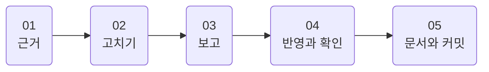
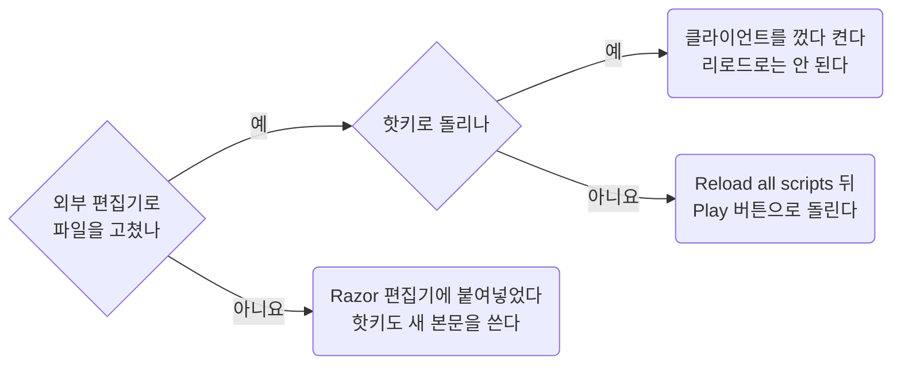

무엇을 근거로 삼는지, 스크립트를 어떤 순서로 고치는지, 고친 것을 게임에 어떻게 반영해 확인하는지 적은 문서다.
파일 이름과 스크립트 모양은 [Conventions](../scripting/conventions.md)에, 문법과 함정은 [Razor](../scripting/razor.md)에 있다.

## 00 한눈에

| 절 | 무엇을 답하나 |
| --- | --- |
| [01](#01) | 무엇을 근거로 삼나. 어느 사이트를 믿고, 숫자는 어떻게 인용하나 |
| [02](#02) | 스크립트를 어떤 순서로 고치나 |
| [03](#03) | 변경을 보고할 때 무엇을 넣나 |
| [04](#04) | 고친 것을 게임에 어떻게 반영하나. 리로드로 되는지 재시작해야 하는지, 캐시와 종료가 무엇을 덮어쓰나 |
| [05](#05) | 문서와 커밋은 어디의 규칙을 따르나 |

이 문서에 걸린 질문은 [Open items](../questions/open-items.md)에 모았다.

::part[근거]

## 01 근거

### 01.A 우선순위

규칙이 서로 다르면 앞의 것을 따른다.

1. 사용자 요청
2. [AGENTS.md](https://github.com/minu-ha/uoo/blob/master/AGENTS.md)와 `document/`의 규칙 문서
3. 같은 폴더의 기존 스크립트
4. 공식 위키

### 01.B 참고 사이트

| 용도 | 링크 |
| --- | --- |
| Outlands Razor 문법. 확장 명령까지 있고, 가장 먼저 본다 | [https://wiki.uooutlands.com/Razor_Scripting](https://wiki.uooutlands.com/Razor_Scripting) |
| 게임 메커니즘, 아이템, 몹 | [https://wiki.uooutlands.com/](https://wiki.uooutlands.com/) |
| Razor CE 기본 문법. Outlands Razor는 이것을 포크했다 | [https://www.razorce.com/guide/](https://www.razorce.com/guide/) |
| 공개 스크립트 모음. Jaseowns 스크립트도 여기 있다 | [https://outlands.uorazorscripts.com/](https://outlands.uorazorscripts.com/) |
| Storage Shelf 로드아웃 스크립트 생성기 | [https://www.outlandsbutler.com/](https://www.outlandsbutler.com/) |
| 공식 포럼 | [https://forums.uooutlands.com/](https://forums.uooutlands.com/) |

문법이 애매하면 추측하지 말고 위키를 읽는다. Outlands Razor에는 Razor CE에 없는 명령이 많다([Razor](../scripting/razor.md)).

### 01.C 숫자는 인용한다

공식, 쿨다운, 확률 같은 게임 숫자는 추측하지 않는다. 먼저 아래 문서에서 찾는다.

| 숫자 | 어디서 |
| --- | --- |
| 바드, 네크로, 소환수 | [Bard Necro](../templates/bard-necro.md) |
| PvP 규칙 | [PvP](../game/pvp.md) |
| 아이템 graphic id와 hue | [Item list](../game/item-list.md). 상점 가격은 `script/loot/stock-vendor.razor` 맨 위가 정본이다 |
| 주문 데미지 메모 | [Hotkeys](../game/hotkeys.md#06) 06절 |

문서에 없으면 위키를 읽고, 알게 된 것을 그 문서에 더한다. 더할 때는 이렇게 쓴다.

- 위키나 공식 패치노트의 문장은 원문 그대로 `>` 인용으로 적는다. 해석은 인용 아래에 따로 적는다.
- 인게임에서 확인한 것은 "인게임 확인됨 2026-09-28"처럼 날짜를 붙인다. 확인하지 못한 것은 "확인되지 않았다"로 남긴다.

::part[스크립트]

## 02 스크립트 고치기

1. **고칠 스크립트를 끝까지 읽는다.** 메인 루프 하나에 타이머, 타겟 캐시, 이어지는 시전이 얽혀 있다. 한 분기만 보고 고치면 다른 분기가 깨진다.
2. [Razor](../scripting/razor.md#03) 03절의 확인된 함정 표를 본다. 새 패턴이 필요하면 같은 문서 04절의 선례부터 찾는다.
3. 요청한 범위만 고친다. 저장소에 근거가 없는 패턴은 들이지 않는다.
4. 고친 뒤 `util/check.sh <파일>`을 돌린다. `if`와 `endif`, `while`과 `endwhile`, `for`와 `endfor`의 짝, 값을 넣지 않고 쓴 접두 변수를 잡는다.
5. 새 전투 루프를 만들면 [script/README.md](https://github.com/minu-ha/uoo/blob/master/script/README.md)의 전투 루프 표에 한 줄 더한다.

## 03 변경 보고

변경을 보고할 때 다음을 꼭 넣는다.

- 더하거나 바꾼 변수와 타이머
- 인게임 확인 방법. 어떤 상황에서 어떤 `overhead`가 떠야 하고, 어떤 상황이면 실패인지
- 반영 방법. 리로드로 되는지 재시작해야 하는지(04절), 그리고 게임을 끈 뒤 `git status`를 볼 것
- 답을 받지 못한 질문. 사용자가 나중에 볼 수 있게 [Open items](../questions/open-items.md)에도 더한다

## 04 게임에 반영하고 확인하기

### 04.A 스크립트 캐시와 리로드

Razor는 스크립트 본문을 메모리에 캐시한다. 고친 본문을 반영하는 방법은 어디서 고쳤는지, 어떻게 돌리는지에 따라 다르다.

- **핫키로 돌리면 클라이언트를 껐다 켠다. 리로드로는 절대 안 된다.** 리로드는 기존 객체를 바꾸지 않고 새 객체를 목록에 덧붙인다.
  프로필은 바인딩을 객체가 아니라 이름(`Play Script: hotkey\dress`)으로 저장한다. 그래서 키를 누르면 같은 이름 가운데 맨 앞의 옛 객체가 잡힌다.
- **Scripts 탭의 Play 버튼으로 돌리면 리로드로 충분하다.** Scripts 탭을 다시 열거나, 우클릭해서 Reload all scripts를 누른다. 되풀이해 시험할 때는 이 방법을 쓴다.
- **조립한 루프**(`script/combat/*`, `script/gather/*`)는 모듈과 레시피를 고치고 `pnpm build`로 다시 만든 뒤 위와 같이 반영한다.
  Razor 편집기에서 루프를 고치면 다음 조립이 덮어쓴다([Modules](../scripting/modules.md#07) 07절).
- **Razor 편집기에 직접 붙여넣으면** 기존 객체의 본문이 바뀌므로 핫키도 새 본문을 쓴다.
  다만 그 순간부터 Razor가 그 파일의 주인이 된다. 외부 편집기로 고치는 것과 섞지 않는다(04.B절).

리로드할 때마다 Hotkeys 목록에 `Play Script: ... (not assigned)`가 한 줄씩 쌓인다. 메모리에만 쌓이고 파일에는 남지 않는다.

**파일을 고쳤는데도 스크립트 오류가 같은 줄 번호를 계속 가리키면 캐시를 의심한다.** 줄을 지웠다면 그 아래 줄 번호도 함께 당겨져야 한다.
Reload all scripts로 풀리지 않으면 클라이언트를 완전히 껐다 켠다.

### 04.B 캐시가 파일을 되돌린다

- 캐시가 옛 본문을 든 채로 클라이언트를 끄면, Razor가 그 본문을 파일에 다시 쓴다. 외부 편집기로 고친 내용이 되돌아갈 수 있다.
  그래서 **게임을 끈 뒤 `git status`로 확인한다.**
- 리로드를 되풀이하면 옛 본문을 든 객체가 계속 쌓여서 이 위험도 함께 커진다. 이때도 재시작이 답이다.
- 외부 편집기로 스크립트를 고치는 프로필은 Razor 설정 `AutoSaveScript`를 꺼 둔다.

### 04.C config는 종료할 때 덮어쓴다

**`config/` 아래 파일은 게임을 끈 상태에서만 고친다.** 클라이언트가 종료할 때 설정 파일을 통째로 덮어쓰기 때문이다.
Razor 프로필 xml뿐 아니라 ClassicUO의 `cooldowns.xml`, `macros.xml`도 모두 그렇다.
게임을 켜 둔 채로 고치면 종료할 때 조용히 사라진다. 실제로 한 번 날아갔다.

::part[문서와 커밋]

## 05 문서와 커밋

- 문서를 쓰고 고치는 법, 글의 언어와 번역본은 [Writing](writing.md)에 있다.
- 커밋 규칙은 [AGENTS.md](https://github.com/minu-ha/uoo/blob/master/AGENTS.md)의 2절 커밋에만 있다. 제목의 좋은 예와 나쁜 예도 거기 있다.
