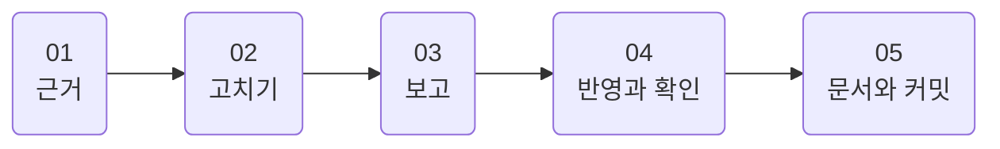
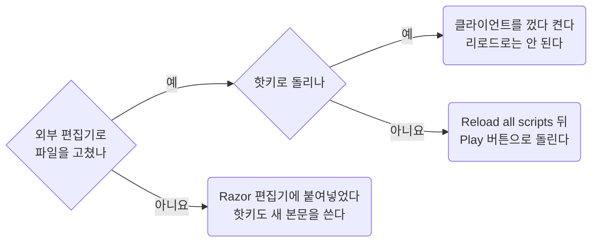

근거, 스크립트 수정 순서, 게임 반영과 확인.
파일 이름과 스크립트 모양은 [Conventions](../scripting/conventions.md), 문법과 함정은 [Razor](../scripting/razor.md).

## 00 한눈에

| 절 | 내용 |
| --- | --- |
| [01](#01) | 근거의 우선순위, 참고 사이트, 숫자 인용 |
| [02](#02) | 스크립트 수정 순서 |
| [03](#03) | 변경 보고에 넣을 것 |
| [04](#04) | 게임 반영. 리로드와 재시작, 캐시와 종료의 덮어쓰기 |
| [05](#05) | 문서와 커밋 규칙의 위치 |

이 문서에 걸린 질문은 [Open items](../questions/open-items.md).

::part[근거]

## 01 근거

### 01.A 우선순위

규칙이 다르면 앞의 것.

1. 사용자 요청
2. [AGENTS.md](https://github.com/minu-ha/uoo/blob/master/AGENTS.md)와 `document/`의 규칙 문서
3. 같은 폴더의 기존 스크립트
4. 공식 위키

### 01.B 참고 사이트

| 용도 | 링크 |
| --- | --- |
| Outlands Razor 문법. 확장 명령 포함, 가장 먼저 | [https://wiki.uooutlands.com/Razor_Scripting](https://wiki.uooutlands.com/Razor_Scripting) |
| 게임 메커니즘, 아이템, 몹 | [https://wiki.uooutlands.com/](https://wiki.uooutlands.com/) |
| Razor CE 기본 문법. Outlands Razor의 포크 원본 | [https://www.razorce.com/guide/](https://www.razorce.com/guide/) |
| 공개 스크립트 모음. Jaseowns 스크립트 포함 | [https://outlands.uorazorscripts.com/](https://outlands.uorazorscripts.com/) |
| Storage Shelf 로드아웃 스크립트 생성기 | [https://www.outlandsbutler.com/](https://www.outlandsbutler.com/) |
| 공식 포럼 | [https://forums.uooutlands.com/](https://forums.uooutlands.com/) |

문법이 애매하면 추측 대신 위키. Outlands Razor에는 Razor CE에 없는 명령이 많음([Razor](../scripting/razor.md)).

### 01.C 숫자는 인용

공식, 쿨다운, 확률 같은 게임 숫자는 추측 금지. 먼저 아래 문서에서 찾음.

| 숫자 | 위치 |
| --- | --- |
| 바드, 네크로, 소환수 | [Bard Necro](../templates/bard-necro.md) |
| PvP 규칙 | [PvP](../game/pvp.md) |
| 아이템 graphic id, hue | [Item list](../game/item-list.md). 상점 가격은 `script/loot/stock-vendor.razor` 맨 위가 정본 |
| 주문 데미지 메모 | [Hotkeys](../game/hotkeys.md#06) 06절 |

문서에 없으면 위키를 읽고 해당 문서에 추가.

- 위키, 패치노트 문장: 원문 그대로 `>` 인용. 해석은 인용 아래 따로
- 인게임 확인: "인게임 확인됨 2026-09-28"처럼 날짜. 미확인: "확인되지 않았다"

::part[스크립트]

## 02 스크립트 고치기

1. **대상 스크립트를 끝까지 읽음.** 메인 루프 하나에 타이머, 타겟 캐시, 후속 시전이 얽힘 → 한 분기만 고치면 다른 분기가 깨짐
2. [Razor](../scripting/razor.md#03) 03절 확인된 함정 표. 새 패턴은 같은 문서 04절 선례부터
3. 요청 범위만. 저장소에 근거 없는 패턴 금지
4. `util/check.sh <파일>`: `if`와 `endif`, `while`과 `endwhile`, `for`와 `endfor` 짝, 값 없이 쓴 접두 변수 검사
5. 새 전투 루프는 [script/README.md](https://github.com/minu-ha/uoo/blob/master/script/README.md) 전투 루프 표에 추가

## 03 변경 보고

보고에 꼭 넣을 것.

- 추가하거나 바꾼 변수와 타이머
- 인게임 확인 방법. 어떤 상황에서 어떤 `overhead`가 떠야 하고, 어떤 경우가 실패인지
- 반영 방법. 리로드 또는 재시작(04절), 게임 종료 뒤 `git status`
- 답 못 받은 질문. [Open items](../questions/open-items.md)에도 추가

## 04 게임에 반영하고 확인하기

### 04.A 스크립트 캐시와 리로드

Razor는 스크립트 본문을 메모리에 캐시. 반영 방법은 수정 위치와 실행 방법에 따라 다름.

- **핫키 실행 → 클라이언트 재시작. 리로드로는 반영 불가.** 리로드는 기존 객체를 바꾸지 않고 새 객체를 목록에 덧붙임.
  프로필의 바인딩은 객체가 아닌 이름(`Play Script: hotkey\dress`) → 키를 누르면 같은 이름 중 맨 앞의 옛 객체 실행
- **Scripts 탭 Play 버튼 실행 → 리로드로 충분.** Scripts 탭을 다시 열거나 우클릭 → Reload all scripts. 반복 시험은 이쪽
- **조립한 루프**(`script/combat/*`, `script/gather/*`): 모듈과 레시피 수정 → `pnpm build` → 위와 같이 반영.
  Razor 편집기에서 고치면 다음 조립이 덮어씀([Modules](../scripting/modules.md#07) 07절)
- **Razor 편집기에 붙여넣기 → 기존 객체 본문 교체, 핫키도 새 본문.** 단, 그때부터 Razor가 파일의 주인. 외부 편집기 수정과 섞지 않음(04.B절)

리로드마다 Hotkeys 목록에 `Play Script: ... (not assigned)` 한 줄씩 추가. 메모리에만, 파일에는 안 남음.

**파일을 고쳤는데 오류가 같은 줄 번호를 계속 가리키면 캐시 의심.** 줄을 지웠다면 아래 줄 번호도 당겨져야 정상.
Reload all scripts로 안 풀리면 클라이언트 완전 재시작.

### 04.B 캐시가 파일을 되돌림

- 캐시에 옛 본문이 남은 채 종료 → Razor가 그 본문을 파일에 다시 씀. 외부 편집기 수정이 되돌아갈 수 있음 → **종료 뒤 `git status` 확인**
- 리로드 반복 → 옛 본문 객체가 쌓여 위험도 커짐. 해결은 재시작
- 외부 편집기로 스크립트를 고치는 프로필은 Razor 설정 `AutoSaveScript` 끔

### 04.C config는 종료 시 덮어씀

**`config/`는 게임 종료 상태에서만 수정.** 종료 시 클라이언트가 설정 파일을 통째로 덮어씀.
Razor 프로필 xml, ClassicUO의 `cooldowns.xml`, `macros.xml` 모두 해당. 켜 둔 채 고치면 종료 때 조용히 사라짐(실제로 한 번 날아감).

::part[문서와 커밋]

## 05 문서와 커밋

- 문서 쓰는 법, 글의 언어와 번역본: [Writing](writing.md)
- 커밋 규칙, 제목의 좋은 예와 나쁜 예: [AGENTS.md](https://github.com/minu-ha/uoo/blob/master/AGENTS.md) 2절에만
