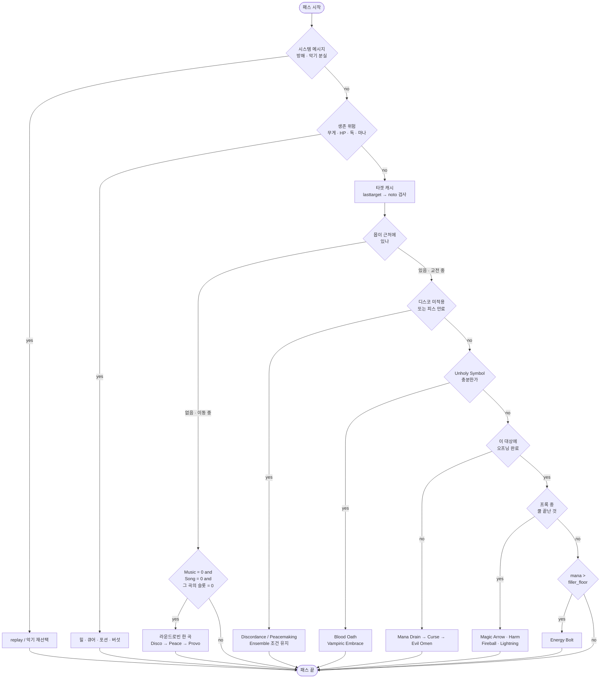

# Bard Necro Enhanced 전투 루프 설계

대상 파일: **`script/combat/bard-necro-enhanced.razor` (신규)**

구식 `bard-necro.razor` / `bard-necro-eval.razor` 를 대체한다. 기존 파일을 고치는 것이 아니라
**새로 구현한다.** 컨벤션은 `bard-throwing.razor` 와 `loadout.razor` 를 따른다
(`config__` / `wait__` / `cooldown__` / `var__` / `alias__` / `label__` / `timer__` / `global__`).

바드 숫자와 공식은 전부 **`bard-mechanics.md`** 에 있다. 이 문서에서 다시 추론하지 않는다.

## 루프 한 장

한 패스에 **한 동작만** 한다. 위에서부터 조건이 맞는 첫 블록이 실행되고 나머지는 다음 패스로 넘어간다.
모든 블록이 같은 가드를 단다 -- **가드를 빠뜨린 블록은 항상 이긴다.**

```
if not targetexists and not casting and not warmode
```



### 단계별 게이트

| # | 블록 | 게이트 | 비고 |
|---|---|---|---|
| 0 | 시스템 메시지 | `insysmsg` | 방해 -> `replay`, 악기 분실 -> 재선택 |
| 1 | 생존 | 무게 / HP / 독 / 마나 | **아래 전부를 막는다** |
| 2 | 타겟 캐시 | `lasttarget` + `noto` | `var__combat_target` 갱신 |
| 3 | Barding Song | `Music=0 and Song=0 and <슬롯>=0` | **몹이 없을 때만.** 라운드로빈 |
| 4 | 바드 스킬 | `Music=0 and <슬롯>=0` | 디스코 1회 + **피스 12초마다** |
| 5 | 네크로 | Unholy Symbol | Blood Oath 4, Vampiric Embrace 3 |
| 6 | 오프닝 | 마나 + 대상별 리스트 | Mana Drain -> Curse -> Evil Omen |
| 7 | 프록 코어 | `cooldown "MagicArrow"` 등 | 네 개가 각자 쿨 |
| 8 | 필러 | `mana > config__filler_floor` | Energy Bolt. **여기부터 잘린다** |

### 데미지 사이클이 도는 모양

프록 네 개는 각자 쿨을 돌고, **비는 시간은 전부 Energy Bolt 가 채운다.**

```
0.0   Magic Arrow   1서클  0.50 + 0.2
0.7   Harm          2서클  0.75 + 0.2
1.7   Fireball      3서클  1.00 + 0.2
2.9   Lightning     4서클  1.25 + 0.2
4.3   ────── 프록 네 개 소진, 쿨 대기 ──────
4.3   Energy Bolt   6서클  1.75 + 0.2   실질 5마나
6.3   Energy Bolt
8.2   Energy Bolt
10.2  Energy Bolt
12.1  Energy Bolt
14.1  ────── 프록이 돌아오면 다시 위로 ──────
```

**15초당 시전 4회 -> 9회.** 프록이 쿨에서 돌아오는 순간 사다리 7번이 8번을 앞지르므로,
별도 상태값 없이 자연스럽게 사이클이 돈다.

**마나가 모자라면 8번부터 잘린다.** `config__filler_floor` 를 52 이상(오프닝 22 + 코어 30)으로
두어 필러가 다음 몹의 오프닝 마나를 먹지 않게 한다.


## 캐릭터 전제

| 스킬 | 값 |
|---|---|
| Discordance / Peacemaking / Provocation | 80 / 80 / 80 |
| Musicianship | 0 (Bard Codex `Self Taught` T2 로 대체) |
| Spirit Speak | 120 |
| Herding | 80 |
| Necromancy | 100 |
| Magery | 100 |
| Eval Int | 80 |

- **Effective Barding = 170** (송 메시지 `8.5%` 로 실측).
- **Meditation 없음.** 마나 회복은 환급 스택 + 이동 중 자연회복 + 버섯이다.
- **Inscription 없음.** `Bless` / `Protection` 지속 연장이 0 이고 `Reactive Armor` 는 무효.
- 장비: Avarhide 스펠북 (double mana regen 60%), Eldritch Aspect 8단계
  (mana refund 26%, special chance 7.2%).
- 소환수 딜 비중 **63.4%** (실측). 본체는 37%.

## 전투 사이클

```
한 마리 교전  ->  10~20초 이동  ->  다음 한 마리
```

**이동 구간이 전체의 약 4분의 1이다.** 마나가 회복되고 버섯 60초 쿨이 도는 시간이다.
반대로 2분짜리 버프는 이 구간에서 낭비된다. 그래서 **2분 버프는 몹이 근처에 있을 때만 건다.**

## 자원

| 자원 | 쓰는 곳 | 성격 |
|---|---|---|
| `cooldown "Music"` | 바드 **스킬** 사용 | 글로벌 5초. **Song 은 이것을 세우지 않는다** |
| `cooldown "Discord"` | Disco | 단독 슬롯 5초 |
| `cooldown "Peace/Provo"` | Peace 와 Provo | **공유 슬롯 10초.** 합친 항목 하나 |
| **Barding Song 쿨** | 3곡 전체 | **별도 계열. `cooldown "Music"` 이 아니다.** 세 곡이 공유 |
| Unholy Symbol | Blood Oath(4), Vampiric Embrace(3), Evil Omen | 5초당 1개 |
| 마나 | 버프 + 오프닝 + 스팸 + 필러 | 메디가 없어 가장 빡빡하다 |

**자원이 독립이어도 행동 슬롯은 하나다.** 교전 중 블록의 전체 가드는 이렇다.

```
if not targetexists and not casting and not warmode and find var__combat_target ground -1 -1 12 as alias__target
```

### 바드 쿨 모델 (확정)

**Song 은 스킬을 백팩에 타겟한 것이다.** 별도 명령이 아니다.

```
useskill 'Peacemaking'
waitfortarget wait__target
target backpack        <- Song (AoE, 15분)
target lasttarget      <- Skill (단일 대상)
target ground          <- 짧은 광역
```

```
Song    요구:  Music = 0   AND   Song = 0   AND   <그 곡의 슬롯> = 0
        설정:  Song 11초만.   Music 도 슬롯도 세우지 않는다

Skill   요구:  Music = 0   AND   <그 스킬의 슬롯> = 0
        설정:  Music 5초   +   <그 스킬의 슬롯>

슬롯:   cooldown "Discord"       5초   단독
        cooldown "Peace/Provo"   10초  Peace 와 Provo 가 공유
```

**읽는 조건은 거의 같고, 다른 것은 무엇을 세우느냐뿐이다.**
한 줄로 줄이면 **"송은 스킬을 빌려 쓰되 소모하지 않는다."**
차단 메시지 세 종류와 실측 로그는 `bard-mechanics.md` 참조.

**Peace 와 Provo 는 서버에서 슬롯을 공유한다.**
`cooldowns.xml` 에서 **`Peace/Provo` 한 항목으로 합쳤다.**

**차단된 시도도 `Music` 을 태운다.** 송 쿨에 막힌 시전이 스킬 쿨을 소비하므로,
실패한 송 뒤에 스킬을 바로 밀어넣으면 그 스킬도 막힌다.

#### 루프 규칙 하나

**송은 전투 중에 부르지 않는다. 이동 중에만 부른다.**

전투 중에는 디스코와 피스가 `Music` 을 5초씩 계속 세워서 송이 거의 안 나간다.
게다가 악기 연주는 시전을 끊어서 프록 주문을 날려먹는다.
반대로 이동 구간(10~20초)에는 `Music` 이 비어 있고 어차피 아무것도 안 하고 있다.

```
not targetexists and not casting and 근처에 몹 없음  ->  송 한 곡
```

#### `cooldowns.xml` 은 이미 정리했다

`config/indian/classicuo/Qianshanmuxue/cooldowns.xml` 을 다섯 군데 고쳤다.
내역과 이유는 `bard-mechanics.md` 의 "이 저장소의 `cooldowns.xml` 최종 형태" 에 있다.

따라서 스크립트는 게임 값을 그대로 읽으면 된다. **자체 타이머가 하나도 필요 없다.**

```
Disco 송    cooldown "Music" = 0 and cooldown "Song" = 0 and cooldown "Discord" = 0
Peace 송    cooldown "Music" = 0 and cooldown "Song" = 0 and cooldown "Peace/Provo" = 0
Disco 스킬  cooldown "Music" = 0 and cooldown "Discord" = 0
Peace 스킬  cooldown "Music" = 0 and cooldown "Peace/Provo" = 0
프록 스펠   cooldown "MagicArrow" / "Harm" / "Fireball" / "Lightning" = 0
필러        mana > config__filler_floor
```

**바드 외 스킬을 루프에 넣게 되면 `Music` 대신 `Skill` 을 봐야 한다.**
서버 스킬 게이트가 하나라 Animal Lore 같은 것도 같은 타이머를 쓴다.

Lyric Aspect 방어구의 리셋 프록이 `Music` / 스킬 슬롯 / `Song` 을 전부 0으로 만드는데,
게임 값을 직접 읽으므로 그 이득이 자동으로 따라온다.


### Song 버프 감지

```
findbuff "song of discordance"
findbuff "song of provocation"
findbuff "song of peacemaking"
```

15분 만료를 직접 세지 않는다. 저장소 기존 구현(`bard-mace.razor:494`)이 이 방식이다.

## 마나 예산

| 주문 | 서클 | 마나 |
|---|---|---|
| Magic Arrow | 1 | 4 |
| Harm | 2 | 6 |
| Fireball | 3 | 9 |
| Lightning | 4 | 11 |
| Curse | 4 | 11 |
| Mana Drain | 4 | 11 |
| **Energy Bolt** | 6 | 20, **T3 가 15 를 돌려줘 실질 5** |
| Create Food | 1 | 4 |

**15초 창을 시전 시간으로 정확히 나눈다** (시전 + 회복 0.2초):

```
Magic Arrow   1서클  0.50 + 0.2 = 0.70
Harm          2서클  0.75 + 0.2 = 0.95
Fireball      3서클  1.00 + 0.2 = 1.20
Lightning     4서클  1.25 + 0.2 = 1.45
                              ------
                프록 코어 합    4.30초

15 - 4.30 = 10.70초가 비어 있었다

Energy Bolt   6서클  1.75 + 0.2 = 1.95
10.70 / 1.95 = 5.4  ->  필러 5방
```

**15초당 시전 4회 -> 9회. 2.25배다.** 이것이 `Bless` 를 버리고 `Energy Bolt` 를 넣은 근거다.

```
오프닝 (몹 1마리당)   Mana Drain 11 + Curse 11          =  22
프록 코어 (15초)      4 + 6 + 9 + 11                    =  30
필러 (15초)           Energy Bolt x5, 실질 5씩           =  25
                                                       -----
                                          15초당          55

1분 교전
  코어 120 + 오프닝 22 = 142         환급 56% 적용 -> 62
  필러 20방 x 실질 5                                  -> 100
                                                       ----
                                      실질 약 163/분 = 2.7 마나/초
```

**이동 10~20초 구간은 소모 0** 이고 거기에 Avarhide double mana regen 60%,
`Create Food` 버섯 분당 25 가 얹힌다. 그래도 **메디 없이 2.7/초는 버겁다.**

> **미확인**: `Energy Bolt` 의 "recovers 15 mana" 와 환급 확률이 **중첩되는지.**
> 중첩되면 필러가 거의 공짜가 되고, 아니면 위 계산이 맞다. 위 표는 중첩 안 되는 보수적 가정이다.

여기에 **이동 10~20초 동안 소모 0** 과 Avarhide double mana regen 60%,
`Create Food` 버섯 분당 25 가 얹힌다.

> **미확인 두 가지**
> 1. Eldritch 환급과 Grimoire 환급이 합산인지 각각 굴리는지. 각각이면 실효 `48%`.
> 2. `Energy Bolt` 의 "recovers 15 mana" 가 시전마다 확정인지, 환급 확률과 별개인지.
>    확정이고 별개라면 실질 비용이 5보다 더 낮다.

**프록 쿨다운이 더 이상 마나 조절기가 아니다.** 빈 10.7초가 사라졌으니
이제 마나가 실제 상한이다. **필러 5방은 이론치고, 실제로는 마나가 허락하는 만큼만 나간다.**

```
프록 4종      마나가 남는 한 항상.  창당 30마나
Energy Bolt   mana > config__filler_floor 일 때만       <- 여기서 먼저 잘린다
```

`config__filler_floor` 를 오프닝 22 + 프록 코어 30 = **52 이상**으로 둔다.
그래야 필러가 마나를 다 먹어서 다음 몹의 오프닝을 못 거는 일이 없다.

## Wizard's Grimoire 40점

```
Magic Arrow    5    15초마다 첫 시전 +250%
Harm           5    15초마다 첫 시전 +250%
Fireball       5    15초마다 첫 시전 +250% DoT
Lightning      5    15초마다 첫 시전 +200% + 힌더 2.5초
Curse          5    대상에게 60초간 내 모든 주문 +30%
Mana Drain     5    대상에게 60초간 적대주문 환급 +30%
Create Food    5    버섯 25마나 / 60초
Energy Bolt    5    +30% 데미지, 15마나 회수 -> 실질 5마나 필러
              ----
               40
```

### Bless 를 빼고 Energy Bolt 를 넣은 것이 맞다

| | Bless 3 | Energy Bolt 5 |
|---|---|---|
| 얻는 것 | 팔로워 근접뎀/주문뎀/공속 각 **5%** | 6서클 주문 **+30%**, 실질 5마나 |
| 전체 딜 기여 | 주문뎀 5% x 소환수 63% = **약 +3.2%** | 15초 창마다 시전 횟수가 **약 2배** |
| 비용 | 9마나 / 2분 + 행동 슬롯 1 | 빈 시간을 메운다. 추가 행동 슬롯 없음 |

**프록 4종은 15초 창에 약 6초만 쓴다.** 남는 9초가 그냥 버려지고 있었다.
`Energy Bolt` 가 그 9초를 6서클 주문으로 채우면서 **실질 마나가 5** 라는 것이
`Bless` 의 `+3.2%` 와 비교가 안 된다.

`Magic Reflect` / `Protection` / `Greater Heal` / `Cure` 를 전부 0으로 둔 것도 맞다.
기본 주문은 포인트 없이도 시전되고, 큐어는 쿨 없는 포션이 우선이다.

## Bard Codex 20점 -- 지금 배분이 맞다

```
Self Taught     3    Musicianship 80 대체.  T3(120점)는 낭비 -- printed 가 80뿐
Perfect Pitch   5    성공률 56.1% -> 72.9%
Refrain         5    Barding Break 20% 무시
Ensemble        3    +24%
Reverb          3    +12%
Virtuoso        1    +4%
               ----
                20
```

**이전 판의 `Refrain 5 -> 1` 권고는 철회한다.** 근거가 틀렸다.

`Ensemble` 의 실제 조건은 **`Discord AND (Peace OR Provo)`** 다. 디스코 하나로는 안 켜진다.
Discordance 자체는 브레이크에 안 끊기지만 **Peace / Provo 는 끊긴다.**
따라서 `Refrain` 은 Peace 를 지키는 동시에 **`Ensemble` 가동률을 지킨다.**

### Ensemble 3 -> 5 로 올릴 가치는 거의 없다

난이도 400, Lyric 방어구 무시 42.5% + `Refrain` T3 20% 로 계산하면 Peace 가동률은 약 **62%** 다.

| 2점 이동 | 효과 |
|---|---|
| `Ensemble 3 -> 5` | `+24% -> +40%`, 가동률 62% -> 실효 **+9.9** |
| `Reverb 3 -> 1` | `+12% -> +4%`, 가동률 거의 100% -> 실효 **-8.0** |
| 합 | **+1.9** 본체 데미지 = 전체 약 **+0.7%** |

**움직일 값이 아니다.** 지금 배분을 유지한다.

### 진짜 문제는 배분이 아니라 Peace 가동률이다

`Ensemble` 3점이 값을 하려면 **Peace 가 계속 걸려 있어야 한다.**
난이도 300+ 에서 Peace 지속은 최소값 `15 x 0.8 = 12초` 이고 자기 쿨은 10초다.
**즉 12초마다 다시 걸면 끊김 없이 유지된다.** 이것이 루프에 반드시 들어가야 한다.

Peace 를 가끔 쓰는 제어 수단으로만 다루면 `Ensemble` + `Virtuoso` 4점이 대부분 놀게 된다.

**브레이크가 걸린 대상에게는 Peace 도 Provo 도 못 건다** (인게임 확인됨).
한쪽으로 다른 쪽을 대신할 수 없으므로, 브레이크가 뜨면 난이도 400 기준
**40초 동안 `Ensemble` 과 `Virtuoso` 가 통째로 꺼진다.** `Refrain` 이 막아주는 것이 바로 이 40초다.

## 오프닝은 대상마다 다시 건다

> Curse T3: "Spells cast by caster **against target** have their damage increased by 30%"
> Mana Drain T3: "Increases mana refund chance by 30% for caster's hostile spells **cast against target**"

**둘 다 대상에 걸리는 디버프다.** 몹을 바꾸면 따라오지 않는다. Discordance / Peace 도 마찬가지다.

### 지속시간이 어긋난다

```
베이스 디버프   2분    Curse -5%,  Mana Drain -20 Magic Resist
그리모어 라이더  60초   +30% 데미지,  +30% 환급
```

**디버프 아이콘이 남아 있어도 +30% 두 개는 이미 꺼져 있다.** `getlabel` 로 판정할 수 없다.

### 리스트 두 개로 상태를 표현한다

```
list 'magic_drained_targets'    Mana Drain 완료 serial
list 'magic_cursed_targets'     Curse 완료 serial
timer__magic_window             마지막 sweep 이후 경과

if timer "timer__magic_window" >= cooldown__magic_window        60000
	clearlist 'magic_drained_targets'
	clearlist 'magic_cursed_targets'
	settimer "timer__magic_window" 0
endif

not inlist drained                  -> Mana Drain
inlist drained, not inlist cursed   -> Curse
inlist cursed                       -> Evil Omen -> 프록 코어
```

분기 자체가 상태라 `var_magic_stage` 같은 단계 변수가 필요 없다.

**트레이드오프**: sweep 이 전역이라 방금 건 대상까지 지운다. 동시 교전 1~2마리면 가끔 22마나 손해다.
**대상별 타임스탬프는 산술이 필요해서 못 쓴다.**

**막힘 방지**: `timer__opener_attempt` 를 두고 일정 시간 안에 못 걸면 리스트에 강제로 넣고 넘어간다.

### 구식 스크립트의 버그 (반복하지 말 것)

`bard-necro-eval.razor:379` 의 `clearlist` 는 **전투 대상이 사라지고 조용해졌을 때만** 돌았다.
한 마리와 60초 넘게 싸우면 Curse 의 `+30%` 가 꺼졌는데도 리스트가 "걸려 있음" 이라고 답해서
**영영 재시전하지 않았다.**

## 꼬이는 지점

| 조합 | 꼬이나 | 이유 |
|---|---|---|
| 디스코 x Curse x Mana Drain | 안 꼬임 | 효과가 전부 다르고 중첩된다 |
| 디스코 x Barding Break | 안 꼬임 | **디스코는 브레이크로 안 끊긴다** |
| **Peace x Barding Break** | **꼬임** | 끊기면 `Ensemble` 조건이 같이 꺼진다. `Refrain` 이 이걸 막는다 |
| 피스 x 공격 | 안 꼬임 | **피스는 데미지로 안 풀린다.** 걸어두고 때려도 된다 |
| **Song x Song** | **꼬임** | **세 곡이 쿨 하나를 공유한다.** 3곡 연창은 곡당 11초씩 걸린다 |
| **Skill -> Song** | **꼬임** | 스킬이 `Music` 5초를 세워 송을 밀어낸다. 송이 급하면 스킬을 참는다 |
| Song -> Skill | 안 꼬임 | 송은 `Music` 도 스킬 슬롯도 안 세운다. 1.5초 뒤 디스코가 나간다 |
| `clearsysmsg` x `insysmsg` | 위험 | 한 패스 안에서 시전->판정을 끝낸다 |
| 송 x 시전 | **꼬임** | 악기 연주가 시전을 끊는다. `not casting` 필수. 그래서 전투 중엔 안 부른다 |
| **Peace 스킬 x Peace/Provo 송** | **꼬임** | 슬롯 공유. 전투 직후 10초간 두 곡이 막힌다 |
| Peace x Provo | **꼬임** | 서버가 슬롯을 공유한다. 둘 다 쓰려면 10초씩 번갈아야 한다 |

## 설계 결정

**재소환 감지를 하지 않는다. 이동 중에 계속 갱신한다.**

송 쿨이 약 11초뿐이고 전투 사이클마다 이동이 10~20초 있으므로,
이동할 때마다 라운드로빈으로 한 곡씩 부르면 **세 곡이 늘 최근 상태로 유지된다.**
소환수를 언제 다시 뽑든 다음 이동 구간에서 자동으로 버프를 받는다.

이 결정 하나로 아래가 전부 사라진다.

| 없앤 것 | 이유 |
|---|---|
| `list 'sung_followers'` serial 명부 | 추적할 필요가 없다 |
| `findtype` 소환수 훑기 + `noto` 필터 | 적 Lich 오인 문제 자체가 사라진다 |
| `var__resing` 플래그와 우선순위 예외 | 송이 상시 갱신이라 "급한 재시전" 이 없다 |
| 전투 중 3곡 몰아부르기 (약 22초) | 전투 중에는 아예 안 부른다 |

**대가**: 소환수가 전투 중에 죽고 다시 뽑히면 **그 전투가 끝날 때까지는 송 버프가 없다.**
세 곡 각 8.5% 이므로 한 판의 일부 구간에서 그만큼 손해다.
위의 복잡도 전부와 바꿀 만하다.

**라운드로빈은 산술 없이 리터럴 상태값으로 돈다.**

```
if var__song_next = 1
	useskill 'Discordance'
	@setvar! var__song_next 2
elseif var__song_next = 2
	useskill 'Peacemaking'
	@setvar! var__song_next 3
else
	useskill 'Provocation'
	@setvar! var__song_next 1
endif
```

`findbuff "song of ..."` 로 게이트하지 않는다. 15분 버프라 늘 참이어서 갱신이 영영 안 돈다.
**`cooldown "Song" = 0` 을 보고 다음 곡을 부른다.**

다만 **곡마다 자기 슬롯을 함께 봐야 한다.** 전투가 막 끝났으면 Peace 슬롯이 10초 남아 있어서
Peace 송과 Provo 송이 둘 다 막힌다. 그때는 그 패스를 거르고 다음 패스에 다시 온다.

```
if cooldown "Music" = 0 and cooldown "Song" = 0
	if var__song_next = 1 and cooldown "Discord" = 0
		... Disco 송 ...   @setvar! var__song_next 2
	elseif var__song_next = 2 and cooldown "Peace/Provo" = 0
		... Peace 송 ...   @setvar! var__song_next 3
	elseif var__song_next = 3 and cooldown "Peace/Provo" = 0
		... Provo 송 ...   @setvar! var__song_next 1
	endif
endif
```

이동 구간이 10~20초라 슬롯은 대개 그 안에 풀린다. 못 부른 곡은 다음 이동 때 잡힌다.

**재소환해도 Bless 는 다시 안 건다.** 애초에 Grimoire 에서 뺐다.

## 쓸 수 있는 구문 (전부 저장소에 선례 있음)

| 구문 | 선례 |
|---|---|
| `not inlist '이름' alias` | `bard-necro.razor:787` |
| `createlist` / `removelist` / `clearlist` / `pushlist` | 여러 파일 |
| `while findtype ... ground -1 -1 12 as` + `@ignore` | `bard-necro.razor:432` |
| `not dead X and noto X != "hostile" ...` | `bard-necro.razor:433` |
| `findbuff "song of discordance"` | `bard-mace.razor:494` |
| `useskill` -> `waitfortarget` -> `target backpack` | `bard-mace.razor:518` |
| `stop` | `bard-archer-no-potion.razor:58` |
| `cooldown "MagicArrow" = 0` | `cooldowns.xml` 에 항목 존재 |

## 쓰면 안 되는 구문 (선례 없음, 실제로 깨졌던 것들)

- 산술 `@setvar! var__n var__n + 1`
- `while <스크립트 변수> <`
- `menu <serial> <변수>` -- 인덱스는 반드시 리터럴
- 조건 안의 괄호
- 주석 안의 세미콜론
- 미선언 변수 (`check.sh` 가 못 잡는다)

## 인게임에서 확인할 것

확인 끝난 것:

- **Effective Barding = 170** (송 메시지 8.5% 실측)
- **Discordance 는 barding break 로 안 끊긴다**
- **Peacemaking 은 데미지로 안 풀린다.** 브레이크로만 풀린다
- **Peace 와 Provo 는 쿨을 공유하지 않는다**
- **Song = 스킬을 백팩에 타겟.** Music 을 안 세우지만 자기 스킬 슬롯은 쓴다
- **Ensemble 조건은 `Discord AND (Peace OR Provo)`**
- **"Your barding skill cooldowns reset." 프록이 존재한다**

추가로 확인된 것:

- **리셋 프록의 출처는 Lyric Aspect 방어구다.** 쿨 측정할 때는 벗는다
- **브레이크 대상에는 Peace / Provo 둘 다 못 건다**
- **시전 시간은 서클별 고정** (1서클 0.50 ~ 8서클 2.50, 회복 0.2초)
- **Song 쿨은 세 곡이 공유하는 별도 계열이다.** `cooldown "Music"` 이 아니다

**코드 작성 전에 먼저 할 일**

1. **`cooldowns.xml` 의 `Music` 항목을 고친다** (게임 끄고).
   송 트리거를 빼고 `Song` 항목을 신설한다. 이걸 안 하면 게이트가 애초에 틀린 값을 읽는다.
2. **`Fireball` 항목에 발동 트리거를 넣는다.** 지금은 "다시 준비됨" 메시지만 있어서
   바가 채워지지 않는다. 인게임에서 Fireball 프록이 터질 때 나오는 문구를 받아 적는다.

**남은 측정**

3. **Song 이 바드 스킬 슬롯까지 잠그는가.**
   `script/hotkey/probe-bard-cooldown.razor` 를 **Lyric 방어구 벗고** 한 번 돌린다.
   실행 중 수동 조작을 하지 않는다 -- 지난 로그가 그것 때문에 오염됐다.
4. **Song 쿨의 정확한 길이.** 위 probe 4단계(약 11초 후 시도)가 답한다.
5. **`Energy Bolt` 의 15마나 회수가 환급 확률과 중첩되는지.**
   마나 예산이 2.7/초냐 그보다 훨씬 낮냐가 여기서 갈린다.
6. **`Ensemble` / `Reverb` / `Virtuoso` 가 정말 본체 전용인가.**
   포인트 변경 전후로 데미지 트래커의 **소환수 딜 절대값**을 비교한다.

## 참고 링크

- [Magery](https://wiki.uooutlands.com/Magery)
- [Wizard's Grimoire](https://wiki.uooutlands.com/Wizard%27s_Grimoire)
- [Bard Codex](https://wiki.uooutlands.com/Bard_Codex)
