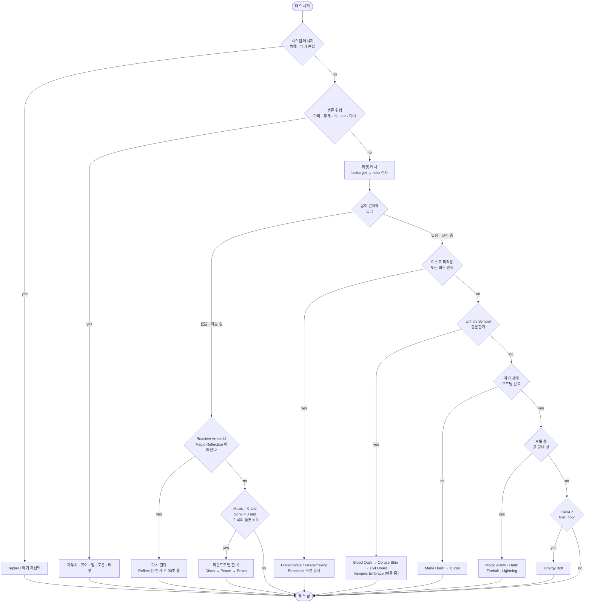

# Bard Necro 핸드북

- 캐릭터: `nomeehej` (Razor 프로필 `bard mace`)
- 스크립트: `script/combat/bard-necro-enhanced.razor` (F1, 사냥), `script/combat/bard-necro-pvp.razor` (F4, PK)
- 2026-09-28 에 `bard-mechanics.md` · `bard-necro-combat-design.md` · `bard-necro-summon-guide.md` 세 문서를 하나로 묶었다. 이력은 git.

> **추측 금지 문서.** 바드·네크로·PvP 숫자가 필요하면 여기서 인용한다. 여기 없으면 위키를 읽고 여기에 추가한다.
> 인용문은 위키 또는 공식 패치노트 원문이고, 해석은 인용문 아래에 따로 적는다.
> 인게임에서 확인된 것은 그렇게 적었고, 확인되지 않은 것은 "확인되지 않았다" 로 남겼다.
> Razor 구문의 함정은 `AGENTS.md` 의 "확인된 함정" 표가 정본이고, 7절은 그 근거다.

---

## 개요

| 절 | 무엇을 답하나 |
|---|---|
| 1 | 이 캐릭터가 무엇이고 무엇을 쟀는가 |
| 2 | 바드 스킬·송·쿨다운·코덱스가 어떻게 도는가. 루프 게이트의 근거 |
| 3 | Magery 프록, 네크로 소환과 심볼, Grimoire·Codex 포인트 |
| 4 | 무엇을 소환하고 Tome 을 어디에 넣는가. 소환수 이름 붙이기 |
| 5 | `bard-necro-enhanced` 와 `bard-necro-pvp` 가 왜 이 모양인가. 마나 예산, 명령문 비용 |
| 6 | PK 를 만났을 때의 규칙과 숫자 |
| 7 | 되는 구문과 깨졌던 구문의 근거 |
| 8 | 인게임에서 확인한 것과 남은 것 |
| 9 | 틀렸던 생각의 목록 |
| 10 | 출처 |

---

## 목차

1. [캐릭터](#1-캐릭터)
    - 1.1 [전제 스킬과 장비](#11-전제-스킬과-장비)
    - 1.2 [측정 결과](#12-측정-결과)
    - 1.3 [전투 사이클](#13-전투-사이클)
    - 1.4 [확정 수치 (Effective Barding 170)](#14-확정-수치-effective-barding-170)
2. [바드 메커니즘](#2-바드-메커니즘)
    - 2.1 [스킬 사용 쿨다운](#21-스킬-사용-쿨다운)
    - 2.2 [Song 은 스킬을 백팩에 쓴 것이다](#22-song-은-스킬을-백팩에-쓴-것이다)
    - 2.3 [세 가지 쿨다운 계열](#23-세-가지-쿨다운-계열)
    - 2.4 [`cooldown "..."` 은 서버 값이 아니다](#24-cooldown-은-서버-값이-아니다)
    - 2.5 [쿨다운 모델 (확정)](#25-쿨다운-모델-확정)
    - 2.6 [Peace 와 Provo 는 슬롯을 공유한다](#26-peace-와-provo-는-슬롯을-공유한다)
    - 2.7 ["Your barding skill cooldowns reset."](#27-your-barding-skill-cooldowns-reset)
    - 2.8 [Song 버프 감지](#28-song-버프-감지)
    - 2.9 [이 저장소의 `cooldowns.xml` 최종 형태](#29-이-저장소의-cooldownsxml-최종-형태)
    - 2.10 [`skill` 과 `music` 의 관계](#210-skill-과-music-의-관계)
    - 2.11 [Barding Song (AoE 버프)](#211-barding-song-aoe-버프)
    - 2.12 [Discordance 디버프](#212-discordance-디버프)
    - 2.13 [Effective Barding Skill](#213-effective-barding-skill)
    - 2.14 [바딩 지속시간](#214-바딩-지속시간)
    - 2.15 [Barding Break](#215-barding-break)
    - 2.16 [Peacemaking 이 하는 일](#216-peacemaking-이-하는-일)
    - 2.17 [Bard Codex](#217-bard-codex)
    - 2.18 [바딩 성공률](#218-바딩-성공률)
3. [마법과 네크로](#3-마법과-네크로)
    - 3.1 [Magery 프록은 게임이 메시지로 알려준다](#31-magery-프록은-게임이-메시지로-알려준다)
    - 3.2 [Magery 시전 시간 (마나 예산 계산용)](#32-magery-시전-시간-마나-예산-계산용)
    - 3.3 [네크로 소환 (Vengeful Spirit)](#33-네크로-소환-vengeful-spirit)
    - 3.4 [Unholy Symbol 경제](#34-unholy-symbol-경제)
    - 3.5 [Wizard's Grimoire 40점](#35-wizards-grimoire-40점)
    - 3.6 [Bard Codex 20점 -- 지금 배분이 맞다](#36-bard-codex-20점----지금-배분이-맞다)
4. [소환수](#4-소환수)
    - 4.1 [소환 절차](#41-소환-절차)
    - 4.2 [한 줄 결론](#42-한-줄-결론)
    - 4.3 [왜 Lich 2마리인가 (테이머 듀오 기준)](#43-왜-lich-2마리인가-테이머-듀오-기준)
    - 4.4 [Lich 2마리 vs Vampire 2마리](#44-lich-2마리-vs-vampire-2마리)
    - 4.5 [솔플](#45-솔플)
    - 4.6 [Summoner's Tome 배분](#46-summoners-tome-배분)
    - 4.7 [스크립트 메모](#47-스크립트-메모)
    - 4.8 [소환수 이름 -- SUMMON NAMES 블록](#48-소환수-이름----summon-names-블록)
    - 4.9 [재소환 -- 설계만, 구현 보류](#49-재소환----설계만-구현-보류)
5. [전투 루프 설계](#5-전투-루프-설계)
    - 5.1 [루프 한 장](#51-루프-한-장)
    - 5.2 [셋업에서 한 번만 하는 것](#52-셋업에서-한-번만-하는-것)
    - 5.3 [자원](#53-자원)
    - 5.4 [마나 예산](#54-마나-예산)
    - 5.5 [오프닝은 대상마다 다시 건다](#55-오프닝은-대상마다-다시-건다)
    - 5.6 [꼬이는 지점](#56-꼬이는-지점)
    - 5.7 [설계 결정](#57-설계-결정)
    - 5.8 [명령문 비용 -- 2026-09-28 측정](#58-명령문-비용----2026-09-28-측정)
    - 5.9 [bard-necro-pvp 루프](#59-bard-necro-pvp-루프)
6. [PvP](#6-pvp)
    - 6.1 [Defensive Barding](#61-defensive-barding)
    - 6.2 [Heat of Battle](#62-heat-of-battle)
    - 6.3 [명중률](#63-명중률)
    - 6.4 [Hamstring](#64-hamstring)
    - 6.5 [Telekinesis + Explosion Potion](#65-telekinesis-+-explosion-potion)
    - 6.6 [Magery 로 싸울 때](#66-magery-로-싸울-때)
    - 6.7 [소환수로 싸울 때](#67-소환수로-싸울-때)
    - 6.8 [Parrying](#68-parrying)
    - 6.9 [Resisting Spells](#69-resisting-spells)
    - 6.10 [반격력](#610-반격력)
    - 6.11 [Tracking](#611-tracking)
7. [스크립트 구문](#7-스크립트-구문)
    - 7.1 [쓸 수 있는 구문 (전부 저장소에 선례 있음)](#71-쓸-수-있는-구문-전부-저장소에-선례-있음)
    - 7.2 [쓰면 안 되는 구문 (선례 없음, 실제로 깨졌던 것들)](#72-쓰면-안-되는-구문-선례-없음-실제로-깨졌던-것들)
8. [인게임 확인](#8-인게임-확인)
9. [자주 틀렸던 것](#9-자주-틀렸던-것)
10. [참고 링크](#10-참고-링크)

---

## 1. 캐릭터

### 1.1 전제 스킬과 장비

| 스킬 | 값 |
|---|---|
| Discordance / Peacemaking / Provocation | 80 / 80 / 80 |
| Musicianship | **0 (Bard Codex `Self Taught` T2 로 대체)** |
| Spirit Speak | 120 |
| Resisting Spells | 80 (Herding 에서 바꿈, 2026-09-27) |
| Necromancy | 100 |
| Magery | 100 |
| Eval Int | 80 |

- **바딩 3종을 전부 찍었다.** `Self Taught` 가 "lowest printed skill amongst Discordance,
  Peacemaking, Provocation" 80 점을 Musicianship 대체로 쓰게 해준다. Musicianship 슬롯이
  통째로 비므로 Provocation 을 넣을 수 있다.
- **Effective Barding = 170** (송 메시지 `8.5%` 로 실측. 2.13 절).
- **Meditation 없음.** 마나 회복은 환급 스택 + 이동 중 자연회복 + 버섯이다.
- **Inscription 없음.** `Bless` / `Protection` 지속 연장이 0 이고 `Reactive Armor` 는 무효.
- 장비: Avarhide 스펠북 (double mana regen 60%), Eldritch Aspect 8단계
  (mana refund 26%, special chance 7.2%), Lyric Aspect 방어구.
- 소환수 딜 비중 **63.4%** (실측, 1.2 절). 본체는 37%.
- 테이머 듀오와 함께 다니는 경우가 많다. **본체는 후열이다.**
- 주 사냥터 난이도 **300~500**.
- PK 를 만나면 도망가지 않고 싸우는 것이 기본이다. 그래서 Herding 대신 Resisting Spells 80 (6절 "Herding 을 Resist 로 바꿀 것인가").
- 캐릭터 이름 `nomeehej`. 소환수는 `nomeehei` / `nomeehel` / `nomeeheh` 로 자동 개명된다 (4.8 절).

### 1.2 측정 결과

인게임 데미지 트래커 기준.

| 구성 | 소환수 딜 비중 |
|---|---|
| 바딩 120 x3 / SS 80 / Eval 80 | 47.6% |
| 바딩 80 x3 / SS 120 / Eval 80 | **63.4%** |

**소환수가 딜의 3분의 2다.** 바딩을 120으로 올려 얻는 것보다 SS 를 120으로 올려
소환수 계수를 키우는 쪽이 훨씬 크다. 바딩 3개를 80으로 통일한 근거가 이것이다.

- 바딩 최소 성공률은 `33% x (유효/100)` 이라 80 에서도 실용 구간이 나온다.
- 바딩 지속시간은 난이도 300~500 구간에서 바닥값 `15초 x (Musicianship/100)` 이 지배한다.
  Musicianship 을 120으로 올려도 이 구간에서는 체감이 작다.
- Herding 은 뺐다 (2026-09-27, Resisting Spells 80). 있을 때는 팔로워 데미지 `22% x (유효 Herding/100)` 과 저항 `11%` 를 얹었다.
  PK 와 싸우는 것이 기본이라 Heat of Battle 중의 printed Resist 가 더 급했다. 근거는 6절 "Herding 을 Resist 로 바꿀 것인가".

### 1.3 전투 사이클

```
한 마리 교전  ->  10~20초 이동  ->  다음 한 마리
```

**이동 구간이 전체의 약 4분의 1이다.** 마나가 회복되고 버섯 60초 쿨이 도는 시간이다.
반대로 2분짜리 버프는 이 구간에서 낭비된다. 그래서 **2분 버프는 몹이 근처에 있을 때만 건다.**

### 1.4 확정 수치 (Effective Barding 170)

| 항목 | 값 | 출처 |
|---|---|---|
| Barding Song 세 곡 각각 | **8.5%** (나 + 팔로워) | 송 메시지 실측 |
| Discordance 디버프 | printed 80 -> `80/120 x 25 = ` **16.7%** | printed 기준 |
| Discordance 지속 | **1분 21초 ~ 1분 57초** | 실측. 장비/대상에 따라 변동 |
| Peace / Provo 최소 지속 | `15 x 0.8 = ` **12초** | 난이도 300+ 에서 이 값이 지배 |
| 바딩 최소 성공률 | **56.1%**, Perfect Pitch T3 포함 **72.9%** | |
| Barding Break (난이도 400) | 초당 **4%**, 걸리면 **40초** | **Peace / Provo 만** 끊는다 |

---

## 2. 바드 메커니즘

### 2.1 스킬 사용 쿨다운

| | 쿨다운 | 출처 |
|---|---|---|
| **Music (글로벌)** | 5초 | "A player may alternate between using Peacemaking or Provoking and Discordance every 5 seconds" |
| Discordance | 5초 (성공/실패 동일) | "Skill usage cooldown is 5 seconds on both success and failure" |
| Peacemaking | **10초 성공 / 5초 실패** | "Skill usage cooldown is 10 seconds on success and 5 seconds on failure" |
| Provocation | **10초 성공 / 5초 실패** | "Skill usage cooldown is 10 seconds on success and 5 seconds on failure" |
| Barding Song | 10초 | "Casting a Barding Song has a 10 second cooldown that is independent of normal bard skill usage" |

**Peace 와 Provo 는 슬롯을 공유한다.** `cooldowns.xml` 에서 `peace/provo` 한 항목으로 합쳤다.

**글로벌과 개별은 AND 조건이다.** Music 5초가 지나도 Peace 자기 쿨 10초가 안 지났으면 못 쓴다.

```
if cooldown "music" = 0 and cooldown "peace/provo" = 0
```

가능한 사이클:

```
t=0   Discordance      Music 0->5,  Disco 0->5
t=5   Peacemaking      Music 0->5,  Peace/Provo 0->10
t=10  Discordance      Music 0->5,  Disco 0->5
t=15  Provocation      Peace/Provo 쿨이 그때 풀린다
```

### 2.2 Song 은 스킬을 백팩에 쓴 것이다

별도 명령이 아니다. **바드 스킬을 자기 자신(백팩)에 타겟하면 Song 이다.**

> "What do you wish to pacify? (you may target **yourself for an area effect** or the **ground for a group effect**)"

```
useskill 'Peacemaking'
waitfortarget wait__target
target backpack          <- Song (AoE)
target lasttarget        <- Skill (단일 대상 디버프)
```

저장소의 기존 구현이 이미 이 형태다 (`bard-mace.razor:518`, `bard-necro-enhanced.razor` BARD SONG).

### 2.3 세 가지 쿨다운 계열

차단 메시지가 어느 계열인지 알려준다. **이 구분이 모델의 열쇠다.**

| 계열 | 차단 메시지 | 범위 |
|---|---|---|
| **Music 글로벌** | "You must wait a few moments to **use another skill**." | 모든 바드 스킬. 5초 |
| **Barding Song** | "You must wait a few moments before performing **another barding song**." | **세 곡 전체가 공유.** 11초 |
| **Peace / Provo 슬롯** | "You must wait a few moments before you may **provoke or pacify another creature**." | **공유.** 10초. `cooldowns.xml` 에서 `peace/provo` 한 항목으로 합쳤다 |

Discordance 는 자기 슬롯 5초를 따로 쓴다 (전용 차단 메시지는 확인되지 않았다).

`Peace Song -> Disco Skill -> Disco Song` 에서 마지막이 "another barding song" 으로 막혔다.
**다른 곡이 다른 곡을 막는다 = 곡끼리 하나의 쿨을 공유한다.**

### 2.4 `cooldown "..."` 은 서버 값이 아니다

`config/<이름>/classicuo/<캐릭터>/cooldowns.xml` 에 **직접 정의한 메시지 트리거 타이머**다.
`cooldown "music"` 이 알려주는 것은 서버 쿨이 아니라 **내가 설정한 값**이다.
숫자가 이상하면 서버가 아니라 이 파일을 의심한다.

**파일은 게임 종료 시 덮어쓰기 되므로 게임을 끈 상태에서만 수정한다.**

예전에는 `music` 항목에 송 트리거(10초)까지 섞여 있어서 뒤따르는 5초 스킬 트리거가 서로 덮어썼다.
"Music 이 0인데 송이 안 나간다" 와 "서버가 허용하는 스킬을 10초 참는다" 가 둘 다 여기서 나왔다.
2.9 절의 최종 형태로 고쳤고, 고친 내역과 이유도 거기 있다.

### 2.5 쿨다운 모델 (확정)

```
Song    요구:  Music = 0   AND   Song = 0   AND   <그 곡의 슬롯> = 0
        설정:  Song 11초만.   Music 도 슬롯도 세우지 않는다

Skill   요구:  Music = 0   AND   <그 스킬의 슬롯> = 0
        설정:  Music 5초   +   <그 스킬의 슬롯>

슬롯:   Discord         5초   단독
        Peace / Provo   10초  **공유**
```

#### 한 문장으로

**모든 바딩 행동이 같은 관문 하나를 통과한다.**

```
Music = 0   AND   <그 스킬의 슬롯> = 0
```

**송만 여기에 `Song = 0` 을 하나 더 본다.**
읽는 조건은 거의 같고, **다른 것은 무엇을 세우느냐뿐이다.**

```
Skill  ->  Music 5초  +  슬롯을 세운다
Song   ->  Song 11초만 세운다        <- Music 도 슬롯도 건드리지 않는다
```

**"송은 스킬을 빌려 쓰되 소모하지 않는다."**

- 스킬이 Music 을 세우므로 **스킬 -> 송이 막힌다**
- 송은 Music 을 안 세우므로 **송 -> 스킬은 통과한다**
- 스킬이 슬롯을 세우므로 **Peace 스킬 -> Peace 송이 막힌다**
- 송은 슬롯을 안 세우므로 **Peace 송 -> Peace 스킬은 통과한다**

##### 근거 (전부 인게임 실측)

| 시퀀스 | 결과 | 설명 |
|---|---|---|
| Song -> Disco Skill (1.5초 후) | **성공** | 송이 Music 도 슬롯도 안 세운다. same/other 둘 다 통과 |
| Song -> Peace Skill | **성공** | 같음 |
| Song -> Song (즉시) | "another barding song" | Song 쿨 공유 |
| Disco Skill -> Song (즉시) | "use another skill" | **송이 Music 을 본다** |
| Song(t=0) -> Disco Skill(t=9) -> Song(t=11) | 차단 | Song 은 풀렸지만 Disco 가 세운 Music 이 t=14 까지 |
| **Peace Skill -> Peace Song** (Music 풀린 뒤) | **"provoke or pacify another creature"** | **송이 자기 슬롯을 읽는다** |
| **Peace Skill -> Disco Song** | **성공** | 슬롯이 다르면 통과 |
| **Peace Song -> Peace Skill** | **성공** | **송은 슬롯을 세우지 않는다** |
| Song -> 차단된 Song -> Peace Skill | 차단 | **차단된 시도도 Music 을 태운다** |

**마지막 줄이 함정이다.** 송 쿨에 막힌 시도가 스킬 쿨을 소비하기 때문에,
"차단된 송 바로 다음의 스킬 판정" 을 보고 "송이 스킬을 잠근다" 고 오독하기 쉽다. 실제로 한 번 틀렸다.

##### 루프에 주는 규칙

**전투 중에는 송이 거의 안 나간다.** 디스코와 피스가 `music` 을 5초씩 계속 세우기 때문이다.
게다가 악기 연주는 시전을 끊어 주문을 날려먹는다.

그래서 `bard-necro-enhanced` 는 **송을 이동 구간에서만 부른다.**
이동 10~20초 동안 `music` 이 비어 있고 어차피 아무것도 안 하고 있다.

### 2.6 Peace 와 Provo 는 슬롯을 공유한다

전용 차단 메시지가 있다.

> "You must wait a few moments before you may **provoke or pacify another creature**."

한때 이 문서가 "공유하지 않는다" 고 적었던 것은 **로컬 Razor 엔트리만 보고 내린 결론**이었다.
`Provo` 엔트리가 Peace 메시지에 반응하지 않으니 `provo READY` 로 보였을 뿐, **서버는 막는다.**
위키의 원래 서술이 맞았다.

**`cooldowns.xml` 에서 `peace/provo` 한 항목으로 합쳤다.** 서버가 타이머 하나를 쓰는데
칸을 둘로 두면 화면만 차지하고 값도 틀린다.

합치기 전에는 기존 스크립트가 **틀린 값을 읽고 있었다** -- 직전에 Peace 를 썼는데
`Provo` 가 READY 로 나와서 헛시전하고 `music` 만 태웠다.
`script/` 전체의 `cooldown "Peace"` / `cooldown "Provo"` 30곳을 `cooldown "peace/provo"` 로 바꿨다.

### 2.7 "Your barding skill cooldowns reset."

**출처는 Lyric Aspect 방어구다.** 모든 바드 쿨다운을 즉시 초기화한다.

**Song 쿨도 같이 초기화된다** (인게임 확인됨). `song song disco` 가 가능하다.

**쿨다운을 측정할 때는 Lyric 방어구를 벗는다.** 착용 중이면 리셋이 끼어들어 실제 길이가 안 보인다.
송 메시지가 그대로 알려준다 -- **`8.5%` 면 착용 중, `6.8%` 면 벗은 상태.**

**스크립트에 주는 영향**: 쿨다운이 예고 없이 0이 될 수 있다.
따라서 **자체 `timer__` 로 바드 쿨을 흉내내지 않는다.** 게임이 주는 `cooldown "..."` 을 직접 읽어야
리셋 프록의 이득을 가져간다.

### 2.8 Song 버프 감지

```
findbuff "song of discordance"
findbuff "song of provocation"
findbuff "song of peacemaking"
```

15분 만료를 직접 세지 않는다. 저장소 기존 구현(`bard-mace.razor:494`)이 이 방식이다.

### 2.9 이 저장소의 `cooldowns.xml` 최종 형태

```
Skill        일반 스킬 전부 + 바드 5초 트리거 4개 + 리셋
Music     5s play successfully / fail to incite anger / fail to discord / fail to pacify
          0s Your barding skill cooldowns
Discord   5s successfully, disrupting your opponent / fail to discord / briefly discording
          0s Your barding skill cooldowns
Peace/Provo
         11s pacifying your target / successfully, briefly pacifying / play successfully, provoking
          5s fail to pacify any nearby creatures / fail to pacify your opponent / fail to incite anger
          0s Your barding skill cooldowns
Song     11s under the effect of a song
          0s Your barding skill cooldowns
```

항목 순서는 **바가 자주 뜨는 순서**로 정렬했다.
`skill` -> `music` -> `disco` -> `peace/provo` -> `song`, 그 뒤에 이 루프가 읽는 바 순서로 `magic arrow` -> `harm` -> `fireball` -> `lightning` -> `mush` -> `heal pot`.

### 2.10 `skill` 과 `music` 의 관계

**서버는 스킬 게이트가 하나다.** `music` 은 그중 바드 부분만 따로 보는 이름일 뿐이다.
실제로 **Music 이 도는 동안 Animal Lore 같은 다른 스킬도 안 먹는다.**

그래서 `skill` 항목에도 바드 5초 트리거 네 개와 리셋을 넣었다.

```
cooldown "skill"   아무 스킬이라도 쿨이면 1
cooldown "music"   바드 때문에 쿨이면 1      <- 전투 루프가 쓰는 것
```

전투 루프는 바드 외 스킬을 안 쓰므로 `music` 으로 충분하다.
**루프에 Animal Lore 나 Herding 크룩 같은 비바드 스킬을 넣게 되면 `skill` 로 바꿔야 한다.**

고친 내역과 이유:

- `music` 에서 `"under the effect of a song" 10초` 를 **뺐다.** 스킬 글로벌 항목에 송 쿨 값이
  들어가 있어서, 뒤따르는 5초 스킬 트리거와 서로 덮어썼다.
  이것이 "Music 이 0인데 송이 안 나간다" 의 원인이었다.
- `song` 을 **신설했다.** 곡끼리 공유하는 11초 + Lyric 리셋.
- `disco` / `Peace` / `Provo` 에서 각자의 `"effect of a song of ..." 11초` 를 **뺐다.**
  송은 자기 스킬을 잠그지 않는다. 두면 서버가 1.5초에 허용하는 것을 11초 참는다.
- `Peace` 에서 `"You play successfully, briefly pacifying one or more nearby creatures." 5초` 를 **뺐다.**
  같은 메시지에 `"successfully, briefly pacifying" 11초` 가 이미 걸려 있어 둘이 충돌했다.
- `Peace` 와 `Provo` 를 **`peace/provo` 한 항목으로 합쳤다.** 서버가 슬롯을 공유한다.
  `script/` 의 참조 30곳도 같이 바꿨다.
- **`skill` 에 바드 5초 트리거를 넣었다.** 서버 스킬 게이트가 하나라
  바드가 도는 동안 다른 스킬도 막힌다.
- 항목 이름을 **전부 PascalCase 로** 맞췄다 (49개). 스크립트가 참조하는 건 `peace/provo` 와 `heal pot` 둘이고,
  `heal pot` 은 원래 XML 이 `Heal Pot`, 스크립트 11개가 `heal pot` 으로 **서로 어긋나 있던 것**을 맞춘 것이다.
  임시 쿨다운으로 동작은 했지만 바는 안 뜨고 있었다.
- `fireball` 에 발동 트리거 `"fireball activated"` 를 넣었다. 실측 메시지는 "Wizardry fireball activated."
  이게 없어서 바가 채워지지 않았고, 그대로 두면 프록 게이트가 매 패스 통과했다.
- 바가 자주 뜨는 순서로 **재정렬했다**: `skill` -> `music` -> `disco` -> `peace/provo` -> `song`, 그 뒤에 이 루프가 읽는 바 순서로 `magic arrow` -> `harm` -> `fireball` -> `lightning` -> `mush` -> `heal pot`.

**이 파일은 게임 종료 시 덮어쓰기 된다. 반드시 게임을 끈 상태에서 수정한다.**
켜둔 채로 고치면 종료할 때 통째로 날아간다 (실제로 한 번 날아갔다).

### 2.11 Barding Song (AoE 버프)

세 곡 전부 **"Players and their Followers"** 에 걸린다. 소환수가 받는다.

| 곡 | 효과 | 출처 |
|---|---|---|
| Discordance | `5% x (Effective Barding / 100)` **Damage Resistance** | "Provides a (5% * (Effective Barding Skill / 100)) Damage Resistance bonus to Players and their Followers" |
| Peacemaking | `5% x (Effective Barding / 100)` **Healing Received** | "Provides a (5% * (Effective Barding Skill / 100)) Healing Amounts Received Bonus to Players and their Followers" |
| Provocation | `5% x (Effective Barding / 100)` **Damage Bonus** | "Provides a (5% * (Effective Barding Skill / 100)) Damage Bonus to Players and their Followers" |

- 지속: **15분** -- "All AoE Barding Song Buffs durations are 15 minutes"
- **재소환한 소환수에는 안 걸려 있다.** 다시 불러야 한다 (인게임 확인됨).
- 스킬 사용(디스코/피스/프로보)과는 다른 것이다. 혼동하지 말 것.

### 2.12 Discordance 디버프

> "The Discorded debuff increases damage taken from all sources by 25%, and reduces damage done by 25%."
> 스케일: "(Bard's Printed Discordance Skill / 120) * 25 as %"

**printed 스킬 기준이다.** Effective 가 아니다. 디스코 80이면 `80/120 x 25 = 16.7%`.

### 2.13 Effective Barding Skill

> "A player's Effective Discordance Skill is their (Discordance Skill + Instrument Skill Bonuses + Applicable Instrument Slayer Bonuses + Supplemental Skill Bonuses + Lyric Aspect Armor Bonus)."
> "total bonuses from these sources cannot exceed the player's **Musicianship skill level**"

**보너스 합계의 상한이 Musicianship 이다.** 이것이 Musicianship 을 버릴 수 없는 이유다.

**`Self Taught` 의 대체값이 이 상한에도 적용된다** (인게임 확인됨).

#### 실측값: Effective Barding = 170

Song 시전 메시지가 값을 그대로 알려준다. 송 공식이 `5% x (Effective Barding / 100)` 이므로
표시된 퍼센트에 20 을 곱하면 Effective Barding 이다.

| 장비 | 송 표시 | Effective Barding |
|---|---|---|
| Lyric Aspect 방어구 착용 | `8.5%` | **170** |
| Lyric 벗음 | `6.8%` | 136 |

차이 **34** 가 Lyric Aspect Armor Bonus 다. **실전값은 170 을 쓴다.**
`80 printed + 80 cap = 160` 이라는 계산보다 높은데, 상한이 정확히 어떻게 잡히는지는
확인되지 않았다. **추론값 대신 이 실측값을 쓴다.** 장비를 바꾸면 송 메시지를 다시 읽는다.

### 2.14 바딩 지속시간

| 스킬 | 공식 |
|---|---|
| Peacemaking | `(60초 - 몹 난이도) x (Effective Barding / 100)`, 최소 `15 x (Musicianship / 100)` 초 |
| Provocation | `(60초 - 최고 몹 난이도) x (Effective Barding / 100)`, 최소 `15 x (Musicianship / 100)` 초 |

**난이도 300~500 구간에서는 앞 항이 음수라 최소값이 지배한다.**
Musicianship 80 이면 `15 x 0.8 = 12초`. Musicianship 을 120으로 올려도 18초다.
**이 구간에서 Musicianship 을 올려 얻는 지속시간은 6초뿐이다.**

### 2.15 Barding Break

> "for every 1 second that passes there is a ((CreatureDifficulty / 100) * 1%) chance they will suffer a 'Barding Break'"
> "that will last for (CreatureDifficulty / 10) seconds"

난이도 400 기준: **초당 4% 확률**, 걸리면 **40초** 지속.

무엇을 끊는가:

- Peacemaking: "Pacified creatures may suffer a barding break, **ending the pacify effect prematurely**, and temporarily preventing them from being pacified again for a limited time."
- Provocation: "Provoked creatures may suffer a barding break, **ending the provocation effect prematurely**"
- Discordance: **끊기지 않는다. 한 번 걸면 계속 걸려 있다** (인게임 확인됨).
  위키 Discordance 문서에 barding break 언급이 없는 것과 일치한다.

**`Ensemble` 은 그래도 브레이크에 걸린다.** 조건이 `Discord AND (Peace OR Provo)` 라서,
디스코가 살아 있어도 **Peace / Provo 가 끊기면 Ensemble 이 꺼진다.**
따라서 `Refrain`(브레이크 무시)은 Peace / Provo 를 지키는 동시에 **Ensemble 가동률을 지킨다.**

**브레이크가 걸린 대상에게는 Peace 도 Provo 도 걸 수 없다** (인게임 확인됨).
한쪽으로 다른 쪽을 대신할 수 없다. 난이도 400 기준 **40초 동안 Ensemble 이 완전히 꺼진다.**

### 2.16 Peacemaking 이 하는 일

> "Pacified creatures will not move, perform melee attacks, cast spells, or use most abilities"

**데미지를 받아도 안 풀린다.** 풀리는 것은 **Barding Break 뿐**이다.
(위키 어디에도 "damage breaks pacify" 가 없다. 클래식 UO 규칙을 여기에 적용하지 말 것.)

따라서 **피스를 걸어두고 때려도 된다.** 소환수가 때려도 안 풀린다.
피스와 공격 로직을 배타로 만들 이유가 없다.

### 2.17 Bard Codex

> 요구조건: "Players must have 2 or more skills of at least 80 Musicianship, Peacemaking, Provocation, Discordance skill or above"

**총 20 포인트.** 티어 비용은 증분 `1/2/2` = 누적 **`T1=1 / T2=3 / T3=5`**.

| 업그레이드 | 효과 (T1 / T2 / T3) | 팔로워 적용 |
|---|---|---|
| **Sing Your Own Praises** | "Your bard song effects are increased by (40% / 120% / 200%) of normal **for you and your followers** but are reduced by (20% / 60% / 100%) **for others**" | **O** |
| Ensemble | "Gain Damage Bonus of (8% / 24% / 40%) towards creatures that you have Discorded" -- **실제 조건은 Discord **AND** (Peace **OR** Provo). 두 개가 걸려 있어야 한다** (인게임 확인됨) | 언급 없음 |
| Reverb | "Gain Damage Bonus of (4% / 12% / 20%) towards the target or targets of your most recent successful barding skill usage" | 언급 없음 |
| Virtuoso | "Damage Bonus and Damage Resistance against Barded Creatures" -- `5% / 15% / 25%` x (lowest skill / 100) | 언급 없음 |
| Perfect Pitch | "Increases barding success chances by (6% / 18% / 30%) of normal" | -- |
| Refrain | "Your barding effects have a (4% / 12% / 20%) chance to ignore any Barding Breaks" | -- |
| Revolution Song | "Your provoked creatures inflict (40% / 120% / 200%) more damage" | -- |
| Self Taught | "Player can use up to (40 / 80 / 120) points of their **lowest printed skill** amongst Discordance, Peacemaking, Provocation to replace Musicianship requirements" | -- |

**팔로워에게 적용된다고 명시된 코덱스는 `Sing Your Own Praises` 하나뿐이다.**
`Ensemble` / `Reverb` / `Virtuoso` 는 "you" / "the player" 로만 쓰여 있다.
소환수가 딜의 60% 이상인 빌드에서는 이 구분이 배분을 뒤집는다.

**`Sing Your Own Praises` 의 `for others` 페널티**: 다른 플레이어와 **그 사람의 팔로워**가
내 송에서 받는 효과를 깎는다. 테이머 듀오면 테이머 펫이 여기 걸린다.
T3 는 `-100%` 라 테이머 쪽이 내 송을 전혀 못 받는다.

**`Self Taught` 상한**: "lowest printed skill" 이 기준이다.
Disco/Peace/Provo 가 전부 80이면 T3(120점)를 찍어도 **80밖에 못 쓴다.** T2(3점)가 상한이다.

### 2.18 바딩 성공률

> "Increases barding success chances by (6% / 18% / 30%) of normal" -- Perfect Pitch

최소 성공률 `33% x (Effective Barding / 100)`. Effective 170 이면 `56.1%`.
`Perfect Pitch` T3 를 얹으면 `56.1% x 1.3 = 72.9%`.

---

## 3. 마법과 네크로

### 3.1 Magery 프록은 게임이 메시지로 알려준다

`cooldowns.xml` 에 이미 잡혀 있다. **자체 `timer__` 로 15초를 세지 않는다.**

| 항목 | 프록 발동 | 다시 준비됨 |
|---|---|---|
| `magic arrow` | "magic arrow activated" | "cast a wizardry magic arrow spell again" |
| `harm` | "harm activated" | "cast a wizardry harm spell again" |
| `lightning` | "lightning spell hinders" | "cast a wizardry lightning spell again" |
| `fireball` | "fireball activated" | "cast a wizardry fireball spell again" |

바 길이는 15초 (인게임 관찰). 준비 문장에 리셋되므로 길이가 조금 틀려도 문장이 바로잡는다.

스크립트는 `cooldown "magic arrow" = 0` 처럼 바로 읽으면 된다.

**`Energy Bolt` 는 쿨다운 항목이 필요 없다.** 15초 창 같은 것이 없어서 순수 필러로 쓸 수 있다. 다만 환급은 조건부다.

> "Damage increased by (6% / 18% / 30%). Player recovers (3 / 9 / 15) mana **if target is killed within next 5 seconds**" -- Wizard's Grimoire, Energy Bolt
> "Inflicts an additional (7%, 21%, 35%) of final spell damage to target over 15 seconds" -- Wizard's Grimoire, Flamestrike

- 15 마나는 **볼트 뒤 5초 안에 대상이 죽을 때만** 돌아온다. 잡몹 마무리에는 거의 공짜, 체력 큰 몹에는 20 그대로다.
- 이전 판의 "조건 없는 상시 효과" 는 틀렸다. 5.4 절 마나 예산도 이 조건으로 고쳤다.

### 3.2 Magery 시전 시간 (마나 예산 계산용)

| 서클 | 시전 | 서클 | 시전 |
|---|---|---|---|
| 1 | 0.50초 | 5 | 1.50초 |
| 2 | 0.75초 | 6 | 1.75초 |
| 3 | 1.00초 | 7 | 2.00초 |
| 4 | 1.25초 | 8 | 2.50초 |

> "Casting recovery time is **0.2 seconds**" -- 시전 사이 고정 딜레이

### 3.3 네크로 소환 (Vengeful Spirit)

**언데드 소환수는 `Vengeful Spirit` 을 켠 뒤에 소환 주문을 시전해야 나온다.** Spirit Speak 만으로는 안 된다.

> "For next 30 seconds all summon spells cast will instead create an Undead follower that loses 1% health &
> max health every 10 seconds but has damage increased by (20% * (Necromancy / 100))"

| Magery 소환 | 언데드 |
|---|---|
| Fire Elemental | **Lich** |
| Earth Elemental | **Ancient Mummy** |
| Air Elemental | Skeletal Fiend |
| Water Elemental | Rag Witch |
| Summon Daemon | **Vampire Thrall** |
| Blade Spirits | Skeletal Husk |
| Energy Vortex | Jackal Spirit |
| Summon Creature | 무작위 언데드 |

- 8서클 소환 전부 **마나 50, 시전 6.00초**, 시약에 **Bloodmoss** 포함 (`item-list.txt`)
- **타이머는 없지만 최대 체력이 10초마다 1% 깎여 결국 죽는다.** 재소환은 "죽었을 때"가 아니라 주기적 정비다
- **`followers` 는 컨트롤 슬롯 수다.** 위 소환수는 각 **2**, Summon Creature 는 1 (인게임 확인됨)
- Vengeful Spirit 은 심볼 1, 30초. 소환 둘을 뽑으려면 VS -> 소환 -> 소환 을 30초 안에

### 3.4 Unholy Symbol 경제

5초당 1개, 최대 `Effective Necro / 10` = **10개**. 30초 사이클에 6개가 차는데
전투용 세 개(4 + 2 + 2 = 8)를 다 쓰면 **사이클당 2개씩 마이너스**다.
그래서 개수만 되면 바로 쓰지 않고, **위에 있는 능력 몫을 남기고** 쓴다.

| 능력 | 비용 | 발동 조건 | 남겨두는 것 |
|---|---|---|---|
| **Blood Oath** | 4 | `>= 4` | 없음. 최우선 |
| **Corpse Skin** | 2 | `>= 4` | 없음. Blood Oath 와 같은 4 라 체인 순서가 우선순위 |
| Evil Omen | 2 | `>= 4` | 없음. 위 둘이 30초에 6개를 다 쓰니 사실상 이동 잉여에서만 |
| Poison Strike | 1 | `>= 1`, Corpse Skin 켜진 동안 + 오프너 뒤 | 없음. 필러 자리라 위는 이미 썼다 |
| Vampiric Embrace | 3 | `>= 9`, 이동 중만 | 6 |

2026-09-27 에 6/8/9/7 → 4/4/1/9. 은행이 늘 차 있어서 Evil Omen 과 Poison Strike 가 거의 안 나가던 것, 그리고 Poison Strike 가 Corpse Skin 을 기다리는 시간을 줄이려고.

전부 `config__symbols_*` 라 사냥터에 맞춰 조정한다. 전투가 짧고 이동이 길면 올리고, 은행이 늘 차 있으면 내린다.

**우선순위 근거** (Necro 100):

| | 효과 | 전체 딜 기여 |
|---|---|---|
| Blood Oath | 팔로워 딜 **+30%** | 63% × 30% = **+18.9%** |
| Corpse Skin | 모든 주문에 25% 질병 DoT | 37% × 25% = +9.3%, **자해 없음** |
| Evil Omen | 주문 +20%, 주문당 25% 확률로 마나/2 자해 | 37% × 20% = +7.4%, 자해 있음 |

**Corpse Skin 이 Evil Omen 보다 위다.** 보너스가 크고 대가가 없다. **둘은 동시에 유지된다** (인게임 확인됨).

**Poison Strike** 는 Corpse Skin 이 깔아둔 질병 틱을 최대 8개 한 번에 터뜨린다. 곧 죽을 몹에서는
같이 사라졌을 딜을 회수하는 셈이라 값을 하고, 마나가 안 들어 **필러 자리**를 쓴다.

**Necro 100 의 실제 순환은 Blood Oath + Corpse Skin 이다.** 30초에 6개가 차고 그 둘이 정확히 6개를 쓴다.
셋이 전부 4 에서 나가므로 체인 순서(Blood Oath → Corpse Skin → Evil Omen)가 곧 우선순위다. Blood Oath 뒤
20초면 Corpse Skin 이 나가고 그때부터 Poison Strike 가 열린다. Evil Omen 은 이동 중 쌓인 잉여로만 돈다.

**안 넣은 것**: Strangle(4)은 Blood Oath 와 심볼을 다투고 모든 딜을 5초 지연시킨다.
Wither(5)는 비공격 주문용 마나만 준다. Pain Spike(5)는 **다음 몹 옆에** 시체가 있어야 한다.

**핫바 Auto-Renew 는 전부 끈다.** 게임이 같은 심볼을 쓰고, 우선순위가 **"least expensive first"** 라
이 빌드엔 정반대다 — Blood Oath 가 맨 마지막에 돈다.

**심볼 개수는 `ingump` 로 읽는다.** `"<have>/<max>"` 형식이고 `ingump` 가 부분문자열 매칭이라 큰 수부터 내려오는
체인으로 읽는다. Necromancy 100 이면 최대 10 이라 사슬은 `10/` 부터 `1/` 까지다. 핫바가 11 이상을 보이면 위에 줄을 더한다
(`"11/11"` 이 `"1/"` 로 읽히기 때문). 리스트는 읽은 값이 바뀔 때만 다시 채운다 (5.8 절).

### 3.5 Wizard's Grimoire 40점

```
Magic Arrow    5    15초마다 첫 시전 +250%
Harm           5    15초마다 첫 시전 +250%
Fireball       5    15초마다 첫 시전 +250% DoT
Lightning      5    15초마다 첫 시전 +200% + 힌더 2.5초
Curse          5    대상에게 60초간 내 모든 주문 +30%
Mana Drain     5    대상에게 60초간 적대주문 환급 +30%
Create Food    5    버섯 25마나 / 60초
Energy Bolt    5    +30% 데미지, 5초 안에 죽으면 15마나 회수
              ----
               40
```

#### Bless 를 빼고 Energy Bolt 를 넣은 것이 맞다

| | Bless 3 | Energy Bolt 5 |
|---|---|---|
| 얻는 것 | 팔로워 근접뎀/주문뎀/공속 각 **5%** | 6서클 주문 **+30%**, 마무리 때 실질 5마나 |
| 전체 딜 기여 | 주문뎀 5% x 소환수 63% = **약 +3.2%** | 15초 창마다 시전 횟수가 **약 2배** |
| 비용 | 9마나 / 2분 + 행동 슬롯 1 | 빈 시간을 메운다. 추가 행동 슬롯 없음 |

**프록 4종은 15초 창에 약 6초만 쓴다.** 남는 9초가 그냥 버려지고 있었다.
`Energy Bolt` 가 그 9초를 6서클 주문 +30% 로 채운다는 것이 `Bless` 의 `+3.2%` 와 비교가 안 된다.
실질 5 마나는 마무리 때만이지만, 20 을 다 내도 결론은 같다.

#### 필러는 Energy Bolt 지 Flamestrike 가 아니다

Magery 100, Eval 80 (`0.75 + 0.75 x 0.8 = 1.35`), 위키 PvM 공식.

| | Energy Bolt (Grimoire 5) | Flamestrike (Grimoire 0) |
|---|---|---|
| 마나 | 20 (마무리면 5) | 40 |
| 피해 | 32~44 x 1.35 x 1.30 = **56~77**, 평균 67 | 72~96 x 1.35 = **97~130**, 평균 113 |
| 시전 | 1.75 + 0.2 | 2.00 + 0.2 (+ 피해 딜레이 0.5) |
| 마나당 피해 | **3.3** (마무리면 13) | 2.8 |
| 초당 피해 | 34 | **51** |

이 루프는 마나가 먼저 바닥나는 루프다 (`config__filler_floor` 에서 잘린다). 그러면 **마나당 피해**가 기준이고 EB 가 이긴다.
Flamestrike 는 시간당으로는 1.5배지만 마나를 1.8배 빨리 태우고, Grimoire 5 를 EB 에서 빼 와야 DoT 35% 가 붙는다.
잡몹 마무리에서는 EB 가 15 를 돌려받아 마나당 13 으로 벌어진다. **필러는 EB 로 둔다.**
Flamestrike 를 쓰고 싶으면 "마나가 높을 때만 (예: 80 이상) 체력 큰 몹에 한 방" 이라는 별도 분기여야지, 필러 교체가 아니다.

`Magic Reflect` / `Protection` / `Greater Heal` / `Cure` 를 전부 0으로 둔 것도 맞다.
기본 주문은 포인트 없이도 시전되고, 큐어는 쿨 없는 포션이 우선이다.

### 3.6 Bard Codex 20점 -- 지금 배분이 맞다

```
Self Taught     3    Musicianship 80 대체.  T3(120점)는 낭비 -- printed 가 80뿐
Perfect Pitch   5    성공률 56.1% -> 72.9%
Refrain         5    Barding Break 20% 무시
Ensemble        3    +24%
Reverb          3    +12%
Virtuoso        1    +4%
               ----
                20
```

**이전 판의 `Refrain 5 -> 1` 권고는 철회한다.** 근거가 틀렸다.

`Ensemble` 의 실제 조건은 **`Discord AND (Peace OR Provo)`** 다. 디스코 하나로는 안 켜진다.
Discordance 자체는 브레이크에 안 끊기지만 **Peace / Provo 는 끊긴다.**
따라서 `Refrain` 은 Peace 를 지키는 동시에 **`Ensemble` 가동률을 지킨다.**

#### Ensemble 3 -> 5 로 올릴 가치는 거의 없다

난이도 400, Lyric 방어구 무시 42.5% + `Refrain` T3 20% 로 계산하면 Peace 가동률은 약 **62%** 다.

| 2점 이동 | 효과 |
|---|---|
| `Ensemble 3 -> 5` | `+24% -> +40%`, 가동률 62% -> 실효 **+9.9** |
| `Reverb 3 -> 1` | `+12% -> +4%`, 가동률 거의 100% -> 실효 **-8.0** |
| 합 | **+1.9** 본체 데미지 = 전체 약 **+0.7%** |

**움직일 값이 아니다.** 지금 배분을 유지한다.

#### 진짜 문제는 배분이 아니라 Peace 가동률이다

`Ensemble` 3점이 값을 하려면 **Peace 가 계속 걸려 있어야 한다.**
난이도 300+ 에서 Peace 지속은 최소값 `15 x 0.8 = 12초` 이고 자기 쿨은 10초다.
**즉 12초마다 다시 걸면 끊김 없이 유지된다.** 이것이 루프에 반드시 들어가야 한다.

Peace 를 가끔 쓰는 제어 수단으로만 다루면 `Ensemble` + `Virtuoso` 4점이 대부분 놀게 된다.

**브레이크가 걸린 대상에게는 Peace 도 Provo 도 못 건다** (인게임 확인됨).
한쪽으로 다른 쪽을 대신할 수 없으므로, 브레이크가 뜨면 난이도 400 기준
**40초 동안 `Ensemble` 과 `Virtuoso` 가 통째로 꺼진다.** `Refrain` 이 막아주는 것이 바로 이 40초다.

---

## 4. 소환수

### 4.1 소환 절차

**`Vengeful Spirit`(심볼 1) 을 켠 뒤 30초 안에 소환 주문을 시전한다.** 안 켜면 맨 엘리멘탈이 나온다.
소환은 8서클이라 **마나 50, 시전 6초**, 둘 뽑으면 마나 100 에 12초다.
나온 언데드는 **10초마다 남은 최대 체력의 1% 씩 썩어** (복리 — 30분 뒤 약 16%, 0 은 안 된다. 인게임 관찰) 결국 쓸모가 없어지므로, 재소환은 사망 대응이 아니라
**주기 정비**로 본다. Lich 하나가 슬롯 2 라 `followers` 는 Lich 2마리에 4 다.

### 4.2 한 줄 결론

| 상황 | 조합 |
|---|---|
| **테이머 듀오 (기본)** | **Lich 2마리.** 테이머 펫이 전선을 잡으니 후열 딜에 전부 투자한다 |
| 테이머 듀오 + 장기 교전 | `Vampire 2마리`. Fury 가 3분이면 캡이라 실전성이 있다 |
| 솔플 | `Mummy + Lich`. 탱커 없이 후열만 세울 수 없다 |
| 고 Magic Resist 맵 | `Mummy + Air`. **물리 딜이 필요한 유일한 경우다** |
| PK 를 만났을 때 | 사냥하던 조합 그대로. 근거와 소환수별 PvP 비교는 6절 "PvP 에서 어떤 소환수인가" |

**Lich 와 Vampire 는 둘 다 주문 딜러다.** Vampire 위키에 `Spell Damage: 26 - 32` 로 명시돼 있다.
따라서 본체의 `Mana Drain` (`-20 Magic Resist`) 과 Fire Tome 의 `Hex` 가 **두 조합 모두에 걸린다.**
물리 딜러는 `Mummy` 와 `Air` 뿐이다.

**소환수 스탯은 반드시 SS 120 기준 스케일 표로 본다.** 위키의 기본 스탯은 낮은 SS 기준이라
실제 수치와 다르다.

### 4.3 왜 Lich 2마리인가 (테이머 듀오 기준)

- 테이머 펫이 어그로를 잡아주므로 **탱커 소환수가 필요 없다.** Mummy 슬롯을 딜로 바꿀 수 있다.
- Lich 는 `Epic Barrage` 로 거리를 유지하면서 딜을 넣는다. 후열 포지션과 맞는다.
- Fire Tome 의 `Scorched Earth` 가 거는 **Hex 는 대상의 마법 저항을 깎는다.**
  Lich 딜도 내 주문딜도 같이 올라간다. 본체가 마법 스팸 빌드라 시너지가 직접적이다.
- 내 `Mana Drain` 이 거는 `-20 Magic Resist` 도 같은 방향이다.
  Lich 는 주문 딜러라 이 감소를 그대로 받는다.

`Epic Barrage` 쿨타임이 30초고 관련 감소폭이 2.5초라 그 항목 자체는 결정적이지 않다.
Lich 를 고르는 이유는 어디까지나 **후열 딜 + Hex 시너지**다.

### 4.4 Lich 2마리 vs Vampire 2마리

둘 다 주문 딜러라 `Mana Drain` 과 `Hex` 를 똑같이 받는다. 갈리는 지점은 **포지션과 Fury** 다.

> **Fury (Innate)**: "Damage Dealt increased by 5% for every 30 seconds alive (max +30%)"

**분당 5%가 아니라 30초당 5%다. 3분이면 캡에 도달하고 거기서 멈춘다.**
"1시간 사냥이니까 천천히 쌓여도 된다" 는 계산은 틀렸다. 반대로 **3분만 살면 되므로 문턱이 낮다.**

| | Lich 2마리 | Vampire 2마리 |
|---|---|---|
| 포지션 | 원거리. `Epic Barrage` | 근접 유지형 주문 딜러. 맞는다 |
| 딜 성장 | 없음 (즉시 최대) | 3분에 **+30%** 도달, 이후 고정 |
| 죽으면 | 뒤에 있어 잘 안 죽는다 | **Fury 0 으로 초기화.** 다시 3분 |
| Tome 시너지 | `Scorched Earth` 의 Hex 가 **파티 전체 주문딜**을 올린다 | `Bloodfuel` / `Battlecaster` / `Vengeance` 는 자기 딜만 |
| `Mana Drain -20 MR` | 적용 | 적용 |

**기본값은 여전히 `Lich 2마리` 다.** 이유는 Fury 가 아니라 **Hex 다.**
Fire Tome 의 `Scorched Earth` 가 거는 마법저항 감소는 Lich 자신, 내 주문, 그리고
테이머가 주문 딜을 넣는다면 그쪽까지 올린다. Vampire 의 Tome 업그레이드는 전부 자기 딜에만 붙는다.

`Vampire 2마리`는 **한 마리를 3분 이상 붙잡고 싸우는 장기 교전**에서 값을 한다.
지금 전투 사이클(한 마리 잡고 10~20초 이동)에서는 뱀파이어가 몹 사이를 살아서 넘어가야
Fury 가 유지된다. 테이머가 전선을 잡아주면 실현 가능하다.

> **미확인**: 몹을 바꿀 때 Fury 가 유지되는지, 전투가 끝나고 이동하는 동안에도
> "alive" 카운터가 계속 도는지 확인하지 않았다. 이동 중에도 돈다면 `Vampire 2마리`의
> 평가가 올라간다.

### 4.5 솔플

솔플이면 **`Mummy + Lich`** 다. 테이머 펫이 없으면 전선을 잡아줄 것이 필요하고,
소환수 둘이 동시에 맞으면 둘 다 녹는다. 소환수가 죽으면 3곡을 다시 불러야 해서
(`cooldown "music"` 글로벌 5초 + 곡당 10초) **전투 중에 회복이 안 되는 손실**이다.

### 4.6 Summoner's Tome 배분

**소환 주문 하나당 20 포인트.** 티어 비용은 누적으로 `T1=1 / T2=3 / T3=5`.
즉 20점은 **T3 네 개**가 정확히 맞아떨어진다.

#### Fire Tome / Lich -- 최우선

주력 조합의 핵심이다.

```
Fanning The Flames   T3   5    Epic Barrage 를 직접 강화. 체감이 가장 크다
Scorched Earth       T3   5    Hex. 대상 마법저항 감소 -> Lich 딜 + 내 주문딜 동시 상승
Spirit Pact          T3   5    전투 성능 전반. 무난한 기본값
Wildfire             T3   5    멀티타겟 구간 효율
                        ---
                         20
```

`Glass Cannon` 은 뺐다. 딜은 좋지만 어그로를 끌어서, Lich 를 후열에 두는 목적과 충돌한다.
테이머 펫이 어그로를 확실히 잡아주는 것이 검증되면 `Wildfire` 와 바꿔볼 수 있다.

#### Earth Tome / Ancient Mummy -- 솔플용, 두 번째

솔플 전선용. 테이머와만 다닌다면 우선순위가 내려간다.

```
Shatter        T3   5    Pierce 25. 물리 조합의 핵심
Spirit Pact    T3   5
Bedrock        T3   5    탱커 성격과 맞는다
Slam           T3   5    밀리몹 상대 체감이 좋다
                   ---
                    20
```

`Earthpull` 은 위 넷이 다 찍힌 뒤에 고려한다.

#### Air Tome / Skeletal Fiend -- 고 MR 맵용, 세 번째

`Hex` 와 `Mana Drain` 으로도 저항이 안 깎이는 맵에서 물리 딜로 우회하는 카드다.

```
Tempest        T3   5    가장 중요하다
Spirit Pact    T3   5
Gale           T3   5
Microburst     T3   5
                   ---
                    20
```

`Whirlwind`, `Windshear`, `Cyclone` 은 상황형이라 후순위다.

#### Daemon Tome / Vampire Thrall -- 마지막

`Vampire 2마리`를 실제로 주력으로 굴리기로 확정한 뒤에만 투자한다.

```
Bloodfuel      T3   5
Battlecaster   T3   5
Vengeance      T3   5
Spirit Pact    T3   5
                   ---
                    20
```

`Growing Fury` 는 오래 살 때만 값을 하는데, 난이도 300~500 에서 뱀파이어가 오래 사는지가
아직 확인되지 않았다. 위 넷을 먼저 채운다.

#### 투자 순서

```
테이머 듀오 위주 (지금)    Fire -> Earth -> Air -> Daemon
솔플 비중이 늘면           Earth -> Fire -> Air -> Daemon
고 MR 맵을 자주 돌면       Fire -> Air -> Earth -> Daemon
```

### 4.7 스크립트 메모

- Provocation 은 찍었지만 한 마리 사이클에서는 쓸 대상이 둘 없어 루프에 넣지 않았다.
  Provocation 송(팔로워 딜 +8.5%)만 이동 중 라운드로빈으로 받는다.
- `Revolution Song` (프로보한 몹이 `40/120/200%` 추가 피해) 은 Provocation 을 찍었으므로
  선택지에 들어온다. 다만 코덱스 20점 안에서 다른 것과 경쟁한다.
- `Air` 를 쓰려면 소환수 감지 `findtype` 목록에 그래픽을 추가해야 한다.
- **`bard-necro-enhanced` 는 송을 위해 소환수를 추적하지 않는다.** 송을 이동 중에 계속 갱신하므로
  재소환을 감지할 필요가 없다 (5.7 절 "설계 결정"). 소환수를 찾는 유일한 블록은 이름을 붙이는 `SUMMON NAMES` 다.
- **적 Lich 와 내 Lich 는 그래픽이 같다.** 소환수를 타입으로 찾는 코드를 새로 쓸 일이 있으면
  `noto` 필터가 필수다. `bard-necro-enhanced.razor` 의 `COMBAT TARGET CACHE` 와 `SUMMON NAMES` 가 그 형태다.
- **소환수 이름은 자동으로 바뀐다.** `SUMMON NAMES` 블록이 새 소환수를 나온 순서대로 `nomeehei` / `nomeehel` /
  `nomeeheh` 로 바꾼다. 본체 `nomeehej` 와 한 글자 차이라 PK 가 네임태그로 본체를 고르기 어렵다.
  종류와 무관하게 순서다. 바디 번호로 찾고, 죽은 소환수의 이름은 다음 소환이 이어받는다.
  설계와 실패 증상은 4.8 절.
- **바디 번호 (`>info`).** Lich 24 (hue 0), Ancient Mummy 158 (hue 2340), Vampire Thrall 722, Rag Witch 740.
  내 소환수의 Notoriety 는 2 (friend). Skeletal Fiend 와 Summon Creature 풀의 Outlands 언데드는 아직 못 읽었다.

### 4.8 소환수 이름 -- SUMMON NAMES 블록

새로 나온 소환수는 기본 이름(`a lich` 등)을 달고 있다. 블록이 그것을 **내 이름의 닮은꼴** 셋 중
비어 있는 첫 번째로 바꾼다. PK 가 네임태그를 읽어도 넷 중 누가 본체인지 한 번 더 봐야 한다.

| 슬롯 | 이름 | 비고 |
|---|---|---|
| 본체 | `nomeehej` | |
| 1 | `nomeehei` | 먼저 나온 소환수 |
| 2 | `nomeehel` | 두 번째 |
| 3 | `nomeeheh` | 세 번째 (Summon Creature 같은 1슬롯짜리를 셋째로 뽑았을 때) |

이름은 CONFIG 의 `list__summon_names` 리스트 (`pushlist` 세 줄). 변수는 단어를 못 담지만 리스트 항목은 글자를 유지하고 `foreach` 변수가 그대로 `rename` 에 넘어간다 (2026-09-28 프로브). 끄는 스위치는 `config__name_summons 0`.

#### 왜 이 모양인가

- **바디 번호로 찾는다.** 프로브(2026-09-28)로 확인한 것: `findtype` 은 바디 번호로도 기본 이름으로도 소환수를 잡고
  `as` alias 에 serial 이 들어간다. 처음 두 판이 `noto - Mobile '4294967295' not found` 로 죽은 건 검색이 아니라
  **alias 를 `endif` 밖에서 읽어서**였다. alias 는 묶은 블록 안에서만 살므로 안에서 `@setvar! var__fresh_summon alias__fresh_summon`
  로 복사하고 밖에서는 변수만 읽는다. 이름 대신 바디를 쓰는 이유는 이름을 바꾼 뒤 Razor 캐시가 갱신되는지 모르기
  때문이다. 바디 번호는 `>info` 로 읽는다: Lich 24,
  Ancient Mummy 158 (hue 2340). Vampire Thrall 722, Rag Witch 740 은 구식 `bard-necro` 의 팔로워 캐시 값이다.
  VS 없이 나온 맨 엘리멘탈(9 13 14 15 16)과 Summon Creature 풀의 표준 언데드(3 26 50 56 57 147 148 153 155)도
  같이 넣었다. **Skeletal Fiend, skeletal marksman, rotting flesh 는 Outlands 바디라 번호를 모른다.**
  나오면 `>info` 로 읽어 `findtype` 줄에 더한다.
- **"내 펫" 플래그는 상태 패킷(0x11)에서 온다.** ClassicUO 는 새 모빌이 보일 때마다 상태를 요청하므로
  (`PacketHandlers.UpdateMobile`: "a way to get all Hp from all new mobiles") Razor 는 소환 직후
  `CanRename` 을 안다. `rename` 은 이 플래그가 선 모빌에만 패킷을 보낸다. 체력바를 열 필요가 없다.
- **`noto` 필터는 구식 스크립트의 팔로워 필터 그대로.** 내 소환수는 `>info` 에 Notoriety 2 (friend, 초록) 로
  읽힌다. 야생 리치는 통과 못 하고, 통과해도 `rename` 이 거부한다.
- **이름을 바꿔도 바디는 그대로 매치된다.** 그래서 "이미 바꿨는가"를 **슬롯 변수 셋(`var__summon_named_1..3`)의
  serial** 로 묻는다. 슬롯에 있는 serial 은 건너뛰고, `find` 가 살아 있는 걸 못 보면 슬롯을 비운다.
  죽거나 해제된 소환수의 이름을 다음 소환이 이어받는다. 스크립트를 다시 켜면 슬롯이 비므로 이미 이름 붙은
  소환수도 한 번 더 이름을 받는다 (같은 세 이름 안에서 순서만 바뀔 수 있다).
- **이름은 리스트에서 슬롯 번호로 꺼낸다.** 빈 슬롯을 `var__free_slot` (0 1 2, 3 은 없음) 로 고르고 그 자리에서 슬롯 변수에 serial 을
  넣은 뒤, `foreach summon_name in list__summon_names` 안에서 `index = var__free_slot` 인 항목으로 `rename` 한다. 내장 `index` 가
  왼쪽이라 변수와 비교해도 된다.
- **매치를 전부 훑는다.** 이 포크의 `findtype` 은 부를 때마다 **같은 모빌**을 돌려준다 (Razor CE 의 무작위가 아니다).
  한 번만 부르면 이미 이름 붙은 리치만 계속 나와 둘째 소환수에 닿지 못했다 (2026-09-28 인게임). 그래서 구식
  `bard-necro` 팔로워 캐시처럼 `while findtype … as` → 슬롯·`noto` 검사 → 아니면 `@ignore` → `endwhile` → `@clearignore` 로
  한 윈도 안에서 다 본다. 이름은 한 윈도(3초)에 한 마리씩 붙는다. 연달아 둘을 뽑아도 먼저 나온 쪽이 먼저 잡힌다 --
  시전 6초 동안 혼자 있으니까. `@clearignore` 는 3초마다 한 번이고, 이 루프의 다른 곳은 ignore 목록에 기대지 않는다.
- 시전도 커서도 없어서 교전 여부와 무관하게 돈다. `followers > 0` 일 때만.

#### 실패하면 이렇게 보인다

| 증상 | 뜻 |
|---|---|
| 소환 후 3초 안에 `[ name, nomeehei ]` 가 소환수 머리 위에 뜨고 네임태그가 바뀐다 | 정상 |
| 오버헤드는 뜨는데 네임태그가 그대로 | 서버가 이름을 거부한 것 (`That name is unacceptable.`). 이름이 변수를 거쳤거나 숫자면 이렇게 된다. 슬롯은 찼다고 보므로 스크립트를 다시 켜야 재시도한다 |
| 오버헤드가 아예 안 뜬다 | 그 소환수의 바디 번호가 `findtype` 줄에 없는 것. `>info` 로 읽어서 더한다 |
| 두 마리가 같은 이름 | 슬롯 변수가 비워진 것. 소환수가 `config__summon_range` (18) 밖으로 나갔다가 돌아온 경우. 값을 키운다 |

### 4.9 재소환 -- 설계만, 구현 보류

소환수가 죽으면 딜의 63%가 빠진다. 그런데 사실을 다 모으니 **자동화의 값이 생각보다 작다.**

#### 확정 사실 (3.3 절)

- 언데드는 **Vengeful Spirit(심볼 1) 을 켠 뒤** 소환해야 나온다. Fire -> Lich, Earth -> Mummy, Daemon -> Vampire
- 8서클: **마나 50, 시전 6초**, Bloodmoss 필요
- 소환수는 **10초마다 최대 체력 1% 씩 썩어** 맞지 않아도 죽는다. 즉 재소환은 반응이 아니라 **주기 정비**다
- `followers` 는 슬롯 수. Lich 2 = 4

#### 판단: 지금은 수동

| 근거 | 내용 |
|---|---|
| **한 세트가 VS + 6초 + 6초, 마나 101** | 교전 중엔 로테이션이 12초 서고 긴급 힐이 끊으면 50 씩 날아간다. 이동 중엔 서 있어야 하므로(`cooldown "walk"`) 다음 몹 앞에 멈춘 순간에만 나간다 -- 수동과 같은 타이밍이다 |
| **뭘 뽑을지는 상황이 정한다** | 듀오 Lich 2 / 솔플 Mummy + Lich / 고 MR Mummy + Air. 스크립트는 파티 구성을 모른다 |
| **썩는 속도가 결정을 사람에게 준다** | 10초마다 남은 최대치의 1% (복리, 관찰: 30분 뒤에도 남는다) 라 반이 되는 데 약 11.5분, 30분이면 16%, 0 은 안 된다. "언제 갈아끼울지"는 남은 체력과 다음 몹을 보고 정하는 문제라 임계값 하나로 대신하기 어렵다 |
| **없을 때의 뒷정리는 이미 자동이다** | 송은 다음 이동에서 다시 걸리고, Blood Oath / Vampiric Embrace 는 `followers > 0` 으로 선다. 본체 로테이션은 그대로 돈다 |

구식 두 스크립트도 재소환을 안 했다.

#### 나중에 넣는다면 이 모양

이동 중 전용, 소환 종류는 config, VS 를 먼저 켠다.

```
config__resummon 0                      기본 꺼짐
config__summon_spell 'Fire Elemental'
config__followers_want 4                슬롯 수. Lich 2마리

RESUMMON   [MUSHROOM 뒤, BARD SONG 앞]
  var__engaged = 0 and followers < config__followers_want
    mana >= 50 and var__regs_summon = 1          bloodmoss, mandrake, silk, ash
      not targetexists and not casting and cooldown "walk" = 0
        timer "timer__vengeful_spirit" >= 30000  -> yell '[VengefulSpirit', 메시지 확인
        else                                     -> cast config__summon_spell, for 70 폴링, target
```

Bloodmoss 플래그 하나만 추가하면 된다. Vengeful Spirit 은 Razor 핫키가 아니라 채팅 명령 `[VengefulSpirit` 으로 켠다 (핫키는 Razor 가 종료할 때 지운다). 남은 미확인은 **소환 커서가
지점 지정인지 자동 배치인지** 하나뿐이다.

---

## 5. 전투 루프 설계
대상 파일: **`script/combat/bard-necro-enhanced.razor` (신규)**

구식 `bard-necro.razor` / `bard-necro-eval.razor` 를 대체했다. 둘은 지웠고 git 이력에만 남아 있다.
기존 파일을 고친 것이 아니라 **새로 구현했다.** 컨벤션은 `bard-throwing.razor` 와 `loadout.razor` 를 따른다
(`config__` / `wait__` / `cooldown__` / `var__` / `alias__` / `label__` / `timer__` / `global__`).

바드 숫자와 공식은 전부 2절에 있다. 여기서 다시 추론하지 않는다.

**핫키 `bard-buff` 는 이 템플릿에서 필요 없어진다.** 루프가 이동 중에 세 곡을 알아서 돌린다.
다른 템플릿은 계속 쓰므로 파일 자체는 남긴다.

### 5.1 루프 한 장

한 패스에 **한 동작만** 한다. 위에서부터 조건이 맞는 첫 블록이 실행되고 나머지는 다음 패스로 넘어간다.
모든 블록이 같은 가드를 단다 -- **가드를 빠뜨린 블록은 항상 이긴다.**

```
if not targetexists and not casting and not warmode
```



#### 단계별 게이트

| # | 블록 | 게이트 | 비고 |
|---|---|---|---|
| 0 | 시스템 메시지 | `insysmsg` | 방해 -> `replay`, 악기 분실 -> 재선택 |
| 1 | 생존 | 마비 → 독 → HP → 무게 → 음식 → 포션 → 마나 | **아래 전부를 막는다.** 마비가 맨 앞: 그 상태에선 아래가 아무것도 못 한다. 큐어가 힐보다 앞: 큐어는 즉시고 힐은 독 틱에 일부가 샌다. 무게는 그 뒤: 과체중은 다음 1초에 죽지 않는다 |
| 2 | 타겟 캐시 | `lasttarget` + `noto` | `var__combat_target` 갱신 |
| 3 | 자기 버프 | `not findbuff` + `cooldown "reflect"` | **몹이 없을 때만.** 둘 다 시간이 아니라 소모로 끝난다. RA 는 25 흡수, Reflect 는 한 번 반사 뒤 30초 쿨 (반사 시점부터) |
| 4 | Barding Song | `Music=0 and Song=0 and <슬롯>=0` | **몹이 없을 때만.** 라운드로빈 |
| 5 | 바드 스킬 | `Music=0 and <슬롯>=0` | 디스코 1회 + **피스 12초마다** |
| 6 | 네크로 | `list 'list__necro_symbols' >= config__symbols_*` | Blood Oath → Corpse Skin → Evil Omen 순. **유휴 예약** 아래 참조 |
| 7 | 오프닝 | 마나 + 대상별 리스트 | Mana Drain -> Curse |
| 8 | 프록 코어 | `cooldown "magic arrow"` 등 | 네 개가 각자 쿨 |
| 9 | 필러 | `mana > config__filler_floor` | Energy Bolt. **여기부터 잘린다** |

**`PASS FLAGS` 의 시약 플래그는 30초에 한 번만 읽는다** (`timer__regs_refresh`). 시약 일곱 종을 `findtype` 로 한 번씩 찾아
`var__has_*` 에 두고 주문 플래그 13개는 그 일곱을 비교해서 만든다. 매 패스 `findtype` 19~32번이던 것이 이렇게 됐다 (5.8 절).

#### 데미지 사이클이 도는 모양

프록 네 개는 각자 쿨을 돌고, **비는 시간은 전부 Energy Bolt 가 채운다.**

```
0.0   Magic Arrow   1서클  0.50 + 0.2
0.7   Harm          2서클  0.75 + 0.2
1.7   Fireball      3서클  1.00 + 0.2
2.9   Lightning     4서클  1.25 + 0.2
4.3   ────── 프록 네 개 소진, 쿨 대기 ──────
4.3   Energy Bolt   6서클  1.75 + 0.2   실질 5마나
6.3   Energy Bolt
8.2   Energy Bolt
10.2  Energy Bolt
12.1  Energy Bolt
14.1  ────── 프록이 돌아오면 다시 위로 ──────
```

**15초당 시전 4회 -> 9회.** 프록이 쿨에서 돌아오는 순간 사다리 7번이 8번을 앞지르므로,
별도 상태값 없이 자연스럽게 사이클이 돈다.

**마나가 모자라면 8번부터 잘린다.** `config__filler_floor` 를 52 이상(오프닝 22 + 코어 30)으로
두어 필러가 다음 몹의 오프닝 마나를 먹지 않게 한다.

### 5.2 셋업에서 한 번만 하는 것

| | |
|---|---|
| 악기 | 캐시 → 자동 탐색 → 수동 선택. 없으면 `stop` |
| 크룩 활성화 | `config__use_herding 0`. Herding 이 템플릿에서 빠져서 (Resisting Spells 80) 크룩은 아무것도 안 한다. 다시 찍으면 1 로 |
| 네크로 핫바 | 루프 안 `NECRO HOTBAR` 가 첫 패스에 연다 (타이머가 만료 상태로 시작) |

### 5.3 자원

| 자원 | 쓰는 곳 | 성격 |
|---|---|---|
| `cooldown "music"` | 바드 **스킬** 사용 | 글로벌 5초. **Song 은 이것을 세우지 않는다** |
| `cooldown "disco"` | Disco | 단독 슬롯 5초 |
| `cooldown "peace/provo"` | Peace 와 Provo | **공유 슬롯 10초.** 합친 항목 하나 |
| **Barding Song 쿨** | 3곡 전체 | **별도 계열. `cooldown "music"` 이 아니다.** 세 곡이 공유 |
| Unholy Symbol | Blood Oath(4), Corpse Skin(2), Evil Omen(2), Vampiric Embrace(3) | 5초당 1개, 최대 Effective Necro/10 = **10** |
| 마나 | 버프 + 오프닝 + 스팸 + 필러 | 메디가 없어 가장 빡빡하다 |

**자원이 독립이어도 행동 슬롯은 하나다.** 교전 중 블록의 전체 가드는 이렇다.

```
if not targetexists and not casting and not warmode and find var__combat_target ground -1 -1 12 as alias__target
```

#### 루프 규칙 하나

**송은 전투 중에 부르지 않는다. 이동 중에만 부른다.**

전투 중에는 디스코와 피스가 `music` 을 5초씩 계속 세워서 송이 거의 안 나간다.
게다가 악기 연주는 시전을 끊어서 프록 주문을 날려먹는다.
반대로 이동 구간(10~20초)에는 `music` 이 비어 있고 어차피 아무것도 안 하고 있다.

```
not targetexists and not casting and 근처에 몹 없음  ->  송 한 곡
```

#### `cooldowns.xml` 은 이미 정리했다

`config/indian/classicuo/nomeehej/cooldowns.xml` 을 다섯 군데 고쳤다.
내역과 이유는 2.9 절에 있다. 쿨 모델 자체는 2.5 절.

따라서 스크립트는 게임 값을 그대로 읽으면 된다. **자체 타이머가 하나도 필요 없다.**

```
Disco 송    cooldown "music" = 0 and cooldown "song" = 0 and cooldown "disco" = 0
Peace 송    cooldown "music" = 0 and cooldown "song" = 0 and cooldown "peace/provo" = 0
Disco 스킬  cooldown "music" = 0 and cooldown "disco" = 0
Peace 스킬  cooldown "music" = 0 and cooldown "peace/provo" = 0
프록 스펠   cooldown "magic arrow" / "harm" / "fireball" / "lightning" = 0
필러        mana > config__filler_floor
```

**바드 외 스킬을 루프에 넣게 되면 `music` 대신 `skill` 을 봐야 한다.**
서버 스킬 게이트가 하나라 Animal Lore 같은 것도 같은 타이머를 쓴다.

Lyric Aspect 방어구의 리셋 프록이 `music` / 스킬 슬롯 / `song` 을 전부 0으로 만드는데,
게임 값을 직접 읽으므로 그 이득이 자동으로 따라온다.

### 5.4 마나 예산

| 주문 | 서클 | 마나 |
|---|---|---|
| Magic Arrow | 1 | 4 |
| Harm | 2 | 6 |
| Fireball | 3 | 9 |
| Lightning | 4 | 11 |
| Curse | 4 | 11 |
| Mana Drain | 4 | 11 |
| **Energy Bolt** | 6 | 20. T3 는 **볼트 뒤 5초 안에 대상이 죽을 때만** 15 를 돌려준다 |
| Create Food | 1 | 4 |

**15초 창을 시전 시간으로 정확히 나눈다** (시전 + 회복 0.2초):

```
Magic Arrow   1서클  0.50 + 0.2 = 0.70
Harm          2서클  0.75 + 0.2 = 0.95
Fireball      3서클  1.00 + 0.2 = 1.20
Lightning     4서클  1.25 + 0.2 = 1.45
                              ------
                프록 코어 합    4.30초

15 - 4.30 = 10.70초가 비어 있었다

Energy Bolt   6서클  1.75 + 0.2 = 1.95
10.70 / 1.95 = 5.4  ->  필러 5방
```

**15초당 시전 4회 -> 9회. 2.25배다.** 이것이 `Bless` 를 버리고 `Energy Bolt` 를 넣은 근거다.

```
오프닝 (몹 1마리당)   Mana Drain 11 + Curse 11          =  22
프록 코어 (15초)      4 + 6 + 9 + 11                    =  30
필러 (15초)           Energy Bolt x5, 20씩 (마무리면 5)      = 100 (~25)
                                                       -----
                                          15초당     152 (~55)

1분 교전
  코어 120 + 오프닝 22 = 142         환급 56% 적용 -> 62
  필러 20방 x 20, 환급 56% 적용 (마무리면 x 5)       -> 176 (~100)
                                                       ----
                          실질 약 238/분 = 4.0 마나/초 (전부 마무리면 2.7)
```

**이동 10~20초 구간은 소모 0** 이고 거기에 Avarhide double mana regen 60%,
`Create Food` 버섯 분당 25 가 얹힌다. 그래도 **메디 없이 2.7~4.0/초는 버겁다.**

> `Energy Bolt` 의 15 마나는 **볼트 뒤 5초 안에 대상이 죽을 때만** 돌아온다 (Grimoire 원문, 3.1 절).
> 잡몹 마무리에서만 실질 5 고, 체력 큰 몹에는 20 그대로다. 위 표의 괄호가 전부 마무리인 경우다.

여기에 **이동 10~20초 동안 소모 0** 과 Avarhide double mana regen 60%,
`Create Food` 버섯 분당 25 가 얹힌다.

> **미확인 두 가지**
> 1. Eldritch 환급과 Grimoire 환급이 합산인지 각각 굴리는지. 각각이면 실효 `48%`.
> 2. (해결) `Energy Bolt` 의 15 마나는 5초 안에 죽을 때만 돌아온다. 환급 확률과 중첩되는지는 아직 모른다.

**프록 쿨다운이 더 이상 마나 조절기가 아니다.** 빈 10.7초가 사라졌으니
이제 마나가 실제 상한이다. **필러 5방은 이론치고, 실제로는 마나가 허락하는 만큼만 나간다.**

```
프록 4종      마나가 남는 한 항상.  창당 30마나
Energy Bolt   mana > config__filler_floor 일 때만       <- 여기서 먼저 잘린다
```

`config__filler_floor` 를 오프닝 22 + 프록 코어 30 = **52 이상**으로 둔다.
그래야 필러가 마나를 다 먹어서 다음 몹의 오프닝을 못 거는 일이 없다.

### 5.5 오프닝은 대상마다 다시 건다

> Curse T3: "Spells cast by caster **against target** have their damage increased by 30%"
> Mana Drain T3: "Increases mana refund chance by 30% for caster's hostile spells **cast against target**"

**둘 다 대상에 걸리는 디버프다.** 몹을 바꾸면 따라오지 않는다. Discordance / Peace 도 마찬가지다.

#### 지속시간이 어긋난다

```
베이스 디버프   2분    Curse -5%,  Mana Drain -20 Magic Resist
그리모어 라이더  60초   +30% 데미지,  +30% 환급
```

**디버프 아이콘이 남아 있어도 +30% 두 개는 이미 꺼져 있다.** `getlabel` 로 판정할 수 없다.

#### 리스트 두 개로 상태를 표현한다

```
list 'list__magic_drained_targets'    Mana Drain 완료 serial
list 'list__magic_cursed_targets'     Curse 완료 serial
timer__magic_window             마지막 Curse 안착 이후 경과

if timer "timer__magic_window" >= cooldown__magic_window        60000
	clearlist 'list__magic_drained_targets'
	clearlist 'list__magic_cursed_targets'
	settimer "timer__magic_window" 0
endif

not inlist drained                  -> Mana Drain
inlist drained, not inlist cursed   -> Curse   (안착하면 settimer 0)
inlist cursed                       -> 프록 코어
```

타이머는 **Curse 가 안착할 때마다 0으로** 돌아간다. 한 마리와 싸우는 보통의 경우 만료가 정확히
60초에 맞고, 두 마리면 먼저 건 쪽이 몇 초 일찍 sweep 된다. 주기적 sweep 보다 낫다.

분기 자체가 상태라 `var_magic_stage` 같은 단계 변수가 필요 없다.

**이 두 리스트는 구식 `bard-necro.razor` 에서 가져온 것이다.** 그 파일은 지웠고 (git 이력),
같은 두 리스트가 `bard-necro-enhanced.razor` 의 `OPENER` 에 그대로 산다.

**트레이드오프**: sweep 이 전역이라 방금 건 대상까지 지운다. 동시 교전 1~2마리면 가끔 22마나 손해다.
**대상별 타임스탬프는 산술이 필요해서 못 쓴다.**

**막힘 방지**: 타이머가 아니라 **조건**으로 푼다. Curse 시약이 없거나 4서클 마나가 안 되면
`var__opener_done` 이 그냥 1이 되어 프록과 필러가 라이더 없이 나간다.
살아있는 몹 앞에서 스크립트가 서 있는 것보다 30% 덜 아프게 때리는 쪽이 낫다.

```
var__opener_done = 1  <-  inlist cursed
                     or  var__regs_curse = 0
                     or  mana < config__mana_4th
```

#### 구식 스크립트의 버그 (반복하지 말 것)

**두 구식 스크립트가 같은 버그를 갖고 있었다** (둘 다 지웠다, git 이력). `clearlist` 가
**전투 대상이 사라지고 조용해졌을 때만** 돌았다.

한 마리와 60초 넘게 싸우면 Curse 의 `+30%` 가 꺼졌는데도 리스트가 "걸려 있음" 이라고 답해서
**영영 재시전하지 않는다.** 난이도 300~500 몹은 대부분 여기 걸린다.
**만료는 교전 종료가 아니라 시간으로 재야 한다.**

### 5.6 꼬이는 지점

| 조합 | 꼬이나 | 이유 |
|---|---|---|
| 디스코 x Curse x Mana Drain | 안 꼬임 | 효과가 전부 다르고 중첩된다 |
| 디스코 x Barding Break | 안 꼬임 | **디스코는 브레이크로 안 끊긴다** |
| **Peace x Barding Break** | **꼬임** | 끊기면 `Ensemble` 조건이 같이 꺼진다. `Refrain` 이 이걸 막는다 |
| 피스 x 공격 | 안 꼬임 | **피스는 데미지로 안 풀린다.** 걸어두고 때려도 된다 |
| **Song x Song** | **꼬임** | **세 곡이 쿨 하나를 공유한다.** 3곡 연창은 곡당 11초씩 걸린다 |
| **Skill -> Song** | **꼬임** | 스킬이 `music` 5초를 세워 송을 밀어낸다. 송이 급하면 스킬을 참는다 |
| Song -> Skill | 안 꼬임 | 송은 `music` 도 스킬 슬롯도 안 세운다. 1.5초 뒤 디스코가 나간다 |
| `clearsysmsg` x `insysmsg` | 위험 | 한 패스 안에서 시전->판정을 끝낸다 |
| 송 x 시전 | **꼬임** | 악기 연주가 시전을 끊는다. `not casting` 필수. 그래서 전투 중엔 안 부른다 |
| **Peace 스킬 x Peace/Provo 송** | **꼬임** | 슬롯 공유. 전투 직후 10초간 두 곡이 막힌다 |
| Peace x Provo | **꼬임** | 서버가 슬롯을 공유한다. 둘 다 쓰려면 10초씩 번갈아야 한다 |

### 5.7 설계 결정

**재소환 감지를 하지 않는다. 이동 중에 계속 갱신한다.**

송 쿨이 약 11초뿐이고 전투 사이클마다 이동이 10~20초 있으므로,
이동할 때마다 라운드로빈으로 한 곡씩 부르면 **세 곡이 늘 최근 상태로 유지된다.**
소환수를 언제 다시 뽑든 다음 이동 구간에서 자동으로 버프를 받는다.

이 결정 하나로 아래가 전부 사라진다.

| 없앤 것 | 이유 |
|---|---|
| `list 'sung_followers'` serial 명부 | 추적할 필요가 없다 |
| `findtype` 소환수 훑기 + `noto` 필터 (송용) | 적 Lich 오인 문제 자체가 사라진다. 같은 모양이 나중에 이름 붙이기용으로만 돌아왔다 (4.8 절) |
| `var__resing` 플래그와 우선순위 예외 | 송이 상시 갱신이라 "급한 재시전" 이 없다 |
| 전투 중 3곡 몰아부르기 (약 22초) | 전투 중에는 아예 안 부른다 |

**대가**: 소환수가 전투 중에 죽고 다시 뽑히면 **그 전투가 끝날 때까지는 송 버프가 없다.**
세 곡 각 8.5% 이므로 한 판의 일부 구간에서 그만큼 손해다.
위의 복잡도 전부와 바꿀 만하다.

**라운드로빈은 산술 없이 리터럴 상태값으로 돈다.**

```
if var__song_next = 1
	useskill 'Discordance'
	@setvar! var__song_next 2
elseif var__song_next = 2
	useskill 'Peacemaking'
	@setvar! var__song_next 3
else
	useskill 'Provocation'
	@setvar! var__song_next 1
endif
```

`findbuff "song of ..."` 로 게이트하지 않는다. 15분 버프라 늘 참이어서 갱신이 영영 안 돈다.
**`cooldown "song" = 0` 을 보고 다음 곡을 부른다.**

다만 **곡마다 자기 슬롯을 함께 봐야 한다.** 전투가 막 끝났으면 Peace 슬롯이 10초 남아 있어서
Peace 송과 Provo 송이 둘 다 막힌다. 그때는 그 패스를 거르고 다음 패스에 다시 온다.

```
if cooldown "music" = 0 and cooldown "song" = 0
	if var__song_next = 1 and cooldown "disco" = 0
		... Disco 송 ...   @setvar! var__song_next 2
	elseif var__song_next = 2 and cooldown "peace/provo" = 0
		... Peace 송 ...   @setvar! var__song_next 3
	elseif var__song_next = 3 and cooldown "peace/provo" = 0
		... Provo 송 ...   @setvar! var__song_next 1
	endif
endif
```

이동 구간이 10~20초라 슬롯은 대개 그 안에 풀린다. 못 부른 곡은 다음 이동 때 잡힌다.

**재소환해도 Bless 는 다시 안 건다.** 애초에 Grimoire 에서 뺐다.

### 5.8 명령문 비용 -- 2026-09-28 측정

Razor CE 원본은 스크립트 엔진이 **타이머 틱마다 명령문 하나**를 실행한다 (`ScriptManager.ScriptTimer` → `Interpreter.ExecuteScript`
→ `ExecuteNext` 1회, 기본 25ms). 거짓인 `if` 는 본문을 건너뛰는 것까지 한 틱, `elseif` 사슬은 한 틱 안에서 평가된다.
이 포크는 그보다 빠르지만 같은 모양이다. 프로브(`probe-tick`, 지움)로 잰 값:

| 재 것 | 걸린 시간 | 한 개당 |
|---|---|---|
| 대입 100줄 | 0.5 ~ 1초 | 5 ~ 10ms |
| 거짓 `if` 100개 (3줄 본문 건너뜀) | 1 ~ 2초 | 10 ~ 20ms |
| `findtype … self` 50번 | 1 ~ 2초 | **20 ~ 40ms** |
| 20갈래 `elseif` 사슬 10번 | 0.25 ~ 0.5초 | 사슬 하나 25 ~ 50ms |

**결론: 비용은 검색 종류가 아니라 "이 패스에서 밟는 줄 수"이고, 그중 `findtype` 이 가장 비싸다.**

- 예전 PASS FLAGS 는 시약 플래그 13개를 **매 패스** `findtype` 19 ~ 32번으로 다시 읽었다. 패스당 0.4 ~ 1.3초.
  지금은 `timer__regs_refresh` (30초) 마다 시약 일곱 종을 한 번씩만 찾아 `var__has_*` 에 두고, 주문 플래그 13개는
  그 일곱을 `=` 로 비교해서 만든다. 리프레시 한 번에 `findtype` 7번, 그 사이 패스는 타이머 비교 한 줄.
  `bard-necro-pvp` 도 같은 모양 (`findtype` 14번 → 30초에 7번). 시작할 때 타이머를 만료시켜 첫 패스가 반드시 읽는다.
  묵은 플래그의 대가는 시전 한 번 거부, 다음 리프레시가 바로잡는다.
- 소환수 이름 블록의 3초당 `findtype` 3번은 60 ~ 120ms 로, 시약 읽기에 비하면 작다.
- 남은 매 패스 검색: `find lasttarget`, `find var__combat_target`, `find var__my_instrument`, 포션·버섯 `findtype`.
  각각 한 번이고 상태가 빨리 변하는 것들이라 둔다.
- 심볼 수 읽기: `ingump` 사슬 한 줄, 각 갈래 안에서 **읽은 값이 `var__symbols_listed` 와 다를 때만** 리스트를
  다시 채운다 (패스당 사슬 + 안쪽 `if` 두 줄). 채우기는 갈래별 리터럴 `for N`. `for` 횟수는 변수가 안 되고
  (`Invalid for loop syntax`), `while not list … >= var` 는 파싱이 안 된다 (둘 다 2026-09-28). 읽기 사슬은 20갈래에서 10갈래로 줄였다.
  Necromancy 100 이면 최대 10이고, 핫바가 그 이상을 보이면 위에 줄을 더한다.

원칙: **자주 안 변하는 상태는 타이머로 게이트하고, 흔한 경로가 밟는 줄을 줄인다.**

### 5.9 bard-necro-pvp 루프

`script/combat/bard-necro-pvp.razor` (F4). PK 를 만나면 F1 을 끄고 이것을 켠다. 컨벤션은 enhanced 와 같고, 다른 점은 이렇다.

- 대상은 **내가 마지막으로 타겟한 플레이어뿐** (Q, Shift+X/C). 스스로 고르지 않고, 파랑은 `config__attack_blue` 가 아니면 건드리지 않는다.
- 송·바드 스킬·네크로 능력·Grimoire 프록·Curse·Mana Drain 이 없다. 플레이어 상대로는 시전 값어치가 없고 네크로는 아예 안 먹는다 (6절).
- 순서: 생존 (마비 → 파우치, 큐어, 힐 포션 35, 시전 힐 45, 버섯) → 유지 (Reactive Armor, Reflect, 시폰용 Magic Arrow, 포션 버프. 걷는 중엔 안 건다) → 펫 (`all kill` 15초마다) → Telekinesis (자기 먼저, 다음은 상대. 30초에 하나) → 폭탄 (내 TK 가 상대에게 붙어 있을 때만 `Drink Explosion`) → 덤프 (Explosion 을 미리 시전해 커서를 들고 있다가 사거리 안에 들어오면 Energy Bolt 와 같이).
- Explosion 은 대상 뒤 2.5초, Energy Bolt 는 시전 1.95 + 0.5초라 둘이 같이 맞는다.
- 시약 플래그는 enhanced 와 같이 30초 타이머 (5.8 절).
- 구조화 PvP · 팩션에서는 못 쓴다: `find`, 타이머, 플레이어 serial 이 제한된다.

---

## 6. PvP
**바드의 PvP 방어와 도주는 한 조건에 묶여 있다. 다른 플레이어에게 공격적 행동을 하지 않는 것이다.**
먼저 손을 쓰면 Defensive Barding 과 리콜을 같이 잃는다. 이 절의 숫자는 전부 이 조건에서 갈린다.

### 6.1 Defensive Barding

> "Defensive Barding will ONLY apply while a player is Flagged in PvP"
> "Players will receive Defensive Barding if they do not have Heat of Battle in effect (i.e. they have not made an aggressive action against another player recently)"
> "When Defensive Barding activates the player will automatically receive an Effective Wrestling skill value and Effective Magic Resist skill value, but only for the purposes of defending against attacks/spells, based on their barding skill values"
> "Effective Wrestling skill value of ((Discordance Skill + Peacemaking Skill + Provocation Skill) / 2) up to a maximum of 100 Skill value"
> "Effective Magic Resist skill value of ((Discordance Skill + Peacemaking Skill + Provocation Skill) / 2) up to a maximum of 100 Skill value"
> "If a player already has a printed Wrestling or Magic Resist skill for their character at a higher amount than the Effective Barding skill received for that skill, the player's printed skill will always take priority."
> "The Wrestling/Magic Resist received from Defensive Barding will NOT count towards meeting any Skill Requirements needed for Codexes/Grimoires/etc and players will NOT receive any unique PvM bonuses from Wrestling / Magic Resist (such as Wrestling Mana Refund Chance or Magic Resist Siphon Spell Damage)"

- Disco/Peace/Provo 80/80/80 이면 `240 / 2 = 120` -> 상한 **100**. Wrestling 과 Magic Resist 둘 다.
- **방어에만 쓰인다.** 내가 칠 때의 명중 판정에는 안 들어간다.
- printed 가 **더 높을 때만** printed 를 쓴다. 켜져 있는 동안 printed Wrestling 80 / Resist 80 은 하는 일이 없다.
- **Heat of Battle 이 켜지면 통째로 꺼진다.** 그때는 printed 값만 남는다.

처음 들어온 패치(2020-09-28) 원문은 지금 위키와 두 군데가 다르다.

> "Effective Wrestling skill value of ((Discordance Skill + Peacemaking Skill + Provocation Skill) / 2) up to a maximum of 100 Skill value, when defending against creatures and other players while unarmed"
> "Effective Magic Resist skill value of ((Discordance Skill + Peacemaking Skill + Provocation Skill) / 3) up to a maximum of 100 Skill value"

| | 2020 패치 | 지금 위키 |
|---|---|---|
| Magic Resist | `/ 3` -> 80/80/80 이면 **80** | `/ 2` -> **100** |
| Wrestling 적용 범위 | "**while unarmed**" | 언급 없음 |
| PvP 플래그 조건 | 없음 | "ONLY apply while a player is Flagged in PvP" |

확인되지 않은 것:

- 어느 Resist 공식이 지금 서버 값인지. `/ 3` 이어도 printed 80 과 같으므로 printed 가 더 주는 것은 없다.
- **레슬링 무기를 들었을 때도 Effective Wrestling 이 적용되는지.** 2020 원문은 "while unarmed" 다.
- "Flagged in PvP" 가 무엇인지. 위키에 정의가 없다.

### 6.2 Heat of Battle

> "Heat of Battle will be triggered by performing an aggressive action against another player regardless of notoriety, or when interacting with various faction content events or wayposts."
> "Aggressive actions include attacking or stealing from a player"
> "Aggressive actions do not include retaliatory empty-handed wrestling attacks or weapon swings your character makes when someone attacks you"
> "However, it is an aggressive action to re-target your attacker (for example, to avoid attacking monsters instead of the attacking player)"
> "Note also that using harmful spells (such as Weaken, Telekinesis, or Energy Bolt) will trigger Heat of Battle, even when used against an attacker"
> "Heat of battle will prevent the player from utilizing any moongates, recalling, or entering an inn room while it is active"

지속시간은 위키 문서에 없고 2020-09-28 패치 원문에 있다.

> "When any player commits a hostile action (including stealing) to another player, but the action is not considered a criminal action (such as attacking or stealing from a Red, Grey, or Orange player) they will have a 30 second Heat of Battle timer started"
> "When any player commits any Criminal action, they have will have a 2 minute Heat of Battle timer started that matches their Criminal Timer duration"
> "Heat of Battle now has a maximum duration of 5 minutes, regardless of circumstance"

| 내 행동 | Heat of Battle |
|---|---|
| PK 가 나를 칠 때 내 캐릭터가 자동으로 되받아치는 스윙 | **안 켜짐** |
| 몹을 치던 중 PK 로 타겟을 바꿈 | **켜짐.** 위키 예시가 이 경우다 |
| 해로운 주문 (Energy Bolt, Weaken, Telekinesis ...) | **켜짐.** 상대가 먼저 쳤어도 |
| 빨강 / 회색 / 주황 플레이어에게 공격적 행동 | 켜짐, 할 때마다 **30초** 타이머 |
| 파랑 공격 (Criminal) | 켜짐, **2분** |
| 햄스트링을 켜 둔 자동 반격 스윙 | 확인되지 않았다 |

**"반격은 안 켜진다" 는 자동 스윙에만 맞다.** 사냥 중에는 몹을 치고 있으므로 PK 를 치려면 타겟을 바꿔야 하고,
그 순간 켜진다. 거리를 두고 주문을 쓰는 메이지 PK 에게는 자동 스윙이 나갈 일 자체가 없다.

#### 도주인가 반격인가

| | 도주 (공격적 행동 없음) | 반격 (Heat of Battle) |
|---|---|---|
| 맨손 근접 방어 | Effective Wrestling **100** | printed Wrestling |
| 마법 방어 | Effective Resist **100** (`/ 3` 이면 80) | printed Resist |
| 리콜·문게이트 | 가능 | **막힘** |
| printed Wrestling / Resist 80 | 하는 일 없음 | **유일한 방어** |

**printed Resisting Spells 는 도주 플랜에서는 0, 반격 플랜에서는 유일한 마법 방어다.**
PK 를 어떻게 상대할지가 템플릿에 Resist 를 넣을지를 정한다.

#### 던전에서는 리콜로 도주할 수 없다

> "Within dungeons, players may only cast Recall within 8 tiles of a Golden Moongate" -- Magery (Recall)
> "Any character can cast this spell from a scroll in a rune book or rune tome, or from a scroll onto a loose marked rune, even with 0 Magery skill" -- Magery (Recall)
> "When a player is in the Heat of Battle they are unable to cast Recall, Gate, or use any Moongates" -- Magery

- 룬북 리콜은 Magery 0 이어도 된다. 하지만 **던전 안에서는 Golden Moongate 8타일 안에서만 된다.**
- 던전에서 PK 를 만나면 도주 플랜은 "문게이트까지 뛰기" 다. 그 사이에 맞으면 **printed 방어로 버텨야 한다.**

### 6.3 명중률

> "The chance to hit with a mace class weapon is equal to (attacker's mace fighting skill + 50) / ((defender's weapon or wrestling skill + 50) * 2) plus any relevant accuracy bonuses" -- Mace Fighting
> "The chance to hit and defend with fists (avoiding interrupts while casting) is equal to (attacker's wrestling skill + 50) / ((defender's weapon or wrestling skill + 50) * 2) plus any relevant accuracy bonuses." -- Wrestling
> "Due to Wrestling's defense bonus being active when unarmed (or when holding a spellbook) it can be used to defend against melee attacks while casting spells." -- Wrestling

Swordsmanship 도 같은 형태다.

```
명중률 = (공격자 스킬 + 50) / ((방어자 스킬 + 50) x 2)
```

**양쪽 다 지금 손에 든 것의 스킬 하나만 쓴다.** 가진 다른 스킬은 판정에 안 들어간다.

| | 쓰이는 스킬 |
|---|---|
| 공격자 | 든 무기의 스킬. 맨손·레슬링 무기일 때만 Wrestling |
| 방어자 | 든 무기의 스킬. 맨손·스펠북이면 Wrestling |

#### 스킬 대 스킬 (명중 보너스 0)

| 공격 \ 방어 | 0 | 50 | 80 | 100 |
|---|---|---|---|---|
| **0** | 50% | 25% | 19.2% | 16.7% |
| **50** | 100% | 50% | 38.5% | 33.3% |
| **80** | 100% | 65% | 50% | 43.3% |
| **100** | 100% | 75% | 57.7% | 50% |

- **같은 숫자끼리는 항상 50%.**
- 방어 0 에 공격 50 이상은 공식값이 1 을 넘는다 (130%, 150%). 100% 로 적었다.

#### 내가 칠 때

| 나 (손에 든 것) | 상대 (손에 든 것) | 계산 | 명중 |
|---|---|---|---|
| 메이스 100 | 무기 100 | 150 / 300 | 50% |
| 맨손, 레슬링 100 | 맨손, 레슬링 100 | 150 / 300 | 50% |
| 맨손, 레슬링 0 | 맨손, 레슬링 100 | 50 / 300 | 16.7% |
| 맨손, 레슬링 100 | 맨손, 레슬링 0 | 150 / 100 | 100% |
| 맨손, 레슬링 0 | 무기 100 | 50 / 300 | 16.7% |
| 레슬링 무기, 레슬링 80 | 메이지 PK (스펠북, 레슬링 100, 무기 0) | 130 / 300 | **43.3%** |
| 메이스 100, 레슬링 0 | 메이지 PK (스펠북, 레슬링 100) | 150 / 300 | **50%** |
| 메이스 80 | 메이지 PK (스펠북, 레슬링 100) | 130 / 300 | **43.3%** |
| 메이스 100 | 무기 100 + 레슬링 100, **무기를 든 상태** | 150 / 300 | 50%. 상대 레슬링은 안 쓰인다 |
| 메이스 100 | 무기 100 + 레슬링 100, **스펠북을 든 상태** | 150 / 300 | 50% |
| 메이스 100 | 무기 100 + 레슬링 0, **스펠북을 든 상태** | 150 / 100 | 100% |

- **메이지 PK 상대 명중률은 내 무기 스킬만 정한다.** 내 레슬링은 내가 레슬링으로 칠 때만 들어간다.
- 80 으로 치면 메이스든 레슬링 무기든 똑같이 43.3% 다.
- 무기와 레슬링을 둘 다 가진 상대는 **지금 든 쪽**으로 방어한다.

#### PK 가 나를 칠 때 (PK 무기 100)

| 내 손 | Defensive Barding 켜짐 | Heat of Battle 중 |
|---|---|---|
| 맨손, printed 레슬링 0 | 50% (Effective 100) | **100%** |
| 맨손, printed 레슬링 80 | 50% (Effective 100) | 57.7% |
| 레슬링 무기, printed 레슬링 80 | 확인되지 않았다 ("while unarmed") | 57.7% |
| 메이스 80 | 57.7% | 57.7% |
| 메이스 100 | 50% | 50% |

무기를 들면 방어는 그 무기의 스킬이다. **Effective Wrestling 이 끼어드는 것은 맨손일 때다.**

#### 명중 보너스

> "Accuracy bonuses to melee weapons from items (Colored Materials, Magical Properties, Aspects, Mastery Chains, etc) are now capped by a player's base melee skill for that weapon." -- Armor & Weapons
> "Players will receive bonuses against creatures based on what "setup" they have for weapons/shields occupying their hands" -- Wrestling

- 위 표는 보너스 0 기준이다. **보너스가 곱해지는지 더해지는지는 위키에 없다.**
- Weapon Setup 보너스(한손 무방패 Accuracy 등)는 크리처 상대 보너스라서 PvP 에는 안 붙는다.

#### 메이지가 레슬링을 드는 이유

> "Wrestling is very important to mage-types, as taking a melee hit will interrupt a spellcast in progress." -- Wrestling

**메이지 PK 는 한 대 맞으면 시전이 끊긴다.** 메이지가 레슬링 100 을 드는 이유이고, 이쪽이 무기 스킬을 올려야 하는 이유다.

Arcane Staff 를 든 메이지는 방어 스킬이 다르다.

> "A players chance to hit/defend with an Arcane Staff is based on their Arcane skill, but is also capped by the lower printed value of Magery or Wrestling" -- Arcane Staff
> "PvP-based interrupts while casting with an Arcane Staff equipped will be resolved as normal using the player's Wrestling skill" -- Arcane Staff

### 6.4 Hamstring

PvP 요구조건. 첫 줄을 채우고 나머지 둘 중 하나를 채운다.

> "80.0 or higher attacking weapon skill in Dual Wielding, Fencing, Mace Fighting, Swordsmanship, or Wrestling"
> "two of the following skills at 80.0 or higher; Anatomy, Arms Lore, Chivalry, Forensic Evaluation, Tracking, Wrestling"
> "two of the following weapon skills at 80.0 or higher (including attacking weapon skill); Archery, Dual Wielding, Fencing, Mace Fighting, Swordsmanship"

> "if Hamstring is toggled for a player, on a missed attack they will not be able to make another Hamstring attempt for 15 seconds"
> "On a successful hit when Hamstring is toggled, a player will have a cooldown of 30-53 seconds (100-25 dex) before they may make another Hamstring attempt to any target"
> "When a player is hit by a Hamstring effect, they will be reduced to 0 Stamina for 3 seconds (forcing them to walk), after which their stamina will return to its previous amount"
> "Once hamstrung, a player or creature cannot be affected by another hamstring effect for another 30 seconds"

- **빗나가면 15초 잠긴다.** 햄스트링을 켠 첫 스윙의 명중률이 곧 성공률이다. 레슬링 100 메이지 상대로 무기 80 이면 43.3%, 100 이면 50%.
- 걸려도 3초이고 다음 시도는 30~53초 뒤다. **한 교전에 한 번**이라고 보는 게 맞다.
- Wrestling 80 + Anatomy 80 은 두 번째 줄(목록에서 두 개)을 채운다. 공격 스킬인 Wrestling 을 목록에서 다시 세지 말라는 문구는 없다.
- 메이스로 하려면 Mace 80 + 목록에서 두 개. Anatomy + Tracking 도 된다.
- 세 번째 줄(무기 두 개)의 PvP 목록에는 Wrestling 이 없다. PvM 목록에는 있다.

### 6.5 Telekinesis + Explosion Potion

메이지 PK 의 흔한 진입이다. 규칙은 2020-09-28 패치 원문에 있고, 위키 Alchemy 문서에는
"Telekinesis is always required for sticking explosion potions to players regardless of skill level" 만 남아 있다.

> "If a player casts Telekinesis and successfully targets another player, it will apply a "Sticky" effect to the target player lasting 30 seconds"
> "If the same player that casted Telekinesis against a player throws an Explosive Potion at them within 30 seconds of the spellcast, the explosion potion will follow the movement of the target player, and when exploding will only damage the target player (and not other nearby players or creatures)"
> "If a "Stuck" potion on a player explodes, and both the thrower and the target player are within the radius of the blast, the damage from the potion will be split equally between the two players, instead of being dealt entirely to the target"
> "In some cases, players "stuck" with a explosive potion should consider "running the potion back" to the target to trigger the Splashback mechanic, both to reduce the damage on the explosion potion, but to also damage the thrower and potentially interrupt a spellcast if the thrower is currently casting"
> "Players can also cast Telekinesis on themselves as a defensive measure, since once Telekinesis is cast onto a player, no other player will be able to cast the spell on them for 30 seconds, and only the caster of the spell is allowed to stick potions onto a target that has Telekinesis active on them"
> "Telekinesis is a 3rd circle spell, requiring a minimum of 30 Magery to cast and 50 Magery to cast with 100% success"

위키 Explosion Potion 문서 (삭제 표시가 붙어 있다):

> "Explosion Potions stuck to another player with Telekinesis will now follow their target even if they change regions, such as crossing dungeon levels, exiting dungeons, recalling/gating/hiking, or using moongates"

- **붙은 포션은 리콜해도 따라온다.** 리콜로 이 콤보를 피할 수 없다.
- **던진 사람 곁에서 터지면 데미지가 반으로 나뉘고, 상대 시전이 끊길 수 있다.** 붙어서 싸우는 플랜과 방향이 같다.
- 자기 자신에게 TK 를 거는 방어는 Magery 30 이 있어야 한다.

지금 위키 Magery 주문표도 자기 TK 방어를 적고 있다.

> "Players can cast the Telekinesis spell onto another player (PvP) to make the player "Sticky" for explosion potions for the next 30 seconds" -- Magery (Telekinesis)
> "or on themselves to block it from being cast on them." -- Magery (Telekinesis)

TK 쿨다운 제약 (2020-09-28 패치 원문. 지금 위키에는 없다):

> "Each player has a global cooldown for casting Telekinesis in PvP, and can only successfuly apply it at most once every 30 seconds to any player (similar to Wall of Stone casting cooldowns)"
> "A player can only be hit by the Telekinesis spell (from all players) at most once every 30 seconds"
> "Whenever an Explosion Potion is "stuck" to a player, it immediately resets the 30 second Telekinesis casting cooldown against them (i.e other players cannot cast Telekinesis against that player for another 30 seconds after that point)"

- **자기 TK 는 상대 TK 보다 먼저 걸려야 한다.** 상대 TK 가 먼저 맞으면 30초 동안 Sticky 이고, 그동안은 내 TK 도 나에게 안 걸린다.
- 자기 TK 가 막는 것은 **붙는 것**이다. 던지는 것 자체는 막지 않는다. 안 붙은 포션은 나를 따라오지 않는다.
- **자기 TK 와 역콤보 TK 는 30초 안에 둘 다 못 쓸 수 있다.** "to any player" 에 자기 자신이 들어가는지는 확인되지 않았다.
- **상대가 자기 TK 를 걸어 두었으면 내 TK 는 안 걸린다.** 걸려 있는 동안 포션을 붙일 수 있는 것은 건 사람뿐이다.
- 자기에게 거는 TK 는 "against another player" 가 아니므로 위키 정의상 Heat of Battle 조건이 아니다. 인게임 확인은 안 됐다.

### 6.6 Magery 로 싸울 때

바드 메이지 템플릿을 PvP 기준으로 볼 때 필요한 숫자다.

> "All hostile spells from 4th, 5th, 6th, 7th, and 8th circles will interrupt other players 100% of the time" -- Magery
> "Casting a hostile 1st circle spell against another player will at first have an interrupt chance of 100%" -- Magery
> "Afterwards, a 5 second window starts where all subsequent 1st circle hostile spells against the target have a 0% interrupt chance" -- Magery

2서클과 3서클도 같은 규칙이고, 창은 서클마다 따로 돈다.

> "PvP - Deals ((28 to 36) * (Magery / 100) * (.75 + (.375 * (Eval Int / 100)))) damage to target player" -- Energy Bolt, Explosion 공통
> "Modifies base spell damage against players by (0.75 + (0.375 * (Eval/100)))" -- Evaluating Intelligence
> "There is a 10% spell damage cap on supplemental skills (Tracking, Camping, Inscription, etc)" -- Evaluating Intelligence

| Eval | PvP 배율 | Energy Bolt / Explosion (Magery 100) |
|---|---|---|
| 80 | x1.05 | 29.4 ~ 37.8 |
| 100 | x1.125 | 31.5 ~ 40.5 |

- Explosion 은 "damage delay of 2.5 seconds", Energy Bolt 는 0.5초다.

**레슬링:**

- 메이지는 근접 한 대에 시전이 끊긴다 (위 "메이지가 레슬링을 드는 이유").
- **바드 메이지의 레슬링은 도주할 때만 Defensive Barding 이 채운다.** 첫 공격 주문을 쏘는 순간 Heat of Battle 이 켜지고 printed 값이 된다.
- printed 0 이면 무기 100 PK 의 근접은 **100%** 맞고, 한 대마다 시전이 끊긴다.

> "Wrestling will provide a (15% * (Wrestling Skill / 100)) Mana Refund chance when casting spells" -- Wrestling (PvM)

**Magic Reflection 과 Inscription:**

> "PvP - Has a (35% * (Inscription / 100)) chance to stay active and reflect a single additional spell before being nullified" -- Magery (Magic Reflection)
> "Will at most ever reflect 2 spells during PvP" -- Magery (Magic Reflection)
> "Players using a scroll to cast a spell will receive a (10% * (Inscription Skill / 100)) damage bonus against other players (PvP Spell Supplemental Damage Cap 10%)" -- Inscription
> "Increases certain spell's buff durations. Normal duration is 2 minutes and are increased by (400% * (Inscription Skill / 100)), including:" -- Inscription (Protection, Arch Protection, Bless, Invisibility)

- Inscription 120 의 PvP 몫은 **리플렉트가 한 번 더 남을 확률 42%** 와 스크롤 시전 딜 +10% (상한) 정도다.
- 나머지는 PvM 이다. 버프 지속 2분 -> 11.6분, 스크롤 환급, Reactive Armor.

**Alchemy (PvP):**

> "Increases Explosion Potion damage by (50% * (Alchemy Skill / 100))" -- Alchemy
> "Increases Healing Potion effectiveness by (25% * (Alchemy Skill / 100))" -- Alchemy
> "Increases Cure Potion chances by (12.5% * (Alchemy Skill / 100))" -- Alchemy
> "In PvP the base damage range is 15-25, scaled with a player's alchemy skill" -- Alchemy (Greater Explosion)

- 80 이면 폭발 포션 +40%, 힐 포션 +20%, 큐어 포션 +10%. Greater Explosion 쿨다운은 15초 (위키 포션표).

**마나:**

> "The baseline Mana Regen rate is 1 mana restored every 2 seconds (i.e., 0.5 mana per second)." -- Meditation
> "The Mana Regen rate is increased by (100% * (Meditation skill / 100))" -- Meditation

- Meditation 0 이면 초당 0.5 다. PvP 에서 오래 싸우는 구성이 아니다.

**PvM 에서 인터럽트:**

> "Provides players with a (Effective Magic Resist Skill / 100%)) chance to avoid Spell Interruption from Creature/Environment Damage" -- Resisting Spells
> "Players will have an (Effective Inscription Skill / 100%)) chance to avoid Spell Interruption from Creature/Environment Damage" -- Inscription

- 크리처 인터럽트 회피가 Resist 와 Inscription 에 같은 형태로 있다. 둘이 합산되는지는 확인되지 않았다. **Resist 100 이면 이것만으로 100% 다.**
- Defensive Barding 은 PvM 보너스를 주지 않으므로 이 효과는 printed Resist 로만 받는다.

Wizard's Grimoire:

> "Players must have at least 80 Magery skill and at least 80 Meditation or 80 Eval Int skill to benefit from the Wizard's Grimoire" -- Wizard's Grimoire

### 6.7 소환수로 싸울 때

**"소환수는 PvP 에서 약하다" 에는 근거가 있다.** PvM 에서 받던 강화가 PvP 에서 빠진다.

> "If a player gets PvP flagged their summons' stats and skills will be automatically adjusted to their printed spirit speak skill" -- Spirit Speak
> "Additionally Summoner Tome upgrades will not apply against players" -- Spirit Speak
> "Necromancy Abilities will NOT work in PvP" -- Necromancy
> "Abilities that increase the Health and Damage of Summoned Followers will follow the same handling that bonuses earned from Spirit Speak follow in PvP" -- Necromancy
> "When a player attempts to Dispel another player's summoned follower (with the Dispel or Mass Dispel spell) there is a (50% * (Controller's Printed Spirit Speak Skill / 100)) chance the Summoned Follower will ignore the dispel attempt (this applies to normal and Undead summons)" -- Spirit Speak
> "Summoning Spells take 5 seconds to cast" -- Spirit Speak
> "Players cannot receive Mana Refunds from casting any Summoning Spells" -- Spirit Speak
> "Magic Resist potions work against pets in PvP" -- Alchemy
> "Lesser, Regular, and Greater Magic Resist potions reduce spell damage taken from creatures by 10/20/30% for 2 minutes" -- Alchemy

| 항목 | PvM | PvP |
|---|---|---|
| 소환수 스탯 | Effective Spirit Speak (장비 보너스 포함) | **printed Spirit Speak 만** |
| Summoner's Tome 업그레이드 | 적용 | **플레이어 상대로 안 됨** |
| Necromancy 어빌리티 | 적용 | **안 됨** |
| 소환수 주문 데미지 | 그대로 | PK 가 Magic Resist 포션을 마시면 **-10 / 20 / 30%** |
| 상대 Dispel | -- | Spirit Speak 120 이면 **60% 무시, 40% 로 지워진다** |
| 다시 부르기 | -- | 5초 시전 (`item-list.txt` 는 6.00초), 마나 환급 없음, 상대 4서클+ 주문에 끊긴다 |

Herding 과 Necromancy 가 PvP 에서 대신 주는 것:

> "Tamed and summoned creatures deal (11% * (Effective Herding Skill / 100)) additional damage against players while their controller has an active shepherd's crook." -- Herding
> "Tamed and summoned receive (5.5% * (Effective Herding Skill)) Damage Resistance against all players" -- Herding
> "Instead, having the Necromancy skill during PvP will provide the player with a (10% * (Necromancy Skill / 100)) Supplemental PvP Spell Damage bonus" -- Necromancy
> "However, you could have 100 Evaluating Intelligence and 100 Tracking and gain 22.5% spell damage increase" -- Evaluating Intelligence

- Herding 80 이면 소환수 딜 +8.8%. 저항 공식은 원문에 `/ 100` 이 빠져 있어 값을 그대로 읽을 수 없다.
- Eval 과 보조 스킬 보너스는 **더해진다** (위키 예시: 12.5% + 10% = 22.5%).

| 구성 | Eval 배율 | 보조 스킬 (상한 10%) | PvP 주문 합계 |
|---|---|---|---|
| Bard Necro (Eval 80, Necro 100) | +5% | +10% (Necromancy) | **+15%** |
| Bard Mage (Eval 100, 보조 없음) | +12.5% | 0 | +12.5% |
| Bard Mage (Eval 100, Inscription 120, 스크롤 시전) | +12.5% | +10% (Inscription, 스크롤만) | +22.5% |

**확인되지 않은 것:**

- **소환수가 PK 를 치면 내 Heat of Battle 이 켜지는지.** 위키 정의는 "performing an aggressive action against another player" 뿐이다.
  켜지지 않는다면 "소환수가 싸우고 나는 자기 대상 주문(자기 TK, 힐, 큐어)만 쓴다" 는 플랜이 Defensive Barding 과 리콜을 지킨다.
  Heat of Battle 은 버프바에 뜨므로 ("The Heat of Battle flag is now a visible buff on players in the Buff Bar") 실전에서 소환수가 공격을 시작한 직후 버프바를 보면 확인된다.
- **소환수 데미지가 Resisting Spells 의 "Creature/Environment Damage" 에 들어가는지.** 들어간다면 Resist 100 PK 는 소환수에게 맞아도 시전이 끊기지 않는다. 그러면 PK 의 콤보를 끊는 것은 **내 주문뿐**이다.

#### PvP 에서 어떤 소환수인가

> "Any summon that is cast while the Necromancy "Vengeful Spirit" ability is active will be summoned as an undead summon with the same stats, skills and abilities as their normal counterparts." -- Spirit Speak
> "Like the Energy Vortex, the Jackal Spirit are now "non-hostile" to players and tamed creatures and will never attack them" -- Jackal Spirit
> "Like Blade Spirits, Skeletal Husks are now "non-hostile" to players and tamed creatures and will never attack them" -- Skeletal Husk
> "Mana Drain - Casting on a monster will reduce its magic resistance by 20 * Magery/100 (halved in PvP)" -- Magery

팔로워 PvP 규칙 (Animal Taming. "Tamed/Summoned" 로 적힌 것만 옮겼다):

> "Tamed/Summoned follower PvP damage scalar has been increased to 30% (previously was 25%)"
> "Tamed/Summoned follower maximum melee hit chance in PvP is now 66%. (previously was 50%)"
> "Tamed/Summoned followers now have a 60% reduced chance in PvP to trigger abilities against players (previously was 90% reduction)"
> "Tamed/Summoned follower ability cooldowns in PvP are now only increased by 50% (previously were increased by 100%)"
> "Capped at inflicting at most 10 Damage Per Control Slot over a 3 second window to individual players in PvP" -- 근접
> "Capped at inflicting at most 7 Damage Per Control Slot over a 3 second window to individual players in PvP. Capped at 8 tiles distance." -- 원거리 / 주문
> "Player pets move at 80% speed while attacking a player target" -- 소환수에도 해당하는지는 적혀 있지 않다

위키 소환수 데이터 (`Module:SummonableCreatureData`. 기본 스탯이라 SS 120 스케일 전 값이다):

| 언데드 (원본) | 슬롯 | 공격 | HP | 데미지 | Wrestling | AR | MR | 능력 | PvP |
|---|---|---|---|---|---|---|---|---|---|
| Lich (Fire Elemental) | 2 | 주문 | 400 | 28-34 | 85 | 25 | 100 | Epic Barrage | 가장 약하다 |
| Vampire Thrall (Daemon) | 2 | 주문 | **600** | 26-32 | 95 | 50 | 100 | Fury (3분에 +30%) | |
| Rag Witch (Water Elemental) | 2 | 주문 | 550 | 24-30 | 100 | 50 | **150** | Mirror, Flux (parry 25) | 주문에 가장 강하다 |
| Ancient Mummy (Earth Elemental) | 2 | 근접 | 550 | 30-36 | 95 | 75 | 50 | Rooted | 따라가야 한다 |
| Skeletal Fiend (Air Elemental) | 2 | 근접 | 500 | 34-40 | 100 | 50 | 100 | Cleave | 따라가야 한다 |
| Jackal Spirit (Energy Vortex) | 2 | 근접 | 500 | 38-46 | 105 | 50 | 100 | Discharge | **플레이어를 안 친다** |
| Skeletal Husk (Blade Spirit) | 1 | 근접 | 250 | 20-24 | 90 | 50 | 100 | Diversion | **플레이어를 안 친다** |

- **PvP 에서는 소환수끼리 딜 차이가 줄어든다.** 2슬롯 소환수 하나가 플레이어에게 넣는 양은 3초에 주문 14 · 근접 20 이 상한이다.
- **Lich 를 PvM 기본으로 쓰는 이유가 PvP 에서는 사라진다.** Hex 는 Fire Tome 업그레이드이고 Tome 은 플레이어 상대로 적용되지 않는다. Mana Drain 도 절반이다.
- 그러면 남는 차이는 **버티는 힘**이다. Vampire (HP 600) 와 Rag Witch (MR 150) 가 Lich (HP 400, AR 25) 보다 낫다.
- 주문형 소환수는 PK 의 Magic Resist 포션 (-10 / 20 / 30%) 에 깎인다. 근접형은 안 깎이지만, 거리를 두는 메이지 PK 에게 붙어야 딜이 들어간다.
- Dispel 은 어느 소환수든 같은 확률로 막는다 (Spirit Speak 120 이면 60%).
- **PK 앞에서 다시 부를 수는 없다고 본다.** 5초 시전에 상대 4서클 이상 주문은 100% 끊고, Vengeful Spirit 도 다시 켜야 한다. 그러므로 PK 전에 쓰는 소환수는 **사냥하던 소환수**다.

#### Herding 을 Resist 로 바꿀 것인가

Bard Necro 기준으로 Herding 80 -> Resisting Spells 80 을 따져 본 결과다.

- 잃는 것은 **상시**다. 팔로워 딜 +17.6% (스크립트 `config__use_herding` 주석 값). 소환수가 딜의 63.4% 이므로 전체 딜 약 -9.5% (추정: `36.6 + 63.4 / 1.176`).
- 얻는 것은 **반격할 때만**이다. 도주하는 동안에는 Defensive Barding 이 이미 Resist 를 준다.
- **사냥이 본업이고 PK 가 가끔이면 Herding 을 유지한다.** PK 는 아래 순서로 대응한다.

| 순서 | 행동 | 근거 |
|---|---|---|
| 1 | 빨강이 보이면 **자기 TK** | 상대 TK 보다 먼저여야 한다 |
| 2 | 해로운 주문을 쏘지 않는다. 힐·큐어만 | Defensive Barding (Resist) 과 리콜을 지킨다 |
| 3 | Golden Moongate 8타일 안이면 리콜 | 던전 리콜 제한 |
| 4 | 싸울 거면 그때 공격 | 이 순간부터 Heat of Battle. Bard Necro 는 Resist 0 |

**싸우는 것이 기본이면 결론이 뒤집힌다.** Heat of Battle 이 켜진 뒤의 방어는 printed Resist 뿐이고,
갈리는 것은 "한 방 덜 맞느냐" 가 아니라 **표준 덤프가 풀피에서 죽이느냐**다.

| PK 메이지 덤프 (Eval 100) | Resist 0 | Resist 80 (주문 -10~30%, 평균 -20%) |
|---|---|---|
| Explosion 31~40 + Energy Bolt 31~40 | 62~80 | 50~64 |
| + 붙은 폭발 포션 22~37 (Alchemy 80, 저항 안 됨) | **84~117** | **72~101** |

체력 100 언저리면 Resist 0 은 덤프 한 번에 죽고, 80 은 남아서 힐 포션·Greater Heal 이 들어간다.
잃는 것은 PvE 전체 딜 약 9.5% 다. **PK 를 만나면 싸우는 것이 기본인 캐릭터는 Resist 80 이 맞다.**

2026-09-27 에 그렇게 바꿨다. 스크립트는 `config__use_herding 0`, 1.1 절의 캐릭터 전제는 Resisting Spells 80.

**TK 순서 규칙.** 시전자 글로벌 쿨 "at most once every 30 seconds to any player" 에 자기 자신이 들어가면
자기 TK 와 공격 TK 는 30초 안에 하나만 된다 (미확인, 길드원에게 시험하면 바로 안다).

| 상황 | 행동 | 왜 |
|---|---|---|
| 내가 먼저 움직일 수 있다 | **자기 TK** | 30초 동안 상대 폭탄이 안 붙는다. 붙지 않은 포션은 걸어서 피한다 |
| 이미 상대 TK 에 맞았다 | **상대에게 TK** | 자기 TK 는 어차피 안 걸린다 (한 사람은 30초에 한 번만 맞는다). 내 글로벌 쿨은 아직 안 썼다 |
| 30초 지남 | 다시 위 판단 | 싸움은 보통 30초를 넘긴다 |

자기 TK 는 붙는 것만 막고 던지는 것은 못 막는다. 상대가 자기 TK 를 걸어 두었으면 내 TK 는 30초 동안 안 걸린다.

### 6.8 Parrying

> "Players may parry melee attacks with shields, two-handed weapons, paired weapons (wrestling/dual wielding) and parry daggers."
> "Chance to parry a melee attack is (50% * (Parrying Skill / 100))"
> "Successfully parrying an attack from another player or creature will reduce its damage by 75%"
> "Successfully parrying an attack from another player, while wielding a two-handed weapon, will reduce its damage by only 50% however"
> "You cannot parry spells in PVP"
> "Provides a (50% * (Effective Parry Skill / 100)) reduction to Stamina losses that occur due to taking damage"

| Parrying | 근접 막기 | 막으면 | 피격 스태미나 손실 |
|---|---|---|---|
| 80 | 40% | -75% (양손 무기면 -50%) | -40% |
| 100 | 50% | 같음 | -50% |

- **PvP 주문은 못 막는다.** 메이지 PK 상대로 남는 것은 스태미나 손실 감소뿐이다.
- 레슬링 무기는 무기표에 **2H** 로 적혀 있다. PvP 패링 감소가 -50% 로 줄어드는지는 확인되지 않았다.

PvP 근접 데미지 기대 감소 = 막을 확률 x 감소율.

| Parrying | 방패 · paired | 양손 무기 |
|---|---|---|
| 80 | `40% x 75% =` **30%** | `40% x 50% =` 20% |
| 100 | `50% x 75% =` **37.5%** | `50% x 50% =` 25% |

#### 패리 메이지가 있는 이유

주문 방어가 아니라 **근접 방어와 방패**다.

> "Players with both 80 Magery and 80 Parrying or greater may cast spells and meditate with a shield (meditation rate will still be affected by the shield's meditation penalty)" -- Parrying
> "Armor rating provided from shields is (50% * Shield Base AR) + (50% * Shield Base AR * (Parrying Skill / 100))" -- Parrying
> "Hits from a Macing-skill weapon against another player have a (100% * (Damage / 50)) chance to cause the player to lose 5 Stamina" -- Mace Fighting
> "Dexterity Penalties have been removed from armor and shields and replaced with a Stamina Fatigue Penalty that increases the amount of stamina the player loses when taking damage" -- Armor & Weapons

- 메이지는 **Magery 80 + Parrying 80 이 있어야 방패를 든 채 시전한다.** 방패 AR 도 Parrying 에 비례한다.
- PvP 에서 하는 일은 덱서의 근접을 막고, 맞을 때 잃는 스태미나를 줄이는 것이다.
  스태미나가 0 이면 걷게 된다 (Hamstring 원문 "reduced to 0 Stamina ... forcing them to walk").
- PvM 에서 하는 일이 더 많다. 크리처 주문 패링 (`25% x (Parrying / 100)`, -75%), Taunt, Parry Codex.
- Parry Codex 에는 Mirror ("reduces Spell Damage taken by 6% per rank") 같은 스탠스가 있다.
  하지만 Codex 문서 분류는 PvM 이고 XP 도 크리처를 잡아야 오른다. **PvP 에 적용되는지는 적혀 있지 않다.**
- 위키 메이지 템플릿 페이지에 패리 메이지는 없다. Parry Codex 를 요구하는 메이지는 New Player 페이지의 Arcane Mage 하나다.

**메이지 PK 상대로 패링이 막는 것은 없다.** 근접 PK 나 무기를 든 하이브리드 상대로는 위 30% 가 그대로 산다.

### 6.9 Resisting Spells

> "Spell damage taken is reduced by a minimum of (12.5% * (Magic Resist Skill / 100)) (PvM/PvP)"
> "Spell damage taken is reduced by a maximum of (37.5% * (Magic Resist Skill / 100)) (PvM/PvP)"
> "The chance to resist any hostile spell with a non-damaging effect such as Curse or Poison is ((40% - (Spell Circle * 5%)) * (Magic Resist Skill / 100))"

위키 표 (발췌). 서클 칸은 비데미지 주문 저항 확률이다.

| Resist | 데미지 감소 | 1서클 | 2서클 | 3서클 | 4서클 | 5서클 | 6서클 | 7서클 | 8서클 |
|---|---|---|---|---|---|---|---|---|---|
| 80 | 10 ~ 30% | 28% | 24% | N/A | 16% | 12% | 8% | 4% | N/A |
| 100 | 12.5 ~ 37.5% | 35% | 30% | N/A | 20% | 15% | 10% | 5% | N/A |

- 서클 (위키 Magery 주문표): Weaken 1, **Poison · Telekinesis 3**, Curse 4, Paralyze 5, **Energy Bolt · Explosion 6**, Mana Vampire 7.
- 위키 표는 3서클을 N/A 로 적는데 본문은 3서클인 Poison 을 예로 든다. 서로 맞지 않는다. 확인되지 않았다.
- **Defensive Barding 이 켜져 있으면 100 행, Heat of Battle 중이면 printed 행이다.**

### 6.10 반격력

> "Unarmed Wrestling base damage against players is 1-4" -- Wrestling
> "Damage from Wrestling Weapons in PvP will scale based on the player's Raw Dex stat as a % (without any adjustments for Dex bonuses or penalties from Potions, Bless, Weaken, other effects)" -- Wrestling
> "Wrestling Weapons can be disarmed, which will result in the player dealing standard "Unarmed" 1-2 damage during that time" -- Wrestling
> "Wrestling Weapons receive a +20% Melee Damage bonus towards creatures that is applied to Two-Handed Weapons (since players cannot equip shields while using Wrestling Weapons)" -- Wrestling

위키 무기표의 Grinding (Light) 행:

| 계열 | 초/스윙 | 데미지 | 평균 | DPS | 무기 |
|---|---|---|---|---|---|
| Wrestling | 1.67 | 13 ~ 31 | 22 | **13.17** | Martial Manual, Cestus, Fistblade |
| Swordsmanship | 1.56 | 13 ~ 23 | 18 | 11.54 | Longswords, Broadsword, Viking Sword, Norse Axe |
| Mace Fighting | 1.63 | 12 ~ 24 | 18 | 11.04 | Mace, Maul, War Mace, Flanged Mace, Flail |
| Throwing | 1.88 | 14 ~ 24 | 19 | 10.11 | Throwing Dagger, Throwing Star |
| Archery | 2.21 | 13 ~ 25 | 19 | 8.6 | Bow, Hunting Bow, Recurve Bow |

- **맨손은 PvP 에서 1~4 다.** 레슬링으로 싸우려면 레슬링 무기가 전제다.
- 레슬링 무기의 PvP 데미지는 **raw Dex 비율**이다. raw Dex 100 이면 100%, 50 이면 50%. 포션·Bless 는 안 친다.
- 레슬링 무기는 방패를 못 든다. 패링은 무기 자체로 한다 (위 Parrying).
- 위키 Discordance / Peacemaking / Provocation 문서는 크리처 대상 효과만 적는다. 바드 스킬로 PK 를 누르는 수단은 문서에 없다.

### 6.11 Tracking

> "A downside of Bard Templates is clear lack to fight back Pks / Griefers. Through Defensive Barding they are tough to kill but lack the offensive to fight back." -- TemplatesBard
> "Consider squeezing 80-100 Tracking into a template to passively track hostile players (PK's) so you can avoid them." -- TemplatesBard
> "On a successful tracking attempt, players can see a list of non-hidden targets within (20 + (80 * (Tracking Skill / 100))) tiles"
> "Inside dungeons, this tracking distance is halved (20 + (80 * (Tracking Skill / 100))) / 2 tiles"
> "Increases Effective Barding skill by (10 * (Tracking Skill / 100))"
> "When attacking any creature add Base Weapon Damage * (25% * (Tracking Skill / 100)) supplemental bonus damage per weapon hit."
> "When attacking any player, add Base Weapon Damage * (10% * (Tracking Skill / 100)) supplemental bonus damage per weapon hit"

| Tracking | 탐지 거리 야외 / 던전 | Effective Barding | 무기 딜 PvM / PvP |
|---|---|---|---|
| 80 | 84 / 42 타일 | +8 | +20% / +8% |
| 100 | 100 / 50 타일 | +10 | +25% / +10% |

- Effective Barding 보너스는 Musicianship(또는 Self Taught 대체값) 상한 안에서만 붙는다 (위 "Effective Barding Skill").
- Hunting 모드를 "Murderer Players" 로 켜는 코드가 이미 있다: `script/gather/mining.razor:195`.
- Hamstring 두 번째 줄 목록에 들어 있다.

#### Hunting 모드와 바드 스킬 쿨

> "Players can activate and deactivate a "Hunting" mode from the Tracking window to automatically make Tracking skill checks at various intervals (still requiring the normal 5 second skill cooldown) against a specific type of player/creature"
> "Players will always receive their bonuses to Damage and Barding Skill from the Tracking skill even if they are not currently Hunting"
> "Tracking success chance is (100% * (Tracking Skill / 100))"

- **딜·바딩 보너스는 Hunting 을 안 켜도 붙는다.** PK 조기 발견에만 Hunting 이 필요하다.
- 판정 한 번의 성공률은 Tracking 80 이면 80% 다.
- **Hunting 의 자동 판정도 5초 스킬 쿨을 쓴다.** 위 "`skill` 과 `music` 의 관계" 대로 서버 스킬 게이트가 하나라면,
  사냥 중 Hunting 이 바드 스킬을 "use another skill" 로 막을 수 있다. **확인되지 않았다.**
- 판정 빈도는 Hunt Frequency 로 고른다. "New When No Arrow" 와 "New When No Target" 은 화살표가 없을 때만 판정한다.
  주변에 Murderer 가 없으면 화살표가 없으므로 계속 판정한다.

---

## 7. 스크립트 구문
짧은 표는 `AGENTS.md` 의 "확인된 함정" 이 정본이다. 여기는 그 근거: 어느 파일에 선례가 있고, 언제 어떻게 깨졌는지.

### 7.1 쓸 수 있는 구문 (전부 저장소에 선례 있음)

| 구문 | 선례 |
|---|---|
| `not inlist '이름' alias` | `bard-necro-enhanced.razor` OPENER |
| `list__magic_drained_targets` + `list__magic_cursed_targets` 2단 오프닝 | `bard-necro-enhanced.razor` OPENER |
| `createlist` / `removelist` / `clearlist` / `pushlist` | 여러 파일 |
| `while findtype ... backpack as` + `@ignore` | `bard-necro-enhanced.razor` INSTRUMENT |
| `not dead X and noto X != "hostile" ...` | `bard-necro-enhanced.razor` COMBAT TARGET CACHE |
| `findbuff "song of discordance"` | `bard-mace.razor:494` |
| `useskill` -> `waitfortarget` -> `target backpack` | `bard-mace.razor:518` |
| `stop` | `bard-necro-enhanced.razor` INSTRUMENT |
| `cooldown "magic arrow" = 0` | `cooldowns.xml` 에 항목 존재 |
| `for 25` + `break` 로 커서 폴링 | `bard-necro-enhanced.razor` PROC CORE, 레퍼런스 `auto-mage.razor:1160` |
| `hotkey 'Vampiric Embrace'` + `hotkey 'Target Self'` | 위키: 자신을 타겟하면 주변 시체를 자동 탐색. **인게임 확인됨** |
| `hotkey 'Drink Heal'` 등 포션 핫키 | Razor 핫키 목록 Potions 항목. 이름 그대로 |
| `hotkey "> Interrupt"` | 휠다운에 물려 쓰던 것. 시전 폴링 안에서 긴급 힐용 |
| `findtype 24\|158\|… ground -1 -1 <range> as` -- 바디 번호로 모빌 찾기 | `bard-necro-enhanced.razor` SUMMON NAMES, 구식 `bard-necro` PROVO FOLLOWER CACHE |
| `@rename <alias> <var>` | `bard-necro-enhanced.razor` SUMMON NAMES. 위키 `rename`, CE 는 `CanRename` 인 펫에만 보낸다 |
| `find <var> ground -1 -1 <range> as` + `dead` 로 슬롯 비우기 | `bard-necro-enhanced.razor` SUMMON NAMES, 구식 `bard-necro` PROVO FOLLOWER CACHE |
| `pushlist '리스트' '단어'` + `foreach x in 리스트` + `index = <변수>` -- 단어를 문자열 인자로 넘기기 | `bard-necro-enhanced.razor` SUMMON NAMES. 2026-09-28 프로브: 항목이 글자 그대로 읽히고 `rename` 이 받는다 |

### 7.2 쓰면 안 되는 구문 (선례 없음, 실제로 깨졌던 것들)

- **변수끼리, 또는 변수와 숫자의 크기 비교** (`var__symbols >= config__symbols_blood_oath`). 조건에서 변수는 `=` 만 된다.
  네크로가 한 번도 안 나가던 원인. 수를 세려면 옛 스크립트처럼 **리스트에 항목을 밀어 넣고 `list 'name' >= n`** 으로 비교한다.
  `mana >= config__x` 처럼 **내장 식이 왼쪽**이면 된다.

- **`as` alias 를 묶은 블록 밖에서 읽기.** `if findtype … as alias__x` / `endif` 뒤에서 `alias__x` 를 읽으면
  `4294967295` 가 되어 `noto` 가 `Mobile … not found` 를 낸다. 안에서 `@setvar! var__x alias__x` 로 복사해 나온다.
  이 파일의 다른 alias 가 전부 블록 안에서만 쓰이는 이유다.
- **`findtypelist` 를 명령으로 쓰기.** `Unknown command`. 쓴다면 `findtype` 처럼 `if` 안의 표현식일 것이다 (미확인).
- **단어를 변수에 담기.** `@setvar! var__x nomeeheh` 는 따옴표가 있든 없든 `4294967295` 로 읽힌다 (2026-09-28 프로브.
  숫자 `5000` 은 `5000`, `0x622396` 은 10진수 `6431638`). 변수는 숫자와 serial 전용이다. 그래서 `rename <serial> <변수>` 는
  서버에 쓰레기 이름이 가서 `That name is unacceptable.` 이 된다. 단어는 리스트에 담아 `foreach` 로 꺼낸다. serial 쪽은 변수여도 된다.
- **숫자를 펫 이름으로.** serial 을 그대로 이름으로 주면 `That name is unacceptable.` (2026-09-28 프로브). 이름에 숫자는 안 된다.
- **`for <변수>`.** `Invalid for loop syntax` (2026-09-28 프로브). 횟수는 리터럴만. 변수 횟수가 필요하면 값별 `for N` 사슬.
- **`while not list 'x' >= var`.** `syntax error` 로 파싱 자체가 안 된다 (2026-09-28). `not` 뒤에 `list` 비교식을 두지 않는다.
- 산술 `@setvar! var__n var__n + 1`
- `while <스크립트 변수> <`
- `menu <serial> <변수>` -- 인덱스는 반드시 리터럴
- 조건 안의 괄호
- 주석 안의 세미콜론
- 미선언 변수 (`check.sh` 가 못 잡는다)

---

## 8. 인게임 확인
확인 끝난 것:

- **Effective Barding = 170** (송 메시지 8.5% 실측)
- **Discordance 는 barding break 로 안 끊긴다**
- **Peacemaking 은 데미지로 안 풀린다.** 브레이크로만 풀린다
- **Peace 와 Provo 는 슬롯을 공유한다.** `peace/provo` 한 항목으로 합쳤다
- **Song = 스킬을 백팩에 타겟.** Music 도 슬롯도 세우지 않고, 읽기만 한다
- **Ensemble 조건은 `Discord AND (Peace OR Provo)`**
- **"Your barding skill cooldowns reset." 프록이 존재한다**

추가로 확인된 것:

- **리셋 프록의 출처는 Lyric Aspect 방어구다.** 쿨 측정할 때는 벗는다
- **브레이크 대상에는 Peace / Provo 둘 다 못 건다**
- **시전 시간은 서클별 고정** (1서클 0.50 ~ 8서클 2.50, 회복 0.2초)
- **Song 쿨은 세 곡이 공유하는 별도 계열이다.** `cooldown "music"` 이 아니다

- **`cooldowns.xml` 은 정리가 끝났다.** `music` 에서 송 트리거를 빼고 `song` 을 신설했고, `fireball` 에 발동 트리거를 넣었다 (2.9 절)
- **소환수 이름 붙이기, 시약 30초 리프레시, 심볼 리스트 재구성**은 2026-09-28 인게임에서 통과했다 (4.8 절, 5.8 절)

**남은 측정**

1. **Song 이 바드 스킬 슬롯까지 잠그는가.**
   probe 스크립트는 답을 얻고 지웠다 (git 이력). 다시 재려면 2.5 절 근거 표의 시퀀스대로
   **Lyric 방어구 벗고** 한 번 돌린다.
   실행 중 수동 조작을 하지 않는다 -- 지난 로그가 그것 때문에 오염됐다.
2. **Song 쿨의 정확한 길이.** 위 probe 4단계(약 11초 후 시도)가 답한다.
3. **`Energy Bolt` 의 15마나 회수(5초 안 마무리 때만)가 환급 확률과 중첩되는지.**
   마나 예산이 2.7/초냐 그보다 훨씬 낮냐가 여기서 갈린다.
4. **`Ensemble` / `Reverb` / `Virtuoso` 가 정말 본체 전용인가.**
   포인트 변경 전후로 데미지 트래커의 **소환수 딜 절대값**을 비교한다.
5. **Skeletal Fiend, skeletal marksman, rotting flesh 의 바디 번호.** 나오면 `>info` 로 읽어 `SUMMON NAMES` 의 `findtype` 줄에 더한다.

#### 확인 대기 (2026-09-27)

- **SELF BUFFS.** 몹이 없고 서 있을 때 (`var__engaged = 0`, `cooldown "walk" = 0`) Reactive Armor 와 Magic Reflection 을 건다.
  통과: 사냥 사이에 버프바에 둘이 붙고, 붙어 있는 동안은 다시 걸지 않는다. 실패: 매 패스 다시 건다 → `findbuff` 이름이 다른 것.
  리플렉트가 소모되면 `[ reflect, off ]` 와 `reflect` 바 30초, 바가 꺼진 뒤 다음 정지 구간에 다시 건다.
- **시약 30초 리프레시.** 시약을 새로 채운 뒤 최대 30초 안에 주문이 다시 나간다. `insufficient reagents` 류가 반복되면 실패.
- **SUMMON NAMES 셋째 이름.** 1슬롯짜리를 셋째로 뽑았을 때 `[ name, nomeeheh ]`. 둘까지는 확인됐다.
- **loadout 배치.** 우하단 한 자리에 새첼 → 루팅 파우치 → 트랩 파우치 5개(x 120~140) 순으로 쌓인다.
  새첼이나 루팅 파우치가 삐져나오면 `loadout.razor` 의 좌표만 조정 (`y 200`, `x 120~140` 은 감으로 잡은 값).

---

## 9. 자주 틀렸던 것
| 틀린 생각 | 사실 |
|---|---|
| 피스는 데미지를 받으면 풀린다 | **아니다.** Barding Break 로만 풀린다 |
| Provocation 은 안 찍었다 | **찍었다.** Self Taught 가 Musicianship 을 대체해서 Disco/Peace/Provo 80/80/80 구성이다 |
| Vampire Thrall 은 근접딜러다 | **주문딜러다.** "Spell Damage: 26 - 32" |
| Fury 는 분당 5% | **30초당 5%, 최대 +30%** -- 3분이면 캡 |
| Music 쿨만 보면 된다 | **글로벌 5초 + 개별 쿨의 AND 조건이다** |
| Discordance 는 Effective 로 스케일 | **printed 스킬로 스케일한다** (`printed / 120 x 25%`) |
| 소환수도 Virtuoso / Ensemble 을 받는다 | **팔로워 명시는 `Sing Your Own Praises` 뿐이다** |
| Discordance 도 barding break 로 끊긴다 | **안 끊긴다.** 브레이크는 Peace / Provo 만 끊는다 |
| Self Taught 는 요구조건만 대체한다 | **Effective Barding 보너스 상한에도 적용된다.** 실측 170 |
| Song 은 별도 명령이다 | **스킬을 백팩에 타겟한 것이다.** 땅에 타겟하면 group effect |
| Song 과 Skill 은 서로 막는다 | **비대칭이다.** 송은 Music 과 슬롯을 읽기만 하고 쓰지 않는다 |
| Peace 와 Provo 는 슬롯이 따로다 | **공유한다.** 로컬 엔트리가 서로를 반영하지 않아 한 번 착각했다 |
| 차단된 시도는 아무 쿨도 안 태운다 | **Music 을 태운다.** 차단된 송 다음의 스킬 판정을 믿지 말 것 |
| Ensemble 은 디스코만 있으면 된다 | **Discord AND (Peace OR Provo).** 두 개가 걸려야 한다 |
| 바드 쿨은 예측 가능하다 | **"Your barding skill cooldowns reset." 프록이 있다** (Lyric 방어구). 측정할 땐 벗는다 |
| Song 쿨은 `cooldown "music"` 이다 | **아니다. 별도 계열이다.** `music` 이 둘을 섞어 덮어쓰던 버그는 고쳤다 |
| `cooldown "..."` 은 서버 값이다 | **아니다. `cooldowns.xml` 의 내 메시지 트리거다.** 숫자가 이상하면 이 파일을 본다 |
| 프록 15초는 타이머로 센다 | **게임이 메시지로 알려준다.** `cooldown "magic arrow"` 등을 읽는다 |
| Energy Bolt 는 시전마다 15 마나가 돌아온다 | **5초 안에 대상이 죽을 때만.** 잡몹에서만 실질 5 다 |
| 브레이크 중엔 Provo 로 Ensemble 을 살린다 | **못 한다.** 브레이크 대상엔 Peace 도 Provo 도 안 걸린다 |
| Spirit Speak 만 있으면 언데드 소환이 나온다 | **Vengeful Spirit 을 먼저 켜야 한다.** 매핑은 위 표 |
| `followers` 는 소환수 마릿수다 | **컨트롤 슬롯 수다.** Lich 2마리 = 4 |
| 소환수는 안 맞으면 안 죽는다 | **10초마다 최대 체력 1% 씩 썩는다.** 재소환은 주기적이다 |
| 레슬링이 0 이면 PvP 에서 못 때린다 | **아니다.** 공격은 든 무기의 스킬로 판정한다. 레슬링은 맨손·레슬링 무기로 칠 때만 쓴다 |
| 레슬링 100 이면 명중 50% | **스킬이 같으면 50% 다.** 100 대 100 이라서 50% 다 |
| 메이지 PK 를 맞히려면 내 레슬링이 필요하다 | **내 무기 스킬 대 상대 레슬링이다.** 메이스 100 이면 50%, 80 이면 43.3% |
| 바드에게 printed Resist 는 PvP 에서 쓸모없다 | **도주할 때만 맞다.** 반격하면 Heat of Battle 이 Defensive Barding 을 끈다 |
| PK 가 먼저 쳤으면 반격해도 Heat of Battle 이 안 켜진다 | **자동 반격 스윙만 예외다.** 타겟을 바꾸거나 해로운 주문을 쓰면 켜진다 |
| 레슬링 무기 데미지는 4~13 이다 | **13~31, 평균 22.** 무기표의 DiceMax(4) 와 MinDmg(13) 칸을 데미지로 잘못 읽은 값이었다 |
| 붙은 폭발 포션은 리콜로 피한다 | **따라온다.** 던진 사람 곁으로 가면 데미지가 반으로 나뉜다 |
| 패링으로 PK 의 주문을 막는다 | **못 막는다.** "You cannot parry spells in PVP". 패리 메이지의 이유는 근접 방어와 방패 시전이다 |
| 바드 메이지는 Defensive Barding 이 있어 레슬링이 필요 없다 | **도주할 때만 맞다.** 첫 공격 주문에 Heat of Battle 이 켜지고 printed 0 이 된다 |
| 던전에서도 룬북으로 도망친다 | **Golden Moongate 8타일 안에서만 리콜된다** |
| Summoner's Tome 투자는 PvP 에서도 소환수를 세게 한다 | **안 한다.** "Summoner Tome upgrades will not apply against players". 스탯도 printed Spirit Speak 로 돌아간다 |
| 자기 TK 는 PK 가 나타난 뒤 아무 때나 걸면 된다 | **상대 TK 보다 먼저여야 한다.** 한 사람은 30초에 한 번만 TK 에 맞는다 |

---

## 10. 참고 링크
- [Musicianship](https://wiki.uooutlands.com/Musicianship) -- Barding Song, barding break 공식, Defensive Barding
- [Discordance](https://wiki.uooutlands.com/Discordance) -- 디버프 공식, Effective Barding 정의
- [Peacemaking](https://wiki.uooutlands.com/Peacemaking) -- 지속시간, 쿨다운
- [Provocation](https://wiki.uooutlands.com/Provocation)
- [Bard Codex](https://wiki.uooutlands.com/Bard_Codex)
- [Heat of Battle](https://wiki.uooutlands.com/Heat_of_Battle) -- 공격적 행동의 정의, 자동 반격 예외
- [PATCH: Murderer and PvP Overhaul (2020-09-28)](https://forums.uooutlands.com/index.php?threads/patch-murderer-and-pvp-overhaul-general-changes.3232/) -- Heat of Battle 지속시간, Defensive Barding 원래 공식, Telekinesis 포션
- [Wrestling](https://wiki.uooutlands.com/Wrestling) / [Mace Fighting](https://wiki.uooutlands.com/Mace_Fighting) -- 명중 공식, 레슬링 무기
- [Armor & Weapons](https://wiki.uooutlands.com/Armor_%26_Weapons) -- 무기표, 명중 보너스 상한
- [Hamstring](https://wiki.uooutlands.com/Hamstring)
- [Parrying](https://wiki.uooutlands.com/Parrying)
- [Resisting Spells](https://wiki.uooutlands.com/Resisting_Spells)
- [Tracking](https://wiki.uooutlands.com/Tracking)
- [TemplatesBard](https://wiki.uooutlands.com/TemplatesBard)
- [Alchemy](https://wiki.uooutlands.com/Alchemy) -- Sticky Potions
- [Arcane Staff](https://wiki.uooutlands.com/Arcane_Staff)
- [Magery](https://wiki.uooutlands.com/Magery)
- [Wizard's Grimoire](https://wiki.uooutlands.com/Wizard%27s_Grimoire)
- [Spirit Speak](https://wiki.uooutlands.com/Spirit_Speak)
- [Summoner's Tome](https://wiki.uooutlands.com/Summoner%27s_Tome)
- [Status Effects](https://wiki.uooutlands.com/Status_Effects) -- Hex 등
- [Ancient Mummy](https://wiki.uooutlands.com/Ancient_Mummy)
- [Skeletal Fiend](https://wiki.uooutlands.com/Skeletal_Fiend)
- [Lich](https://wiki.uooutlands.com/Lich)
- [Vampire Thrall](https://wiki.uooutlands.com/Vampire_Thrall)
- [Earth Elemental Tome Upgrades](https://wiki.uooutlands.com/Template%3ASummonersTomeEarthElemental)
- [Air Elemental Tome Upgrades](https://wiki.uooutlands.com/Template%3ASummonersTomeAirElemental)
- [Fire Elemental Tome Upgrades](https://wiki.uooutlands.com/Template%3ASummonersTomeFireElemental)
- [Daemon Tome Upgrades](https://wiki.uooutlands.com/Template%3ASummonersTomeDaemon)
